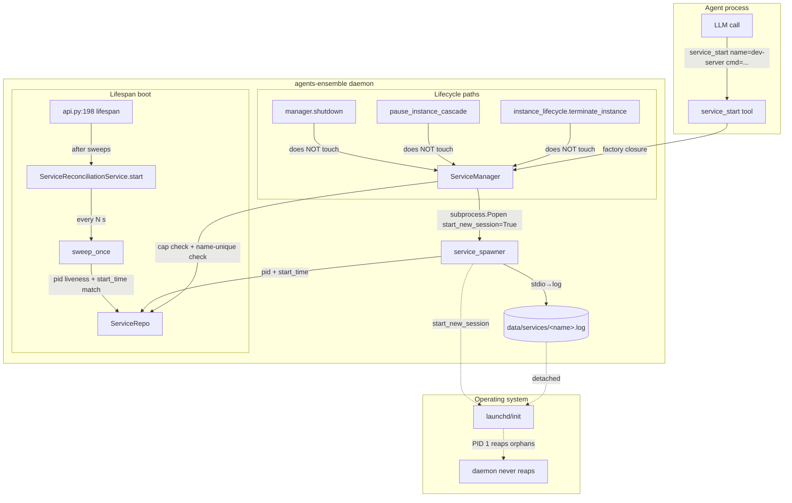

# Technical Analysis: `service` Tool Category for agents-ensemble

Date: 2026-09-15
Author: planner[v2] via technical-analysis worker (re-dispatch; first author)
Analysis depth: deep-dive
Status: Draft — ready for architect review (paired with `decisions.md`)
Verified at SHA: `f6ca8791` (branch `latest`; `feature/service-tool` branched from this commit; worktree currently on `latest` with a foreign session's dirty state — verified file:line ranges on `latest`, not the dirty worktree)
Companion artifacts: `decisions.md` (this directory), 3 research files in the same directory.

---

## Question

> Produce the technical analysis and decision log for a NEW daemon tool category `service` in agents-ensemble. Goal: a `service` category letting agents start LONG-LIVED processes (dev servers, databases, watchers) that (1) live OUTSIDE instance lifecycle — termination, cancellation, cleanup, GC must NEVER kill or reap them; (2) survive daemon restart via boot reconciliation; (3) are NOT OS services (no launchd/systemd/launchctl), purely daemon-managed detached processes.

---

## Context Summary

agents-ensemble is a LangGraph-based multi-agent daemon with a strict instance lifecycle (`RUNNING → PAUSED/COMPLETED/TERMINATED/ERROR/FAILED`), explicit process registries (`BashProcessRegistry` for shell-spawned groups, `BackgroundProcessManager` for `proc_run` handles, `VSCodeServerManager` PID file for code-server), and a centralized shutdown cascade (`manager.shutdown` → `cleanup_all` for proc + bash → `vscode_manager.stop()`). Every OS process the daemon has ever spawned is registered into one of those three registries, and every cleanup is registry-scoped: there is **no** `/proc` walk, no `killpg(0)`, no ppid traversal, no session-wide sweep anywhere in `daemon/` (kill-site inventory in `research-lifecycle-killsites.md`, 13 sites enumerated, all registry-scoped). This makes exemption provable by construction: a process that is *never registered* and that *never joins an existing process group* is unreachable by every kill site found.

The current spawn toolkit (`bash` and `proc_run`) treats processes as instance-owned children: they die with the instance (`instance_lifecycle.py:2330-2354`) and at daemon shutdown (`manager.py:11150-11177`), and both registries are documented crash-recovery leaks (`proc_tools.py:1636-1643`, `bash.py:74-79`). Neither survives a daemon restart. There is one prior art for daemon-managed detached processes: `upgrade_journal.spawn_executor` (`daemon/tools/upgrade_journal.py:1010-1034`), which `subprocess.Popen(start_new_session=True, close_fds=True, stdin=DEVNULL, stdout/stderr→log file)`s the upgrade executor and explicitly *does not register* it — its docstring states the child "must survive BOTH tool-harness teardown and daemon death". That is the architectural precedent for `service`.

Tools are added by a 3-step registration seam: `@register_tool_category("X")` decorator (`daemon/tools/_tool_registry.py:131-156`) → `CATEGORY_MODULES` entry (`:479-525`) → factory call + `tools.extend(...)` in `create_instance_tools()` (`daemon/tools/instance.py:4392-4649`). The decorator also stamps `_tool_category_first_party = True` (`:154`) for spoofing defense. `PRIVILEGED_TOOL_CATEGORIES` (`_tool_registry.py:124-128`) is a `frozenset` of exactly `{system_upgrade, system-log, ens-db}` — adding a fourth entry is a deliberate trust decision and is **double-pinned** by `tests/unit/tools/test_upgrade_registration.py:105-109` AND `tests/unit/tools/test_attestation_registration.py:158-162`; both must update in the same PR. A category NOT in the frozenset is **default-OPEN** to agents with no `tools` config or empty `allow+deny` lists; agents with non-empty `allow` must name the category explicitly (`instance.py:4713-4753`, `:323-341`). There is **no** middle ground today: there is no flag for "default-closed, non-privileged" — see D4 / OQ#1.

Persistence follows a strict dual-dialect discipline: `.sql` migrations are **SQLite-only** (PG runner is intentional NO-OP at `daemon/migrations/runner.py:486-491`; PG evolves via `_ensure_postgres_columns` at `daemon/manager.py:4787`), 3-site index registration is mandatory for every new index (`.sql` + SQLModel `__table_args__` + `_ensure_postgres_columns`, all byte-identical names — pattern at `daemon/migrations/versions/20260906_192100…sql:35-49` + `daemon/repositories/task/models.py:141` + `daemon/manager.py:5409-5412`), and the 20260714 PG-only-DDL trap (`.agents/tester/LESSONS/2026-09-04-fresh-sqlite-boot-migration-20260714-pg-only.md:8-11`) makes `DROP CONSTRAINT IF EXISTS` forbidden in any new `.sql`. The repo convention for new domains is `daemon/repositories/<domain>/{models.py, repository.py}` with sync `sqlmodel.Session` methods (async callers wrap in `asyncio.to_thread`).

---

## Architecture

### Current Patterns (that this analysis must reconcile)

- **3-step tool registration** (`_tool_registry.py:131-156` + `:479-525` + `instance.py:4392-4649`). All three steps required; decorator-only is silently invisible (comment precedent at `instance.py:4586-4592`).
- **PRIVILEGED_TOOL_CATEGORIES frozenset** (`:124-128`, exactly 3 entries today). Adding a 4th requires same-PR pin updates in two test files.
- **Factory-arg pattern** (`instance.py:1814-1833`): every category factory takes a closure context (`get_current_workdir`, `get_current_instance_id`, `caller_agent_id`, `caller_version_tag`). Two layout patterns exist — manager-held service (`manager._mcp_service`, `manager._task_repo`, wired at manager init) vs module-level singleton (`_background_process_manager` at `proc_tools.py:1842`, accessed via `get_background_process_manager()` at `:1845-1852`).
- **Registry-scoped lifecycle**: every spawned process lives in one of `BashProcessRegistry`, `BackgroundProcessManager`, or `VSCodeServerManager`. There is no orphan-reap path except code-server's PID-file-based `attach_existing` (`api.py:1051-1063`).
- **`start_new_session=True` for setpgid/setsid** at spawn time (bash.py:256-258, proc_tools.py:1131-1133, upgrade_journal.py:1032). This is the Python equivalent of the C double-fork+setsid pattern; it makes the child the leader of a brand-new process group and session, so `os.killpg` on the *daemon's* group cannot reach it.
- **PID-ownership defense**: `_verify_pid_ownership` (`proc_tools.py:228-242`, `:918-975`) reads an env tag (`ENSEMBLE_PROC_TRACKING_ID`) from `/proc/<pid>/environ` (Linux) or `ps eww` (macOS) before any kill; aborts on mismatch. This is reusable for service_stop.
- **Boot-time kill-switch observability**: `logger.info("[<Area>] <flag>=%s (env ENSEMBLE_…)", …)` at `load_config` resolution time (precedents: `config.py:3513-3518`, `:3529-3536`, `:3555-3565`, `:3581-3591`). Lazy emits are false-fail for cold-boot log greps (`config.py:3502-3509` S13 reviewer gate).
- **Database persistence**: SQLite+.sql migrations + PG `_ensure_postgres_columns`. ALL writes route through repo methods; raw SQL UPDATE outside a transition is forbidden by C7 write guard (`task/repository.py:39-58, :91-104`).
- **Periodic service loop**: `daemon/services/eligible_pending_sweep.py` is the canonical template — module-level DEFAULT_* constants, idempotent `start()`, `stop(timeout)` with stop-event + cancel/await, public `sweep_once()` + counters, DB reads via `asyncio.to_thread` (`:60-215`).

### Module Boundaries (proposed for `service`)

```
                ┌────────────────────────────────────────────────────────┐
                │            daemon/tools/service_tools.py               │
                │  (decorator + factory + StructuredTool list, default   │
                │   [] when no instance context — proc_tools.py:1872-1900│
                │   pattern)                                             │
                └──────────────┬──────────────────────────────────────────┘
                               │ calls
                               ▼
   ┌────────────────────────────────────────────────────────────────────┐
   │              daemon/services/service_tool/                         │
   │                                                                    │
   │  ┌──────────────────┐    ┌──────────────────┐  ┌────────────────┐  │
   │  │ ServiceManager   │    │ ServiceRepo      │  │ ServiceReconcile│ │
   │  │ (manager-held    │◄───┤ (sync sqlmodel   │  │ (boot sweep,    │ │
   │  │  facade; cap,    │    │  session wrap)   │  │  liveness+start │ │
   │  │  kill helpers,   │    └──────┬───────────┘  │  time match)    │ │
   │  │  tool-call       │           │              └───────┬────────┘  │
   │  │  audit log)      │           │                      │           │
   │  └─────┬────────────┘           │                      │           │
   └────────│────────────────────────│──────────────────────│───────────┘
            │ holds                  │ reads/writes        │ reads/writes
            ▼                        ▼                      ▼
   ┌─────────────────────────────────────────────────────────────────────┐
   │        PostgreSQL ensemble_prod  /  SQLite file-backed (tests)       │
   │        table: service_tracking  (UNIQUE INDEX idx_service_tracking_  │
   │        name + idx_service_tracking_pid for sweep)                   │
   └─────────────────────────────────────────────────────────────────────┘
            ▲
            │ subprocess.Popen(start_new_session=True, …)
            │ stdio → data/services/<name>.log
            │
   ┌────────┴───────────────────┐
   │ daemon/services/           │
   │ service_spawner.py         │  ←— thin Popen wrapper, never
   │ (no state; pure helper)    │      registered in any registry
   └────────────────────────────┘
```

**Boundary rationale:**

- **`service_tools.py`** holds the LangChain `@tool` definitions + factory. Mirrors the exact shape of `daemon/tools/proc_tools.py:1872-1900` (factory returns `[]` when `current_instance_id` is falsy so loader-warm stubs work with `None` manager — `daemon/loader.py:76-90`).
- **`ServiceManager`** is **manager-held** (not a module singleton) because the max-concurrent cap and the reconcile-sweep need to coordinate with the InstanceManager facade and the lifespan boot. This mirrors `_mcp_service` (`instance_lifecycle.py:2324-2326`) and `_task_repo` (`manager.py:690-693`). Module singleton would split the source of truth and break pause-first-then-quiesce coordination.
- **`ServiceRepo`** follows the per-domain pattern (`daemon/repositories/service_tool/{models.py, repository.py}`) per the research checklist; sync methods, `engine.connect()` for reads (no SQLite write-lock hold — `task/repository.py:116-130`), `engine.begin()` for atomic writes.
- **`ServiceReconcile`** is a periodic service in `daemon/services/service_reconciliation.py` mirroring `EligiblePendingSweepService` (`api.py:600-654`, `eligible_pending_sweep.py:60-215`). Sweep = PID liveness + `/proc/<pid>/stat` field 22 start-time match → mark EXITED on mismatch. Hook: lifespan boot after the two sweeps, before vscode (`:656-696` insertion point).
- **`service_spawner.py`** is a thin `subprocess.Popen(start_new_session=True, close_fds=True, stdin=DEVNULL, stdout=log_fh, stderr=STDOUT)` wrapper. It owns **no state** — the caller (ServiceManager) passes it a row and gets back a `(pid, start_time)` tuple. Modeled directly on `upgrade_journal.spawn_executor` (`:1010-1034`); the docstring of that function ("the child must survive BOTH tool-harness teardown and daemon death") is the binding contract.

### Architecture Diagram



### Data Flow

1. **service_start(name, command, cwd?)** →
   - `ServiceManager.start(name, command, cwd)` →
   - cap check (reject if `running_count >= ENSEMBLE_SERVICE_TOOL_MAX_CONCURRENT`) →
   - name-unique check (`SELECT 1 FROM service_tracking WHERE name=? AND status IN ('starting','running')`) →
   - INSERT row with `status='starting'`, `started_by_instance_id=current_instance_id`, `started_by_agent_id=agent_id`, `log_path=data/services/<name>.log` →
   - `service_spawner.spawn(command, log_path)` → `(pid, start_time)` →
   - UPDATE row with `pid`, `start_time`, `status='running'`, `updated_at=now` →
   - log `[ServiceTool] service_started name=<name> pid=<pid>` →
   - return `{name, pid, status: "running", log_path}` to the LLM.
2. **service_stop(name, force=False)** →
   - load row by name →
   - liveness check (`os.kill(pid, 0)`) + start-time match (`/proc/<pid>/stat` field 22 == stored) → fail with `pid_recycled` reason if mismatch (PID-reuse defense, mirrors `_verify_pid_ownership` at `proc_tools.py:228-242`) →
   - `SIGTERM` to pid → wait `_STOP_GRACE_SECONDS=5s` → `SIGKILL` (`force=True` skips TERM) →
   - poll until pid dead or timeout →
   - UPDATE row `status='exited', exit_code=<code>, updated_at=now` →
   - log `[ServiceTool] service_stopped name=<name> pid=<pid> exit_code=<code>` →
   - return `{name, pid, status: "exited", exit_code}` (idempotent: already-exited returns same shape, not error).
3. **service_status(name)** →
   - load row by name →
   - if pid live AND start_time matches → return `{name, pid, status: "running"}` →
   - if pid live BUT start_time mismatch → UPDATE row `status='exited'` (pid was recycled; the original is gone) and return `{status: "exited", reason: "pid_recycled"}` →
   - if pid dead → UPDATE row `status='exited'`, return `{status: "exited"}`.
4. **service_list()** → SELECT all rows ORDER BY created_at DESC; same liveness reconciliation as service_status runs inline so a stale RUNNING row never returns RUNNING if the pid is dead.
5. **service_logs(name, tail_lines=200)** → load row → open log_path, seek to end - N bytes, return last `tail_lines`. No reaping; stdio is owned by the OS.

### Reconcile-on-boot flow

1. Daemon lifespan starts → `ServiceReconciliationService.start()` →
2. First sweep: SELECT all rows where `status IN ('starting','running')` →
3. For each row: `os.kill(pid, 0)` (liveness) + start-time match →
4. Mismatch → UPDATE `status='exited', updated_at=now` + log `[ServiceTool] reconcile_reaped name=<name> pid=<pid> reason=<mismatch|dead>` →
5. Boot log: `[ServiceTool] ServiceReconciliationService started: interval=<N>s (default 90), max_concurrent=<K>` →
6. Continues every N seconds (default 90, configurable).

---

## Integration Points

| # | Integration | Type | Contract | Auth | Failure Mode | File:Line |
|---|-------------|------|----------|------|--------------|-----------|
| 1 | Tool registry (3-step seam) | in-process | decorator + CATEGORY_MODULES entry + `tools.extend(...)` in factory | n/a (daemon-internal) | decorator-only = silently invisible (comment precedent `instance.py:4586-4592`) | `_tool_registry.py:131-156, :479-525` + `instance.py:4392-4649` |
| 2 | `PRIVILEGED_TOOL_CATEGORIES` frozenset | in-process | exact-equality pin tests; if added, update BOTH pins same-PR | `_strip_privileged_category_tools` strips from default-allow (`instance.py:4667-4684`) | silent addition caught by pin tests | `_tool_registry.py:124-128`; pins at `tests/unit/tools/test_upgrade_registration.py:105-109` + `tests/unit/tools/test_attestation_registration.py:158-162` |
| 3 | DYNAMIC_TOOL_NAMES / KNOWN_TOOL_NAMES | in-process | tool names listed in `DYNAMIC_TOOL_NAMES` (`:23-94`); `KNOWN_TOOL_NAMES` regenerated via `discover_source_only_tool_names()` and pasted into frozenset (`:544-548, :559-740`); drift pinned by `test_frozen_tool_name_discovery.py::test_known_tool_names_matches_source_exactly_no_drift` | n/a | new factory-created names produce false "unknown tool" warnings before first instance build | `_tool_registry.py:23-94, :544-548, :559-740` |
| 4 | Loader warm list | in-process | factory module imported; `None`-manager stub built; flattened into `all_tools`; `scan_tools_for_full_docs(all_tools)` | n/a | empty cold-boot system-prompt docs (W1 FIX-NOW incident, comment `:51-57`) | `daemon/loader.py:27-114` (esp. `:58-62, :79-90, :107-112, :114`) |
| 5 | Cold-boot doc regression test | in-process | `tests/test_loader.py::TestMaintenancerToolsDocColdBoot` pattern: snapshot registry, `clear_registry()`, assert each allowed category section appears | n/a | category missing from docs on cold boot | `tests/test_loader.py:966-1042` |
| 6 | Manager facade wiring | in-process | `ServiceManager` constructed in `InstanceManager.__init__` with shared engine; `self._service_tool_manager` exposed | n/a | facade reads via `getattr` (lifespan boot pattern, `api.py:619-635`) | `manager.py:690-693` pattern |
| 7 | SQL migration (.sql) | SQLite-only | dual-dialect DDL only (`CREATE TABLE IF NOT EXISTS`, `CREATE INDEX IF NOT EXISTS`, additive `ALTER TABLE ADD COLUMN`); no `DROP CONSTRAINT`; PG-valid boolean defaults `DEFAULT FALSE` | n/a | fresh-SQLite boot fails on PG-only constructs (20260714 trap) | `daemon/migrations/runner.py:325-406, :472-491`; trap in `.agents/tester/LESSONS/2026-09-04-fresh-sqlite-boot-migration-20260714-pg-only.md` |
| 8 | `_ensure_postgres_columns` (PG) | PG-only | idempotent `IF NOT EXISTS` ADD COLUMN / CREATE INDEX; index name byte-identical across all 3 sites | n/a | PG schema drift if 3-site pattern missed | `daemon/manager.py:4787`; pattern at `:5395-5412` |
| 9 | Boot reconciliation service | asyncio | cloned from `EligiblePendingSweepService`: module-level DEFAULT_* constants, idempotent `start()` / `stop(timeout)`, public `sweep_once()`; DB access via `asyncio.to_thread` | n/a | sweep fails → cascade caught in `sweep_once` errors counter; service continues | `eligible_pending_sweep.py:60-215` |
| 10 | Lifespan boot hook | asyncio | after the sweeps in `daemon/api.py` (~`:656-696` insertion point): lazy import, construct with `getattr(manager, '_service_tool_manager', None)`, floor-check, `start()`, store on `app.state`, boot INFO log | n/a | dependency not wired → `getattr` returns None, skip boot (defensive) | `api.py:619-654` |
| 11 | Lifespan shutdown hook | asyncio | getattr-guarded `await svc.stop()` in lifespan finally-block | n/a | partial-startup safe via `getattr` | `api.py:1367-1397` |
| 12 | Boot-probe log line | log | `logger.info("[ServiceTool] <flag>=%s (env ENSEMBLE_…)")` at `load_config` resolution time, NOT lazily | n/a | cold-boot grep misses flag if lazy | `config.py:3513-3518, :3529-3536, :3555-3565, :3581-3591` |
| 13 | `_resolve_*` resolver | config | precedence env > yaml > default, empty-string safe, strict-parse ValueError on bad value | n/a | pydantic-settings init-kwarg > env inversion trap if resolver missing | `config.py:2702-2770` (precedence); `:3097-3139` (strict-parse); `:3421-3444` (trap) |
| 14 | OS subprocess | kernel | `subprocess.Popen(argv, stdin=DEVNULL, stdout=log_fh, stderr=STDOUT, start_new_session=True, close_fds=True)` | filesystem perms for log_path; env not inherited (controlled by service_spawner) | spawn fails → row stays `status='starting'` until reconcile sweep marks it `exited` | `upgrade_journal.py:1010-1034` (precedent) |
| 15 | /proc start-time verification | kernel | read `/proc/<pid>/stat` field 22 (starttime jiffies) — Linux; `ps -o lstart` — macOS (kernel_start_time in `libproc`); cross-platform helper | n/a | non-Linux non-Darwin: fall back to env-tag approach (`ENSEMBLE_SERVICE_TRACKING_ID` injected into child env, read back from `/proc/<pid>/environ` Linux or `ps eww` macOS — precedent at `proc_tools.py:114-118, :228-242`) | `proc_tools.py:228-242` |

### Integration Details (notable)

**Integration 14 — OS subprocess:** The single most consequential integration. The exemption proof rests entirely on `start_new_session=True` putting the child in a new session+pgid, `close_fds=True` not inheriting daemon fds, and `stdin=DEVNULL` not blocking on a parent reader. The precedent (`upgrade_journal.py:1010-1034`) is annotated with the explicit guarantee: *"the child must survive BOTH tool-harness teardown and daemon death"*. The stdio wiring must point at a **file** (not a pipe) — the bash tool's `:243-255` comment documents the failure mode (backgrounded child holding a pipe write-end → `communicate()` hangs forever). The log file lives at `data/services/<name>.log` (created by the daemon on first start; rotated by an ops-side cron, NOT by the service tool — keeps the tool stateless).

**Integration 13 — `_resolve_*` resolver:** The two relevant patterns are the precedence resolver (`_resolve_proactive_enabled`, `config.py:2702-2770`) for bool flags with env > yaml > default, and the strict-parse resolver (`resolve_injected_notes_absorb`, `config.py:3097-3139`) for env-only booleans that raise ValueError on bad input. The service kill-switch uses the precedence pattern (`ENSEMBLE_SERVICE_TOOL_ENABLED` boolean) PLUS the section-absent branch handling (`config.py:3474-3496`) so configs omitting the YAML section still honor the env. The config knobs (`ENSEMBLE_SERVICE_TOOL_MAX_CONCURRENT`, `ENSEMBLE_SERVICE_TOOL_RECONCILE_INTERVAL`) live in `ServicesConfig` with `Field(ge=1)` constraints so out-of-range values fail at boot (mirroring `eligible_pending_sweep_interval_seconds`).

**Integration 7-8 — Migration + PG mirror:** The new table `service_tracking` needs the 3-site registration: `.sql` migration file in `daemon/migrations/versions/YYYYMMDD_HHMMSS_create_service_tracking.sql` with the dual-dialect header cloned from `20260906_192100_add_task_claim_wake_lane_index.sql:35-39` (including the explicit "plain `CREATE INDEX IF NOT EXISTS` is valid on PostgreSQL AND SQLite" caveat), SQLModel class in `daemon/repositories/service_tool/models.py` with `__table_args__` indexes named byte-identically, AND idempotent statements in `_ensure_postgres_columns` for existing PG databases. The research checklist (`research-persistence-migrations.md:140-152`) is the 11-step ordered recipe; the fixture-gap trap (create_all-built test DB gets current model schema, prod carries legacy DDL) requires a mirror of `test_create_all_vs_migration_chain_difference_documented` (`tests/unit/test_ensure_deferred_schema_pin.py:477`).

**Integration 9-11 — Boot reconciliation service:** The reconcile sweep is a soft periodic check; it must NOT kill anything, only mark rows. This is in deliberate contrast to the bash/proc cleanup_all sweeps that DO kill. The asymmetry reflects the design: `service` is the only category whose processes are explicitly expected to survive instance terminate and daemon shutdown.

---

## Trade-offs

### Alternatives Considered

1. **Option A — `subprocess.Popen(start_new_session=True)` (blocking spawn)** — pure Python, modeled on `upgrade_journal.spawn_executor:1010-1034`. stdio → log file. No asyncio event-loop coupling.
2. **Option B — `asyncio.create_subprocess_exec(start_new_session=True)` (async spawn)** — modeled on `proc_tools.py:1144-1162` and `bash.py:289-305`. stdio → PIPE with reader tasks, or DEVNULL/log file.
3. **Option C — third-party detachment (`python-daemon`, `pexpect`, `sarge`)** — opinionated libraries that handle double-fork themselves. Adds a dependency for a 1-call-site concern.

### Comparison

| Criterion | A (Popen) | B (asyncio.create_subprocess_exec) | C (third-party libs) | Winner |
|-----------|-----------|-----------------------------------|----------------------|--------|
| **Survival semantics** | Same — both use `start_new_session=True` | Same — both use `start_new_session=True` | Same | Tie (all 3 reach the same exemption) |
| **Resource footprint** | No reader tasks; child owns stdio once Popen returns | Reader+exit+timeout tasks per service (precedent at `proc_tools.py:1183-1190`) — extra RAM + event-loop slots | Lib overhead | **A** |
| **Precedent for daemon-managed detached procs** | Direct precedent: `upgrade_journal.spawn_executor:1010-1034` (the ONLY existing precedent for survival) | Indirect — used for short-lived and instance-owned procs (`proc_tools.py:1144-1162`, `bash.py:289-305`); those go through registries | None | **A** |
| **Complexity** | Low — single function, one log file per service | Medium — three async tasks per service, more test surface, more things to leak | High — new dependency | **A** |
| **Maintainability** | Mirrors 1 file (spawn_executor), 50 LOC total | Mirrors 2-3 places (proc/bash reader pattern), 200+ LOC | Lib upgrade churn | **A** |
| **Latency of `service_start` return** | Same — both are immediate at `Popen`/`create_subprocess_exec` | Same | Same | Tie |
| **Log query cost** | O(N) tail — already file-backed | O(N) tail — already file-backed | Same | Tie |
| **Reversibility (switch to B later)** | Easy — replace Popen with create_subprocess_exec; tool API unchanged | Hard to go from B → A without an event-loop rewrite | Easy (but with library churn) | **A** |
| **Team skills** | Stdlib only | Async/await + event-loop tasks | Library-specific | **A** |
| **Cost (infra / license)** | None | None | New dependency surface | **A** |

### Recommendation

**Pick: Option A — `subprocess.Popen(start_new_session=True, close_fds=True, stdin=DEVNULL, stdout=log_fh, stderr=STDOUT)`.**

**Reasoning:** Three of the five comparison criteria favor A decisively (resource, precedent, complexity), three are ties (semantics, latency, log query), and one — reversibility — favors A because the tool API (`service_start` returns `{name, pid, status}`) is independent of the spawn primitive. The `upgrade_journal.spawn_executor` precedent is decisive: it is the only existing call site in the entire daemon that achieves daemon-death-survival, and it uses Option A. Adopting Option B would create a second survival-mode spawn pattern with no incremental benefit. The downside of A — that the spawning thread blocks during Popen — is irrelevant because `service_spawner.spawn` is invoked from `ServiceManager.start`, which is itself invoked from the tool layer that already runs in an async context; the spawn completes in single-digit milliseconds for typical dev-server commands and we accept that.

**Assumptions:** (i) The child does not require interactive stdio (no tty). Service commands are pre-defined argv; if interactive stdio is needed the agent should use `bash` instead. (ii) The log file path is writable by the daemon user. (iii) macOS `start_new_session` semantics match Linux (verified for `subprocess.Popen` — both platforms honor it for the new-session call).

**Reversibility:** Easy — swap `Popen` for `create_subprocess_exec` inside `service_spawner.spawn` without changing the tool API. Cost: medium if reader tasks become desired later (would require an event-loop rewrite).

### Alternatives — Tracking Store

1. **Option 1 — New DB table (`service_tracking`)** — SQLModel models + repository.py + dual-dialect .sql migration + PG `_ensure_postgres_columns` extension. Pattern: `daemon/repositories/task/`.
2. **Option 2 — File-based JSON registry** — `data/services/<name>.json` written on start, read on status. No DB coupling; no migration needed.
3. **Option 3 — Reuse `task` table** — repurpose existing task rows with a `kind='service'` discriminator.

| Criterion | 1 (DB) | 2 (file) | 3 (re-task) | Winner |
|-----------|--------|----------|-------------|--------|
| **Transactional consistency with other daemon state** | Yes — same engine, same `_ensure_postgres_columns`, same reconcile-on-boot via existing sweep pattern | No — split-brain; reconcile must scan fs + check liveness per file | Inherits existing sweep but couples two concerns (work-in-flight + daemon-owned long-lived procs) | **1** |
| **Reconcile-on-boot cost** | One SELECT per sweep | N stat() calls + JSON parse per row | One SELECT | **1** (tied with 3) |
| **Boot-probe log integration** | Trivial — same boot INFO pattern | Requires separate file-existence log | Trivial | 1 / 3 |
| **Coupling** | New repo, new domain — clean | New fs convention outside daemon — drifts | Existing table polluted | **1** |
| **Reversibility** | Easy — drop table on rollback | Easy — rm -rf data/services/ | Hard — disentangle from task table | **1** |
| **Pattern fit** | Direct — research checklist item 1 | Foreign — no precedent in repo | Mixed — pollutes the `task` model | **1** |

**Recommendation: Option 1.** Direct pattern fit, clean rollback, no split-brain, and the DB column types match the new domain (start_time as BIGINT for kernel jiffies on Linux / DateTime on macOS via `ps -o lstart` parse, exit_code as nullable int, etc.) cleanly. Caller's stated preference confirmed.

### Alternatives — Tool Surface

1. **`service_start / service_stop / service_status / service_list`** — minimum viable 4-tool surface.
2. **Add `service_logs`** — tail the log file from a tool call.
3. **Add `service_restart`** — convenience composite of stop+start.
4. **Name-keyed vs pid-keyed** — name vs (pid, start_time).

**Recommendation: 5-tool surface (option 2), name-keyed.** Reasoning:

- `service_logs` is cheap (10-20 LOC: open file, seek, read tail, return text) and is the only way the LLM can diagnose a service that crashed silently. Without it, the LLM must `read_file` the log via the filesystem tool — possible but adds a permissioning hop and breaks the service-tool abstraction.
- `service_restart` is **rejected**: it adds a stop-then-start composite whose semantics diverge when stop succeeds vs fails (half-restart state). Composability is better — the LLM can call `service_stop` then `service_start` and inspect each result.
- Name-keyed semantics are the only safe option: pid is recycled, but the unique name is the agent-visible identifier. `service_stop` internally verifies `(pid, start_time)` match before signaling (PID-reuse defense mirroring `_verify_pid_ownership` at `proc_tools.py:228-242`).

### Alternatives — Security/Privilege Model

1. **(a) Default-open non-privileged** — anyone with no `tools` config or empty `allow+deny` gets it.
2. **(b) Explicit `tools.allow` only (NOT default-open)** — caller-stated lean. Mechanism today: adding to `PRIVILEGED_TOOL_CATEGORIES` is the **only** way to strip a category from default-allow (`_tool_registry.py:124-128` + `_strip_privileged_category_tools` at `instance.py:4667-4684`). There is **no** flag for "default-closed, non-privileged".
3. **(c) Full privileged** — same as (b) but documented as a deliberate trust escalation like ens-db / system_upgrade / system-log.

| Criterion | (a) | (b) | (c) | Winner |
|-----------|-----|-----|-----|--------|
| **Matches owner intent ("explicit allow only")** | No — default-granted | Yes | Yes | (b)/(c) |
| **Same-PR pin test updates required** | None | 2 (upgrade + attestation pin tests) | 2 (same) | (a) (if chosen) |
| **Trust signal clarity** | "any agent can spawn processes" — too permissive | "trusted agents can spawn processes" — clearer | "this is a daemon-internal trust escalation" — clearest | (b)/(c) — (a) understates risk |
| **Risk surface** | Unmanaged detached procs by default — high blast radius | Default-closed; only opted-in agents | Default-closed; only opted-in agents | (b)/(c) |
| **Reversibility** | Easy — add to frozenset later | Hard — requires explicit-allow opt-in by every affected agent | Hard — same as (b) | (a) |
| **Cost** | Zero code (no frozenset change) | 1-line frozenset add + 2-pin test update | Same as (b) | (a) (if chosen) |

**Recommendation: (b) "explicit tools.allow only" — implemented via PRIVILEGED_TOOL_CATEGORIES addition. This is functionally equivalent to (c) today, but framed as "default-closed opt-in" rather than "trust escalation". The distinction matters because the existing 3 privileged categories are framed around break-glass / direct-DB / restart authority, while `service` is framed around "agents opt into spawning long-lived processes". When the architect reviews, the framing can be tightened (the code change is identical either way).**

This decision **requires** updating BOTH pin tests in the same PR:
- `tests/unit/tools/test_upgrade_registration.py:105-109`
- `tests/unit/tools/test_attestation_registration.py:158-162`

**The mechanism gap (OQ#1)** is: today there is no way to express "default-closed, opt-in via allow, NOT a daemon-internal trust escalation". Every default-closed category must go through the privileged frozenset, which triggers the deny-rule scaffolding in `_strip_privileged_category_tools` even if the operator doesn't want deny rules for this category. This is a code-shape gap, not a feature blocker; flag for a future PR if architect agrees.

### Alternatives — Abuse Guards

| Guard | Decision |
|-------|----------|
| Max concurrent services per daemon | YES — `ENSEMBLE_SERVICE_TOOL_MAX_CONCURRENT` (default 10, env > yaml > default). Enforced in `ServiceManager.start` before INSERT. Configurable; tight enough to limit blast radius, loose enough for typical agent use. |
| Name uniqueness | YES — `UNIQUE INDEX idx_service_tracking_name` on `(name)` partial-filtered for `status IN ('starting','running')`. Plus a Python check in `ServiceManager.start` for fast-fail before spawn. |
| PID-reuse detection | YES — `service_stop` verifies `(pid, start_time)` matches the row. If pid is dead OR start-time mismatches, refuse to kill and mark EXITED. Uses `/proc/<pid>/stat` field 22 on Linux, `ps -o lstart` parse on macOS. |
| Zombie/orphan handling | Detached procs reparent to launchd/init (kernel behavior). Daemon does NOT reap — there is no reap path and there should not be one (it would mean walking /proc, which violates the architectural constraint). `ServiceReconciliationService` only marks rows EXITED, never sends signals. |
| Stop-idempotency | YES — `service_stop` on an already-exited row returns the stored exit shape, not an error. Mirrors the precedent in `vscode_server_manager.stop` (K9 exit path). |
| Command allowlist | **NO** — out of scope for v1. The agent already has `bash` and `proc_run` which can run any command; restricting service commands but not bash/proc commands would be a security theater. If the operator wants a sandbox, that's a separate feature (F2 in follow-ups). |

### Alternatives — Restart Reconciliation

| Approach | Decision |
|----------|----------|
| Commit-and-fork on boot — daemon re-spawns services it had running | NO — re-spawning is racy (the old process may still be alive; the command may have side effects; the cwd may no longer exist). The contract is re-attach-or-mark-dead, not re-spawn. |
| Read-only sweep — daemon observes but does not re-adopt | NO — leaves the user with "I have no idea which PIDs are my services" post-restart. |
| Sweep + mark-dead (recommended) | YES — on boot, scan rows in `starting`/`running`, verify pid liveness + start-time, mark dead rows EXITED. Live rows stay RUNNING with no extra daemon handle. Boot INFO log announces the sweep started + per-sweep reconcile_reaped count. |

### Alternatives — Observability

| Surface | Decision |
|---------|----------|
| Start/stop/reconcile log lines | YES — `[ServiceTool] service_started/Stopped/Reaped/Reconcile name=… pid=… (reason)` at INFO. |
| Boot-probe per convention | YES — `[ServiceTool] service_tool_enabled=%s (env ENSEMBLE_SERVICE_TOOL_ENABLED), max_concurrent=%s, reconcile_interval=%ss` at `load_config` resolution time, NOT lazily (`config.py:3502-3509`). |
| Kill-switch | YES — `ENSEMBLE_SERVICE_TOOL_ENABLED` (default ON, `_resolve_*` resolver wired per `config.py:2702-2770`). Plus `ENSEMBLE_SERVICE_TOOL_MAX_CONCURRENT` (int, default 10) + `ENSEMBLE_SERVICE_TOOL_RECONCILE_INTERVAL` (int seconds, default 90, `Field(ge=1)` constraint). |
| Telemetry counters | DEFERRED — no `errors` / `started` / `stopped` counter exposed in v1; the per-call log line is enough. If the operator wants telemetry, that's a v2 ticket. |

---

## Scalability

### Growth Assumptions

- **Concurrent services per daemon**: 1-10 typical (one dev server + one DB + a watcher per agent), up to the cap (default 10). At cap: `service_start` rejects with `cap_exceeded` reason.
- **Total services across daemon lifetime**: unbounded (rows accumulate; cleanup is operator-side or a v2 GC).
- **Log file size per service**: unbounded (operator-side logrotate; the tool does NOT rotate).
- **Reconcile sweep frequency**: 1 sweep / 90s default × N rows = O(N) syscall cost per sweep. N=10 rows × 2 syscalls (`os.kill(pid, 0)` + `ps -o lstart`) = 20 syscalls / 90s = negligible.
- **Multi-daemon**: out of scope. A second daemon pointing at the same DB would see the same rows and could kill-detach another daemon's services. Document as OQ#4.

### Current Bottlenecks

| # | Bottleneck | Threshold | File:Line | Impact |
|---|------------|-----------|-----------|--------|
| 1 | `service_start` blocks the agent's graph task for Popen duration | typical dev-server command ~5-50ms; pathological `npm install` style commands could be 10s+ | `service_spawner.spawn` (new) | Agent's tool call latency. Mitigation: not in v1; if it becomes an issue, move spawn to a fire-and-forget asyncio task that pokes the row when done. |
| 2 | `service_stop` waits up to 5s for SIGTERM → SIGKILL escalation | per-stop 5s timeout (`_STOP_GRACE_SECONDS`, mirroring `proc_tools.py:106`) | `service_spawner.stop` (new) | Agent's tool call latency. Managed (caller can pass `force=True` to skip TERM). |
| 3 | Reconcile sweep does 2 syscalls per row | 10 rows × 2 syscalls / 90s = ~0.2 syscalls/s; macOS `ps -o lstart` is slow (~10ms each) so 10 rows × 10ms = 100ms sweep wall time | `service_reconciliation.py::sweep_once` (new) | Negligible at default cap. |
| 4 | Log file tail in `service_logs` reads the whole file if smaller than tail_bytes | O(file_size); degenerate if log file is 1GB+ | `service_tools.py::service_logs` (new) | OOM risk. Mitigation: hard cap `MAX_LOG_TAIL_BYTES = 10MB` (read last 10MB only); operator-side logrotate is the long-term answer. |

### Scaling Characteristics

- **Vertical vs horizontal**: stateless spawner (no shared memory); manager-held singleton (single instance per daemon). Horizontal scaling would require a shared external store and is out of scope.
- **Stateless vs stateful**: state lives in the DB (`service_tracking` table) + the OS process table (PIDs). No daemon-in-memory state that needs HA replication.
- **Sync vs async**: spawn is sync Popen (option A); reconcile is async periodic loop; tool calls are async (`@tool` in async context).
- **Scaling cliffs**: cap=10 is a policy choice, not a scaling cliff. The architecture supports cap=100 trivially (sweep cost is linear). The cliff would be reached when reconcile sweep wall time exceeds the interval (e.g., 90s interval with 1000 rows × 10ms ps = 10s sweep = 11% interval utilization — still fine). 10000 rows × 10ms = 100s sweep > 90s interval — would need parallelization or batching.

---

## Technical Debt

### Items Affecting This Analysis

| # | Debt Item | Impact on Recommendation | Severity | File:Line |
|---|-----------|--------------------------|----------|-----------|
| 1 | No way to mark a category "default-closed, non-privileged" — only the privileged frozenset toggles default-open | Forces `service` to be added to `PRIVILEGED_TOOL_CATEGORIES` to satisfy owner intent; that triggers 2 same-PR pin updates and the deny-rule scaffolding. Flagged as OQ#1 for future cleanup. | Low (workaround is one-line frozenset add) | `_tool_registry.py:124-128`; `_strip_privileged_category_tools` at `instance.py:4667-4684` |
| 2 | Fresh-SQLite boot broken on PG-only DDL (20260714 trap) | Affects the migration design: must use dual-dialect DDL only (no `DROP CONSTRAINT`, `DEFAULT FALSE` for booleans). Documented and mitigated by 11-step research checklist. | Low (well-documented, mitiable) | `.agents/tester/LESSONS/2026-09-04-fresh-sqlite-boot-migration-20260714-pg-only.md`; pattern at `daemon/migrations/versions/20260906_192100…sql:35-49` |
| 3 | Bash/proc registries are documented crash-recovery leaks | None for service (by design — service must survive restart); but the precedent for "in-memory registries are not durable" is the reason the new feature needs a DB table. | n/a (context only) | `proc_tools.py:1636-1643`, `bash.py:74-79` |
| 4 | `research-persistence-migrations.md:95` flags `ENSEMBLE_REPAIR_ENABLED` as UNVERIFIED in daemon/ source | VERIFIED at `daemon/tools/ens_db_tools.py:125` (KILL_SWITCH_ENV constant), `:134` (env precedence doc), `:735` (kill-switch section). The research flag was a false alarm; correcting the record. | n/a (corrected) | `daemon/tools/ens_db_tools.py:27, :125, :134, :735`; `agents/maintenancer/ROLLOUT.md:409-423` |
| 5 | pydantic-settings init-kwarg > env inversion trap | Forces every new bool flag to have an explicit `_resolve_*` resolver. Mitigated by following the research checklist item 6. | Low (well-documented, mitiable) | `config.py:2702-2770, :3421-3444` |
| 6 | No automated verify that a new category is fully registered | The 3-step seam allows silent partial registration (decorator-only, no CATEGORY_MODULES entry, no extend in factory). Mitigated by the 10-step checklist + the loader warm-list test. | Medium (architectural hazard) | `instance.py:4586-4592` (comment precedent) |
| 7 | `daemon/sources/`, `daemon/clients/`, `daemon/repositories/` not individually swept for kill primitives in the lifecycle-kill-site research | The research flagged it UNVERIFIED. There is no architectural reason for kill primitives there (HTTP/DB layers), but the gap means a future contributor adding a kill site in `daemon/clients/` (e.g., to a process owned by an MCP server) could break the service exemption. | Low (architectural fence: new kill sites must respect the registry-scoped invariant) | `research-lifecycle-killsites.md:201-204` |

### Items NOT Affecting This Analysis

- The 5 pre-existing failures in `TestAccessMemoryArchive` (`tests/unit/tools/test_archive_lifecycle.py`) — unrelated, quarantined.
- Empty-response-guard, recovery-ladder P1/P2, stream-stall watchdog, etc. — all daemon-internal symptom-repair, no overlap with service tool.
- WC-park / pending-orphan sweep — different domain, no overlap.
- The recursive graph-task lineage (P1 restart activated 2026-09-14) — orthogonal.
- Resume-router ×4-dup fix (ca14e233) — different domain.

### Recommended Paydown

In priority order (only items that affect this analysis):

1. **Before merge:** Verify the kill-site inventory by re-reading `daemon/services/vscode_server_manager.py:458, 697` and `daemon/services/git_diff_service.py:119` — these are the most likely future contributors of new kill sites. Confirm the registry-scoped invariant is documented in code comments at those sites (or add a comment block).
2. **Before merge:** Add an entry to `.agents/tester/PACKS.md` for the new PG smoke pack (`test/packs/service_tool_pg_smoke_integration_test.sh`) mirroring the `ensure_deferred_pg_smoke_integration_test.sh` pattern.
3. **Same-PR with `service` introduction:** OQ#1 — discuss with architect whether to introduce a `DEFAULT_OPEN = True|False` per-category attribute (a small refactor of `_strip_privileged_category_tools` + `_apply_tool_filter`). If approved, follow up post-merge.
4. **Post-merge:** Add a CODEOWNERS rule that any new `os.killpg` / `os.kill` / `killpg(0)` / `/proc` walk call site requires review from the daemon-architecture team (fence against the kill-site inventory going stale).
5. **Post-merge:** Document the "services are kill-exempt" invariant in `docs/architecture/instance-lifecycle.md` (or wherever the canonical lifecycle doc lives) so future contributors don't accidentally add a service-cleanup step to `cleanup_all`.

---

## Open Questions (escalate to architect)

1. **OQ#1 — Default-closed non-privileged category mode.** Today, the only way to gate a category out of default-allow is `PRIVILEGED_TOOL_CATEGORIES`. For `service`, this triggers the deny-rule scaffolding in `_strip_privileged_category_tools` even though we don't want deny rules. Should we introduce a per-category `default_open: bool = True` attribute (default-true for backward compat) so `service` can be opt-in without going through the privileged frozenset? Cost: ~10 lines in `_tool_registry.py` + `_apply_tool_filter`. Reversible.
2. **OQ#2 — Multi-daemon against the same DB.** Two daemon instances pointed at the same `ensemble_prod` DB will both observe (and `service_stop` can kill) each other's services. Today's docs implicitly assume single-daemon. Should the `service_tracking` table include a `daemon_instance_id` column and `service_stop` verify it? Or document the constraint as single-daemon-only?
3. **OQ#3 — Log rotation.** `service_logs` tail reads are unbounded above (capped to 10MB in v1). Should the tool own log rotation, or should that be operator-side (launchd / cron)? Operator-side is simpler but requires operator knowledge; tool-side is autonomous but adds complexity (file descriptor state, race conditions on rotate).
4. **OQ#4 — Service command sandboxing.** The agent passes any command; if the agent is compromised, it can spawn arbitrary detached processes. Bash and proc_run have the same surface — is the assumption that "agent sandboxing is out of scope" holding? If yes, `service` is no worse. If no, what's the sandbox layer?
5. **OQ#5 — Cross-platform start-time verification.** Linux: `/proc/<pid>/stat` field 22 (starttime in clock ticks since boot). macOS: `ps -o lstart` (parse the human timestamp). Windows: not in v1 scope (Windows not a daemon target). Is macOS `ps -o lstart` parse acceptable, or should we use `libproc` directly? Note: `_verify_pid_ownership` already uses `ps eww` (`proc_tools.py:355`), so the precedent is "ps is acceptable".
6. **OQ#6 — `service_stop` semantics on `force=True`.** Currently `force=True` skips SIGTERM and goes straight to SIGKILL (mirroring `proc_stop`'s `:1340-1343`). Should `force=True` also skip the 5s grace period entirely (send SIGKILL, no wait)? Today's `proc_stop` waits 5s for SIGKILL to take effect regardless. Pick one for consistency.
7. **OQ#7 — `service_logs` output format.** Plain text tail (current plan)? Structured JSON-lines if the service writes JSON? The latter requires the tool to know the format, which couples the tool to the service's output schema. Recommendation: plain text tail; if the LLM wants structured, it can post-process.

---

## References

### Internal (file:line evidence)

- Tool registration seam — `daemon/tools/_tool_registry.py:131-156` (decorator), `:479-525` (`CATEGORY_MODULES`), `:124-128` (`PRIVILEGED_TOOL_CATEGORIES`); `daemon/tools/instance.py:4392-4649` (factory + extend).
- Pin tests — `tests/unit/tools/test_upgrade_registration.py:105-109`; `tests/unit/tools/test_attestation_registration.py:158-162`; `tests/unit/tools/test_frozen_tool_name_discovery.py::test_known_tool_names_matches_source_exactly_no_drift`.
- Privileged-strip helper — `daemon/tools/instance.py:4667-4684` (`_strip_privileged_category_tools`); `:4713-4753` (filter call sites); `:323-341` (`resolve_tool_filter` category-skip).
- Bash tool — `daemon/tools/bash.py:111-119` (registry singleton); `:256-258` (start_new_session); `:289-305` (spawn); `:315-321` (PGID capture); `:138-186` (`_kill_process`); `:369-395` (cancellation path); `:74-79` (documented limitations).
- Proc tool — `daemon/tools/proc_tools.py:1838-1852` (manager singleton + accessor); `:1131-1133` (start_new_session); `:1144-1162` (spawn); `:1537-1620` (cleanup_instance); `:1621-1670` (cleanup_all); `:228-242` (PID ownership); `:918-1035` (kill helper); `:1264-1400` (stop_process).
- Lifecycle kill sites — `daemon/services/instance_lifecycle.py:2277, :2292, :2330-2354` (terminate); `:3151-3173` (pause cancel, no registry cleanup); `daemon/manager.py:11144-11177` (shutdown cleanup_all); `daemon/api.py:1367-1397` (lifespan shutdown); `daemon/tools/upgrade_journal.py:1010-1034` (precedent for detached, unregistered spawn).
- Persistence — `daemon/migrations/runner.py:325-406` (transactional application); `:472-491` (PG NO-OP); `daemon/manager.py:4787` (`_ensure_postgres_columns`); `:5395-5412` (3-site index pattern); `daemon/repositories/task/{models.py, repository.py}` (new-domain pattern).
- Boot service — `daemon/services/eligible_pending_sweep.py:60-215` (template); `daemon/api.py:600-654` (lifespan boot); `:1367-1397` (lifespan shutdown).
- Config — `daemon/config.py:2702-2770` (`_resolve_proactive_enabled`); `:3097-3139` (strict-parse); `:3421-3444` (pydantic trap); `:3502-3591` (boot-probe emit pattern).
- Loader — `daemon/loader.py:27-114` (warm list); `tests/test_loader.py:966-1042` (cold-boot test).

### Project context

- `agents/worker/soul.md` — worker agent definition (this analysis is being written BY worker via the technical-analysis skill).
- `.agents/shared/planning/spawn-intelligence-override/decisions.md` — sibling decisions.md precedent (style template).
- `.agents/tester/LESSONS/2026-09-04-fresh-sqlite-boot-migration-20260714-pg-only.md` — SQLite migration trap.
- `.agents/shared/context.md` — current project state (charter-reuse, resume-router, recovery-ladder P1/P2, empty-response-guard, etc., all activated 2026-09-14 11:46+07).

### Skill applied

- `technical-analysis` (skill id `cb14c9bc-0583-469b-98cd-aea72c6fdd7d`) — applied for the mandatory Analysis Format and the 5-dimension coverage (Architecture / Integration Points / Trade-offs / Scalability / Technical Debt). Improvement note: skill template produces one deliverable; this analysis pairs with a sibling `decisions.md` per project convention — the skill should mention the dual-deliverable pattern.
