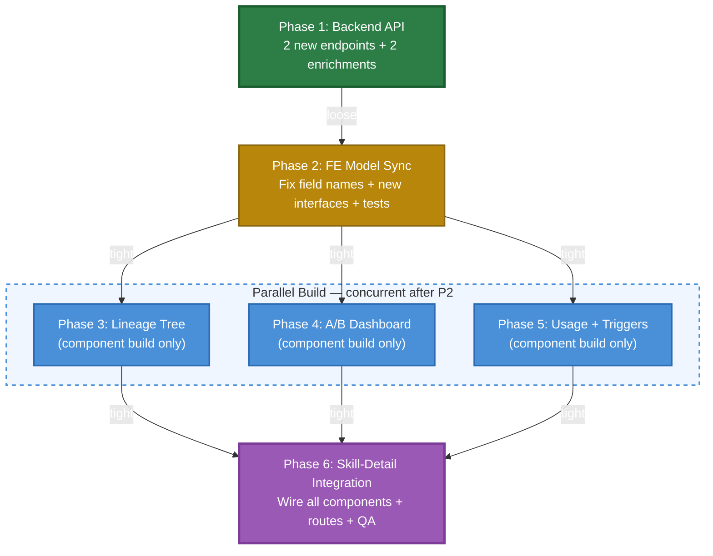

# Plan Overview: Skill Evolution UI

## Objective
Visualize how skill evolution worked on the frontend — showing evolution lineage trees, A/B testing results with composite scores, usage history/metrics, and trigger management. The backend needs 2 new API endpoints + 2 existing endpoint enrichments; the frontend needs model sync + significant visual upgrades.

## Scope Assessment
**LARGE** — 2 backend endpoints + 2 enrichments (repository/service methods already exist, mostly API wiring), frontend TypeScript model sync (4 interfaces updated/fixed, 5 new interfaces), 4 new visual components (lineage tree, A/B analytics, usage timeline, trigger management), 2 new service methods, new routes, and a reusable Mermaid wrapper component.

**Justification**: Touches 2 backend files (router + metrics service) and 12+ frontend files (models, services, routes, 6+ new components, 1 modified detail page). The visualization work is the bulk — requiring custom Angular components with Mermaid integration. Backend is mostly wiring since the heavy logic already exists.

## Context
- **Project**: agents-ensemble
- **Working Directory**: `/Users/nguyenminhkha/All/Code/opensource-projects/agents-ensemble`
- **Framework**: Angular 21 standalone components with signals; Angular Material M3; Mermaid v11.4.0 (globally configured)
- **Backend**: FastAPI + SQLModel; PostgreSQL primary (dual SQLite/PG support required)

---

## Verified Current State (from source code exploration)

### Backend — Architecturally Complete
| Component | Status | File | Line |
|-----------|--------|------|------|
| `get_ab_comparison_stats()` | ✅ Exists, NOT exposed via API | `daemon/services/skill_metrics_service.py` | 945 |
| `get_by_skill(limit, offset)` | ✅ Exists, NOT exposed via API | `daemon/repositories/skill/repository.py` | 998 |
| Composite score formula | ✅ Computed, exposed only via `/ab-test` | `daemon/services/skill_metrics_service.py` | 1184-1254 |
| `change_summary` + `content_diff` | ✅ In DB model, returned by repo, but **stripped** by `_flatten_lineage_view()` | `daemon/routers/skills.py:263-310` | |
| `SkillTrigger` model | ✅ Exists, uses `condition_type`/`condition_json` (NOT `trigger_type`/`trigger_config`) | `daemon/repositories/skill/models.py` | 447-512 |

### Backend Work (Phase 1 — 2 new endpoints + 2 enrichments)
1. `GET /api/skills/{id}/usage-records` — paginated usage records (NEW endpoint)
2. `GET /api/skills/{id}/ab-test/stats` — full A/B stats with composite scores (NEW endpoint)
3. **[W2]** Extend `get_ab_comparison_stats()` response: add per-variant `applied_rate`, `fallback_rate`, `avg_iterations`, `avg_duration` (data already computed internally)
4. **[W3]** Add `sample_size` (`ab_sample_size` config value) to `get_ab_comparison_stats()` response
5. **[C1]** Extend `GET /api/skills/{id}/lineage` to return `change_summary` + `content_diff` per edge (fix `_flatten_lineage_view` stripping)

### Frontend — Verified Gaps
| Gap | Detail |
|-----|--------|
| **[C2]** `SkillMetrics` field names WRONG | FE declares `total_selections/applied/completions/fallbacks` but BE returns `selected/applied/completions/fallbacks`. Currently `undefined` at runtime. |
| `Skill` interface | Missing `auto_load`, `source_skill_bank_id` |
| `SkillLineage` | parents/children typed as flat `Skill[]` — no edge metadata |
| Missing interfaces | `SkillUsageRecord`, `SkillTrigger`, `SkillAbTestStats` |
| `skill.service.ts` | No `getUsageRecords()`, `getAbTestStats()`, no trigger methods |
| Lineage rendering | Flat `
` lists only — no graph/tree |
| A/B test display | Basic status only — no composite scores, no per-variant comparison |
| Usage history | Does not exist |
| Trigger management | Does not exist (BE endpoints exist) |
| Mermaid wrapper | No reusable non-chat component |
| ng-zorro-antd | Installed but 0% used — do NOT adopt |

### [S1] Naming Convention
**No HTTP interceptor exists.** The frontend uses `provideHttpClient()` with zero arguments. All models use **snake_case** matching the backend directly. Use snake_case for all new interfaces.

---

## Phase Index

| Phase | Name | Objective | Dependencies | Coupling | Est. Time |
|-------|------|-----------|-------------|----------|-----------|
| 1 | Backend API Endpoints + Enrichments | 2 new endpoints + extend ab-test/stats response + enrich lineage with edge metadata | None | — | 2-3h |
| 2 | Frontend Model Sync + Bug Fix | Fix `SkillMetrics` field names, update interfaces, add new interfaces + service methods + tests | Phase 1 (loose) | loose | 2-3h |
| 3 | Lineage Tree Component | Mermaid-based skill evolution tree component with edge metadata (**build only**) | Phase 2 | tight | 3-4h |
| 4 | A/B Test Dashboard Component | Composite score display, per-variant comparison, winner viz (**build only**) | Phase 2 | tight | 3-4h |
| 5 | Usage History + Trigger Components | Usage timeline table + trigger CRUD with dynamic config schema (**build only**) | Phase 2 | tight | 3-4h |
| 6 | Skill-Detail Integration | Wire all components into `skill-detail.component.html`, add routes, final QA | Phases 3, 4, 5 | tight | 2-3h |

### Coupling Assessment

| Phase Pair | Coupling | Rationale |
|------------|----------|-----------|
| 1 → 2 | **loose** | Phase 2 needs Phase 1's response shapes, but can code against documented contracts before Phase 1 ships |
| 2 → 3 | **tight** | Phase 3 imports `SkillLineageNode` interface from Phase 2 |
| 2 → 4 | **tight** | Phase 4 imports `SkillAbTestStats` interface from Phase 2 |
| 2 → 5 | **tight** | Phase 5 imports `SkillUsageRecord`, `SkillTrigger` from Phase 2 |
| 3 ↔ 4 ↔ 5 | **independent** | Each creates only NEW component files — no shared files. **Can run in parallel.** |
| 3, 4, 5 → 6 | **tight** | Phase 6 integrates all three component sets into shared `skill-detail.component.html` |

### [W1] Phase Scheduling — Revised

**Phases 3, 4, 5 build only NEW files and can run in parallel.** The original plan incorrectly claimed they could modify `skill-detail.component.html` concurrently. The fix:

- **Phases 3-5 are component-build-only** — they create standalone components with well-defined `input()`/`output()` APIs
- **Phase 6 is the integration phase** — it imports all three components and wires them into `skill-detail.component.html`, adds routes, and does final QA
- This eliminates the parallel-write conflict on shared files

**Optimal scheduling:**
1. Phase 1 (BE) + Phase 2 (FE model sync) — can overlap (loose coupling)
2. Phase 2 completes → Phases 3, 4, 5 run in parallel (component build)
3. All components built → Phase 6 (integration)

---

## Visualization Approach Decision

### Lineage Tree: **Mermaid** (justified)

| Option | Pros | Cons | Verdict |
|--------|------|------|---------|
| **Mermaid** (✅ chosen) | Already installed (v11.4.0), globally configured, `MermaidActionsService` for copy/fullscreen, zero new dependencies, handles graph layout automatically | Limited interactivity (click-through requires DOM listeners, see [S2]) | ✅ **Chosen** — best ROI |
| ng-zorro NzTreeModule | Interactive expand/collapse | 0% currently used, requires bring-up, tree ≠ graph, only handles hierarchical trees | ❌ Wrong tool |
| Custom D3/custom SVG | Full control, interactive | Major build effort, no charting lib installed | ❌ Overkill |

**Mermaid approach**: Generate a `graph TD` Mermaid string from lineage data, render via `<markdown [data]="mermaidSource" mermaid>`. Nodes = skills (styled by generation/status), edges = parent→child with `change_summary` labels.

**[S2] Mermaid click limitation**: Mermaid's `click nodeId callback` requires a globally accessible function — doesn't work with Angular component methods. Workaround: attach DOM event listeners to rendered SVG `.node` elements, or provide a fallback legend/list below the graph for navigation.

### Metrics/A/B Scores: **Custom Angular Material tiles + progress bars**
Extend existing metrics dashboard pattern. No charting library needed.

### Usage History: **Material table with pagination**
Standard `MatTable` + `MatPaginator` + `MatSort`. No external table lib.

---

## Risks & Mitigations

| Risk | Impact | Mitigation |
|------|--------|------------|
| Mermaid graph too large for deep lineage trees | medium | Generation-depth limit (configurable, default 5). "View Full Tree" expand using Mermaid fullscreen dialog. |
| Composite score baselines may not exist for new projects | medium | `get_ab_comparison_stats` handles missing baselines (returns zeros). UI shows "insufficient data" state. |
| A/B test endpoint returns null when no active test | low | Already handled — return `{skill_id, ab_test_group: null, stats: null}`. |
| ng-zorro temptation (installed but unused) | low | **Do NOT adopt ng-zorro.** Stay with Angular Material for consistency. |
| Lineage edge metadata (`change_summary`) may be empty for auto-evolved skills | medium | Show "Auto-evolved" placeholder when empty. Display `content_diff` in expandable section. |
| Dual SQLite/PostgreSQL support for new endpoints | low | Repository methods already exist and are tested. No new SQL needed. |
| **[W1]** Parallel phases modifying same files | ~~high~~ → **resolved** | Phases 3-5 build components only (NEW files). Integration centralized in Phase 6. |
| **[S2]** Mermaid click callback incompatibility with Angular | medium | Use DOM event listeners on SVG nodes, or fallback legend list for navigation. |
| **[C2]** Pre-existing SkillMetrics field name mismatch causes undefined values | high (existing bug) | Fixed in Phase 2: rename fields + update template bindings + add contract test to prevent regression. |

---

## Success Criteria
- [ ] `GET /api/skills/{id}/usage-records` returns paginated records with `total` count
- [ ] `GET /api/skills/{id}/ab-test/stats` returns composite scores + per-variant metrics + `sample_size`
- [ ] `GET /api/skills/{id}/lineage` returns `change_summary` + `content_diff` per edge
- [ ] **[C2]** `SkillMetrics` interface field names match backend (`selected`, `applied`, `completions`, `fallbacks`)
- [ ] FE TypeScript interfaces match all BE response fields (verified via contract tests)
- [ ] Skill detail page shows Mermaid lineage tree with edge metadata
- [ ] A/B test panel shows composite scores per variant + winner indication + dynamic sample size
- [ ] Usage history table paginates and sorts
- [ ] Trigger management UI performs full CRUD with dynamic config schema per condition_type
- [ ] All new components use Angular signals pattern (input/output/computed/effect)
- [ ] Mermaid diagrams support copy SVG/PNG + fullscreen via `MermaidActionsService`
- [ ] No new npm dependencies added (reuse Mermaid + Material)
- [ ] Phase 6 integration: all components wired into skill-detail page, routes added, QA passing

---

## Tracking
- **Created**: 2026-07-16
- **Last Updated**: 2026-07-16 (revision 2 — addressed C1, C2, W1-W4, S1-S3)
- **Status**: draft
