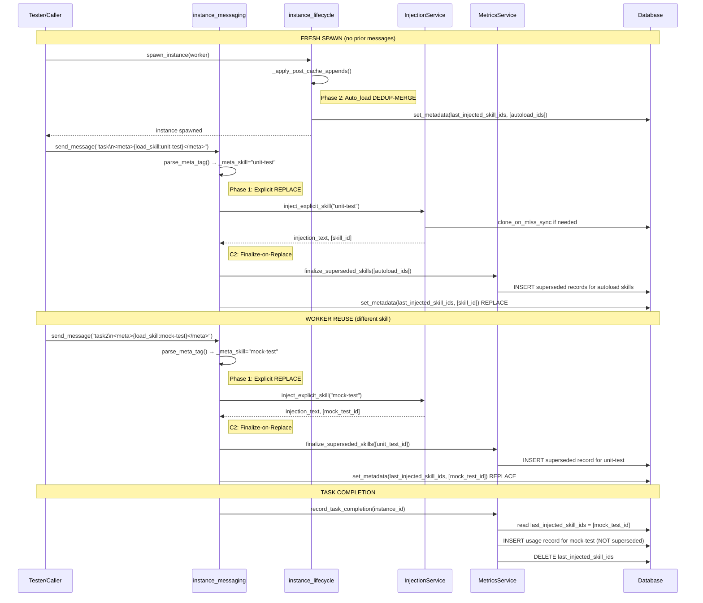

# Working Notes — Skill-Per-Worker Milestone 2

## Meta Tag Parsing Implementation Detail (C1 FIXED)

### The Exact Parsing Logic (Revised)

The `<meta>` tag is parsed using a security-hardened approach: **find all matches** → **last-wins** → **JSON parse** → **strip all tags**.

#### Regex (C1 Fix)

```python
_META_TAG_RE = re.compile(r"<meta>(.*?)</meta>", re.DOTALL | re.IGNORECASE)
```

**Why this regex is correct (C1 fix):**
- Captures EVERYTHING between `<meta>` and `</meta>` — lets `json.loads` handle brace matching
- The previous `\{.*?\}` regex stopped at the FIRST `}`, truncating nested JSON like `{"load_skill":"x","opts":{"nested":true}}`
- `DOTALL` — `.` matches newlines (JSON may span multiple lines)
- `IGNORECASE` — `<META>` or `<Meta>` also match

#### Full Parser (Security-Hardened)

```python
_META_TAG_RE = re.compile(r"<meta>(.*?)</meta>", re.DOTALL | re.IGNORECASE)
_ALLOWED_META_KEYS = frozenset({"load_skill"})

def parse_meta_tag(text: str) -> tuple[str, dict | None]:
    matches = list(_META_TAG_RE.finditer(text))
    if not matches:
        return text, None
    last = matches[-1]
    try:
        data = json.loads(last.group(1).strip())
        if not isinstance(data, dict):
            return text, None
    except json.JSONDecodeError:
        return text, None
    cleaned = _META_TAG_RE.sub("", text).rstrip()
    return cleaned, data
```

**Security features:**
1. `isinstance(data, dict)` guard — rejects arrays, strings, numbers, null
2. Schema allow-list (`_ALLOWED_META_KEYS`) — unknown keys logged + ignored
3. Last-wins policy for multiple tags — only the LAST valid tag's data returned
4. ALL tags stripped (even malformed) — agent never sees control data
5. Audit log — every processed tag logged at INFO level

---

## C3 — Canonical Ordering Sequence Diagram

The two injection paths (Phase 1 explicit + Phase 2 auto_load) operate at different lifecycle stages. This is the full message lifecycle showing both paths:



**C3 Key invariants:**
1. Explicit `<meta>` injection (Phase 1) uses REPLACE — establishes authoritative skill scope
2. Auto_load (Phase 2) uses DEDUP-MERGE — additive onto explicit set, never drops explicit skills
3. "Explicit skills are authoritative; auto_load is additive."

---

## C2 — Usage Record Lifecycle with SUPERSEDED

```
┌──────────────────────────────────────────────────────────────────┐
│ USAGE RECORD LIFECYCLE                                           │
│                                                                  │
│  ┌─────────────────┐     ┌──────────────────┐                   │
│  │   INJECTED      │────▶│   ACTIVE         │                   │
│  │ skill loaded    │     │ task running     │                   │
│  │ into context    │     │ with skill       │                   │
│  └─────────────────┘     └───────┬──────────┘                   │
│                                  │                               │
│                    ┌─────────────┼─────────────┐                │
│                    ▼             ▼              ▼                │
│          ┌──────────────┐ ┌────────────┐ ┌──────────────┐       │
│          │ COMPLETED    │ │ FAILED     │ │ SUPERSEDED   │       │
│          │ (normal)     │ │ (normal)   │ │ (C2 fix)     │       │
│              │ task_succeeded │ │ task_failed│ │ replaced by  │       │
│          │ = True        │ │            │ │ new <meta>   │       │
│          └──────────────┘ └────────────┘ │ skill        │       │
│                                           └──────────────┘       │
│                                                                  │
│  Metrics impact:                                                 │
│  ┌────────────┬──────────┬──────────┬───────────────┐           │
│  │            │COMPLETED │ FAILED   │ SUPERSEDED    │           │
│  ├────────────┼──────────┼──────────┼───────────────┤           │
│  │ selections │   +1     │   +1     │     +1        │           │
│  │ completions│   +1     │    0     │      0        │           │
│  │ fallbacks  │    0     │   +1*    │      0        │           │
│  │ completion │ counted  │ counted  │  EXCLUDED     │           │
│  │ _rate denom│ in denom │ in denom │  from denom   │           │
│  └────────────┴──────────┴──────────┴───────────────┘           │
│  * fallback only if task failed AND skill didn't help           │
└──────────────────────────────────────────────────────────────────┘
```

---

## Key Code Locations (Verified)## Key Code Locations (Verified)

| Component | File | Line(s) | Notes |
|-----------|------|---------|-------|
| Message processing | `daemon/services/instance_messaging.py` | 1547-2054 | `_process_message_with_tracking()` |
| First-message gate | `daemon/services/instance_messaging.py` | 1680 | `if not is_retry:` |
| Skill injection sub-block | `daemon/services/instance_messaging.py` | 1885-2021 | Inside `if not is_retry:` |
| Metadata persistence | `daemon/services/instance_messaging.py` | 1991-2010 | `_persist_injected` closure, dedup-merge |
| Graph input builder | `daemon/services/instance_messaging.py` | 82-118 | `_build_graph_input()` |
| Injection service | `daemon/services/skill_injection_service.py` | 112-509 | `SkillInjectionService` class |
| `inject_skills()` | `daemon/services/skill_injection_service.py` | 177-263 | Main entry point |
| `track_injection()` | `daemon/services/skill_injection_service.py` | 265-287 | In-memory dict |
| `_select_ab_variant()` | `daemon/services/skill_injection_service.py` | 313-409 | MD5 hash-based |
| Clone-on-miss | `daemon/services/skill_clone_service.py` | 143-196 | `clone_on_miss_sync(name, agent, project)` |
| Auto_load append | `daemon/services/instance_lifecycle.py` | 549-645 | `append_auto_load_skills()` — NO instance_id |
| Post-cache helper | `daemon/services/instance_lifecycle.py` | 648-720 | `_apply_post_cache_appends()` — HAS instance_id |
| Metrics recording | `daemon/services/skill_metrics_service.py` | 258-437 | `record_task_completion()` |
| A/B comparison stats | `daemon/services/skill_metrics_service.py` | 903-1001 | `get_ab_comparison_stats()` |
| `_completion_rate_for()` | `daemon/services/skill_metrics_service.py` | 1001-1021 | Wraps `get_stats()` |
| A/B resolution | `daemon/services/skill_evolution_service.py` | 567-777 | `check_ab_test_resolution()` |
| `_pick_winner()` (nested) | `daemon/services/skill_evolution_service.py` | 697-710 | Inside `check_ab_test_resolution()` |
| Tier 2 prompt | `daemon/services/skill_evolution_service.py` | 1058-1127 | `_build_analysis_prompt()` |
| Trigger seed | `daemon/services/skill_trigger_seed.py` | 55-86 | 5 triggers |
| `SkillEvolutionConfig` | `daemon/config.py` | 473-512 | env_prefix="SKILL_EVOLUTION_" |
| Usage record model | `daemon/repositories/skill/models.py` | 304-411 | 14 columns, NO ab_test_group |
| `get_stats()` | `daemon/repositories/skill/repository.py` | 995-1051 | Python-side aggregation |
| PG column migration | `daemon/manager.py` | 2500+ | `_ensure_postgres_columns()` |

---

## Injection Pipeline Flow (Current)

```
_process_message_with_tracking()
  └─ if not is_retry:                                    # line 1680 — FIRST-MESSAGE GATE
     ├─ project context injection                        # lines 1717-1778
     ├─ shared context injection                         # lines 1780-1880
     └─ if not is_completion_report:                     # line 1899
        └─ if agent_meta.skill_injection:                # line 1914 — OPT-IN GATE
           ├─ ensure_all_skills_async(agent, project)    # line 1942 — clone-on-miss
           ├─ injection_service.inject_skills(...)       # line 1961 — BM25→emb→LLM
           ├─ _skill_injection_msg = HumanMessage(...)   # line 1972
           ├─ track_injection(iid, mid, skill_ids)       # line 1981 — in-memory
           └─ _persist_injected closure                  # line 1991 — metadata write

  ── NEW: meta-tag explicit skill loading (Phase 1) ──   # OUTSIDE if not is_retry
  └─ if _meta_skill:                                     # runs on ANY message
     ├─ inject_explicit_skill(skill_name, ...)           # clone-on-miss + direct inject
     ├─ _skill_injection_msg = HumanMessage(...)         # overwrite (most recent wins)
     └─ _replace_injected closure                        # REPLACE (not merge)
```

---

## Dependency Graph (REVISED after Issues 1-4)

```
Phase 1 Task 1.0 (Schema: ab_test_group + superseded + indexes)
    │
    ├──→ Phase 1 Tasks 1.1-1.6 (Meta Tag + Finalize + explicitly_replaced_ids)
    │       │
    │       ├──→ Phase 5 (Tester Updates — needs meta tag interface)
    │       │
    │       └──→ Phase 2 (Auto_load — reads explicitly_replaced_ids)
    │
    ├──→ Phase 3 (A/B Scoring — needs schema columns + indexes)
    │       │
    │       └──→ Phase 4 Task 4.3 (needs get_stats_filtered from Phase 3)
    │
    ├──→ Phase 4 Tasks 4.1, 4.2, 4.4 (independent of Phase 3)
    │
    └──→ Phase 6 (Testing — needs all)
```

**Parallel execution (REVISED)**:
1. Phase 1 Task 1.0 (schema) runs FIRST — blocking prerequisite for all phases
2. After Task 1.0: Phase 1 Tasks 1.1-1.6, Phase 2, Phase 4 (Tasks 4.1/4.2/4.4), Phase 5 can run in parallel
3. Phase 3 can code in parallel but tests need Phase 1+2 data
4. Phase 4 Task 4.3 must wait for Phase 3 Task 3.3 (`get_stats_filtered()`)
5. Phase 6 needs everything

**REVOKED claim**: "Phases 1, 2, 4 can run fully in parallel" — Phase 1 schema is now a prerequisite.

---

## Issue 2 — Checkpoint Restore Safety Flow

```
┌──────────────────────────────────────────────────────────────────┐
│ PRE-CRASH: Explicit REPLACE via <meta> tag                       │
│                                                                  │
│  last_injected_skill_ids = ["explicit_skill_id"]                 │
│  explicitly_replaced_ids = ["autoload_a", "autoload_b"]          │
│  (persisted by Phase 1 Task 1.3 _replace_with_finalize)          │
└──────────────────────────────────────────────────────────────────┘
                              ↓ CRASH
┌──────────────────────────────────────────────────────────────────┐
│ RESTORE: _apply_post_cache_appends() re-runs                     │
│                                                                  │
│  append_auto_load_skills():                                      │
│    1. Query auto_load skills → ["autoload_a", "autoload_b"]      │
│    2. Read explicitly_replaced_ids → {"autoload_a","autoload_b"} │
│    3. Filter: skip autoload_a (in replaced set) ✓                │
│    4. Filter: skip autoload_b (in replaced set) ✓                │
│    5. Remaining auto_load IDs: [] (empty)                        │
│    6. DEDUP-MERGE: existing ["explicit_skill_id"] + [] = same    │
│    7. ✓ REPLACE semantics preserved — no silent re-introduction  │
└──────────────────────────────────────────────────────────────────┘
```

---

## PostgreSQL Migration Checklist

For the `ab_test_group` column (Phase 3):

1. ✅ Add column to SQLModel (`models.py`)
2. ✅ Add `ALTER TABLE ... ADD COLUMN IF NOT EXISTS` to `_ensure_postgres_columns()` (`manager.py`)
3. ✅ Create SQLite migration `.sql` file (`migrations/versions/`)
4. ✅ Add index via `CREATE INDEX IF NOT EXISTS` in both PG and SQLite paths
5. ✅ Test on PostgreSQL primary dev DB
