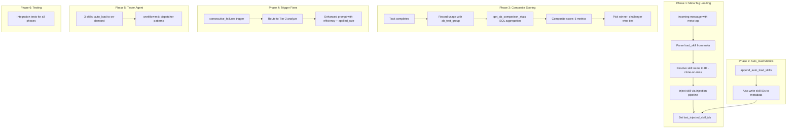

# Plan Overview: Milestone 2 — Skill-Per-Worker Architecture

## Objective
Transform the skill execution model from "many skills in one instance" to "one skill per worker instance" via message-level `<meta>` tag skill loading, making auto_load skills visible to metrics, and replacing single-metric A/B winner selection with a 5-metric composite score.

## Scope Assessment
**LARGE** — 6 phases spanning 4 service files, 1 model file, 2 agent prompt files, and 1 schema migration. Touches the core message-processing pipeline, metrics recording, A/B resolution, trigger routing, and agent prompt content. Each phase is a coherent module with clear boundaries.

## Context
- Project: agents-ensemble
- Working Directory: `/Users/nguyenminhkha/All/Code/opensource-projects/agents-ensemble`
- Milestone 1 (Tester Skill Evolution) is merged
- Reference docs: `docs/plans/skill-metrics-improvement.md`, `docs/plans/skill-per-worker-architecture.md`

## Architecture Diagram

## Phase Index

| Phase | Name | Objective | Dependencies | Coupling | Est. Time |
|-------|------|-----------|-------------|----------|-----------|
| 1 | Message Meta Tag Skill Loading + Schema | Parse `<meta>` tag, extend injection pipeline, schema migration (ab_test_group + superseded + indexes), finalize-on-replace, explicitly_replaced_ids | None | — (root, schema prerequisite for all) | 5-7h |
| 2 | Auto_load Metrics Tracking | Make auto_load skills visible to metrics via `last_injected_skill_ids`; skip explicitly_replaced_ids on restore | Phase 1 Task 1.0 (schema) | loose (different file, but reads Phase 1 metadata) | 2-3h |
| 3 | Multi-Metric A/B Scoring | Replace `_pick_winner()` with composite score, SQL aggregation via `get_stats_filtered()` | Phase 1 Task 1.0 (schema + indexes) | loose (code independent, but needs schema) | 3-4h |
| 4 | Trigger & Tier 2 Enhancements | Route consecutive_failures through Tier 2, enhance prompt, Option C fallback heuristic | Phase 1 Task 1.0 + Phase 3 Task 3.3 (for Task 4.3 only) | mixed — Tasks 4.1/4.2/4.4 independent, Task 4.3 depends on Phase 3 | 2-3h |
| 5 | Tester Agent Updates | Update skill-set.md (3 skills on-demand) + workflow.md (dispatcher patterns) | Phase 1 (meta tag mechanism must exist for worker dispatch) | loose | 1-2h |
| 6 | Testing & Validation | Integration tests across all phases | Phases 1-5 | tight (needs all prior code) | 3-4h |

### Coupling Assessment

| Phase Pair | Coupling | Reasoning |
|------------|----------|-----------|
| 1 ↔ 2 | loose (C3) | Phase 1 touches `instance_messaging.py` + `skill_injection_service.py`; Phase 2 touches `instance_lifecycle.py`. No shared files, BUT both write to `last_injected_skill_ids`. C3 canonical ordering required: explicit REPLACE first, auto_load MERGE second. |
| 1 → 5 | loose | Phase 5's workflow.md patterns reference the meta tag mechanism from Phase 1. Only needs the *interface*, not implementation. |
| 1+2 → 3 | loose | Phase 3's composite scoring is mathematically independent, but the *data quality* depends on Phases 1-2 producing clean attribution. Code is in different files (`skill_evolution_service.py` + `repository.py`). |
| 3 → 6 | tight | Phase 6 tests the composite scoring from Phase 3. |
| All → 6 | tight | Phase 6 needs all prior code complete. |

**Parallelization opportunities (REVISED after Issue 1):**
- **OLD CLAIM REVOKED**: "Phases 1, 2, 4 fully parallel" no longer holds — Phase 1 Task 1.0 schema is a blocking prerequisite.
- Phase 1 Task 1.0 (schema) must run FIRST — all other phases depend on it
- After Task 1.0: Phases 2 (non-schema tasks), 4 (Tasks 4.1/4.2/4.4), 5 can run in parallel
- Phase 3 can code in parallel but tests need Phase 1+2 data
- Phase 4 Task 4.3 must wait for Phase 3 Task 3.3

## Risks & Mitigations

| Risk | Impact | Mitigation |
|------|--------|------------|
| **Issue 1**: Phase 1.5 writes `superseded=True` but column is in Phase 3 → failed INSERTs under parallel execution | high | **FIXED**: Schema migrations (ab_test_group + superseded + indexes) folded into Phase 1 Task 1.0 as blocking prerequisite. Phase 3 Task 3.1 now verifies schema, doesn't create it. |
| **Issue 2**: Checkpoint restore re-introduces explicitly replaced skills | high | **FIXED**: `explicitly_replaced_ids` persisted in instance metadata on REPLACE. Phase 2 auto_load DEDUP-MERGE skips IDs in this set. |
| **Issue 3**: Phase 4 Task 4.3 needs avg_iterations/avg_duration — no counter columns exist | high | **FIXED**: Switch from counter reads to aggregation queries via `get_stats_filtered()`. Composite index `ix_skill_usage_records_skill_created` added in Phase 1 Task 1.0. Phase 4 Task 4.3 explicitly depends on Phase 3. |
| **Issue 4**: `fallback = not task_succeeded` corrupts high_fallback_rate trigger | high | **FIXED**: Option C — fallback determined by worker's `skill_feedback(applied=False)`, not task success. Worker judgment is independent of task difficulty. |
| **C1**: Meta tag regex truncates nested JSON | high | **FIXED**: Use `(.*?)` to capture full content between tags, let `json.loads` handle brace matching. Security-hardened with isinstance guard, schema allow-list, last-wins policy, strip-all-tags. |
| **C2**: REPLACE orphans pending usage records for dropped skills | high | **FIXED**: Finalize-on-replace protocol — dropped skills get SUPERSEDED records (neutral, excluded from completion_rate). Orphan sweep job as belt-and-suspenders. `superseded` column added in Phase 3. |
| **C3**: Phase 1 REPLACE + Phase 2 auto_load DEDUP-MERGE conflict on same metadata key | high | **FIXED**: Canonical ordering — explicit injection (REPLACE) runs FIRST, auto_load (DEDUP-MERGE) runs SECOND. "Explicit skills are authoritative; auto_load is additive." Different lifecycle stages naturally enforce ordering. |
| Injection pipeline runs on subsequent messages, causing duplicate skill content in context | medium | Worker reuse clears old `last_injected_skill_ids` (with C2 finalize) before setting new. The old injected HumanMessage persists in LangGraph history (checkpoint), but the NEW injection is prepended — the LLM sees the most recent first. |
| `ab_test_group` + `superseded` column migration fails on PostgreSQL | high | Use `_ensure_postgres_columns()` pattern (ALTER TABLE ADD COLUMN IF NOT EXISTS). Add SQLite migration .sql counterpart. Test on PostgreSQL primary. |
| Composite score normalization baseline is empty (new system) | medium | Fallback: if global baseline avg is 0 or no records, efficiency/speed scores default to 0.5 (neutral). |
| **W1**: Constructor chicken-and-egg for SkillCloneService | medium | **FIXED**: Setter pattern `injection_service.set_clone_service(clone_service)` instead of constructor injection. Called after both services exist. |
| **W5**: Existing open A/B tests affected by sample_size change 10→20 | low | **FIXED**: Silent upgrade policy. No per-test threshold storage; config read at resolution-check time. Tests near 10 get 10 more comparisons — acceptable delay. |
| Changing tester from executor to dispatcher breaks existing testing flows | high | Phase 5 updates workflow.md to use existing delegation patterns (tester already spawns opencode sessions). The skill distribution change is additive — skills remain available, just loaded differently. |
| Performance: SQL aggregation adds query overhead | low | Single GROUP BY query per A/B resolution check. Replaces O(n) Python load. Net improvement. |

## Success Criteria
- [ ] `send_message("task\n<meta>{\"load_skill\": \"unit-test\"}</meta>")` delivers skill to worker + sets `last_injected_skill_ids`
- [ ] Worker reuse with different meta-tag skill clears old scope + sets new
- [ ] Auto_load skills (e.g. `test-strategy`) appear in `skill_usage_records` after task completion
- [ ] A/B winner selection uses 5-metric composite score (configurable weights)
- [ ] A/B comparison stats only use records from the test period (`ab_test_group` filter)
- [ ] `consecutive_failures` trigger routes through Tier 2 analysis (not direct `evolve_fix`)
- [ ] Tier 2 analysis prompt includes `applied_rate`, `avg_iterations`, `avg_duration`
- [ ] Tester has only `test-strategy` as auto_load; 8 others are on-demand
- [ ] Integration test: clean 1:1 attribution (1 worker → 1 skill → 1 usage record)
- [ ] All tests pass on PostgreSQL (primary dev/test DB)

## Tracking
- Created: 2026-07-15
- Last Updated: 2026-07-15
- Status: draft
