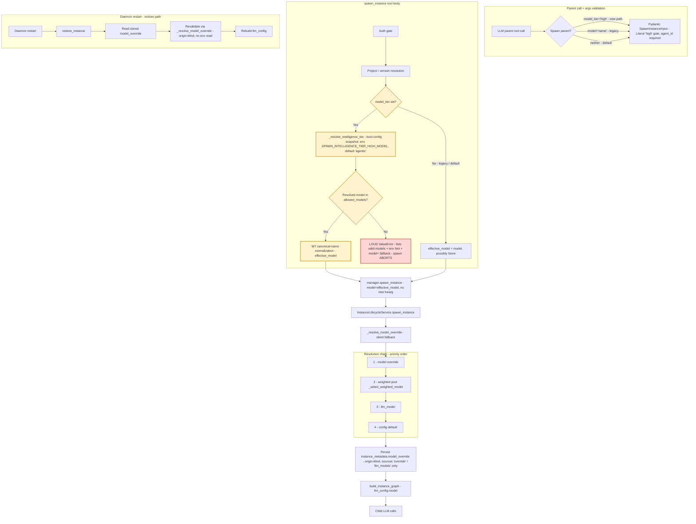

# Architecture Recommendation: Spawn-Time Intelligence Override (Feature #1) — Architect Pressure-Test & Enrichment

Date: 2026-09-14
Architect instance: architect (controller) — analysis dispatched, not designed inline
Worker instances: `332e64eb` (trade-off-analysis), `ed265203` (structural-design), `a14ba7e2` (data-flow-design)
Plan under review: `.agents/shared/planning/spawn-intelligence-override/` @ commits `142258eb` + `6dedb52e`, branch `plan/spawn-intelligence-override`
Code base verified: daemon/ byte-identical to `a904374e` at HEAD `6dedb52e` (all three workers pinned tree state start+end; `git log a904374e..HEAD -- daemon/` empty)
Status: **COMPLETE — plan APPROVED with 10 concrete amendments (A1–A10). No overturned core decisions.**

---

## 0. Verdict Table

| # | Item | Verdict | Key evidence |
|---|------|---------|--------------|
| 1 | **D1 (a)** distinct `model_tier` Literal | **CONFIRMED** | 5-axis weighted 4.00 vs (c) 2.70 vs (b) 2.25; Maintainability decisive |
| 2 | `Literal["high"]` extensibility | **CONFIRMED SAFE** | 0 schema-equality pins in `tests/` (grep); key-based `args_schema.model_fields` access only |
| 3 | Param name `model_tier` | **CONFIRMED** | self-categorizing, non-colliding, greppable; description renders in tool schema (`instance.py:1745-1755`) |
| 4 | D2 error-message shape | **RESOLVED** — verbatim text in §2.1 | mirrors `instance.py:2064-2067` style; 4 required components verified present |
| 5 | rec-4 single- vs dual-path | **RESOLVED — single-path notice + dual-path error message** | ruling in §2.2 |
| 6 | Pin W pool-skew / R5.3 fallback | **RESOLVED — drop Pin W, replace with source-label assertion** | unseeded `random.uniform` (`llm_load_balancer.py:158`); §2.3 |
| 7 | D7 facade claim (no new manager kwarg) | **CONFIRMED (all 3 legs)** | `instance.py:1892` passes `model=model`; `manager.py:6567` has `model` kwarg, 0 `model_tier` in daemon/; `instance_lifecycle.py:1325` threads it |
| 8 | Load-bearing anchors | **8/9 CONFIRMED, 1 DRIFT** | drift = `decisions.md` L78 `:1757-1762` citation (§3) |
| 9 | Edge (a) tier-model ∉ allowed_models | **RESOLVED — per-spawn loud ValueError + boot-time WARNING (not boot-fail)** | §4a |
| 10 | Edge (b) empty env at boot | **RESOLVED — empty = UNSET = default `"agentic"`; OVERTURNS `plan-overview.md:189` + `phase5-plan.md` 6b wording** | `_clean_env_value` (`config.py:2248-2253`) unanimous house pattern; §4b |
| 11 | Edge (c) both `model=` AND `model_tier=` | **RESOLVED — `model_tier` wins + visible supersede notice** (NEW phase-2 task, A5) | §4c |
| 12 | Edge (d) degenerate no-op | **RESOLVED — behave identically to legacy; source `"override"`; no extra notice** | §4d |
| 13 | Edge (e) restore-revalidate identity | **CONFIRMED origin-blind** — resolve-once-at-spawn + persist-concrete-model is correct | `instance_lifecycle.py:3907-3908`; §4e |
| 14 | Phase boundaries P1→P5 | **CONFIRMED with one NEW constraint** (P3 lands same-commit-as or after P2) | §5 |
| 15 | Restart/activation semantics (D8) | **CONFIRMED ACCURATE** under boot-snapshot design (A6) | §6.2 |

Skill-bank check: all three workers reported `Skill loaded: [...]` as first line — **no skill bank misses, run not degraded**.

---

## 1. D1 Param Surface — CONFIRMED (a), steel-mans adjudicated

**Five-axis weighted comparison** (weights: Maintainability 25%, Complexity/Scalability/Risk 20% each, Cost 15%):

| Approach | Cmplx | Scal | Maint | Risk | Cost | Weighted |
|----------|-------|------|-------|------|------|----------|
| (a) NEW `model_tier` Literal + tier→model map | 3 | 5 | 4 | 4 | 4 | **4.00** |
| (b) rely on existing `model=` passthrough | 1 | 2 | 2 | 2 | 5 | 2.25 |
| (c) discoverability-only (point at `model='agentic'`) | 1 | 2 | 3 | 3 | 5 | 2.70 |

**Why (a) wins — the decisive properties (b)/(c) provably cannot deliver:**
1. **Loud validation on capability intent.** Legacy `model=` silence is contractual (`instance.py:1752-1753` description; `_resolve_model_override` returns `None` on mismatch, `instance_lifecycle.py:1274-1280`). Only a NEW param can carry the loud ValueError without breaking existing callers.
2. **Operator remap without prompt churn.** (b)/(c) hardcode `'agentic'` into nudge prose and agent habits; a deployment rename silently strands every parent. (a)'s daemon-owned alias (env `SPAWN_INTELLIGENCE_TIER_HIGH_MODEL`) re-points "high" with zero agent-side change.
3. **Self-documenting tool calls.** `model_tier="high"` states *capability intent* in the tool call itself; `model="agentic"` requires the parent to already know which name is "high".

**(c) is not rejected wholesale** — its three surfaces (docstring, `append_allowed_models` tail, nudge rec-4) ship as the **discoverability layer on top of (a)**, exactly as D5/D11 already plan. The standalone form (no new param) is what loses.

**Literal vocabulary (item 2):** widening `Literal["high"]` → `Literal["high","medium"]` later is a one-line resolver touch + test refresh; grep evidence shows **zero** tests assert `SpawnInstanceInput` schema equality (`grep -rn 'SpawnInstanceInput\.' tests/` → 0; `args_schema` is accessed key-based at `tests/unit/tools/test_spawn_councilor_default_version.py:253-263`, `tests/unit/tools/test_upgrade_tools.py:1687`). Literal > str-with-runtime-validation here: the tier set is closed and tiny, and the Literal renders as `enum: ["high"]` in the tool JSON schema the LLM sees — free discoverability. `spawn_councilor`'s `model: str` runtime validation (`instance.py:2046-2068`) is the right pattern for *open-ended* model strings — different shape, correctly not copied.

**Param name (item 3): `model_tier` confirmed.** The name's job is greppable + self-categorizing + collision-free (the `Field(description=...)` does the teaching — it renders into `properties.<name>.description` in the tool schema). `intelligence` risks collision with future capability metrics; bare `tier` is ambiguous ("tier of what?").

---

## 2. Open Questions — RESOLVED

### 2.1 D2 exact ValueError text (adopts into phase2-plan task 4b.i; amendment A2)

Verbatim message (3 physical lines, mirrors `spawn_councilor` raise at `daemon/tools/instance.py:2064-2067` — "list valid models + No-fallback" style):

```python
"spawn_instance(model_tier='high') resolved to model '{resolved_model}' (from env "
"SPAWN_INTELLIGENCE_TIER_HIGH_MODEL), but '{resolved_model}' is NOT in allowed_models: "
"{allowed}. No fallback — add '{resolved_model}' to allowed_models and restart, set "
"SPAWN_INTELLIGENCE_TIER_HIGH_MODEL to one of {allowed}, or retry with "
"model='<one-of-{allowed}>' for the legacy silent-fallback path."
```

Compliance: (1) valid-models list `{allowed}` ✓ (2) tier→model resolution result ✓ (3) env var name (operator hint) ✓ (4) parent-actionable remedies — three discrete paths incl. the legacy `model=` escape hatch ✓. All remedies in ONE message = the parent self-corrects in one retry without a follow-up question. **Note (from anchor verification):** do NOT claim canonicalization in the message — `spawn_councilor`'s error text doesn't mention it either; W7 normalization is a code step (`instance.py:2075-2077`), not message content.

### 2.2 rec-4 wording — single-path notice, dual-path error message (amendment A9)

Worker A argued DUAL-path in the notice (D11 forbids other *tier literals*, not other *params* — a correct legal reading). **Ruling: keep the notice single-path (planned D4 wording verbatim); carry the `model=` fallback remedy in the ValueError text instead (§2.1 already includes it).** Rationale:
- **JIT recovery beats preemptive enumeration.** The notice fires *before* any failure — its job is to teach the one canonical path. The error fires *exactly when* the parent needs the fallback, with the actual allowed-list interpolated. Nothing is lost by deferring the fallback mention to the error.
- **Settled-zone discipline + length budget.** Minimal content delta to the Feature #2 locked structure; rec-4 stays lean; the `test_length_within_1_5x_wedge_notice` margin is untouched.
- The dual-path *insight* survives — relocated to the error message where it has strictly better context.

### 2.3 Pin W pool-skew risk — R5.3 fallback INADEQUATE; drop Pin W (amendment A8)

`_select_weighted_model` uses module-global unseeded `random.uniform` (`daemon/services/llm_load_balancer.py:14, :158`), weights clamped [1,100]. For a 3-entry pool at 10/1/1 skew, P(<2 distinct in 5 draws) ≈ 40% — **Pin W as written is a real flake**, and the R5.3 fallback ("≥1 distinct") proves nothing (a hardcoded `return "agentic"` also passes it).

**Replacement:** drop the 5-draw distinctness assertion; assert the resolution path directly — capture the lifecycle log seam (`daemon/services/instance_lifecycle.py:1647-1652` logs resolved source / pool_size) and assert **`resolved_source == "llm_models"`** on the no-param spawn. This is the same signal Pin W tried to infer from RNG behavior, read from the daemon's own audit output. Pin T's membership assertion (returned model ∈ pool) already covers "what came out". Remove the R5.3 risk-table row (obsolete under this design).

---

## 3. Anchor Verification — 8/9 CONFIRMED, 1 DRIFT (amendment A1)

All anchors re-verified by direct read at HEAD `6dedb52e` (daemon == `a904374e`):

| Anchor | Verdict | Evidence |
|--------|---------|----------|
| `spawn_councilor` raise + W7 normalize (`instance.py:2046-2078`) | CONFIRMED | raise at :2064-2067 lists valid models + "No fallback"; W7 at :2075-2077 case-insensitive canonical match |
| `SpawnInstanceInput.model` shape (`instance.py:1745-1755`) | CONFIRMED | `Annotated[str \| None, Field(default=None, ...)]` |
| `:1757-1762` "model_validator rejecting invalid models" | **DRIFTED** | that validator requires `agent_id` only — `if not self.agent_id: raise ValueError('agent_id is required')` (:1757-1761). **No Pydantic-level model validation exists.** |
| `spawn_instance` signature/docstring/auth/call (`instance.py:1804-1914`) | CONFIRMED | `model` kwarg at :1806; call passes `model=model` at :1892; tool closure CAN read `manager.config.llm.allowed_models` (sibling `spawn_councilor` does exactly this at :2057) |
| `_resolve_model_override` silent fallback (`instance_lifecycle.py:1241-1280`) | CONFIRMED | non-empty allowed + no case-insensitive match → `return None` (:1274-1280) |
| Resolution chain (`instance_lifecycle.py:1619-1668`) | CONFIRMED | override → `llm_models` weighted pool → `llm_model` → config default; sources `"override"`/`"llm_models"` at :1636-1638 |
| `model_override` persist (`instance_lifecycle.py:1820-1828`) | CONFIRMED | dual-source persist exactly as planned |
| Restore + revalidate (`instance_lifecycle.py:3894-3929`) | CONFIRMED + **origin-blind** | :3907-3908 revalidates the bare stored string; no origin marker stored or checked |
| `append_allowed_models` gate (`instance_lifecycle.py:877-944`) | CONFIRMED (±2 lines) | gate at :891; tail lands inside `<allowed_models>` fence without touching the gate |
| `_ALLOWED_MODELS_DEFAULT` (`config.py:2307`) | CONFIRMED | `("agentic", "coding")` exact |
| Env family (`config.py:385-413`) | CONFIRMED | `NoDecode` field, comma-split validator :411-413; resolution = **pure `_resolve_*` helper + `load_config` boot snapshot** (:2310, wired :3134), NOT pydantic auto-env |
| Manager facade (`manager.py:6560-6620`) | CONFIRMED | `model: str \| None = None` at :6567; **0** `model_tier` mentions in all of `daemon/` |
| `_select_weighted_model` (`llm_load_balancer.py:21`) | CONFIRMED | weighted RNG, unseeded; single-entry shortcut deterministic (:155-156) |

**A1 (drift fix):** `decisions.md` L78 and `phase1-plan.md` L20 justify the resolver's unknown-tier ERROR path by "mirroring `model_validator` rejection at `daemon/tools/instance.py:1757-1762`" — wrong anchor. Re-anchor to `spawn_councilor`'s *runtime* validation (`:2046-2068`) and note explicitly that `SpawnInstanceInput` has NO Pydantic-level model validation (only the `agent_id` requirement) — which is precisely why the tool-body resolver block must do the validating.

**D7 facade claim: SUPPORTED on all three legs** — (1) tool passes `model=` today (`instance.py:1892`); (2) facade + lifecycle signatures already carry `model` (`manager.py:6567`, `instance_lifecycle.py:1325` → `:1446` → chain `:1629+`); (3) persistence is origin-blind (`:1820-1824`) and restore revalidation is origin-blind (`:3907-3908`) — a tier-resolved value stored under `model_override` is indistinguishable from a manual `model=` value downstream. The tier seam is purely additive at the tool layer.

---

## 4. Edge Cases — ANSWERED

### (a) Tier-mapped model NOT in allowed_models at spawn time
**Per-spawn loud `ValueError` (planned — correct) + boot-time WARNING. Not boot-fail.**
- Per-spawn raise is the parent-facing contract (§2.1 text).
- Boot-time: both `SPAWN_INTELLIGENCE_TIER_HIGH_MODEL` and `allowed_models` are known at `load_config` time (`config.py:3134` wiring precedent) — emit ONE boot WARNING line when the resolved tier-default ∉ allowed_models. This closes the "operator flipped env, never noticed" gap with zero daemon-availability cost. Boot-FAIL is rejected: the mismatch is semantic (well-formed string, wrong list), not malformed — the fail-loud-at-boot house pattern (`_parse_bool_switch`, `config.py:2444-2463`) is for *malformed* switch values; this case is served by WARN + the per-spawn raise. → **A6**.

### (b) Env var set to empty string at boot
**Empty/whitespace = UNSET = default `"agentic"`.** The `_clean_env_value` shell-style `:-` semantics (`config.py:2248-2253`) is unanimous across every `_resolve_*` helper (`_resolve_proactive_enabled:2655-2656`, `_resolve_allowed_models:2357-2358`, `_resolve_empty_response_guard_enabled:2480-2481`, `_resolve_empty_guard_compaction_skip:2496-2497`). An empty→error path would be the codebase's ONLY outlier and would crash boot on bare `KEY=` lines in `.env` — the exact bug class `_resolve_proactive_enabled:2644-2653` was built to prevent.
**This OVERTURNS `plan-overview.md:189`** (claims empty string = error-path kill-switch) **and `phase5-plan.md` task 6b** (rollback via empty string). Soft-disable/kill-switch instead = set the env to a model name NOT in allowed_models → every `model_tier="high"` call raises loud with the configured value named. → **A3, A4**.

### (c) `model_tier` AND `model` BOTH passed
**Undefined in the current plan — must be specified. Recommendation: `model_tier` WINS, with a visible `[NOTE]` in the tool result that `model=` was superseded** (and by which model). Rationale: (1) house precedent — `caller_model_overrides` (`daemon/tools/knowledge_tools.py:722-788`): explicit override wins, never silently, never rejected; (2) "the newer, more specific intent wins" is least surprising for an LLM caller that just read the rec-4 nudge; (3) a ValueError-on-conflict wastes a turn on two legitimate intents, while silent-ignore would violate the feature's own loudness philosophy — the notice is the correct middle. New phase-2 branch + integration pin (assert spawn proceeds on tier-resolved model AND notice string present). → **A5**.

### (d) Degenerate no-op (agent's pool contains ONLY the mapped model)
**Behave identically to the legacy override path — no special-casing.** The tier path resolves to `effective_model` and rides `model=`; source label is `"override"` (`instance_lifecycle.py:1634`), `model_override` persists per :1820-1821, and the spawn return tuple's second element makes the effective model visible to the caller. Legacy accepts an explicit model without extra ceremony; the tier path must not add any. Silent-but-observable-in-return is correct.

### (e) Restore-revalidate path
**CONFIRMED identical.** Restore reads the bare `model_override` string and revalidates via the same `_resolve_model_override` (`instance_lifecycle.py:3907-3908`) — origin-blind by construction (no origin marker persisted at :1820-1824, none checked at restore). Tier resolution happens ONCE at spawn; the concrete model string persists; env changes post-spawn never retro-change a child (restore path never reads the tier env). No holes found. This also settles the semantics question: **resolve-once-at-spawn + persist-concrete-model is the architecture** — do not persist `"high"` and re-resolve at restore (that would re-couple child identity to a mutable env).

---

## 5. Phase Boundaries — CONFIRMED, one new constraint (amendment A7)

| Phase | Independently testable | Mergeable as sliced | Note |
|-------|----------------------|---------------------|------|
| P1 resolver | ✓ (6 unit pins) | ✓ (`config.py` + lifecycle free fn) | — |
| P2 tool surface | ✓ (real-dispatch pins G–J) | ✓ | + A5 both-params branch & pin |
| P3 discoverability | ✓ | ⚠ **must land same-commit-as or AFTER P2** | docstring/`Field` description references the P2 field; landing first renders a description for a nonexistent param |
| P4 nudge | ✓ (3 coordinated pins, same-commit rule) | ✓ string-template only | independent of P1/P3 confirmed |
| P5 regression + activation | ✓ (pins T/U/V + A8 replacement) | ✓ depends on P2 | Pin W dropped per §2.3 |

Dependency graph P1→P2→{P3,P5}, P4 loose — **stands**. Merge guidance: one PR, **≥3 ordered commits (P1 / P2+P3 / P4+P5)**, with the P2→P3 same-commit-or-after constraint explicit. → **A7**.

---

## 6. Data Flow, Restart Semantics, Facade Traps

### 6.1 Full data-flow (tier seam highlighted)



Seam placement: **tool body, after auth + project/version resolution, before `manager.spawn_instance(...)` (`instance.py:1886-1894`)** — same shape as `spawn_councilor`'s pre-call validation. Downstream of the seam the tier path is byte-identical to legacy (same kwarg, same source label, same persist, same restore).

### 6.2 Restart/activation semantics (D8 confirmed accurate — with A6 design)

Follow the `allowed_models` house pattern exactly: pure module-level `_resolve_*` helper in `config.py` taking pre-read values (never touching `os.environ` itself), single `os.environ` read at the `load_config` call site (`config.py:3134` precedent), result installed as a boot-time config field; the tool layer reads `manager.config.llm.<field>` (precedent: `spawn_councilor` reads `manager.config.llm.allowed_models` at `instance.py:2057`). **Do NOT read `os.environ` per-spawn** — a mid-process env flip would pair a new tier map with the old `allowed_models` boot snapshot (split-brain). Under this design "restart required to activate" (D8) is accurate, and the tier map + allowed_models share ONE lifecycle.

### 6.3 Facade-forwarding traps
**None new.** D7 verified: zero new kwargs cross `InstanceManager.spawn_instance`; `daemon/manager.py` has zero `model_tier` mentions; the only thing crossing the facade is the already-validated model string on the existing `model=` kwarg. The existing guard (grep `model_tier` in `daemon/manager.py` must stay 0 — already phase5 task 8 drift check (iv)) remains the right tripwire.

---

## 7. Plan Amendments — concrete deltas

| # | File / location | Delta |
|---|-----------------|-------|
| A1 | `decisions.md` L78; `phase1-plan.md` L20 | Replace the "`:1757-1762` model_validator rejection" justification — that validator checks `agent_id` only. Re-anchor to `spawn_councilor` runtime validation `instance.py:2046-2068`; note NO Pydantic-level model validation exists on `SpawnInstanceInput` (hence tool-body validation). |
| A2 | `phase2-plan.md` task 4b.i | Adopt the §2.1 verbatim ValueError text (adds env-var hint + 3-remedy cluster incl. legacy `model=` retry; no canonicalization claim). |
| A3 | `plan-overview.md:189` | Delete the empty-string-kill-switch parenthetical; replace with: empty/whitespace env = UNSET = default `"agentic"` (`_clean_env_value` `config.py:2248-2253`); soft-disable = set env to a model NOT in `allowed_models`. |
| A4 | `phase5-plan.md` tasks 6b/6c | 6b: reword rollback — empty string is NOT a kill-switch; use a non-allowed model name. 6c: keep; add note that the mechanism is resolver WARN tuple → tool-body loud raise. |
| A5 | `phase2-plan.md` NEW task + pin | Both-params precedence: `model_tier` wins; emit visible `[NOTE] model=X superseded by model_tier='high' (using Y)`. New integration pin: both passed → spawn proceeds on tier-resolved model + notice present. (Edge c.) |
| A6 | `phase1-plan.md` tasks 2/2b; `phase5-plan.md` runbook | Boot-snapshot design: single `os.environ` read in `load_config` (mirror `_resolve_allowed_models` wiring `config.py:3134`), install as config field; tool layer reads `manager.config.llm.<field>` (`instance.py:2057` precedent); `_resolve_intelligence_tier` stays pure. PLUS boot WARNING when resolved tier-default ∉ allowed_models. Per-spawn reads of `os.environ` are forbidden (split-brain). |
| A7 | `plan-overview.md` phase table; `phase3-plan.md` | NEW constraint: P3 docstring/Field-description lands same-commit-as or after P2's field — never before. Merge: one PR, ≥3 ordered commits (P1 / P2+P3 / P4+P5). |
| A8 | `phase5-plan.md` Pin W (task 4d) + R5.3 risk row | Drop the 5-draw distinctness pin (unseeded `random.uniform` `llm_load_balancer.py:158` — real flake; single-entry shortcut :155-156 is the only deterministic case). Replace with `resolved_source == "llm_models"` assertion read from the `instance_lifecycle.py:1647-1652` log seam. Delete the obsolete R5.3 fallback row. |
| A9 | `decisions.md` D4 | Keep planned single-path rec-4 wording verbatim; record the ruling: the `model=` fallback remedy lives in the ValueError text (§2.1), not the notice. |
| A10 | `decisions.md` D11 deferred list | Remove now-answered deferrals: empty-string kill-switch semantics (answered: empty=UNSET) and hot-reload (answered: boot snapshot only, D8). |

---

## 8. Risks

- 🔴 **None.** No irreversible or high-blast-radius exposure: additive param, default-unchanged, legacy silent path contractually untouched, facade unchanged, no schema/pool/prompt changes.
- 🟡 **Both-params behavior is currently UNDEFINED in the plan** — must be closed by A5 before implementation, else parents passing both get silent `model=` shadowing (violates the feature's own loudness philosophy).
- 🟡 **Empty-env contradiction inside the plan package** (phase1 task 2b vs overview L189 / phase5 6b) — closed by A3/A4; an implementer following phase5 6b as-written would ship a resolver that crashes boot on `KEY=` `.env` lines.
- 🟢 Naming lock-in `model_tier`/`"high"` — mitigated: no schema-equality pins; Literal widening is a one-line coordinated change.
- 🟢 Loud-vs-silent asymmetry confusing parents — mitigated: docstring callout (phase3) + error-message remedy cluster (§2.1).
- 🟢 Pin W flake — closed by A8.

## 9. Decisions Pending (leader/planner sign-off)

1. **Edge (c) precedence policy (A5):** recommendation is `model_tier` wins + visible supersede notice (house precedent `caller_model_overrides`). If the owner prefers strict loudness (ValueError on conflict), A5 inverts — either way it must be specified before Phase 2 implementation.
2. **Boot WARNING vs silence (A6):** recommendation is one boot WARN line on tier-model ∉ allowed_models. Operator-visible confirmation requested (it is a new boot-log line, a surface the runbook greps).

## 10. Open Questions remaining

None blocking. The plan's own OQ1–OQ4 are all resolved: OQ1 ship `"high"` only ✓ (confirmed, widening safe per §1); OQ2 include default in message ✓ (§2.1); OQ3 gate tail on `inject_allowed_models=True` ✓ (gate verified at `instance_lifecycle.py:891`); OQ4 rec-4 wording final ✓ (A9).

## 11. Gaps

None — all three dispatched analyses reported complete with pinned tree state and path:line evidence. Worker A's self-flagged unverified items (priority chain, `append_allowed_models` gate, `spawn_councilor` test pins) were covered by Workers B/C and are CONFIRMED in §3.
