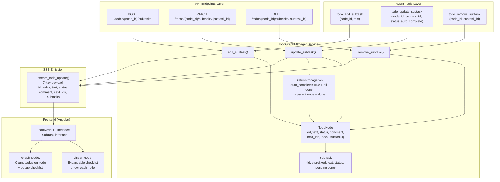

# Architecture Diagram: Todo Node Sub-Tasks

## Data Flow Summary

1. **Agent or API** calls a sub-task operation (add/update/remove)
2. **TodoGraphManager** mutates the `TodoNode.subtasks` list (thread-safe via `threading.Lock`)
3. **Status propagation** (optional): if `auto_complete=True` and all sub-tasks are `done`, parent node status → `done`
4. **SSE emission**: `stream_todo_update()` pushes the full 7-key node list to all connected clients
5. **Frontend** receives SSE update, replaces `todos` signal, re-renders sub-task checklist (linear: inline expandable; graph: popup)
