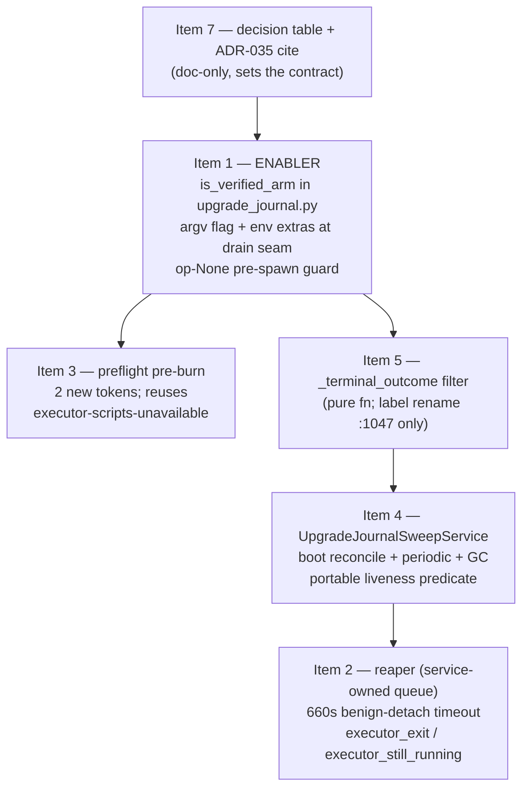

# Architecture Recommendation: v0.15.3 Upgrade Tool-Lane Live Promote Fix — Plan Enrichment

**Date:** 2026-09-26
**Mode:** Standard Design — 3-worker area fan-out (structural / resilience / trade-off), one skill per worker
**Analyst instances:** `7c288d0f` (structural-design), `b47d992e` (resilience-design), `f6e9b5a1` (trade-off-analysis)
**Inputs:** plan.md (328L), plan-overview.md, phase1-plan.md (397L), phase2-plan.md (469L), research-findings-python.md (323L), research-findings-shell-e2e.md (272L) — all read in full; all claims below re-verified against source on `feature/upgrade-tool-lane-fix @ 139ba352`.
**Deliverable for:** the approved-track implementation plan — per-focus verdicts (KEEP / SHARPEN / CORRECT), P1 sequence map, missed-risk roll-up.

---

## 0. Executive Summary

The plan is architecturally sound at the policy level: the ratified 3-factor attestation maps cleanly onto argv/env passthrough at the single drain seam, the journal `pending_op` is the tamper-resistant spine, and unverified fences stay byte-identical. Verdict distribution across the six focus areas: **6 KEEP, 9 SHARPEN, 4 CORRECT** — every correction is concrete, anchored, and closeable inside the plan's existing scope (no scope growth).

The four CORRECTs:

1. **Reaper timeout 120s is below the healthy-promote floor (~485–590s)** — every successful live promote would journal a spurious timeout (§3, Focus 2a).
2. **Refusal-taxonomy style + redundancy** — colon-prefixed family breaks the flat token convention, and preflight check #1 duplicates the existing pre-burn `executor-scripts-unavailable` refusal (§2, Focus 4).
3. **Release-cut self-reference trap** — v0.15.3's own staging will REFUSE (exit 78) under the P2 rider unless `ENSEMBLE_ROLLBACK_SAFE=1` is set; plan §10c is silent (§6, Focus 6e). 🔴 giter blocker if uncorrected.
4. **Liveness check `os.path.exists("/proc/{pid}")` is wrong-platform** — live host is macOS (§4, Focus 3a).

One aggregation-level decision: **the reaper becomes sweep-service-owned** (adjudicated between conflicting worker recommendations, §7), which adds a dependency edge Item 2 → Item 4 and **reorders P1 internal sequencing to `7→1→3→5→4→2`** (§8).

---

## 1. Focus 1 — Verified-Arm Predicate Design

**Verdict: SHARPEN** — the 4-field predicate is correct as logic; home, pinning, and one conjunct need fixing.

### 1a. Home: `daemon/tools/upgrade_journal.py` (plan deferred — now resolved)

Circular-import proof (verified against source):
- `manager.py:3721,3725,3787` — function-local `from daemon.tools import upgrade_journal as _uj`; calling `_uj.is_verified_arm(op)` is zero-friction.
- `upgrade_tools.py:75` — top-level `from . import upgrade_journal as uj`; `uj.is_verified_arm(op)` works trivially (needed by Item 3 preflight).
- If the helper lived in `manager.py`, `upgrade_tools.py` would need to import `manager` → circular via graph wiring. **Confirmed impossible.**

Co-locate with `PendingOp` (`upgrade_journal.py:695-729`) — the predicate is the truth function of that dataclass. Recommend public name **`is_verified_arm(op)`** (it is consumed cross-module; underscore-private invites bypass-by-copy).

### 1b. Authority chain: KEEP

3-factor gate (`upgrade_tools.py:2452-2620`, in-memory, request-scoped) → `write_pending_op` (`:2706` → `:732-737` → journal_write, **persisted**) → drain `read_pending_op` (`manager.py:3832`, **persisted read**; plan moves it BEFORE spawn at `:3823` — correct, preserves the owner-stamp write) → predicate (pure) → `extra_env`/argv (`:3795-3799`, `:3808-3815`) → `spawn_executor` (`:1012-1037`; env via `executor_env` extras-merge `:1003-1005`). The journal is the tamper-resistant spine across daemon death; the only in-memory links are the gate evaluation and the final env/argv construction. Sound.

### 1c. Single-path proof: KEEP (verified) + one invariant comment

- **One production caller** of `spawn_executor`: `manager.py:3823` (others are test/mock seam sites only).
- **One construction site** for `extra_env`: `manager.py:3795-3799`. No other site sets `ENSEMBLE_UPGRADE_LIVE` or appends `--f2-verified-closed` (grep-verified; remaining references are the allowlist strip site `:988-991` and shell-side consumers in `lib.sh`/`promote.sh`).
- **Marker-spec omission is load-bearing**: spec (`upgrade_tools.py:2711-2723`) carries no verified-arm fields; argv/env derive from `pending_op` only. Add a one-line invariant comment at `manager.py:3832`: *"argv/env must derive from pending_op (durable record), NEVER from marker spec"* — prevents a future "convenience" spec extension creating a second writer.

### 1d. Drift pinning: SHARPEN — 4-field pin is necessary but not sufficient

Pin package (all four):
1. **Truth-table test** — `test_is_verified_arm_truth_table`: each of the 4(→5, see 1e) fields individually falsified → False; all true → True.
2. **Location pin** — `hasattr(uj, "is_verified_arm")` + static/AST pin that the definition lives in `daemon/tools/upgrade_journal.py` (pattern: `test_static_no_bash_process_registry_reference`, `test_upgrade_journal.py:979`).
3. **Name freeze** — call-site pins target the helper by name; a rename forces call-site updates in lockstep (manager drain + upgrade_tools preflight).
4. **Call-site coverage** — both consumers (manager drain, Item 3 preflight) import/invoke it; guards against "only manager uses it" drift that would silently break preflight.

### 1e. Edge cases

- **Note value with `:` in source** — KEEP: `lib.sh:584-589` reads `F2_VERIFIED_NOTE` as opaque text, JSON-escapes into `f2_verified_note`. Never parsed. Ambiguity is cosmetic.
- **Add `op.env == "live"` conjunct** — adopt (defense-in-depth): today demo arms can't reach the predicate truthfully because `confirmed_source` is only set inside the `self_env == "live"` branch (`:2457`, `:2511`) — safe **by coincidence**. One cheap conjunct makes it safe by construction. Comment: "demo never sets confirmed_source; env-check is defense-in-depth."
- **Restart can never gain the flag** — KEEP: predicate requires `kind == "promote"`; restart argv (`:3801-3807`) is built unconditionally and untouched.

**Final predicate:**

```python
def is_verified_arm(op: "PendingOp | None") -> bool:
    return (
        op is not None
        and op.kind == "promote"
        and op.env == "live"          # defense-in-depth (see 1e)
        and op.nonce_consumed
        and op.confirmed_by_human
        and bool(op.confirmed_source)
    )
```

---

## 2. Focus 4 — Refusal Taxonomy Extension

**Verdict: CORRECT** — two fixes, both shrink scope.

### 4a. Style: drop the colon prefix

The existing ~21 refusal tokens are flat kebab-case (`no-staged-install`, `pipeline-busy`, `executor-scripts-unavailable`, `nonce-instance-mismatch`, …). Colon-style strings exist only as `classify_user_origin` **detail** tokens (`:1152-1202`) — a different mechanism, not pinned by the D-FA2.2 `reason=<token>` convention. Final names (flat):

- `preflight-argv-unconstructable`
- `preflight-argv-malformed`

(Third token eliminated by 4b below.)

### 4b. Redundancy: REUSE `executor-scripts-unavailable` — real defect in the plan

The existing check at `upgrade_tools.py:2656-2663` fires **pre-lock (`:2677`) and pre-burn (`:2685-2688`)** with the same semantics as the plan's preflight check #1. Minting `preflight-scripts-unresolvable` would duplicate a token, collide pins, and churn the operator-facing message. **Item 3 shrinks to checks #2 + #3 only.**

### 4c. Granularity: KEEP two tokens

#2 (synthetic-PendingOp construction fails → data problem) and #3 (argv doesn't match promote.sh's flag set → typo/unknown flag) signal different operator actions. Implement #3 as a **regex/known-flag-set check against `promote.sh:64-80`**, not a `bash -n` fork.

### 4d. Sweep/GC outcomes: journal events, not refusals — with GC staying silent

- `sweep` is already in `_TERMINAL_EVENTS` (`:890`) — reconcile closures ride the existing event class. Correct.
- `executor_exit` (reaper) = additive emit-NOTHING event via `journal_history_append` (`:301-316`); **NOT** added to `_TERMINAL_EVENTS` (observability vs lifecycle). Correct.
- **GC: NO new event class.** Per-prune events would be high-frequency noise from a fail-safe internal cleanup (`:789-821` "only deletes what it can prove is dead"). Use `logger.info` with pruned count when > 0 (matches the reconcile warning pattern at `:947-950`). Worker B's `executor_orphaned` / synthetic `executor_exit` events (§3 below) ARE warranted — they are state-relevant, low-frequency.

### 4e. Pins (final, after 4b)

Two new regex-equality pins: `reason=preflight-argv-unconstructable`, `reason=preflight-argv-malformed`. Existing `executor-scripts-unavailable` pin stays green unchanged. Each token = one test (`test_arm_preflight_refuses_unconstructable_argv`, `test_arm_preflight_refuses_malformed_argv`), both asserting nonce NOT burned + journal NOT mutated.

---

## 3. Focus 2 — Async Reaper Lifecycle

**Verdict: CORRECT (timeout) + SHARPEN (ownership, shutdown, journal-failure)**

### 2a. Timeout: CORRECT — 120s fires on every healthy live promote

Gate chain (`promote.sh:250-272`, `lib.sh:51-56`): `LIVEZ_BUDGET_S=60` + `READYZ_BUDGET_S=120` + version verify (~5-10s) + `SOAK_S_DEFAULT=300` (ADR-005) → **floor ≈ 485s before commit**; with preflight/STOP/restart, realistic healthy upper bound ≈ **590s** (≈ `SWEEP_STALE_S=600` outer window, `lib.sh:61`). The plan's "30-60s observed on demo" rationale is demo-drill skew, not live reality.

**Recommendation:**
- Default `upgrade_reaper_timeout_seconds = 660` (soak 300 + livez 60 + readyz 120 + version 10 + stop 30 + restart 30 + preflight 60 + buffer 50). Optionally derive the floor at boot: `Field(ge=SOAK + LIVEZ + READYZ + 150)`.
- **Reframe timeout as benign-detach**: event name `executor_still_running` (NOT `executor_timeout` — the child may be perfectly healthy; the daemon merely stopped observing). One journal note, then detach; terminal classification still comes from promote.sh's own commit/rollback events.

### 2b. Ownership: SHARPEN — service-owned reaper (adjudicated, §7)

Ad-hoc `create_task` in the post-turn drain has **no shutdown registry** — unrooted task leak under daemon shutdown. The reaper belongs to the **`UpgradeJournalSweepService`** (Item 4): an internal `asyncio.Queue` + single worker task awaiting each child via `wait_for(shield(...), timeout)`, lifecycle exactly per `JobLockSweepService` (`daemon/services/job_lock_sweep.py:128-188`: `start()` creates task, `stop()` cancels + awaits; wired at `daemon/api.py:1864-1872`). The drain **only enqueues** `(pid, run_id)`; it never creates the reaper task. This kills the fire-and-forget leak, gives shutdown a single cancellation point, and resolves Worker A's R-A1 double-registration ambiguity by construction. The Popen registry ("Option B") survives as a service-owned dict, not a module global.

### 2c. Daemon-shutdown semantics: SHARPEN — two durability gaps closed

1. **Pre-open child death after daemon restart**: covered by reconcile's expiry branch (`:957-979`) once past `expires_at + RECONCILE_GRACE_S`; the periodic sweep should additionally journal `executor_orphaned {pid, run_id}` when `os.kill(pid, 0)` raises `ProcessLookupError` AND the expiry bound has passed (ties into the 3a predicate).
2. **Daemon died after child finished but before reaper journaled**: boot sweep re-emits a **synthetic `executor_exit`** when it sees closed in_flight + past-armed-at + no reaper event for that run_id (dedup on run_id, idempotent single emit). This is the journal-state durability the plan missed.
3. **Cancel-mid-wait (FM-11)**: the `wait_for(shield(...))` shape is FM-11-compliant (inner `proc.wait()` runs to natural exit after outer cancel; pattern `manager.py:4148-4149`). Add the induction test: patch spawn seam to slow child, `service.stop()` mid-wait, assert clean return + child still alive.

### 2d. Journal-write failure: SHARPEN — the contract is RAISE

`journal_history_append` → `journal_write` **raises `OSError`** on write failure (`:276-298`); the never-raises contract lives at reconcile's callers (`:946-951`, `:972-977` wrap `try/except (JournalTorn, OSError)`). The reaper's journal calls MUST do the same: wrap each append in `try/except OSError` → daemon log WARNING with `run_id` + `pid` + exc. **No retry** — loud failure, not masking; the operator finds it in `ensemble.log`. This is where "loud" goes when the journal itself is down.

### 2e. Drain interaction: KEEP never-raises; enqueue-only

With service ownership, the drain's `try/except Exception → logger.warning → return False` (`:3843-3846`) is untouched; enqueue is a non-throwing queue put. Log-tail read: bound at 4KB seek, **decode with `errors="replace"`** — `upgrade.log` can carry multi-byte UTF-8 (`--reason` strings); a byte-offset seek can land mid-codepoint and crash `UnicodeDecodeError`.

---

## 4. Focus 3 — Sweep Service Architecture

**Verdict: SHARPEN overall; one CORRECT (liveness portability)**

### 3a. Liveness: CORRECT — portable predicate, time-bound so expiry beats pid-recycling

`/proc` is Linux-only; **live host is macOS**. Use `os.kill(pid, 0)`: `ProcessLookupError` → dead; `PermissionError` → alive (other uid); no exception → alive. Because pids recycle on long-lived macOS hosts (blueprint DR-0), liveness alone could let a recycled pid protect a dead op forever — **bind liveness AND time**:

```python
def _executor_alive_and_recent(op, now) -> bool:
    if op.owner_pid <= 0:
        return False                       # not yet stamped
    if now > parse_iso_utc(op.expires_at) + timedelta(seconds=RECONCILE_GRACE_S):
        return False                       # expiry has won — no liveness veto
    try:
        os.kill(op.owner_pid, 0)
    except ProcessLookupError:
        return False
    except PermissionError:
        return True
    return True
```

### 3b. Race vs fresh arm: KEEP — numbers computed, guard downgraded

Constants: `PENDING_OP_EXPIRE_PROMOTE_S=600` (`:105`), `RECONCILE_GRACE_S=600` (`:106-107`). The arm→spawn window has no in_flight and `owner_pid=0` → the 3a predicate returns False → sweep skips; total protection = armed_at + 1200s, after which the expiry branch closes legitimately. Plan R-P1-3's `armed_by_instance == current_instance_id` "MUST" is **redundant** (and semantically confused — `armed_by_instance` is stale across reboots; the primary guards are the in_flight-live check at `:925-927` + expiry arithmetic + the 3a predicate). Downgrade wording to defense-in-depth.

### 3c. Journal write contention: SHARPEN — verified no-flock, whole-doc atomic; document it

`lib.sh:37` — "No flock(1)". The pipeline lock is mkdir-based (`rollback.lock.d`, `lib.sh:752-789`); journal writes on BOTH sides are whole-document atomic (Python: tmp + fsync + `os.replace`, `:241-298`; lib.sh: tmp + `mv`). A concurrent reader sees old-doc or new-doc, never torn. **Verdict: tolerate under additive-splice discipline (ADR-034)** — and add a sweep-service docstring note citing ADR-034 + the fsync-before-replace invariant so nobody adds a flock "just in case".

### 3d. GC safety: KEEP — plan-text fix only

R-P1-4's mitigation ("sweep passes keep_run_id from any in-progress arm path") is **incoherent for a background sweep** (no arm context). The real safety: GC prunes only consumed or parseable-past-TTL rows (`:789-821`); an in-progress arm's nonce is unconsumed + unexpired → **`keep_run_id=None` is correct by construction**. Replace the mitigation text accordingly.

### 3e. Pause/quiesce: KEEP — none needed; one real interaction fixed

The sweep is file-scoped and instance-independent — Pause-First-Then-Quiesce does not apply. **Real interaction:** if the sweep cleared `pending_op` before the drain reads it, the drain's `:3832` read returns None, the owner-stamp guard skips — **but the child still spawns, untracked**. Fix (add to Item 1/4 spec): the drain MUST check `op is not None` BEFORE spawn (≈ `:3816`) and refuse + journal `executor_orphaned {run_id, reason=pending_op_missing}` if absent. Narrow window (requires >1200s pause between arm and drain), but the fix is two lines.

### 3f. Boot placement: KEEP — with observable boot lines

AFTER `_boot_db_preflight` + app.state, BEFORE first request — correct; launcher.sh's boot sweep (ADR-012) touches `in_flight` only, daemon sweep touches `pending_op` — different keys, idempotent, no double-clear. Emit a structured boot line: `"UpgradeJournalSweepService: boot reconcile complete (pending_op_cleared=N, pending_actions_pruned=M)"`. Boot-time reconcile closing a long-expired stale op on live is safe (expiry long passed; next arm re-gates via 3-factor regardless).

---

## 5. Focus 5 — Test Architecture

**Verdict: SHARPEN** — sibling tests instead of parametrize; probe acceptance made concrete; R-P1-6 downgraded to 🟢.

### 5a. Shape: sibling tests, NOT parametrize (reshapes plan §5a)

`test_promote_kind_lock_handoff_before_spawn` (`test_upgrade_tools.py:3367-3396`) tests **lock handoff** — parametrizing it over verified/unverified mixes an unchanged concern (lock handoff) with a changed one (argv structure) and doubles regression blast. Because Item 1 leaves the unverified path **byte-identical** (existing fixtures are demo/unverified arms — `confirmed_action=None` → `nonce_consumed=False`), the correct shape is:

- **Existing pins stay green byte-identical** — `:3388-3391` (argv equality), `:3439-3444` (allowed-set), `:902` (extras set: not applicable — `executor_env` itself is unchanged; extras-merge already exists). *Plan §5a "FLIP" rows and plan-overview line 28 need corresponding wording updates.*
- **Three new sibling tests carry the verified side**: `test_promote_argv_gains_f2_flag_when_verified`, `test_extra_env_gains_live_and_note_when_verified`, `test_extra_env_poison_stripped_when_unverified` (reusing the `_arm` fixture + `write_pending_op` with verified fields populated).

### 5b. Poison coupling: KEEP — airtight, with one spec rule

Poison tests pass `executor_env(extra_env={"RUN_ID": ...})` — no verified predicate fires; ambient strip is untouched. **Spec rule for the new verified-env test:** it must NOT `setenv("ENSEMBLE_UPGRADE_LIVE", "1")` ambient (else it passes even with broken extras passthrough). Assert `composed["ENSEMBLE_UPGRADE_LIVE"] == "1"` from extras with clean ambient, and `composed["F2_VERIFIED_NOTE"] == "telegram:r-…"` to nail source attribution.

### 5c. Item-5 pin breakage: KEEP — grep DONE, blast radius ≈ 1 line

**Zero external consumers of `"live-confirmation nonce consumed"`** exist outside the plan files and source (verified across tests/, scripts/, status.sh — `status.sh:88-90` reads only the manifest's `rollback_safe`). Event-NAME pins (`nonce_consumed` at `test_upgrade_tools.py:2589/2593`, `test_upgrade_journal.py:663`, `upgrade_alerting` pack `:352/:368`) assert the event name, which Item 5 does not rename — all stay green. **R-P1-6 downgrades to 🟢.** Scope bound to state explicitly: rename applies to `_OUTCOME_LABELS["nonce_consumed"]` at `upgrade_tools.py:1047` ONLY; the arm-reply string at `:2731` (`"live-confirmation: nonce consumed (confirmed_source=…)"` — a different string with colon/parens, pinned at `test_upgrade_tools.py:2584`) is the user-facing confirmation and **stays unchanged**.

### 5d. Boot probe: SHARPEN — concrete acceptance

Lane N/A verdict confirmed (api.py + upgrade_journal.py + new service file vs `task_processor.py:267` / message-job lane — zero intersection). A 30s must-not-crash probe catches registration failure but not "started but never ticked". Acceptance: (1) boot proceeds without crash; (2) log carries `"UpgradeJournalSweepService started: interval=…s"` within 60s (mirror `JobLockSweepService` line, `daemon/api.py:865-869`); (3) log carries one sweep-tick line within the first interval — assert via `grep -q` on captured log, `lane_gate_boot_probe` shape (`.agents/tester/PACKS.md:85`).

### 5e. Pack budget: KEEP

~18 new tests, all seam-patched (no real subprocess except the existing one) ≈ 0.3–1.0s each ≈ ≤18s additive against the 110s inner timeout. Pack layer (`upgrade_tool_interlock_unit_test.sh`): verified-arm argv/env tests + 2 preflight-token tests + reaper/watcher tests (the release-gate two-sided pins). Unit-only: the Item 5 pure-fn tests.

---

## 6. Focus 6 — Phase Boundaries

**Verdict: KEEP the split (zero overlap confirmed) / one CORRECT critical gap (release-cut)**

### 6a. File overlap: KEEP — verified zero

P1 set (manager.py, upgrade_journal.py, upgrade_tools.py, api.py, test_upgrade_*.py, interlock pack) ∩ P2 set (stage.sh, phase2 decisions.md, test_release_journal.sh) = ∅. ADR-035: P2 mints (`:213-215` insertion), P1 only gates on existence — no conflict.

### 6b. Semantic coupling: KEEP — no hidden ordering constraint

`:188/:200` stays-green depends on promote.sh F2-gate text (untouched by both phases). 9e's ADR citation lands after P2's own T3 within P2. Either phase may land first.

### 6c. P1 sequence: BLESS the order of work, CORRECT the rationale — and RESEQUENCE for service-owned reaper

The plan's stated rationale ("Item 5 before Item 2 so Item 5 classifies Item 2's events") is **wrong** — `_terminal_outcome` filters status reads, not journal appends; the items are orthogonal. Item 5 before Item 2 is still good practice (clear the observability defect before adding new events). **However**, the service-owned reaper (§3, Focus 2b) creates a NEW dependency — Item 2's reaper rides Item 4's service — so the sequence becomes **`7 → 1 → 3 → 5 → 4 → 2`** (sweep service before reaper; "isolate fallout" preserved because the reaper is still late). See §8.

### 6d. Single implementer: SHARPEN — per-item commit gates

Six commits, each gated green before the next: I7 (doc/ADR) → I1 (pack + sibling argv/env tests) → I3 (preflight tokens; assert `pending_actions[run_id].consumed_at is None` on refusal) → I5 (3 pure-fn tests) → I4 (sweep tests + boot probe) → I2 (reaper tests incl. CancelledError induction + `executor_still_running` semantics).

### 6e. Release-cut self-reference: **CORRECT — 🔴 critical, the most material finding of this review**

The repo has **61 of 76 migration files matching the DROP grep** (verified live); the rider's check is full-history, not delta-scoped (`stage.sh:166-170`). Therefore **the v0.15.3 stage itself will REFUSE (exit 78) unless `ENSEMBLE_ROLLBACK_SAFE=1` is passed** — and plan §10c is silent. The mission adds zero migrations (baseline "zero code touched"), so the v0.15.2→v0.15.3 delta is empty and `=1` is the legitimate value (override legitimacy test satisfied). **Required plan §10c addition:**

```bash
ENSEMBLE_ROLLBACK_SAFE=1 bash scripts/upgrade/stage.sh <env> --version v0.15.3 …
```

Also propagate to residual ops gates (phase2-plan.md §234-264): every runbook §8.4 cycle's stage command must set the override explicitly.

---

## 7. Adjudicated Conflicts (worker disagreements)

| Conflict | A (structural) | B (resilience) / C (trade-off) | **Ruling** |
|---|---|---|---|
| Reaper ownership | Bind reaper to the drain task; cascade-cancel from shield wrapper (R-A1) | Service-owned queue + worker; drain enqueues only (2b/2e) | **B.** A's mechanics are wrong: `shield()` exists precisely to BLOCK cascade cancellation, and the drain coroutine completes at turn end — a task created inside it is unrooted (exactly the leak B identified). Services have the shutdown registry (`api.py:1864-1872`). Single ownership also resolves A's own double-registration concern. Cost: resequencing (§8). |
| Sweep interval knob | — | C: reuse `job_lock_sweep_interval_seconds` (shared knob) | **Plan (own knob).** The upgrade-journal sweep has a different risk profile (touches live promote lifecycle state); an operator may need to tune it independently (e.g., slow it during a promote window). Coupling the knobs would make that impossible; "divergence" between them is desirable, not a risk. 90s default per plan §9.4. |

---

## 8. P1 Dependency / Sequence Map

**Dependency edges (correctness):** I3 → I1 (shared predicate); I2 → I1 (same drain seam); **I2 → I4 (NEW: service-owned reaper)**; I5, I7 independent.
**Recommended execution order: `7 → 1 → 3 → 5 → 4 → 2`** (was `7→1→3→5→2→4`; resequenced solely by the service-owned reaper).



Per-item commit gates per §6d. Item 4's boot-probe validation runs at its gate; Item 2's CancelledError induction test at its gate.

---

## 9. Missed-Risk Roll-Up (additions to plan §6)

| # | Risk | Sev | Absorbed by |
|---|------|-----|-------------|
| M-1 | **Release-cut self-reference**: v0.15.3 stage refuses exit 78 without `ENSEMBLE_ROLLBACK_SAFE=1`; plan §10c silent; blocks giter | 🔴 | Plan §10c edit + residual ops gates (Focus 6e) |
| M-2 | **Reaper timeout below healthy floor** (~485–590s): spurious timeout journal on every successful live promote | 🔴 | Item 2 spec (660s + `executor_still_running`) |
| M-3 | **Untracked child spawn** if sweep cleared `pending_op` before drain read (pause >1200s between arm and drain) | 🟡 | Drain `op is not None` pre-spawn guard + `executor_orphaned` (Item 1/4) |
| M-4 | **Journal-state durability after daemon death mid-promote**: no reaper event ever lands; boot sweep blind to it | 🟡 | Synthetic `executor_exit` re-emit on boot sweep, dedup on run_id (Item 4) |
| M-5 | **Reaper journal call raises OSError** (journal_write raises): reaper crashes silently without wrap | 🟡 | `try/except OSError` → WARNING, no retry (Item 2) |
| M-6 | **`/proc` liveness wrong-platform** (live = macOS); pid-recycling could protect dead ops indefinitely | 🟡 | `os.kill(pid,0)` + time-bound predicate (Item 4) |
| M-7 | **UTF-8 mid-codepoint crash** on 4KB log-tail seek | 🟡 | `errors="replace"` decode (Item 2) |
| M-8 | **Over-rename trap**: `:2731` arm-reply string is similar-but-different; unbounded rename breaks `test_upgrade_tools.py:2584` | 🟡 | Explicit rename scope bound (Item 5) |
| M-9 | Sweep observability: no way to tell sweep is alive / reaper backlog | 🟡 | `sweep_last_tick_ts` heartbeat + reaper counters (Item 4, optional) |
| M-10 | Reaper queue unbounded under pathological arm churn | 🟢 | Bound 100; overflow → `executor_reaper_queue_overflow` (Item 4) |
| M-11 | Predicate safe-by-coincidence for demo arms (no env conjunct) | 🟢 | `op.env == "live"` conjunct (Item 1) |
| M-12 | Future "convenience" marker-spec extension creates second writer for verified fields | 🟢 | Invariant comment at `manager.py:3832` (Item 1) |

Resolved/downgraded: R-P1-6 → 🟢 (zero external label consumers, §5c); R-P1-3 wording → defense-in-depth (§3b); R-P1-4 mitigation text replaced (§3d).

---

## 10. Five-Axis Sanity Check (recommended shape vs plan-as-written)

| Axis | Plan as written | With this recommendation |
|------|-----------------|--------------------------|
| Complexity | Med | **≈ Same / slightly lower** — sibling tests touch zero existing pins; Item 3 shrinks by one check; offset by service-owned reaper plumbing |
| Scalability | Fine | **Same** — bounded queue, tunable knobs, interval independent of job-lock sweep |
| Maintainability | Med | **Higher** — single predicate home + location/name pins; single reaper owner; bounded rename; GC silent |
| Risk | Med | **Lower** — timeout corrected, portable liveness, release-cut trap closed, journal-failure fallback defined |
| Cost | Baseline | **Same LOC** — resequencing neutral; sibling tests ≈ parametrize in effort |

---

## 11. Decisions Pending (leader)

1. **Accept P1 resequencing to `7→1→3→5→4→2`** (driven by service-owned reaper)? Rejecting it keeps `7→1→3→5→2→4` but then Item 2 must create the service skeleton and Item 4 extends it — messier item ownership.
2. **Accept sibling-test reshape** (zero existing Python pins flip; plan §5a rows and plan-overview line 28 need wording updates)?
3. **Confirm `ENSEMBLE_ROLLBACK_SAFE=1` giter instruction** for the v0.15.3 stage (legitimacy: v0.15.2→v0.15.3 migration delta is empty).
4. **Confirm 660s reaper timeout default** (or accept floor-derivation variant).

## 12. Open Questions Resolved by This Review

- Plan §9.1 (preflight token): **flat tokens, 2 not 3** — reuse `executor-scripts-unavailable` (§2).
- Plan §9.2 (label rename): **rename bounded to `:1047` only; zero external consumers; `:2731` unchanged** (§5c).
- Plan §9.3 (reaper timeout): **660s, benign-detach semantics** (§3).
- Plan §9.4 (sweep interval): **own knob, 90s default** (adjudicated, §7).
- Plan §9.5 (boot placement): **confirmed AFTER preflight + app.state, BEFORE first request**; launcher/daemon sweeps disjoint (§4).

---

**Bottom line:** KEEP the plan's architecture; apply 4 corrections (timeout floor, taxonomy, sibling tests, release-cut override), adopt service-owned reaper with the resequenced P1 order, and add the 12 missed risks to plan §6 before implementation dispatch.

*Anchor-drift note: Worker B found the dispatch's `instance_messaging.py:976-991` cite had drifted — the drain consumption actually lives at `:1572-1597` (`_drain_pending_system_executions`). Use the corrected anchor in implementation dispatch.*
