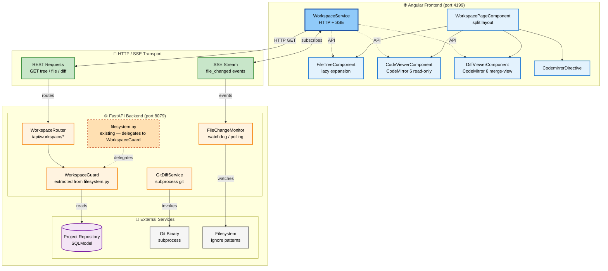
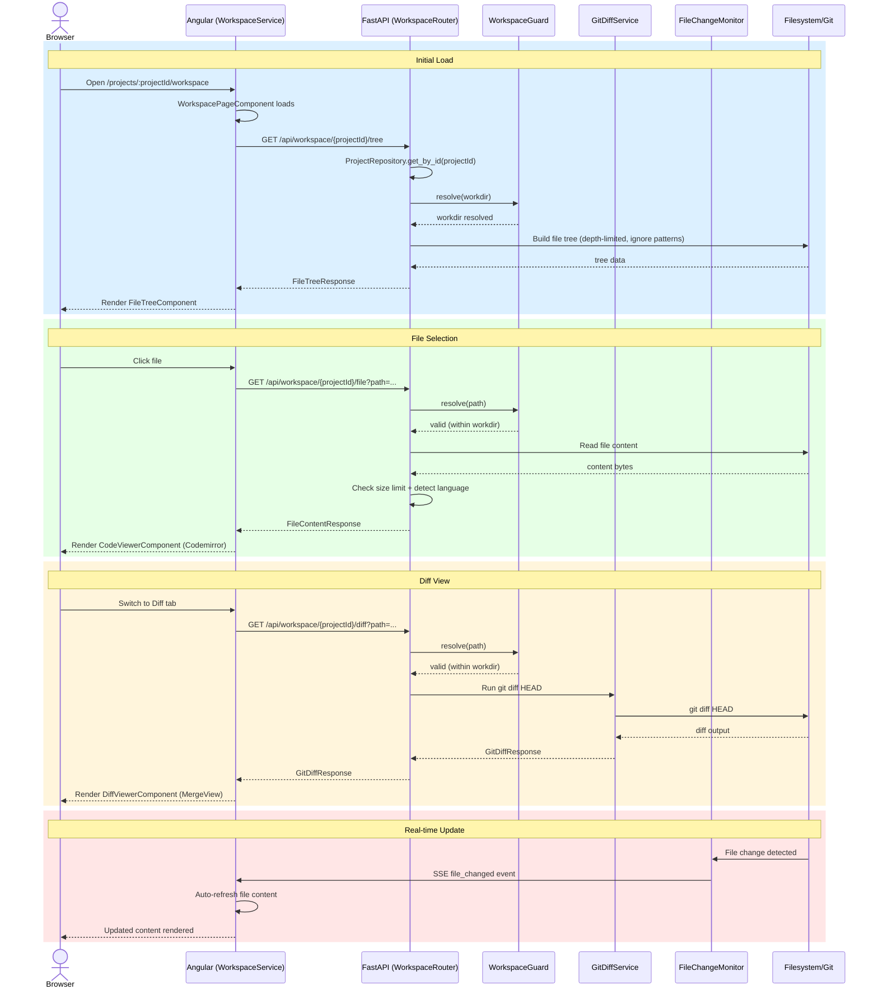

# Architecture Diagrams: Workspace Viewer

## System Architecture

### Color Legend
- 🔵 **Blue** = Angular frontend components (darker blue = central WorkspaceService hub)
- 🟢 **Green** = HTTP/SSE transport layer
- 🟠 **Orange** = FastAPI backend modules (dashed border = existing/legacy code)
- 🟣 **Purple** = SQLModel repository (cylinder)
- ⚪ **Gray** = External service dependencies

---

## Request Lifecycle (Sequence)

### Phase Grouping
- 🔵 **Initial Load** — Route activation → file tree fetch → tree render
- 🟢 **File Selection** — Click file → content fetch → CodeMirror render
- 🟠 **Diff View** — Switch tab → git diff fetch → MergeView render
- 🔴 **Real-time Update** — FileChangeMonitor → SSE → auto-refresh
