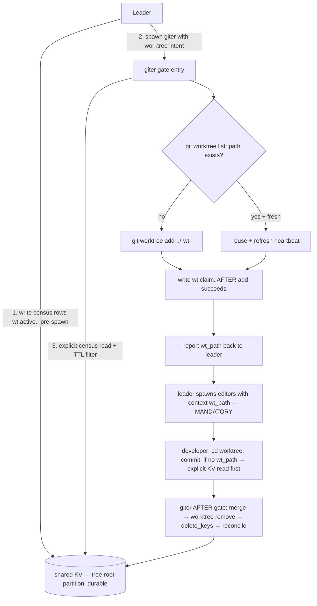

# Architecture Recommendation: Worktree-Aware Agent Coordination

Date: 2026-09-06
Mode: Standard Design (0–1 of 4 council criteria — prompt-only ⇒ reversible, no cross-system daemon impact)
Verification instances: `architect-worker-kv-verify` (data-flow-design, b8f09e5a) · `architect-worker-protocol-soundness` (resilience-design, b78c0124)
Status: **COMPLETE — one load-bearing plan claim REFUTED; prompt-only architecture survives via one structural re-adjudication (D3) plus five protocol corrections.**

---

## 1. Verification Verdicts — the two load-bearing claims

### Claim (a) "KV writes auto-surface in every same-tree sibling's [SYSTEM CONTEXT]" — **REFUTED**

`_fetch_kv_metadata` exists (`daemon/services/context_messages.py:964-997`) and performs a live DB read, but three independent defects break the "every sibling, automatically" guarantee:

| # | Defect | Evidence | Consequence for the plan |
|---|--------|----------|---------------------------|
| 1 | **Snapshot cadence** — the runtime `[SYSTEM CONTEXT]` KV block is checkpoint-cached and rebuilt ~once per instance (first non-report turn); injected messages, report delivery, job events, retries, and revives do NOT refresh it | `context_messages.py:1201-1213, 1270-1314, 1319-1360`; runtime build `instance_messaging.py:3534-3657`; live-but-synthetic API read `persistence.py:907-947` | Mid-task claim/heartbeat/cleanup changes never surface to an already-running consumer |
| 2 | **Spawned-child mispartition** — a child's first runtime context assembly hardcodes `_persistent_parent_id=None`, so it can read its **own** partition instead of the tree-root partition where giter writes; the correctly-configured graph repair is discarded | `instance_messaging.py:3609-3629`; discarded repair `graph.py:3870-3879` | The protocol's primary consumer (a developer spawned by the leader) may see an **empty** KV block even on its first turn |
| 3 | **System-default project suppression** — KV fetch is skipped entirely for system-default projects on the first turn | `context_messages.py:1342-1345` | Claim never auto-surfaces at all in the default-project case |

**Therefore D3-Option-A (auto-surface as substrate) is not viable, and the plan's definition-of-done sentence — "the spawned editors see the worktree path in `[SYSTEM CONTEXT]` automatically" — does not hold as written.** This does NOT collapse the feature: the daemon-change verdict stays NONE because a reliable prompt-only alternative exists (§2).

### Claim (b) "KV is DB-backed and durable, survives restarts" — **CONFIRMED**

- Table `shared_context_metadata` (`daemon/repositories/shared_meta_kv/models.py:33-72`), created via `SQLModel.metadata.create_all` (no versioned migration — informational only).
- `set_many` validates, executes, and commits in **one transaction** (`repository.py:228-274`); committed rows survive restart; no KV cache layer.
- Bounds: key ≤ 128 chars, serialized value ≤ 4096, batch ≤ 100. Composite unique `(context_key, meta_key)`; upsert = last-writer-wins; **no TTL, no sweeper** — all freshness/cleanup must be prompt-level (read-side filters + reconciliation, §4).
- Caveats: tool-level mixed `delete_keys`+`set_kv` is two separate commits (not atomic); fresh-SQLite boot is broken by unrelated migration `20260714_000001` (known critical note).

### Third correction the plan must absorb — **obsolete tool schema**

The plan's usage snippets (`shared_meta_kv(action="set", key=…, value=…)`, e.g. `technical-analysis.md:81`) document an **obsolete API**. The real schema: `set_kv` (dict), `delete_keys` (list), `clear_all`; empty/default arguments read `get_all_as_dict` (`daemon/tools/shared_meta_kv_tools.py:71-75,109-150`). Note: `agents/governor/tools_note.md:100-115` carries the same obsolete documentation (pre-existing doc bug, out of scope here). Phase-plan prose must either use the real parameter names or reference the tool generically.

### Prior art status

`council_manifest` (governor) and `pm_leader_instances` (project-manager) run on the same durable KV — and critically, the governor's restore path performs an **explicit tool read**, which is exactly the pattern that still works under the defects above. The plan's precedent citations are sound; the plan simply assumed an ambient auto-surface the governor never relied on.

---

## 2. Re-Adjudicated Awareness Channel (D3 — the one structural change)

| Approach | Complexity | Scalability | Maintainability | Risk | Cost | Recommendation |
|----------|-----------|-------------|-----------------|------|------|----------------|
| **A: KV auto-surface into `[SYSTEM CONTEXT]`** (original plan substrate) | Low | n/a — does not deliver | Low (implicit, undebuggable) | 🔴 **Unacceptable** — silently absent in 3 verified cases (§1a) | Low | **REJECTED** — refuted by code evidence |
| **B: Explicit hand-off — leader `send_message(context={"wt_path":…})` + consumer-side explicit KV reads** | Low-Med | Good (per-dispatch, no ambient state) | Med-High (visible in dispatch prose, greppable) | 🟡 Low — depends on leader discipline; backstopped by developer-side KV read | Low | ✅ **RECOMMENDED — MANDATORY, not optional** |
| **C: Daemon-side `[SYSTEM CONTEXT: Worktree]` header** | High | Good | Med (new daemon surface) | 🟡 Med | High | Rejected — violates the prompt-only constraint; revisit only if B proves insufficient |

**Ratified design (replaces D3-Option-A as primary):**

1. **PRIMARY — explicit dispatch context.** When the leader spawns editors with a worktree assignment, it passes a **non-empty** `context={"wt_path": …, "wt_slug": …, "wt_branch": …}`. Non-empty context forces the durable enqueue routing (`daemon/tools/instance.py:2738-2759`) and persists as `MessageQueue` metadata atomically with the task (`instance_messaging.py:1753-1765`) — immune to all three §1a defects. (Empty `{}`/`None` does **not** force enqueue — always include at least `wt_path`.)
2. **DEFENSE-IN-DEPTH — explicit KV read at git gates.** All five agents hold `shared_meta_kv` (verified: giter/leader/developer/tester/tidier `meta.json`), and **tool calls** resolve the tree-root partition correctly via the parent chain (`shared_meta_kv_tools.py:109-122`). One line in developer's Auto-Commit gate: *"no worktree path in my context → read the shared KV for `wt.claim.*` rows for this branch before any git operation."* This closes the leader-forgets-context hole and is the same pattern the governor's restore uses.
3. **Auto-surface: opportunistic only.** It may appear (tree-root owner, fresh builds, non-default projects); it is never load-bearing and — per the writing guide's no-system-internals rule — prompts must not describe the mechanism at all.

**Corrected protocol flow:**



**Daemon-change verdict: NONE — retained, with an honest caveat.** It holds *because* D3 is re-ratified onto explicit channels; the originally-designed ambient substrate does not work. Three latent daemon defects are logged in §6 for a future daemon ticket (they silently degrade every KV-awareness protocol, including governor restore visibility) — but none block this feature.

---

## 3. Fork Adjudications (O-D1.1 … O-D5.3)

| Fork | Verdict | One-line rationale (evidence-cited) |
|------|---------|--------------------------------------|
| **O-D1.1** threshold `≥2` vs ANY non-giter entry | **KEEP `≥2`, but define it precisely and delete the ambiguity** — trigger = "≥2 TTL-fresh `wt.active.*` rows for this branch". Strike the "giter itself is one actor" parenthetical from the prompt encoding (it is the ambiguity source). | True checkout contention requires **2 concurrent editors**; giter is serialized by the existing "Git Setup is NOT Parallelizable" rule, and the single-dev majority path stays worktree-free (preserves success-criterion #10). The stale-row inflation that `≥2` was partly guarding against is now handled by the census TTL (§4), not by counting. |
| **O-D1.2** heuristic fallback: Cardinal or guideline | **Guideline** | Cardinal cap discipline (giter `rule.md` ≈ 7 already; guide §3 `:84-87`); the fallback is a safety net, not an invariant. Matches plan default. |
| **O-D2.1** heartbeat staleness 30 vs 10 min | **10 min** for `wt.claim.*` heartbeat; **15 min read-side TTL** for `wt.active.*` census rows | Giter's heartbeat advances per action (tool call), so >10 min between beats is already anomalous; 30 min only fires on dead-giter, where no consumer acts (Worker B: "liveness signal without a consumer"). Census rows previously had **no** freshness signal at all — a leader crash left sticky phantom rows (🔴 R3); the read-side TTL bounds them. Stale handling is always verify-at-next-giter-entry, never mid-flight removal. |
| **O-D2.2** claim write order AFTER vs BEFORE | **AFTER — retained**, with two mandatory companions | "Absent claim beats half-written claim; worktree on disk is the anchor" holds. The awareness gap it opens (crash between add and claim; developer spawned before claim visible) is closed by the mandatory `context=` hand-off (§2), and the orphaned-worktree case is closed by the pre-check rule: run `git worktree list --porcelain` **before** every `add`; if the path exists, reuse + refresh heartbeat instead of erroring. |
| **O-D2.3** slug derivation | **Sanitized branch + fallback + collision suffix** | slug = lowercase, strip `feature/`/`fix/`/`hotfix/` prefix, map any char outside `[a-z0-9_-]` to `-`, truncate at 48 chars. If empty **or** branch is a shared base (`latest`/`main`) → slug = `task-<short-task-id>`. If the resulting `wt.claim.<slug>` already holds a **fresh** claim from another task → append `-<4hex>` disambiguator. Kills all verified collision classes (prefix strips, shared `latest`, sanitization folds, non-ASCII) while keeping names readable and inside the 128-char key budget with headroom. |
| **O-D3.1** redundant `send_message(context={"wt_path":…})`? | **MANDATORY** — evidence-converted (was "optional belt-and-suspenders") | The auto-surface substrate is refuted (§1a); the "redundant" channel is now the load-bearing one. *Planner marked this fork User — the user retains a veto, but vetoing re-breaks D3; recommend accepting.* |
| **O-D4.1** sibling-dir vs inside-repo | **Sibling-dir `../<repo>-wt-<slug>/`** | Matches the existing family; zero `.gitignore` pollution; verified stale registrations all live outside the repo — consistent. Matches plan default. |
| **O-D4.2** traps as Cardinal or guideline | **Guideline — with corrected trap content** | Cap discipline unchanged; the `.env` trap's *content* was wrong in the plan and must be replaced (§5). Matches plan default on strength. |
| **O-D5.1** promote giter guideline to Cardinal? | **NO** | Cap ≈ saturated; the workflow.md "Worktree Mode" section carries the load-bearing context. Matches plan default. |
| **O-D5.2** ~1330-byte budget concise enough? | **Revise ceiling to ~1650 bytes — USER-FORK** | The evidenced corrections add ~300 bytes (TTL lines, pre-check rule, mandatory context line, corrected .env rule, conditional `-b`). Every added line traces to a verified failure mode; the budget's purpose (bloat prevention) is preserved. Genuine user trade-off — recommend accepting the revised ceiling. |
| **O-D5.3** leader Cardinal "AFTER-gate giter MUST run"? | **Defer — and add a giter-side reconciliation rule instead** | A leader Cardinal adds cap pressure for a rule the existing serialization already implies. The real gap Worker B found is the *missed* AFTER gate (no recovery actor) — solved by giter-entry reconciliation (§4), not by a leader Cardinal. |

**USER-FORK summary:** O-D5.2 (byte ceiling) is the only genuinely preference-shaped fork left. O-D3.1 was user-shaped but is now evidence-decided (veto window open, not recommended).

---

## 4. Protocol Soundness — ratified encodings

### Staleness (two clocks, both read-side)
- `wt.claim.<slug>`: `heartbeat_ts` older than **10 min** = stale → next giter entry verifies (`git worktree list`) and either reuses + refreshes heartbeat, or removes + recreates. Never remove mid-flight.
- `wt.active.<branch>.<task>`: `spawned_at` older than **15 min** = treat as absent when counting (KV has no TTL — this is a prompt-level read filter, one line).

### Key schema (corrected)
```
wt.claim.<slug>                  # giter writes AFTER worktree add succeeds
wt.active.<branch>.<task-id>     # leader writes per planned editor, BEFORE spawning giter
```
Per-task census keying (vs the plan's branch-keyed `wt.active.<branch>`) makes cleanup **surgical**: giter's AFTER-gate deletes only its own task's rows, so two features sharing branch `latest` cannot delete each other's census (Worker B missed-risk #2), and a crashed leader's phantom row is TTL-bounded instead of sticky (🔴 R3). Giter's census read becomes a prefix scan (`wt.active.<branch>.`), same one-line cost.

### Crash windows — every window has a healing rule
| Window | Residual state | Healing rule |
|--------|----------------|--------------|
| worktree add ✓, claim write ✗ | orphan worktree, no claim | pre-check at next giter entry reuses it |
| leader census write ✓, spawn ✗ | phantom census row | 15-min read-side TTL |
| claim ✓, developer spawned before KV visible | (moot) | awareness via `context=`, not KV timing |
| AFTER gate never runs (leader crash pre-merge) | worktree + claim persist | **reconciliation at every giter entry** (below); giter is spawned at every leader BEFORE gate anyway |
| crash between `worktree remove` and `delete_keys` | phantom claim | reconciliation: claim whose worktree is gone → delete row |

**Reconciliation rule (the AFTER-gate's safety net, runs at EVERY giter gate entry):** enumerate `git worktree list` for `../<repo>-wt-*` family paths; a registered worktree with no matching fresh claim → staleness-check the branch's last activity, then adopt or remove; a fresh claim whose path is not registered → delete the row. **Scope: only the `<repo>-wt-*` family** — never touch foreign registrations (§ stale worktrees below).

**Cleanup order:** merge → `git worktree remove` → `delete_keys`. If the crash lands between remove and delete, the leftover is a *phantom claim*, which reconciles trivially (row-deletion); the reverse order would strand disk.

### LWW benignity — confirmed with guards
Heartbeat-over-heartbeat: benign (single writer: giter). Census rewrites: idempotent under per-task keys. Two giter instances racing `add` for the same path: second `add` errors → **pre-check-before-add** makes this a reuse, not a failure (`_set_many_lock` is process-local — `repository.py:78` — so no cross-process serialization exists; the prompt rule is the only guard). Slug collisions: disambiguation suffix (O-D2.3).

### Existing stale worktrees — plan Risk #8 is wrong; corrected
Read-only verification: **5** registrations (not 4): `adj-head`, `hotfix-defer-gate-base`, `m1-gate-base`, `pcfg-base`, `ens-autopromote-micro` — all directories **exist** under `/private/tmp/`, and all are **outside** the `../<repo>-wt-*` family. `git worktree prune` is a **no-op** on them (prune only drops registrations whose directory is gone). The plan's claim that the AFTER-gate flow "addresses" them is incorrect. Resolution: **one-time operator cleanup, outside feature scope** (`git worktree remove` per entry after confirming none is active); the feature's giter reconciliation deliberately ignores foreign paths.

---

## 5. Corrected Traps (D4)

| Trap | Plan said | Verified reality (correct encoding) |
|------|-----------|-------------------------------------|
| **`.env` source** 🔴 | "worktree daemons source the main repo's `.env`" — **reversed** | `dev.sh` cd's to its own `$SCRIPT_DIR` and sources `./.env` **there** (`dev.sh:13-16,58-64,88`). A `dev.sh` run inside a worktree sources a **nonexistent** `.env` → empty env → defaults (`ensemble_prod`). Correct rule: **never launch `dev.sh` from inside a worktree**; if a worktree daemon is needed, export the main repo's `.env` first (`set -a; source <main-repo>/.env; set +a` — the portable form; `/proc/environ` does not exist on macOS) and bind a non-8079 port. Canonical source: `LESSONS/2026-08-20-e2e-never-claimed-signature.md` — **not** `RESULTS/2026-08-20:59` as the plan cites. |
| **cwd isolation** | "cd into worktree before git ops" — correct but incomplete | Keep the cd rule; add: a fresh worktree has **no `.venv`** — code that must *run* there needs `uv sync` first (~30 s); git-only work needs none. (Venv-shadow false-positives: `LESSONS/2026-09-05-worktree-daemon-filecheck-cwd-trap.md`.) |
| **Port 8079** | tester-only — stands | Generalized by the `.env` rule's alt-port clause (any worktree daemon). |
| **NEW — `add -b` refusal** | not covered | `git worktree add -b <branch>` refuses if the branch is already checked out anywhere. Rule: use `-b` only when the branch exists nowhere; otherwise `git worktree add <path> <branch>`. |
| **NEW (minor) — `index.lock` contention** | not covered | Transient lock failures during concurrent git ops → retry once after a short sleep. 🟢 optional if byte budget is tight. |

---

## 6. Risks the Planner Missed (deduped, severity-ordered)

| Sev | Risk | Disposition |
|-----|------|-------------|
| 🔴 | **Awareness-channel failure** — 3 independent auto-surface defects (snapshot cadence; child mispartition `_persistent_parent_id=None`; system-default suppression) | Fixed by §2 (mandatory explicit hand-off + explicit reads) |
| 🔴 | **`.env` attribution reversed** — every worktree daemon launched via `dev.sh` in-tree hits prod defaults | Fixed by §5 correction |
| 🔴 | **Branch-keyed census rows** — sticky phantoms (no TTL/sweeper) + cross-feature delete collisions on shared `latest` | Fixed by per-task keys + read-side TTL (§4) |
| 🟡 | **Obsolete KV tool schema** in plan examples (`action=`/`key=`/`value=`) | Phase docs must use the real API or generic tool references |
| 🟡 | **No recovery actor for a missed AFTER gate** | Fixed by giter-entry reconciliation (§4) |
| 🟡 | **Non-atomic `worktree remove` + `delete_keys`** | Fixed by remove-first order + reconciliation (§4) |
| 🟡 | **`git worktree add -b` refusal** when branch checked out elsewhere | Fixed by conditional rule (§5) |
| 🟢 | `uv sync` cost per fresh worktree; `index.lock` retries; non-ASCII branch slugs | Documented (§5); sanitize covers slugs |

**Latent daemon defects — logged for a future daemon ticket, explicitly NOT this feature:** (1) spawned-child first-build mispartition (`instance_messaging.py:3609-3629`, repair discarded at `graph.py:3870-3879`); (2) system-default project KV suppression (`context_messages.py:1342-1345`); (3) once-per-instance snapshot cadence. These silently degrade *all* KV-based ambient awareness, including governor `council_manifest` restore visibility.

---

## 7. Impact on Plan Docs (pre-implementation edits)

1. **decisions.md / technical-analysis.md** (planner-owned; corrections for the developer to apply during implementation): D3 rewrite per §2; D2 key schema + both staleness clocks + pre-check rule (§4); D1 threshold wording per O-D1.1; D4 trap table per §5; Daemon-Change Verdict NONE retained **with the §2 caveat sentence**; replace obsolete tool-schema examples.
2. **phase1-plan.md**: Worktree Mode content gains — per-task census keys, 10/15-min clocks, reconciliation rule, pre-check-before-add, conditional `-b`, corrected `.env` rule, real KV parameter names. Threshold wording at `:14`/`:121` is ambiguous ("in addition to my own census") — replace with the O-D1.1 wording.
3. **phase2-plan.md**: leader's `context=` hand-off moves from optional to **mandatory** (non-empty dict: at least `wt_path`); leader pre-write of census rows stays **before giter spawn** (detection requires it; phantom cost is TTL-bounded — this intentionally overrides the project-manager spawn-first ordering, and the override should be stated).
4. **phase3-plan.md**: sweep greps update — the "30-min heartbeat literal" check becomes 10-min; add reconciliation/pre-check phrases to the duplication sweep.
5. **plan-overview.md**: definition-of-done sentence reword — "editors receive the worktree path in the dispatch context and confirm via shared KV" (not "see … in `[SYSTEM CONTEXT]` automatically"). Risk #8 corrected per §4. Success criterion #10 unchanged.
6. **Writing-guide compliance**: prompts must state the corrected rules operationally (first person, no daemon internals — no `_fetch_kv_metadata`, no file paths); this document cites internals freely because it is a planning artifact, not a prompt.

---

## 8. Decisions Pending (user)

1. **O-D5.2 — revised byte ceiling ~1650** (from ~1330). Recommended: accept.
2. **O-D3.1 veto window** — mandatory `context=` hand-off is evidence-decided; veto only if leaner dispatches matter more than reliable awareness (not recommended).
3. **Operator one-time cleanup** of the 5 `/private/tmp` worktree registrations (outside feature scope).
4. **Cosmetic:** accept the family-name form `<repo>-wt-<slug>` (no type prefix) vs restoring a `<type>-` segment to match `agents-ensemble-wt-revive-fix`. Default: keep the plan's simpler form.

## 9. Confidence

**High** on §1 verification verdicts and the §2 channel re-adjudication (code-cited, dual-worker corroborated). **Medium** on the calibration numbers (10/15-min clocks, ≥2 threshold) — they are one-line swappable literals by design, per the plan's own convention. The assumption that would flip the recommendation: if a daemon fix for the child-mispartition + snapshot-cadence defects lands first, ambient auto-surface could be re-evaluated as a substrate — not worth blocking on.
