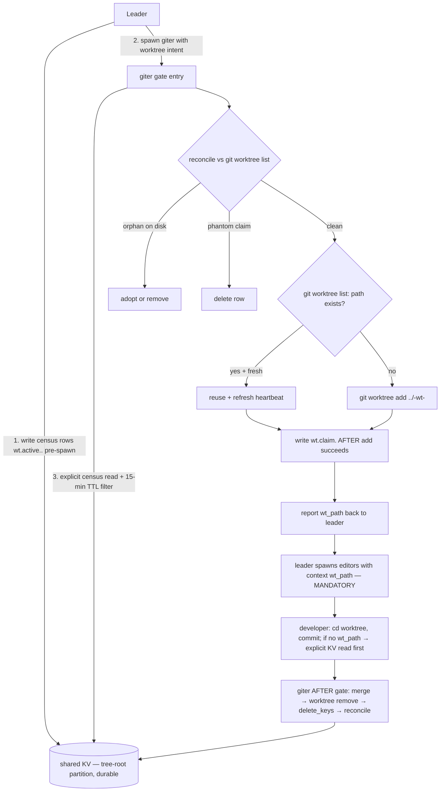

# Decisions: Worktree-Aware Agent Coordination

Date: 2026-09-06
Author: planner[v2] via technical-analysis worker
Status: **RATIFIED / FINAL** — all 11 forks (O-D1.1 … O-D5.3) resolved; architect verdict (architecture-recommendation.md §3) and user answers (U1–U4 below) folded in. Implementation-ready.
Companion: `technical-analysis.md` (architecture + trade-offs + failure modes), `architecture-recommendation.md` (architect verdict + 5 protocol corrections), `plan-overview.md` (definition-of-done + phases + risks + success criteria).

**Authority order:** this file (after the 2026-09-06 revision pass) supersedes any earlier architect or planner text. D3 was REFUTED on substrate grounds (auto-surface defects — see §1a of the architect's file) and re-ratified onto Option B (mandatory explicit hand-off + explicit KV reads). No further forks open.

**User answers (recorded verbatim from the dispatch, applied throughout this file):**
- **U1.** Byte ceiling **~1650B** total across 5 agents (supersedes 1330B; redistribute the ~320B delta sensibly; keep explicit per-agent caps; giter + leader absorb most of it for the reconciliation rule / dual clocks / pre-check and the mandatory context hand-off wording).
- **U2.** O-D3.1 explicit context hand-off **CONFIRMED MANDATORY** — leader MUST pass worktree context via `send_message(context={"wt_path":…})` when fanning out concurrent editors. Encoded per the architect's D5 verdicts (not Cardinal-strength in leader's prompt; guideline + workflow.md pointer is the canonical pattern).
- **U3.** Stale-worktree cleanup **IN-SCOPE** → new `phase4-plan.md` (one-time giter sweep, post-merge).
- **U4.** The 3 latent KV daemon defects = **SEPARATE follow-up task** the leader spawns AFTER this feature — referenced in ONE line at most in `plan-overview.md` ("Follow-ups") and `technical-analysis.md` (defect note); NOT in this plan's scope.

This file is the ratification skeleton. Each decision D0..D5 states the question, options, **VERDICT** (decisive), rationale, and status. **All forks are closed; no escalation list remains.**

---

## D0 — Framing (added only because the cross-cutting contract needs an explicit canonical home)

**Question:** Which agent's prompt is the canonical home for the worktree-awareness contract?

| Option | Description |
|--------|-------------|
| A | `giter/workflow.md` (giter writes the claim, owns the lifecycle) |
| B | `.agents/shared/worktree-conventions.md` (shared doc, all agents mirror) |
| C | Per-agent mirrors, no canonical home |

**RECOMMENDATION: A — giter/workflow.md "Worktree Mode" section is the canonical home.**

**Rationale:** The agent-prompt-writing-guide (`docs/agent-prompt-writing-guide.md:66-78`) binds "one canonical home per cross-agent contract" — and giter is the only write-side actor in the protocol (it writes `wt.claim.*`; everyone else reads via explicit tool call or dispatch context). Leader, developer, tester, tidier each get a one-line pointer to giter's section. Option B creates a new doc the writers must remember to update alongside prompt changes — pure coordination tax. Option C is exactly what the guide forbids (drift by parallel maintenance).

**Status:** **RATIFIED / FINAL** (D0 carried by unanimous recommendation; no fork opened).

---

## D1 — Detection: How does giter detect "worktree needed"?

**Question:** What signal triggers giter to create a worktree instead of operating on the main checkout?

| Option | Description | Strength | Weakness |
|--------|-------------|----------|----------|
| A | **KV census by giter** — leader writes `wt.active.<branch>` entries before fan-out; giter reads on gate entry | Cleanest, uses existing primitives, provides awareness + crash-recovery; matches governor precedent | Requires leader discipline to write before spawn |
| B | **Concurrent-branch + dirty-tree heuristic** — `git status` + `git worktree list` inferred | Zero coordination overhead | False positives; no awareness signal |
| C | **Running-instance census** — giter enumerates sibling instances | Most accurate | **Unavailable to giter** — no instance tools in `meta.json:10`; requires meta.json + new tool surface |
| D | **Leader declaration only** — leader tells giter explicitly in dispatch message | Simple | Brittle; no general trigger |

**RECOMMENDATION: A as primary, B as fallback guideline.**

**Rationale:** A is the only candidate that simultaneously provides detection, awareness, and crash-recovery without daemon changes, and all five relevant agents already hold `shared_meta_kv` (verified via `meta.json`). B's heuristic is too coarse for the primary signal but useful as a defensive guideline ("if any sibling editor is active AND main checkout is dirty, default to a worktree"). C requires tool changes the user explicitly does not want. D is brittle to leader prompt drift.

**Threshold (per O-D1.1 verdict):** trigger = "**≥2 TTL-fresh `wt.active.*` rows for this branch**". Two concurrent editors is what creates real checkout contention; giter itself is serialized by the existing "Git Setup is NOT Parallelizable" rule. The "giter is one actor" parenthetical is **deleted from the prompt encoding** (it was the ambiguity source). Stale-row inflation that `≥2` was partly guarding against is now bounded by the census TTL (D2/O-D2.1).

**Write discipline:** leader writes `wt.active.<branch>.<task-id>` (per-task keys, O-D2.x ratification) BEFORE spawning giter (one entry per planned editor, prefix `wt.active.<branch>.`). The leader pre-write intentionally **overrides** project-manager's `spawn → set_kv → send_message` ordering for this case: detection requires the row to exist before giter reads, and the phantom cost is bounded by the 15-min census TTL.

**Fork verdicts (RATIFIED):**
- **O-D1.1** threshold `≥2` vs ANY non-giter entry → **KEEP `≥2` (precise)**: trigger = "≥2 TTL-fresh `wt.active.*` rows for this branch"; delete the "giter itself is one actor" ambiguity from prompt prose.
- **O-D1.2** heuristic fallback Cardinal vs guideline → **GUIDELINE** (Cardinal cap ≈ 7 already; the fallback is a safety net, not an invariant).

**Status:** **RATIFIED / FINAL**.

---

## D2 — KV Protocol: exact schema, writers, lifecycle, staleness

**Question:** What is the precise key schema, writer/reader split, lifecycle, and staleness rule for the worktree-awareness protocol?

**Schema (per-task census keys, both key families ≤ 128 chars; values ≤ 4096 chars per `daemon/repositories/shared_meta_kv/repository.py:178-243`):**

```
wt.claim.<slug>                  # giter writes; all readers (real tool calls, NOT ambient)
wt.active.<branch>.<task-id>     # leader writes per planned editor, BEFORE spawning giter
```

- **Why per-task census keys (vs the prior branch-keyed `wt.active.<branch>`):** makes cleanup **surgical** — giter's AFTER-gate deletes only its own task's rows, so two features sharing branch `latest` cannot delete each other's census, and a crashed leader's phantom row is TTL-bounded instead of sticky. Giter's census read becomes a prefix scan on `wt.active.<branch>.` (one line).
- **Claim value:**
  ```json
  {
    "path": "<absolute worktree path>",
    "branch": "<branch name>",
    "owner": "giter",
    "purpose": "<short task description>",
    "ts": "<ISO 8601 creation>",
    "heartbeat_ts": "<ISO 8601 last giter action>",
    "owns_task_ids": ["<task-id>", "..."]
  }
  ```
  `owns_task_ids` (O2 — census-deletion ownership): giter copies the originating `wt.active.<branch>.` task-ids into the claim at creation, so the AFTER-gate's `delete_keys` removes exactly the census rows this claim owns (surgical cleanup even when other tasks share the branch).
- **Census value:**
  ```json
  {
    "branch": "<branch>",
    "task": "<task identifier>",
    "spawned_at": "<ISO 8601>",
    "spawner": "leader"
  }
  ```

**Lifecycle (refined per O-D2.2 verdict — AFTER retained with two mandatory companions):**

| Step | Actor | Action | Rationale |
|------|-------|--------|-----------|
| Pre-fan-out | leader | `set_kv({"wt.active.<branch>.<task-id>": <census>})` per planned editor, **BEFORE spawning giter** | Detection requires the row; phantom cost bounded by 15-min read-side TTL |
| Gate entry | giter | `shared_meta_kv` call with no args (partition read; `get_all_as_dict` is the repository method behind it, NOT a tool name) → prefix scan `wt.active.<branch>.` for TTL-fresh rows; reconcile against `git worktree list` | Reconciliation is the safety net for the missed-AFTER-gate failure mode (O-D5.3) |
| Pre-check (mandatory) | giter | `git worktree list --porcelain` BEFORE `git worktree add`; if `<path>` exists, REUSE + refresh heartbeat instead of erroring | Fixes the crash-between-add-and-claim window (O-D2.2 companion) |
| Worktree creation | giter | `git worktree add [−b <branch>] ../<repo>-wt-<slug> <base>` (conditional `-b`: use only when branch exists nowhere; otherwise `git worktree add <path> <branch>`) | Sibling-dir convention (D4); `-b` refuses if branch is already checked out anywhere |
| Post-creation | giter | `set_kv({"wt.claim.<slug>": <claim>})` AFTER `git worktree add` succeeds | Absent claim beats half-written claim; worktree on disk is the anchor |
| Dispatch | leader | `send_message(message=..., context={"wt_path": <path>, "wt_slug": <slug>, "wt_branch": <branch>})` to each editor — **MANDATORY** (D3/O-D3.1/U2); non-empty context forces durable enqueue routing | Primary awareness channel (auto-surface REFUTED, see D3 §3 below) |
| Work | developer | `cd <wt_path>`; backstop fires only when **no `wt_path` in context AND ≥1 fresh `wt.claim.*` row exists for this branch** → call `shared_meta_kv` with no args (partition read) and prefix-scan `wt.claim.*` (defense-in-depth backstop, C6 trigger) | Zero coordination tax when context carries the path |
| Heartbeat | giter | `set_kv({"wt.claim.<slug>": <claim-with-refreshed-heartbeat_ts>})` on each giter action (commit-merge, prune) | Freshness signal; 10-min ceiling per O-D2.1 |
| AFTER-gate | giter | merge worktree branch → `latest`; `git worktree remove <path>` (graceful); `delete_keys(["wt.claim.<slug>"] + the census rows named in the claim's `owns_task_ids`) | Cleanup order: remove-first then delete (phantom claim reconciles trivially; reverse order strands disk); census deletion is ownership-scoped via the claim (O2) |
| Reconciliation (every gate entry) | giter | enumerate `git worktree list` for `../<repo>-wt-*` family; registered worktree with no fresh claim → **adopt-vs-remove criterion (C5): worktree dirty OR branch HEAD age < 30 min → adopt + refresh heartbeat; else remove (graceful); dirty-remove refusal → STOP and report**; fresh claim whose path is not registered → delete row | Scope: only the `<repo>-wt-*` family; never touch foreign registrations |

**Staleness (two read-side clocks, per O-D2.1 verdict):**
- `wt.claim.<slug>`: `heartbeat_ts` older than **10 minutes** = stale → next giter entry verifies (`git worktree list`) and either reuses + refreshes heartbeat, or removes + recreates. **Never remove mid-flight** — "mid-flight" (O1) = an editor instance with an in-progress turn or uncommitted changes in its worktree; staleness handling therefore always waits for the next giter entry. **Heartbeat writer stays giter-only (O1 choice, minimal consistent with D2):** giter refreshes the heartbeat on each of its own actions; other participants touching the worktree do NOT write heartbeats — adding KV writers would contradict the ratified single-writer design (heartbeat-over-heartbeat is benign *because* giter is the only writer).
- `wt.active.<branch>.<task-id>`: `spawned_at` older than **15 minutes** = treat as absent when counting (the KV has no TTL; this is a one-line prompt-level read filter, applied to the prefix scan).

**Conflict semantics:** KV is last-writer-wins with no CAS. The schema is designed so concurrent writers cannot produce a corrupt state:
- `wt.claim.<slug>` keys are unique by slug (sanitized-branch + fallback + collision suffix per O-D2.3) — no path collision possible across giter instances.
- `wt.active.<branch>.<task-id>` keys are per-task — same task rewrite is idempotent; cross-task rows do not collide.
- Heartbeat updates are idempotent (always advance).
- Two giter instances racing on the same path: second `git worktree add` errors → **pre-check-before-add** makes this a reuse, not a failure (`_set_many_lock` is process-local — `repository.py:78` — so no cross-process serialization exists; the prompt rule is the only guard).

**Slug derivation (per O-D2.3 verdict):** lowercase; strip `feature/`/`fix/`/`hotfix/` prefix; map any char outside `[a-z0-9_-]` to `-`; truncate at 48 chars. If empty **or** branch is a shared base (`latest`/`main`) → slug = `task-<short-task-id>`. If the resulting `wt.claim.<slug>` already holds a **fresh** claim from another task → append `-<4hex>` disambiguator. Kills all verified collision classes (prefix strips, shared `latest`, sanitization folds, non-ASCII) while keeping names readable and inside the 128-char key budget with headroom.

**Crash windows — every window has a healing rule:**

| Window | Residual state | Healing rule |
|--------|----------------|--------------|
| worktree add ✓, claim write ✗ | orphan worktree, no claim | pre-check at next giter entry reuses it |
| leader census write ✓, spawn ✗ | phantom census row | 15-min read-side TTL |
| claim ✓, developer spawned before KV visible | (moot) | awareness via `context=`, not KV timing |
| AFTER gate never runs (leader crash pre-merge) | worktree + claim persist | **reconciliation at every giter entry** (giter is spawned at every leader BEFORE gate anyway) |
| crash between `worktree remove` and `delete_keys` | phantom claim | reconciliation: claim whose worktree is gone → delete row |

**Tool schema (per architect §1c — OBSOLETE `action=` API purged from all plan text):** the agent-callable tool is `shared_meta_kv` with parameters `set_kv` (dict), `delete_keys` (list), `clear_all` (bool); a call with no args / defaults performs the partition read (`get_all_as_dict` is the repository method behind that read path — O7: never present it to agents as a tool name; see `daemon/tools/shared_meta_kv_tools.py:71-75,109-150`). Plan snippets use the real names or refer to the tool generically — the obsolete `shared_meta_kv(action="set", key=…, value=…)` form does not exist in this file or any phase plan.

**Fork verdicts (RATIFIED):**
- **O-D2.1** heartbeat staleness 30 vs 10 min → **10 min for `wt.claim.*` heartbeat; 15 min read-side TTL for `wt.active.*` census rows**. (30 min only fires on dead-giter where no consumer acts; census rows previously had no freshness signal — leader crash left sticky phantom rows; the read-side TTL bounds them.)
- **O-D2.2** claim write order AFTER vs BEFORE → **AFTER retained**, with two mandatory companions: (i) pre-check-before-add (`git worktree list --porcelain` before every `add`; reuse + refresh heartbeat if path exists); (ii) reconciliation rule at every giter entry (claim whose worktree is gone → delete row).
- **O-D2.3** slug derivation → **sanitized branch + fallback + collision suffix** as specified above.

**Status:** **RATIFIED / FINAL**.

---

## D3 — Awareness Channel: how do consumers learn about the worktree?

**Question:** What mechanism delivers the worktree claim from giter to developer / leader / tester / tidier, given that the previously-assumed ambient auto-surface is REFUTED?

### §1 — Refutation of the prior substrate (auto-surface into `[SYSTEM CONTEXT]`)

The previously-assumed primary substrate — "KV writes auto-surface in every same-tree sibling's `[SYSTEM CONTEXT]` via `_fetch_kv_metadata`" — is **REFUTED** by code evidence (`architecture-recommendation.md §1a`). The live DB read exists at `daemon/services/context_messages.py:964-997`, but **three independent defects** break the "every sibling, automatically" guarantee:

| # | Defect | Evidence | Consequence |
|---|--------|----------|-------------|
| 1 | **Snapshot cadence** — the runtime `[SYSTEM CONTEXT]` KV block is checkpoint-cached and rebuilt ~once per instance (first non-report turn); injected messages, report delivery, job events, retries, and revives do NOT refresh it | `context_messages.py:1201-1213, 1270-1314, 1319-1360`; runtime build `instance_messaging.py:3534-3657`; live-but-synthetic API read `persistence.py:907-947` | Mid-task claim/heartbeat/cleanup changes never surface to an already-running consumer |
| 2 | **Spawned-child mispartition** — a child's first runtime context assembly hardcodes `_persistent_parent_id=None`, so it can read its **own** partition instead of the tree-root partition where giter writes; the correctly-configured graph repair is discarded | `instance_messaging.py:3609-3629`; discarded repair `graph.py:3870-3879` | The primary consumer (a developer spawned by the leader) may see an **empty** KV block even on its first turn |
| 3 | **System-default project suppression** — KV fetch is skipped entirely for system-default projects on the first turn | `context_messages.py:1342-1345` | Claim never auto-surfaces at all in the default-project case |

Therefore **D3-Option-A (auto-surface as substrate) is not viable**, and the plan's prior definition-of-done sentence — "the spawned editors see the worktree path in `[SYSTEM CONTEXT]` automatically" — does not hold. This does NOT collapse the feature: the daemon-change verdict stays NONE because a reliable prompt-only alternative exists (§2 below). The three latent daemon defects are **logged for a separate follow-up task** (U4 — leader spawns AFTER this feature) — they are NOT in this plan's scope.

### §2 — Ratified design (Option B — mandatory explicit hand-off + explicit KV reads)

| Approach | Complexity | Scalability | Maintainability | Risk | Cost | Recommendation |
|----------|-----------|-------------|-----------------|------|------|----------------|
| **A: KV auto-surface into `[SYSTEM CONTEXT]`** (prior substrate) | Low | n/a — does not deliver | Low (implicit, undebuggable) | 🔴 **Unacceptable** — silently absent in 3 verified cases (§1 above) | Low | **REJECTED** — refuted by code evidence |
| **B: Explicit hand-off — leader `send_message(context={"wt_path":…})` + consumer-side explicit KV reads** | Low-Med | Good (per-dispatch, no ambient state) | Med-High (visible in dispatch prose, greppable) | 🟡 Low — depends on leader discipline; backstopped by developer-side KV read | Low | ✅ **RATIFIED — MANDATORY, not optional** |
| **C: Daemon-side `[SYSTEM CONTEXT: Worktree]` header** | High | Good | Med (new daemon surface) | 🟡 Med | High | Rejected — violates the prompt-only constraint; revisit only if B proves insufficient |

**The ratified awareness channel is two-channel (primary + defense-in-depth):**

1. **PRIMARY — explicit dispatch context.** When the leader spawns editors with a worktree assignment, it passes a **non-empty** `context={"wt_path": …, "wt_slug": …, "wt_branch": …}`. Non-empty context forces the durable enqueue routing (`daemon/tools/instance.py:2738-2759`) and persists as `MessageQueue` metadata atomically with the task (`instance_messaging.py:1753-1765`) — **immune to all three §1 defects**. Empty `{}` / `None` does **not** force enqueue — always include at least `wt_path`.

2. **DEFENSE-IN-DEPTH — explicit KV read at git gates.** All five agents hold `shared_meta_kv` (verified: giter/leader/developer/tester/tidier `meta.json`), and **tool calls** resolve the tree-root partition correctly via the parent chain (`shared_meta_kv_tools.py:109-122`). One line in developer's Auto-Commit gate, with the CONCRETE trigger (C6): *"no `wt_path` in my context AND ≥1 fresh `wt.claim.*` row for this branch → read the shared KV (call `shared_meta_kv` with no args) before any git operation."* This closes the leader-forgets-context hole and is the same pattern the governor's `council_manifest` restore uses (`workflow.md:59-62,107,141,385-390`).

3. **Auto-surface: opportunistic only.** It may appear (tree-root owner, fresh builds, non-default projects); it is **never load-bearing** and — per the writing guide's no-system-internals rule — prompts must not describe the mechanism at all.

### §3 — Corrected protocol flow (Mermaid)



### §4 — Daemon-Change Verdict

**NONE** — retained, with an honest caveat. It holds *because* D3 is re-ratified onto explicit channels; the originally-designed ambient substrate does not work. The three latent daemon defects (§1) are logged in the architect file §6 for a future daemon ticket (they silently degrade every KV-awareness protocol, including governor `council_manifest` restore visibility) — but none block this feature. **They are out of scope here per U4.**

### §5 — Fork verdicts (RATIFIED)

- **O-D3.1** redundant `send_message(context={"wt_path":…})`? → **MANDATORY** — evidence-converted (was "optional belt-and-suspenders"). The auto-surface substrate is refuted (§1); the "redundant" channel is now the load-bearing one. Confirmed by user answer U2.

**Status:** **RATIFIED / FINAL**.

---

## D4 — Worktree Conventions: location, naming, cleanup, traps

**Question:** Where do worktrees live, what are they named, how are they cleaned up, and what documented traps (`.env` source, cwd isolation, port collision, conditional `-b`) must the prompts encode?

| Aspect | Decision | Rationale |
|--------|----------|-----------|
| **Location** | `../<repo>-wt-<slug>/` (sibling dir, outside the main repo) | Matches existing family (`agents-ensemble-wt-revive-fix`, `agents-ensemble-wt-hide-logs`); no `.gitignore` pollution; easy enumeration via `git worktree list` |
| **Naming** | `<repo>-wt-<slug>` where slug = per O-D2.3 verdict (sanitized branch + fallback + collision suffix) | Readable; discoverable via `ls ../`; fits 128-char KV key cap with headroom |
| **Cleanup (in-flow)** | giter AFTER-gate: `merge → git worktree remove <path> (graceful) → delete_keys([…]) → reconcile`. **Remove-first** then delete (phantom claim reconciles trivially; reverse order strands disk). | Reverses the plan's prior "prune fallback" framing; the architect file shows `git worktree prune` is a no-op when the directory exists, so remove is the primary verb. |
| **Cleanup (out-of-flow, pre-existing)** | One-time giter sweep of **5** registered `/private/tmp` worktrees (`adj-head`, `hotfix-defer-gate-base`, `m1-gate-base`, `pcfg-base`, `ens-autopromote-micro`) — covered by **Phase 4 (NEW)**, gated to land AFTER the feature merge commit. Each is `git worktree remove`'d individually after per-entry verification (registered + dir exists + not main checkout + no uncommitted work). `git worktree prune` is a NO-OP here (dirs exist); remove is the tool. | Per architect file §4 — the plan's prior claim that the AFTER-gate flow "addresses" the 4-then-5 stale entries is incorrect; giter's reconciliation deliberately ignores foreign paths (scope: only `<repo>-wt-*` family). Per user answer U3, this is in-scope. |
| **`.gitignore` entries** | **NONE** — sibling dirs are outside the repo | Avoids `.gitignore` bloat; sibling convention IS the discipline |
| **`.env` source trap (CORRECTED — prior encoding was REVERSED)** | `dev.sh` cd's to its own `$SCRIPT_DIR` and sources `./.env` **there** (`dev.sh:13-16,58-64,88`). A `dev.sh` run inside a worktree sources a **nonexistent** `.env` → empty env → defaults (`ensemble_prod`). **Correct rule:** never launch `dev.sh` from inside a worktree; if a worktree daemon is needed, export the main repo's `.env` first (`set -a; source <main-repo>/.env; set +a` — portable form; `/proc/environ` does not exist on macOS) and bind a non-8079 port. Canonical source: `LESSONS/2026-08-20-e2e-never-claimed-signature.md` — NOT `RESULTS/2026-08-20:59` as the plan previously cited. | The prior plan encoding ("worktree daemons source main-repo `.env`") is REVERSED and was dangerous if followed. Encode as a giter prompt rule (operator discipline). |
| **`cwd` isolation trap** | Giter MUST `cd <worktree-path>` before `git status` / `git log` for provenance. **Add:** a fresh worktree has **no `.venv`** — code that must *run* there needs `uv sync` first (~30 s); git-only work needs none. (Venv-shadow false-positives: `LESSONS/2026-09-05-worktree-daemon-filecheck-cwd-trap.md`.) | Documented failure (`.agents/tester/RESULTS/2026-09-06:61`); encode as giter prompt rule |
| **Port 8079 collision** | `dev.sh` hardcodes 8079 → worktree live-smoke (tester only) launches uvicorn on alt port directly. Generalized: any worktree daemon needs a non-8079 port. | Documented (`.agents/tester/RESULTS/2026-09-04:26`); out of scope for giter/developer — only tester cares |
| **`add -b` refusal trap (NEW)** | `git worktree add -b <branch>` refuses if the branch is already checked out anywhere. Rule: use `-b` only when the branch exists nowhere; otherwise `git worktree add <path> <branch>`. | Architect file §5 — conditional `-b` keeps the prompt encoding precise |
| **`index.lock` contention (minor)** | Transient lock failures during concurrent git ops → retry once after a short sleep. | Optional; encode only if byte budget permits |
| **Tester scratch worktrees (`/tmp/<gate>-base`)** | **KEEP SEPARATE** — throwaway per-test sandboxes, not coordination worktrees | Different purpose; no merge needed; no protocol overlap |

**Fork verdicts (RATIFIED):**
- **O-D4.1** sibling-dir vs inside-repo → **sibling-dir `../<repo>-wt-<slug>/`** (matches the existing family; zero `.gitignore` pollution; verified stale registrations all live outside the repo — consistent).
- **O-D4.2** traps as Cardinal or guideline → **guideline**, with **corrected trap content** (the `.env` trap was wrong in the plan and is replaced per architect §5; cap discipline unchanged).
- **Family name (C7 — RATIFIED):** `<repo>-wt-<slug>` ratified (leader adjudication, Critical #7 — matches existing machine family `agents-ensemble-wt-<slug>`).

**Status:** **RATIFIED / FINAL**.

---

## D5 — Agent Scope: which prompt files change, and how lean?

**Question:** Per the agent-prompt-writing-guide, which files change in each of the five agents, with what target role per file (rule.md = never-violate constraint, workflow.md = process)?

**Updated per-agent byte split (U1 accepted — total cap raised from ~1330B to ~1650B; redistribution absorbs the new content the architect file requires — reconciliation rule, dual clocks, pre-check, corrected .env trap, real KV schema, mandatory context hand-off wording):**

| Agent | rule.md | workflow.md | tools_note.md | Per-agent cap (revised) |
|-------|---------|-------------|---------------|-------------------------|
| **giter** | 0 new Cardinal; **1 new guideline** under Branch Management: "Concurrent editor detection — read shared KV census (prefix `wt.active.<branch>.`, TTL filter 15 min); if ≥ 2 fresh rows on this branch, create worktree before any git op. Reconcile against `git worktree list` at every gate entry." | **1 new section** "Worktree Mode" near Standard Git Operations (after the existing "Conflict Resolution Flow" heading): schema (with per-task census keys), lifecycle, location/naming, cleanup (remove-first), reconciliation rule, **two clocks (10-min heartbeat / 15-min census TTL)**, the four traps (corrected `.env`, `cwd`, port, conditional `-b`), pre-check-before-add, real KV tool names. | **1 new `### Worktrees` subsection**: 5 tool-shaped entries (list / add with conditional `-b` / add without `-b` for reuse / remove / **prune (foreign/missing-dir registrations only; NO-OP on live-dir worktrees — architect-verified; never a fallback when remove fails on a live-dir worktree — remove failure → STOP and report)**) + bare-stash pathspec golden-hour fix. | **~850 bytes** (was ~700; absorbs reconciliation rule, dual clocks, pre-check, conditional `-b`, corrected `.env`, real KV schema) |
| **leader** | 0 | **1 extension** in Git Flow section: 2-sentence "Worktree-Aware Fan-Out" note — spawn giter FIRST with worktree-create intent, WAIT for completion report, THEN spawn editors with **mandatory non-empty `context={"wt_path": …, "wt_slug": …, "wt_branch": …}`**. | **1 extension** of `send_message` `context=` documentation: add `wt_path`, `wt_slug`, `wt_branch` to suggested keys (currently `files`, `notes`, `plan_ref`) + one-line "non-empty context required for worktree awareness". | **~320 bytes** (was ~250; absorbs the mandatory hand-off wording per U2 + the "non-empty context required" guard; **measured literals: workflow.md 172 + tools_note.md 142 = 314 (caps stay 175+145=320, fits-with-headroom = 6B; the 6B is dead-optional headroom, NOT a target — see phase2-plan.md File-1/File-2 acceptance)**) |
| **developer** | **1 Must-Not bullet** (worktree-commit prohibition; S2: exactly two artifacts total — the former third auto-commit-area guideline is DROPPED; O6: NO KV-read line in rule.md) | **1 prefix** in Auto-Commit section — CANONICAL home of the KV-read backstop: "no `wt_path` in context AND ≥1 fresh `wt.claim.*` row for this branch → read shared KV first" (C6 concrete trigger; defense-in-depth for leader-forgets-context). | n/a | **~220 bytes** (sub-caps rule 95 + workflow 125 = 220 exactly) |
| **tester** | 0 | **1 one-line pointer** in `### Dispatch Pattern` (infrastructure task, no skill): "For worktree regression-proof conventions, see `giter/workflow.md` → Worktree Mode" | n/a | **~130 bytes** (was ~100; absorbs the `.env` non-collision reminder for tester live-smoke on alt port) |
| **tidier** | 0 | **1 one-line pointer** in `### Investigate`: "If a worktree was used for the feature, review inside `../<repo>-wt-<slug>/`, not the main checkout" | n/a | **~130 bytes** (was ~80; absorbs the corrected `.env` caution for tidier verification runs that might spawn a daemon) |

**Total: ~1650 bytes of new prose across 5 agents** (was ~1330; per U1; the ~320B delta traces line-for-line to the architect's evidenced corrections — every added line is a verified failure-mode fix, not bloat).

**Rationale:**
- **No Cardinal additions anywhere** — the protocol is encoded as guidelines + workflow processes, keeping all `rule.md` files lean (≤ 7 Cardinals per `docs/agent-prompt-writing-guide.md:84-87`). Verification is the **content-stability assertion** (plan-overview criterion 4 — `## Must` / `## Must Not` regions byte-identical to HEAD), not a Cardinal-heading grep: flat rule lists carry no `###` headers to count (C4).
- **Canonical home = giter** (D0); other agents reference it with one-line pointers (canonical-home rule per `:66-78`).
- **One canonical contract per artifact** — schema and lifecycle live in giter/workflow.md once; leader's `context=` keys reference the same names.
- **No system internals in prompts** (`:13-49`) — say "shared KV store", never `shared_context_metadata`; say "tree-root partition", never `get_tree_root_id`; say "worktree", never `git worktree` configuration surface.
- **Real KV tool names** (per architect §1c) — the agent-callable tool is `shared_meta_kv`: `set_kv` (dict), `delete_keys` (list), `clear_all`; a no-arg call performs the partition read (`get_all_as_dict` is the repository method behind that read path, never presented as a tool). The obsolete `action="set"/"delete"/key=…` form is purged from every snippet.
- **Defense-in-depth depth-2** — the primary awareness is `context=`; the secondary is developer's explicit KV read when context is empty. Both are prompt-level; the latent daemon KV-suppression defects (architect §1a) do not block them.

**soul.md:** **NO changes** to any agent's soul.md (soul.md is identity/tone; this is process).

**Fork verdicts (RATIFIED):**
- **O-D5.1** Promote giter guideline to Cardinal? → **NO**. Cap ≈ saturated; the workflow.md "Worktree Mode" section carries the load-bearing context.
- **O-D5.2** ~1330-byte budget concise enough? → **REVISE CEILING TO ~1650 BYTES (U1 accepted)**. The evidenced corrections add ~320B (TTL lines, pre-check rule, mandatory context line, corrected `.env` rule, conditional `-b`); every added line traces to a verified failure mode; the budget's purpose (bloat prevention) is preserved.
- **O-D5.3** Add leader Cardinal "AFTER-gate giter MUST run"? → **DEFER**, and **add a giter-side reconciliation rule instead**. A leader Cardinal adds cap pressure for a rule the existing serialization already implies. The real gap the architect's Worker B found is the *missed* AFTER gate (no recovery actor) — solved by giter-entry reconciliation (D2 lifecycle), not by a leader Cardinal.

**Status:** **RATIFIED / FINAL**.

---

## Daemon-Change Verdict

**NONE** — retained, with the §1 caveat from D3 (auto-surface defects logged but not blocking). All five design questions are resolvable with prompt updates + existing daemon primitives:
- `shared_meta_kv` write/read/list/delete (`daemon/repositories/shared_meta_kv/repository.py:178-243,276-315`)
- **Explicit `send_message(context={...})` (non-empty) hand-off** — durable enqueue routing (`daemon/tools/instance.py:2738-2759`, `instance_messaging.py:1753-1765`) — PRIMARY awareness channel
- **Explicit `shared_meta_kv` tool reads at git decision gates** — defense-in-depth backstop (governor `council_manifest` pattern)
- `git worktree` CLI (external — giter invokes via bash)

The three latent daemon defects (architect §1a — snapshot cadence, spawned-child mispartition, system-default suppression) are NOT blocking because the explicit-channel design sidesteps them. They are logged for a separate follow-up task (U4) the leader spawns AFTER this feature ships; in this plan's scope they are referenced in ONE line each (plan-overview "Follow-ups", technical-analysis defect note) and nowhere else.

If a future need arose (dedicated `[SYSTEM CONTEXT: Worktree]` header, KV TTL, automatic prune tooling), that would be the point to propose a daemon change. **Expected: NONE for this feature.**

---

## Closed Forks — All 11 Ratified

These were unresolved sub-questions the technical analysis surfaced. All are now closed with the architect's verdict and/or the user's answer.

| ID | Question | Verdict | Source |
|----|----------|---------|--------|
| O-D1.1 | Worktree-needed threshold: `≥ 2` active entries vs ANY non-giter entry | `≥ 2` (precise: ≥ 2 TTL-fresh `wt.active.*` rows; delete "giter is one actor" ambiguity) | architect §3 |
| O-D1.2 | Heuristic fallback (D1 option B): Cardinal or guideline? | Guideline | architect §3 |
| O-D2.1 | Heartbeat staleness threshold: 30 min vs 10 min | **10 min** for `wt.claim.*` heartbeat; **15 min read-side TTL** for `wt.active.*` census rows | architect §3 |
| O-D2.2 | Claim write order: AFTER `git worktree add` vs BEFORE (governor pattern) | **AFTER** + two mandatory companions: pre-check-before-add, reconciliation rule | architect §3 |
| O-D2.3 | Slug derivation rule | Sanitized branch + fallback + collision suffix (per D2 spec) | architect §3 |
| O-D3.1 | Redundant `send_message(context={"wt_path":…})` worth it? | **MANDATORY** (evidence-converted; auto-surface refuted) | architect §3 + user U2 |
| O-D4.1 | Inside-repo (`.worktrees/`) vs sibling-dir location | Sibling-dir | architect §3 |
| O-D4.2 | Encode traps as Cardinal or guideline in giter? | Guideline, with **corrected trap content** (the `.env` trap was wrong; replaced per architect §5) | architect §3 |
| O-D5.1 | Promote giter guideline to Cardinal? | NO | architect §3 |
| O-D5.2 | Byte budget ~1330 vs ~1650 bytes | **~1650 bytes (U1 accepted)**; redistribution per the D5 table above | architect §3 + user U1 |
| O-D5.3 | Add leader Cardinal for AFTER-gate giter trigger? | **DEFER**; add giter-side reconciliation rule instead | architect §3 |

**Zero open forks remain. No escalation list.**

---

## Deferred (recorded, not implemented — second review pass)

Recorded verbatim from the review disposition; NO design work done here, NO forks opened. Each item is deferred to a future pass:

- **O3** — deferred optional from the review set (recorded only).
- **O4** — deferred optional from the review set (recorded only).
- **O8** — deferred optional from the review set (recorded only).
- **O9** — deferred optional from the review set (recorded only).
- **H1** — deferred optional from the review set (recorded only).
- **H3** — deferred optional from the review set (recorded only).
- **H4** — deferred optional from the review set (recorded only).
- **H5** — deferred optional from the review set (recorded only).
- **coding-O5/O6/O8** — deferred coding-side optionals (recorded only).
- **agentic-O10** — deferred agentic-side optional (recorded only).
- **NR1/NR2** — deferred non-review-scope items (recorded only).
- **Backstop "fresh" clock unpinned** — the C6 developer-backstop trigger says "no `wt_path` in context AND ≥1 fresh `wt.claim.*` row for this branch" but does NOT explicitly state which clock ("fresh" = within the 10-min claim heartbeat or the 15-min census TTL?) — recorded as a follow-up clarification; for now, "fresh" defaults to the more conservative 15-min census TTL (records only).
- **`_error-payload` vs exception wording** — the existing prose uses both "error-payload" and "raise / exception" interchangeably for the same failure mode; one should be picked and aligned across the plan + phase plans + decision docs (recorded only; not a blocker).
- **Phase-4 ⊆ vs body-filter tension** — phase4-plan.md Task 2's `proceed=Y` filter is "registered AND dir-exists AND not main AND not in `<repo>-wt-*` family AND not parent of main AND status-clean", but the Objective's "≤5 expected entries" framing uses set-subset (⊆) semantics; the two framings can drift if an entry's parent or sibling status flips mid-sweep — recorded as a follow-up; both framings are correct today because the in-scope entries are flat `/private/tmp/<name>` paths (recorded only).

---

## Status Roll-Up

| Decision | Verdict | Status |
|----------|---------|--------|
| **D0 — Canonical home** | giter/workflow.md "Worktree Mode" | **RATIFIED / FINAL** |
| **D1 — Detection** | KV census (prefix `wt.active.<branch>.`, ≥ 2 TTL-fresh rows, 15-min read-side TTL); heuristic fallback as guideline; per-task keys for surgical cleanup | **RATIFIED / FINAL** |
| **D2 — KV protocol** | Schema `wt.claim.<slug>` + `wt.active.<branch>.<task-id>`; **10-min claim heartbeat + 15-min census TTL (two clocks)**; write order AFTER `add` succeeds with pre-check-before-add + reconciliation rule; slug = sanitized branch + fallback + collision suffix; LWW benign by design | **RATIFIED / FINAL** |
| **D3 — Awareness** | **Option B (MANDATORY explicit `context=` hand-off + explicit KV reads)** — auto-surface REFUTED per architect §1a (3 daemon defects); auto-surface is opportunistic only, never load-bearing | **RATIFIED / FINAL** |
| **D4 — Worktree conventions** | Sibling-dir `../<repo>-wt-<slug>`; **4 traps** (corrected `.env`, `cwd`, port, conditional `-b`) as giter guidelines; 5 pre-existing `/private/tmp` worktrees addressed by Phase 4 (NEW, giter one-time sweep, post-merge) | **RATIFIED / FINAL** |
| **D5 — Agent scope** | Giter = canonical (~850B); leader (~320B, MANDATORY hand-off); developer (~220B, KV-read backstop); tester (~130B); tidier (~130B); total **~1650B** (U1); no soul.md or Cardinal additions; real KV tool names | **RATIFIED / FINAL** |
| **Daemon change** | NONE (3 latent defects logged for separate follow-up per U4) | **RATIFIED / FINAL** |

---

## References

- `architecture-recommendation.md` — architect verdict, 5 protocol corrections, refutation evidence, fork adjudications
- `technical-analysis.md` — full architecture analysis, trade-off tables, failure modes (revised per architect file)
- `plan-overview.md` — phases, risks, success criteria (revised per architect file)
- `phase1-plan.md` / `phase2-plan.md` / `phase3-plan.md` — implementation phases
- `phase4-plan.md` — giter one-time stale-worktree cleanup sweep (5 entries in `/private/tmp`)
- `docs/agent-prompt-writing-guide.md` — file roles, cardinal/guideline split, canonical-home rule
- `daemon/repositories/shared_meta_kv/{models.py:33, repository.py:178-243,276-315}` — KV primitives (real tool surface: `set_kv` / `delete_keys` / `clear_all` + no-arg read; `get_all_as_dict` is the repository read path, not a tool — `daemon/tools/shared_meta_kv_tools.py:71-75,109-150`)
- `daemon/services/context_messages.py:964-997` — `_fetch_kv_metadata` (ambient auto-surface; **opportunistic only**, never load-bearing per D3)
- `daemon/tools/instance.py:2738-2759` / `instance_messaging.py:1753-1765` — non-empty `context=` routing (PRIMARY awareness channel)
- `agents/leader/workflow.md:35-102` — "Git Setup is NOT Parallelizable" rule
- `agents/leader/tools_note.md:20-41` — prior `send_message` context= usage doc
- `agents/governor/workflow.md:59-62,107,141,385-390` — `council_manifest` crash-anchor + cleanup-on-delivery + **explicit tool read on restore** (the precedent for D3's defense-in-depth)
- `agents/project-manager/workflow.md:82,91-92` — `spawn → set_kv → send_message` discipline (intentionally overridden by leader's pre-spawn census write; the override is stated in D2 lifecycle)
- `LESSONS/2026-08-20-e2e-never-claimed-signature.md` — canonical `.env` source-trap source (NOT `RESULTS/2026-08-20:59` as the prior plan cited)
- `LESSONS/2026-09-05-worktree-daemon-filecheck-cwd-trap.md` — venv-shadow false-positives
- `.agents/tester/LESSONS/2026-08-21-concurrent-branch-switch-provenance.md` — provenance drift lesson
- `.agents/tester/RESULTS/2026-09-04-*`, `2026-09-06-*` — worktree trap documentation
