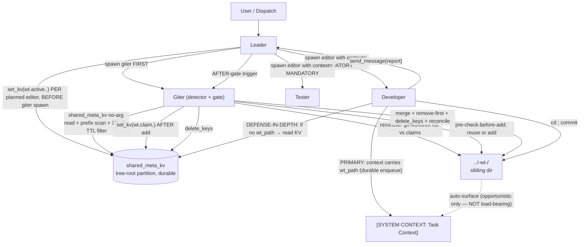

# Technical Analysis: Worktree-Aware Agent Coordination

Date: 2026-09-06
Author: planner[v2] via technical-analysis worker
Analysis depth: survey (with deep-dive on D2/D3 — KV protocol + awareness substrate)
Status: **RATIFIED / FINAL** — revised 2026-09-06 per architect's `architecture-recommendation.md` (D3 substrate REFUTED + 5 protocol corrections + corrected `.env` trap + obsolete KV tool schema replaced). Implementation-ready.

## Question

When multiple edit-capable agents (developer, giter, leader-as-orchestrator) operate on the same repository concurrently, how do they coordinate via **separate git worktrees** instead of stepping on a shared checkout, **using prompt-level updates only** (daemon code changes only if strictly necessary), and staying **concise** (~1650B total per U1)?

Sub-questions (D1–D5):
- **D1 — Detection:** How does giter detect "worktree needed"?
- **D2 — KV protocol:** What key schema, writers, lifecycle, staleness rules?
- **D3 — Awareness channel:** How do consumers learn about the worktree? *(auto-surface REFUTED — see §D3 below)*
- **D4 — Worktree conventions:** Location, naming, cleanup, traps (with the corrected `.env` trap per architect §5).
- **D5 — Agent scope:** Which prompt files change, and how lean can it stay? (per-agent split absorbs U1's ~320B delta)

## Context Summary

The agents-ensemble daemon already ships durable coordination primitives we can build on without daemon changes:
- **`shared_meta_kv`** — DB-backed (table `shared_context_metadata`, `daemon/repositories/shared_meta_kv/models.py:33`), partitioned by `context_key = get_tree_root_id(caller)` walking the permanent `parent_id` chain (repository.py:431-449). Composite unique `(context_key, meta_key)`, atomic upsert (`ON CONFLICT DO UPDATE`), no TTL. Bounds: `meta_key` ≤ 128 chars, serialized value ≤ 4096 chars, batch ≤ 100 pairs (repository.py:178-243). **Real tool surface** (architect §1c): `set_kv` (dict), `delete_keys` (list), no-arg call = partition read, `clear_all` (`daemon/tools/shared_meta_kv_tools.py:71-75,109-150`). The obsolete `shared_meta_kv(action="set"/"delete", key=…, value=…)` form does not exist.
- **Auto-surface of KV writes** — `_fetch_kv_metadata` (`daemon/services/context_messages.py:964-997`) reads the KV partition on context rebuild and inlines the entries into `[SYSTEM CONTEXT]`. **REFUTED as the primary awareness substrate** per architect §1a (3 daemon defects — see D3 below). After refutation: **opportunistic only**; never load-bearing. Defense-in-depth: explicit tool reads at git decision gates (governor `council_manifest` restore pattern) are still reliable.
- **`send_message(context={...})` (non-empty)** — Renders as `[SYSTEM CONTEXT: Task Context]` HumanMessage (stable id `task-context-{message_id}`), 4000-char cap, header-injection escaped, ENQUEUE-ONLY path (instance.py:2733-2844). **Primary awareness channel after D3 refutation** — non-empty context forces durable enqueue routing (`daemon/tools/instance.py:2738-2759`) and persists as `MessageQueue` metadata atomically with the task (`instance_messaging.py:1753-1765`). Leader already documents this in `agents/leader/tools_note.md:20-41`.
- **All five relevant agents** (`giter`, `leader`, `developer`, `tester`, `tidier`) **already hold `shared_meta_kv`** (verified via `meta.json` inspection). Zero meta.json changes needed for the protocol's core channel.
- **Prior art: `council_manifest` protocol** (governor `workflow.md:59-62,107,141,385-390`; `tools_note.md:93-120`) — write-before-spawn as crash anchor, read-on-recovery, status updates, cleanup-part-of-delivery. Critically, the **governor's restore path performs an explicit tool read** (the pattern that still works under the 3 §D3 defects). Plus project-manager's `pm_leader_instances` write-ordering discipline (`workflow.md:82,91-92`): `spawn_instance → set_kv → send_message`, never `set_kv` first. *(Note: the leader's pre-spawn census write intentionally overrides this ordering for the worktree-aware case — see D2 lifecycle; the phantom cost is bounded by the 15-min census TTL.)*

**Giter is bash-only** (`meta.json:10`: `bash, proc, filesystem, time, self, help, image, knowledge, mcp, context, shared_meta_kv`). **No `instance` tools** — giter cannot enumerate running instances. Detection via instance census is unavailable to giter without tool changes.

**Existing worktree artifacts**: de-facto naming family `agents-ensemble-wt-<slug>` (e.g. `agents-ensemble-wt-revive-fix`, `agents-ensemble-wt-hide-logs`) and `/tmp/<gate>-base` scratch (tester playbook). **Five** (not four) pre-existing worktree registrations in `/private/tmp` (architect file §4 verified): `adj-head`, `hotfix-defer-gate-base`, `m1-gate-base`, `pcfg-base`, `ens-autopromote-micro` — all directories exist; all outside the `../<repo>-wt-*` family; `git worktree prune` is a **NO-OP** on them (prune only drops registrations whose directory is gone). They are addressed by **Phase 4 (NEW)** in `plan-overview.md` — a one-time giter sweep, sequenced after the feature merge commit. `.gitignore` has zero worktree entries. **No in-repo canonical worktree playbook exists** (verified: `docs/` and `agents/` have zero `worktree` references).

**Documented worktree traps** (from `.agents/tester/LESSONS/` and `RESULTS/`):
- Worktree has no `.env` — `dev.sh` sources **its own `$SCRIPT_DIR/.env`**, so launching from inside a worktree hits prod defaults. Correct rule per architect §5: never launch `dev.sh` from inside a worktree; if a worktree daemon is needed, `set -a; source <main-repo>/.env; set +a` and bind a non-8079 port. Canonical source: `LESSONS/2026-08-20-e2e-never-claimed-signature.md` — **NOT** `RESULTS/2026-08-20:59` as the prior plan cited.
- `daemon.__file__` isolation proof false-positives from main-repo cwd — must `cd` into worktree first (RESULTS/2026-09-06:61). **Addendum:** a fresh worktree has no `.venv` — code that must *run* there needs `uv sync` first (~30 s); git-only work needs none. (Venv-shadow false-positives: `LESSONS/2026-09-05-worktree-daemon-filecheck-cwd-trap.md`.)
- `git worktree add -b <branch>` refuses if the branch is already checked out anywhere. Rule: use `-b` only when the branch exists nowhere; otherwise `git worktree add <path> <branch>`.

**User constraints** (from dispatch message + U1–U4):
1. CONCISE — total cap **~1650B** across 5 agents (U1; ~320B delta from the prior ~1330B is fully traceable to architect's evidenced corrections).
2. Giter = detector.
3. Leader + developer = aware consumers (with MANDATORY `context=` hand-off per U2).
4. Coordination channel = `shared_meta_kv` (tree-root partitioned; real tool names; auto-surface is opportunistic only after architect refutation).
5. Awareness delivery uses `send_message(context=...)` (PRIMARY) + explicit KV reads at git gates (DEFENSE-IN-DEPTH).
6. **Prompt-level solution preferred — daemon code changes ONLY if strictly necessary, and must be called out explicitly if proposed.** *(Daemon-Change Verdict: NONE, retained with the §D3 caveat; 3 latent defects logged for a separate follow-up per U4.)*

**Defect note (per U4 — referenced here once only):** the 3 latent KV daemon defects (architect §1a — snapshot cadence, spawned-child mispartition, system-default suppression) silently degrade ambient KV-based awareness. They are **NOT in scope for this feature** (the explicit-channel design sidesteps them); the leader spawns a separate follow-up task after this feature ships.

## Architecture

### Current Patterns

- **Leader-orchestrator + serialized giter gate** — `leader/workflow.md:35-102` already declares "Git Setup is NOT Parallelizable": giter runs BEFORE fan-out and AFTER aggregation. Phase scheduling explicitly excludes giter (`workflow.md:554-560`). **The current architecture already serializes the mutating git-ops**; worktree-awareness extends the same gate with pre-check (KV census + `git worktree list` reconciliation) + post-check (KV cleanup).
- **Pause-First Then Quiesce** — `daemon/services/instance_lifecycle.py` — config flips, activation toggles, migrations follow `pause_instance_cascade → bounded quiescence → state mutation → resume`. Worktree-aware spawning can borrow this discipline for KV cleanup, but the existing AFTER-gate (leader waits for giter completion report) is sufficient — no daemon change needed.
- **KV-as-liveness-anchor** (governor precedent, ADAPTED — O5 correction of the prior "write before the irreversible op" leftover): the worktree on disk is the durable anchor; the claim is written **AFTER** `git worktree add` succeeds (O-D2.2, with pre-check-before-add + reconciliation as the two mandatory companions), read on recovery, refreshed as work progresses, cleared on delivery. The governor's deadline pattern transfers in spirit only; the actual numbers differ (per-task census keys, 10-min claim heartbeat / 15-min census TTL).
- **Last-writer-wins with benign-conflict design** — KV upsert is atomic, no compare-and-swap. The protocol is designed so two writers cannot produce a corrupt state (e.g. two giters racing on `git worktree add` for the same branch are caught by the **pre-check-before-add** rule — `_set_many_lock` is process-local, `repository.py:78`; the prompt rule is the only guard).
- **Send-before-write discipline** (project-manager precedent) — `spawn_instance → instance_id returned → shared_meta_kv(set_kv) → send_message → END TURN`. Set-kv FIRST yields a phantom entry on early death.

### Module Boundaries

```
[user / dispatch]
       │
       ▼
[leader] ─── spawn_instance ──▶ [giter (detector)]
   │                                  │
   │ set_kv({wt.active.<branch>       │ read kv census (prefix wt.active.<branch>.)
   │   .<task-id>: <census>})         │ apply 15-min read-side TTL filter
   │ (per planned editor,             │ git worktree list --porcelain
   │  BEFORE spawning giter)          │ reconcile orphans vs phantom claims
   │                                  │ if path exists → reuse + refresh heartbeat
   │                                  │ else git worktree add ../<repo>-wt-<slug>
   │                                  │ set_kv({wt.claim.<slug>: <claim>})
   │                                  │
   │                                  ▼
   ├──── spawn_instance ─────────────▶ [developer]
   │   send_message(                            │ PRIMARY: context carries wt_path
   │     context={wt_path: <path>,              │  (mandatory, non-empty;
   │              wt_slug: <slug>,              │   durable enqueue routing)
   │              wt_branch: <branch>})         │ DEFENSE-IN-DEPTH: if no wt_path
   │                                  │  in context → read KV for wt.claim.*
   │                                  │ cd <wt_path> ; commit
   │                                  │
   ▼                                  ▼
[report]                       [giter AFTER-gate]
                                 merge → git worktree remove → delete_keys
                                 → reconcile (every gate entry; <repo>-wt-* family only)
```

### Mechanism Walkthrough (detection → claim → awareness → work → release/cleanup, revised per architect §2 / §4 / §5)

1. **Pre-dispatch (leader):** leader assembles the task. Before spawning parallel editors, leader calls `set_kv({f"wt.active.<branch>.<task-id>": {"branch": <branch>, "task": <task>, "spawned_at": <ts>, "spawner": "leader"}})` for **each** editor it intends to spawn, **BEFORE spawning giter** (the order is intentional — detection requires the row to exist before giter reads; the phantom cost is bounded by the 15-min read-side TTL). This intentionally overrides project-manager's `spawn → set_kv → send_message` ordering; the override is stated explicitly in `decisions.md` D2 lifecycle. Slug = per O-D2.3: sanitized branch + fallback + collision suffix.
2. **Detection (giter, on gate entry):** giter reads the shared KV (real tool call, not auto-surface) and does a prefix scan for `wt.active.<branch>.` rows, applying the 15-min read-side TTL filter. **Reconciliation first** (architect §4): enumerate `git worktree list --porcelain` for `../<repo>-wt-*` family; registered worktree with no fresh claim → staleness-check the branch's last activity, then adopt or remove; fresh claim whose path is not registered → delete the row. Only the `<repo>-wt-*` family is in scope. Then: if `>= 2` TTL-fresh `wt.active.*` rows for this branch (per O-D1.1, precise threshold — the "giter is one actor" ambiguity is deleted from prompt encoding), giter resolves: **create a dedicated worktree at `../<repo>-wt-<slug>`**.
3. **Pre-check-before-add (mandatory, O-D2.2 companion):** giter runs `git worktree list` BEFORE `git worktree add`. If a worktree for `<slug>` already exists (from a crashed earlier session), REUSE + refresh heartbeat instead of erroring. Use `git worktree add -b <branch> <path> <base>` only when the branch exists nowhere; otherwise `git worktree add <path> <branch>` (the `-b` form refuses if the branch is already checked out anywhere).
4. **Claim (giter, AFTER add succeeds):** giter writes `wt.claim.<slug>` = `{"path": "<absolute>", "branch": <branch>, "owner": "giter", "ts": <now>, "heartbeat_ts": <now>, "purpose": <short>}` via `set_kv({"wt.claim.<slug>": <claim>})`. **Heartbeat is updated on each subsequent giter action** (commit-merge, prune). Other participants observe liveness via `heartbeat_ts` age; > 10 min = stale (O-D2.1).
5. **Awareness (consumers — two channels, REFUTED auto-surface replaced):**
   - **PRIMARY (mandatory):** leader reports the worktree path back from giter, then spawns each editor with `send_message(message=..., context={"wt_path": <path>, "wt_slug": <slug>, "wt_branch": <branch>})` — non-empty dict forces durable enqueue routing (`daemon/tools/instance.py:2738-2759`) and persists as `MessageQueue` metadata atomically with the task (`instance_messaging.py:1753-1765`). This is **immune to all 3 auto-surface defects** (architect §1a).
   - **DEFENSE-IN-DEPTH:** if a developer's dispatch context has no `wt_path` AND ≥1 fresh `wt.claim.*` row exists for this branch, developer calls `shared_meta_kv` with no args (partition read) and prefix-scans `wt.claim.*` rows for this branch before any git operation. This is the governor `council_manifest` restore pattern and is the second line if the leader ever drops the hand-off.
   - Auto-surface (`_fetch_kv_metadata` rebuild into `[SYSTEM CONTEXT]`) is **opportunistic only** — it may appear (tree-root owner, fresh builds, non-default projects); it is **never load-bearing**; prompts must not describe the mechanism at all (writing-guide §1).
6. **Work (developer):** developer reads `wt_path` from the dispatch context (primary path) → `cd` into the worktree → commits → reports back. **Developer MUST NOT** checkout/switch branches inside the main repo. The giter instance serializes merges (existing rule: "Git Setup is NOT Parallelizable" extends to "Merge to latest is NOT Parallelizable either").
7. **Release (giter, AFTER-gate, remove-first per architect §4):** when leader reports "feature complete", giter:
   - Merges worktree branch into `latest` from the **main checkout** (NOT from the worktree).
   - Calls `git worktree remove <path>` (graceful). `git worktree prune` is documented as a NO-OP on the in-scope `<repo>-wt-*` entries (their directories exist) and as a fallback only when `remove` fails on foreign registrations.
   - Calls `delete_keys(["wt.claim.<slug>", "wt.active.<branch>.<task-id>"])`.
8. **Crash recovery (any agent on revival):** on instance revival, the explicit tool reads at git decision gates (`shared_meta_kv` no-arg read, prefix-scanning `wt.claim.*`) surface existing claims. **The reconciliation rule (every giter entry) is the safety net** for the missed-AFTER-gate failure mode and for the crash-between-remove-and-delete window (architect §4). The "Worktree-Based Regression Proof" tester convention is **out of scope** for this feature; we only encode the awareness + coordination surface here.

### Architecture Diagram (revised — auto-surface moved to "opportunistic only")



## Integration Points

| # | Integration | Type | Contract | Auth | Failure Mode | File:Line |
|---|-------------|------|----------|------|--------------|-----------|
| 1 | `shared_meta_kv` (read/write) — real tool surface: `set_kv` (dict), `delete_keys` (list), no-arg call = partition read (`get_all_as_dict` is the repository read path, not a tool name), `clear_all` | sync (in-process tool call) | `(meta_key≤128, meta_value≤4096)` JSON; `context_key` auto = `get_tree_root_id` | per-agent `tools.allow` (giter, leader, developer, tester, tidier ALL hold it) | bounds-violation `ValueError`; engine down → exception in tool | `daemon/repositories/shared_meta_kv/repository.py:178-243`; real tool surface at `daemon/tools/shared_meta_kv_tools.py:71-75,109-150` |
| 2 | `send_message(context={...})` (non-empty) — PRIMARY awareness channel | async (enqueue) | non-empty dict with `wt_path` (required), `wt_slug`, `wt_branch` keys; 4000-char header cap; non-empty forces durable enqueue routing | team-membership gate | ENQUEUE-only path; injection-branch drops metadata → caller-side guard; empty `{}`/`None` does NOT force enqueue — always include at least `wt_path` | `daemon/tools/instance.py:2738-2759`; `instance_messaging.py:1753-1765` |
| 3 | KV → `[SYSTEM CONTEXT]` auto-surface — **opportunistic only** (REFUTED as primary substrate per architect §1a; 3 daemon defects logged) | daemon-internal | error-swallowing, escaped | n/a (daemon-internal) | empty dict or `None` on error → no context block; 3 known defects silently degrade ambient awareness (snapshot cadence, spawned-child mispartition, system-default suppression) | `daemon/services/context_messages.py:964-997`; defect evidence at `:1201-1213, 1270-1314, 1319-1360`, `instance_messaging.py:3609-3629`, `:1342-1345` |
| 4 | `git worktree list --porcelain` (reconciliation + pre-check) | bash | filesystem-level | giter only | pre-existing `/private/tmp` entries are outside the `<repo>-wt-*` family scope and are addressed by **Phase 4 (NEW)**, not by reconciliation | n/a (git) |
| 5 | `git worktree add [−b <branch>]` / `git worktree add <path> <branch>` (conditional `-b`) | bash | filesystem-level | giter only | `-b` refuses if branch checked out elsewhere → use the non-`-b` form on reuse; pre-check-before-add makes the second-add a reuse, not a failure | n/a (git) |
| 6 | `git worktree remove <path>` (graceful) | bash | filesystem-level | giter only | orphaned metadata → `git worktree prune` as fallback (NO-OP when dir exists for in-scope entries) | n/a (git) |
| 7 | Main checkout (`./`) | bash + git state | shared with user | n/a | concurrent actors → provenance drift (LESSONS 2026-08-21) | n/a (filesystem) |

### Integration Details

**Integration 1: `shared_meta_kv` (real tool surface)**
- **Protocol:** atomic upsert, last-writer-wins, no CAS. Partition = `get_tree_root_id(caller)` walks `parent_id` chain permanently; revived siblings share the partition.
- **Real tool surface** (`daemon/tools/shared_meta_kv_tools.py:71-75,109-150`): `set_kv` (dict), `delete_keys` (list), no-arg call = partition read (`get_all_as_dict` is the repository read path, not a tool name), `clear_all`. The obsolete `action="set"/"delete", key=…, value=…` form does not exist; plan snippets use the real names.
- **Failure mode:** on engine down, the tool raises an exception the agent must surface. The protocol must NEVER produce a corrupt state from concurrent writers — design keys such that last-write is benign (e.g. heartbeat-ts overwrite is idempotent).
- **Observability:** rows carry `created_at` / `updated_at` ISO timestamps; agents read back via a no-arg `shared_meta_kv` call (partition read) for census.
- **Tool calls (not auto-surface) resolve the partition correctly** for the parent chain (`shared_meta_kv_tools.py:109-122`); this is the defense-in-depth read that survives all 3 auto-surface defects.

**Integration 2: `send_message(context={...})` (non-empty) — PRIMARY awareness channel**
- **Protocol:** `send_message(message=..., context={"wt_path": <path>, "wt_slug": <slug>, "wt_branch": <branch>})` — non-empty dict forces durable enqueue routing (`daemon/tools/instance.py:2738-2759`) and persists as `MessageQueue` metadata atomically with the task (`instance_messaging.py:1753-1765`). **Always include at least `wt_path`** (empty `{}`/`None` does not force enqueue; would silently degrade to injection-branch where context is dropped).
- **Failure mode:** injection-branch drops metadata → caller-side guard is the non-empty dict requirement.

**Integration 4: `git worktree add` (with conditional `-b`)**
- **Pre-check (mandatory, O-D2.2 companion):** giter MUST `git worktree list --porcelain` first — if a worktree for `<slug>` already exists (from a crashed earlier session), REUSE + refresh heartbeat instead of erroring.
- **Naming:** `../<repo>-wt-<slug>/` (sibling dir convention matches existing `agents-ensemble-wt-*` family). Slug = per O-D2.3: sanitized branch + fallback + collision suffix.
- **Branch handling (conditional `-b`):** `git worktree add -b <branch> ../<repo>-wt-<slug> <base>` **only when the branch exists nowhere**; otherwise `git worktree add ../<repo>-wt-<slug> <branch>` (the `-b` form refuses if the branch is already checked out anywhere).

**Integration 5: `git worktree remove` (cleanup, remove-first)**
- **Primary verb:** `git worktree remove <path>` (graceful). **NOT `prune`** for the in-scope `<repo>-wt-*` entries — their directories exist, so `prune` is a NO-OP. `prune` is the fallback only when `remove` fails on foreign registrations.
- **Per-entry verification before remove** (Phase 4): registered + dir exists + not the main checkout + no uncommitted work worth saving (check `git status`; if dirty, STOP and report rather than remove).

**Integration 6: `.env` source trap (CORRECTED per architect §5)**
- `dev.sh` cd's to its own `$SCRIPT_DIR` and sources `./.env` **there** (`dev.sh:13-16,58-64,88`). A `dev.sh` run inside a worktree sources a **nonexistent** `.env` → empty env → defaults (`ensemble_prod`). **Correct rule:** never launch `dev.sh` from inside a worktree; if a worktree daemon is needed, `set -a; source <main-repo>/.env; set +a` and bind a non-8079 port. Canonical source: `LESSONS/2026-08-20-e2e-never-claimed-signature.md` — **NOT** `RESULTS/2026-08-20:59` as the prior plan cited.

**Integration 7: reconciliation (every giter entry)**
- Enumerate `git worktree list --porcelain` for `../<repo>-wt-*` family paths; a registered worktree with no matching fresh claim → staleness-check the branch's last activity, then adopt or remove; a fresh claim whose path is not registered → delete the row. **Scope: only the `<repo>-wt-*` family** — never touch foreign registrations (Phase 4 handles the 5 pre-existing `/private/tmp` entries).

## Trade-offs

### D1 — Detection (revised per O-D1.1 / O-D1.2)

| Candidate | Mechanism | Strength | Weakness |
|-----------|-----------|----------|----------|
| **A. KV census by giter** | Leader writes `wt.active.<branch>.<task-id>` per planned editor; giter reads on gate entry (prefix scan + 15-min TTL filter) | Cleanest: uses existing primitives, no new tool; matches governor precedent; per-task keys give surgical cleanup; TTL bounds sticky phantoms | Requires leader discipline to write before spawn |
| **B. Concurrent-branch + dirty-tree heuristic** | giter runs `git status` + `git worktree list` and infers | Zero coordination overhead; survives mis-coordinated leaders | False positives (worktree-less actors don't need a worktree); no awareness signal; easily gamed |
| **C. Running-instance census** | giter enumerates sibling instances via `list_instances` | Most accurate | **Unavailable to giter** — no instance tools in `meta.json:10`. Would require meta.json change + new tool surface |
| **D. Leader declaration only** | Leader tells giter explicitly in dispatch message | Simple | No general trigger; giter can't infer; brittle |

**Pick A (KV census, per-task keys) with B as fallback guideline.** Leader writes `wt.active.<branch>.<task-id>` BEFORE spawning giter (one entry per planned editor, per-task key for surgical cleanup). Giter checks `wt.active.<branch>.<task-id>` count (TTL-filtered) AND `wt.claim.<slug>` existing → if `≥ 2` TTL-fresh `wt.active.*` rows for this branch, the worktree is needed. **Reasoning:** A is the only candidate that simultaneously provides detection, awareness, and crash-recovery without daemon changes. B's heuristic is too coarse; C requires tool changes; D is brittle. A also enables graceful degradation — if leader forgets the pre-write, the dirty-tree heuristic still catches most cases via "any sibling editor + dirty main = needs worktree" (a guideline, not a hard rule, per O-D1.2).

**Threshold (per O-D1.1 — precise, no ambiguity):** trigger = "**≥ 2 TTL-fresh `wt.active.*` rows for this branch**". The "giter is one actor" parenthetical is **deleted from prompt encoding** (it was the ambiguity source). Stale-row inflation that `≥ 2` was partly guarding against is now handled by the census TTL, not by counting.

### D2 — KV Protocol (revised per O-D2.1 / O-D2.2 / O-D2.3)

| Aspect | Choice | Reason |
|--------|--------|--------|
| Key schema (claim) | `wt.claim.<slug>` | ≤ 128 chars (`wt.claim.`=10 + 118-char slug). Slug = per O-D2.3: sanitized branch (lowercase, hyphens, drop leading `feature/`/`fix/`/`hotfix/`, map `[a-z0-9_-]` only) + fallback for `latest`/`main` + `-<4hex>` collision suffix. |
| Key schema (census) | `wt.active.<branch>.<task-id>` (per-task key) | ≤ 128 chars (`wt.active.`=11 + 117 chars for branch + task). **Per-task keys** give surgical cleanup: giter's AFTER-gate deletes only its own task's rows, two features sharing branch `latest` cannot delete each other's census, and a crashed leader's phantom row is TTL-bounded. Giter's read becomes a prefix scan on `wt.active.<branch>.`. |
| Value schema (claim) | `{"path": str, "branch": str, "owner": str, "purpose": str, "ts": ISO, "heartbeat_ts": ISO}` | Fits 4096-char cap with room to spare. `heartbeat_ts` = freshness signal (10-min ceiling per O-D2.1). |
| Value schema (census) | `{"branch": str, "task": str, "spawned_at": ISO, "spawner": "leader"}` | Trivially small. **No heartbeat** — 15-min read-side TTL filter (O-D2.1) handles freshness; census is a snapshot of leader's intent. |
| Lifecycle (write order) | giter writes `wt.claim.<slug>` AFTER `git worktree add` succeeds (not before, unlike governor's write-before-spawn for crash anchor — here the worktree IS the anchor; if it fails, no claim to clean up). | The worktree on disk is the durable anchor; KV is just the awareness signal. **Reverses governor pattern intentionally** because `git worktree add` is reversible (just `git worktree remove`); a half-written claim is harder to clean than an absent claim. **Two mandatory companions (O-D2.2):** pre-check-before-add (`git worktree list --porcelain` before every `add`; reuse + refresh heartbeat if path exists), reconciliation rule at every giter entry (claim whose worktree is gone → delete row). |
| Staleness — claim heartbeat | `heartbeat_ts` older than **10 min** = stale (O-D2.1) | Giter's heartbeat advances per action; >10 min between beats is already anomalous; 30 min only fires on dead-giter where no consumer acts. |
| Staleness — census TTL | `spawned_at` older than **15 min** = treat as absent when counting (O-D2.1, prompt-level read filter) | Census rows previously had no freshness signal; leader crash left sticky phantom rows; the read-side TTL bounds them. Stale handling is always verify-at-next-giter-entry, never mid-flight removal. |
| Conflict semantics | LWW on heartbeat (always benign); per-task census keys (idempotent under same task); pre-check-before-add makes second-add a reuse not a failure (`_set_many_lock` is process-local — `repository.py:78`; the prompt rule is the only guard); slug collisions resolved by `-<4hex>` suffix | LWW is safe by design. |
| Cleanup | giter AFTER-gate: `merge → git worktree remove <path> (graceful) → delete_keys(["wt.claim.<slug>", "wt.active.<branch>.<task-id>"])`. **Remove-first** then delete (architect §4 — phantom claim reconciles trivially; reverse order strands disk). Stale claims survive daemon restart — harmless on next giter entry because giter's pre-check (`git worktree list --porcelain`) detects the orphaned worktree and either reuses or removes it. | Borrow governor's cleanup-part-of-delivery. |

**Reversibility:** schema is trivial to change (one prompt edit). Bounds check (128/4096) is a daemon invariant.

### D3 — Awareness Channel (REFUTED + re-ratified onto Option B per architect §1a / §2)

**Refutation (architect §1a):** the previously-assumed primary substrate — "KV writes auto-surface in every same-tree sibling's `[SYSTEM CONTEXT]` via `_fetch_kv_metadata`" — is REFUTED by code evidence. The live DB read exists at `daemon/services/context_messages.py:964-997`, but three independent defects break the "every sibling, automatically" guarantee:

| # | Defect | Evidence | Consequence |
|---|--------|----------|-------------|
| 1 | **Snapshot cadence** — the runtime `[SYSTEM CONTEXT]` KV block is checkpoint-cached and rebuilt ~once per instance (first non-report turn); injected messages, report delivery, job events, retries, and revives do NOT refresh it | `context_messages.py:1201-1213, 1270-1314, 1319-1360`; runtime build `instance_messaging.py:3534-3657`; live-but-synthetic API read `persistence.py:907-947` | Mid-task claim/heartbeat/cleanup changes never surface to an already-running consumer |
| 2 | **Spawned-child mispartition** — a child's first runtime context assembly hardcodes `_persistent_parent_id=None`, so it can read its **own** partition instead of the tree-root partition where giter writes; the correctly-configured graph repair is discarded | `instance_messaging.py:3609-3629`; discarded repair `graph.py:3870-3879` | The primary consumer (a developer spawned by the leader) may see an **empty** KV block even on its first turn |
| 3 | **System-default project suppression** — KV fetch is skipped entirely for system-default projects on the first turn | `context_messages.py:1342-1345` | Claim never auto-surfaces at all in the default-project case |

Therefore the auto-surface substrate is not viable. The ratified awareness design is **Option B — mandatory explicit hand-off + explicit KV reads (two-channel)**:

| Channel | Mechanism | Strength | Weakness | When |
|---------|-----------|----------|----------|------|
| **PRIMARY (mandatory, O-D3.1/U2)** | Leader's `send_message(context={"wt_path": …, "wt_slug": …, "wt_branch": …})` — non-empty dict forces durable enqueue routing (`daemon/tools/instance.py:2738-2759`); persists as `MessageQueue` metadata atomically with the task (`instance_messaging.py:1753-1765`) | Immune to all 3 auto-surface defects; visible in dispatch prose; greppable | One-shot at dispatch; requires leader discipline; empty `{}`/`None` does NOT force enqueue | Every concurrent-editor spawn |
| **DEFENSE-IN-DEPTH** | Explicit `shared_meta_kv` no-arg read (partition read), prefix-scanning `wt.claim.*` rows at git decision gates (governor `council_manifest` restore pattern; tool calls resolve the tree-root partition correctly via the parent chain `shared_meta_kv_tools.py:109-122`) | Survives leader-forgets-context; same precedent the governor uses | One extra read per gate; the trigger is concrete (C6): no `wt_path` in context AND ≥1 fresh `wt.claim.*` row for this branch | Developer's Auto-Commit gate, when context lacks `wt_path` and a fresh claim exists for the branch |
| **Opportunistic only (auto-surface)** | `_fetch_kv_metadata` rebuild on context fetch | May appear (tree-root owner, fresh builds, non-default projects); zero new code | Silently absent in 3 verified cases (above) | Never load-bearing; prompts must not describe the mechanism at all |

**Why not C (daemon-side dedicated `[SYSTEM CONTEXT: Worktree]` header):** the user constraint explicitly prefers prompt-only. Revisit only if the explicit-channel design proves insufficient.

**Daemon-Change Verdict (updated):** NONE — retained, with the §1 caveat from D3. The explicit-channel design sidesteps the 3 latent daemon defects; those defects are logged for a separate follow-up task (U4 — leader spawns AFTER this feature ships) and are NOT in this plan's scope.

### D4 — Worktree Conventions (revised: 4 traps, corrected `.env`, 5 pre-existing entries → Phase 4)

| Aspect | Choice | Reason |
|--------|--------|--------|
| Location | `../<repo>-wt-<slug>/` (sibling dir) | Matches existing family `agents-ensemble-wt-*`; outside the main repo so `.gitignore` pollution is moot; easy to enumerate via `git worktree list` |
| Naming | `<repo>-wt-<slug>` where slug = per O-D2.3 (sanitized branch + fallback + collision suffix) | `agents-ensemble-wt-worktree-aware-prompts` example; readable; discoverable via `ls ../` |
| Cleanup (in-flow) | giter AFTER-gate: `merge → git worktree remove <path> (graceful) → delete_keys([…])`. `git worktree prune` is documented as a NO-OP when the directory exists (architect §4); remove is the primary verb. | Reverses the prior "prune fallback" framing. |
| Cleanup (out-of-flow, pre-existing) | **Phase 4 (NEW)** — one-time giter sweep of **5** registered `/private/tmp` worktrees (`adj-head`, `hotfix-defer-gate-base`, `m1-gate-base`, `pcfg-base`, `ens-autopromote-micro`), sequenced AFTER the feature merge commit. Each is `git worktree remove`'d individually after per-entry verification. `git worktree prune` is a NO-OP here (dirs exist). | Per architect file §4 — the plan's prior claim that the AFTER-gate flow "addresses" the 4-then-5 stale entries is incorrect; giter's reconciliation deliberately ignores foreign paths (scope: only `<repo>-wt-*` family). Per U3, in-scope. |
| Tester scratch worktrees (`/tmp/<gate>-base`) | KEEP SEPARATE — they are throwaway per-test sandboxes, not persistent coordination | Tester's purpose differs (single-test isolation, not concurrent-editor coordination); no merge needed |
| `.gitignore` entries | **NONE** — sibling dirs are outside the repo, no pollution | Avoids `.gitignore` bloat; sibling convention is the discipline |
| **`.env` divergence trap (CORRECTED per architect §5 — prior encoding was REVERSED)** | `dev.sh` cd's to its own `$SCRIPT_DIR` and sources `./.env` **there** (`dev.sh:13-16,58-64,88`). A `dev.sh` run inside a worktree sources a **nonexistent** `.env` → empty env → defaults (`ensemble_prod`). **Correct rule:** never launch `dev.sh` from inside a worktree; if a worktree daemon is needed, `set -a; source <main-repo>/.env; set +a` (portable; `/proc/environ` does not exist on macOS) and bind a non-8079 port. Canonical source: `LESSONS/2026-08-20-e2e-never-claimed-signature.md` — NOT `RESULTS/2026-08-20:59` as the prior plan cited. | The prior encoding was dangerous if followed; encode the corrected rule as a giter prompt rule. |
| `cwd` isolation trap | Giter MUST `cd <worktree-path>` before `git status` / `git log` for provenance. **Addendum:** a fresh worktree has **no `.venv`** — code that must *run* there needs `uv sync` first (~30 s); git-only work needs none. (Venv-shadow false-positives: `LESSONS/2026-09-05-worktree-daemon-filecheck-cwd-trap.md`.) | Documented failure (RESULTS/2026-09-06:61); encode as giter prompt rule |
| Port 8079 collision | `dev.sh` hardcodes 8079 → worktree live-smoke (tester only) launches uvicorn on alt port directly. Generalized: any worktree daemon needs a non-8079 port. | Documented (RESULTS/2026-09-04:26); out of scope for giter/developer — only tester cares |
| **`add -b` refusal trap (NEW per architect §5)** | `git worktree add -b <branch>` refuses if the branch is already checked out anywhere. Rule: use `-b` only when the branch exists nowhere; otherwise `git worktree add <path> <branch>`. | Conditional `-b` keeps the prompt encoding precise |
| **`index.lock` contention (minor, optional)** | Transient lock failures during concurrent git ops → retry once after a short sleep. | Optional; encode only if byte budget permits |
| Reconciliation (every giter entry) | Enumerate `git worktree list --porcelain` for `../<repo>-wt-*` family; registered worktree with no fresh claim → adopt or remove; fresh claim whose path is not registered → delete the row. **Scope: only the `<repo>-wt-*` family** — never touch foreign registrations. | Safety net for the missed-AFTER-gate failure mode and the crash-between-remove-and-delete window (architect §4) |

**Reversibility:** location/naming are convention-only — no daemon binding. Migration to a different convention (e.g. `.worktrees/` inside repo) is a single prompt edit per affected agent.

### D5 — Agent Scope (prompt surface)

The agent-prompt-writing-guide (`docs/agent-prompt-writing-guide.md`) binds the design:
- **One canonical home per cross-agent contract** (`:66-78`) — pick the agent that owns the write side. For worktree awareness, **giter owns the canonical contract** (it writes the claim; others read).
- **≤ 7 Cardinal rules per `rule.md`** (`:84-87`) — the current giter rule.md has ~7 cardinals already (counted: status-first, destructive-confirmation, force-push-warning, dry-run, preserve-work, conventional-commits, branch-from-latest). Adding "Worktree Cardinal #1: serialize worktrees" is borderline — recommend encoding as a **guideline** with a workflow.md pointer, NOT a new cardinal.
- **No system internals in prompts** (`:13-49`) — say "shared KV store", never `shared_context_metadata`. Say "the parent instance's worktree partition", never `get_tree_root_id`.
- **Soul.md ~2k char cap** (implicit in current giter soul.md = 49 lines / ~2k chars) — keep soul.md untouched.

**Per-agent scope:**

| Agent | Cardinal additions | Workflow/process edits | One-line pointer | Estimated added bytes |
|-------|--------------------|------------------------|-------------------|----------------------|
| **giter** | 0 (use existing cardinals) | `workflow.md`: insert "Worktree Mode" subsection near Standard Git Operations (after line 56, before "Conflict Resolution Flow"); extend `rule.md` Branch Management with a "Concurrent editor detection" guideline | n/a (canonical) | ~700 |
| **leader** | 0 | `workflow.md` Git Flow section (~line 50): add a 2-sentence note "if multiple editors expected, request worktree from giter"; `tools_note.md`: extend `send_message` `context=` documentation with `wt_path`/`wt_slug` keys | "When fan-out will edit: spawn giter FIRST with worktree-create, then spawn editors in worktree" (one sentence) | ~250 |
| **developer** | 0 | `rule.md` Must-Not: add "Commit on the main checkout when a worktree was assigned" prohibition; `workflow.md` Auto-Commit section: 2-line prefix "If you received a worktree path in context, cd into it before any git operation" | n/a | ~200 |
| **tester** | 0 | n/a | Add one sentence to `workflow.md` dispatch section (~line 70-81) pointing to giter's Worktree Mode for worktree regression-proof convention; one-line `.env` non-collision reminder for tester live-smoke on alt port | ~130 |
| **tidier** | 0 | n/a | Add one sentence to `workflow.md` Investigate (~line 29-38): "If a worktree was used, review inside it, not the main checkout"; one-line `.env` caution for tidier verification runs that might spawn a daemon | ~130 |

**Total:** **~1650 bytes** of new prose across 5 agents (U1; was ~1330; the ~320B delta traces line-for-line to the architect's evidenced corrections). Giter is the canonical home; the other four are pointers + situational awareness rules + the developer's defense-in-depth backstop.

**Why no daemon code:** all required mechanisms are present:
- `shared_meta_kv` write/read/list/delete (real tool surface: `set_kv` / `delete_keys` / `clear_all` + no-arg read; `get_all_as_dict` = repository read path, not a tool (repository.py)).
- `send_message(context={...})` (non-empty forces durable enqueue routing; instance.py:2738-2759, instance_messaging.py:1753-1765) — PRIMARY awareness channel.
- Explicit KV tool reads at git decision gates — DEFENSE-IN-DEPTH awareness.
- `git worktree` CLI (external — giter invokes via bash; conditional `-b`; pre-check-before-add).
- `git worktree remove` (graceful) — primary cleanup verb (remove-first, not prune).

If a future need arose (e.g. dedicated `[SYSTEM CONTEXT: Worktree]` header), that would be the point to propose a daemon change. **Expected: NONE for this feature.**

### Daemon-Change Verdict

**NONE** — retained, with the §D3 caveat (auto-surface defects logged but not blocking; explicit-channel design sidesteps them). All five design questions are resolvable with prompt updates + existing daemon primitives. The verification list:
- [x] D1 detection — uses per-task KV keys (`wt.active.<branch>.<task-id>`); prefix scan + 15-min read-side TTL filter; O-D1.1 precise `≥ 2` threshold.
- [x] D2 protocol — uses per-task KV schema; O-D2.1 two staleness clocks (10-min claim heartbeat / 15-min census TTL); O-D2.2 write order AFTER `add` succeeds with pre-check-before-add + reconciliation rule; O-D2.3 slug with sanitization + fallback + collision suffix; bounds-respecting (128/4096 fits comfortably).
- [x] D3 awareness — uses `send_message(context={...})` (non-empty) for the PRIMARY channel; explicit KV tool reads for DEFENSE-IN-DEPTH; auto-surface is opportunistic only (REFUTED as substrate per architect §1a).
- [x] D4 worktree conventions — pure bash + filesystem; conditional `-b`; pre-check-before-add; reconciliation rule; corrected `.env` trap per architect §5; 4 traps as giter guidelines; 5 pre-existing `/private/tmp` entries addressed by Phase 4 (NEW).
- [x] D5 agent scope — prompt-only; ~1650B total per U1; per-agent split absorbs the ~320B delta; no soul.md or Cardinal additions.

## Failure Modes (revised per architect §6)

| # | Failure | Impact | Mitigation |
|---|---------|--------|------------|
| 1 | **Crash mid-`git worktree add`** — claim not yet written | No stale KV row; worktree may or may not exist on disk | Giter's next entry does `git worktree list --porcelain` and either reuses (path exists) or re-creates; pre-check-before-add makes this idempotent |
| 2 | **Crash mid-claim-write** — worktree exists, KV row missing | Other agents don't see the worktree; may operate on main | Reconciliation at next gate re-asserts the claim; the `git worktree list` check is authoritative; primary awareness via `context=` (immune) means the spawned editor still has `wt_path` if the leader got far enough to spawn |
| 3 | **Crash AFTER claim, BEFORE work** — `wt.claim.<slug>` survives daemon restart | Next giter entry detects via `git worktree list`; either reuses (heartbeat refreshed) or `git worktree remove` + recreate | Heartbeat freshness threshold (10 min per O-D2.1) determines stale-vs-fresh |
| 4 | **Stale `wt.active.<branch>.<task-id>` rows** — leader crashed mid-fan-out | giter's 15-min read-side TTL filter excludes stale rows from the threshold count; if any sneak in, reconciliation handles them | 15-min TTL; reconciliation; leader's revival restarts the workflow |
| 5 | **Revived instance re-keys** — sibling revived after TERMINATED | `parent_id` is permanent; `get_tree_root_id` walks it; same partition; tool calls (auto-surface does NOT) resolve correctly | Tool-call reads (defense-in-depth) work correctly across revival; zero new risk |
| 6 | **Worktree left behind after feature** — giter's AFTER-gate never ran (leader crashed pre-merge) | Disks fill; `git worktree list` shows orphan | Reconciliation at every giter entry handles `<repo>-wt-*` family; the 5 pre-existing `/private/tmp` foreign entries are addressed by **Phase 4 (NEW)**, not by reconciliation |
| 7 | **Concurrent merge race** — two giter instances try to merge the same branch | "Git Setup is NOT Parallelizable" rule already canonical; leader serializes giter | No new risk |
| 8 | **Heartbeat stops updating** — giter hangs mid-merge | Other participants see stale heartbeat (≥ 10 min) → treat claim as stale | Stale-claim prompt rule: "if heartbeat older than 10 min, refuse to reuse; giter must verify the worktree is alive before reusing" (O-D2.1) |
| 9 | **Two giters race on the same `wt.claim.<slug>`** — KV LWW → second writer overwrites path | Pre-check-before-add makes this a reuse, not a failure (`_set_many_lock` is process-local; the prompt rule is the only guard) | Slug uniqueness by sanitized branch + `-<4hex>` collision suffix; leader's AFTER-gate serialization prevents true race |
| 10 | **Worktree daemon silently hits `ensemble_prod`** | Production data corruption | Encode the **corrected** .env-source discipline as a giter rule: "never launch `dev.sh` from inside a worktree; if a worktree daemon is needed, `set -a; source <main-repo>/.env; set +a` and bind a non-8079 port" (architect §5 — prior plan encoding was REVERSED) |
| 11 | **Auto-surface relied on for awareness** — prior assumption that KV writes auto-surface in every same-tree sibling's `[SYSTEM CONTEXT]` | Mid-task claim/heartbeat/cleanup changes never surface to an already-running consumer (architect §1a defect 1); child may see an empty KV block (defect 2); default-project first-turn suppresses (defect 3) | **Fixed architecturally by D3 redesign** — PRIMARY is mandatory `context=`; DEFENSE-IN-DEPTH is explicit tool reads. The latent daemon defects are logged for a separate follow-up (U4); they do not block this feature |
| 12 | **Branch-keyed census rows** — sticky phantoms (no TTL/sweeper) + cross-feature delete collisions on shared `latest` | Two features sharing `latest` could delete each other's census; crashed leader leaves sticky rows | **Fixed by per-task keys** (`wt.active.<branch>.<task-id>`) + read-side TTL (architect §6 R3 🔴) |
| 13 | **Missed AFTER gate** — leader crashes pre-merge, no recovery actor | Worktree + claim persist indefinitely | **Fixed by reconciliation at every giter entry** (architect §6 R5 🟡; replaces the O-D5.3 deferred-leader-Cardinal) |
| 14 | **Non-atomic `worktree remove` + `delete_keys`** — crash between | Phantom claim; stranded disk if reverse order | **Fixed by remove-first** (architect §6 R6 🟡) |
| 15 | **`git worktree add -b` refusal** — branch already checked out elsewhere | `add -b` errors mid-protocol | **Fixed by conditional `-b` rule** (architect §6 R7 🟡) |
| 16 | **Foreign worktree registrations confused with in-flow** — giter's reconciliation scope is `<repo>-wt-*` family; pre-existing `/private/tmp` entries (5) are outside that family | Cleanup gap; giter ignores them | **Fixed by Phase 4 (NEW)** — one-time giter sweep, sequenced after the feature merge commit |

## Coupling / Risk Map

| Coupled system | Coupling type | Risk | Decoupling strategy |
|----------------|---------------|------|---------------------|
| KV table (`shared_context_metadata`) | Read/write schema | Schema drift across agents | Canonical contract lives in giter's `workflow.md` Worktree Mode; other agents mirror with one-line pointers; per-task keys for surgical cleanup |
| Auto-surface into `[SYSTEM CONTEXT]` (`_fetch_kv_metadata`) | **Opportunistic only** (REFUTED as substrate per architect §1a) | 3 verified defects silently degrade ambient awareness; never load-bearing | Two-channel design (mandatory `context=` + explicit KV reads) sidesteps all 3 defects; latent daemon fixes are a SEPARATE follow-up (U4) |
| `send_message(context=...)` (non-empty) | ENQUEUE-only routing (PRIMARY awareness channel) | If routing flips to injection-branch, context is silently dropped; empty `{}`/`None` does NOT force enqueue | Caller-side guard: non-empty dict required (at least `wt_path`); `daemon/tools/instance.py:2738-2759`; `instance_messaging.py:1753-1765` |
| `git worktree` CLI | External | Git version divergence; daemon can't enforce; `add -b` refuses if branch checked out elsewhere | Document minimum git version (2.30+) in giter's Worktree Mode prompt; conditional `-b` rule; pre-check-before-add |
| Worktree `.env` source | Filesystem | Wrong .env → prod corruption (architect §5 — prior plan encoding was REVERSED) | Encode the **corrected** rule in giter prompt: "never launch `dev.sh` from inside a worktree; if a worktree daemon is needed, `set -a; source <main-repo>/.env; set +a` and bind a non-8079 port"; tidier + tester reminders |
| Leader's AFTER-gate serialization | Workflow discipline | If leader skips the giter trigger, worktree leaks | **Reconciliation rule at every giter entry** (architect §4, O-D5.3 verdict) — safety net for the missed-AFTER-gate failure mode; no leader Cardinal needed (cap ≈ saturated) |
| Tester scratch `/tmp/<gate>-base` | Separate concern | Confusion between two worktree uses | Explicit "different purpose" note in both prompts; `phase3-plan.md` pointer disambiguates |
| Pre-existing foreign worktrees (`/private/tmp`, 5 entries) | Outside the `<repo>-wt-*` family | Reconciliation deliberately ignores them; cleanup gap | **Phase 4 (NEW)** — one-time giter sweep, sequenced after the feature merge commit |

## Scalability

### Growth Assumptions

- **Concurrent editor population per task:** today ≤ 3 (developer + giter + 1 parallel phase worker). Per leader's max-3-concurrent-children rule (`leader/workflow.md` from research). Tomorrow: still bounded by leader's concurrency cap.
- **Worktrees per session:** typically 1 per feature branch. Theoretical upper: O(concurrent_features × 1) — but the AFTER-gate merge closes them within the same leader workflow.
- **KV rows per partition:** O(concurrent_features × 2-3 keys each). Well under batch-100 cap and total partition cardinality (no engine limit).

### Current Bottlenecks

| # | Bottleneck | Threshold | File:Line | Impact |
|---|------------|-----------|-----------|--------|
| 1 | KV value cap 4096 chars | Branch name + heartbeat + path ≈ 200 chars typical; far below cap | `repository.py:178-243` | None in practice |
| 2 | KV key cap 128 chars | `wt.claim.` + 118-char slug — fine for any sensible branch name; per-task census keys add `.<task-id>` suffix | `repository.py:178-243` | Edge case: very long branch names + task ids need slug sanitization + truncation (O-D2.3) |
| 3 | Leader max 3 concurrent children | Caps editor fan-out | `leader/workflow.md` from research | Already addressed by existing rule |
| 4 | `git worktree add` startup time (~1s on local FS) | One per feature; not a hot path | external | Negligible |

### Scaling Characteristics

- **Vertical vs horizontal:** horizontal — each agent owns its own worktree; no shared mutable state beyond KV.
- **Stateless vs stateful:** giter stateful (the worktree is its anchor); developer stateful within the worktree (the working tree); leader stateless (KV is the durable state).
- **Sync vs async:** KV writes sync, git ops sync (within giter's bash); awareness via the two-channel design (mandatory `context=` at dispatch + explicit KV reads at git gates) — neither relies on the ambient auto-surface rebuild cadence.
- **Scaling cliff:** if leader's concurrent-children cap grows beyond ~5, the worktree model breaks down (filesystem descriptor pressure). Today: no concern.

## Technical Debt

### Items Affecting This Analysis

| # | Debt Item | Impact on Recommendation | Severity | File:Line |
|---|-----------|--------------------------|----------|-----------|
| 1 | **No in-repo canonical worktree playbook** | All conventions live in tester RESULTS/LESSONS only; new agents (this feature) must rediscover | High — but bounded: feature's deliverable is the canonical home | n/a (DB-stored blueprints only) |
| 2 | **`_format_task_context` 4000-char cap** | Leader's mandatory `context=` hand-off can carry a worktree path comfortably | Low | `daemon/tools/instance.py:2738-2759` (cap is doc-only, enforced at format time) |
| 3 | **Worktree `.env` source trap (CORRECTED per architect §5)** | Production-data-corruption risk if violated; prior plan encoding was REVERSED | High — operator discipline only; corrected rule encoded in prompts | n/a (dev.sh:13-16,58-64,88) |
| 4 | **`.gitignore` missing worktree conventions** | Currently benign because sibling dir is outside repo; would matter if location changes to inside-repo | Low — gated by location choice | n/a (.gitignore) |
| 5 | **No automated prune tooling; 5 stale worktrees currently registered** | Manual cleanup today; the 5 pre-existing `/private/tmp` entries are addressed by **Phase 4 (NEW)** | Low — giter one-time sweep | n/a (.git/worktrees) |
| 6 | **3 latent KV daemon defects (architect §1a)** | Snapshot cadence; spawned-child mispartition; system-default suppression. Silently degrade ambient KV-based awareness, including governor `council_manifest` restore. **Not in scope for this feature** (explicit-channel design sidesteps them); separate follow-up task (U4) | High — but non-blocking; explicit-channel design is correct | `context_messages.py:1201-1213,1270-1314,1319-1360`, `instance_messaging.py:3609-3629`, `context_messages.py:1342-1345` |

### Items NOT Affecting This Analysis

- **Tester scratch `/tmp/<gate>-base`** — separate concern, different purpose; out of scope.
- **Opencode session-spawn for developer commits** — orthogonal to worktree choice; current `rule.md:71` rule preserved.
- **`git worktree prune` for daemon-detected orphans** — would require daemon change; deferred. In-scope cleanup is `git worktree remove` (graceful) per Phase 4.
- **Updates to `agents/governor/tools_note.md:100-115`** — pre-existing obsolete `action=`/`key=`/`value=` documentation in the governor's `tools_note.md` carries the same doc bug we fixed in this plan; out of scope (architect §1c explicitly excluded it).

### Recommended Paydown (only those affecting this analysis)

In priority order:
1. **Document canonical worktree conventions in `giter/workflow.md`** (this feature's primary deliverable — Phase 1).
2. **Phase 4 (NEW)** — one-time giter sweep of the 5 pre-existing `/private/tmp` worktrees, sequenced after the feature merge commit.
3. **Add a one-line pointer to `tester/workflow.md` dispatch section** so tester references giter's worktree mode for worktree regression-proof (tester RESULTS convention) — Phase 3.
4. **U4 follow-up** — leader spawns a separate task to fix the 3 latent KV daemon defects (architect §1a). Not blocking; explicit-channel design sidesteps them.

## Closed Questions (All 11 forks ratified — see `decisions.md`)

The following open-questions list is **closed** (all forks are RATIFIED in `decisions.md` → "Closed Forks — All 11 Ratified"). Listed here for traceability of what the architect and user answered:

1. **O-D1.1** threshold `≥ 2` vs ANY non-giter entry → **KEEP `≥ 2` (precise)**: trigger = "≥ 2 TTL-fresh `wt.active.*` rows for this branch"; delete the "giter is one actor" ambiguity from prompt prose.
2. **O-D1.2** heuristic fallback Cardinal vs guideline → **GUIDELINE** (architect §3).
3. **O-D2.1** heartbeat staleness 30 vs 10 min → **10 min for `wt.claim.*` heartbeat; 15 min read-side TTL for `wt.active.*` census rows** (architect §3).
4. **O-D2.2** claim write order AFTER vs BEFORE → **AFTER + two mandatory companions**: pre-check-before-add + reconciliation rule (architect §3).
5. **O-D2.3** slug derivation → **sanitized branch + fallback + collision suffix** (architect §3).
6. **O-D3.1** redundant `send_message(context={"wt_path":…})` worth it? → **MANDATORY** (evidence-converted; auto-surface refuted; user U2).
7. **O-D4.1** sibling-dir vs inside-repo → **sibling-dir** (architect §3).
8. **O-D4.2** traps as Cardinal or guideline → **GUIDELINE, with corrected trap content** (architect §3, §5).
9. **O-D5.1** promote giter guideline to Cardinal? → **NO** (architect §3).
10. **O-D5.2** ~1330 vs ~1650-byte budget → **~1650 bytes (U1 accepted)**; per-agent split absorbs the ~320B delta (architect §3, user U1).
11. **O-D5.3** add leader Cardinal for AFTER-gate giter trigger? → **DEFER; add giter-side reconciliation rule instead** (architect §3).

Zero open questions remain.

## References

- `architecture-recommendation.md` — architect verdict, refutation evidence, fork adjudications, 5 protocol corrections, corrected `.env` trap
- `daemon/repositories/shared_meta_kv/models.py:33` — `SharedMetaKV` table definition (table name `shared_context_metadata` preserved)
- `daemon/repositories/shared_meta_kv/repository.py:178-243` — bounds + atomic upsert
- `daemon/repositories/shared_meta_kv/repository.py:276-315` — delete / clear_all
- `daemon/tools/shared_meta_kv_tools.py:71-75,109-150` — **real tool surface** (`set_kv` / `delete_keys` / `clear_all` + no-arg read; `get_all_as_dict` is the repository read path, not a tool)
- `daemon/services/context_messages.py:964-997` — `_fetch_kv_metadata` (REFUTED as primary substrate per architect §1a; opportunistic only)
- `daemon/services/context_messages.py:1201-1213,1270-1314,1319-1360` — snapshot-cadence defect evidence
- `daemon/repositories/instance/repository.py:431-449` — `get_tree_root_id` permanent partition walk (tool calls resolve correctly; auto-surface does not always)
- `daemon/tools/instance.py:2738-2759` / `instance_messaging.py:1753-1765` — `send_message` non-empty `context=` routing (PRIMARY awareness channel; forces durable enqueue)
- `daemon/services/instance_messaging.py:3534-3657` — runtime context build (auto-surface snapshot)
- `daemon/services/instance_messaging.py:3609-3629` — spawned-child mispartition defect (architect §1a defect 2)
- `daemon/services/context_messages.py:1342-1345` — system-default suppression defect (architect §1a defect 3)
- `daemon/persistence.py:907-947` — live-but-synthetic API read (defect 1 evidence)
- `daemon/graph.py:3870-3879` — discarded graph repair for defect 2
- `agents/giter/meta.json:10` — giter's `tools.allow` (no instance tools)
- `agents/leader/workflow.md:35-102` — "Git Setup is NOT Parallelizable" rule (canonical)
- `agents/leader/tools_note.md:20-41` — `send_message` `context={...}` prior usage doc
- `agents/governor/workflow.md:59-62,107,141,385-390` — `council_manifest` crash-anchor pattern + **explicit tool read on restore** (the precedent for D3 defense-in-depth)
- `agents/governor/tools_note.md:93-120` — manifest write-before-spawn, cleanup-on-delivery (NB: pre-existing obsolete `action=` doc bug at `:100-115` is OUT of scope; architect §1c)
- `agents/project-manager/workflow.md:82,91-92` — `spawn → set_kv → send_message` write-ordering discipline (intentionally overridden by leader's pre-spawn census write; the override is stated in D2 lifecycle)
- `LESSONS/2026-08-20-e2e-never-claimed-signature.md` — canonical `.env` source-trap source (NOT `RESULTS/2026-08-20:59` as the prior plan cited)
- `LESSONS/2026-09-05-worktree-daemon-filecheck-cwd-trap.md` — venv-shadow false-positives
- `.agents/tester/LESSONS/2026-08-21-concurrent-branch-switch-provenance.md` — provenance drift lesson
- `.agents/tester/RESULTS/2026-09-04-*`, `2026-09-06-*` — worktree trap documentation
- `agents/tester/LESSONS/2026-08-21-concurrent-branch-switch-provenance.md` — provenance drift lesson
- `agents/tester/RESULTS/2026-08-20-*`, `2026-09-04-*`, `2026-09-06-*` — worktree trap documentation
- `.agents/tester/RESULTS/2026-09-05-revive-guard-scope-empirical-gate.md:5,44` — sibling-dir naming family precedent
- `docs/agent-prompt-writing-guide.md:1-163` — file roles, cardinal/guideline split, no-system-internals rule, canonical-home rule
