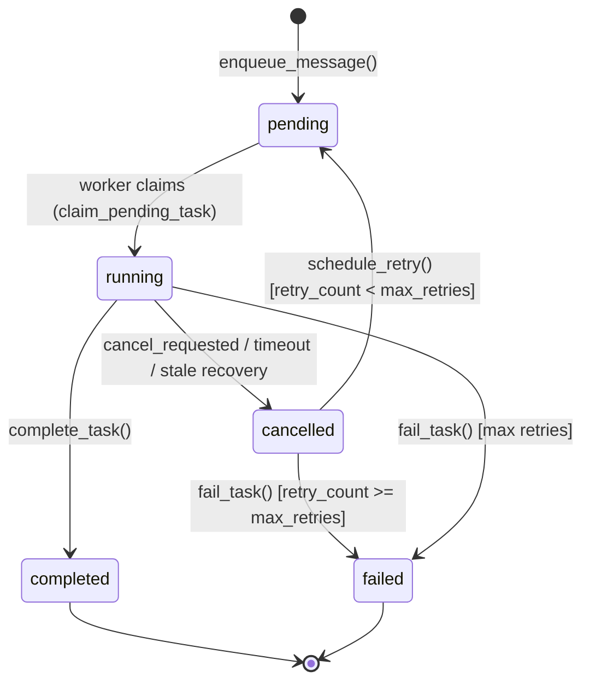
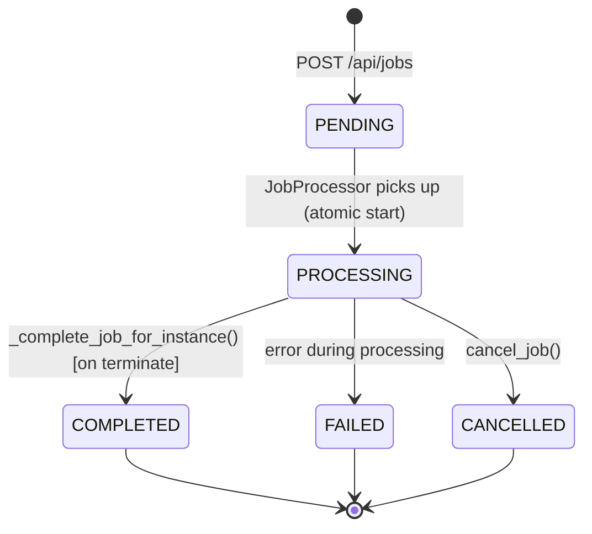
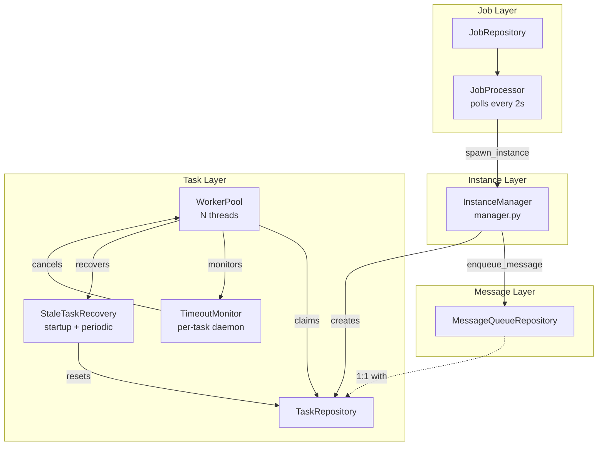
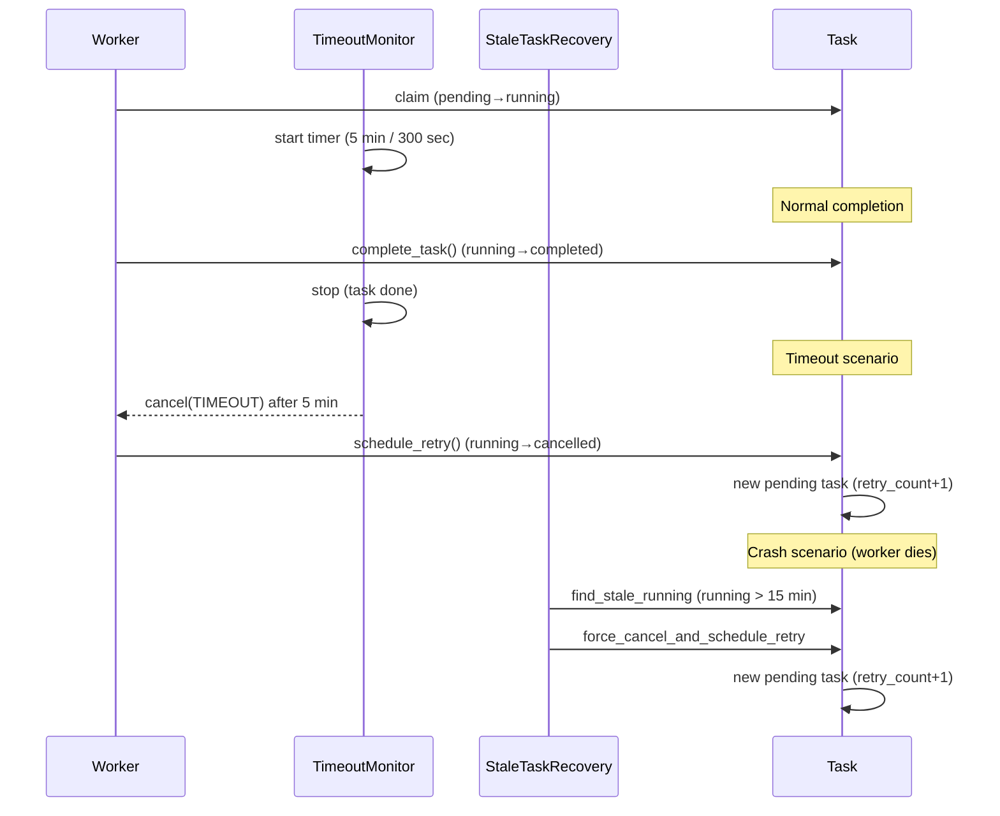
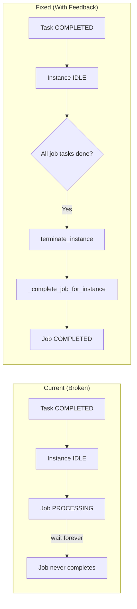

# Tasks System & Job System Investigation

## 1. Executive Summary

This investigation analyzes the architecture of two parallel execution systems in the codebase: the **Tasks System** and the **Job System**. Both systems provide work execution capabilities but operate at different abstraction levels with distinct concerns.

**Key Findings:**

- The **Tasks System** is a mature, robust execution layer with built-in timeout handling, crash recovery, exponential backoff retry, and graceful cancellation
- The **Job System** is a higher-level orchestration layer that spawns instances and enqueues messages but lacks timeout, crash recovery, and automatic completion detection
- **Critical Gap**: Task completion does not automatically propagate to Job completion, leaving jobs stuck in PROCESSING indefinitely
- The systems are **not redundant** — they operate at different levels (execution vs orchestration) and have complementary gaps

**Conclusion**: The Job System needs a feedback mechanism to detect when its spawned work is complete, rather than duplicating task-level capabilities. The recommended fix is to monitor instance status and complete jobs when instances return to IDLE after processing.

---

## 2. Tasks System Architecture

### 2.1 Task Model

The Task model represents a unit of executable work within the system:

```python
class Task:
    id: Optional[int]                  # Unique identifier (auto-increment)
    task_type: str                    # Type of task (e.g., "process_message")
    instance_id: str                  # FK to Instance (NOT NULL)
    message_id: Optional[str]         # FK to MessageQueue (optional)
    status: TaskStatus                # pending, running, completed, failed, cancelled
    worker_id: Optional[str]          # ID of worker processing this task
    retry_count: int                  # Number of retries attempted
    next_retry_at: Optional[datetime] # Scheduled retry time
    cancel_requested: bool            # Cancellation flag
    cancel_requested_at: Optional[datetime]
    retry_scheduled: bool             # Atomic guard: prevents duplicate retry creation
    result: Optional[dict]             # JSON result payload
    error: Optional[str]               # Error message on failure
    created_at: datetime              # Task creation timestamp
    started_at: Optional[datetime]    # When worker started processing
    completed_at: Optional[datetime]  # When task finished
```

**Database Indexes:**

| Index Name | Fields | Purpose |
|------------|--------|---------|
| `idx_task_status_created` | `(status, created_at)` | Find pending tasks in FIFO order |
| `idx_task_instance_id` | `instance_id` | Find all tasks for an instance |
| `idx_task_message_id` | `message_id` | Find task for a specific message |
| `idx_task_worker_id` | `worker_id` | Find tasks by worker |

### 2.2 Task States

```
┌─────────────────────────────────────────────────────────────────────────────┐
│                           Task State Machine                                │
├─────────────────────────────────────────────────────────────────────────────┤
│                                                                             │
│   PENDING ──────────────────┬──────────────────────────────────────┐        │
│       │                    │                                       │        │
│       │ (worker claims)     │                                       │        │
│       ▼                    │                                       │        │
│   RUNNING                  │                                       │        │
│       │                    │                                       │        │
│       ├────────────────────┼───────────────────────┐               │        │
│       │                    │                       │               │        │
│       ▼                    ▼                       ▼               │        │
│  COMPLETED           CANCELLED                 FAILED             │        │
│  (terminal)          (pending retry)           (terminal)         │        │
│                       │                                           │        │
│                       ├───────────────────────┐                   │        │
│                       ▼                       ▼                   │        │
│                  PENDING                  FAILED                  │        │
│             (retry_count < max)        (retry_count >= max)      │        │
│                                                                             │
└─────────────────────────────────────────────────────────────────────────────┘
```

**State Transitions:**

| From | To | Trigger |
|------|-----|---------|
| *(new)* | pending | `enqueue_message()` creates task |
| pending | running | `claim_pending_task()` worker acquires task |
| running | completed | `complete_task()` successful execution |
| running | cancelled | `cancel_requested`, timeout, or stale recovery |
| running | failed | `fail_task()` after max retries exceeded |
| cancelled | pending | `schedule_retry()` if retry_count < max_retries |
| cancelled | failed | `fail_task()` if retry_count >= max_retries |

### 2.3 WorkerPool Architecture

The WorkerPool manages concurrent task execution using OS threads:

```python
class WorkerPool:
    num_workers: int = 4              # Default thread count
    workers: List[WorkerThread]       # Persistent worker threads
    condition: threading.Condition    # Notification mechanism
```

**Key Design Principles:**

1. **Persistent Workers**: Workers never die — they continue processing tasks after completion, failure, or cancellation
2. **Notification-Based**: Uses `threading.Condition` for efficient wake-up (not busy polling)
3. **Atomic Task Claim**: Workers claim tasks using `UPDATE-RETURNING` SQL to prevent race conditions:

   ```sql
   UPDATE tasks 
   SET status = 'RUNNING', worker_id = $worker_id, started_at = NOW()
   WHERE id = (
       SELECT id FROM tasks 
       WHERE status = 'PENDING' 
       ORDER BY created_at ASC 
       LIMIT 1
   )
   RETURNING *
   ```

4. **Per-Task Timeout Monitors**: Each task spawns a dedicated daemon thread to enforce timeout
5. **FIFO Ordering**: Tasks are processed in creation order (oldest first)

**Worker Lifecycle:**

```
Worker Loop:
┌─────────────────────────────────────────┐
│ 1. Wait for notification (condition)     │
│ 2. Acquire lock                          │
│ 3. claim_pending_task() → get task      │
│ 4. Release lock                          │
│ 5. process_task(task)                    │
│    ├── Spawn TimeoutMonitor thread       │
│    ├── Execute with CancellationToken    │
│    └── Handle completion/error/cancel    │
│ 6. Loop back to step 1                   │
└─────────────────────────────────────────┘
```

### 2.4 Timeout Mechanism

The timeout system has **two layers**:

#### Layer 1: Per-Task TimeoutMonitor (Default: 5 minutes / 300 seconds)

```python
class TimeoutMonitor:
    """Daemon thread that fires cancellation after timeout_seconds."""
    
    def __init__(self, task_id: int, source, timeout_seconds: float):
        self._task_id = task_id
        self._source = source
        self._timeout = timeout_seconds
        self._stop_event = threading.Event()
    
    def _run(self):
        # Block until stopped or timeout fires
        if self._stop_event.wait(timeout=self._timeout):
            return  # Stopped before timeout — normal completion
        
        # Timeout fired — cancel the token
        self._source.cancel(CancellationReason.TIMEOUT)
```

**Flow:**
1. Worker starts processing task → spawns `TimeoutMonitor` thread
2. `TimeoutMonitor` blocks on `_stop_event` for 5 minutes (300 seconds)
3. On timeout: `CancellationTokenSource.cancel()` is called
4. `CancellationCallbackHandler` checks token at LLM/tool/chain start points in LangGraph
5. On detection: `OperationCancelledError` is raised → `_handle_cancellation` → `schedule_retry` or `fail_task`

#### Layer 2: TaskProcessor Graph-Level Timeout (40 minutes)

```python
class TaskProcessor:
    def run_task(self, task, cancellation_token=None):
        # TaskProcessor passes timeout to MainLoopBridge
        timeout = self._graph_timeout_minutes * 60.0  # 40 min default
        return MainLoopBridge.run_async(_run(), timeout=timeout)
```

**Important Notes:**
- Timeout is **NOT configurable per-task** — same timeout applies to all tasks
- TimeoutMonitor can be stopped early if task completes before timeout
- Both layers work together: if task exceeds 40 min in LangGraph, graph-level timeout kicks in

### 2.5 Stale Task Recovery

The stale task recovery system handles worker crashes and hung tasks.

#### When It Runs

1. **On Startup** (one-shot): Recovers any tasks left in RUNNING state from previous crashes
2. **Periodic Background Thread**: Every 60 seconds

#### Startup Recovery Protocol

```
For each RUNNING task (from previous session):
├── Check if worker is still alive
│   └── If dead: force_cancel + schedule_retry
└── Check for orphaned CANCELLED tasks
    └── If no retry child exists: schedule_retry
```

#### Periodic Recovery Protocol (5-Step)

```
Step 1: FIND
    └── SELECT * FROM tasks WHERE status='RUNNING' AND started_at < threshold (15 min)

Step 2: REQUEST_CANCEL
    └── UPDATE tasks SET cancel_requested=True WHERE id IN stale_tasks

Step 3: GRACE_WAIT
    └── sleep(10 seconds) — allow graceful shutdown

Step 4: FORCE_CANCEL
    └── For tasks still RUNNING after grace period:
        └── Update status to CANCELLED, set error message

Step 5: SCHEDULE_RETRY
    └── For all cancelled tasks (from Steps 2-4):
        └── Create new PENDING task with retry_count+1
```

#### Orphan Detection

An orphaned task is a `CANCELLED` task where:
- `retry_scheduled = False` (no retry created yet)
- No child task exists with same `(instance_id, message_id)` and higher `retry_count`

#### Recovery Behavior

- Recovery **cannot resume** execution — it only resets to PENDING
- New task is created with incremented `retry_count`
- Original task remains in FAILED/CANCELLED state for audit trail

#### Retry Configuration

| Parameter | Value |
|-----------|-------|
| Max Retries | 3 |
| Base Delay | 60 seconds |
| Max Delay | 3600 seconds (1 hour) |
| Backoff Formula | `min(base * 2^retry_count, max_delay)` |

### 2.6 Task Creation

Tasks are created **atomically with MessageQueue entries** in a single transaction:

```python
# In manager.enqueue_message()
async with db_transaction():
    # 1. Create MessageQueue entry
    message = await message_repo.create(instance_id=instance_id, ...)
    
    # 2. Create Task entry (atomic with message)
    task = await task_repo.create(
        instance_id=instance_id,
        message_id=message.id,
        task_type="PROCESS_MESSAGE",
        ...
    )
```

**Triggers for Task Creation:**

| Trigger | Source |
|---------|--------|
| User message received | API request |
| API message received | External API call |
| Completion report | Agent reports work done |
| Error report | Agent reports error |
| Agent-to-agent message | Internal messaging |

**Important**: Tasks are **NOT** created when an instance is spawned — only when messages arrive.

### 2.7 Task Completion Flow

```
Worker completes task
        │
        ▼
┌───────────────────────────────────────┐
│           Success Path                 │
├───────────────────────────────────────┤
│ 1. Worker.process_task() returns OK   │
│ 2. complete_task()                    │
│    ├── Update task status → COMPLETED │
│    ├── Store result in task.result    │
│    └── Set completed_at timestamp     │
│ 3. message_repo.complete()           │
│    └── Mark message as COMPLETED      │
│ 4. EventBus.publish("task.completed") │
│    └── Notify listeners               │
└───────────────────────────────────────┘

┌───────────────────────────────────────┐
│           Failure Path                 │
├───────────────────────────────────────┤
│ 1. Exception caught in process_task()  │
│ 2. fail_task()                        │
│    ├── Update task status → FAILED    │
│    ├── Store error message            │
│    └── Set completed_at timestamp     │
│ 3. message_repo.fail()                │
│    └── Mark message as FAILED         │
│ 4. EventBus.publish("task.failed")   │
│    └── Notify listeners               │
└───────────────────────────────────────┘
```

**Note**: There is no explicit callback mechanism — completion propagates through direct DB updates within the same logical flow.

---

## 3. Job System Architecture

### 3.1 Job Model

```python
class Job:
    job_id: str                    # UUID primary key
    agent_id: str                  # Agent to run
    agent_dir: str                  # Agent directory path
    message: str                   # Message content (for single-message jobs)
    source: str                    # Job source (API, scheduler, etc.)
    project_id: str                # Project this job belongs to
    queue_id: Optional[str]        # Queue for priority scheduling
    priority: int                  # 1-10 (1 = highest)
    status: JobStatus              # PENDING, PROCESSING, COMPLETED, FAILED, CANCELLED
    created_at: datetime           # Job creation time
    started_at: Optional[datetime] # When processing began
    completed_at: Optional[datetime] # When job finished
    instance_id: str                # Pre-generated instance ID
    error_message: Optional[str]   # Error on failure
    result_summary: Optional[dict] # Summary of job results
    job_metadata: Optional[dict]    # Additional metadata
    cancelled_at: Optional[datetime] # When cancelled
```

**Job Statuses:**

| Status | Description |
|--------|-------------|
| PENDING | Job created, waiting for processing |
| PROCESSING | Job picked up by JobProcessor, instance spawned |
| COMPLETED | Job finished successfully |
| FAILED | Job failed with error |
| CANCELLED | Job was explicitly cancelled |

### 3.2 Job Lifecycle

```
┌─────────────────────────────────────────────────────────────────────────────┐
│                            Job State Machine                                 │
├─────────────────────────────────────────────────────────────────────────────┤
│                                                                             │
│   [*] ──► PENDING ──────────────────────────┐                              │
│              │                               │                              │
│              │ (JobProcessor picks up)        │                              │
│              ▼                               │                              │
│        PROCESSING                             │                              │
│              │                               │                              │
│              ├───────────────────────────────┼───────────────────────────┐  │
│              │                               │                           │  │
│              ▼                               ▼                           ▼  │
│         COMPLETED                         FAILED                    CANCELLED  │
│         (terminal)                       (terminal)                   (terminal)  │
│                                                                             │
└─────────────────────────────────────────────────────────────────────────────┘
```

**Lifecycle Steps:**

1. **Creation**: POST `/api/jobs` → Job created with status `PENDING`
2. **Processing Start**: JobProcessor polls every 2s, checks project/queue pause status
3. **Atomic Start**: Only one processor succeeds via status check in transaction
4. **Instance Spawn**: JobProcessor calls `spawn_instance()` → creates Instance
5. **Message Enqueue**: Instance's `enqueue_message()` → creates Message + Task atomically
6. **Worker Execution**: WorkerPool picks up Task, processes with LangGraph
7. **Completion**: Explicit `terminate_instance()` → `_complete_job_for_instance()`

### 3.3 Job → Instance → Message → Task Chain

```
Job (PENDING)
    │
    │ JobProcessor.poll() [every 2s]
    │ Check: project not paused, queue not paused
    │
    ▼
Job (PROCESSING) ──spawn_instance()──► Instance (RUNNING)
                                        │
                                        │ enqueue_message()
                                        │ (atomic: Message + Task)
                                        │
                                        ▼
                                    MessageQueue (READY)
                                        │
                                        ▼
                                    Task (PENDING)
                                        │
                                        │ Worker.claim_pending_task()
                                        │
                                        ▼
                                    Task (RUNNING) ──► ... ──► Task (COMPLETED)
                                        │
                                        │ complete_task()
                                        │
                                        ▼
                                    MessageQueue (COMPLETED)
                                        │
                                        │ ⚠️ NO AUTO PROPAGATION
                                        ▼
Job (PROCESSING) ◄── terminate_instance() ◄── Explicit call required
    │
    │ _complete_job_for_instance()
    │
    ▼
Job (COMPLETED)
```

**Key Insight**: The Job is **only completed** when `terminate_instance()` is explicitly called. This creates a critical gap where jobs can be stuck in PROCESSING indefinitely.

---

## 4. Connection Maps

### 4.1 Task ↔ Job Connection

```
┌─────────┐    instance_id     ┌────────────┐    instance_id     ┌─────────┐
│  Task   │ ◄──────────────── │  Instance  │ ─────────────────► │   Job   │
└─────────┘                    └────────────┘                    └─────────┘

Connection: Task.instance_id → Instance.instance_id → Job.instance_id
Hops: 3 (indirect)
```

**No direct foreign key exists** between Task and Job. The relationship is:
- Task → Instance: `instance_id` FK
- Instance → Job: `instance_id` FK

### 4.2 Task ↔ Message Queue Connection

```
┌─────────┐   message_id   ┌────────────────┐
│  Task   │ ◄────────────►│ MessageQueue   │
└─────────┘                └────────────────┘

Relationship: 1:1 for PROCESS_MESSAGE tasks
Created: Atomically in same transaction
Completion: Task completion also marks MessageQueue as COMPLETED/FAILED
```

### 4.3 Message Queue ↔ Job Connection

```
┌────────────────┐   instance_id   ┌────────────┐   instance_id   ┌─────────┐
│ MessageQueue   │ ◄────────────►│  Instance   │ ──────────────► │   Job   │
└────────────────┘                └────────────┘                  └─────────┘

Connection: Message.instance_id → Instance.instance_id → Job.instance_id
Hops: 2 (indirect)
```

---

## 5. Critical Gap: Task Completion → Job Completion

**Task completion does NOT automatically trigger job completion.**

### Current Flow (Broken)

```
1. Task completes (COMPLETED)
   └── complete_task() → task_repo.complete_task()
   └── message_repo.complete()
   └── EventBus.publish("task.completed")

2. Instance remains RUNNING
   └── Instance has no awareness that Job is waiting for completion
   └── Instance is waiting for more messages

3. Job remains PROCESSING
   └── Job has no callback mechanism
   └── Job only completes via explicit terminate_instance()

4. Result: Job stuck in PROCESSING indefinitely
```

### When Job IS Completed

The Job is completed only in these scenarios:

| Scenario | Trigger | Method |
|----------|---------|--------|
| Normal completion | Instance terminates gracefully | `_complete_job_for_instance()` |
| Explicit cancel | User calls `cancel_job()` | `cancel_job()` |
| Processing error | Exception during job processing | Exception handler |

### Why This Is a Problem

1. **Jobs never complete**: Unless explicitly terminated, jobs stay PROCESSING forever
2. **No job timeout**: Without knowing when a job is "done", there's no way to enforce a wall-clock timeout
3. **No crash detection**: If an instance crashes, the job never knows and stays PROCESSING
4. **No orphan recovery**: Stuck jobs cannot be automatically detected and recovered

---

## 6. Redundancy Analysis Table

| Capability | Tasks System | Jobs System | Redundant? | Assessment |
|------------|:------------:|:-----------:|:----------:|------------|
| **Timeout** | ✅ 5 min (TimeoutMonitor + TaskProcessor Graph Timeout) | ❌ None | NO | Jobs need timeout — currently missing |
| **Crash Recovery** | ✅ StaleTaskRecovery (startup + periodic) | ❌ None | NO | Jobs need recovery — currently missing |
| **Heartbeat** | ❌ No (only `started_at` check) | ❌ No | N/A | Neither has heartbeat tracking |
| **State Management** | ✅ Full state machine (PENDING/RUNNING/COMPLETED/FAILED/CANCELLED) | ✅ Basic state machine (PENDING/PROCESSING/COMPLETED/FAILED/CANCELLED) | PARTIAL | Jobs lack retry/cancel-retry transitions |
| **Retry with Backoff** | ✅ Exponential (60s base, 3 retries) | ❌ None | NO | Jobs need retry — currently missing |
| **Cancellation** | ✅ Graceful (cancel_requested flag) + Force cancel | ✅ Basic `cancel_job()` | PARTIAL | Job cancel doesn't cascade to task |
| **Atomic Claim** | ✅ UPDATE-RETURNING SQL | ✅ Status check in transaction | YES | Same pattern — not redundant, consistent |
| **Persistence** | ✅ SQLite | ✅ SQLite | YES | Same pattern — not redundant, consistent |
| **Worker Pool** | ✅ N threads with notification | ❌ Single async poller (JobProcessor) | N/A | Different models (threads vs async) |
| **Stuck Detection** | ✅ 15 min threshold | ❌ None | NO | Jobs need stuck detection — currently missing |
| **Progress Tracking** | ❌ None | ❌ None | N/A | Neither has progress tracking |

**Summary**:
- **NOT Redundant**: Timeout, Crash Recovery, Retry, Stuck Detection — Jobs are missing these critical capabilities
- **PARTIAL Redundancy**: State Management, Cancellation — Jobs have basic versions but lack depth
- **YES Redundant**: Atomic Claim, Persistence — Same patterns, consistent implementation

---

## 7. Recommendations

### 7.1 What the Job System Should Delegate to Tasks System

**Nothing directly** — the systems operate at different abstraction levels and have complementary roles:

| Level | System | Responsibility |
|-------|--------|----------------|
| Orchestration | Job System | High-level work units, lifecycle management |
| Execution | Tasks System | Low-level execution, timeout, retry, recovery |

The Tasks System already handles execution-level concerns (timeout, retry, crash recovery) **for the messages that jobs generate**. Jobs don't need to duplicate these — they need to **observe** the results.

### 7.2 What the Job System Must Own Itself

The Job System must implement these capabilities independently:

#### 7.2.1 Job-Level Timeout

A job may spawn multiple tasks over its lifetime. The job itself needs a wall-clock timeout independent of individual task timeouts.

**Why needed**: If a job's instance becomes unresponsive but individual tasks don't timeout, the job will wait forever.

**Implementation approach**:
```python
class JobTimeoutMonitor:
    """Monitors job wall-clock time."""
    
    def __init__(self, job_id: str, timeout_minutes: int = 120):
        self.job_id = job_id
        self.timeout = timedelta(minutes=timeout_minutes)
    
    async def start(self):
        while True:
            await asyncio.sleep(60)  # Check every minute
            job = await job_repo.get(self.job_id)
            
            if job.status != JobStatus.PROCESSING:
                return  # Job already done
                
            elapsed = datetime.now() - job.started_at
            if elapsed > self.timeout:
                await self._timeout_job(job)
```

#### 7.2.2 Job Completion Detection

**This is the critical fix.** Currently broken: task completion doesn't propagate to job completion.

**Options**:

1. **Instance Status Monitoring** (Recommended)
   - When instance returns to IDLE after processing job's message → complete job
   - Pros: Clean, event-driven
   - Cons: Requires instance status tracking

2. **Task Completion Callback**
   - When the task associated with a job's message completes → complete job
   - Pros: Direct connection
   - Cons: Job may spawn multiple tasks

3. **Periodic Job Audit**
   - Check if job's instance is still alive/active
   - Pros: Simple to implement
   - Cons: Polling, delay

#### 7.2.3 Orphan Job Recovery

Jobs stuck in PROCESSING when instance crashes need to be detected and reset.

**Detection criteria**:
- Job status = PROCESSING
- No associated instance exists, OR
- Instance status != RUNNING, AND
- Last activity > threshold (e.g., 30 minutes)

**Recovery action**:
- Mark job as FAILED with "Instance crashed" error, OR
- Reset to PENDING for reprocessing

#### 7.2.4 Job Heartbeat/Activity Tracking

Track last activity to detect stuck jobs.

```python
class Job:
    last_activity_at: Optional[datetime]  # New field
    heartbeat_interval_seconds: int = 60  # Default

# Update on:
# - Task started
# - Task completed
# - Message received
# - Instance status change
```

### 7.3 What Could Be Shared/Unified

#### 7.3.1 Cancellation Cascade

**Currently**: Job cancel doesn't propagate to instance → task.

**Desired**: `cancel_job()` → `instance.cancel()` → `task.cancel_requested = True`

**Implementation**:
```python
async def cancel_job(job_id: str) -> None:
    job = await job_repo.get(job_id)
    
    if job.status not in (JobStatus.PENDING, JobStatus.PROCESSING):
        return
    
    # Cascade to instance
    if job.instance_id:
        await instance_manager.cancel_instance(job.instance_id)
    
    # Mark job as cancelled
    await job_repo.update(job_id, status=JobStatus.CANCELLED)
```

#### 7.3.2 Retry Policy

Two levels of retry with different concerns:

| Level | Trigger | Behavior |
|-------|---------|----------|
| Task-level | Single message fails | Exponential backoff, 3 retries |
| Job-level | Entire job fails | Re-queue with backoff (future enhancement) |

**Could share**:
- Backoff calculation logic (`base * 2^attempt`)
- Max retry configuration
- Retry schedule generation

#### 7.3.3 State Machine Patterns

Both systems use similar PENDING→RUNNING→DONE patterns.

**Could share**:
- Base state machine class with transition validation
- Common state transition events (STARTED, COMPLETED, FAILED, CANCELLED)
- Transition hook system (pre-transition, post-transition)

```python
class StateMachine(Generic[S]):
    def __init__(self, initial: S):
        self.state = initial
        self.transitions: Dict[S, Set[S]] = {}
        self.hooks: Dict[str, List[Callable]] = {
            "pre_transition": [],
            "post_transition": [],
        }
    
    def transition(self, from_state: S, to_state: S) -> bool:
        if to_state not in self.transitions.get(from_state, set()):
            return False
        
        self._run_hooks("pre_transition", from_state, to_state)
        self.state = to_state
        self._run_hooks("post_transition", from_state, to_state)
        return True
```

### 7.4 Key Architecture Insight

**The fundamental issue is that jobs and tasks are disconnected after job processing starts.**

```
Current (Broken):
┌────────┐      ┌──────────┐      ┌────────────┐      ┌─────┐
│  Job   │ ──► │ Instance │ ──► │  Message   │ ──► │Task │
│ starts │      │ created  │      │ enqueued   │      │run  │
└────────┘      └──────────┘      └────────────┘      └──┬──┘
      │                                                         │
      │ (no feedback)                                          │
      │                                                         ▼
      │                                                      ┌─────┐
      │ (wait forever)                                       │Task │
      │                                                       │done │
      └─────────────────────────────────────────────────────►└─────┘
                      Missing: Job doesn't know
```

**Root causes of problems**:
1. **Jobs stuck in PROCESSING** — No feedback from task completion
2. **No job timeout** — No way to know if job is "done"
3. **No job crash recovery** — No way to know job is "stuck"

**The fix should add a feedback mechanism**, not duplicate task-level capabilities:

```
Fixed Design:
┌────────┐      ┌──────────┐      ┌────────────┐      ┌─────┐
│  Job   │ ──► │ Instance │ ──► │  Message   │ ──► │Task │
│ starts │      │ created  │      │ enqueued   │      │run  │
└────────┘      └──────────┘      └────────────┘      └──┬──┘
      │                                       │           │
      │                                       │      ┌────┴────┐
      │ (feedback on completion)               │      │Task done│
      │◄───────────────────────────────────────┘      └────┬────┘
      │                                                   │
      │                     ┌─────────────────────────────┘
      │                     │ (instance returns to IDLE)
      │                     ▼
      │               ┌──────────┐
      └──────────────►│Job done  │
                      └──────────┘
```

---

## 8. Mermaid Diagrams

### 8.1 Task State Machine



### 8.2 Job Lifecycle



### 8.3 Job → Instance → Message → Task Chain


### 8.4 System Architecture Overview



### 8.5 Timeout & Recovery Timeline



### 8.6 Job Completion Flow (Current vs Fixed)



---

## Appendix: Glossary

| Term | Definition |
|------|------------|
| **Instance** | A running execution environment for an agent |
| **Job** | A high-level work unit submitted via API |
| **Task** | A low-level unit of executable work (e.g., process a message) |
| **WorkerPool** | Thread pool that processes tasks concurrently |
| **TimeoutMonitor** | Daemon thread that enforces per-task timeouts |
| **StaleTaskRecovery** | System that recovers from worker crashes |
| **Atomic Claim** | SQL pattern to prevent race conditions when claiming tasks |
| **CancellationToken** | Token that signals cancellation to running operations |
| **Orphaned Task** | A cancelled task with no retry child |

---

*Document generated: 2026-04-16*
