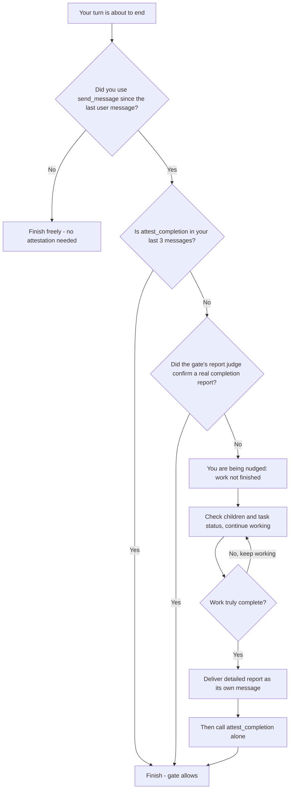

# Mid-Work Report Demonstration — LCA Completion Gate on a Real Tester Transcript

Date: 2026-09-12
Branch: `plan/mid-work-report-testcase` (isolated worktree `agents-ensemble-wt-midwork`, detached from `latest` @ `0be09fcd`)
Pack: `mid_work_report_testcase` → `tests/integration/test_attestation_mid_work_report_testcase.py`
Commits: `ac957818` (test file, 6 scenarios) → `04873c62` (true route-b exercise) — NOT pushed/merged
Workers: recon `a4e73ff8`, author/execute/diagnose `6941e3e8`
**Verdict: ✅ 6/6 PASS (4 stubbed, 0.72s + 2 live, 21.30s; dual-layer timeouts; drift-pinned; `uv run python -m pytest`). Demonstration complete. 1 prod-real latent defect found (report-only, not fixed per demo constraint).**

## Transcript under test (verbatim final AIMessage, plain text, no tool calls)

> LESSONS written. Three workers still out (P-10, security pin, legacy pack). Ending turn - resuming on their reports to write the final RESULTS file and commit.

Intrinsic sensor properties (verified): **26 words** (`text.split()`; user estimated ~28) < 150 threshold → length trigger fires. Marker catalog hit: **`ending turn`** (only term; case-insensitive substring; no other of the 16 catalog terms present).

## Scenario matrix

| Scenario | Tree state | Gate decision | trigger_source | final_word_count | marker_terms | Judge | Delivered to leader | Counter |
|---|---|---|---|---|---|---|---|---|
| **A** children genuinely out | 3 RUNNING children (live_descendants=3, real pending) | `allowed_legitimate_pending_wakeup` | `markers+length` | 26 | `ending turn` | not-complete (stub; live verdict `no`) | **Completion Check Note hint** (route b) | stays 0 (no increment, no reset) |
| **B** all terminal | 3 COMPLETED children; pending=0, wakeups=0, live=0 | `denied` (branch a) | `<none>` — markers BYPASSed on primary deny (see Finding 2) | n/a on deny row | `<none>` | stub not-complete (moot — deny decided pre-judge) | **Completion Check Nudge** | `0→1` (`denied_count=0 -> next=1`); reset to 0 on later attested allow |
| **C1** attested | attest_completion tool_call in window | `allowed`, `attestation_present=True` | `<none>` (scan skipped entirely) | — | — | **NOT called** (0 stub calls) | none | 0 |
| **C2** long benign | 3 RUNNING children; 215-word detailed report, 0 catalog hits | `allowed_legitimate_pending_wakeup` | `<none>` | 215 (in-test assert ≥150) | none | **NOT called** (0 stub calls) | none | 0 |
| **A-LIVE** | = A, real judge | allow + hint, **true route b** | `markers+length` | 26 | `ending turn` | **`no` — NOT a completion report** | hint | 0 |
| **B-LIVE** | = B, real judge | denied ×2 (ladder `0→1→2`) → attested allow | — | — | — | would-be-deny judge hit ImportError-class fault → fail-closed deny (primary deny unaffected) | nudge ×2 | `0→1→2→0` (attested allow resets) |

## Scenario A — exact hint delivered (verbatim)

```
[SYSTEM CONTEXT: Completion Check Note]

The completion gate noticed mid-work phrasing on a turn where
real pending work is still outstanding (children, wakeups, or
live descendants remained). The gate allowed the turn to end so
the wake-up you expected can still arrive, but please confirm on
your next turn that the wake-up actually comes — if the pending
work was orphaned or already idle, clean it up or call
attest_completion once the work is truly done. Reminder: when
you do finish, FIRST deliver your full detailed final report as
its own message, THEN call attest_completion ALONE — never
bundle the report into the attestation tool-call message.
```

Mechanism: primary allow (branch 5, live≠0) → marker overlay fires (`marker_hit=True marker_terms=ending turn length_trigger=True trigger_source=markers+length final_word_count=26`) → judge not-complete → **route (b)** allow stands + checkpoint-durable hint. NO counter movement, NO deny. Hint carries a stable per-instance id (supersedes in place on repeats).

## Scenario B — exact nudge delivered (verbatim)

```
[SYSTEM CONTEXT: Completion Check Nudge]

The work is not yet finished — check current progress (tasks/children status) and continue.

This gate is CONDITIONAL on delegation: it fires ONLY when a child was dispatched (a send_message tool call happened) since the last real user message. Plain questions, chart requests, and other non-delegating turns do NOT trigger this gate. When you have dispatched a child this mission, the work is not complete until you attest.

Attestation is a SEPARATE step: FIRST deliver your full detailed final report as its own message (outcomes, evidence, follow-ups), THEN call attest_completion ALONE as a subsequent step — never bundle the report into the attestation tool-call message (at most a one-line ack such as "Report delivered above; attesting completion.").

Reminder: when — and only when — the work is truly complete (delegated children have all reported and you have the full picture), you MUST call the attest_completion tool before finishing; completions without that call are premature and will be blocked again.
Completion flow:


Counter evidence: `[AttestationGate] deny instance=… denied_count=0 -> next=1`; final row back to 0 after the post-nudge attested allow (reset trigger #1 demonstrated).

## Live-LLM judge verdicts (real prompt, real model `quick`)

- **Direct probe** (real `judge_completion_report_async`, no graph fixture): `is_complete_report=False`, verdict `no`, latency 11.26s. Reason (verbatim): *"This is a brief interim status update that explicitly defers final deliverables (RESULTS file and commit) to a later turn while three workers are still outstanding, rather than a final detailed report of outcomes."*
- **In-graph (A-LIVE)**: verdict `no`, latency 22.0s. Reason (verbatim): *"The message is an in-progress status update that explicitly states the agent is ending mid-work and will resume later to write the final RESULTS file and commit, with no enumerated outcomes, evidence, or follow-ups delivered."*
- **Match to expected classification: YES** — both live verdicts judge the transcript NOT a completion report (children outstanding + future-intent verbs), exactly as the judge prompt intends.
- Operational note: in-graph latency 22.0s sits near the 25s default judge timeout — tail-risk of timeout→route-(d) under slow model response.

## Guidance assessment (does the text tell the leader what to do next?)

- **A hint** ✅ covers: confirm the wake actually arrives (*"please confirm on your next turn that the wake-up actually comes"*), cleanup-or-attest (*"if the pending work was orphaned or already idle, clean it up or call attest_completion once the work is truly done"*), report-first-then-attest-alone reminder. 🟢 Gap: no explicit "continue/revive work via send_message" phrasing — a leader reading "clean it up or attest" gets no dispatch-more-work guidance.
- **B nudge** ✅ covers: check progress + continue (*"check current progress (tasks/children status) and continue"*), the two-step teaching (report as own message, then attest ALONE), conditional-gate explanation, mermaid decision flow. 🟢 Gap: prose says "continue" without explicitly naming send_message/revive as the continuation mechanism (the mermaid shows "continue working" only).

## Findings / surprises

1. 🔴 **PROD-REAL latent defect (one char ×2), NOT fixed — report-only per demo constraint:** `daemon/graph.py:3429` and `daemon/graph.py:3703` (marker-judge wrapper + would-be-deny-judge wrapper) execute `from ..config import load_config` — **two dots** → `ImportError: attempted relative import beyond top-level package` (correct: `from .config import load_config`, one dot). **Masked in production** because `InstanceManager.__init__` always sets `self.config` (manager.py:419) so the buggy `else:` branch never runs with the real manager; any manager object lacking `.config` (test fixtures, future call sites) hits the ImportError, and the broad `except Exception` silently converts it to fail-safe route (d) — **the judge never runs in that context**. Detected because the stubbed judge call count was 0. Test-side workaround (committed): attach `manager.config = load_config()` in the fixture. Recommended fix: one-char change ×2 + a regression test asserting the else-branch import path.
2. 🟠 **By-design nuance vs. stated expectation:** markers/length sensors do **not** run on the primary DENY path — scenario B's deny row logs `marker_hit=False marker_terms=<none> trigger_source=<none>` even though the transcript intrinsically trips both sensors (proven in A). The marker scan is an overlay on would-be-ALLOWS only (documented at graph.py:967-968: judge is best-effort + costly; cheap scan gates it). Outcome for B is exactly as expected (deny + nudge + counter) — only the `trigger_source=markers+length` expectation needs correcting for deny-path rows.
3. 🟢 Observability artifact: the canonical decision row's `final_word_count` is emitted at the FIRST gate evaluation of the turn (post-delegate) — later final-message word counts (e.g., C2's 215) don't surface in that row; the in-test pre-flight invariant assertion guards against regression.
4. 🟢 Route (b) and route (d)-with-pending deliver the SAME hint text to the leader — the leader-visible outcome is identical whether the judge answers "no" or errors; only the log discriminator (`marker-path b` vs `fail_safe_marker_d`) differs.

## Scope Decision

User requested a single targeted demonstration test case → **1 new additive test file** in an isolated worktree @ `0be09fcd`; zero production-code changes (`git diff 0be09fcd..HEAD -- daemon/` empty apart from nothing — daemon/ untouched); no existing packs touched; no full suite. Full suite NOT warranted (demonstration, additive-only).

## ensure.md Validation (scoped)

- **Critical #1 (no regressions in changed packs)**: ✅ `mid_work_report_testcase` PASS 6/6 — the only pack in the change set.
- Deadlock/concurrency pack, sync-DB check, dev.sh grep: **out of blast radius** (no daemon/dev.sh/infra change — additive test file only).
- Release Gate: **not warranted** (no production change; demonstration).
- Improvement notices: none — no contradictions encountered.

## Action Needed

- [ ] 🔴 Dispatch production quick-fix: `graph.py:3429` + `:3703` `..config` → `.config` (one char ×2) + else-branch regression test — report-only here per demo constraint.
- [ ] Merge decision for `plan/mid-work-report-testcase` (test file + these docs; not pushed).
- [ ] 🟢 Optional (leader call): add explicit "continue/revive via send_message" phrasing to hint/nudge texts.
- [ ] 🟢 Optional: note live-judge latency tail (22s vs 25s cap) for the judge-timeout knob.

## Artifacts

- Test file: `tests/integration/test_attestation_mid_work_report_testcase.py` (commits `ac957818`, `04873c62`)
- LESSONS: `.agents/tester/LESSONS/2026-09-12-lca-judge-config-import-typo.md`
- KB: defect recorded via `experience()` (2026-09-12)
