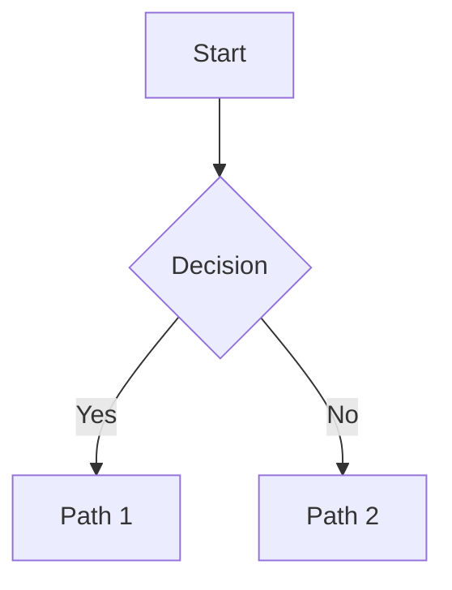

# Chart Skill

Generate Mermaid diagrams. For most requests you **delegate to the charter** child agent, which produces validated, render-ready Mermaid syntax — flowcharts, sequence diagrams, class diagrams, state diagrams, ER diagrams, Gantt charts, mind maps, and C4 diagrams — and verifies the syntax via `npx -y @mermaid-js/mermaid-cli` before returning. For **simple** diagrams, you may generate the Mermaid yourself.

Use this skill whenever you need to communicate visually: an architecture you want the user to see, a process flow that would be clearer as a diagram than as prose, a database schema, a state machine, a timeline.

## Self-generate vs. Delegate — Decision Guide

Decide per request whether to write the Mermaid yourself or delegate to charter.

### Generate it yourself when the diagram is **simple**

You may write the Mermaid directly when **all** of these hold:

- **Few nodes / edges** — roughly ≤ 8 nodes and ≤ 12 edges, or a sequence diagram with ≤ 2 actors and a handful of messages.
- **Standard shape** — one of the common trivial patterns: a 2-3 branch flowchart, a simple linear pipeline, a single-decision tree, a small tree/mind map, a tiny sequence.
- **No cross-cutting relationships** — no complex branching, no overlapping groups/subgraphs, no multi-hop references.
- **Confidence** — you are confident the syntax is correct without testing it.

If you self-generate, wrap the output in a ```mermaid block exactly as you would paste charter's output (see **Output Format**).

### Delegate to charter when the diagram is **complicated**

Spawn charter when **any** of these apply:

- **Large or dense** — many nodes/edges, wide fan-out, deep nesting, or multiple subgraphs/clusters.
- **Complex relationships** — overlapping groups, conditional branches, loops, concurrent sequences, C4 levels, or large ER schemas.
- **Mixing diagram types or needing advanced syntax** — class/state/Gantt/ER/mind-map with non-trivial structure, styling, or annotations.
- **Risk of syntax errors** — you're unsure the Mermaid is valid, or the diagram would be too tedious to hand-write and eyeball-verify.

**Escalate to charter if a self-generated diagram has problems.** If the user reports that a diagram you wrote yourself is broken, wrong, or renders incorrectly, **do not attempt a manual fix**. Delegate to charter so it can regenerate *and* validate the syntax. Same applies if you self-generated, eyeballed it, and suspect it may not render.

### Quick reference

| Situation | Action |
|---|---|
| Simple flowchart / linear pipeline / tiny sequence | Generate yourself |
| ≤ 8 nodes, standard shape, high confidence | Generate yourself |
| Large, nested, many edges, subgraphs | Delegate to charter |
| ER / state / class / Gantt with non-trivial structure | Delegate to charter |
| User says your self-generated chart is broken/wrong | Delegate to charter (regenerate + validate) |
| You're unsure the Mermaid syntax is valid | Delegate to charter |

## When a Diagram Is Needed

Request (or generate) a diagram whenever the artifact is **structural** rather than purely textual:

- **Architecture** — module / service / container relationships, system context diagrams
- **Process** — request lifecycles, decision trees, pipelines, agent workflows
- **State** — finite-state machines, status transitions, lifecycle stages
- **Data models** — database schemas, entity-relationship diagrams, class hierarchies
- **Timelines** — project plans, milestones, Gantt charts

If you can express the content cleanly as a short paragraph, you don't need a diagram. If you find yourself writing "this connects to that, which calls the other thing, which then..." — you need a diagram.

## How to Delegate to Charter

### Step 1: Spawn charter

```python
spawn_instance(
    agent_id="charter",
    instance_name="diagram-architecture",   # short, descriptive
)
```

### Step 2: Send the diagram request

```python
send_message(
    instance_id="<charter_instance_id>",
    message=(
        "Create a flowchart showing the authentication request flow. "
        "Include: User, Auth Service, Token Store, Protected Resource, "
        "and the decision branches for valid/invalid tokens. "
        "Use flowchart TD."
    ),
)
```

A good request includes:

- **What** the diagram represents (flowchart, sequence, ER, etc.)
- **Which nodes / actors / entities** must appear
- **Which relationships / edges / messages** connect them
- **Any constraints** (direction, grouping, scope)
- **Context** if the diagram is about a specific codebase or file

### Step 3: Receive the validated diagram

Charter returns the diagram wrapped in a single ```mermaid fenced block. The syntax has already been validated via `npx -y @mermaid-js/mermaid-cli` against a per-instance temp file — if validation fails 3 times, charter returns the diagram with an explicit warning and the mmdc error so you can decide whether to use it as-is, simplify the request, or hand-fix the syntax.

### Step 4: Integrate into your response

Include charter's diagram output directly in your response. The ```mermaid block renders as a visual diagram in:

- The ensemble chat UI (via ngx-markdown's built-in Mermaid support)
- GitHub Markdown previews
- Any standard Mermaid-compatible renderer

Do not re-wrap the block, do not add extra language tags, do not strip the fence — the renderer depends on the exact ` ```mermaid ` opener.

## Output Format

Mermaid diagrams use fenced code blocks with the `mermaid` language tag:

````markdown

````

Charter's response typically also includes a 1-2 sentence explanation after the block. Treat that explanation as part of the deliverable — include it verbatim or paraphrase as you see fit.

## Best Practices

- **Be specific in your request to charter.** "Create a flowchart" is too vague; "Create a flowchart TD showing how a request flows from API → Auth Middleware → Handler → DB, with branches for cache hit/miss" is the right level of specificity.
- **Provide context.** If the diagram is about a real system, name the files, modules, or services. Charter uses `explore()` / `knowledge` tools to gather context when needed, but telling it up front saves a round-trip.
- **One diagram per request.** Don't ask for "a flowchart, a sequence diagram, and an ER diagram" in a single spawn — each is a separate visual artifact with its own validation step. If you need multiple, spawn multiple instances.
- **Don't hand-edit charter's output before pasting.** Charter's diagrams are already validated. If you need to modify the diagram, send a follow-up message to the same charter instance — it has the context and can re-validate the edit.
- **Trust the validation, but read the diagram.** A passing mmdc check means the syntax is valid — it doesn't mean the diagram is correct. Visually verify that nodes and edges reflect what you actually meant before including it in your response.
- **If charter returns a validation warning,** decide whether the diagram is good enough for your use case. For internal chat messages a syntax-flawed diagram may be acceptable; for documentation that will be read many times, simplify the request and ask charter to regenerate.
- **Self-generation is a shortcut, not a default.** Prefer charter unless the diagram is clearly simple and you're confident. When in doubt, delegate — charter's validation costs less than a broken diagram.
- **Don't iterate on a broken self-generated diagram.** If a chart you wrote doesn't render, don't patch it by hand — delegate to charter, which validates and fixes in one pass.

## Related

- **Charter agent**: `agents/charter/soul.md` — charter's identity, principles, and capabilities
- **Charter workflow**: `agents/charter/workflow.md` — step-by-step validation flow with `mktemp` and `mmdc`
- **Charter rules**: `agents/charter/rule.md` — hard constraints (per-instance temp files, no HTML in labels, etc.)