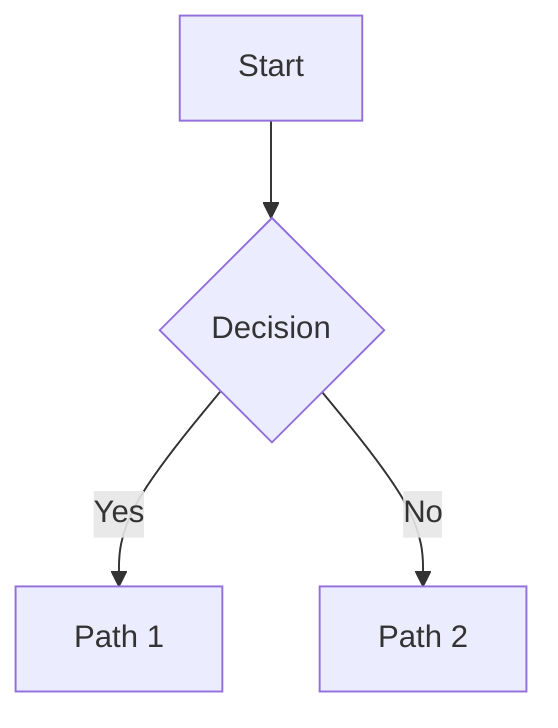

# Chart Skill

Generate Mermaid diagrams. For most requests you **delegate to the charter** child agent, which returns validated, render-ready Mermaid. For **simple** diagrams, you may generate the Mermaid yourself.

Use this skill whenever the artifact is **structural** rather than purely textual: architecture, process flows, state machines, data models, timelines. If you can express it cleanly as a short paragraph, you don't need a diagram.

## Self-generate vs. Delegate

| Situation | Action |
|---|---|
| Simple flowchart / linear pipeline / tiny sequence (≤ 8 nodes, standard shape, high confidence) | Generate yourself |
| Large, nested, many edges, subgraphs | Delegate to charter |
| ER / state / class / Gantt with non-trivial structure | Delegate to charter |
| User says your self-generated chart is broken/wrong | Delegate to charter |
| You're unsure the Mermaid syntax is valid | Delegate to charter |

**Self-generate** only when the diagram is clearly simple and you're confident the syntax is valid. **When in doubt, delegate** — charter validates its output, which costs less than a broken diagram.

**Never iterate on a broken self-generated diagram.** If a chart you wrote doesn't render, don't patch it by hand — delegate to charter.

## How to Delegate to Charter

```python
spawn_instance(agent_id="charter", instance_name="diagram-architecture")

send_message(
    instance_id="<charter_instance_id>",
    message=(
        "Create a flowchart showing the authentication request flow. "
        "Include: User, Auth Service, Token Store, Protected Resource, "
        "and the decision branches for valid/invalid tokens. "
        "Use flowchart TD."
    ),
)
```

A good request specifies:

- **What** the diagram represents (flowchart, sequence, ER, etc.)
- **Which nodes / actors / entities** appear
- **Which relationships / edges / messages** connect them
- **Context** if it's about a specific codebase or file (naming modules/files upfront saves a round-trip)

Charter returns a single ```mermaid block, already validated. Paste it directly into your response — don't re-wrap, re-tag, or strip the fence. If charter returns a validation warning, decide whether it's good enough, or simplify the request and ask it to regenerate. Charter may also include a 1-2 sentence explanation; treat that as part of the deliverable.

## Best Practices

- **Be specific.** "Create a flowchart" is too vague; "Create a flowchart TD showing API → Auth Middleware → Handler → DB, with branches for cache hit/miss" is right.
- **One diagram per request.** Each visual artifact is a separate spawn.
- **To modify a charter diagram,** send a follow-up to the same charter instance rather than hand-editing — it keeps context and re-validates.
- **Read the diagram, not just the syntax check.** Valid syntax doesn't mean the diagram is correct; verify nodes and edges reflect your intent.

## Output Format

````markdown

````

Renders in the ensemble chat UI, GitHub Markdown previews, and any Mermaid-compatible renderer.

## Related

- **Charter agent**: `agents/charter/soul.md`
- **Charter workflow**: `agents/charter/workflow.md`
- **Charter rules**: `agents/charter/rule.md`
