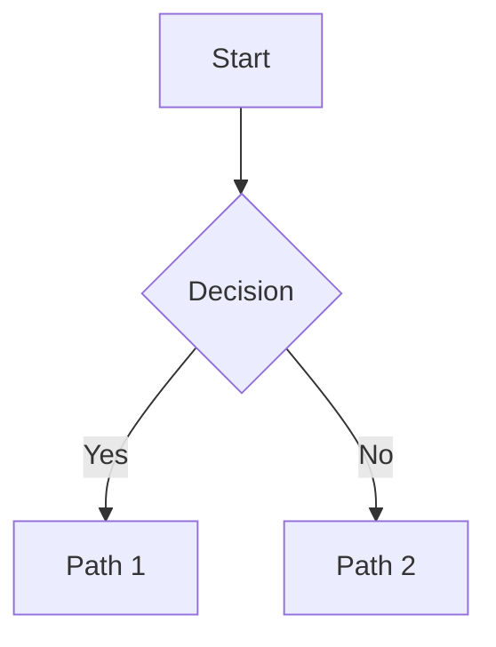

# Chart Skill

Generate Mermaid diagrams. For non-trivial diagrams, call `generate_chart()` — it **continues your charter specialist** internally and returns validated, render-ready Mermaid. For **simple** diagrams, you may generate the Mermaid yourself.

Use this skill whenever the artifact is **structural** rather than purely textual: architecture, process flows, state machines, data models, timelines. If you can express it cleanly as a short paragraph, you don't need a diagram.

## Self-generate vs. Delegate

| Situation | Action |
|---|---|
| Simple flowchart / linear pipeline / tiny sequence (≤ 8 nodes, standard shape, high confidence) | Generate yourself |
| Large, nested, many edges, subgraphs | Use `generate_chart()` |
| ER / state / class / Gantt with non-trivial structure | Use `generate_chart()` |
| User says your self-generated chart is broken/wrong | Use `generate_chart()` |
| You're unsure the Mermaid syntax is valid | Use `generate_chart()` |

**Self-generate** only when the diagram is clearly simple and you're confident the syntax is valid. **When in doubt, delegate** — `generate_chart()` validates its output, which costs less than a broken diagram.

**Never iterate on a broken self-generated diagram.** If a chart you wrote doesn't render, don't patch it by hand — call `generate_chart()` instead.

## How to use `generate_chart()`

```python
# Simple sequence diagram
generate_chart(
    description="User authentication flow: login → token validation → dashboard access",
    diagram_type="sequence"
)

# Flowchart with branches
generate_chart(
    description=(
        "API request flow: Client → API → Auth Middleware → Handler → DB. "
        "Branches: cache hit returns 200, cache miss queries DB then returns 200, "
        "auth failure returns 401. Use flowchart TD."
    ),
    diagram_type="flowchart",
)
```

### Signature

| Parameter | Type | Required | Description |
|---|---|---|---|
| `description` | str | yes | What the diagram should show — kind, nodes/actors, relationships, context |
| `diagram_type` | str | no (default `"flowchart"`) | One of `"flowchart"`, `"sequence"`, `"class"`, `"er"`, `"state"`, `"gantt"` |
| `project_id` | str | no | Optional project context for the call |
| `fresh` | bool | no (default `false`) | Pass `true` to spawn a brand-new charter instead of continuing your existing one |

A good `description` specifies:

- **What** the diagram represents (flowchart, sequence, ER, etc.)
- **Which nodes / actors / entities** appear
- **Which relationships / edges / messages** connect them
- **Context** if it's about a specific codebase or file (naming modules/files upfront saves a round-trip)

`generate_chart()` returns a single ```mermaid block, already validated. Paste it directly into your response — don't re-wrap, re-tag, or strip the fence. If a validation warning is returned, decide whether it's good enough, or simplify the description and call `generate_chart()` again. The result may include a 1–2 sentence explanation; treat that as part of the deliverable.

## Best Practices

- **Be specific.** "Create a flowchart" is too vague; "Create a flowchart TD showing API → Auth Middleware → Handler → DB, with branches for cache hit/miss" is right.
- **One diagram per call (sequential by default).** Awaited successive `generate_chart()` calls run one at a time on the same charter — their histories share the charter's context, so a follow-up call sees the prior diagram. Truly concurrent in-flight calls are REJECTED with `"Error: Charter busy; pass fresh=True for parallel charts."` — await each `generate_chart()` result before issuing the next, and pass `fresh=True` when you need parallel charts or a fully isolated history.
- **Refine, don't hand-edit.** To modify a diagram, call `generate_chart()` again with a refined description rather than patching the previous output by hand. Successive `generate_chart()` calls continue the SAME charter (it remembers your prior diagram from its conversation history), so refinement needs no re-pasting of the old chart; pass `fresh=True` for a clean slate when the new diagram must not inherit prior context.
- **Read the diagram, not just the syntax check.** Valid syntax doesn't mean the diagram is correct; verify nodes and edges reflect your intent.

## Wedged-Charter Recovery

If `generate_chart` returns `"Error: Charter busy; pass fresh=True for parallel charts."` repeatedly (persistent `busy-reject` in the logs), a previous charter turn is likely hung. Recovery ladder:

1. **Caller escape hatch (`fresh=True`).** Pass `fresh=True` on the next call. The new charter wins discovery deterministically (latest `last_activity_at`), so all subsequent reuse lands on it.
2. **Operator clears the hung orphan.** Manual `terminate_instance` via the daemon API stops the wasted turn. **Termination does NOT retire the old charter from discovery** — TERMINATED revives are free (`daemon/services/instance_messaging.py:1944-1953`), so a hung, terminated charter would resume on the next reuse. Retirement comes from the `fresh=True` spawn in step 1, not from the termination.
3. **Daemon restart.** A daemon restart clears the in-memory busy/counter locks.

A paused charter surfaces a distinct error: `"Error: Charter is paused; resume it or pass fresh=True for a new charter."` (exact string — the source of truth for the busy/paused error pins).

There is deliberately NO charter-terminate tool surface (blast radius too high for a rare event).

**Compaction-fidelity guard:** if context compaction is observed mid-refine-loop, switch to `fresh=True` — refinement through a compacted charter risks losing the prior diagram from the charter's working context (residual risk R2).

## Output Format

````markdown

````

Renders in the ensemble chat UI, GitHub Markdown previews, and any Mermaid-compatible renderer.

## Related

- **Charter agent** (specialist behind `generate_chart()`): See charter's My Expertise
