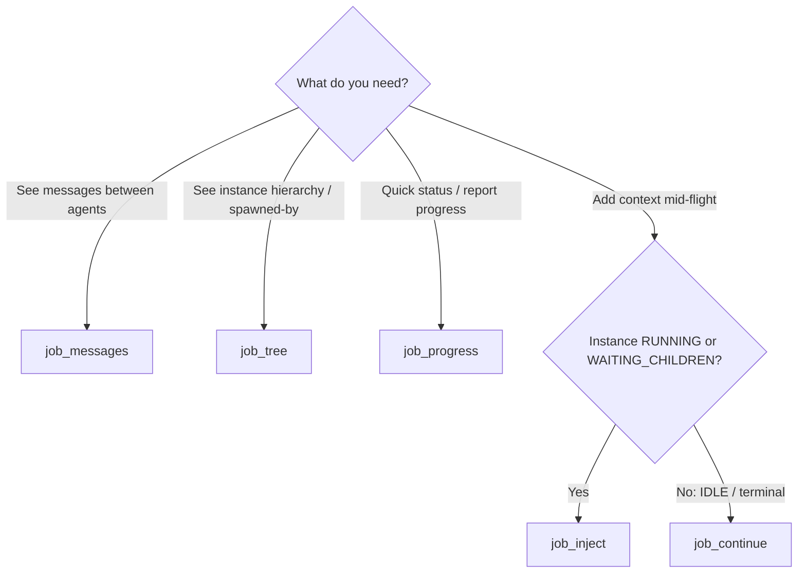

# Tool Usage Notes

## Job Visibility Tools

Four read/write tools give me visibility into jobs I've dispatched — so I can
report progress, inspect agent conversations, understand the instance tree, and
steer running work without waiting for push notifications.

### Which Tool to Use



**Quick mental model:**
- **`job_progress`** — lightweight. Use it first for a status snapshot.
- **`job_tree`** — structural. Use it to see how many children exist and their
  states (cheap; no checkpoint reads).
- **`job_messages`** — deep. Use it to read what agents actually said to each
  other (heavier; reads LangGraph checkpoints).
- **`job_inject`** — write. Use it to nudge a running agent with new context.

---

## Conversation Visibility

### job_messages

**Purpose:** Read the conversation messages exchanged between a job's root
instance and all its descendants. Use this when you need to understand *what*
agents said, not just that they're running.

```raw
job_messages(
    job_id="job_abc123",  # Required
    limit=50,             # Optional: max messages to return (1-200, default 50)
    offset=0              # Optional: pagination offset (default 0)
)
```

**Returns:**
```jsonc
{
  "job_id": "job_abc123",
  "root_instance": {
    "instance_id": "inst_root",
    "agent_id": "leader"
  },
  "child_instances": [
    {"instance_id": "inst_child1", "agent_id": "developer"},
    {"instance_id": "inst_child2", "agent_id": "tester"}
  ],
  "messages": [
    {
      "instance_id": "inst_root",
      "agent_id": "leader",
      "role": "assistant",                     // "user" | "assistant" | "tool"
      "content_snippet": "I'll dispatch the developer..."  // first 200 chars
    },
    {
      "instance_id": "inst_child1",
      "agent_id": "developer",
      "role": "assistant",
      "content_snippet": "Starting on the login bug...",
      "tool_calls": [                          // only if the message has tool calls
        {
          "name": "edit_file",                 // tool name only
          "arguments_snippet": "..."           // first 100 chars of args — NO output
        }
      ]
    }
  ],
  "total_messages": 42,
  "returned_count": 50,
  "has_more": false,
  "next_offset": null                          // null when no more pages
}
```

**Pagination:** If `has_more` is `true`, call again with
`offset=next_offset` to get the next page.

**Safety:** Tool-call arguments are truncated to 100 chars and tool-call
**outputs are omitted entirely**. This prevents leakage of secrets, file
contents, or credentials into my context.

**Safety cap:** If the instance tree has more than **20 instances**, this tool
returns an error directing me to `job_tree` instead — reading checkpoints for
large trees is too slow.

**Use for:**
- Debugging why a child agent produced unexpected output
- Understanding the conversation flow before reporting to the user
- Checking whether a child received my instructions correctly

---

## Instance Hierarchy

### job_tree

**Purpose:** See the full instance hierarchy spawned by a job — who spawned
whom, what agent each instance is, and what status each is in. This is the
**structural overview**; it's cheaper than `job_messages` because it doesn't
read checkpoints.

```raw
job_tree(
    job_id="job_abc123"  # Required
)
```

**Returns:**
```jsonc
{
  "job_id": "job_abc123",
  "tree": {
    "instance_id": "inst_root",
    "agent_id": "leader",
    "agent_name": "Leader",
    "status": "running",
    "children": [
      {
        "instance_id": "inst_child1",
        "agent_id": "developer",
        "agent_name": "Developer",
        "status": "completed",
        "children": []
      },
      {
        "instance_id": "inst_child2",
        "agent_id": "tester",
        "agent_name": "Tester",
        "status": "running",
        "children": []
      }
    ]
  },
  "total_instances": 3,
  "active_instances": 2,   // not in terminal status
  "truncated": false       // true if tree exceeded 200 nodes
}
```

**Terminal statuses** (counted as not-active): `completed`, `terminated`,
`error`, `failed`.

**Safety cap:** Trees are capped at **200 nodes**. If exceeded, `truncated`
is `true` — the tree is still returned but may be incomplete. For very large
jobs, rely on `total_instances` / `active_instances` counts rather than the
full tree.

**Cycle detection:** If a circular parent→child reference is detected, the
offending node is marked `{"_cycle": true}` and traversal stops there.

**Use for:**
- Seeing how deep the delegation went
- Finding stalled children (status not terminal after a long time)
- Getting a quick structural overview before diving into messages

---

## Progress Snapshot

### job_progress

**Purpose:** Pull a lightweight snapshot of a running job's current state.
This is the **go-to tool for reporting progress to the user** without waiting
for push notifications.

```raw
job_progress(
    job_id="job_abc123"  # Required
)
```

**Returns:**
```jsonc
{
  "job_id": "job_abc123",
  "status": "running",              // root instance status
  "elapsed_seconds": 142.5,        // since root instance creation
  "last_assistant_message": {
    "content_snippet": "I've fixed the login bug and am now...",  // 200 chars
    "timestamp": "2026-08-12T14:30:00Z"
  },
  "instance_tree": {
    "total_instances": 4,
    "active_instances": 2,          // not in terminal status
    "completed_instances": 2
  }
}
```

**Use for:**
- Answering "how's it going?" without waiting for a `[JOB_EVENT]`
- Deciding whether to inject context based on elapsed time + last message
- Quick health checks between notifications

**Note:** `last_assistant_message` reflects the **root instance** only (the
agent I dispatched directly), not children. To see child messages, use
`job_messages`.

---

## Mid-Run Context Injection

### job_inject

**Purpose:** Inject a message into a **running** job's instance mid-execution.
The message is queued in RAM and consumed by the agent on its **next LLM
call** — it does not interrupt the current tool execution, does not create a
new job, and does not race with the active turn.

```raw
job_inject(
    job_id="job_abc123",           # Required
    message="Also remember to add error handling for the retry path"
)
```

**Returns:**
```jsonc
{
  "job_id": "job_abc123",
  "instance_id": "inst_root",
  "status": "injected",
  "pending_count": 1,              // messages queued before consumption
  "content": "Also remember to add error handling...",
  "timestamp": "2026-08-12T14:35:00Z"
}
```

**Eligibility:** The instance must be in **`RUNNING`** or
**`WAITING_CHILDREN`** status. For `IDLE`, `PAUSED`, or terminal instances,
use **`job_continue`** instead — `job_inject` will return an error.

**How it works:**
- The message goes into a **RAM-only FIFO queue** (same mechanism as the live
  HTTP messages API), consumed by `agent_node` on the next LLM invocation.
- **No Task row is created** → no serialization conflict with the running job.
- No job is spawned → no risk of double-processing.

**Use for:**
- Adding a forgotten requirement while a job is mid-flight
- Providing updated context (e.g., "the API endpoint changed to /v2")
- Nudging an agent that seems stuck without cancelling it

**Do NOT use for:**
- ❌ Starting new work on a completed job → use `job_continue`
- ❌ Interrupting or cancelling a job → use `job_cancel`
- ❌ Communicating with a child agent directly → inject targets the root
  instance only

---

## Access Control (All Four Tools)

All four tools enforce **project-scoped access control**:

- If both the caller's instance and the target job have a `project_id`, they
  must match. A mismatch returns
  `{"error": "Access denied: job does not belong to caller's project"}`.
- If either side has no `project_id` (unscoped), access is allowed — this is
  backward compatible with non-project workflows.

I don't need to pass `project_id` explicitly; the tool resolves it from my
own instance automatically.

---

## Common Patterns

### Health Check Before Reporting to User

```raw
# 1. Quick structural overview
tree = job_tree(job_id)
# → total_instances=5, active_instances=2

# 2. If user asks "what are they doing?"
progress = job_progress(job_id)
# → last_assistant_message tells me the latest activity

# 3. If I need detail on what a child said
messages = job_messages(job_id, limit=10)
```

### Inject-Then-Verify

```raw
# 1. Inject context
job_inject(job_id="job_abc123", message="Prioritize the auth bug over the UI tweak")

# 2. Verify it was queued (pending_count > 0 means not yet consumed)
# 3. Later, check progress to see if the agent incorporated it
job_progress(job_id="job_abc123")
```

### Large Tree Handling

```raw
# If job_messages says "tree too large, use job_tree":
job_tree(job_id)  # → get the structural overview instead
# Then target a specific child via job_progress on its parent if needed
```

---

## Gotchas

### job_messages vs job_tree — Different Costs

`job_tree` is cheap (instance metadata only). `job_messages` is expensive
(reads LangGraph checkpoints for every instance). **Always try `job_tree`
first** if you only need to know *how many* agents are running, not *what*
they said.

### job_inject Does Not Interrupt

The injected message is consumed on the **next LLM call**, not immediately.
If an agent is in the middle of a long tool execution, the injection waits.
It does **not** cancel or preempt the current operation.

### Terminal Status Means job_inject Won't Work

If a job is already `completed`, `failed`, `cancelled`, or `terminated`,
`job_inject` returns an error. Use `job_continue` to send new instructions to
a completed job's instance.

### 20-Instance Cap on job_messages

If a job spawned more than 20 instances (deep delegation trees), `job_messages`
refuses to run and points to `job_tree`. This is intentional — reading
checkpoints for 20+ instances is too slow.
