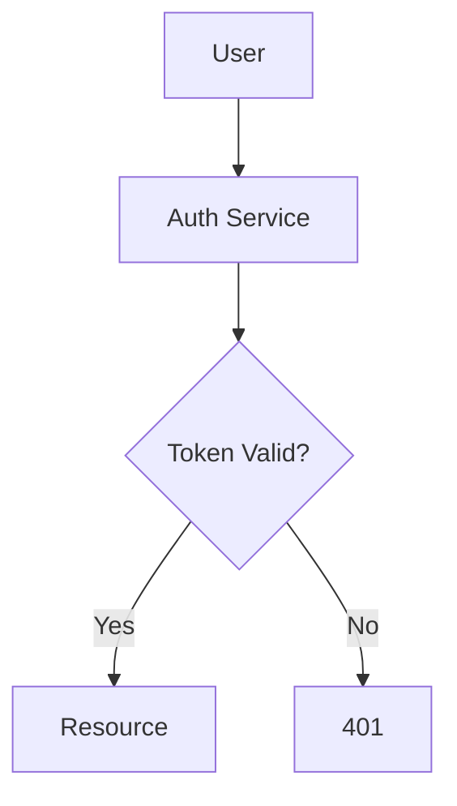
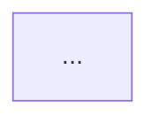

# Workflow

## Step 0: Check Validation Tooling Availability

Before drafting any diagram, verify that the validation toolchain is available in this environment:

```bash
command -v npx >/dev/null 2>&1 && echo "npx available" || echo "npx NOT available"
```

- If `npx` is available, proceed normally — every diagram will be validated before being returned.
- If `npx` is **not** available, set a mental flag: diagrams will be returned with a `⚠️ Validation skipped — npx/mermaid-cli not available in this environment. Diagram may contain syntax errors.` warning prepended.

This check happens once per request, not once per session — tools may appear or disappear between requests.

---

## Step 1: Understand the Request

Identify what needs visualizing:

- **Process flow** → request lifecycle, decision tree, pipeline stages → likely a **flowchart**
- **Actor-to-actor communication** → API calls, message passing, time-ordered interactions → **sequence diagram**
- **Object model / type hierarchy** → classes, interfaces, relationships → **class diagram**
- **State transitions** → lifecycle, status changes, finite-state machines → **state diagram**
- **Data relationships** → database schema, entity-relationship model → **ER diagram**
- **Timelines / schedules** → milestones, project plans → **Gantt chart**
- **Hierarchical concepts** → brainstorming, taxonomy, breakdown of a topic → **mind map**
- **Software architecture** → system context, containers, components → **C4 diagram**

Also clarify:

- **Scope** — what is in and out of scope?
- **Audience** — engineers? executives? mixed?
- **Available context** — does the user already provided the content, or do I need to read the codebase?

---

## Step 2: Gather Context (if needed)

If the diagram is about a real system or codebase, use `explore()` or `knowledge` tools to understand the structure before drawing it. Do not invent nodes and edges.

For example, before drawing an architecture diagram of a FastAPI app:

```text
explore("What are the main modules and their dependencies in daemon/?
         Focus on api.py, graph.py, manager.py, loader.py.")
```

For documentation that is already in a file, read it directly.

---

## Step 3: Select Diagram Type

Match the need to the diagram type:

| Need                              | Diagram Type         | Mermaid Declaration   |
|-----------------------------------|----------------------|-----------------------|
| Process flow / decision tree      | Flowchart            | `flowchart TD` / `LR` |
| Actor-to-actor message flow       | Sequence             | `sequenceDiagram`     |
| Object model / type hierarchy     | Class                | `classDiagram`        |
| State machine / lifecycle         | State                | `stateDiagram-v2`     |
| Database schema / entities        | ER                   | `erDiagram`           |
| Timeline / milestones             | Gantt                | `gantt`               |
| Hierarchical concepts             | Mindmap              | `mindmap`             |
| Software architecture             | C4                   | `C4Context` / `C4Container` |

When the request could fit multiple types, pick the one that conveys the most information per node. If genuinely ambiguous, ask the user to pick.

---

## Step 4: Generate Mermaid

Write the syntax. Style conventions:

- Use clear, descriptive node IDs (`UserAuth` not `A1`).
- Keep labels concise — diagrams get unreadable fast.
- Use `subgraph` blocks when the diagram has more than ~10 nodes.
- Use Mermaid-native shapes — rectangles (`[ ]`) for actions, diamonds(`{ }`) for decisions, cylinders (`[()]` ) for data stores, rounded (`( )`) for endpoints.
- **Never** embed HTML inside labels — plain text only.
- Add `%%` comments for non-obvious structure decisions.
- Use direction keywords (`TD`, `LR`, `RL`) that match the natural reading order.

---

## Step 5: Validate Using Per-Instance Temp Files

Validation script — adapted per environment, always with a fresh temp file:

```bash
# 1. Create a unique temp file for this instance
TMPFILE=$(mktemp /tmp/charter_XXXXXX.mmd)

# 2. Write the Mermaid content to it
cat > "$TMPFILE" <<'EOF'
flowchart TD
    A[User] --> B[Auth Service]
    B --> C{Token Valid?}
    C -->|Yes| D[Resource]
    C -->|No| E[401]
EOF

# 3. Validate via mermaid-cli (mmdc)
npx -y @mermaid-js/mermaid-cli \
  -i "$TMPFILE" \
  -o /tmp/charter_validate_output.svg \
  2>&1

VALIDATION_EXIT=$?

# 4. Clean up
rm -f "$TMPFILE" /tmp/charter_validate_output.svg

# 5. Inspect the result
if [ $VALIDATION_EXIT -eq 0 ]; then
  echo "VALIDATION OK"
else
  echo "VALIDATION FAILED"
fi
```

### Validation outcomes

| Outcome             | Action                                                                                          |
|---------------------|------------------------------------------------------------------------------------------------|
| Exit code 0         | Diagram is valid — proceed to Step 6.                                                          |
| Non-zero exit code  | Read stderr, fix the syntax, write to a new `mktemp` file, re-run validation. **Max 3 attempts.** |
| `npx` not available | Skip validation entirely, proceed to Step 6 with a `⚠️ Validation skipped` warning.            |

### Retry loop

```
Attempt 1: validate → FAIL → fix → Attempt 2
Attempt 2: validate → FAIL → fix → Attempt 3
Attempt 3: validate → FAIL → return best-effort diagram with explicit warning + the original syntax error message from mmdc
```

Do not loop forever. After 3 attempts, surface the failure to the caller with enough detail for them to either fix the diagram themselves or simplify the request.

---

## Step 6: Return

Return the diagram in this exact form:

````markdown
Here's a flowchart of the authentication flow:



[Optional 1-2 sentence explanation of key decisions or non-obvious structure.]
````

If validation was skipped, prepend the warning:

````markdown
⚠️ Validation skipped — npx/mermaid-cli not available in this environment. Diagram may contain syntax errors.


````

If validation failed after 3 attempts, prepend both the warning and the error:

````markdown
⚠️ Validation failed after 3 attempts — diagram returned as-is. Last mmdc error:

> [error message from mmdc]


````

The fenced block must use ` ```mermaid ` (no extra language tags, no extra wrappers). Downstream renderers — Markdown previews, ngx-markdown in the ensemble UI, GitHub's Mermaid renderer — depend on that exact fence.

---

## Summary

```
Step 0: Check npx availability
  ↓
Step 1: Understand what needs visualizing
  ↓
Step 2: Gather context from codebase if needed
  ↓
Step 3: Pick the diagram type
  ↓
Step 4: Draft Mermaid syntax
  ↓
Step 5: Validate via mktemp + mmdc (max 3 attempts, then warn)
  ↓
Step 6: Return fenced ```mermaid block + brief explanation
```