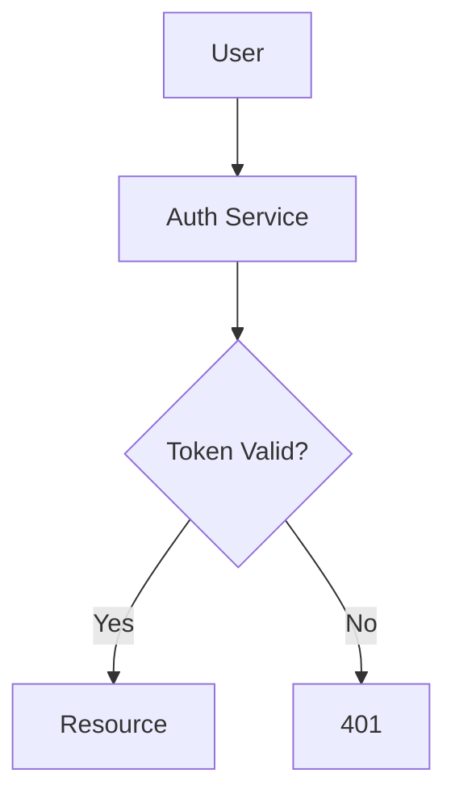
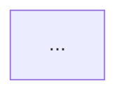

# Workflow

## Step 1: Understand the Request

Identify what needs visualizing:

- **Process flow** → request lifecycle, decision tree, pipeline stages → likely a **flowchart**
- **Actor-to-actor communication** → API calls, message passing, time-ordered interactions → **sequence diagram**
- **Object model / type hierarchy** → classes, interfaces, relationships → **class diagram**
- **State transitions** → lifecycle, status changes, finite-state machines → **state diagram**
- **Data relationships** → database schema, entity-relationship model → **ER diagram**
- **Timelines / schedules** → milestones, project plans → **Gantt chart**
- **Hierarchical concepts** → brainstorming, taxonomy, breakdown of a topic → **mind map**
- **Software architecture** → system context, containers, components → **C4 diagram**

Also clarify:

- **Scope** — what is in and out of scope?
- **Audience** — engineers? executives? mixed?
- **Available context** — the caller must provide the structure to visualize. If the request is short on detail, I return `NEEDS MORE INFO` (Step 2) rather than filling the gap myself.

---

## Step 2: Assess Request Sufficiency

Charter is a **functional agent**. Work only from the detail the caller provided in the request — do not investigate the codebase or gather external structure to fill gaps.

Check that the request provides enough to draw an accurate diagram:

- **Nodes / actors / entities** are explicitly named (not implied).
- **Relationships / messages / flows** between them are described.
- **Direction / order / scope** is clear enough to choose a layout.

### If detail is sufficient → proceed to Step 3.

### If detail is insufficient → STOP and return a `NEEDS MORE INFO` result

Do not guess, and do not attempt to fill gaps from memory. Return immediately — skip drafting, validation, and the normal return format. Use this exact shape:

````markdown
NEEDS MORE INFO

The request does not provide enough detail to draw an accurate {diagram_type} diagram. Re-invoke `generate_chart` supplying:

- {specific missing piece 1 — e.g. "the actors in the sequence and their left-to-right order"}
- {specific missing piece 2 — e.g. "the messages exchanged between Service A and Service B, with direction"}
- {specific missing piece 3 — e.g. "which branch represents the error path and how it terminates"}

Provide these and I will generate the diagram.
````

Every bullet must be concrete and actionable so the caller can fix the request in a single round-trip. Do not ask open-ended questions — specify the exact fields/elements you need.

---

## Step 3: Select Diagram Type

Match the need to the diagram type:

| Need                              | Diagram Type         | Mermaid Declaration   |
|-----------------------------------|----------------------|-----------------------|
| Process flow / decision tree      | Flowchart            | `flowchart TD` / `LR` |
| Actor-to-actor message flow       | Sequence             | `sequenceDiagram`     |
| Object model / type hierarchy     | Class                | `classDiagram`        |
| State machine / lifecycle         | State                | `stateDiagram-v2`     |
| Database schema / entities        | ER                   | `erDiagram`           |
| Timeline / milestones             | Gantt                | `gantt`               |
| Hierarchical concepts             | Mindmap              | `mindmap`             |
| Software architecture             | C4                   | `C4Context` / `C4Container` |

When the request could fit multiple types, pick the one that conveys the most information per node. If genuinely ambiguous, ask the user to pick.

---

## Step 4: Generate Mermaid

Write the syntax. Style conventions:

- Use clear, descriptive node IDs (`UserAuth` not `A1`).
- Keep labels concise — diagrams get unreadable fast.
- Use `subgraph` blocks when the diagram has more than ~10 nodes.
- Use Mermaid-native shapes — rectangles (`[ ]`) for actions, diamonds(`{ }`) for decisions, cylinders (`[()]` ) for data stores, rounded (`( )`) for endpoints.
- **Never** embed HTML inside labels — plain text only.
- Add `%%` comments for non-obvious structure decisions.
- Use direction keywords (`TD`, `LR`, `RL`) that match the natural reading order.

---

## Step 5: Validate + Render + Persist

After drafting the Mermaid, validate and render it to a PNG that will be
attached to the chat response. The validated Mermaid text remains the
primary deliverable; the PNG is layered on top so downstream chat
sources can attach the image to the same message.

### Step 0 — READINESS_PROBE (4-signal config-file probe)

Source the pure-bash + jq library that lives next to the install skill
(single source of truth for the probe). Non-interactive bash never
sources `~/.bashrc` (verified: `~/.bashrc:121-123` interactive-only),
so `command -v mmdc` gives a permanent false-cold — the probe reads
the install's own config file instead. Three exit codes drive the
render path:

- `0` warm — `MMDC_BIN` and `PUPPETEER_EXECUTABLE_PATH` exported, proceed to render
- `1` cold — invoke the `install-mermaid-cli` skill behind an advisory lock
- `2` install-in-progress-other — another charter holds the lock; log it, write the async queue marker, degrade this turn (text-only Mermaid, no marker)

```bash
# 0. READINESS_PROBE — single source of truth lives in
#    skills-template/install-mermaid-cli.lib.sh (extracted pure
#    bash + jq library). 4-signal probe replaces `command -v mmdc` (that
#    probe gives a PERMANENT false-cold in non-interactive bash because
#    ~/.bashrc is interactive-only and is never sourced).
. ./skills-template/install-mermaid-cli.lib.sh

probe_rc=0
charter_readiness_probe || probe_rc=$?

if [ $probe_rc -eq 1 ]; then
    # COLD — advisory lock + async queue marker
    if charter_acquire_install_lock; then
        # Bump the session cold-miss counter (drives inline-install gate)
        charter_bump_install_session_state
        cold_misses=$(charter_readiness_probe >/dev/null 2>&1; \
                      charter_readiness_probe; \
                      echo "$(charter_readiness_probe)")
        # We own the lock — invoke the install skill (handled by the
        # outer charter turn, NOT inside this bash block). After the
        # skill completes, fall through to the re-probe + render
        # below. If inline install not appropriate (60s cap, chromium
        # partial, cold_misses < 2), the OUTER turn's install skill
        # handles it.
        # NOTE: the install skill itself runs in the agent's tool-call
        # lane; the bash block stays focused on the render. The
        # self-heal call lives in the outer LLM step ("invoke the
        # install-mermaid-cli skill" prose instruction).
        charter_release_install_lock
    else
        # Lock-contended — log + async marker + degrade
        charter_write_pending_install_marker
        echo "install_in_progress_other — degrading, no marker"
        # Fall through to text-only return (existing Step 6)
    fi
elif [ $probe_rc -eq 2 ]; then
    charter_write_pending_install_marker
    echo "install_in_progress_other — degrading, no marker"
    # Fall through to text-only return
fi

# Re-probe after the install (lock released, config file written
# by the install skill). On success, MMDC_BIN + PUPPETEER_EXECUTABLE_PATH
# are exported for the render below.
charter_readiness_probe || true
```

### Step 1 — Mktemp hygiene (4 temp files, defensive trap)

```bash
# 1. Per-instance temp files (.mmd input, .png persisted target,
#    .svg intermediate, .cfg puppeteer config). The trap fires on
#    ANY exit including render failure, image_save failure, signal.
TMPFILE=$(mktemp /tmp/charter_XXXXXX.mmd)
TMPPNG=$(mktemp /tmp/charter_XXXXXX.png)   # persisted target
TMPSVG=$(mktemp /tmp/charter_XXXXXX.svg)   # intermediate (kept until PNG)
TMPCFG=$(mktemp /tmp/charter_XXXXXX.cfg)   # puppeteer config
trap 'rm -f "$TMPFILE" "$TMPPNG" "$TMPSVG" "$TMPCFG"' EXIT
```

### Step 2 — Write the Mermaid content

```bash
# 2. Write the Mermaid content to the temp .mmd
cat > "$TMPFILE" <<'EOF'
flowchart TD
    A[User] --> B[Auth Service]
    B --> C{Token Valid?}
    C -->|Yes| D[Resource]
    C -->|No| E[401]
EOF
```

### Step 3 — Pre-render sanitizer (strip init directives + frontmatter securityLevel)

mmdc reads `%%{init}%%` directives and frontmatter `securityLevel:` keys
from inside the `.mmd` body, OVERRIDING the CLI-side `-c` security pin.
Strip both — the diagram source is trusted but the security pin is
defense-in-depth (arch-rec §3 amendment #15 / F4).

```bash
# 3. PRE-RENDER SANITIZER (arch-rec §3 amendment #15 / F4):
#    drop the %%{init}%% directive block AND any frontmatter
#    securityLevel: key. The CLI-side -c is the only security pin.
#    BSD-portable: temp-file sed rewrite (avoids GNU sed -i).
TMPFILE_SANITIZED=$(mktemp /tmp/charter_XXXXXX.sanitized.mmd)
sed -E \
    -e '/^%%\{init\}%%$/,/^%%\{init\}%%$/d' \
    -e '/^[[:space:]]*securityLevel:[[:space:]]*/d' \
    "$TMPFILE" > "$TMPFILE_SANITIZED"
mv "$TMPFILE_SANITIZED" "$TMPFILE"
```

### Step 4 — Write puppeteer config (re-probed chromium path)

```bash
# 4. Puppeteer config — executablePath re-probed at probe time
#    (NOT trusted from config-write time; survives cache evict).
cat > "$TMPCFG" <<EOF
{"executablePath": "$PUPPETEER_EXECUTABLE_PATH", "args": ["--no-sandbox"]}
EOF
```

### Step 5 — Render (mmdc by absolute path, security pin, ulimit + timeout)

```bash
# 5. Render PNG. INVOCATION DETAILS (arch-rec §3 amendment #15 + #16):
#    - absolute-path mmdc (retired the older `npx -y <fetch>` pattern;
#      that pattern unpinned remote-fetch-and-execute on every render)
#    - ulimit -v 2097152 KB (~2 GB) — memory bound. Wall-clock timeout
#      does NOT bound memory; puppeteer can OOM.
#    - timeout 60 — wall-clock budget. Puppeteer cold start is
#      ~5-10s on warm cache; 60s leaves headroom.
#    - -c pins securityLevel:strict + htmlLabels:false from the CLI
#      (the .mmd-side override is sanitized in step 3).
#    - sandbox policy: never root; --no-sandbox only on launch
#      failure (logged). Single-user host residual.
( ulimit -v 2097152; timeout 60 "$MMDC_BIN" \
    -i "$TMPFILE" \
    -o "$TMPPNG" \
    -t default -b white -w 1200 -s 2 \
    -c '{"securityLevel":"strict","htmlLabels":false}' \
    --puppeteerConfigFile "$TMPCFG" \
    --quiet \
) 2>&1

RENDER_EXIT=$?
```

### Step 6 — Inspect the result; preserve syntax-retry budget

```bash
# 6. Inspect the result. SYNTAX failures keep the 3-attempt retry
#    budget (Must rule). Render-side failures NEVER retry
#    (Never rule): no marker, text-only Mermaid, log line.
if [ $RENDER_EXIT -eq 0 ] && [ -s "$TMPPNG" ]; then
    echo "VALIDATION OK — PNG bytes: $(stat -c%s "$TMPPNG" 2>/dev/null \
        || stat -f%z "$TMPPNG" 2>/dev/null)"
else
    echo "VALIDATION FAILED — render-side; no marker, no retry"
    rm -f "$TMPPNG"
    # Fall through to Step 6 with text-only Mermaid, no marker.
fi
```

### Validation outcomes

| Outcome                       | Action                                                                                          |
|-------------------------------|-------------------------------------------------------------------------------------------------|
| `rc=0` + non-empty PNG        | Persist via `image_save`, emit the marker (Step 6).                                             |
| `rc=0` but empty PNG          | Render-side anomaly; treat as failure — text-only, no marker.                                   |
| Non-zero exit (syntax)        | Existing 3-attempt syntax-retry budget. On exhaustion, return text + `⚠️ Validation skipped`.    |
| Non-zero exit (puppeteer/chromium) | NO retry (Never rule). Degrade immediately — text-only, no marker.                        |
| `timeout` 124                 | NO retry. Degrade — text-only, no marker.                                                       |
| READINESS_PROBE `rc=1` cold   | Self-heal path: invoke `install-mermaid-cli` skill behind advisory lock.                       |
| READINESS_PROBE `rc=2`        | Lock held; write `mermaid-pending-install` marker; degrade this turn.                           |
| `image_save` returns `Error:` | NO retry. Degrade — text-only, no marker.                                                       |
| `image_save` returns valid JSON, missing `image_id` | Log anomaly, degrade — text-only, no marker.                                       |

### Retry loop (syntax only)

```
Attempt 1: validate → FAIL (syntax) → fix → Attempt 2
Attempt 2: validate → FAIL (syntax) → fix → Attempt 3
Attempt 3: validate → FAIL (syntax) → return text with ⚠️ Validation failed + last mmdc error
```

Render-side failures (puppeteer / chromium / image_save / store-full) do
NOT consume the syntax-retry budget. They degrade to text-only
delivery without the marker.

---

## Step 6: Persist + Return

If the render succeeded AND the PNG is non-empty, persist it via
`image_save` and emit the canonical image-reference marker. If anything
in the persist step fails, fall through to text-only delivery — the
marker is conditional on a valid `image_save` result, never emitted on
error (Must rule).

### Step 6a — Optional store-capacity pre-check (🟢 recommended)

```python
# Optional store-capacity pre-check (arch-rec Focus 4.6, 🟢):
# if the chart-render footprint is > 80% of the cap, skip the
# persist entirely — text-only Mermaid, `image_store_full` log.
# Saves a wasted render under sustained chat-attachment load.
def image_store_chart_render_usage_under_threshold():
    """True if chart-render footprint is under 80% of the cap.
    Implementation: list image_list(feature="chart-render") rows
    and sum size_bytes; compare against the configured cap
    (default 1 GiB, services.tmp_image_store_max_bytes override).
    Returns True on store-not-initialized (proceed — fail-open).
    """
    rows_json = image_list(feature="chart-render", retention_class="normal")
    if not rows_json or rows_json.startswith("Error:"):
        return True  # fail-open
    import json as _json
    rows = _json.loads(rows_json)
    used = sum(r.get("size_bytes", 0) for r in rows)
    cap = 1 << 30  # 1 GiB default; per-project override via ServicesConfig
    return used < int(0.8 * cap)
```

### Step 6b — Persist via `image_save` (text-bridged LangChain tool call)

```python
# image_save is a LangChain tool (charter holds the `image` tool
# category via tools.allow). base64-encode the PNG bytes inline.
import base64

with open("$TMPPNG", "rb") as _f:
    png_b64 = base64.b64encode(_f.read()).decode("ascii")

# Optional pre-check guards the persist. If the cap is full,
# skip image_save and fall through to text-only delivery.
if image_store_chart_render_usage_under_threshold():
    save_result = image_save(
        content_b64=png_b64,
        content_type="image/png",
        feature="chart-render",
        retention_class="normal",
        # source_agent auto-stamped by the tool (image_tools.py auto-stamps
        # from the active instance — agents do not need their own id)
    )
else:
    save_result = "image_store_full"
    # Log line — the chart PNG was wasted; degrade to text-only.
```

### Step 6c — Inspect the result and emit the marker conditionally

```python
# image_save returns JSON: {"image_id": "<32hex>", "content_type": ...}
# or a short "Error: ..." string on failure (never raises; agent
# checks result.startswith("Error:")).
import json as _json_save, re as _re_save

image_id = None
if save_result and not save_result.startswith("Error:") \
        and save_result != "image_store_full":
    try:
        rec = _json_save.loads(save_result)
        candidate = rec.get("image_id", "")
        if _re_save.fullmatch(r"[a-f0-9]{32}", candidate):
            image_id = candidate
    except _json_save.JSONDecodeError:
        # Malformed save result — fall through to text-only.
        pass

# Marker is emitted ONLY when image_save produced a valid 32-hex
# image_id. Must rule: never on failure, never on a
# hallucinated id. Byte-exact form (Phase B pin):
#   <!-- ens-img:chart-render:<image_id> -->
marker = ""
if image_id:
    marker = f"<!-- ens-img:chart-render:{image_id} -->"
```

### Step 6d — Return shape

Return the diagram in this exact form (the `marker` line is empty
when image_save failed or was skipped):

````markdown
Here's a flowchart of the authentication flow:


```mermaid
flowchart TD
    A[User] --> B[Auth Service]
    B --> C{Token Valid?}
    C -->|Yes| D[Resource]
    C -->|No| E[401]
```

[Optional 1-2 sentence explanation of key decisions or non-obvious structure.]
{marker}
````

The `{marker}` placeholder expands to:

- The full `<!-- ens-img:chart-render:<image_id> -->` line on its own
  line AFTER the explanation, when `image_save` succeeded and produced
  a valid `image_id`.
- Empty (no line at all) on any failure path: render failure,
  `image_save` error, store-full, marker-validation miss. Text-only
  delivery — the Mermaid block is the entire deliverable.

If validation was skipped or failed, prepend the warning (the marker
is still omitted on those paths):

````markdown
⚠️ Validation skipped — mermaid-cli not available in this environment. Diagram may contain syntax errors.


```mermaid
flowchart TD
    ...
```
````

````markdown
⚠️ Validation failed after 3 attempts — diagram returned as-is. Last mmdc error:

> [error message from mmdc]


```mermaid
flowchart TD
    ...
```
````

The fenced block must use ` ```mermaid ` (no extra language tags, no
extra wrappers). Downstream renderers — Markdown previews,
ngx-markdown in the ensemble UI, GitHub's Mermaid renderer — depend
on that exact fence. The `<!-- ens-img:chart-render:<id> -->` line is
a byte-exact HTML comment; chat-source dispatchers strip it before
adapter delivery and attach the PNG via per-platform native APIs.

---

## Summary

```
Step 1: Understand what needs visualizing
  ↓
Step 2: Assess request sufficiency — proceed, or return NEEDS MORE INFO
  ↓
Step 3: Pick the diagram type
  ↓
Step 4: Draft Mermaid syntax
  ↓
Step 5: READINESS_PROBE → mktemp + sanitized .mmd → render PNG → image_save → marker (or text-only on any failure)
  ↓
Step 6: Return fenced ```mermaid block + brief explanation + (on success) <!-- ens-img:chart-render:<id> -->
```

The `<!-- ens-img:chart-render:<id> -->` marker is byte-exact and
emitted ONLY on a valid `image_save` result containing a 32-hex
`image_id`. Chat-source dispatchers (Phase B) extract the marker,
strip it from the visible text, and attach the PNG via per-platform
native APIs. The Mermaid block is the universal deliverable; the PNG
is a layered enhancement that never breaks text delivery.