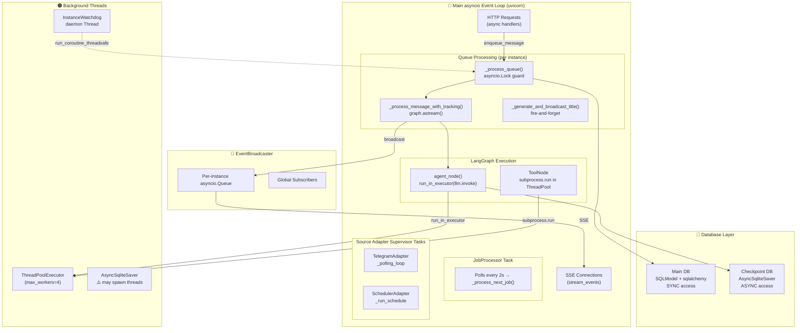

# Concurrency Architecture Analysis

> Analysis date: 2026-04-05  
> Status: Active Issues Found

---

## Overview

This document analyzes the threading/async/concurrency model of the agents-ensemble daemon, identifies patterns and problems, and proposes improvements.

---

## Architecture Diagram



---

## Component Execution Model

| Component | Thread/Loop | Execution Model | Status |
|-----------|------------|----------------|--------|
| FastAPI handlers | Main event loop | async/await | ✅ |
| SSE streaming | Main event loop | async generator | ⚠️ No heartbeat/TTL |
| LangGraph agent_node | Main loop + ThreadPool | `run_in_executor` | ✅ |
| LangGraph ToolNode | Main loop | **BLOCKS on sync tools** | ⚠️ |
| InstanceWatchdog | Daemon thread | Polling + `run_coroutine_threadsafe` | ⚠️ |
| Source adapters | Main loop (Tasks) | async/await | ✅ |
| JobProcessor | Main loop (Task) | async polling loop | ✅ |
| ResponseDispatcher | Main loop (Task) | async queue consumer | ✅ |
| EventBroadcaster | Main loop | `asyncio.Queue.put_nowait()` | ✅ |
| Sync DB operations | Main loop | Direct sync calls | ⚠️ |
| Sync DB operations (watchdog) | Daemon thread | Direct sync calls | ⚠️ |
| ThreadPoolExecutor | Worker threads | Scheduler callbacks | ⚠️ |
| AsyncSqliteSaver | Worker threads | LangGraph checkpoint persistence | ⚠️ |
| Process shutdown | Main loop + threads | No defined ordering | ⚠️ |

---

## Good Patterns ✅

### 1. Single asyncio Event Loop as Primary Orchestrator
The entire system runs on one `asyncio` event loop (uvicorn's). This avoids the complexity of multiple event loops and makes most coordination straightforward via `asyncio.create_task`, `asyncio.Queue`, `asyncio.Lock`.

### 2. Event-Driven Architecture with EventBroadcaster
The pub/sub pattern (`EventBroadcaster` → per-instance queues + global subscribers) is clean. The separation of SSE streaming concerns from business logic is well done.

### 3. Circuit Breaker Pattern
`InstanceCircuitBreaker` (queue.py:259) with closed → open → half_open state machine and `threading.Lock` is correct. Prevents cascading failures when an instance keeps crashing.

### 4. Watchdog Thread for Stuck Message Recovery
The `InstanceWatchdog` (queue.py:329) running on a daemon thread is the right pattern for a health monitor that must survive event loop stalls.

### 5. Fire-and-Forget Title Generation
`_generate_and_broadcast_title()` (manager.py:1735) is correctly dispatched as `asyncio.create_task` so it doesn't block the completed event.

### 6. Supervisor Pattern for Source Adapters
`_run_adapter_safe()` (registry.py:473) implements exponential backoff with jitter, health checking, and graceful shutdown. This is production-grade.

### 7. Cancellation Token System
The `CancellationToken` / `CancellationCallbackHandler` (manager.py:175) pattern of checking cancellation during LLM streaming callbacks is elegant - cooperative cancellation rather than forced.

### 8. Adaptive Batching for SSE Events
Content/thinking buffering with batch thresholds (manager.py:1122-1355) to reduce event rate is smart, especially under load.

### 9. Per-User Send Locking in ResponseDispatcher
`OrderedDict` with LRU eviction for send locks (dispatcher.py:110) prevents memory leaks and guarantees per-user message ordering.

### 10. LRU Eviction for Per-Chat Locks
Telegram adapter's `_chat_locks` (telegram.py:89) with `OrderedDict` and MAX_CHAT_LOCKS prevents unbounded memory growth.

---

## Bad Patterns / Issues ⚠️

### 🔴 CRITICAL Issues

#### 0. `terminate_instance` Never Awaits Async Lock Release (Resource Leak)
**Files**: `manager.py:2012`, `tools/instance.py:149`  
**Problem**: `terminate_instance()` is a **sync** method called from the sync `terminate_instance` tool. At line 2012, it calls `self._job_queue_service.release_lock_by_instance(instance_id)` — but that method is **`async`** (`job_queue_service.py:455`). The coroutine is never awaited, causing:

1. `released_projects` receives a coroutine object, not a `list[str]`
2. `if released_projects:` at line 2013 tries `bool()` on the coroutine
3. `len(released_projects)` at line 2015 raises `TypeError: object of type 'coroutine' has no len()`
4. **Project locks are never actually released** — instances hold locks indefinitely after termination

**Impact**: Critical - Active resource leak. Every terminated instance leaves its project lock dangling, blocking future jobs for that project.

**Fix**: Wrap the async call in `asyncio.run_coroutine_threadsafe()` from the sync context:
```python
if self._job_queue_service is not None:
    try:
        loop = asyncio.get_running_loop()
    except RuntimeError:
        loop = asyncio.new_event_loop()
    released_projects = loop.run_until_complete(
        self._job_queue_service.release_lock_by_instance(instance_id)
    )
    if released_projects:
        logger.info(...)
```

---

#### 2. `subprocess.run()` Blocks Event Loop in Tool Execution
**File**: `tools/bash.py:19`  
**Problem**: The bash tool uses synchronous `subprocess.run()` with up to 1800s timeout. While `agent_node` wraps LLM calls in `run_in_executor`, the `ToolNode` runs tools synchronously, which blocks the event loop. This can stall all SSE connections.

**Impact**: High - Any long-running bash command blocks the entire event loop.

**Fix**:
```python
# Replace:
result = subprocess.run(command, shell=True, capture_output=True, text=True, timeout=timeout)

# With:
proc = await asyncio.create_subprocess_exec(
    *command, stdout=asyncio.subprocess.PIPE, stderr=asyncio.subprocess.PIPE
)
stdout, stderr = await asyncio.wait_for(proc.communicate(), timeout=timeout)
```

---

#### 3. `run_coroutine_threadsafe().result(timeout=5)` Blocks Watchdog
**File**: `manager.py:383-394`  
**Problem**: The watchdog thread calls `asyncio.run_coroutine_threadsafe()` then waits with `.result(timeout=5.0)`. This turns an async operation into a synchronous blocking one. If multiple instances have retry-ready messages, the watchdog blocks **sequentially** for each instance.

**Impact**: Medium - Watchdog health checks can be delayed.

**Fix**:
```python
# Instead of calling per-instance sequentially:
for instance_id in instance_ids:
    future = asyncio.run_coroutine_threadsafe(self._process_queue(instance_id), loop)
    future.result(timeout=5.0)

# Batch into one call:
asyncio.run_coroutine_threadsafe(
    self._process_multiple_queues(instance_ids), loop
).result(timeout=30)  # Single batch timeout
```

---

### 🟡 HIGH Priority Issues

#### 4. Sync DB Access on Event Loop Thread
**Files**: `queue.py`, `manager.py`  
**Problem**: `self._queue_repository.*()` calls are synchronous SQLAlchemy operations that hit SQLite. These run directly on the asyncio event loop. Under load, disk I/O can stall the event loop for milliseconds, affecting SSE latency.

**Fix**:
```python
# Instead of:
msg = self._queue_repository.dequeue_by_instance(instance_id)

# Use:
msg = await asyncio.to_thread(self._queue_repository.dequeue_by_instance, instance_id)
```

---

#### 5. Multiple `create_task` Call Sites for `_process_queue`
**Files**: `manager.py:804, 1596, 1696`, `sources/registry.py:712`  
**Problem**: `_process_queue(instance_id)` is called from multiple places via `asyncio.create_task()`. While the `asyncio.Lock` prevents concurrent execution, every call creates a new task that immediately exits when the lock is held. This creates unnecessary task churn.

**Fix**: Use a persistent consumer per instance:
```python
_instance_consumers: dict[str, asyncio.Task] = {}

async def ensure_consumer(instance_id: str):
    if instance_id not in _instance_consumers:
        _instance_consumers[instance_id] = asyncio.create_task(
            _instance_consumer(instance_id)
        )

async def _instance_consumer(instance_id: str):
    while True:
        await _process_signal[instance_id].wait()
        _process_signal[instance_id].clear()
        await _process_queue(instance_id)
```

---

#### 6. Deprecated `asyncio.get_event_loop()` in Callback
**File**: `sources/registry.py:308`  
**Problem**: `execution_callback` calls `asyncio.get_event_loop()` to get `run_in_executor`. In Python 3.12+, `get_event_loop()` is deprecated and may raise errors when called from outside an event loop context.

**Fix**:
```python
# Store loop reference during initialization:
self._loop = asyncio.get_running_loop()

# Or in the callback (with fallback for safety):
try:
    loop = asyncio.get_running_loop()
except RuntimeError:
    loop = asyncio.get_event_loop()
```

---

#### 7. Watchdog Cannot Recover from Hung LLM Calls
**File**: `manager.py`  
**Problem**: The `InstanceWatchdog` monitors `_processing_messages` timestamps and retries stuck messages. However, if `agent_node` hangs inside `run_in_executor` (e.g., a stalled LLM call), the watchdog has no visibility into or recovery path for this state. The message appears "in flight" but is effectively orphaned.

**Impact**: High - Silent orphaning is worse than a visible failure. An orphaned LLM call ties up an instance permanently.

**Fix**: Add a timeout wrapper around the executor call, or track LLM call state separately for watchdog visibility.

---

#### 8. No Global Limit on Concurrent LLM Calls
**Problem**: There's no bounded semaphore around `graph.astream()`. Under heavy load, multiple instances can fire LLM requests simultaneously, potentially hitting API rate limits.

**Impact**: High - Rate limit errors cascade across all instances, not just the originating one.

**Fix**:
```python
_llm_semaphore = asyncio.Semaphore(10)  # Max 10 concurrent agent turns

async def _process_message_with_tracking(...):
    async with _llm_semaphore:  # Semaphore applies to entire turn, not per-event
        config = RunnableConfig(config, callbacks=[CancellationCallbackHandler(...)])
        async for event in graph.astream(graph_input, config):
            ...
```

> **Note**: The semaphore must wrap the *entire* `graph.astream()` call, not individual events within the stream. LangGraph streams multiple events per turn, so rate-limiting on events would incorrectly multiply the effective concurrency.

---

### 🟠 MEDIUM Priority Issues

#### 9. Shared Sync SQLAlchemy Engine + SQLite Write Contention
**File**: `manager.py:296`  
**Problem**: A single synchronous SQLAlchemy engine is shared across repositories accessed from both the event loop thread and the watchdog thread. SQLite in WAL mode allows concurrent reads but writes are still serialized. Under load, competing writers (event loop + watchdog) cause lock contention.

**Fix**: Consider using `aiosqlite` for all DB operations, or a dedicated DB writer thread with a queue channel.

---

#### 10. Dead `_process_message_sync` Method
**File**: `manager.py:1059-1061`  
**Problem**: `_process_message_sync()` calls `self.send_message()` which is `async`. This method returns a coroutine object, not a `MessageResult`. It's never used and would break if called.

**Fix**: Remove or make properly async.

---

#### 11. AsyncSqliteSaver May Spawn Background Threads
**File**: `daemon/persistence.py`  
**Problem**: `AsyncSqliteSaver` from LangGraph may internally spawn threads for checkpoint persistence. These background threads are not visible in the architecture diagram and could cause silent contention or blocking.

**Fix**: Verify `AsyncSqliteSaver` thread behavior in your LangGraph version. If it spawns threads, consider using `MultiThreadedSqliteSaver` explicitly or add to the diagram as a hidden component.

---

### 🔵 LOW Priority Issues

#### 12. No Graceful Shutdown Ordering
**Problem**: During process shutdown (e.g., SIGTERM to uvicorn), the watchdog thread may be mid-operation via `run_coroutine_threadsafe`. Submitted coroutines can be lost if the event loop stops before they complete. There is no defined shutdown sequence (e.g., stop watchdog → drain queues → close adapters → stop loop).

**Fix**: Implement a lifecycle shutdown manager that orchestrates component teardown in dependency order. Use `signal.signal()` or FastAPI lifespan events to trigger graceful shutdown.

---

#### 13. SSE Connection Leaks Without Heartbeat
**Problem**: Long-lived SSE connections have no heartbeat or inactivity timeout. If a client disconnects without properly closing (e.g., network drop, browser crash), the async generator in `stream_events()` may not be cleaned up promptly, accumulating stale connections.

**Fix**: Add periodic heartbeat events (e.g., `{"type": "ping"}` every 30s) and a connection TTL. The heartbeat also serves as a liveness check — if `yield` raises `ClientDisconnect`, the generator can clean up.

---

#### 14. `_process_queue` Lock Starvation Under High Frequency
**Problem**: The `asyncio.Lock` guarding `_process_queue` is fair by default, but the multiple `create_task` call sites (see issue #5) mean a high-frequency source (e.g., scheduler) can repeatedly queue tasks that contend for the lock, potentially starving lower-frequency sources. While not a correctness issue, it causes unfair latency distribution.

**Fix**: This is resolved by the persistent consumer pattern proposed in issue #5. A single consumer per instance naturally serializes processing without starvation.

---

## Recommendations Summary

| Priority | Action | Issue | Files |
|----------|--------|-------|-------|
| P1 | Fix `terminate_instance` to await async lock release | #0 | `manager.py` |
| P1 | Fix bash tool to use `asyncio.create_subprocess_exec` | #2 | `tools/bash.py` |
| P1 | Wrap sync DB calls in `asyncio.to_thread()` | #4 | `queue.py`, `manager.py` |
| P2 | Replace multiple `create_task` with persistent consumer | #5 | `manager.py` |
| P2 | Fix watchdog callbacks to be truly async | #3 | `manager.py` |
| P2 | Add global `asyncio.Semaphore` for LLM rate limiting | #8 | `manager.py` |
| P2 | Add watchdog timeout visibility for LLM calls | #7 | `manager.py` |
| P2 | Fix `asyncio.get_event_loop()` → `get_running_loop()` | #6 | `sources/registry.py` |
| P3 | Verify `AsyncSqliteSaver` thread behavior | #11 | `persistence.py` |
| P3 | Remove dead `_process_message_sync` method | #10 | `manager.py` |
| P3 | Consider `aiosqlite` for async DB access | #9 | `persistence.py` |
| P4 | Add graceful shutdown ordering | #12 | `manager.py`, `api.py` |
| P4 | Add SSE heartbeat and connection TTL | #13 | `api.py` |

---

## Practical Fix Strategy (Effort vs Impact)

### Quick Wins (< 1 hour, high impact)

| Fix | Effort | Impact | Why |
|-----|--------|--------|-----|
| Await async lock release in `terminate_instance` | ~15 min | Critical | Active resource leak — locks never freed on termination |
| `subprocess.run` → `asyncio.create_subprocess_exec` | ~30 min | Critical | 1800s timeout can stall entire event loop |
| Remove dead `_process_message_sync` | ~5 min | Low | Dead code, prevents future misuse |
| `get_event_loop()` → `get_running_loop()` | ~15 min | Medium | Prevents deprecation errors on Python 3.12+ |

### Medium Effort, High Impact

| Fix | Effort | Impact | Why |
|-----|--------|--------|-----|
| Add `asyncio.Semaphore` for LLM calls | ~30 min | High | Prevents cascading rate-limit failures |
| Batch watchdog callbacks | ~1 hr | Medium | Eliminates sequential blocking per instance |
| Add LLM call timeout for watchdog visibility | ~2 hr | High | Prevents silent instance orphans |

### Larger Refactors

| Fix | Effort | Impact | Why |
|-----|--------|--------|-----|
| Persistent queue consumer per instance | ~4 hr | High | Eliminates task churn and starvation |
| Wrap sync DB calls in `asyncio.to_thread()` | ~4 hr | Medium | Many call sites, prevents micro-stalls |
| Async DB migration (`aiosqlite`) | ~8 hr | Medium | Significant refactor, eliminates sync DB contention |
| Graceful shutdown lifecycle | ~4 hr | Medium | Prevents data loss during deployments |

---

## Appendix: Key Files

| File | Purpose |
|------|---------|
| `daemon/manager.py` | Main orchestration, queue processing, instance management |
| `daemon/api.py` | FastAPI endpoints, SSE streaming |
| `daemon/events.py` | EventBroadcaster pub/sub system |
| `daemon/queue.py` | Message queue, circuit breaker, watchdog |
| `daemon/graph.py` | LangGraph state machine, agent node |
| `daemon/tools/bash.py` | Bash tool execution |
| `daemon/sources/registry.py` | Source adapter management |
| `daemon/sources/telegram.py` | Telegram adapter |
| `daemon/sources/scheduler.py` | Scheduler adapter |

---

*Generated by agents-ensemble architecture review*
