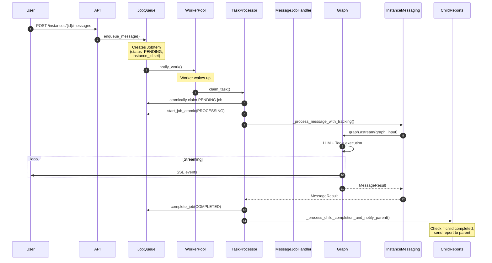
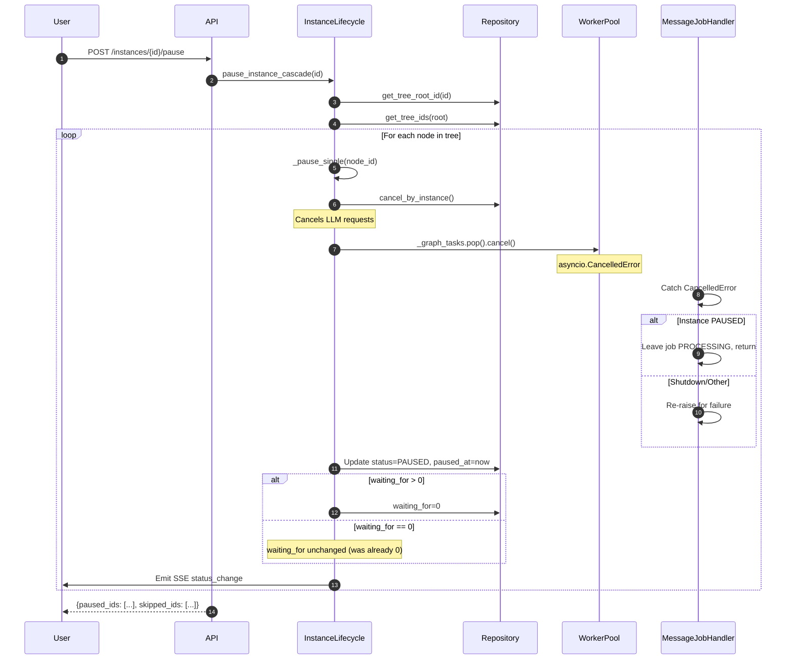
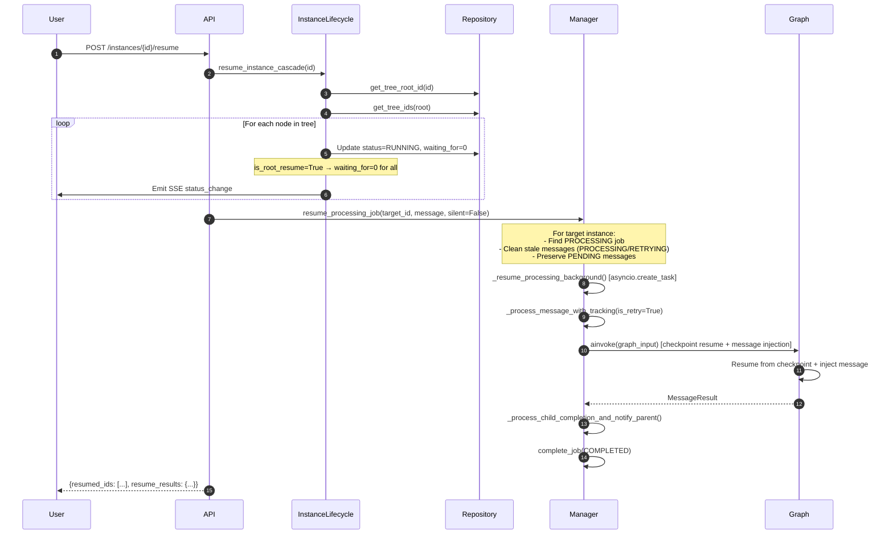
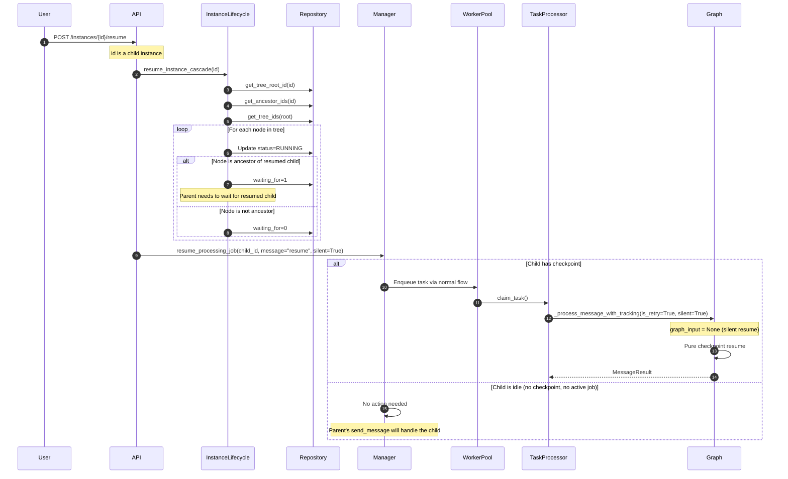
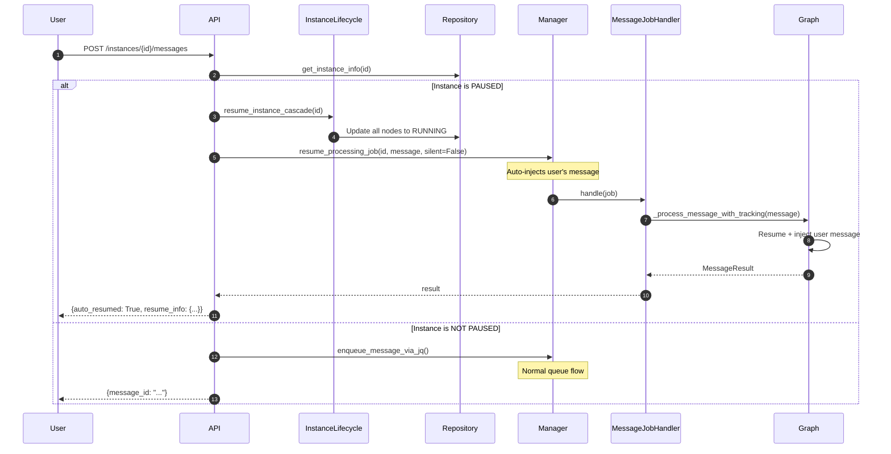
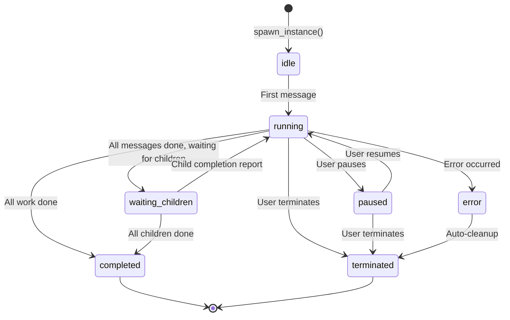
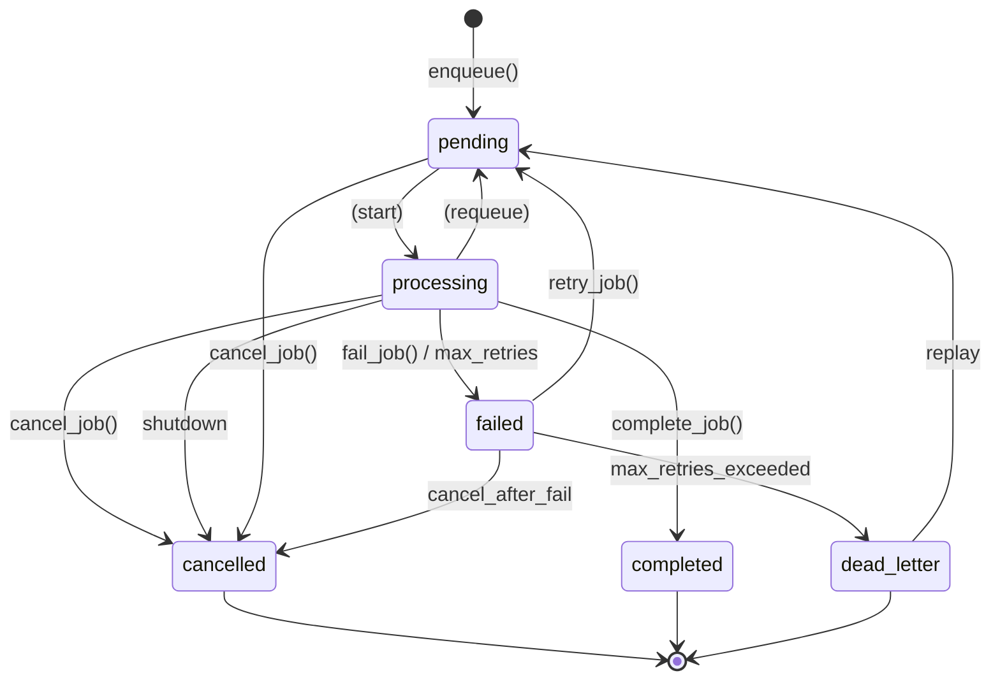
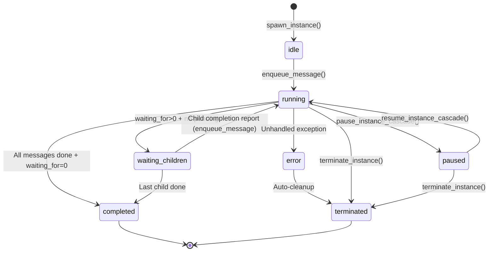
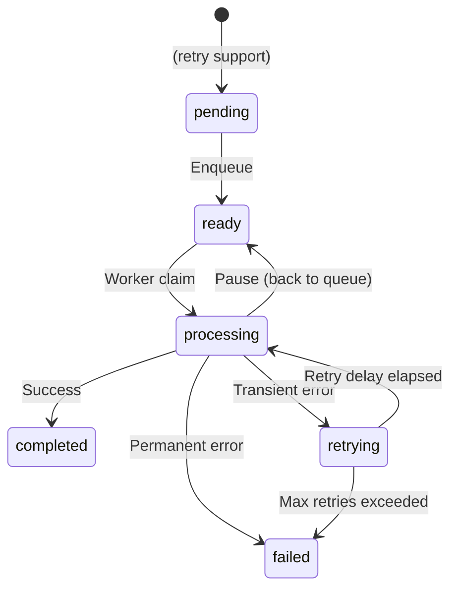

# Job-Task-Pause-Resume Architecture

## 1. Overview

### What is the Feature?

The Job-Task-Pause-Resume feature enables users to pause running agent instances and resume them later, with full state recovery via LangGraph checkpointing. It supports tree-aware operations that cascade pause/resume to all child instances in the hierarchy.

### Key Concepts

| Concept | Description |
|---------|-------------|
| **Instance** | An agent instance (e.g., "coder", "leader") running in the system. Has a status lifecycle: `idle` → `running` ↔ `paused` → `completed`. |
| **Job** | A unit of work in the JobQueue system (`daemon/repositories/job_queue/`). Jobs wrap agent tasks with persistence for crash recovery. |
| **Task** | A unit of work in the WorkerPool system (`daemon/services/worker_pool.py`). Tasks are database-backed and processed by worker threads. |
| **Message** | A user input or system notification to an instance. Messages are persisted in `message_queue` table. |
| **Checkpoint** | LangGraph's state snapshot via `AsyncSqliteSaver`. Used for pause/resume — stores conversation history and node state. |
| **Cascade Pause/Resume** | Pausing/resuming an instance affects its entire tree (parent + all descendants). |

### Why Cascade?

Agent instances can spawn child instances via tools. A pause without cascade would leave children running, potentially causing deadlocks (parent waiting for children that continue executing). The cascade design ensures:

1. **No Deadlocks**: Parent and children are paused together
2. **Consistent State**: All tree members share the same lifecycle
3. **Clean Resume**: Children can resume from their checkpoints independently

---

## 2. Architecture Components

### 2.1 InstanceManager (`daemon/manager.py`)

The central orchestrator for all agent instances.

**Key Responsibilities:**
- Manages instance lifecycle (spawn, terminate, pause, resume)
- Coordinates with services and repositories
- Maintains in-memory graph cache

**Key Methods:**
- `spawn_instance()` — Creates new instance with graph
- `terminate_instance()` — Cascades termination to children
- `pause_instance_cascade()` — Delegates to InstanceLifecycleService
- `resume_instance_cascade()` — Delegates to InstanceLifecycleService
- `get_instance()` — Returns graph (lazy-loads from DB)

**Relationships:**
- Delegates lifecycle to `InstanceLifecycleService`
- Delegates messaging to `InstanceMessagingService`
- Uses `JobQueueService` for job management
- Uses `WorkerPool` for task processing

**Key Method: `resume_processing_job(instance_id, message, silent, images)`**

This is the dual-path resume architecture that handles the difference between root and child instances:

**Root Instance Path:**
1. Finds existing PROCESSING MESSAGE job for the instance
2. Cleans stale message entries: PROCESSING/RETRYING → COMPLETED; **PENDING messages are preserved for post-resume delivery** (not completed)
3. Schedules background task via `_resume_processing_background()`
4. Uses checkpoint resume with optional message injection

**Child Instance Path:**
1. No JobQueue job exists (children use WorkerPool directly)
2. If `silent=True`: skips enqueue (child will resume via parent's send_message)
3. If `silent=False`: enqueues message via WorkerPool with `resume_mode=True` metadata

**Key Parameters:**
- `message`: Resume message text (injected via graph_input for root, direct enqueue for child)
- `silent`: If True, resume from checkpoint without appending new message
- `images`: Optional base64 images for multimodal content

**Returns:** `dict` with `{instance_id, job_id, message_id, status}`

The `status` field has 4 possible values:
- `resuming` — instance has a checkpoint, `_resume_processing_background()` is running (root path)
- `queued` — instance enqueued via WorkerPool (child path, non-silent)
- `silent_resume` — instance resumed silently with no checkpoint, no message (child path, silent=True)
- `already_resuming` — instance is already being resumed (deduplication guard)

---

### 2.2 JobQueue (`daemon/repositories/job_queue/`)

Database-backed job persistence with crash recovery.

#### Files

| File | Purpose |
|------|---------|
| `models.py` | `JobItem`, `JobQueue`, `JobLock`, `DeadLetterItem` SQLModel tables |
| `repository.py` | `JobRepository` — CRUD + atomic state transitions |
| `queue_repository.py` | `JobQueueRepository` — Queue metadata CRUD |
| `lock_repository.py` | `LockRepository` — Per-queue locking |

#### Key Classes

**JobItem** — The job queue item (full model):
```python
class JobItem(SQLModel, table=True):
    # Primary identification
    job_id: str                    # Primary key (UUID)

    # Job content
    agent_id: str                  # Agent to run
    agent_dir: str                 # Path to agent files
    message: str                   # Job content
    source: str                    # "api" | "telegram" | "scheduler" | "webhook"

    # Project queuing
    project_id: str | None        # Project ID for job serialization
    queue_id: str | None          # Queue ID for job routing

    # Scheduling
    priority: int                  # 1-10 (1=lowest, 10=highest)
    status: str                   # pending | processing | completed | failed | cancelled | dead_letter

    # Timing
    created_at: str                # ISO timestamp
    started_at: str | None        # When processing started
    completed_at: str | None      # When processing completed

    # Result
    instance_id: str | None        # Set when job starts processing
    error_message: str | None     # Error details on failure
    result_summary: str | None     # Summary on completion

    # Metadata
    job_metadata: dict             # JSON: {message_id, resume_mode, silent, ...}

    # Cancellation
    cancelled_at: str | None       # When cancelled

    # Soft delete
    deleted_at: str | None         # Soft delete timestamp

    # Job type
    job_type: str                  # "task" (serial) | "message" (parallel)

    # Retry handling
    retry_count: int               # Number of retries (default: 0)
    max_retries: int | None       # Max retries allowed
    idempotency_key: str | None   # For deduplication
    failed_at: str | None          # When job failed
    next_retry_at: str | None      # When to retry next
```

**JobRepository** — Key methods:
- `atomic_transition(job_id, from_status, to_status, **extra)` — Atomically transitions job status
- `start_job_atomic(job_id, instance_id)` — PENDING → PROCESSING (atomic)
- `start_job(job_id, instance_id)` — PENDING → PROCESSING (non-atomic)
- `complete_job(job_id, result_summary)` — PROCESSING → COMPLETED
- `fail_job(job_id, error_message)` — PROCESSING → FAILED
- `cancel_job(job_id)` — PENDING/PROCESSING → CANCELLED
- `find_jobs_by_instance(instance_id, job_type)` — Find all active jobs for an instance (used in termination cleanup)
- `find_processing_message_jobs_by_instance(instance_id)` — DB-level concurrency gate

**JobQueue** — Named queue for per-project isolation:
```python
class JobQueue(SQLModel, table=True):
    queue_id: str
    project_id: str
    queue_type: str       # "fifo" | "parallel" | "defer"
    concurrency_limit: int # Max concurrent jobs (1-20)
```

---

### 2.3 TaskProcessor / WorkerPool (`daemon/services/`)

#### TaskProcessor (`task_processor.py`)

Routes tasks to type-specific processors and provides thread-safe execution.

**Key Methods:**
- `claim_task(worker_id)` — Atomically claims next pending task from DB
- `run_task(task, cancellation_token)` — Runs task via MainLoopBridge

**Processors:**
| Processor | Purpose |
|-----------|---------|
| `ProcessMessageProcessor` | Handles `process_message` tasks — calls `_process_message_with_tracking()` |
| `SendReportProcessor` | Sends completion reports (not implemented) |
| `CleanupProcessor` | Handles cleanup tasks (not implemented) |

#### WorkerPool (`worker_pool.py`)

Notification-driven worker thread pool.

**Key Components:**
- **Worker threads** — Stateless, claim tasks from DB, process via TaskProcessor
- **Notification coordination** — `threading.Condition` wakes workers when work arrives
- **Timeout monitoring** — `TimeoutMonitor` enforces task timeouts

**Key Flow:**
```
Worker.run():
  1. claim_task() → get pending task from DB
  2. If no task → wait_for_work() (sleep until notified)
  3. _process_with_timeout(task) → run via MainLoopBridge
  4. Update task status (complete/fail/cancel)
  5. Loop
```

**Cancellation Handling:**
- `concurrent.futures.CancelledError` → Task stays RUNNING (pause scenario)
- `OperationCancelledError` → Task marked as cancelled (user/shutdown)

---

### 2.4 MessageJobHandler (`daemon/services/message_job_handler.py`)

Handles MESSAGE-type jobs from JobQueue.

**Key Behavior:**
- Reads `instance_id` from `JobItem.instance_id` column
- Creates `CancellationTokenSource` for cancel support
- Checks DB for concurrent MESSAGE jobs (concurrency gate)

**Key Methods:**
- `handle(job)` — Processes MESSAGE job
- `cancel_message_job(job_id)` — Cancels PENDING/PROCESSING job

**Pause Handling:**
```python
except asyncio.CancelledError:
    instance = repo.get(instance_id)
    if instance.status == InstanceStatus.PAUSED:
        # Leave PROCESSING for resume
        return
    else:
        # Shutdown/other — re-raise
        raise
```

---

### 2.5 InstanceLifecycleService (`daemon/services/instance_lifecycle.py`)

Manages instance lifecycle operations.

**Key Methods:**

`pause_instance_cascade(instance_id)`:
1. Find tree root via `repo.get_tree_root_id()`
2. Get all node IDs via `repo.get_tree_ids()`
3. For each node:
   - Cancel active requests (`_request_registry.cancel_by_instance`)
   - Cancel graph task (`_graph_tasks.pop().cancel()`)
   - Update status to PAUSED, set `paused_at`
   - **Conditional reset of `waiting_for`**: Only resets `waiting_for` to 0 if the instance has `waiting_for > 0` (was waiting for children). Instances without pending children just get `status=PAUSED` without modifying `waiting_for`.
4. Emit status_change SSE events

`resume_instance_cascade(instance_id)`:
1. Find tree root and all node IDs
2. For each node:
   - Update status to RUNNING, clear `paused_at`
   - Set `waiting_for` based on position:
     - Root resume: all nodes get `waiting_for=0`
     - Child resume: ancestors get `waiting_for=1`, others get `waiting_for=0`
3. Emit status_change SSE events

---

### 2.6 InstanceMessagingService (`daemon/services/instance_messaging.py`)

Handles message sending and processing.

**Key Methods:**

`enqueue_message(instance_id, message, source, metadata)`:
1. Insert message into `message_queue` table
2. Create `Task` for worker pool
3. Update instance status (IDLE/WAITING_CHILDREN → RUNNING)
4. Emit `MESSAGE_RECEIVED` event
5. Notify worker pool (`_worker_pool.notify_work()`)

`_process_message_with_tracking(instance_id, message, message_id, ...)`:
1. Get graph from manager (lazy-loads from DB)
2. Create callbacks (activity tracking, cancellation)
3. On retry (`is_retry=True`):
   - Check for checkpoint
   - Use `graph_input` with `HumanMessage` instead of `aupdate_state`
4. Stream through graph (`graph.astream()`)
5. Emit SSE events for each message
6. Return `MessageResult`

**Checkpoint Resume Pattern:**
```python
if is_retry:
    has_ckpt = await self._has_checkpoint(instance_id)
    if has_ckpt:
        # Use graph_input instead of aupdate_state
        # LangGraph's add_messages reducer appends to checkpoint
        content = _build_message_content(message, images)
        if content and not silent:
            graph_input = {"messages": [HumanMessage(content=content, id=message_id)]}
        else:
            graph_input = None  # Silent resume
    else:
        graph_input = {"messages": [HumanMessage(content=content, id=message_id)]}
```

---

### 2.7 ChildReportsService (`daemon/services/child_reports.py`)

Handles child instance completion reports to parents.

**Key Method:**
`_process_child_completion_and_notify_parent(instance_id, completed_message_id)`

**Flow:**
1. Check idempotency (no duplicate reports for same message)
2. If tool invocation: skip parent notification
3. Create completion report message for parent
4. Decrement parent's `waiting_for`
5. Update parent's `children[]` cache (denormalized JSON array)
6. Delete from `instance_hierarchy` junction table
7. If `waiting_for == 0`:
   - No pending messages → mark parent COMPLETED
   - Has pending messages → mark parent WAITING_CHILDREN
8. Emit events

**Parent's `children[]` Cache Update:**
- When child completes, the child's ID is removed from the parent's denormalized `children` JSON array
- This maintains consistency with the `instance_hierarchy` table (canonical source)

**Instance Hierarchy Deletion:**
- Child is removed from `instance_hierarchy` junction table via `DELETE FROM instance_hierarchy WHERE child_id = :id`
- The instance record in `instances` table is NOT deleted (soft state change only)

**Status Transition Logic:**
- When `waiting_for == 0` but has pending messages → stays in WAITING_CHILDREN
- Parent waits for its own message processing to complete before marking job done
- When parent completes its message, status check keeps it in WAITING_CHILDREN, cascade marks it COMPLETED

**Idempotency Key:**
```python
source=f"internal_report:{instance_id}:{completed_message_id}"
# Each completion generates unique report per message
```

---

### 2.8 JobFeedbackObserver (`daemon/services/job_feedback_observer.py`)

Subscribes to EventBus and propagates instance lifecycle events to job completion.

**Key Behavior:**
1. Subscribes to `instance_lifecycle` events via EventBus
2. On `completed` status:
   - `atomic_transition(PROCESSING → COMPLETED)`
   - Notify watchers
   - Release locks
   - Trigger next pending job
3. On `error` status:
   - `atomic_transition(PROCESSING → FAILED)`
   - Notify watchers
   - Release locks

---

### 2.9 Graph (`daemon/graph.py`)

LangGraph state machine for agent execution.

**Graph Structure:**
```
StateGraph(SessionState)
├── agent (LLM + tools)
├── tools (ToolNode)
└── nudge (injects continue prompt)
```

**State Schema:**
```python
class SessionState(MessagesState):
    compacted_at: str | None  # Last compaction timestamp
```

**Checkpoints:**
- Uses `AsyncSqliteSaver` checkpointer
- `configurable.thread_id` = instance_id
- Stores all message history in checkpoints

---

### 2.10 API Endpoints

#### Instances Router (`daemon/routers/instances.py`)

| Endpoint | Method | Handler |
|----------|--------|---------|
| `/instances/{id}/pause` | POST | `pause_instance()` |
| `/instances/{id}/resume` | POST | `resume_instance()` |

**Pause Flow:**
```python
result = await manager.pause_instance_cascade(instance_id)
return {
    "paused": True,
    "paused_ids": result["paused_ids"],
    "skipped_ids": result["skipped_ids"],
}
```

**Resume Flow:**
```python
result = await manager.resume_instance_cascade(instance_id)
# For each resumed instance, call resume_processing_job()
# Target instance: message="user's message", silent=False
# Children: message="resume", silent=True
```

#### Messages Router (`daemon/routers/messages.py`)

| Endpoint | Method | Handler |
|----------|--------|---------|
| `/instances/{id}/messages` | POST | `send_message()` |

**Auto-Resume on Paused Instance:**
```python
if instance_info.get("status") == InstanceStatus.PAUSED.value:
    # Skip normal enqueue
    resume_result = await manager.resume_instance_cascade(instance_id)
    # Resume processing jobs...
    return {"auto_resumed": True, "resume_info": {...}}
```

---

## 3. Data Flow Diagrams

### Normal Message Flow



### Pause Cascade Flow



### Resume Flow (Root Instance)



### Resume Flow (Child Instance)



### Send Message to Paused Instance



---

## 4. Key Data Models

### 4.1 Job (JobQueue)

```python
class JobItem(SQLModel, table=True):
    """Job queue item - persisted for crash recovery."""
    job_id: str                    # Primary key (UUID)
    agent_id: str                  # Agent to run
    message: str                   # Job content
    status: str                    # pending | processing | completed | failed | cancelled | dead_letter
    instance_id: str | None       # Set when job starts processing
    job_type: str                  # "task" (serial) | "message" (parallel)
    job_metadata: dict              # JSON: {message_id, resume_mode, silent, ...}
    priority: int                  # 1-10 (10=highest)
    created_at: str                 # ISO timestamp
    started_at: str | None         # When processing started
    completed_at: str | None        # When processing completed
```

**Job Status Transitions:**
```
┌─────────┐
│ pending │
└────┬────┘
     │ start_job()
     ▼
┌───────────┐
│ processing│◄──────────┐
└─────┬─────┘           │
      │                 │
      │ ├─► completed   │ complete_job()
      │                 │
      │ ├─► failed      │ fail_job() / max_retries
      │                 │
      │ ├─► cancelled   │ cancel_job()
      │                 │
      └───────────────┘ cancel_job() (shutdown)
```

### 4.2 Task (WorkerPool)

```python
class Task(SQLModel, table=True):
    """Worker pool task - database-backed."""
    id: int | None               # Auto-increment primary key
    task_type: str               # process_message | send_report | cleanup
    instance_id: str             # Target instance
    message_id: str | None       # Associated message
    status: str                  # pending | running | completed | failed | cancelled
    worker_id: str | None        # Assigned worker
    retry_count: int             # Number of retries
    created_at: datetime         # When task was created
    started_at: datetime | None  # When processing started
    completed_at: datetime | None # When processing completed
```

**Task Status Transitions:**
```
┌─────────┐
│ pending │◄── Created by enqueue_message()
└────┬────┘
     │ claim_pending_task()
     ▼
┌────────┐
│ running│◄── Worker picked up task
└────┬───┘
     │
     ├──► completed  (success)
     ├──► failed     (error)
     └──► cancelled  (pause/shutdown)
```

### 4.3 Instance

```python
class Instance(SQLModel, table=True):
    """Agent instance."""
    instance_id: str              # Primary key (UUID)
    agent_id: str                 # Agent type (e.g., "coder")
    agent_dir: str                # Path to agent files
    parent_id: str | None         # Parent instance ID
    status: str                   # idle | running | paused | completed | error | terminated
    children: str                 # JSON array of child IDs
    waiting_for: int              # Count of pending child completions
    paused_at: str | None         # ISO timestamp when paused
    created_at: str               # ISO timestamp
    updated_at: str               # ISO timestamp
    instance_metadata: dict       # JSON: project_id, mcp_tool_names, etc.
```

**Instance Status Lifecycle:**


### 4.4 MessageQueue

```python
class MessageQueue(SQLModel, table=True):
    """Queued message for an instance."""
    message_id: str               # Primary key (UUID)
    instance_id: str              # Target instance
    content: str                  # Message content
    type: str                     # human | agent | system | completion_report | error_report
    source: str                   # "api" | "telegram:user:123" | "internal_report:child_id:msg_id"
    status: str                   # pending | ready | processing | retrying | completed | failed
    message_metadata: dict        # JSON: {resume_mode, silent, ...}
    enqueued_at: datetime         # When queued
    completed_at: datetime | None # When processed
```

**Message Status Transitions:**
```
┌────────┐
│ pending│ (for retry support)
└───┬────┘
    │ enqueue_message()
    ▼
┌───────┐
│ ready │
└───┬───┘
    │ Worker picks up
    ▼
┌────────────┐
│ processing │
└─────┬──────┘
      │
      ├──► completed  (success)
      ├──► retrying  (transient error)
      └──► failed     (permanent error)
```

### 4.5 Checkpoint (LangGraph)

LangGraph's `AsyncSqliteSaver` stores checkpoints with:

```python
# Config used for all graph operations
config = {
    "configurable": {
        "thread_id": instance_id  # Same as instance_id
    },
    "recursion_limit": 1000
}

# Checkpoint contains:
{
    "channel_values": {
        "messages": [...],      # Conversation history
        "compacted_at": "..."  # Last compaction timestamp
    },
    "channel_versions": {...}, # Version tracking
    "next_nodes": {...}       # Pending node queue
}
```

---

## 5. State Machines

### Job State Machine



Note: Valid transitions per `daemon/services/job_state_machine.py`:
- `pending → processing` (start)
- `pending → cancelled` (cancel)
- `processing → completed` (complete)
- `processing → failed` (fail)
- `processing → cancelled` (abort)
- `processing → pending` (requeue)
- `failed → pending` (retry)
- `failed → dead_letter` (dead_letter)
- `failed → cancelled` (cancel_after_fail)
- `dead_letter → pending` (replay) — dead_letter is replayable, not strictly terminal

### Instance Status Lifecycle



### Message Queue State Machine



---

## 6. Pause/Resume Design Decisions

### 6.1 Why Cascade?

**Problem:** Agent instances can spawn child instances. A parent may `waiting_for` children.

**Without Cascade:**
1. Parent pauses → Parent status = PAUSED
2. Children continue running → Send completion reports
3. Parent can't process reports → Deadlock

**With Cascade:**
1. Parent pauses → All children pause
2. `waiting_for` reset to 0 for all nodes
3. Resume → All children resume together
4. No deadlock possible

**Implementation:**
```python
# In pause_instance_cascade()
tree_ids = repo.get_tree_ids(root_id)
for node_id in tree_ids:
    # Conditional: only reset waiting_for if instance was waiting for children
    if meta.waiting_for and meta.waiting_for > 0:
        repo.update(node_id, status=PAUSED, waiting_for=0, paused_at=now)
    else:
        repo.update(node_id, status=PAUSED, paused_at=now)
```

---

### 6.2 Why Root Uses Direct Resume vs Child Uses Normal Queue?

**Root Instance:**
- Uses the existing JobQueue `PROCESSING` job (not a new enqueue)
- The `_resume_processing_job()` method schedules `_resume_processing_background()` as an asyncio task
- `_resume_processing_background()` calls `_process_message_with_tracking()` **directly** (not via MessageJobHandler)
- Checkpoint resume with message injection via `graph_input` (LangGraph `add_messages` reducer appends the message to checkpoint state)
- Job is completed by `_resume_processing_background()` after processing finishes

**Child Instance:**
- No JobQueue job exists (children use WorkerPool directly)
- When `silent=True` (cascade resume): skips enqueue, child resumes via parent's `send_message`
- When `silent=False`: enqueues message via `enqueue_message()` → WorkerPool task claiming path
- Uses normal `ProcessMessageProcessor` → `_process_message_with_tracking()` flow

**Rationale:**
- Root is user-facing → checkpoint resume preserves exact conversation state
- Child is background → normal async WorkerPool processing is sufficient
- Different code paths prevent interference and respect the JobQueue / WorkerPool boundary

---

### 6.3 Why Silent Flag?

**Purpose:** Skip message injection during cascade resume for non-target nodes.

```python
# In resume_instance_cascade()
for node_id in tree_ids:
    is_target = node_id == target_id
    await resume_processing_job(
        node_id,
        message=message_text if is_target else "resume",
        silent=not is_target,  # Children get silent=True
    )
```

**Why?**
- Target gets user's message injected
- Children only need checkpoint resume (no new message)
- Silent flag prevents duplicate/incorrect message injection

---

### 6.4 Why graph_input Instead of aupdate_state?

**The Problem with aupdate_state:**
```python
# DON'T use this for resume:
await graph.aupdate_state(
    config,
    {"messages": [HumanMessage(content=message)]},
    as_node="agent"
)
# This clears checkpoint's next=() queue!
# astream(None) returns instantly without running the graph.
```

**The Solution:**
```python
# DO use this for resume:
if has_checkpoint:
    graph_input = {"messages": [HumanMessage(content=content, id=message_id)]}
else:
    graph_input = {"messages": [...]}

async for event in graph.astream(graph_input, config):
    # Works correctly!
```

**Why It Works:**
- LangGraph's `add_messages` reducer appends to existing messages
- Checkpoint state is preserved
- Graph runs from checkpoint + new message

---

### 6.5 Why waiting_for > 0 Defense-in-Depth?

**Purpose:** Prevent premature job completion when parent is waiting for children.

```python
# In MessageJobHandler.handle()
instance = repo.get(instance_id)
if instance.waiting_for > 0:
    logger.info(f"Instance has waiting_for={waiting_for}, deferring completion")
    skip_complete = True

if skip_complete:
    return  # Don't call complete_job()

await self._job_service.complete_job(job.job_id, demand_state=COMPLETED)
```

**Why?**
- Race condition: Child reports may arrive while parent job is processing
- `waiting_for` could be decremented after job completion check
- Defense-in-depth prevents orphan children

---

## 7. Edge Cases & Gotchas

### 7.1 Pause During Tool Call

**Scenario:** User pauses while agent is executing a tool.

**What Happens:**
1. Pause cancels graph task (`asyncio.CancelledError`)
2. Checkpoint may be from previous step (not mid-tool)
3. Resume starts from last checkpointed state

**Result:**
- Some tool effects may be lost (if tool partially executed)
- Agent re-executes from checkpoint
- This is acceptable — tools should be idempotent

**Mitigation:**
- Checkpoint after each tool execution
- Tools should be designed idempotently

---

### 7.2 Resume Message Injection via add_messages Reducer

**Scenario:** Resume with user's message.

**Mechanism:**
```python
# LangGraph's add_messages reducer:
def add_messages(existing, new):
    return existing + new  # Append, not replace

# So this works:
graph_input = {"messages": [HumanMessage(content=user_msg)]}
# Existing checkpoint messages + new message
```

**Edge Case:** Multiple rapid resume calls.
- Each call appends another HumanMessage
- May cause duplicate processing

**Mitigation:** Use `silent=True` for non-target instances

---

### 7.3 Stale Message Cleanup

**Scenario:** Message stuck in PROCESSING after pause.

**Cleanup Logic:**
```python
# In resume_processing_job()
if message.status in (MessageStatus.PROCESSING, MessageStatus.RETRYING):
    await self._queue_repository.complete(message.message_id)
# PENDING messages are preserved for post-resume delivery!
```

**Why Preserve PENDING?**
- `PROCESSING`/`RETRYING` = stale from crash/pause (incomplete, needs cleanup)
- `PENDING` = legitimate queue position that was interrupted
- The system expects PENDING messages to be processed **after** the resume message is handled
- This supports "post-resume delivery" where pending user inputs are queued until the resume completes

---

### 7.4 Idempotency in Child Completion Reports

**Scenario:** Child completes, sends report to parent.

**Idempotency Key:**
```python
source = f"internal_report:{instance_id}:{completed_message_id}"
# Example: internal_report:abc123:def456

# Check before creating:
existing = session.exec(
    select(MessageQueue)
    .where(MessageQueue.source == source)
    .where(MessageQueue.status.in_([READY, PROCESSING, COMPLETED]))
).first()

if existing:
    return  # Skip duplicate
```

**Why Per-Message?**
- Allows multiple completions from same child
- Each completion generates unique report
- Prevents duplicate reports on retry

---

### 7.5 Fire-and-Forget API Design

**Scenario:** User calls pause/resume.

**Design:** API returns immediately, processing happens async.

```python
# In pause_instance()
result = await pause_instance_cascade(instance_id)
return {
    "paused": True,
    "paused_ids": result["paused_ids"],
    # Processing continues in background
}
```

**Trade-offs:**
- Fast response time
- No SSE needed for pause/resume
- Status can be checked via GET /instances/{id}

---

### 7.6 Concurrent Resume Deduplication

**Scenario:** User calls resume twice rapidly.

**Handling:**
- Each resume creates new graph task
- First task runs, second may fail/cancel
- Database state is consistent

**Prevention:**
- UI should disable resume button during operation
- API could add idempotency key (not implemented)

---

### 7.7 Daemon Restart with Paused Instances

**Scenario:** Daemon restarts (crash, deployment, manual restart) with paused instances in the database.

**What Happens:**
- Paused instances remain in `status=PAUSED` in the database
- Their in-memory graphs are lost (released on restart)
- No background task automatically resumes them

**Operational Implication:**
- The operator must manually resume paused instances via the API (`POST /instances/{id}/resume`)
- This is intentional — the system does not auto-resume on restart to avoid unexpected agent behavior after downtime
- Paused instances can remain in this state indefinitely until manually resumed

**Mitigation:**
- Monitor for long-paused instances in production
- Consider adding a startup warning or health check for paused instances

---

## 8. API Reference

### POST /api/instances/{id}/pause

Pause an instance and cascade to all children.

**Request:**
```
POST /api/instances/{instance_id}/pause
```

**Response (200):**
```json
{
  "paused": true,
  "paused_ids": ["instance-1", "child-1", "child-2"],
  "skipped_ids": []
}
```

**Errors:**
- `404 Not Found` — Instance not found

---

### POST /api/instances/{id}/resume

Resume a paused instance and cascade to all children.

**Request:**
```json
POST /api/instances/{instance_id}/resume
{
  "message": "continue with the next step"
}
```

**Response (200):**
```json
{
  "resumed": true,
  "resumed_ids": ["instance-1", "child-1", "child-2"],
  "skipped_ids": [],
  "target_id": "instance-1",
  "resume_results": {
    "instance-1": {"status": "processing"},
    "child-1": {"status": "processing"},
    "child-2": {"status": "no_active_job"}
  }
}
```

**Notes:**
- `message` is optional (defaults to "resume")
- Target instance gets user's message
- Children resume silently from checkpoint

**Errors:**
- `404 Not Found` — Instance not found

---

### POST /api/instances/{id}/messages (Auto-Resume)

Send message to instance (auto-resumes if paused).

**Request:**
```json
POST /api/instances/{instance_id}/messages
{
  "content": "Please continue with the task",
  "images": ["base64..."]
}
```

**Response (200, Paused Instance):**
```json
{
  "message_id": null,
  "role": "user",
  "content": "Please continue with the task",
  "thinking": null,
  "thinking_extracted": null,
  "tool_calls": null,
  "images": null,
  "auto_resumed": true,
  "resume_info": {
    "resumed": true,
    "resumed_ids": ["instance-1", "child-1"],
    "skipped_ids": [],
    "target_id": "instance-1",
    "resume_results": {
      "instance-1": {"status": "processing"}
    }
  }
}
```

**Response (200, Normal):**
```json
{
  "message_id": "msg-123",
  "role": "assistant",
  "content": "",
  "auto_resumed": false,
  "resume_info": null
}
```

**Errors:**
- `404 Not Found` — Instance not found
- `400 Bad Request` — Images but no vision model configured

---

## Appendix: File Reference

| File | Lines | Purpose |
|------|-------|---------|
| `daemon/manager.py` | 2334 | Central orchestrator |
| `daemon/repositories/job_queue/models.py` | 286 | JobItem, JobQueue, JobLock models |
| `daemon/repositories/job_queue/repository.py` | 742 | JobRepository CRUD |
| `daemon/repositories/task/models.py` | 103 | Task model |
| `daemon/services/task_processor.py` | 505 | Task routing |
| `daemon/services/worker_pool.py` | 488 | Worker thread pool |
| `daemon/services/message_job_handler.py` | 254 | MESSAGE job handler |
| `daemon/services/instance_lifecycle.py` | 835 | Lifecycle operations |
| `daemon/services/instance_messaging.py` | 1288 | Message handling |
| `daemon/services/child_reports.py` | 816 | Child completion reports |
| `daemon/services/job_feedback_observer.py` | 378 | Job completion observer |
| `daemon/services/job_state_machine.py` | 114 | Job state machine |
| `daemon/graph.py` | 618 | LangGraph definition |
| `daemon/routers/instances.py` | 323 | Instance API endpoints |
| `daemon/routers/messages.py` | 252 | Message API endpoints |
| `daemon/repositories/instance/models.py` | 99 | Instance model |
| `daemon/repositories/message_queue/models.py` | 101 | MessageQueue model |
| `daemon/services/job_queue_service.py` | 1445 | Job queue service |
