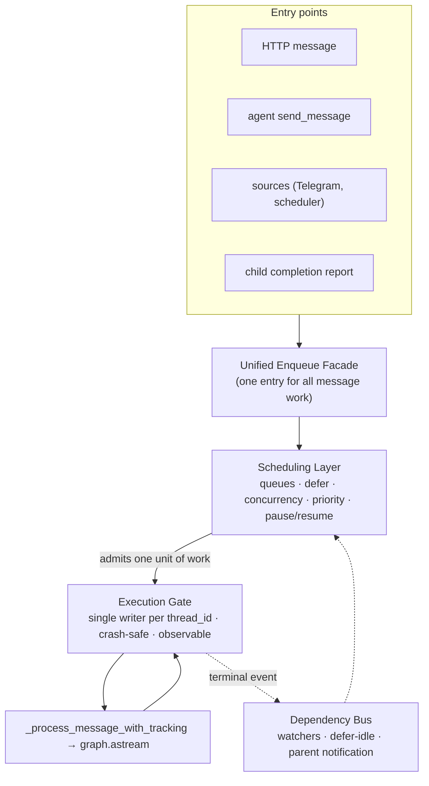

# Unified Dispatch & Execution Architecture

> Target architecture for the message/job/task subsystems.
> Status: Proposed

## Goal

Split **scheduling** from **execution** so that there is exactly **one owner of `graph.astream`** and **one authoritative "is this thread_id busy?" check**. Today scheduling and execution are intertwined across two dispatchers; this document describes the end state, not the migration steps.

## Guiding Principles

1. **One execution owner.** Only one component is allowed to invoke `graph.astream` for a given `thread_id` (`instance_id`). It is never called directly by a dispatcher.
2. **Scheduling is layered above execution.** Queues, ordering, concurrency, and lifecycle decide *when* work may run — never *how* it runs.
3. **One dependency primitive.** "A waits for B" is expressed through a single mechanism, not three.
4. **No cross-system coupling by raw SQL.** Components coordinate through contracts/interfaces, not by peeking into each other's tables.

## The Three Concerns, Each With One Owner

| Concern | Question it answers | Owner | Today |
|---|---|---|---|
| **Scheduling / Lifecycle** | *When* may this unit of work run? Under what queue/concurrency/priority/ordering? | **Scheduling Layer** (built on the Job system) | Job system (partial) + bespoke routing |
| **Execution** | *How* is a unit of work run safely against one langgraph thread? | **Execution Gate** (new, single component) | Split across WorkerPool dispatch *and* MessageJobHandler |
| **Dependencies** | *Who waits for whom*, and who gets notified on completion? | **Dependency Bus** | `waiting_for` counter + child-report Tasks + `job_watchers` (three mechanisms) |

The execution core itself — `_process_message_with_tracking` → `graph.astream` — is **unchanged**. Only its callers are consolidated.

## Target Shape

Every entry point — HTTP, agent-to-agent, sources, child reports — flows through the **same enqueue facade**. Which scheduling policy applies is decided by metadata at enqueue time, not by which entry point was used. Execution is always gated.

## Component Responsibilities

### 1. Unified Enqueue Facade
- The only place that creates a unit of work.
- Tags each unit with: target `instance_id`, origin (http/agent/source/child), scheduling intent (queue type, priority, dependency links).
- Replaces the current fork between `enqueue_message` (→ Task) and `enqueue_message_via_jq` (→ Job). The choice of path is no longer entry-point-driven.

### 2. Scheduling Layer (Job system, repurposed as scheduling-only)
- Owns **queues** (FIFO / parallel / **defer**), **per-queue concurrency limits**, **priority**, **pause/resume**, **dead-letter**, **idempotency**, **soft-delete**, **feedback/observers**.
- Decides *ordering* and *admission*. When it admits a unit of work, it hands it to the Execution Gate — it never runs `graph.astream`.
- The `defer` queue type and `system_parallel_queue` become the real scheduling vocabulary.

### 3. Execution Gate (new single component)
- The **only** caller of `graph.astream` for an instance thread.
- Guarantees a **single in-flight writer per `thread_id`** via a durable, crash-safe, multi-process-safe check (DB-backed, not in-memory locks lost on restart).
- Contract for every unit of work:
  - acquire thread lease (or reject: "thread busy")
  - run `_process_message_with_tracking`
  - emit terminal event (completed/failed/cancelled) on release
- Subsumes today's WorkerPool dispatch loop, the Task per-instance claim guard, and the MessageJobHandler active-check. Those become a single internal predicate.

### 4. Dependency Bus
- One mechanism for "A waits for B":
  - **Watchers** — an instance subscribes to a work unit's terminal event.
  - **Defer** — a queue runs a unit only when idle.
- Replaces the parent `waiting_for` counter and the child-completion-report-as-separate-execution-unit pattern. A parent waiting on children is expressed as *watchers on those children's work units*, not as a decremented integer plus re-enqueued Tasks.

## What This Enables

- **No dual dispatchers touching one langgraph thread.** The checkpoint race is structurally impossible, not guarded against.
- **No cross-table SQL coupling.** Scheduling never queries the execution state directly; it asks the Gate through a contract.
- **One mental model for dependencies.** Ordering (defer), notification (watchers), and parent-waits-child collapse into one vocabulary.
- **The agent message protocol is preserved.** Its required semantics (FIFO per instance, deterministic delivery) become a *scheduling policy* on top of the Gate, not a separate execution path.

## Non-Goals

- Rewriting `_process_message_with_tracking` or the langgraph execution core.
- Removing the Job or Task tables outright on day one — they are repurposed (Job → scheduling record; Task → folded into the Gate's work-unit model), not deleted.
- Changing the HTTP API contract or SSE behavior.

## Open Design Questions

1. **Work-unit identity:** should the Execution Gate operate on a unified work-unit record, or keep Job/Task rows as the Gate's queue and translate at the boundary?
2. **Concurrency model of the Gate:** stay on the thread-pool + `MainLoopBridge` (current Task path), move fully async (current Job path), or a hybrid? The Gate should make this an internal choice invisible to schedulers.
3. **Lease durability:** DB-backed lease vs. advisory lock vs. checkpoint-level lock — which gives the best crash-recovery semantics with least contention.
