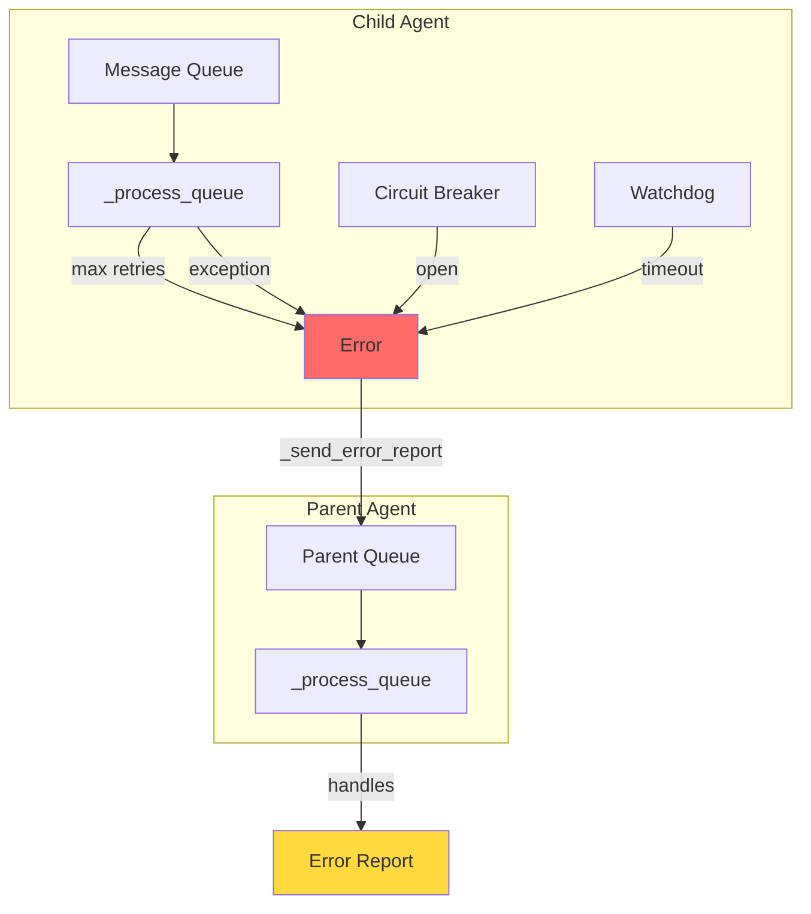
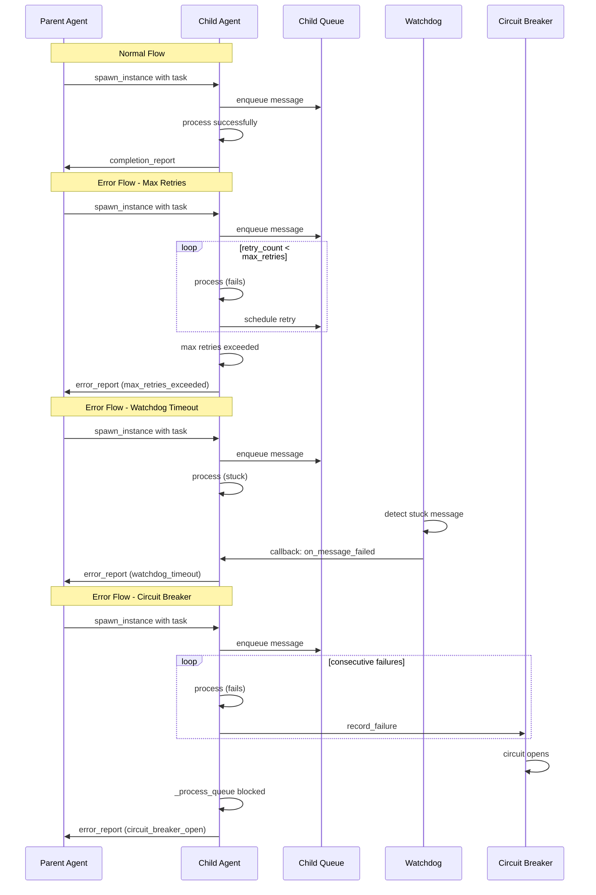
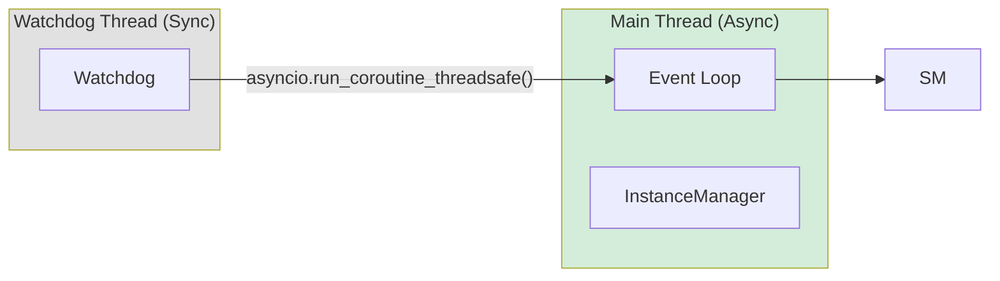

# Child Agent Error Reporting

## Overview

When a child agent encounters an unrecoverable error, the parent agent is now notified via an error report message. This ensures parent agents can handle failures gracefully instead of waiting indefinitely.

## Architecture



## Error Report Flow



## Error Types

| Error Type | Trigger | Severity | Recoverable |
|------------|---------|----------|-------------|
| `max_retries_exceeded` | Message fails after all retry attempts | `critical` | No |
| `watchdog_timeout` | Message stuck in processing > 1 hour | `warning` | Yes |
| `circuit_breaker_open` | Too many consecutive failures | `critical` | Yes |

## Error Report Format

### Message Content (Human-Readable)

```
⚠️ {agent_name} encountered an error:

**Error Type:** {error_type}
**Severity:** {severity}
**Details:** {truncated_error}
```

### Message Metadata (Programmatic Access)

```json
{
    "type": "error_report",
    "child_instance_id": "abc123...",
    "error_type": "max_retries_exceeded",
    "error": "Streaming failed: connection timeout...",
    "original_message_id": "msg456...",
    "severity": "critical",
    "recoverable": false
}
```

## Implementation Details

### 1. `_send_error_report()` Method

**Location:** `daemon/manager.py:1291-1415`

Responsible for sending error notifications to parent sessions.

**Features:**
- Try/except wrapper for robustness
- Duplicate error report prevention
- Error message truncation (2000 char limit)
- Severity classification
- Recoverable flag

### 2. Error Reporting Triggers

#### Max Retries Exceeded
**Location:** `daemon/manager.py:824-833`

```python
# After marking message as failed
await self._send_error_report(
    instance_id=instance_id,
    error=f"Max retries ({msg.retry_count}) exceeded: {e}",
    error_type="max_retries_exceeded",
    message_id=msg.message_id
)
```

#### Circuit Breaker Open
**Location:** `daemon/manager.py:669-683`

```python
if not self.circuit_breaker.can_execute(instance_id):
    # ... check for pending messages
    await self._send_error_report(
        instance_id=instance_id,
        error=f"Circuit breaker open - session has {len(pending)} message(s) blocked",
        error_type="circuit_breaker_open",
        message_id=pending[0].message_id
    )
```

#### Watchdog Timeout
**Location:** `daemon/manager.py:291-328` + `daemon/queue.py:420-425`

The watchdog runs in a background thread and uses `asyncio.run_coroutine_threadsafe()` to schedule error reports:

```python
def _on_watchdog_message_failed(instance_id, message_id, error):
    loop = self._loop
    if loop is None or loop.is_closed():
        return
    asyncio.run_coroutine_threadsafe(
        self._send_error_report(...),
        loop
    ).result(timeout=5.0)
```

### 3. Duplicate Prevention

**Location:** `daemon/manager.py:1312-1325`

Before sending an error report, the system checks if one already exists:

```python
existing = self._queue_repository.list(
    instance_id=meta_check.parent_id,
    status="ready",
    limit=10
)
for existing_msg in existing:
    if existing_msg.source == f"internal_error_report:{instance_id}":
        return  # Skip duplicate
```

## Parent Agent Handling

When a parent receives an error report, it can:

1. **Log the error** - Error appears in conversation history
2. **Retry the task** - Spawn a new child agent
3. **Notify user** - Ask for guidance
4. **Graceful degradation** - Continue with partial results

### Example Parent Handler

```python
# In parent agent's message processing
if message_metadata.get("type") == "error_report":
    error_type = message_metadata.get("error_type")
    recoverable = message_metadata.get("recoverable", False)
    
    if recoverable:
        # Option 1: Retry after delay
        await retry_with_backoff(child_instance_id)
    else:
        # Option 2: Escalate to user
        return f"Child agent failed: {error_type}. Please advise."
```

## Configuration

This module uses hardcoded values for timeouts and retries.

## Thread Safety

The implementation handles cross-thread communication safely:



**Key Safety Measures:**
- Uses stored `self._loop` reference (not `get_running_loop()`)
- Checks `loop.is_closed()` before scheduling
- Timeout on `future.result()` to prevent hanging
- Try/except around all cross-thread calls

## Files Modified

| File | Changes |
|------|---------|
| `daemon/manager.py` | Added `_send_error_report()`, error triggers in `_process_queue`, watchdog callback |
| `daemon/queue.py` | Added `on_message_failed` callback parameter to `SessionWatchdog` |
