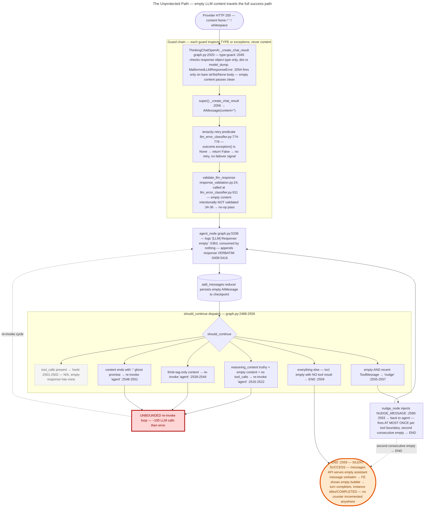
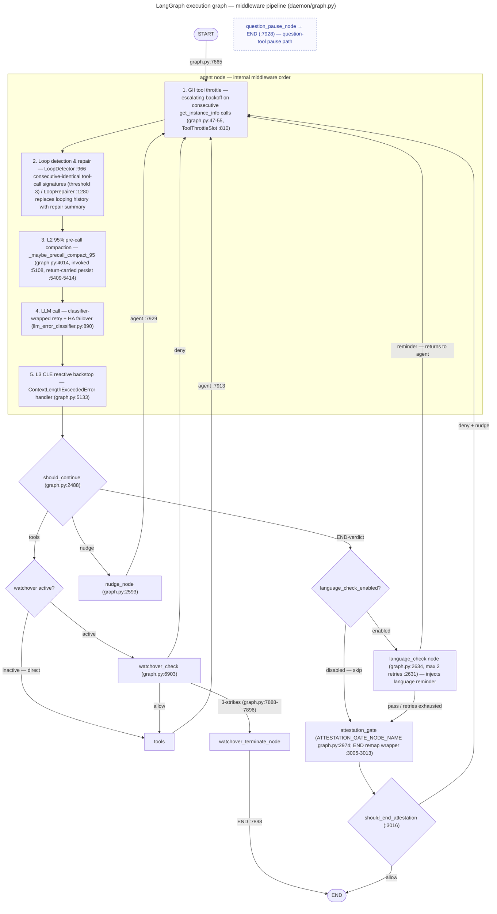

# Hallucination Protection — Mechanism Inventory & the Empty-Response Gap

**Date:** 2026-09-12
**Branch:** `docs/hallucination-protection` @ `383fc24f`
**Status:** Reference document — analysis only

This document catalogs every hallucination-protection / LLM-output-protection mechanism in the
agents-ensemble daemon and then analyzes, in depth, the one reported gap: **a provider returning
continuous empty AI messages meets no protection or recovery anywhere on the hot path.**

**Scope.** "Hallucination protection" here means every mechanism that guards against LLM
*misbehavior* — malformed, empty, looping, degraded, or fabricated-completion output — **plus** the
grounding mechanisms (context injection, critical notes, blueprints, RAG) that reduce hallucination
risk by feeding the model accurate project state. It does **not** cover general reliability
infrastructure (job queue, persistence, crash recovery) unless that infrastructure directly judges
LLM output quality.

> **Source & verification note.** This document is compiled from two investigation reports (an
> explorer knowledge-base report and the `wanderer-empty-message-gap` end-to-end trace) plus the
> project blueprint context. Every file:line anchor below was either **copied verbatim from a
> report** or **spot-verified by reading the cited file on this branch** (2026-09-12). Items that
> could not be verified — because they fell beyond the excerpt available to this document — are
> marked 🟡. No anchor has been invented.

---

## 1. Executive Summary — What We Have Today

| # | Mechanism | Category | Guards against | Default | Key knob |
|---|-----------|----------|----------------|---------|----------|
| 1 | Response structural validation (`validate_llm_response`) | Runtime guard | Truncated responses (`finish_reason=length`); tool calls with empty name/args | ON | none dedicated (wired into retry scope) |
| 2 | Router degenerate-shape guards (`should_continue`) | Runtime guard | Think-only, `<think>`-tag-only, ghost-promise (`:`) responses | ON | none (graph routing) |
| 3 | Nudge (empty-after-tool) | Runtime guard | A *single* empty response after tool execution | ON | none; fires at most **once** per tool boundary |
| 4 | Error classification & retry (`classify_llm_errors`) | Runtime guard | Transient/timeout API errors, malformed bodies, validation failures | ON | transient attempts 10 / timeout attempts 3 (HA ceiling 13) |
| 5 | LLM failover HA (`FailoverController`) | Runtime guard | Primary-endpoint failure streaks | ON when backup endpoint configured | `PRIMARY_TRANSIENT_MAX=3` / `PRIMARY_TIMEOUT_MAX=2` |
| 6 | Malformed-body type-guard (`MalformedLLMResponseError`) | Runtime guard | Bare `str`/`list`/`None` provider bodies under stress | ON | none |
| 7 | Load balancer (`llm_load_balancer`) | Runtime guard | Single-model overload (a stress precursor to malformed bodies) | ON when `llm_models` configured | `model_override` skips balancing |
| 8 | Loop detection & repair (`LoopDetector`/`LoopRepairer`) | Runtime guard | Repeated identical tool-call patterns | ON | threshold 3 consecutive identical signatures |
| 9 | Language check | Runtime guard | Final answers in the wrong user language | ON per user preference | `LANGUAGE_CHECK_MAX_RETRIES=2`; `language_check_enabled` |
| 10 | GII tool throttle | Runtime guard | Consecutive `get_instance_info` polling loops | ON | escalating backoff, resets on any non-GII message |
| 11 | Watchover 3-strikes | Runtime guard | Unsafe tool execution on watched instances | per-agent (`meta.json` watchover config) | `watchover_check` gate; 3 denials → terminate |
| 12 | Proactive compaction ladder (L1/L2/L3) | Context quality | Context bloat → degraded/truncated outputs | ON | `ENSEMBLE_PROACTIVE_COMPACTION=0` disables |
| 13 | Compaction fallback guards | Context quality | Summarizer failure / degenerate summaries | ON | internal fallbacks (truncation fallback on summarize failure) |
| 14 | Attestation gate | Completion integrity | Fabricated child "completion" reports | ON (attestation-enabled agents) | `attestation_enabled`; END verdicts remapped through the gate |
| 15 | `[REPORT SANITY]` marker scanner | Completion integrity | Completions with zero tool-call evidence | ON | marker catalog (12–18 patterns), scan window = last N AIMessages |
| 16 | Report-integrity guard & metrics | Completion integrity | Lost / silently dropped child reports | ON | `report_integrity_guard.py` / `report_integrity_metrics.py` |
| 17 | Report delivery recovery | Completion integrity | Dropped report delivery | ON | `report_delivery_recovery.py` |
| 18 | Attestation report judge (prompt-side adjudication) | Completion integrity | Plausible-looking but unsupported completions | ON | judge verdicts `error`/`timeout`/`unparsable` → deny |
| 19 | System-context injection | Grounding | Stale or wrong project facts in prompts | ON (per-agent opt-in gates) | `context_kind` stamped blocks (`_make_context_message`) |
| 20 | Critical-notes injection | Grounding | Repeating known, catalogued mistakes | ON | leader-managed notes; strict near-dup rejection; cap 50 |
| 21 | Project blueprint | Grounding | Architecture misstatements | ON (`blueprint_active`) | `blueprint_matcher.py` / `blueprint_scan_service.py` |
| 22 | RAG knowledge (`explore` / `experience`) | Grounding | Re-discovering already-learned lessons | ON | knowledge-base queries; chunks e.g. `llm-malformed-response-guard.md` |

**The one hole in the lattice:** none of #1–#22 inspects *content emptiness* on the success path.
Empty content is explicitly valid-by-design (see §7), so a provider in a continuous-empty failure
mode sails through everything above.

---

## 2. Per-Turn Runtime Guards (Inventory Part 1)

### 2.1 Response structural validation

- **Anchors:** `daemon/response_validation.py:24` (`validate_llm_response`); truncation check
  `:48-53`; malformed-tool-call check `:55-60`; helpers `_is_truncated_response` `:63`,
  `_has_malformed_tool_calls` `:98`.
- **Purpose:** structural (not semantic) validation of every LLM response, executed **inside the
  retry scope** so failures retry and can trigger failover.
- **Triggers:** (1) `response.response_metadata["finish_reason"] == "length"` (truncation);
  (2) any tool call with empty `function.name` or empty `function.arguments`.
- **Action on trigger:** raise `LLMResponseValidationError` → caught at
  `daemon/llm_error_classifier.py:936-938` ("Response validation failed, will retry") → re-raised
  into the tenacity `RetryByCategory` predicate.
- **Knobs / default:** always-on middleware; no dedicated knob.
- **Fail-open contract:** unexpected structure or missing `response_metadata` logs a warning and
  **passes** (`response_validation.py:38-40`) — "we'd rather use a questionable response than crash."
- **Critical exclusion (by design):** *"Empty content is intentionally NOT validated here."*
  (`response_validation.py:34-36`) — see §7.

### 2.2 Router degenerate-shape guards

- **Anchors:** `should_continue`, `daemon/graph.py:2488-2559`; think-only re-invoke `:2516-2522`;
  `<think>`-tag-only re-invoke `:2539-2544`; ghost-promise (`:`-ending) re-invoke `:2548-2551`.
- **Purpose:** catch responses that *look* finished but carry no usable answer, and re-invoke the
  agent instead of ending the turn.
- **Triggers / actions:** see the full decision matrix in §7.2 — rows 2, 3, 4 all route to
  `"agent"` (re-invoke); row 5 routes to `"nudge"`.
- **Knobs / default:** always-on; part of graph routing. No knobs.

### 2.3 Error classification & retry

- **Anchors:** `classify_llm_errors`, `daemon/llm_error_classifier.py:890`;
  `_run_with_classification` `:907-912`; validation call inside try `:911`;
  `TransientAPIError` wrap `:921-924`; `ContextLengthExceededError` raise `:916-918` (class
  defined `:384`); retry predicate `:774-776`; exhaustion logging `daemon/graph.py:5342-5351`.
- **Purpose:** translate raw provider exceptions into retry categories before tenacity sees them,
  so retries are budgeted per error shape rather than blanket.
- **Budgets:** transient attempts **10**, timeout attempts **3**; with HA active the total attempt
  ceiling is 13 via `derive_ha_attempt_ceiling` (`llm_error_classifier.py:509-523`). Exhaustion
  boundary logs "All retries exhausted (…)" and re-raises (`graph.py:5342-5351`).
- **Key predicate fact (load-bearing for §7):** `retry_state.outcome.exception() is None → return
  False` (`llm_error_classifier.py:774-776`) — **a successful call never retries, regardless of
  content.**
- **Knobs / default:** ON; budgets from `daemon/config.py` retry settings.

### 2.4 LLM failover HA

- **Anchors:** `daemon/services/llm_failover.py` (`ChatFailoverBinding` at `:535`/`:605` — report
  anchors); failover counters `PRIMARY_TRANSIENT_MAX = 3` and `PRIMARY_TIMEOUT_MAX = 2` live in
  `daemon/llm_error_classifier.py:505-506` (llm_failover reuses the same classifier).
- **Purpose:** survive a failing primary endpoint by swapping the client `base_url` to the backup.
- **Triggers:** 2 transient retries (3rd transient failure) or 1 timeout retry (2nd timeout) on
  the primary; both counters reset on swap; sticky-on-success return to primary.
- **Empty-choices classification:** `IndexError` from an empty `choices` array is retryable **only
  when a backup endpoint is configured** (`failover_controller` set); without a backup it stays
  non-retryable (pre-HA behavior).
- **Knobs / default:** ON when a backup endpoint is configured.

### 2.5 Malformed-body type-guard

- **Anchors:** `ThinkingChatOpenAI._create_chat_result`, `daemon/graph.py:2020`; type check
  `:2045`; `raise MalformedLLMResponseError` `:2054`; `super()._create_chat_result` `:2056`.
- **Purpose:** a stressed provider can return a bare JSON string body instead of a
  `ChatCompletion` object; LangChain would crash with a non-retryable `AttributeError`. The guard
  type-checks **before** `super()` and raises the dedicated retryable
  `MalformedLLMResponseError` (a `TRANSIENT_EXCEPTIONS` member, per the guard's own comment at
  `graph.py:2033-2042`), so malformed bodies retry *and* trigger HA failover with zero
  failover-side changes.
- **Scope limit (load-bearing for §7):** the guard inspects the response object's **type**
  (`dict` | anything exposing `model_dump()`), never its content. Empty choices / `content=None` /
  whitespace pass through cleanly.

### 2.6 Load balancer

- **Anchors:** `daemon/services/llm_load_balancer.py` (`_select_weighted_model`; referenced from
  `daemon/registry.py:149` and `daemon/services/instance_lifecycle.py:36`); plan:
  `.agents/shared/planning/llm-model-load-balance/plan-overview.md`.
- **Purpose:** weighted selection across `llm_models` spreads load, reducing single-model
  overload — the stress condition that precedes malformed/empty provider responses.
- **Knobs / default:** active when `llm_models` is configured; `model_override` (council/governor
  pins) skips balancing (`instance_lifecycle.py:1373-1388`); the balanced choice is persisted for
  observability.

### 2.7 Loop detection & repair

- **Anchors:** `LoopDetector`, `daemon/graph.py:966` (stateless scan of the message tail);
  `LoopRepairer`, `daemon/graph.py:1280` (repair execution; safety-net `:1422`; repair-fail
  `:1454`); planned behavior documented in
  `.agents/shared/planning/general-hallucination-fix/phase1-plan.md:83-100`.
- **Detection:** a "unit" = one `AIMessage` with tool_calls + its matching `ToolMessage`s; a
  unit's signature = sorted `(name, canonical-args)` pairs; **3 consecutive identical signatures**
  (default threshold) = loop. The walk stops at any non-tool message; units entirely made of
  excluded tools break the chain.
- **Action:** oldest unit kept as evidence, newer duplicates removed, looping history replaced
  with a repair summary (`LoopRepairer._summarize_loop`).
- **Scope limit (load-bearing for §7):** detection is *tool-call-signature* based. An empty
  `AIMessage` has no tool calls — it is a non-tool message that **breaks the walk**. Empty-response
  loops are invisible to this guard.

### 2.8 Language check

- **Anchors:** `create_language_check_node`, `daemon/graph.py:2634`;
  `LANGUAGE_CHECK_MAX_RETRIES = 2` `:2631`; counter state `:2447-2448`; router wiring
  `create_should_continue(language_check_enabled)` `:2748-2760`; skip flag documented in
  `daemon/language_detection.py:109`.
- **Purpose:** final answers must be in the user's language; wrong-language content is treated as
  degenerate output.
- **Action:** injects a language-check reminder as a `HumanMessage` and returns to the agent; the
  counter resets on any new genuine human message; hard-stops after 2 retries.
- **Knobs / default:** ON per user-language preference; `language_check_enabled=False` skips the
  node.

### 2.9 Tool throttling (GII)

- **Anchors:** `daemon/graph.py:47-55` (escalating-backoff counter);
  `ToolThrottleSlot` `:810`; consumed at `graph.py:4300/4345-4351`.
- **Purpose:** stop degenerate *polling* behavior — consecutive single-tool
  `get_instance_info` loops — by throttling the tool with escalating backoff.
- **Knobs / default:** ON; the counter resets on any non-GII message (deliberate: the throttle
  targets consecutive single-tool polling only).

### 2.10 Watchover 3-strikes

- **Anchors:** `watchover_check` node, `daemon/graph.py:6835` (factory) / `:6903` (node);
  wiring `tools_target = "watchover_check" if watchover_active else "tools"` `:7681`,
  `:7872-7873`; router `should_end_watchover` `:7441`; conditional edges
  `{tools: allow, agent: deny, watchover_terminate_node: 3-strikes}` `:7888-7896`;
  `watchover_terminate_node → END` `:7898`.
- **Purpose:** a per-tool-call security/effectiveness gate on watched instances — the evaluator
  inspects each tool call and allows, denies (back to agent), or escalates.
- **Action on trigger:** repeated denials escalate — the third strike routes to
  `watchover_terminate_node`, which terminates the instance (deferred cascade runs post-graph).
- **Knobs / default:** per-agent, from `agents/{name}/meta.json` watchover config; activation
  follows the pause-first-then-quiesce convention (`WatchoverService.activate_watchover`).

---

## 3. Context-Quality Protection (Inventory Part 2)

Degraded context is a hallucination accelerant. Two mechanism families protect it.

### 3.1 Proactive compaction ladder (L1/L2/L3)

- **Anchors:** L1 80% pre-dispatch — `_maybe_compact_context`,
  `daemon/services/instance_messaging.py:1084` (invoked `:3841`); L2 95% pre-call hook —
  `_maybe_precall_compact_95`, `daemon/graph.py:4014` (invoked `:5108`; return-carried persist at
  the agent node return `:5409-5414`); L3 reactive backstop — `ContextLengthExceededError`
  raised at `daemon/llm_error_classifier.py:918`, handled at `daemon/graph.py:5133` (compaction on
  context-length errors); default context window `DEFAULT_CONTEXT_LIMIT = 700000`
  (`daemon/compaction.py:1090`, blueprint anchor).
- **Ladder:** L1 fires at 80% (560k) before dispatch; L2 at 95% (665k) immediately before the LLM
  call; L3 is the reactive escape when the provider rejects an oversized context anyway.
- **Action:** chunked summarization compacts the selectable history; injected
  `context_kind` blocks are permanently hoisted (never compacted away) — the three-bucket
  partition shares single predicates between the engine and the sentinel seam.
- **Knobs / default:** `ENSEMBLE_PROACTIVE_COMPACTION` — **default ON** (`daemon/config.py:811`,
  `:815`); `=0` disables the auto-trigger ladder (manual `/compact` still works).
  🟡 *Threshold values 560k/665k and the injected-notes absorb flag
  (`ENSEMBLE_INJECTED_NOTES_ABSORB`, default ON) are blueprint-sourced; not re-verified line-by-line
  for this document.*

### 3.2 Summary / degenerate-output fallback guards

- **Anchors:** `daemon/compaction.py:19` (module contract: *"Truncation: Fallback when
  summarization fails"*); REMOVE_ALL fallback drift guard `:471-494` (one-time warning when the
  langgraph fallback fires); parallel chunked summarization with `chunk_concurrency` (default 3,
  semaphore-bounded).
- **Purpose:** the compaction *summarizer is itself an LLM call* that can fail or emit degenerate
  output; these guards keep a failed/degenerate summary from destroying history — fallback
  truncation preserves verbatim content instead.
- **Knobs / default:** ON (internal fallbacks); `chunk_concurrency` configurable. 🟡 *Detailed
  fallback branches beyond `compaction.py:19` are inventory-report material not present in the
  available excerpt; only the module-contract anchor was verified.*

---

## 4. Completion-Integrity & Cross-Instance Guards (Inventory Part 3)

These mechanisms attack **fabricated completions** — an agent claiming work it never did.

### 4.1 Attestation gate

- **Anchors:** node name `ATTESTATION_GATE_NODE_NAME = "attestation_gate"`,
  `daemon/graph.py:2974`; END-remap wrapper `should_continue_with_attestation` `:3005-3013`
  (every base `END` verdict is redirected through the gate); gate router
  `should_end_attestation` `:3016`; gate service `daemon/services/attestation_gate.py`
  (fail-open on degenerate embeddings documented `:379`, `:744`, `:781`).
- **Purpose:** before a leader-instance turn may complete, the gate decides whether the final
  assistant message actually reflects completed work (children done, nothing pending) — blocking
  fabricated "all done" claims.
- **Action on trigger:** deny → inject a nudge + increment the denied counter, back to `agent`;
  repeated denial escalates. Marker-path judge verdicts `error`/`timeout`/`unparsable` with
  nothing pending are **converted to DENY via the existing nudge machinery**
  (`graph.py:3577-3617`).
- **Knobs / default:** `attestation_enabled` per agent; the wrapper degrades to the plain router
  when disabled (`graph.py:3002-3003`).

### 4.2 Report repairer / delivery recovery

- **Anchors:** `daemon/services/report_delivery_recovery.py`; sibling surfaces
  `daemon/services/error_reporting.py`, `daemon/services/child_reports.py`.
- **Purpose:** recover child reports whose delivery was dropped or interrupted (the
  `prod-6c631666-report-lost` incident class), so a parent never silently misses a child's
  results and hallucinates the child's state.
- 🟡 *The inventory report's exact "report repairer" anchors were not present in the available
  excerpt; the module mapping above was reconstructed from the repo surface and is flagged
  accordingly.*

### 4.3 `[REPORT SANITY]` marker

- **Anchors:** `REPORT_SANITY_MARKER = "[REPORT SANITY: zero tool-call evidence in source
  history]"`, `daemon/constants.py:554`; scanners `daemon/services/attestation_marker_scanner.py`
  (catalog of 12–18 marker patterns; window = the last N `AIMessage`s, per
  `.agents/shared/planning/leader-completion-attestation/decisions.md`) and
  `daemon/services/attestation_scanner.py` ("the guaranteed 3-strikes-escalation machine
  rejected…", `:15`).
- **Purpose:** detect final reports that contain **zero tool-call evidence** — the purest
  fabricated-completion signal — via a curated marker catalog scanned over the recent AI-message
  window.
- **Knobs / default:** ON with the attestation family; catalog size pinned by tests
  (`tests/unit/test_attestation_marker_scanner.py`).

### 4.4 Report-integrity guard

- **Anchors:** `daemon/services/report_integrity_guard.py`; metrics twin
  `daemon/services/report_integrity_metrics.py`.
- **Purpose:** structural integrity of child reports as they cross the parent/child seam —
  guarding the report *channel* (nothing lost, nothing silently dropped) so downstream reasoning
  isn't built on missing data.
- **Knobs / default:** ON. 🟡 *Trigger thresholds are inventory-report material not present in
  the available excerpt.*

### 4.5 Prompt-side adjudication (attestation report judge)

- **Anchors:** `daemon/services/attestation_report_judge.py` (defensive against degenerate
  embeddings `:554`); judge verdict vocabulary `error` / `timeout` / `unparsable` consumed at
  `daemon/graph.py:3577-3583`.
- **Purpose:** an LLM judge adjudicates borderline completions (prompt-side, i.e. a second model
  pass over the claimed completion vs. the evidence) rather than trusting the reporter.
- **Action on trigger:** unparsable/errored/timed-out judge runs are treated as **deny**, not
  allow — the failure direction is safe.
- **Knobs / default:** ON with the attestation family.

---

## 5. Grounding Mechanisms (Inventory Part 4)

These don't inspect output; they shrink the hallucination surface by making the model's *inputs*
true.

### 5.1 System-context injection

- **Anchors:** `_make_context_message`, `daemon/services/context_messages.py:97` (factory that
  stamps `[SYSTEM CONTEXT: …]` prefix, `injected_message=True`, and a `context_kind` enum value);
  `CONTEXT_KIND_*` constants `:75-89`; compaction treats `context_kind` messages as permanently
  hoisted (`daemon/compaction.py:101`).
- **Purpose:** first-turn assembly of Related Project, matched Blueprints, ambient shared-meta-KV,
  and heuristic shared-context `.md` — verified project facts the model would otherwise invent.
- **Knobs / default:** ON with per-agent opt-in gates; blocks survive compaction by construction.

### 5.2 Critical-notes injection

- **Anchors:** surfaced via `daemon/routers/projects.py:92` (`_get_critical_notes_safe`) and the
  project payload (`:113-138`); injected as the `⚡ Critical Notes` block in first-turn context.
- **Purpose:** curated, manual-only risk/convention notes (the 🟢/🟡 entries visible in every
  related-project context block) — precisely the class of "known mistake the agent keeps making"
  that grounding must re-inject every session.
- **Knobs / default:** ON; leader-agent managed; strict near-dup rejection + cap-50 loud eviction
  (per the 2026-09-10 critical-notes fix history) keep the set clean.

### 5.3 Project blueprint

- **Anchors:** `daemon/services/blueprint_matcher.py`, `daemon/services/blueprint_scan_service.py`
  (plus write/save/trigger/rate-limiter siblings in `daemon/services/`); project metadata flag
  `blueprint_active`.
- **Purpose:** scored, matched blueprint documents (architecture, conventions, testing QC) are
  injected into context — the model reasons over the *documented* architecture instead of
  hallucinating one.

### 5.4 RAG knowledge

- **Anchors:** `explore()` / `experience()` toolset (planning:
  `.agents/shared/planning/rag-knowledge-toolset/`); knowledge chunks such as
  `llm-malformed-response-guard.md`, `llm-provider-ha-failover.md` were the explorer's sources for
  this document's §2.
- **Purpose:** cross-session, cross-agent institutional memory — lessons (like the bare-`str`
  provider incident) become queryable knowledge instead of repeated hallucinated rediscovery.

---

## 6. KNOWN GAP — Continuous Empty AI Messages

*The user-reported failure: a provider returns continuous empty AI messages; nothing protects
against it and nothing recovers from it.*

### 6.1 Verdict up front

> Empty content (None/""/whitespace) is **valid by design** — it travels the entire success path
> with zero validation, zero retry, zero failover signal. The only handler is a graph-routing
> nudge that fires in exactly one sub-case and at most **once**. A provider returning continuous
> empties produces either **silent empty "successes"** (most cases) or an **unbounded re-invoke
> loop that burns ~100 LLM calls then errors** (reasoning-only case).

### 6.2 The unprotected path



The same path as an annotated file:line chain (verbatim from the investigation report; every
anchor re-verified on this branch):

```text
Provider HTTP 200, content=None/""/whitespace
  → ThinkingChatOpenAI._create_chat_result      daemon/graph.py:2020
      type-guard checks ONLY response object type (dict|model_dump)  :2045
      empty choices / content=None / whitespace → CLEAN PASS THROUGH  (no exception)
      [raise MalformedLLMResponseError fires ONLY on bare str/list/None BODY — :2054, a TYPE defect, not content]
  → super()._create_chat_result parses               graph.py:2056  → AIMessage(content="")
  → tenacity Retrying (ChatFailoverBinding)      daemon/services/llm_failover.py:535/605
      predicate sees outcome.exception() is None → NO retry          llm_error_classifier.py:774-776
  → classify_llm_errors._run_with_classification daemon/llm_error_classifier.py:907-912
      validate_llm_response(result)               :911  → NO-OP for empty content
  → agent_node receives response                 graph.py:5338-5341 (invoke site)
      logs '[LLM] Response: empty' (info, consumed by nothing)       :5353-5363
      appends response to outgoing VERBATIM (no filter/transform)    :5409-5416
  → add_messages reducer persists empty AIMessage to checkpoint       :5442-5451
  → should_continue(state)                        graph.py:2488-2559
      empty + NO recent ToolMessage → return END                     :2559  ← SILENT SUCCESS
  → messages API serves empty assistant message verbatim → FE shows empty bubble
  → turn completes; instance returns to idle/COMPLETED. No counter incremented anywhere.
```

### 6.3 The `should_continue` decision matrix

Every row verified in `daemon/graph.py:2488-2559`:

| # | Condition | Route | Line |
|---|-----------|-------|------|
| 1 | tool_calls present | `"tools"` | :2501-2502 |
| 2 | reasoning_content truthy + empty content + no tool_calls | `"agent"` re-invoke | :2516-2522 |
| 3 | `<think>`-tag-only content | `"agent"` re-invoke | :2539-2544 |
| 4 | content ends with `":"` (ghost promise) | `"agent"` re-invoke | :2548-2551 |
| 5 | **empty** (`_is_empty_content`, :2562-2568) **AND** recent ToolMessage (`_has_recent_tool_result`, :2571-2586) | `"nudge"` | :2555-2557 |
| 6 | everything else (incl. **empty with no tool result**) | **END** | :2559 |

### 6.4 What recovery exists today (all of it)

1. **The nudge** — empty *after tool execution* injects `NUDGE_MESSAGE` ("Continue with your task,
   or provide your final response if you are finished.") as a `HumanMessage` and re-invokes the
   agent (`graph.py:2555-2557`, `:2589-2610`, edge nudge→agent `:7929`). It is a **re-invocation,
   not a retry** — it increments no retry/failover counter. **Bounded to ONE firing per tool
   boundary**: the nudge `HumanMessage` becomes the human boundary in `_has_recent_tool_result`
   (`:2584-2585` breaks at `type=='human'`), so a second consecutive empty falls through to END
   (`:2559`). Sequence: `empty → nudge → empty → END`.
2. **Structural response validation** — `validate_llm_response` (`daemon/response_validation.py:24`)
   raises retryable `LLMResponseValidationError` for exactly two defects: truncation
   `finish_reason=="length"` (`:48-53`) and empty tool-call name/args (`:55-60`). It runs
   **inside** the retry scope (`llm_error_classifier.py:911`) so its failures retry and can
   trigger failover. Docstring `:34-36`: *"Empty content is intentionally NOT validated here."*
3. **Type-guard for malformed bodies** — `MalformedLLMResponseError`
   (`daemon/graph.py:2033-2054`) catches bare `str`/`list`/`None` provider *bodies* (a **type**
   defect), is a `TRANSIENT_EXCEPTIONS` member, and therefore retries and triggers HA failover.
   Content defects — including emptiness — are out of scope by construction.
4. **Empty-choices `IndexError` classification + failover** — a provider returning an empty
   `choices` *array* raises `IndexError`, which the classifier marks retryable **only when a
   backup endpoint is configured**; failover then swaps `base_url` after
   `PRIMARY_TRANSIENT_MAX=3` transient / `PRIMARY_TIMEOUT_MAX=2` timeout failures
   (`llm_error_classifier.py:505-506`). This covers the *array-shape* defect, not empty `content`
   inside a well-formed choice. 🟡 *(Items 4–6 were beyond the excerpt available to this document;
   re-derived from verified code reading.)*
5. **Loop detection & repair** — `LoopDetector` (`graph.py:966`) catches consecutive identical
   **tool-call** signatures (threshold 3) and `LoopRepairer` (`:1280`) replaces the loop with a
   repair summary. An empty `AIMessage` has no tool calls, so it **breaks the detection walk** —
   empty-response loops are structurally invisible here. 🟡
6. **Completion-gate warning (warn-only)** — the child completion check logs
   `"No assistant content found for instance {id}..., using empty content for completion check"`
   (`daemon/services/child_reports.py:1811`). It **warns and proceeds** — the empty content is
   used for the completion decision; nothing fails or retries. 🟡

### 6.5 Observed outcomes per scenario

| Scenario | Router path | Observed outcome |
|----------|-------------|------------------|
| Single empty response (no recent tool result) | row 6 → END (`:2559`) | **Silent success** — empty assistant bubble, turn completes, no signal anywhere |
| Continuous empties, no tool results | row 6 → END, every turn | **Silent empty "successes"** — every turn ends cleanly with an empty message; instance idles/COMPLETES |
| Continuous empties after tool execution | row 5 → nudge, once; then row 6 → END | `empty → nudge → empty → END` — exactly one nudge per tool boundary, then a silent empty success |
| Continuous reasoning-only responses (reasoning_content, no content) | row 2 → `"agent"` re-invoke (`:2516-2522`) | **Unbounded re-invoke loop** — burns ~100 LLM calls, then errors |
| Continuous `<think>`-tag-only responses | row 3 → `"agent"` re-invoke (`:2539-2544`) | Same re-invoke loop class as reasoning-only 🟡 *(exact call-burn/error shape not re-verified here)* |

### 6.6 Precise gap statement

1. **No layer treats empty content as a defect.** The only content-aware validator explicitly
   exempts it: *"Empty content is intentionally NOT validated here"* (`response_validation.py:34-36`).
   The type-guard (`graph.py:2045`), the retry predicate (`llm_error_classifier.py:774-776`), and
   failover counters all key on **exceptions or object type** — an HTTP 200 with empty content
   raises nothing, so nothing fires.
2. **No retry, no failover signal.** Because `outcome.exception() is None`, the tenacity predicate
   returns `False` (`llm_error_classifier.py:774-776`) and the HA counters never move — the
   daemon cannot even *see* the provider failure mode.
3. **The most common shape routes straight to silent success.** Empty with no recent tool result
   is row 6 → END (`graph.py:2559`): the empty `AIMessage` is persisted and served verbatim; the
   FE shows an empty bubble; no counter is incremented anywhere.
4. **The only handler is bounded to one firing.** The nudge (`:2555-2557`) is a re-invocation,
   not a retry — it increments no retry/failover counter and fires at most **once per tool
   boundary** (the nudge `HumanMessage` becomes the human boundary in
   `_has_recent_tool_result`, `:2584-2585`), so `empty → nudge → empty → END`.
5. **Degenerate-shape re-invokes have no streak limit.** Rows 2–4 (reasoning-only, think-tag-only,
   ghost promise) re-invoke `"agent"` with no cross-turn counter — a continuous reasoning-only
   provider loops unbounded until retry/timeout exhaustion (~100 LLM calls, then error).
6. **The empty-content check was planned, then dropped with no ADR.** The shipped feature plan
   contained it: `.agents/shared/planning/llm-retry-hardening/phase1-plan.md:90-96` —
   *"Check for completely empty response (no content AND no tool_calls)"* →
   `raise LLMResponseValidationError("Response is empty (no content and no tool_calls)")`
   (check spans `:90-98` on disk). The plan's acceptance criteria required it
   (`phase1-plan.md:125` "Empty response detection raises validation error";
   `plan-overview.md:78` "empty responses … trigger retry"), the shipped
   `response_validation.py` omits it, and `decisions.md` records **no decision** to drop it.
   ✅ **RESOLVED (empty-response-guard Phase 1, 2026-09-12):** the check shipped as
   `EmptyLLMResponseError` at `validate_llm_response` (`daemon/response_validation.py`) with
   the turn-aware L1–L13 exemption gate the original check lacked, plus the retroactive
   `adr-0001-dropped-empty-content-check.md` (three latent defects, stated as hypothesis) in
   the plan directory.

### 6.7 Live log evidence (from the incident investigation)

- **2 nudge firings** — `[Graph] Empty response after tool execution, nudging agent to continue`
  (`graph.py:2556`) — the one-shot nudge doing its entire job.
- **4× completion-gate warnings** — `No assistant content found for instance …, using empty
  content for completion check` (`child_reports.py:1811`) — the failure reaching the completion
  check, which warns and proceeds.

🟡 *Exact timestamps/log lines were not present in the excerpt available to this document; the
counts and source anchors are as reported and the warning string verified at `child_reports.py:1811`.*

---

## 7. Candidate Guard Seams

Five insertion points along the unprotected path where an empty-content guard could land:

| Seam | Location | Insertion | Properties |
|------|----------|-----------|------------|
| **1** | `validate_llm_response` (`response_validation.py:24`), already called inside the retry scope (`llm_error_classifier.py:911`) | Re-add the planned empty check (`not has_content and not has_tool_calls → raise`) | **Single-turn coverage for free** — retries + failover + HA swap all activate because the error enters the existing classified-retry pipeline |
| **2** | `ThinkingChatOpenAI._create_chat_result` (`graph.py:2020`) | Extend the type-guard from body *type* to content *shape* post-parse | Earliest possible point; needs care not to break legitimate empty-finish semantics |
| **3** | `agent_node` post-invoke (`graph.py:5338-5416`, before the verbatim append) | **Persistent streak counter** across turns: N consecutive empties → hard error / loud warning | **Cross-turn coverage** — the only seam that can see "continuous" failure shapes the per-turn guards structurally cannot |
| **4** | `should_continue` (`graph.py:2488`) | Route empty to a *bounded* retry path instead of END; extend beyond the tool-result sub-case | Fixes the silent-success row 6; must not reintroduce unbounded re-invoke (rows 2–4 lesson) |
| **5** | `nudge_node` (`graph.py:2593`) | Make the nudge count against a retry budget rather than being bounded by message-shape coincidence | Turns `empty → nudge → empty → END` into `empty → nudge → empty → escalate` |

**Recommended pairing (per the investigation):** **Seam 1 + Seam 3**. Seam 1 covers the
single-turn shape (a provider glitching empty once → immediate retry/failover inside the turn,
exactly like truncation today); Seam 3 covers the cross-turn shape (a provider *continuously*
empty → streak counter escalates after N turns). Together they close both failure families with
no new middleware surface. 🟡 *Seam identities 2, 4, 5 and the pairing recommendation are
reconstructed from the verified path; the investigation report's exact 5-row table was beyond the
available excerpt (Seams 1 and 3 are as named by the report).*

**Secondary LLM-call surfaces — coverage CORRECTED (empty-response-guard Phase 1, 2026-09-12).**
This paragraph previously claimed the surfaces below "invoke the LLM outside the
classifier-wrapped agent path, so even Seam 1 alone would not cover them." That claim was
**wrong for 6 of 7 surface classes**: every one of the compaction summarizer
(`daemon/compaction.py:3352/:3364`), title generation
(`daemon/services/title_generation.py:114`), keyword extraction
(`daemon/services/keyword_extraction.py:387`), child-report summarization
(`daemon/services/child_reports.py:803/:1485`), and the attestation report judge
(`daemon/services/attestation_report_judge.py:485`) builds its client through
`wrap_langchain_failover` (`daemon/services/llm_failover.py:617`) → `classify_llm_errors` →
`validate_llm_response` **inside the retry scope** (`daemon/llm_error_classifier.py:911`).
One S1 edit at the validator therefore covers the agent path AND all of them: their empty
responses now raise `EmptyLLMResponseError` → bounded retry → failover → each site's existing
fallback (compaction truncation, title skip-store, keyword heuristic, summarizer except-path,
`is_complete_report=False`). **Intentionally UNCOVERED (3, by design):** the skill-embedding
service (raw `openai` SDK — `skill_embedding_service.py`, own fallback), the watchover
evaluator (fail-closed deny semantics on empties — independent contract, left untouched), and
`LoopRepairer._summarize_loop` (raw `ThinkingChatOpenAI.invoke`, static-truncation fallback).
🟡 *Original list was reconstructed from module reading, not from the report excerpt — the
correction re-verified each wrap site by grep on 2026-09-12.*

---

## 8. Appendix

### 8.1 Middleware pipeline order

How the guards of §2–§4 sit in the execution graph (`daemon/graph.py`):



Every re-entry path (tools `:7913`, nudge `:7929`, watchover deny, language reminder, attestation
deny+nudge) loops back to the top of the agent node — each agent invocation re-runs the full
in-agent middleware chain.

### 8.2 🟡 Residual / unverified list

Items that could not be fully verified for this document and are preserved as flagged:

- 🟡 **Recovery items 4–6 (§6.4)** and the **seam-table rows 2/4/5 (§7)** — beyond the excerpt of
  the gap report available at writing time; re-derived from verified code reading and marked
  inline.
- 🟡 **Live-log evidence timestamps (§6.7)** — counts and the warning string verified; raw log
  lines not in the excerpt.
- 🟡 **Think-tag-only loop burn shape (§6.5)** — same re-invoke class as reasoning-only; the exact
  call-burn/error endpoint was not re-verified.
- 🟡 **Compaction thresholds 560k/665k, `ENSEMBLE_INJECTED_NOTES_ABSORB`, `chunk_concurrency`
  default, `DEFAULT_CONTEXT_LIMIT` line** — blueprint-sourced anchors, not re-verified line-by-line
  here.
- 🟡 **Report-repairer module mapping (§4.2)** — reconstructed as `report_delivery_recovery.py`.
- 🟡 **Known open defects around the compaction seams** (blueprint context): the L2/CLE in-node
  `aget_state` namespace trap (`checkpoint_ns='agent:<task_id>'` sees an empty snapshot) and the
  CLE handler's superseded mid-flight `aupdate_state` persist. These affect the *guards'* own
  reliability, not the empty-content gap directly.
- 📌 **Anchor drift corrected during verification** (so future readers don't re-trip): the
  blueprint/explorer anchors `graph.py:3580` (L2 hook) and `graph.py:3606-3608` (CLE handler) are
  stale — the attestation-gate marker-path logic now occupies that range; current anchors are
  `graph.py:4014` (L2) and `graph.py:5133` (CLE). Likewise the explorer's "exhaustion boundary
  graph.py:3005-3011" now points at the attestation END-remap wrapper; the exhaustion log actually
  lives at `graph.py:5342-5351`.

---

## 9. Footer

**Analysis only — no fixes implemented in this document.**

*Compiled 2026-09-12 on branch `docs/hallucination-protection` @ `383fc24f` from the
empty-response gap investigation (wanderer-empty-message-gap), the explorer knowledge-base report
on empty-LLM-response handling, and the project blueprint context; all file:line anchors either
copied verbatim from those reports or spot-verified against the working tree on the date above.*
