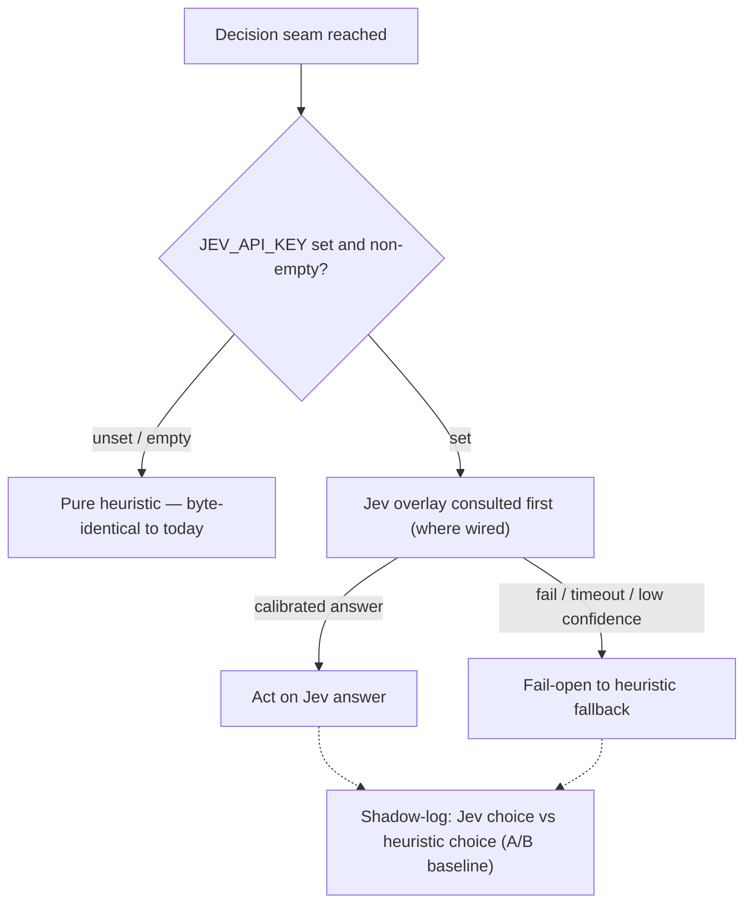

# Jev / System One Integration — Discussion Notes (Pre-Planning)

> **Status:** **DISCUSSION ONLY** — no pre-plan started, no implementation.
> **Date:** 2026-09-26
> **Repo state:** v0.15.0 @ `416ae70d` (snapshot system v1 present, merge `316a849b`)
> **Sources:** TypeSafe docs + code investigation (wanderer recon at HEAD)

All `file:line` anchors below are EXACT as verified against v0.15.0.

---

## 1. What Jev is

TypeSafe AI's **"System One"** model class — docs: `https://docs.typesafe.ai/concepts/system-one`; launch blog: `https://typesafe.ai/blog/introducing-system-one-models-and-jev`.

- **Non-autoregressive**; returns typed answers (boolean / classification / score primitives) **+ calibrated probabilities** — NEVER generated text.
- **Fast and cheap:** ~40–200× faster, 40–400× cheaper than frontier LLMs.
- **Confidence-thresholdable:** act when calibrated, escalate when not.

## 2. Governing principle (user-ratified 2026-09-26)

The heuristic/logic layer is the **PERMANENT default AND fallback**. Jev is an optional overlay, active only when env-configured — not all users will have the API (cost/setup). Recorded as project critical note `e5a37ed5`.

Concrete shape:

| Layer | Behavior |
|---|---|
| **Default (no env)** | Pure heuristic — byte-identical to today. `JEV_API_KEY` unset ≡ empty ≡ disabled (mirrors `OPENAI_MODEL_VISION` semantics) |
| **Env configured** | Jev consulted first where wired; heuristic fallback stays |
| **Call fails / times out** | Fail-open → heuristic; external API can never block dispatch/compaction/repair |
| **CI** | Green without key; each seam tested in BOTH modes (heuristic-only + Jev-active mocked) |
| **Heuristic layer** | First-class forever, never demoted to "legacy path" |

**Bonus:** heuristic-underneath = permanent shadow-logging A/B baseline (log Jev choice next to heuristic choice per seam before letting Jev win).

Per-seam dispatch shape under this principle:

## 3. Candidates REJECTED after code verification (v0.15.0)

| Seam | Why rejected |
|---|---|
| **Retry classification** (`daemon/llm_error_classifier.py`, wired `graph.py:8665-8667`) | Zero-LLM today: status-code sets {429,5xx,52x}, exception-type tuples, body regex, per-category budgets. Exact + infallibility-critical; ground truth lives in exception types |
| **Compaction message selection** (L1 `instance_messaging.py:1168`; L2 `graph.py:6318,6354`; L3 `compaction.py:2243-2300`) | Selection already pure heuristic (three-bucket partition, hoisting, 10-group window, ≥60% chunking). LLM only SUMMARIZES chunks = generation, outside Jev shape. Marginal gain only in compact-now-vs-defer scoring |
| **Snapshot L2 trigger-query generation** (`snapshot_embedding_service.py:388-458`) | Text GENERATION (novel user-style queries) — System One models don't generate |
| **Snapshot L1 digest generation** (`executor.py:612-672`) | Prose synthesis = generation, not classification |
| **Symptom ladder rungs** loop / truncated / empty (`graph.py:85,1142` / `:4271-4283` / `:4321-4350`) | Already exact deterministic detectors |

## 4. Ranked candidates

Context: snapshot system v1 added **47 decision sites** (~44 deterministic, 3 LLM, 1 embedding).

| Rank | Seam (anchors at v0.15.0) | Current mechanism | Jev shape | Value | Built-in fallback |
|---|---|---|---|---|---|
| **1 — PILOT** | Snapshot L3 stage-3 search selection — `snapshot_search_service.py:577-684` | LLM call temp=0, strict-JSON `{"selected":[ids]}` from top-20; **BLOCKS** `snapshot_search` tool return (only latency-sensitive LLM call in snapshot path); fail-soft to cosine order | A System One primitive already implemented with a System Two tool — same contract as typed ranking, ms latency | **HIGH**: visible latency win on every `spawn_hot_instance` search + LLM cost cut + smallest blast radius. NOTE: search also runs internally on every `spawn_hot_instance` without explicit `snapshot_id` (`limit=1`) | Cosine rerank order (already implemented, fail-soft) |
| **2** | LCA judge rescue-lane — `attestation_report_judge.py:703` (`judge_fused_bundle_async`, verdict `:468,551`; semantics `graph.py:5404-5440,5814-5871`) | LLM judge, strict-JSON binary complete/not_complete, 2-attempt budget + timeout env; judge is "a RESCUER, never the denier"; judge-silent → terminal WITHHELD (`9d83f224` semantics) | Calibrated P(complete): high-confidence band → rescue without LLM judge call; ambiguous → canonical LLM judge; NEVER a deny lane, NEVER substitutes withhold | **HIGH but governance-sensitive**: real judgment content, deletes 2-attempt HTTP/timeout budget; defer until after pilot | Canonical LLM judge path unchanged |
| **3** | Busy-slow arbitration (no classifier exists today) | Long-tool-nudge timer `long_tool_nudge.py:97,140-178` (900s default, clamp [60,1800]) tells parent "you decide" (`:887`); model-tier resolve `instance_lifecycle.py:1169-1201` | Typed score over {elapsed/threshold, model tier, LLM error count, loop-breaker misses} → auto re-spawn high-tier above confidence floor, else nudge parent as today | **MEDIUM-HIGH**: NEW capability (automates parent-LLM judgment), not just call replacement; bounded error cost (one wasted re-spawn) | Timer + parent judgment = exactly today |
| **4** | Ghost-promise detector | Substring phrase-match `graph.py:4191,4214,2479-2490` (carrier `:3882`), cap 3; LLM only summarizes (`engine.py:704-814`) | Calibrated classifier on trailing AI text | **MEDIUM**: fixes the one brittle detector in an otherwise-exact ladder; runs per-turn-end so Jev call needs gating/shadow-mode first | Phrase matcher |
| **5 (optional)** | R9 snapshot reuse verdict | Set-ops `snapshot_tools.py:365-381` (REUSE ⟺ same kind: tag AND overlap≥2 AND not expired) | Calibrated relevance score could raise warm-start hit rate | **LOW-MEDIUM**: current design deliberately prices missed-REUSE as cheap ("false REUSE costs a stale warm start; missed REUSE only costs one more capture") | Current conservative set-ops |

## 5. LCA governance rule (must survive into any future plan)

The `9d83f224` false-completion cycle just tightened judge semantics: judge-override → **loud** `completion_gate_escalated`; judge-silent → **withhold**, unbounded.

Any Jev touch must be **rescue-band ONLY**:

- Can only ADD completions the rescuer judge would, above high confidence floor.
- Every other band falls to canonical LLM judge.
- Gate stays **monotonically tighter-or-equal, never looser**.

## 6. Side findings (backlog, not Jev)

1. **L2/L3 snapshot LLM chains IGNORE `SNAPSHOT_MODEL` env** — trigger-query gen + search selection fall back to `gpt-4o-mini` (`snapshot_embedding_service.py:602-607`, `snapshot_search_service.py:732`) via independent chain (`config.chat_model ∥ llm_config.model ∥ gpt-4o-mini`). Operators pinning a cheap `SNAPSHOT_MODEL` don't get it there. (If Jev takes L3, the hot-path half of this evaporates.)
2. **No snapshot GC** — snapshots live forever. `CHECKPOINT_TTL_HOURS=168` (`constants.py:131`) only kills capture ability after checkpoint GC.
3. **Search blend is additive without rescale** (BM25 + cosine, `_TAG_OVERLAP_WEIGHT=0.5`, `snapshot_search_service.py:494,567`).

## 7. Recommended sequencing (if pursued later)

1. **Pilot: seam 1 (L3).**
2. **Then seam 3 (busy-slow)** as the new-capability follow-up.
3. **Seam 2 (LCA) last**, only with pilot learnings.
4. **Seams 4–5 optional.**

All behind master env gate + per-seam gates, default off, per §2.

## 8. Open questions (resume points)

1. Pilot pick: L3 first, or explore LCA rescue-lane despite the stakes?
2. Busy-slow: auto-execute re-spawn above confidence floor, or recommendation-only initially?
3. When resuming: formal pre-plan (planner workflow) for the chosen seam.

## 9. Snapshot system quick-reference (context for the doc reader)

Per-instance warm-start digests (R11 8-tuple); agent-tool-triggered capture only (`snapshot_create`); reads always-on; writes gated by the R15 settings toggle, default OFF; 5 statuses `running|active|superseded|failed|interrupted`; freshness fresh≤7d / stale 7–30d / expired≥30d computed, never stored; injection via `CONTEXT_KIND_SNAPSHOT_DIGEST`, capped 25k tokens; no tree-walk capture (Rev 5); kill-switches at `constants.py:222,226`.
