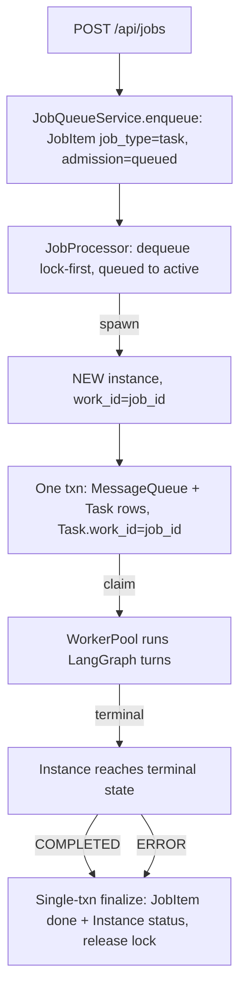
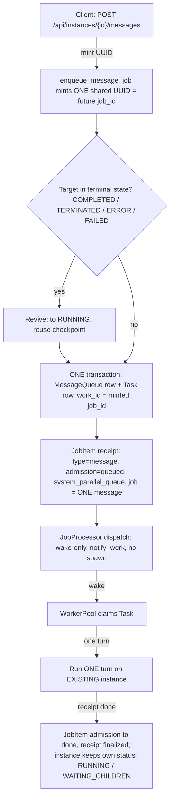

# Job-Task System — Core Module Reference

> **Status (2026-09-01):** The job-task system is a **critical core module** of ensemble.
> This is its canonical reference. The **Constitution** (§6), the **census gate** (§7), and
> the **fail-closed `work_id` contract** (§8) land on branch `feature/job-task-constitution-p0a`
> (Constitution Phase 0 + Fix A). Sections marked **[Fix A]** describe the post-Fix-A
> fail-closed contract; where the pre-Fix-A behavior differed, it is noted for context.

**Audience:** daemon developers and agents touching job dispatch, queue behavior, or any
`admission_state` write. Companion guides: [`docs/job-queue.md`](job-queue.md) (API surface),
[`docs/messaging-system.md`](messaging-system.md) (message paths),
[`docs/architecture.md`](architecture.md) (system overview).

---

## 1. Overview & Role

**The Job is the single public work primitive (JAFP — Job-as-Front-Primitive).** Every
public action that creates work enters the system as a JobItem. **Instances are the work
executors**: a JobItem never runs work itself — it admits work into a queue, and an
instance (spawned or existing) executes it.

Two consequences define the whole module:

- **Public entry points create JobItems** — the public APIs and system drivers (jobs
  API, message API, scheduler source, blueprint/knowledge/skill dispatchers, …).
  Internal paths — agent-to-agent `send_message`, cascade-resume, reports — use
  `enqueue_message` only and never create JobItems (§6, I4). The authoritative creator
  list is the `KNOWN_JOBITEM_CREATORS` census (§7), not this prose.
- **One stored lifecycle vocabulary.** JobItems carry the four-value `AdmissionState`
  (`QUEUED` | `ACTIVE` | `DONE` | `DEAD`,
  `daemon/repositories/job_queue/models.py`). The legacy six-value `JobStatus` enum was
  removed (Phase 7b); the legacy strings (`pending`/`processing`/`completed`/`failed`/
  `cancelled`/`dead_letter`) survive only as **API-facing derived values** via
  `_derive_legacy_status` (`daemon/services/work_status.py`), discriminated by
  `terminal_reason` for `done` rows. Write sites speak `admission_state` only.

| Concept | Role |
|---|---|
| JobItem | Public work order + admission lifecycle (queued → active → done/dead) |
| Task | Executable unit of a turn; linked to its driving job via `work_id` |
| Instance | The executor — owns the LangGraph checkpoint and instance status |
| MessageQueue row | Durable message record (always written, even when its Task is deferred) |
| Queue | Scheduling container (FIFO / PARALLEL), concurrency-limited, lock-first |
| Backstop lane | Sweeps + watchdog + RDRS — compensators, never primary authority (§5) |

---

## 2. Data Model & ID Linkage

### 2.1 Core tables

| Table | Key fields | Notes |
|---|---|---|
| `job_queue_items` (JobItem) | `job_id` (PK), `admission_state`, `job_type` (`task` \| `message`), `queue_id`, `instance_id`, `priority`, `terminal_reason`, `idempotency_key`, retry/DLQ fields | `admission_state` is the sole write authority. No FK to Task yet (Phase 5 defers it). |
| Tasks | `work_id` (unique, indexed), status, retry fields | `work_id` defaults to a minted UUID4 at construction — the default is a fallback, not a license (§8). |
| Instances | `instance_id`, `parent_id`, status | `parent_id` is **permanent** on the child row (survives terminate→revive); `instance_hierarchy` rows are transient. |
| `message_queue` (MessageQueue) | `message_id`, `instance_id`, status, source | Written unconditionally as a durable audit record. |
| `dependency_watchers` (DependencyWatcher) | `source_task_id` (child task), `target_instance_id` (parent instance), `state` | Parent-waits-for-children: `PENDING → FIRED \| CANCELLED` (atomic). The Dependency Bus is the **sole completion authority** for that mechanism. |

### 2.2 The linkage contract (I1)

For every **job-driven** dispatch:

```
Task.work_id == JobItem.job_id
```

This single equality is what recovery (`get_by_work_id(job_id)`), the work resolver, and
the orphan sweeps key on. §8 makes it fail-closed. Internal (non-job) paths have no
JobItem and legitimately self-mint a `work_id` — that is not a violation (§6, I4).

### 2.3 Queues

| Queue | Type | Concurrency | Default traffic |
|---|---|---|---|
| `system_fifo_queue` | FIFO | 1 | Serialized system work |
| `system_parallel_queue` | PARALLEL | 5 | **MESSAGE jobs** (message API resolves this queue by name) |
| `system_kb_fifo_queue` | FIFO | 1 | Knowledge-base work |
| `system_defer_queue` | — | — | Deferred work (idle-gated) |
| `system_background_queue` | — | — | Background work (idle-gated) |

These names are reserved; user queues cannot take them. Message-job concurrency is
enforced per queue — a FIFO queue at limit 1 serializes messages strictly.

### 2.4 Locks

Execution is **lock-first**: a job acquires a `job_locks` row before processing, which
prevents duplicate execution. Lock release is part of the Step-2 finalization transaction
(§3.1). Message jobs (`job_type='message'`) are pure mirrors — the PG trigger skips them
and they take no job locks.

---

## 3. The Two Dispatch Cases

Every JobItem is one of two kinds, and **the kind determines what the job means**. This is
invariant I3 (§6): missions are proxies, mirrors are receipts.

### 3.1 First-job (mission) — `job_type='task'`

The public API creates a job for an agent that has no live instance yet. The job
**spawns** the instance and its lifecycle is the instance's lifecycle: they terminate
together, in one transaction.



Key semantics:

- **Mission identity:** the spawned instance's first Task carries `work_id = job_id`.
  **[Fix A]** the dispatch must pass `work_id=job_id` explicitly; omission is rejected
  (§8).
- **Step 2 dual-write:** when the instance reaches a terminal state, the observer's
  `_finalize_job_db_sync` commits **one transaction** with (1) the job's terminal
  admission transition, (2) the instance status stamp (COMPLETED/ERROR), and (3) job-lock
  release. Partial states (job done but lock leaked, or instance terminal but job active)
  cannot persist — this is the "job lifecycle ≡ instance lifecycle" guarantee, atomic by
  construction since the 06-19 consolidation.
- A mission job mirrors instance liveness: while the instance runs (possibly for hours,
  across many turns and children), the job stays `ACTIVE`.

### 3.2 Message-job (mirror) — `job_type='message'`

A message sent to an **existing** instance via the message API. The job is a **receipt**
for exactly one message — not a lifecycle proxy. The instance's liveness lives on the
instance status, independent of the job.



Key semantics (`enqueue_message_job`, `daemon/services/instance_messaging.py` — the
"Option B" synchronous Task contract):

1. **One shared UUID is minted first** and becomes both `job_id` and `Task.work_id` —
   the linkage holds from birth.
2. **MessageQueue + Task rows commit before the JobItem exists.** If JobItem creation
   fails, the Task remains the authoritative work item and the caller gets the error —
   no half-visible receipt.
3. **Dispatch is wake-only.** The processor just calls `worker_pool.notify_work()` to
   surface the already-existing Task to a worker; no instance is spawned.
4. **`DONE` at task completion.** The job finalizes when its one Task finishes — the
   DependencyBus watcher lifecycle keeps it `ACTIVE` across inter-turn gaps while
   children are pending. The instance may live on (`RUNNING`, `WAITING_CHILDREN`) long
   after the receipt is `DONE`. Read models must treat these rows as receipts, not
   liveness signals (§6, I3; §5's f2 sweep is the compensator while the event-time
   mirror write is pending — structural fix B).

### 3.3 The revive path

`send_message` targeting an instance in `COMPLETED`, `TERMINATED`, `ERROR`, or `FAILED`
**revives** it: auto-transition to `RUNNING` and reuse of the existing checkpoint — the
same machinery as resuming a completed mission. Paused instances are exempt (pause is a
stronger state; §4.2). The dependency watcher re-registers on revival, so re-dispatch
needs no manual re-hydration.

Two revive-adjacent cautions (from the retrospective):

- **`parent_id` survives revive.** Query-time lineage is preserved; cascade cleanup
  drains correctly via transient `instance_hierarchy` rows.
- **Revived-instance-under-DEAD-job** is a legal combination (DLQ replay `dead→queued` ×
  instance revive). Renderers must not let instance liveness override a `DEAD` admission
  state for mission rows (§6, I5 hazard).

---

## 4. Lifecycle Flows

### 4.1 Admission-state machine

`daemon/services/job_state_machine.py` (`VALID_TRANSITIONS`) — the authoritative set:

| From | To | Meaning |
|---|---|---|
| — | `QUEUED` | create (enqueue) |
| `QUEUED` | `ACTIVE` | start (dequeue, lock acquired) |
| `QUEUED` | `DONE` | cancel while pending |
| `ACTIVE` | `DONE` | complete / fail / cancel / abort (terminal, `terminal_reason` set) |
| `ACTIVE` | `QUEUED` | retry (backoff scheduled) |
| `ACTIVE` | `DEAD` | dead-letter (retries exhausted) |
| `DONE` | `QUEUED` | replay from done |
| `DEAD` | `QUEUED` | replay from DLQ (the **only** `DEAD` exit) |
| `DONE` | `ACTIVE` | orphan-race post-commit re-arm (late-child re-open) |

Self-loops are tolerated idempotently by `validate_transition`. Any new writer of
`admission_state` must go through a registered authority (§6, I2; §7).

### 4.2 Queue → dequeue → dispatch → turn

1. **Enqueue** — public entry point writes the JobItem (`admission_state='queued'`) and
   notifies the dispatch bus.
2. **Dequeue (lock-first)** — the processor claims the job by acquiring its lock and
   transitions `queued → active`.
3. **Dispatch** — first-job: spawn instance with `work_id=job_id` **[Fix A: required
   explicitly]**; message-job: wake-only (§3).
4. **Turn** — a WorkerPool worker claims the Task and runs the LangGraph turn(s). The
   graph checkpoints at node boundaries; a task cancelled by pause stays `PROCESSING`
   (not `FAILED`).

### 4.3 Pause / resume (Pause-First Then Quiesce)

Features needing a quiescent instance follow: `pause_instance_cascade` **first**, then
bounded quiescence confirmation, then the state mutation, then resume.

- Pause cancels the in-flight graph task (`graph_task.cancel()`); LangGraph checkpoints
  at node boundaries freeze the turn at the last committed boundary.
- **Resume is DB-only** (`PAUSED → RUNNING`); the next dispatch with `is_retry=True`
  resumes from the checkpoint.
- A paused instance's non-defer job keeps `admission_state='active'` — pause is an
  instance concern, not an admission transition (there is no `paused` admission value).

### 4.4 Terminate / revive

Terminate finalizes the instance (and, for missions, the job via the Step-2 transaction).
Revive is §3.3: terminal → `RUNNING` + checkpoint reuse on the next `send_message`.
`parent_id` is permanent; `instance_hierarchy` rows are transient — lineage survives
revive, cleanup drains.

---

## 5. The Backstop Lane

The system accumulates **compensators** — periodic sweeps and watchdogs that repair
stale rows. Under the Constitution they are **never primary authorities**: they are
loss-recovery for rows the event-time path failed to finalize (§6, D2).

| Compensator | Class it repairs | Notes |
|---|---|---|
| Drift reconciler Patterns (a)–(e) | Assorted stale/terminal mismatches | Predates f-family |
| Pattern (f) — orphan ACTIVE jobs | Orphaned ACTIVE mission jobs | Default-ON; DEAD-finalizes ≤20 min |
| Pattern (f1) — orphan-active JobItem | `active` JobItem with **no Task linked via `work_id`** | Grace window + subtree-alive guard; kill-switch `ENSEMBLE_ORPHAN_F1_ENABLED` (default ON). Its `task is None` predicate assumes I1 — the 08-31 incident fired exactly when that assumption was false (see §8 history). |
| Pattern (f2) — mirror finalization | Message jobs the event-time path left `active` | Polls a bus-pending gate; structurally fragile for mirrors (no event fires → hours-late `DONE`). Retired by structural fix B when it lands. |
| WC watchdog (wedge/hang passes) | Wedged / hung instances | `instance/repository.py` wedge + hang passes |
| RDRS (5 lanes) | Lost/stuck report deliveries | `report_delivery_recovery.py` |

Operating rule: **if you find yourself adding a sweep, first ask why the event-time
write is missing.** The 09-01 retrospective's core finding is that every sweep family
member traces to a missing event-time write or an unenforced linkage — and each new
sweep + kill-switch compounds operability cost. New sweeps and predicate re-scoping are
constitutional events (§6).

---

## 6. The Constitution

Ratified 2026-09-01 from the drift retrospective (full history and evidence:
[§10](#10-where-the-full-history-lives)). Statuses are from the 09-01 census unless
marked otherwise; the **on-this-branch** column reflects Constitution Phase 0 + Fix A.

### 6.1 Never-drift invariants I1–I5

| ID | Statement | Census 2026-09-01 | On this branch |
|---|---|---|---|
| **I1** | `Task.work_id == JobItem.job_id` at every job-driven dispatch; handles mint **fail-closed** | **BENT** — WARN-only tripwire; auto-mint fallback alive; no FK | **Enforced** — Fix A rejects omission at job-driven dispatch; mint sites censused (§7, §8) |
| **I2** | One transition authority per `admission_state` class; others are idempotent-readers or **declared** subordinates (≤2 per class: owner + backstop) | **BROKEN** — 20 writers (function-level; 28 line-level writes)¹ (census:
`test_constitution_drift.py`), of which 9 are uncoordinated and 8 bypass `validate_transition`; an illegal `paused→done` exists | Unchanged (Phases 1–3 pending) — but every writer is now **visible** to the census (§7) |
| **I3** | Proxy-per-kind: missions proxy instance lifecycle, mirrors are receipts; **one meaning per state per kind** | **BROKEN** — mirrors lack an event-time terminal write; two read answers exist (receipt-truthmaker vs liveness-only-when-active) | **Closed by Fix B + Fix C (this branch)** — Fix B landed the event-time terminal write at `ProcessMessageProcessor.on_success` (T0); Fix C (`§8.2`) split the read-model surface into mission rows (one answer: `status`) and mirror rows (two answers: `status` + `mission_liveness`), with `job_type` as the discriminator. f2's mirror-slice finalization retired. The two-answers defect is closed: the renderer now reads one answer per question. |
| **I4** | Internal paths never create JobItems (JAFP boundary) | **BENT** — boundary held (zero internal creators) but convention-only | Now **censused** — `KNOWN_JOBITEM_CREATORS` makes the boundary machine-checked |
| **I5** | `DEAD` is terminal; corrections are additive | **TRUE** + hazard — `dead→queued` only via DLQ replay; no path re-opens wrongly-`DONE` rows; revived-instance-under-`DEAD`-job unguarded | Unchanged |

¹ **Census provenance (W4 adjudication, 2026-09-01):** The "22 writers" figure originates from the architect's wave-2 census on `latest @940e88b7`, reported in the I2 evidence column of `.agents/shared/planning/job-task-retrospective/drift-history-and-constitution.md`. The W1–W22 codes referenced there are **not a single pin-by-pin table** — they are scattered as inline name references in the planning doc (W1 = `repository.atomic_transition`, W2/W3/W4 = phase-2 routing, W5 = `_finalize_job_db_sync`, W6/W7 = lifecycle cascades, W13/W14 = DLQ, W20 = registered subordinate) and as `W-code` comments inside `daemon/job_state/constitution.py`. **No pin-by-pin diff table exists** in the planning tree; provenance for each W-code rests on the I2 evidence line and the constitution's neighbour-comments.

Source-verified reconciliation on this branch (`feature/job-task-constitution-p0a @ dc4e0c89`, post-Fix-A): `discover_admission_state_writer_paths()` finds **20 function-level entries** in source, **bidirectional-equal** to `KNOWN_ADMISSION_STATE_WRITERS` (zero gaps in either direction — verified via `tests/unit/job_state/test_constitution_drift.py::test_known_admission_state_writers_matches_source_exactly_no_drift`; census: `test_constitution_drift.py`). The same source tree contains **28 line-level writes** because several functions emit `SET admission_state` at multiple sites (e.g. `_finalize_job_db_sync`, `reconcile_turn_mirror`).

**Adjudication outcome — granularity, not gap:** 22 → 20 is a granularity / scope correction (census: `test_constitution_drift.py`), not an unregistered writer. Fix A (dc4e0c89) routed one previously-censused writer through the `enqueue_message_job` mint seam, removing an unmapped write site; the remaining 20 are now machine-checked. **No GAP — every census-referenced writer resolves to a registered entry.** The "9 uncoordinated" / "8 bypass `validate_transition`" / "5 bypass every guard" characterizations remain as the operational reading at `latest @940e88b7` and have not been re-measured on this branch; the I2 invariant stays **BROKEN** until Phases 1–3 land.

### 6.2 Evolution-allowed seams (no amendment needed)

- New **job_types** — *with creation-time kind declaration*: a truthmaker, an event-time
  writer, and a read branch. (A new type missing the event-time writer is precisely the
  07-03 mistake.)
- New queues; new mirror kinds under the same rule.
- Read projections that declare their authority + divergence bound.
- Tunables on registered subordinates.

### 6.3 Constitutional changes (amendment required)

Record amendments as ADR-style entries in
`.agents/shared/planning/job-task-retrospective/decisions.md`.

- Any **new `admission_state` writer**.
- Changes to **linkage semantics** (what `work_id` means / how it is minted).
- Changes to **terminal-state meaning**.
- **Re-scoping an existing sweep's predicate** — the 08-30 lesson: f1's `task is None`
  predicate silently assumed I1; promoting it to a default-ON primary transition fired
  on the first cycle.

### 6.4 Drift red lines D1–D4

Drift is too much the moment **any** of these is red — each is mechanically checkable:

| ID | Red line | Check |
|---|---|---|
| **D1** | **Writer registry** — every `SET admission_state` site resolves to a registered owner; ≤2 per class | Census test against `KNOWN_ADMISSION_STATE_WRITERS` (§7) |
| **D2** | **Event-time terminal rule** — every stateful row has an event-time terminal writer; a sweep is never primary, only loss-recovery for stale *unlabeled* rows | **Closed for mirrors by Fix B (this branch)** — `JobRepository.finalize_mirror_job_at_completion` is the event-time owner of `job_type='message'` rows; the f-sweep's mirror-slice retirement + the new `orphan_active_skipped_mirror_retired` detail prove the message row is no longer sweep-dependent. The disposition landed: the three pre-cutover legacy rows are reaped by `reap_legacy_mirror_zombies` (§8.1), and the no-age terminal-task backstop covers any missed inline transition. |
| **D3** | **One-answer rule** — every derived status names its truthmaker + direction + bounded divergence | **Closed by Fix C (this branch)** — the read model now answers "is the work done?" with two fields per mirror row, one per mission row (`status` + `mission_liveness`) keyed by `job_type` (mission vs mirror). The 28c6421b alarm-churn class is closed forward; the renderer no longer collapses two answers onto one ambiguous field. See §8.2. |
| **D4** | **Fail-closed handles** — `None` never auto-mints on a required job-driven path; every source `work_id` mint is a registration obligation | Review live mint sites; the subset-only `KNOWN_MINT_SITES` check (`KNOWN_MINT_SITES ⊆ source_mints`) prevents stale entries but does not enumerate every UUID call |

Retro-validation: D1–D4 would have caught every historical drift event at landing
(receipts-without-kind-split by D2; JAFP writer proliferation by D1; auto-mint by D4;
Pattern-f by D2+D4; dual read answers by D3). By 08-30 all four were red — and had been
red since at least 07-03. "How much drift is too much" is not an amount; it is these
four booleans.

### 6.5 Fix B — inline idempotent mirror transition (T0)

> Lands on this branch (`feature/job-task-fix-b`); supersedes the v1 §6.5 / D2 row
> marker ("fix B closes the current failure") with the actual close.

**The change in one line:** a message-mirror JobItem reaches
`admission_state='done'` at the moment its Task completes (T0) via an inline
idempotent transition in `ProcessMessageProcessor.on_success`; if that
window is missed, an un-aged terminal-Task backstop repairs the receipt
before f2's remaining task-type drift lanes. The f2 mirror slice itself
retires.

**Why this matters:** pre-Fix-B, the message-mirror JobItem was created eagerly
(job_type='message', admission_state='active'), then **no event-time writer
existed**. The f-sweep's 300s cycle tried to reconcile via polling predicates, but
the observer's bus_pending gate + the age floor + the instance-idle check meant a
parent with live children sat ACTIVE for ~7 hours after the Task completed (the
source of Incident B's 7-hour lag class). Fix B closes that class forward.

**Two parts:**

1. **Inline idempotent mirror transition** — `JobRepository.finalize_mirror_job_at_completion`
   in `daemon/repositories/job_queue/repository.py`. Called from
   `ProcessMessageProcessor.on_success` immediately after `TaskRepository.complete_task`
   commits. The transition:

   - Targets **only** `job_type='message'` rows. Mission (task-type) JobItems keep
     their bus-gated finalize (Mechanism B in the f-sweep design — wait for
     children, then drain); the inline transition is structurally wrong for
     missions.
   - Goes through `job_state_machine.validate_transition` BEFORE the SQL guard —
     the 8 legacy writers bypass `validate_transition`; this new writer is the
     example, not the bypass class.
   - Uses a guarded UPDATE: `WHERE job_id = :job_id AND admission_state IN
     ('queued','active')`. Rowcount == 0 is a silent `None` return (the core
     race-safety property) — exactly one writer wins, every other concurrent
     writer (the observer's `_finalize_job_db_sync`, `reconcile_terminal_task`,
     the instance-terminal cascade, `force_finalize_orphan`, f2's pre-retirement
     path) sees rowcount == 0 and no-ops.
   - Stamps `terminal_reason='completed'` (organic-style — closes the old cosmetic
     gap of empty `terminal_reason` on sweep-finalized rows).

2. **Liveness-gated sweep predicate** — `JobRecoveryService._pattern_f_orphan_active_job_recovery`
   in `daemon/services/job_recovery_service.py`. The f-sweep now explicitly skips
   `job_type='message'` rows at the top of its per-row loop, recording the skip as
   the new `orphan_active_skipped_mirror_retired` detail pattern. This is
   **observable**: a future regression that re-introduced f2's mirror finalization
   would silence this detail. TASK-type drift continues to flow through f1/f2
   unchanged.

**New registered writer (§7):** `daemon/repositories/job_queue/repository.py:finalize_mirror_job_at_completion`
— registered in `KNOWN_ADMISSION_STATE_WRITERS` on this branch. Census test
(`test_constitution_drift.py::test_known_admission_state_writers_matches_source_exactly_no_drift`)
proves bidirectionality.

**Acceptance test surface:** `tests/unit/job_queue/test_fix_b_inline_mirror_transition.py`
(unit, 13 tests) + `tests/integration/test_fix_b_inline_mirror_transition_incident_b.py`
(integration, 3 tests for the EXACT incident-B scenario) +
`tests/job_queue/test_orphan_active_job_recovery.py::TestFixBPatternFMessageSkipForMirrorSliceRetired`
(f-sweep contract, 2 tests).

### 6.6 ADR-MISSION-01 — Mission noun split (transport/work vocabulary + read projection)

> **Ratified 2026-09-02** from `.agents/shared/planning/mission-class/architecture-recommendation.md` §7.
> **Status: M1 landed (168c9448); M4(i)-HTTP pull-forward landed on `feature/mission-class` (§8.4); kill-switch default OFF; soak pending.** Mission-first cutover
> (M1 → M2 → M3) means consumers migrate BEFORE the wire rename lands; M3 is the rename.
> See "Directed modifications" below for the version-gate drop that supersedes one spec sentence.

**The amendment in three parts:**

1. **(I3 amendment — terminal-meaning)** The derived **WIRE** status of mirror rows
   (`job_type='message'`) in terminal-receipt state is **`settled`**. `completed` /
   `failed` / `cancelled` are work-outcome words owned by the **mission layer** (task
   rows and `mission_liveness`). Stored `terminal_reason` values are unchanged
   (internal discriminators, not wire vocabulary). **Per-kind dispatch in
   `_derive_legacy_status` is MANDATORY for any future job kind** (I3 extension).

2. **(D3 declaration — evolution seam, no amendment)** Mission (`MissionResolver`,
   mission fields, mission tools) is a **READ projection**: truthmaker = `Instance.status`
   (+ `admission_state='dead'` for the DEAD/W4 hazard); **direction = `instance → mission`**;
   **divergence = 0** (synchronous read-time consult; degradation contract
   `mission_liveness=None` unchanged, §8.2). Mission is a leaf service — **no writers**.
   Note: `mission_terminal_reason` does NOT read from `JobItem.terminal_reason` — that
   column is an internal discriminator (§6.7); the mission-layer terminal cause derives
   from `Instance.status` and `admission_state='dead'` directly, with DEAD admission
   overriding liveness (W4 hazard, see §8.3).

3. **(Boundary)** Mission storage remains constitutional (amendment required) until
   declared as an append-only `mission_events` event log under D's existing trigger
   (subordinate count >4 / family regrowth, or the N2 revive-boundary ticket). The
   census/writer count remains **frozen at 23** through M1–M3 (read-model + vocabulary only).

**Migration note — mission-first cutover (mandatory sequencing).** The M1 / M2 / M3
phases below are the constitutional migration path; the M3 wire rename is **EFFECTIVE M3,
not now** — the additive fields ship at M1, agent tools migrate at M2, the rename lands
at M3 only after consumers have moved off the old word.

| Phase | Scope | Effect on consumers |
|---|---|---|
| **M1** (this amendment's contract) | Additive `mission_id` / `mission_epoch` / `mission_terminal_reason` (§8.3) behind kill-switch `ENSEMBLE_MISSION_PROJECTION_ENABLED` (default OFF); FE re-anchor `mission-settled` → `mission-terminal` (CSS chain only, ~12–15 files); vocabulary table ratified (§6.7); this prose fix (line 909). | Zero impact — additive only, kill-switch OFF in prod by default; bit-for-bit wire stable. |
| **M4(i)-HTTP pull-forward** (2026-09-02, `feature/mission-class`) | `GET /api/missions` + `GET /api/missions/{mission_id}` — the mission projection's **HTTP debut** (§8.4), user-approved pull-forward of the M4(i) gated option (`architecture-recommendation.md` §5 M4 row: "HTTP `GET /missions` — gate on operator demand") ahead of the M2 agent tools. Read-only; same kill-switch; census stays at 23. | Zero impact while the kill-switch is OFF — both routes fail-closed to 404. |
| **M2** | Agent tools (`get_mission` / `await_mission` / `list_missions`) + structural guardrails (`outcome` token, `mission_ref` cross-ref, `watch_job(events='mission_terminal')`, `job_continue` mission-only gate); ari/jober prompt edits + `tools.allow` + minor version bump. **NUMBERING DISAMBIGUATION:** the spec's M2 = the *agent tools* milestone — NOT the HTTP surface. The `GET /missions` endpoint is the M4(i) pull-forward above (the implementation branch's "M2-API" label refers to its position as the second shipped deliverable of the mission program, not to spec-milestone M2). | Tools migrate BEFORE the wire rename; the wrong-predicate trap (ari/soul.md L71-79, jober/soul.md L9/L54 key decisions on a single ambiguous `status`) becomes structurally hard. |
| **M3** | Wire rename on mirror-receipt terminal status: `completed` → `settled` via per-kind dispatch in `_derive_legacy_status` on all 4 read surfaces — `WorkRecord` (work resolver, `work_resolver._job_to_record`), `JobResponse` (`routers/jobs_crud.py::_job_to_response`), `_ResolvedWork` (SSE payload, `routers/jobs_streaming.py::_ResolvedWork`), and the `routers/jobs_management.py` delegation surface (response constructed via `jobs_crud.py::_job_to_response`, per §8.2). `VALID_STATUS_VALUES`, FE switches, daemon filters, and docs are updated in this phase. | Mission tools (M2) and FE re-anchor (M1) are already in — at M3 time, no in-repo consumer treats mirror `completed` as outcome. |

**Why tools precede the rename (not the spec's original M2/M3 ordering):** ari/jober are
the burning consumer class — the ambiguity is live in their prompts today
(ari/soul.md L71-79, jober/soul.md L9/L54 key decisions on a single ambiguous `status`);
operators already have FE mission chips. Tools-first retires the actual pain first.

#### Directed modifications (override spec text)

- **The M3 one-release version-gate / dual-render window is DROPPED.** The wire rename
  ships CLEAN (no `api_version >= X` → `settled` branch, no legacy fallback in
  `_derive_legacy_status`). Rationale: mission-first cutover (M1 additive + M2 tools
  migration) already retires every in-repo consumer before M3 lands; a dual-render
  window is redundant. The per-kind dispatch is a one-line central change. The spec
  sentences in `architecture-recommendation.md` §5 (M3 row) and §8 risk-mitigation
  ("version-gate + one-release window") are **superseded by this amendment**.
- **Cross-spec drift (governance):** ADR-MISSION-01 lands as an untracked entry in
  `.agents/shared/planning/job-task-retrospective/decisions.md` (the canonical ADR
  log per §6.3). The ratified text in this section is the binding house record; the
  planning tree carries the same text for the worker chain. The "ADR home in
  `.agents/shared/planning/job-task-retrospective/`" referenced by §6.3 is the
  untracked log file at planning-tree time; the house record is this section.

### 6.7 Two-layer vocabulary (Transport × Work)

> Ratified 2026-09-02 from `.agents/shared/planning/mission-class/vocabulary-table.md` §1–§2.
> The constitutional binding glossary backing §6.6 ADR-MISSION-01. Post-M3 target state.

#### The table

| Layer | Vocabulary | Owner | Source of truth |
|---|---|---|---|
| **Transport — mirror receipts** (`job_type='message'`) | `queued` · `active` · **`settled`** · `dead` | Job (admission) | `AdmissionState` derivation, per-kind dispatch in `_derive_legacy_status` |
| **Transport — task jobs** (`job_type='task'`) | `queued` · `active` · `completed` · `failed` · `cancelled` · `dead_letter` (derived, as today) | Job (admission) — **their terminal IS the outcome** (task job = its own mission) | `_derive_legacy_status` unchanged for task rows |
| **Work / Mission** (projection over instances) | `pending` · `processing` · `paused` · `completed` · `failed` · `cancelled` | Mission | `Instance.status` canonicalized (`_STATUS_CANONICAL_MAP`); `cancelled` ←TERMINATED = true-terminal; `completed` = revivable |
| **Instance** (existing, untouched) | 10-member `InstanceStatus` enum | Execution | `daemon/repositories/instance/models.py:20-31` |
| **Internal discriminator** (NOT wire) | `completed` · `failed` · `cancelled` · `aborted` · `watchover_terminated` · `orphan_retired` · `orphaned_no_task` · `pattern_f1_orphan` | `terminal_reason` column | Unchanged; consumed by `_derive_legacy_status`; absorbed by Phase-4 StrEnum planning |

**Same-word-two-meanings (documented, by design).** `paused` / `completed` / `failed` /
`cancelled` appear on BOTH the work and instance layers by design — the mission layer
IS the instance's outcome vocabulary (`_STATUS_CANONICAL_MAP` is the canonical projection,
`cancelled` ←TERMINATED = true-terminal, `completed` = revivable; §8.2 value space).
The collision that mattered — mirror-receipt `completed` reading as outcome — is
**ELIMINATED** by §6.6 ADR-MISSION-01: `settled` is disjoint from every work and
instance value.

**Task-job `completed` STAYS** — a task job IS its own mission (delivery ≡ work); its
`completed` is the outcome, not a transport-receipt signal. Task rows are not touched
by the M3 wire rename; `VALID_STATUS_VALUES` keeps `completed` for `job_type='task'`
and gains `settled` for `job_type='message'`.

#### Why `settled` wins for the transport receipt terminal

| Candidate | Verdict | Decisive reason |
|---|---|---|
| **`settled`** | ✅ **WINS** | Receipt-not-outcome (payments/ledgers: final clearing, outcome-agnostic); idiomatic read-aloud ("the mirror settled"); short, chip-renderable; disjoint value space. |
| `handled` | ❌ | Generic verb-only; never a state value; no ledger weight. |
| `delivered` | ❌ | Collides with chat-SSE bubble vocabulary (`chat.component.ts:1460+`) and job-card tooltip prose. |
| `acknowledged` | ❌ | Engineering jargon; awkward chip noun; verb-used in blueprint tool output. |
| `responded` | ❌ | Outcome-adjacent (implies the agent replied = drifts toward work). |
| `dispatched` | ❌ | Sender-POV; heavily used as recipient-facing prose in instance tools. |
| `done_receipt` | ❌ | Cosmetic; fails read-aloud. |

**Industry grounding.** SQS Received/Deleted (receipt ≠ outcome), Celery STARTED/SUCCESS
(task = work), Temporal workflow-vs-activity split (two nouns for two layers — closest
structural analogue), HTTP 202 Accepted (accepted ≠ done), Kafka committed offset
(transport position). `settled` matches the payments/ledger convention where settlement
is finality OF THE EXCHANGE, not of the underlying business outcome.

**The `settled` half-claim (prerequisite, lands in M1).** FE already uses
`mission-settled` as the CSS class for mission-terminal chip styling
(`mission-liveness-chip.component.scss:28`, `job.model.ts:173/188/223/255/264`).
**M1 renames `mission-settled` → `mission-terminal`** — 3 identifier files renamed
in commit 73e7ac4d; counts at e676ddea: 78 occurrences across 36 files; ~40+ prose
occurrences remain FE-wide and are deferred to M3 with a ledger note. The FE
identifier-token guard test landing in `frontend/` this round covers identifier
tokens only — prose is excluded by design. After the M3 wire rename AND the prose
sweep complete, `settled` will have exactly one owner: transport. **Until both
land, the "exactly one owner" claim is an M3-target, not a present-tense fact** —
the prose half-claim is documented here as future-tense to prevent doc-truth rot.

---

## 7. The Census Gate (Phase 0)

Phase 0 ships the Constitution's teeth as **pure-add static sets + AST census tests**
(landing on this branch). No behavior change — immediate drift visibility.

### 7.1 The registry

`daemon/job_state/constitution.py` holds three code constants — the **source of truth**
(docs are asserted equal, never the reverse):

- `KNOWN_ADMISSION_STATE_WRITERS` — every site that writes `admission_state`
- `KNOWN_JOBITEM_CREATORS` — every site that creates JobItems (the JAFP boundary, I4)
- `KNOWN_MINT_SITES` — every site that mints a `work_id`/`job_id` handle (D4)

Writer and creator AST census tests are bidirectional: **every**
writer/creator site in the daemon resolves to a registered entry, and
**every** registered entry matches a live site. The mint AST check is
intentionally subset-only: it enforces
`KNOWN_MINT_SITES ⊆ source_mints`. General-purpose UUID mints also
appear in the source set but are outside the D4 registry, so live source
mints remain a registration obligation rather than an exhaustive
bidirectional census. The scanner must raise when it can read zero
sources (a silently-empty scan must never read as "clean").

The pack `test/packs/constitution_drift_test.sh` wraps the census for
CI-style runs. Its branch guard is opt-in: with `EXPECTED_BRANCH` unset
it prints a skip notice and runs on any branch; when set, a mismatch
fails fast.

### 7.2 How to register a new writer / creator / mint site

1. **Is it constitutional?** A new `admission_state` writer requires an amendment first
   (§6.3): add the ADR-style entry to the retrospective's `decisions.md`. New
   job_types/queues/projections (§6.2) are not constitutional — register directly.
2. Add the site to the matching `KNOWN_*` set in `daemon/job_state/constitution.py`.
3. Run the census-test regen one-liner (see the test module) to refresh the expected
   site list; the diff should show exactly your site.
4. Route the write through the registered authority where one exists (e.g.
   `validate_transition`); declare subordinates explicitly (owner + declared backstop,
   ≤2 per state class).

### 7.3 When `constitution_drift_test` fails

Triage depends on which set failed. **Do not blind-regen to silence a
failure** — that is how drift hides (the regen helper prints mint
output as hand-pick candidates for exactly this reason).

**Writers / creators (bidirectional):** a failure means an unregistered
writer/creator site exists (or a registered one went away).

- **New site you intended** → register it (§7.2), including the amendment if it is an
  `admission_state` writer.
- **New site you did NOT intend** → the change introducing it is drift; remove or
  reroute it. If it is a sweep-predicate re-scope, §6.3 applies.
- **Registered site disappeared** → the refactor deleted or moved a write; update the
  set deliberately and confirm the write still happens somewhere registered.

**Mints (subset-only):** the check enforces `KNOWN_MINT_SITES ⊆ source_mints`, so a
failure can ONLY mean a stale registration — a static entry whose source site no
longer exists (deleted or moved). A NEW unregistered source mint cannot fail this
test: it is a silent registration obligation — review the live mint sites (§6.3, D4)
and register it by hand only if it produces a `work_id`-shaped handle.

---

## 8. The Fail-Closed `work_id` Contract (Fix A)

> **[Fix A]** — post-Fix-A contract, landing on this branch. Closes the 4.5-month
> phantom-handle window (call site born 2026-04-19; `work_id` param added 06-27 but
> never threaded; full repair of all dispatch sites 09-01; Fix A removes the fallback).

**The contract:**

1. **Every job-driven dispatch MUST pass `work_id=job_id` explicitly.** The spawned /
   resumed Task's `work_id` is the driving JobItem's `job_id` — nothing else.
2. **Omission is rejected** (fail-closed). A job-driven path that arrives with
   `work_id=None` raises instead of minting a fresh handle.
3. **The auto-mint fallback is demoted to an error** on job-driven paths. (Pre-Fix-A:
   `if work_id is None: work_id = str(uuid.uuid4())` silently minted a phantom handle —
   the Task then existed but `get_by_work_id(job_id)` missed it, which is exactly what
   f1's predicate tripped on.)
4. **Internal paths self-mint legitimately.** Legacy `enqueue_message` callers have no
   JobItem; the Task mints its own `work_id` (I4 — internal paths never create
   JobItems). The mint sites are registered (§7) so this boundary stays visible.
5. **The linkage-contract tripwire is enforced on all four job-driven sites**
   (`_assert_linkage_contract`, `enforce=True`, hard raise). It compares
   the dispatch result's `job_id` against the driving JobItem and raises
   `LinkageContractError` on mismatch instead of warning.

Commit semantics differ: the omission raise (`work_id is None` with
`work_id_required=True`) fires before the enqueue transaction begins —
no row is written at all, so there is nothing to roll back — whereas a
result mismatch can be raised only after the enqueue commit and may
leave the committed row behind.

**Why fail-closed:** every recovery surface keys on `Task.work_id == JobItem.job_id`.
A minted-on-None handle makes the Task invisible to `get_by_work_id`, the work resolver,
and the orphan sweeps — silently. Rejection converts a silent invariant break into a
loud dispatch-time error.

---

### 8.1 Fix B — Inline Idempotent Mirror Transition (T0)

> **[Fix B]** — landing on branch `feature/job-task-fix-b`. Companion to Fix A:
> Fix A closes the linkage-phantom-handle window; Fix B closes the
> mirror-event-time-write window. Together they retire the 7-hour-lag class
> and the zombie-ACTIVE class.

**The contract:**

1. **Message-mirror JobItems reach `done` at T0.** The moment a
   `process_message` Task completes successfully, the driving JobItem
   transitions `admission_state IN ('queued','active','paused') → 'done'` with
   `terminal_reason='completed'`. The transition is **inline** (in
   `ProcessMessageProcessor.on_success`) and **idempotent** (rowcount == 0
   is a silent no-op). The `paused` member is retained as a defensive
   compatibility spelling for legacy/drift rows, normalized to the active
   branch for formal transition validation.
2. **Race-safe against every other writer.** The SQL guard
   `WHERE admission_state IN ('queued','active','paused')` ensures exactly one writer
   wins among: the inline transition at T0, the observer's
   `_finalize_job_db_sync`, `reconcile_terminal_task` (Step 4 post-commit),
   the F-1 `reconcile_terminal_message_mirrors` backstop, the instance-terminal
   cascade (`_terminate_instance_db_sync`), `force_finalize_orphan`, and f2's
   pre-retirement path. The losers all see rowcount == 0 and no-op.
3. **Mission (task-type) JobItems are NOT inline-transitioned.** They keep
   the bus-gated finalize path (`_finalize_terminal` after subtree drain).
   Scope discipline is the spec's hard rule (Part 1, §4).
4. **The transition goes through `validate_transition`.** The 8 legacy
   writers bypass it; the inline and F-1 writers are the examples, not the bypass class.
5. **The f-sweep's mirror slice retires.** The
   `_pattern_f_orphan_active_job_recovery` per-row loop now explicitly skips
   `job_type='message'` rows at the top, recording the skip as
   `orphan_active_skipped_mirror_retired`. TASK-type drift continues to flow
   through f1/f2 unchanged. The skip intentionally precedes the no-Task
   lookup, preserving the pre-B live-instance safety class while the F-1
   service leg provides the bounded residual repair.
6. **The F-1 backstop has no age floor.** The service periodically calls
   `JobRepository.reconcile_terminal_message_mirrors` for every non-deleted
   pre-terminal message mirror (``admission_state ∈ {queued, active, paused}``)
   whose linked Task is COMPLETED, FAILED, or CANCELLED.
   The mirror follows the Task at any age; the second call is idempotent.

**Registered writers (§7):**
- `daemon/repositories/job_queue/repository.py:finalize_mirror_job_at_completion`
  and `daemon/repositories/job_queue/repository.py:reconcile_terminal_message_mirrors`.
  The census gate
  (`test_constitution_drift.py`) is the live test — it goes red the moment an
  unregistered `admission_state` writer lands in source.

**D2 status change:** the "every stateful row has an event-time terminal writer"
red line flips from **RED** (07-03 → 09-01) to **GREEN** for message-mirror
rows (this branch). **Disposition of the previously-flagged 3 legacy zombie
ACTIVE mirror rows (a459e571, 5d1bd208, d23f5982): they are soft-deleted
tombstones — `deleted_at` set with `admission_state` frozen at `'active'` —
and sit OUTSIDE all reconciliation BY DESIGN.** Every reconcile query's
`deleted_at IS NULL` filter is deliberate, and the stored admission value is
a deletion-time snapshot, not a liveness claim. These 3 rows are **NOT**
reaped by `JobRepository.reap_legacy_mirror_zombies` and receive **NO**
`orphan_retired` stamp. The reap covers the **non-deleted** pre-cutover
zombie class — 0 candidates in prod today; its value is forward-looking
protection. See below.

**Mechanism — `reap_legacy_mirror_zombies` (leader decision, 2026-09-02):**

- **Predicate (all must hold):** `job_type='message'` AND
  `admission_state='active'` AND `created_at < CUTOVER` AND
  (linked `instance` is `None` OR `status` in
  `TERMINAL_INSTANCE_STATUSES`) AND (linked `task` is `None`
  OR `status` in `{COMPLETED, FAILED, CANCELLED}`) AND
  `deleted_at IS NULL` (soft-deleted mirrors are audit-only).
- **`terminal_reason = 'orphan_retired'`** — NOT `'completed'`.
  Rows this method reaps did not complete organically; audit
  truthfulness outweighs vocabulary consistency. **Scope: the stamp
  attaches ONLY to non-deleted rows the predicate matches — none
  exist in prod today, and the 3 soft-deleted tombstone rows never
  receive it** (the predicate's `deleted_at IS NULL` leg excludes
  them by design). **No enum CHECK exists yet
  (Phase 2 of the governance path introduces it); Phase 2's
  `terminal_reason` StrEnum MUST include `'orphan_retired'`.**
  Tracked in `docs/job-task-system.md` §6.4/§8.1.
- **Cutover bound:** `LEGACY_MIRROR_ZOMBIE_CUTOVER_ISO =
  "2026-09-02T00:00:00+00:00"` (pinned at module level in
  `daemon/repositories/job_queue/repository.py`). The leader's
  design note: "the merge-into-latest point; the merge hasn't
  happened, so pick and pin the constant now." The bound is
  a CONSTANT, not a config knob — pinning it in code prevents
  a config flip from silently widening the predicate to
  forward rows.
- **TEXT format assumption:** the predicate compares the stored
  `created_at` TEXT value lexically with this bound. Canonical
  `JobItem.created_at` writers use offset-aware ISO-8601 UTC strings;
  the comparison is therefore ordered only under that writer
  convention (no DB timestamp cast is introduced here).
- **Race-safe:** same guarded conditional-UPDATE shape as the
  inline writer (`WHERE admission_state='active'` is the
  authoritative boundary). `rowcount == 0` is a silent
  no-op. Goes through `job_state_machine.validate_transition`
  BEFORE the SQL guard (the example, not the bypass class).
- **D2-exempt:** legacy one-time reconciliation, NOT a
  load-bearing correctness sweep. Self-extinguishes on the
  cycle after the 3 rows are gone — forward rows have
  `created_at >= now()` which is past the bound, so the
  predicate never matches again. Periodic re-invocation
  from the existing maintenance cadence is silent and free.
- **Audit log:** an INFO log per reaped row carries
  `job_id`, `terminal_reason`, instance state, task state,
  and `created_at` for the audit trail. The service's audit
  pattern is `fix_b_legacy_zombie_retired`; the durable terminal
  reason remains `orphan_retired`. Separately, empty reconcile
  cycles now log at INFO (post-this-change), so the healthy-cycle
  heartbeat is visible at prod log level.
- **Invocation:** wired into the top of
  `JobRecoveryService.reconcile_drift_states` (the existing
  300s periodic cadence). Soft-fail: any exception is logged
  and the sweep continues with the regular patterns.
- **F-1 terminal-message-mirror backstop:** a separate,
  no-age leg scans every non-deleted pre-terminal message
  mirror (i.e. ``admission_state ∈ {queued, active, paused}``),
  keys it to its linked Task, and applies the same guarded
  ``(queued | active | paused) → done`` writer when that Task
  is in `{COMPLETED, FAILED, CANCELLED}`. This closes the crash
  window after Task completion and the `[cutover → deploy]`
  straggler window. It is permanent and idempotent: the Task
  is the receipt's truthmaker, so the mirror follows it at any
  age. Live/absent Tasks and task-type mirrors are excluded.
  The repository is
  `JobRepository.reconcile_terminal_message_mirrors`; the
  service runs it before Pattern (f)'s terminal-task lanes.

**Registered writers (§7):**
- `daemon/repositories/job_queue/repository.py:reap_legacy_mirror_zombies`
  and `daemon/repositories/job_queue/repository.py:reconcile_terminal_message_mirrors`
  were registered in this round (22 → 23 writers,
  bidirectionally census-clean; census:
  `test_constitution_drift.py`). The reap is the declared
  one-time repair for pre-cutover zombies; F-1 is the permanent
  loss-recovery seam for missed inline writes.

**Acceptance test surface:** `tests/unit/job_queue/test_fix_b_legacy_zombie_reap.py`
(unit, 28 collected cases on this round) — covers every predicate dimension
(`wrong_job_type_not_reaped`, `non_active_admission_not_reaped`,
`post_cutover_not_reaped`, `live_instance_not_reaped` +
parametric over `ALIVE_INSTANCE_STATUSES`, `live_task_not_reaped` +
parametric over `{PENDING, RUNNING}`, `terminal_instance_statuses_all_match` +
parametric over `TERMINAL_INSTANCE_STATUSES`,
`terminal_task_statuses_all_match` + parametric over
`{COMPLETED, FAILED, CANCELLED}`); happy path
(4 tests including `test_reaps_legacy_message_zombie_with_absent_instance` —
the EXACT prod shape); `validate_transition` path tests
(2 tests, same assertion style as
`test_fix_b_inline_mirror_transition.py::test_illegal_transition_raises_and_blocks_write`);
self-extinguishing shape (2 tests); argument validation (2 tests);
cutover-constant pin (1 test); plus three exception-containment cases.
+4 legacy suite = 3 negative-path containment tests + live-status parametrize 4→5.

---

### 8.2 Fix C — Read-Model Liveness Consult + Mission/Mirror Rendering Split

> **[Fix C]** — landing on branch `feature/job-task-fix-c`. Closes the
> 28c6421b alarm-churn read-model class (H2 dominance in the
> retrospective; I3 + D3 in the Constitution). Fix A + Fix B close the
> write-side defects; Fix C closes the corresponding read-side
> divergence so the alarm churn is no longer a class.

#### The split

Two additive fields land on every read-model surface (WorkRecord +
JobResponse + the SSE `_ResolvedWork` payload):

| Field | Type | Source | Meaning |
|---|---|---|---|
| `job_type` | `str \| None` | `JobItem.job_type` | JobItem-side discriminator: `"task"` (mission) or `"message"` (mirror). `None` for Task-backed records. |
| `mission_liveness` | `str \| None` | `Instance.status` (canonicalized) | Canonical status of the linked instance. **Populated ONLY for mirror rows**; `None` for mission rows and for degraded lookups. |

Both fields preserve every existing `status` value bit-for-bit —
consumers that branched on the previous single answer are
unaffected. The split answers the previously-ambiguous question
"is the work done?" with **two per mirror row, one per mission row**:

* **`status`** — the same answer as before. For mission rows this
  is the lifecycle status (Phase 1, Job as Queue Proxy); for mirror
  rows this is the receipt status (the message was handled at T0).
* **`mission_liveness`** — for mirror rows, the canonical status of
  the linked instance. For mission rows it stays `None` (the row's
  own `status` IS the liveness signal — the two fields would be
  redundant).

The renderer (FE work-view) branches on `job_type` to pick the
right semantic:

| `job_type` | `status` means | `mission_liveness` means | Read together |
|---|---|---|---|
| `"task"` (mission) | Lifecycle of the spawned instance | `None` (redundant) | One answer (the row IS the mission). |
| `"message"` (mirror) | Receipt — was the message handled? | Lifecycle of the parent instance | Two answers; both required to render correctly. |

#### The 28c6421b read, closed

Before Fix C, a mirror JobItem in `admission_state='done'` (Fix B's
inline idempotent transition at T0) beside an instance still in
`status='running'` rendered as **two `completed` rows**. The user
read the pair as "everything finished" — the alarming 52-min
live window the SSE work-view first surfaced on 09-01.

Post-Fix-C, the same pair renders as one `status='completed'` mirror
with `mission_liveness='processing'` — the renderer can now show
"message handled, parent mission still running" without false-
"everything finished" claims.

#### The liveness consult — degradation contract

`_job_to_record` consults the linked `Instance` row's `status` for
mirror rows regardless of the mirror's own admission state. This
is the Part 1 liveness consult.

**Batch-shape (the perf hard requirement):** the existing
`_batch_instances` (one `SELECT … WHERE instance_id IN (…)`) is
reused to surface `instance.status` for both the existing
`status` derivation AND the new `mission_liveness` field. No
new queries are added — the per-page instance fetch that already
runs is reused for both fields. The single-row `resolve_work`
path falls back to `_lookup_instance` (one query); a degradation
contract (instance lookup failure → `mission_liveness=None`,
warn + fall back per the message_metadata precedent) keeps the
read path soft-failing on transient DB errors. The batch path
is protected by the same `SQLAlchemyError → warn + return {}`
guard (W-1 fix; `daemon/services/work_resolver.py`), so a
transient instance-engine outage degrades the WHOLE page to
receipt-only view (every mirror's `mission_liveness=None`,
every mission's `status` from the JobItem mirror) instead of
500-ing `list_jobs` / `list_work`.

The contract:

* **Instance lookup OK** → `mission_liveness = canonicalize_status(instance.status)`.
* **Instance lookup fails (transient DB error)** → log a warning,
  return `mission_liveness=None`; the renderer falls back to the
  receipt-only view (current pre-Fix-C behaviour stands).
* **No linked instance** (`job.instance_id IS NULL` — queue-stage
  row) → `mission_liveness=None`.
* **Mission row** (`job_type='task'`) → `mission_liveness=None`
  (the field would be redundant; the row's `status` IS the
  liveness signal).

`mission_liveness=None` is documented here as
**indistinguishable-by-design** across the four cases above (no
mission row / mission row / degraded single-row lookup / degraded
batch lookup) — the renderer cannot tell from the wire whether
the absence is structural (mission row) or a lookup failure
(transient DB error on the instance engine). A future renderer
that needs to surface the lookup-failure case for operator UX
would add a NEW spec'd additive field (not mutate the meaning
of `None`); for now the renderer treats all `None`s as
"split semantics unavailable, fall back to receipt-only view"
(see the comments at `_job_to_response` in
`daemon/routers/jobs_crud.py`).

#### The value space

`mission_liveness = canonicalize_status(instance.status)` reads
ONLY the `Instance.status` column, so its non-`None` value space
is exactly the canonical projection of the 10 `InstanceStatus`
enum members (`daemon/repositories/instance/models.py:20-31`):

```
mission_liveness ∈ {pending, processing, paused, completed, failed, cancelled}
```

The active cluster (`waiting` / `waiting_children` / `idle` /
`queued` / `running`) collapses onto `processing` per
`_STATUS_CANONICAL_MAP` — the resolver's POV treats these as
non-terminal "work is happening" states, with finer-grained
detail reserved for the Instance detail view. `pending` is
the only member of the ratified value space that has no
current `InstanceStatus` source member — it remains in the map
for forward-compat (Task-side canonical source), and a future
`InstanceStatus.PENDING` enum addition would make it
reachable from the instance-status domain.

`dead_letter` exists in `_STATUS_CANONICAL_MAP` for job-row
admission states; it is unreachable from the instance-status
domain `mission_liveness` reads (every `instance.status` write
in the codebase uses `InstanceStatus.X.value` for X in
{IDLE, RUNNING, WAITING, PAUSED, COMPLETED, ERROR, TERMINATED,
QUEUED, WAITING_CHILDREN, FAILED} — verified by grepping all
`instance.status = …` assignments under `daemon/`; the
`SQLModelInstanceRepository.update()` method explicitly rejects
`status=` kwargs and routes them through
`transition_status_if`, which only accepts valid enum values).
The D3 single-answer rule (one canonical answer per question) is
honored: the renderer never has to pick from more than 6
non-`None` canonical values, and a future renderer that needs
the distinction (e.g. "is this a child waiting on the parent?"
vs "is the parent actively running?") MUST add a NEW spec'd
additive field — never mutate the meaning of an existing
canonical value in place.

#### The W4 hazard — preserved

A DEAD mission row's derived `status` is hard-coded to
`"dead_letter"` regardless of the linked instance's status. The
DLQ-replay × instance-revive combination can legally produce a
revived instance under a DEAD job (a legal combination, not a
bug); the renderer must NOT let instance liveness override DEAD
for mission rows.

Mirrors in `admission_state='dead'` (`dead_letter` status) STILL
get a `mission_liveness` value — the receipt-vs-mission split
applies (the dead-lettered mirror beside a revived instance is a
legal orthogonal case the renderer must surface to the operator).
The mission-row W4 guard is unaffected.

#### The split-semantics consistency contract

The split-semantics read surfaces MUST agree on the split
semantics; the DLQ surface is an orthogonal DeadLetterItem
projection and does not consume these fields:

1. **`work_resolver._job_to_record`** (primary, `WorkRecord`) —
   rows are built from the resolver's pre-fetched `instance`
   (batched path) or a single `_lookup_instance` (single-row
   path).
2. **`routers/jobs_crud.py::_job_to_response`** (`JobResponse`)
   — sources `job_type` and `mission_liveness` from the
   resolver-supplied `WorkRecord` when one is available; in
   the batched `list_jobs` path, a JobItem whose row was
   filtered out by `list_work` (e.g. `root_only` drop, status
   mismatch) has no `WorkRecord` — the legacy fallback
   sources `job_type` from `JobItem.job_type` and leaves
   `mission_liveness=None` (documented consumer contract:
   treat `None` as "split semantics unavailable, fall back to
   receipt-only view").
3. **`routers/jobs_streaming.py::_ResolvedWork`** (SSE payload
   — NOT a `JobResponse` schema) — emits both fields on every
   SSE payload (`connected` / `status_update` / `completed`).
4. **`routers/jobs_management.py`** (delegation, `JobResponse`)
   — delegates response construction to `_job_to_response`
   from `jobs_crud.py` (DRY: the split is defined once at the
   `_job_to_response` seam).

The DLQ surface (`routers/dlq.py`) is **out of scope** for this
contract — it is an orthogonal `DeadLetterItem` projection
(`dlq.py:215-224`) using its own `_dlq_to_response` /
`DLQItemResponse` over `DeadLetterItem` rows, and does not
delegate to `_job_to_response` nor consume the split-semantics
fields. Operator liveness needs that surface these fields would
be a separate spec.

#### Test surface

`tests/unit/services/test_fix_c_read_model_split.py` (unit, 18
tests) covers:

* `WorkRecord` defaults + `to_dict()` additive contract.
* The exact 28c6421b read reproduced and closed
  (`test_mirror_done_with_live_mission_shows_mission_still_running`).
* Mirror-on-terminal-mission (the contrasting positive case).
* Mirror-on-DEAD-with-revived-instance (the DLQ-replay × revive
  orthogonal case).
* Mission-DEAD never overrides to instance liveness (W4 hazard).
* Degradation contract (`SQLAlchemyError` → `mission_liveness=None`).
* `list_work` batched shape — `job_type` / `mission_liveness` on
  every record with bounded instance-repo query count (no N+1
  regression on the mirror branch).
* `JobResponse` schema additive contract.
* `_ResolvedWork` SSE payload contract (both `to_payload` and
  `to_completed_payload` emit the new keys).

Two pre-existing pin tests are extended (additive contract):

* `tests/unit/routers/test_jobs_streaming_resolver.py` —
  `test_completed_job_via_resolver_emits_terminal_events`
  now includes `job_type` and `mission_liveness` in the
  expected payload key set.
* `tests/unit/routers/test_work_router.py` —
  `test_response_field_shape` likewise includes both keys.

No existing `status` value is renamed, removed, or recased.

#### D3 status change

The D3 ("one-answer rule — every derived status names its
truthmaker + direction + bounded divergence") red line flips
from **RED** (07-03 → 09-01) to **GREEN** for the work/job read
model. The post-Fix-C read model has **ONE answer per question**:

* "Is the mission done?" → `status` (mission row) or
  `mission_liveness` (mirror row).
* "Was the message handled?" → `status` (mirror row).

The two questions map to two fields; the renderer no longer
collapses them onto one ambiguous answer.

#### FE rendering contract (consumption of the split)

The Angular frontend consumes the split on every surface where job
rows render. Two additive optional fields on the FE `Job` / `Work`
models (`frontend/src/app/models/job.model.ts`,
`work.model.ts`) carry the wire values through unchanged; all
rendering decisions branch on the pure model helpers
(`isReceiptRow`, `isLiveMissionLiveness`, `missionLivenessChip`) so
the four wire cases have exactly one behaviour each:

| Wire case | FE rendering |
|---|---|
| Mirror + live mission (`job_type='message'`, `mission_liveness ∈ {pending, processing, paused}`) | "message" receipt chip **and** a live `mission: <value>` chip (blue/amber tint, spinning sync icon). Reads as "handled · mission still going" — never as bare "completed". |
| Mirror + terminal mission (`mission_liveness ∈ {completed, failed, cancelled}`) | "message" receipt chip **and** a muted `mission: <value>` chip (check icon, mission-terminal style). Distinct styling from the live case. |
| Mission row (`job_type='task'`) | **Nothing extra.** The row's own status chip already IS the liveness answer. |
| `mission_liveness=None` (degraded lookup / no linked instance / Task-backed record) | **Nothing extra.** `None` is indistinguishable-by-design; the FE never invents a state for it and falls back to receipt-only semantics. |

`job_type` is set at row creation (mirror rows never become mission rows), so the work-update SSE patch path carries only `mission_liveness` (see `JobsComponent.updateJobFromSse` in `jobs.component.ts`). The patch uses present-as-null semantics on both the `jobs[]` and `works[]` paths: an explicit `null` in the payload CLEARS the field (degraded lookup), an absent key KEEPS the previous value (stale-tolerant).

Canonical values are used verbatim — the FE never recases,
translates, or fabricates a `mission_liveness` value, and the
live/terminal style split is the only FE-side interpretation.

Rendering surfaces: the Jobs page cards (both the Queues view via
`/api/jobs` and the All Work view via `/api/work`, whose
`Work → Job` mapper passes both fields through), the badge
dropdown's Recent rows (`job-queue-panel`), and the detail drawer.

**The badge (`job-queue-indicator`).** The header badge keeps its
existing intake count (`running/total non-terminal`) as the primary
reading, and gains mission awareness derived from data it already
polls (`listActiveJobs` + `listRecentJobs` — no new endpoints, no
extra requests): a terminal mirror row whose `mission_liveness` is
live proves its parent mission is still working. Since the resolver
computes `mission_liveness` read-time, receipts in the recent window
always carry the CURRENT instance status. Three display states:

1. **Jobs present** → `X/Y` unchanged (tooltip additionally reports
   live missions when any exist).
2. **0 non-terminal JobItems + N ≥ 1 live missions** → the badge
   shows `missions: N` in the live blue with a pulse dot instead of
   a bare `0/0` — a visibly-working mission leader no longer reads
   as "system idle". Tooltip explains both numbers:
   `Running: 0 / Pending: 0 · Live missions: N (messages handled;
   parent missions still working)`. The dropdown panel mirrors this
   (live-missions pill in the header; the empty state reads
   "Queue is idle · N live mission(s) still working").
3. **0 jobs + 0 live missions** → bare `0/0`, muted idle styling.

Live missions are de-duplicated by `instance_id` (many receipts per
mission, one mission). Known bound: the derivation scans the
already-polled recent terminal window (limit 10), so a leader that
emits no receipts after nine newer terminal rows have landed can
transiently read idle until its next receipt — the receipt is
evicted at the 10th newer terminal row. This is inherent to the
poll-based derivation; surfacing it would require a new spec'd
aggregate field on an existing endpoint, not a mutation of these
two fields.

---

### 8.3 M1 — Additive Mission Response Contract (kill-switched)

> **M1 landed (168c9448); kill-switch default OFF; soak pending.** The additive fields
> ship behind kill-switch `ENSEMBLE_MISSION_PROJECTION_ENABLED` (default OFF); the
> remaining work is the operator soak that flips it ON. Authoritative cross-ref:
> §6.6 ADR-MISSION-01, §6.7 vocabulary table.

#### The contract

The four read-model split-semantics surfaces (§8.2 split-semantics consistency contract —
`WorkRecord`, `JobResponse`, `routers/jobs_streaming.py::_ResolvedWork`,
`routers/jobs_management.py` delegation) additionally carry three mission fields
**when the kill-switch is ON**:

| Field | Type | Source | Meaning |
|---|---|---|---|
| `mission_id` | `str` | `Instance.instance_id` | Mission identity. `mission_id == instance_id` (one mission per instance, epoch-framed — §6.6 identity verdict). Present for mirror rows (`job_type='message'`); **equal to `instance_id`** for mission rows (`job_type='task'`), since task rows ARE their own mission. |
| `mission_epoch` | `int` (constant 1 until M4(ii); `None` only on degraded lookups) | Derived from `Instance.status` | **Constant 1 for every non-degraded projection** until M4(ii) ships `mission_events` to track real epoch history. NOT `None` when terminal — a fully terminal instance with a non-degraded lookup still emits `mission_epoch=1`. `None` is reserved for degraded lookups (single-row / batched `SQLAlchemyError` per §8.2 degradation contract) and the pre-spawn queue stage where no instance is yet bound. |
| `mission_terminal_reason` | `str \| None` | Derived from `admission_state='dead'` + instance liveness (W4 hazard preserved: DEAD admission overrides liveness for this field) | Populated per the current implementation — **NOT mirror-only**: when the linked instance is in a terminal state (`{completed, failed, cancelled}`) OR the JobItem is in `admission_state='dead'`, the field carries the terminal cause. W4 intent kept: a mirror row whose parent mission is still live but whose own admission is `dead` stamps the dead-side terminal cause (DEAD admission overrides instance liveness for this field). `None` for live missions and degraded lookups. Mission rows (`job_type='task'`): redundant with the row's own `terminal_reason` and therefore `None` (the row IS its own mission — "task job `completed` STAYS", §6.7). The attribution is **not** to `JobItem.terminal_reason` — that column is an internal discriminator consumed by `_derive_legacy_status` (§6.7); `mission_terminal_reason` answers the mission-layer question and reads from instance + admission state directly. |

All three fields are **additive** (no existing field renamed or repurposed) and
**preserve the existing `mission_liveness` semantics bit-for-bit** (§8.2 value space
and degradation contract unchanged). The §8.2 "one answer per question" guarantee is
preserved: `mission_liveness` still answers work-outcome liveness; the three new
fields answer the **identity, lifetime framing, and terminal-cause** of that mission —
distinct questions that the previous single-field answer could not separate.

#### Null-vs-absent semantics (consistent with §8.2)

Per the §8.2 split-semantics consistency contract, the SSE patch path uses
present-as-null on both `jobs[]` and `works[]` paths: an explicit `null` in the
payload CLEARS the field (degraded lookup); an absent key KEEPS the previous value
(stale-tolerant). The three mission fields inherit this contract:

- **Explicit `null`** in the payload (any surface, batched or single-row) → renderer
  CLEARS the field; falls back to "split semantics unavailable, receipt-only view"
  (mirrors §8.2 `mission_liveness=None` semantics).
- **Absent key** in the patch payload → renderer KEEPS the previous value
  (stale-tolerant); does NOT invent a value.
- **`mission_liveness=None` is still indistinguishable-by-design** across the four
  §8.2 cases (no mission row / mission row / degraded single-row lookup / degraded
  batch lookup). The three new fields do not change that — adding a renderer that
  needs to surface the lookup-failure case requires a separate spec'd additive
  field, NOT a mutation of `None`'s meaning (§8.2 future-renderer tripwire).

#### Kill-switch

| Env var | Default | Effect |
|---|---|---|
| `ENSEMBLE_MISSION_PROJECTION_ENABLED` | `0` (OFF) | When OFF, the three mission fields are **omitted from every read-surface payload** (key absent on the wire — NOT `null`; absent = "stale-tolerant keep" per the SSE patch contract). When ON, the three fields are populated for every row that has a mission reference. |

The kill-switch default is OFF at landing; a documented soak cycle (operator action)
flips it to ON. This matches the repo's kill-switch precedent for staged contract flips
(e.g. `ENSEMBLE_WC_WAKE_ENQUEUE` per the standing ledger). **Pending operator action:**
flip `ENSEMBLE_MISSION_PROJECTION_ENABLED=1` after ≤2-week soak or on incident; OFF
is the instant revert path.

#### Migration sequencing (consistent with §6.6)

1. **M1 (this section)** — additive fields land behind kill-switch OFF; FE re-anchor
   (§6.7); vocabulary table ratified. **Bit-for-bit wire stable** when kill-switch is OFF.
2. **M2** — agent tools (`get_mission` / `await_mission` / `list_missions`) consume
   the three fields; structural guardrails (`outcome` token, `mission_ref` cross-ref).
3. **M3** — wire rename on mirror-receipt terminal status (`completed` → `settled`)
   per §6.6 I3 amendment. At M3 time, mission tools (M2) are already migrated; the
   rename ships clean.

The §8.2 split-semantics surfaces are NOT modified to carry `mission_id` /
`mission_epoch` / `mission_terminal_reason` until the kill-switch flips ON; until then,
the additive fields are documented-but-absent (consistent with the SSE patch
absent-keep semantics).

### 8.4 M4(i)-HTTP — `GET /missions` Endpoint Contract (pull-forward, kill-switched)

> **Landed on `feature/mission-class` (2026-09-02) — the user-approved pull-forward of
> the M4(i) gated option ("HTTP `GET /missions` — gate on operator demand",
> `architecture-recommendation.md` §5 M4 row) ahead of the M2 agent tools.** The spec is
> SILENT on this endpoint's list contract — the "W2 design" referenced by the planning
> tree's approach-comparison is NOT in the tree. Every list-contract choice below is a
> **pre-directed improvisation** and is marked **[FLAGGED]**; zero silent deviations.
> Read-only throughout: `MissionResolver` stays a leaf READ service, no JobItem
> creation, no admission-state writes — the census stays **frozen at 23**.

#### The routes

Both routes live in `daemon/routers/missions.py` (`APIRouter(prefix="/missions")`,
mounted under `/api` next to `work_router` in `daemon/api.py`), wired via the
queues/work DI pattern (`set_missions_resolver` + `get_missions_resolver` 503 factory)
against the same READ-only `InstanceRepository` / `JobRepository` the
`WorkResolverService` consumes.

| Route | Source path | Contract |
|---|---|---|
| `GET /api/missions` | `MissionResolver.resolve_page()` (new paged batch path) | Paged list of ALL instances' missions. ``resolve_page``'s production debut, page-shaped; ``resolve_many`` remains tests-only. |
| `GET /api/missions/{mission_id}` | `MissionResolver.resolve()` — the dead-link pre-fetch path | Full `MissionRecord` incl. `epoch` + `terminal_reason` (§8.3 semantics). MUST NOT route through `project()` — its `dead_linked=False` default is the S4 bug class (a DEAD linked JobItem would surface `failed` instead of `dead_letter`). Unknown id ⇒ 404. |

Wire schemas (`daemon/routers/schemas.py`): `MissionResponse` mirrors `MissionRecord`
field-for-field (`mission_id`, `agent_id`, `parent_mission_id`, `liveness`,
`terminal_reason`, `epoch`, `linked_jobs`, `started_at`, `last_activity_at`);
`MissionListResponse` is the list envelope.

#### Kill-switch gating — [FLAGGED: spec-silent OFF behavior]

| `ENSEMBLE_MISSION_PROJECTION_ENABLED` | List route | Detail route |
|---|---|---|
| OFF (default) | **404** | **404** |
| ON | normal contract | normal contract |

Fail-closed by design: a DEDICATED endpoint must not answer `200 []` while disabled
(an empty page is indistinguishable from "no missions exist" — the §8.2
absence-must-be-explicit lesson), and must not 500. Routes stay REGISTERED while OFF
(OpenAPI still documents them). The gate is in-handler, but it runs **after** FastAPI's
`Depends` resolution — an **unwired resolver answers 503 even when OFF** (Depends
resolves the resolver singleton before the handler body executes; lifespan guarantees
wiring in production/tests, so 503 is unreachable in those environments). The kill-
switch wins only once the resolver is wired — that ordering is the caller-adjudicated
contract; an OFF-but-unwired dep stays a 503, not a 404. This is a task-directed choice
— the spec's kill-switch section (§8.3) only covers the additive fields on the four
Fix-C surfaces.

#### List contract (all choices [FLAGGED] — spec-silent)

- **Scope: ALL instances' missions.** One mission per instance, identity =
  `instance_id` (§6.6 identity verdict). NO implicit non-terminal default, NO
  leader/root filtering. Subtree filtering is a CLIENT-side concern:
  `parent_mission_id` is carried on every record and client-side tree-filtering on it
  is the sanctioned pattern.
- **Ordering: `last_activity_at DESC NULLS LAST`, deterministic tiebreak
  `mission_id` ASC** (= `instance_id` ASC) — applied IN SQL, never a Python-side sort
  of the full table. Backend-internality caution: `instances.last_activity_at` is
  TEXT/tz-aware on SQLite and tz-naive TIMESTAMP on PG (the
  `_parse_job_created_at` caution in `job_recovery_service.py`); ISO-8601 sorts
  lexicographically correctly WITHIN a backend — never compare these values across
  backends in Python.
- **Filters:** `liveness` — canonical mission vocabulary
  (`pending|processing|paused|completed|failed|cancelled`), single value or
  comma-separated multi (OR), applied IN SQL as one `IN`-clause via the INVERTED
  `_STATUS_CANONICAL_MAP` restricted to the Instance-status domain
  (`processing` → `{idle, queued, running, waiting, waiting_children}`, etc.).
  `dead_letter` is NOT an accepted filter value (it is a `terminal_reason`, never a
  liveness — §8.2); unknown values ⇒ **400** (the work-router `kind` precedent: a typo
  must not silently return an empty list). `pending` is in the accepted vocabulary but
  has NO InstanceStatus source member today (§8.2 value-space note) — filtering on it
  alone honestly matches nothing (`total=0`, not degraded). `agent_id` — exact-match
  SQL filter on `Instance.agent_id`. Filters compose with AND semantics.
- **Pagination: bounded limit/offset** per the repo list-endpoint convention — default
  `DEFAULT_PAGE_LIMIT` (10), clamped to `[1, MAX_PAGE_LIMIT]` (100); offset clamped to
  ≥ 0. The page cap (100) follows the `instances.py` clamp convention.
- **Envelope** (`MissionListResponse`): `{missions, total, limit, offset, has_more,
  degraded}` — the `{total, limit, offset, has_more}` part follows the
  `InstanceListResponse` convention; three honesty-carrying deviations are [FLAGGED]
  spec-silent additions: `total` and `has_more` are NULLABLE (`null` = "count
  unavailable" — a degraded count leg; MUST NOT be rendered as `0`/`false`, which
  would claim a different fact), and `degraded: bool` is an explicit whole-page-degrade
  marker (empty rows because the count/page SQL leg failed).

#### Performance bound — ≤3 SELECTs per page, zero per-row lookups

`resolve_page()` issues **≤3 SELECTs per page** regardless of page size, all batched:
(1) `SELECT count(*)` with the filter WHERE, (2) the paged `SELECT … FROM instances`
with filters + ordering + LIMIT/OFFSET in SQL, (3) ONE batched `job_queue_items` SELECT
via `instance_id IN (…)` for the W4 hazard + `linked_jobs` (the C9 combined-SELECT
helper). The empty-final-page case short-circuits leg 3 — when the paged Instance
SELECT returns zero rows (e.g. filter on a source-less liveness, or offset beyond the
total), `_batch_jobitem_lookup` exits on its empty-input guard
(`mission_resolver.py:870-871`) without opening a session, so that page fires **2
SELECTs**, not 3. Tests pin the flat bound against the populated-page case; an empty-
final-page pin is the §8.4 floor note. The bound is pinned by an ENGINE event-listener
(`before_cursor_execute` spy) counting real SELECTs during the HTTP request — NOT
mock counting — including a flat-as-page-doubles assertion
(`tests/unit/routers/test_missions_api.py::TestEngineBoundQueryCount`).

#### Degradation contract (§8.2 shape — NO 500 anywhere in the projection path)

| Failure (real `SQLAlchemyError`, e.g. instance-engine outage) | HTTP | Shape | Warnings |
|---|---|---|---|
| List: count OR paged-instance leg fails | **200** | empty `missions`, `total=null`, `has_more=null`, `degraded=true` (whole-page degrade; remaining legs skipped) | exactly ONE |
| List: batched JobItem leg fails | **200** | rows SURVIVE with instance-derived fields; `linked_jobs=[]`; W4 sub-check unavailable — the liveness-derived terminal reason stands as the answer (§8.2 indistinguishable-by-design); `degraded=false` | exactly ONE |
| Detail: instance lookup fails | **200** | the degraded None-fields shape (`mission_id=null` … `linked_jobs=[]`) — NOT 404 (the id cannot be proven missing) and NOT 500 | exactly ONE |
| Detail: JobItem lookup fails | **200** | instance-derived fields survive; `linked_jobs=[]`; W4 sub-check skipped | exactly ONE |
| Detail: unknown id (no Instance row) | **404** | the only true-miss shape — distinct from the degraded 200 per the §8.3 null-vs-absent discipline | — |

**[FLAGGED] honest deviation:** the task framing's "degraded rows (unknown-shape:
None-fields, `mission_id` preserved) for list" is information-theoretically UNREACHABLE
in this design: when the count/page leg fails, no ids are known (the paged Instance
SELECT is the identity fetch — ordering + pagination live in that same statement, per
the SQL-only constraint), so there is no `mission_id` to preserve; when it succeeds,
rows are FULLY populated (strictly more information than the unknown shape). The
whole-page degrade + `degraded=true` marker is the documented answer. The detail route
DOES honor "200 with None-fields" exactly (`resolve()`'s degraded contract).

#### W4 `dead_letter` pin at the HTTP binding

The S4 lesson (ON-path dead-letter scenario surfacing `failed` instead of
`dead_letter`, fixed at 7852aeab) is pinned at the WIRE, not merely the resolver:
`tests/unit/routers/test_missions_api.py::TestW4DeadLetterBinding` asserts
`terminal_reason == "dead_letter"` on BOTH routes for a RUNNING instance with a DEAD
linked JobItem, plus the soft-delete exclusion (`deleted_at IS NOT NULL` rows do not
trigger W4). The detail route's docstring carries the same hazard note that guards
future callers against routing through `project()`.

#### Test surface

`tests/unit/routers/test_missions_api.py` (unit, 37 tests, file-backed SQLite
`tmp_path` + `NullPool` + WAL): kill-switch ON/OFF matrix (404 both routes while OFF;
routes still in OpenAPI), list contract (identity/fields, ALL-instances scope, liveness
single/multi/case/whitespace/unknown-400/`dead_letter`-rejected/`pending`-sourceless,
`agent_id`, filter composition), ordering (DESC + NULLS LAST + tiebreak) and pagination
(bounds/offset/cap/default), detail contract (404 unknown, terminal fields, epoch
constant 1, `started_at` fallback, `linked_jobs`), W4 binding, degradation binding
(real dropped tables, 200-not-500, exactly-one-warning), and the engine-bound
three-SELECT page bound. Route-count floor bumped 33 → 35 in
`tests/unit/test_api_router_extraction.py` (the two new routes).

---

## 9. What this means for reviewers

PR-template checkboxes map to D1–D4. When reviewing a change that touches this module:

- New `admission_state` write? → D1: registered owner or declared subordinate? Amendment?
- New JobItem creation? → I4: is the caller public? Registered in `KNOWN_JOBITEM_CREATORS`?
- New handle mint? → D4: registered in `KNOWN_MINT_SITES`? Fail-closed on `None`?
- New sweep / predicate change? → D2 + §6.3: why is the event-time write missing?
- Derived status touched? → D3: which side is the truthmaker, and is divergence bounded?

---

## 10. Where the full history lives

`.agents/shared/planning/job-task-retrospective/` holds the sha-pinned evidence base:

| File | Contents |
|---|---|
| `drift-history-and-constitution.md` | The drift ledger (2026-03-15 → 2026-09-01), three tipping points, the Constitution, D1–D4, governed solution path |
| `architecture-recommendation-v2.md` | Verdict updates; census counts; governance phases 0–5 |
| `architecture-recommendation.md` | Trajectory verdict (WORSE), frequency adjudication H1–H4, fix-chain scorecard |
| `approach-comparison.md` | Structural options A→B→C (D deferred) with ordering hazards |

### 10.1 Key dates for orientation: receipts entered the JobItem table without a kind split
**05-24** (I3 born broken); the proxy doctrine was declared **06-28** (half-landed);
JAFP at scale **07-06/07**; the first autonomous secondary terminal writer **08-01**;
sweep promoted to default-ON primary transition **08-30** (fired the next day);
invariant-restoring mint repair + this Constitution **09-01**; Fix B's inline idempotent
mirror transition **09-02** on `feature/job-task-fix-b`; and the one-time
legacy message-mirror zombie reap (`381e355d`) on the same branch.
