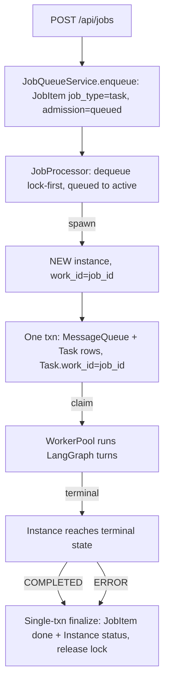
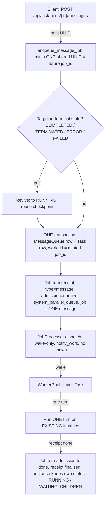

# Job-Task System — Core Module Reference

> **Status (2026-09-01):** The job-task system is a **critical core module** of ensemble.
> This is its canonical reference. The **Constitution** (§6), the **census gate** (§7), and
> the **fail-closed `work_id` contract** (§8) land on branch `feature/job-task-constitution-p0a`
> (Constitution Phase 0 + Fix A). Sections marked **[Fix A]** describe the post-Fix-A
> fail-closed contract; where the pre-Fix-A behavior differed, it is noted for context.

**Audience:** daemon developers and agents touching job dispatch, queue behavior, or any
`admission_state` write. Companion guides: [`docs/job-queue.md`](job-queue.md) (API surface),
[`docs/messaging-system.md`](messaging-system.md) (message paths),
[`docs/architecture.md`](architecture.md) (system overview).

---

## 1. Overview & Role

**The Job is the single public work primitive (JAFP — Job-as-Front-Primitive).** Every
public action that creates work enters the system as a JobItem. **Instances are the work
executors**: a JobItem never runs work itself — it admits work into a queue, and an
instance (spawned or existing) executes it.

Two consequences define the whole module:

- **Public entry points create JobItems** — the public APIs and system drivers (jobs
  API, message API, scheduler source, blueprint/knowledge/skill dispatchers, …).
  Internal paths — agent-to-agent `send_message`, cascade-resume, reports — use
  `enqueue_message` only and never create JobItems (§6, I4). The authoritative creator
  list is the `KNOWN_JOBITEM_CREATORS` census (§7), not this prose.
- **One stored lifecycle vocabulary.** JobItems carry the four-value `AdmissionState`
  (`QUEUED` | `ACTIVE` | `DONE` | `DEAD`,
  `daemon/repositories/job_queue/models.py`). The legacy six-value `JobStatus` enum was
  removed (Phase 7b); the legacy strings (`pending`/`processing`/`completed`/`failed`/
  `cancelled`/`dead_letter`) survive only as **API-facing derived values** via
  `_derive_legacy_status` (`daemon/services/work_status.py`), discriminated by
  `terminal_reason` for `done` rows. Write sites speak `admission_state` only.

| Concept | Role |
|---|---|
| JobItem | Public work order + admission lifecycle (queued → active → done/dead) |
| Task | Executable unit of a turn; linked to its driving job via `work_id` |
| Instance | The executor — owns the LangGraph checkpoint and instance status |
| MessageQueue row | Durable message record (always written, even when its Task is deferred) |
| Queue | Scheduling container (FIFO / PARALLEL), concurrency-limited, lock-first |
| Backstop lane | Sweeps + watchdog + RDRS — compensators, never primary authority (§5) |

---

## 2. Data Model & ID Linkage

### 2.1 Core tables

| Table | Key fields | Notes |
|---|---|---|
| `job_queue_items` (JobItem) | `job_id` (PK), `admission_state`, `job_type` (`task` \| `message`), `queue_id`, `instance_id`, `priority`, `terminal_reason`, `idempotency_key`, retry/DLQ fields | `admission_state` is the sole write authority. No FK to Task yet (Phase 5 defers it). |
| Tasks | `work_id` (unique, indexed), status, retry fields | `work_id` defaults to a minted UUID4 at construction — the default is a fallback, not a license (§8). |
| Instances | `instance_id`, `parent_id`, status | `parent_id` is **permanent** on the child row (survives terminate→revive); `instance_hierarchy` rows are transient. |
| `message_queue` (MessageQueue) | `message_id`, `instance_id`, status, source | Written unconditionally as a durable audit record. |
| `dependency_watchers` (DependencyWatcher) | `source_task_id` (child task), `target_instance_id` (parent instance), `state` | Parent-waits-for-children: `PENDING → FIRED \| CANCELLED` (atomic). The Dependency Bus is the **sole completion authority** for that mechanism. |

### 2.2 The linkage contract (I1)

For every **job-driven** dispatch:

```
Task.work_id == JobItem.job_id
```

This single equality is what recovery (`get_by_work_id(job_id)`), the work resolver, and
the orphan sweeps key on. §8 makes it fail-closed. Internal (non-job) paths have no
JobItem and legitimately self-mint a `work_id` — that is not a violation (§6, I4).

### 2.3 Queues

| Queue | Type | Concurrency | Default traffic |
|---|---|---|---|
| `system_fifo_queue` | FIFO | 1 | Serialized system work |
| `system_parallel_queue` | PARALLEL | 5 | **MESSAGE jobs** (message API resolves this queue by name) |
| `system_kb_fifo_queue` | FIFO | 1 | Knowledge-base work |
| `system_defer_queue` | — | — | Deferred work (idle-gated) |
| `system_background_queue` | — | — | Background work (idle-gated) |

These names are reserved; user queues cannot take them. Message-job concurrency is
enforced per queue — a FIFO queue at limit 1 serializes messages strictly.

### 2.4 Locks

Execution is **lock-first**: a job acquires a `job_locks` row before processing, which
prevents duplicate execution. Lock release is part of the Step-2 finalization transaction
(§3.1). Message jobs (`job_type='message'`) are pure mirrors — the PG trigger skips them
and they take no job locks.

---

## 3. The Two Dispatch Cases

Every JobItem is one of two kinds, and **the kind determines what the job means**. This is
invariant I3 (§6): missions are proxies, mirrors are receipts.

### 3.1 First-job (mission) — `job_type='task'`

The public API creates a job for an agent that has no live instance yet. The job
**spawns** the instance and its lifecycle is the instance's lifecycle: they terminate
together, in one transaction.



Key semantics:

- **Mission identity:** the spawned instance's first Task carries `work_id = job_id`.
  **[Fix A]** the dispatch must pass `work_id=job_id` explicitly; omission is rejected
  (§8).
- **Step 2 dual-write:** when the instance reaches a terminal state, the observer's
  `_finalize_job_db_sync` commits **one transaction** with (1) the job's terminal
  admission transition, (2) the instance status stamp (COMPLETED/ERROR), and (3) job-lock
  release. Partial states (job done but lock leaked, or instance terminal but job active)
  cannot persist — this is the "job lifecycle ≡ instance lifecycle" guarantee, atomic by
  construction since the 06-19 consolidation.
- A mission job mirrors instance liveness: while the instance runs (possibly for hours,
  across many turns and children), the job stays `ACTIVE`.

### 3.2 Message-job (mirror) — `job_type='message'`

A message sent to an **existing** instance via the message API. The job is a **receipt**
for exactly one message — not a lifecycle proxy. The instance's liveness lives on the
instance status, independent of the job.



Key semantics (`enqueue_message_job`, `daemon/services/instance_messaging.py` — the
"Option B" synchronous Task contract):

1. **One shared UUID is minted first** and becomes both `job_id` and `Task.work_id` —
   the linkage holds from birth.
2. **MessageQueue + Task rows commit before the JobItem exists.** If JobItem creation
   fails, the Task remains the authoritative work item and the caller gets the error —
   no half-visible receipt.
3. **Dispatch is wake-only.** The processor just calls `worker_pool.notify_work()` to
   surface the already-existing Task to a worker; no instance is spawned.
4. **`DONE` at task completion.** The job finalizes when its one Task finishes — the
   DependencyBus watcher lifecycle keeps it `ACTIVE` across inter-turn gaps while
   children are pending. The instance may live on (`RUNNING`, `WAITING_CHILDREN`) long
   after the receipt is `DONE`. Read models must treat these rows as receipts, not
   liveness signals (§6, I3; §5's f2 sweep is the compensator while the event-time
   mirror write is pending — structural fix B).

### 3.3 The revive path

`send_message` targeting an instance in `COMPLETED`, `TERMINATED`, `ERROR`, or `FAILED`
**revives** it: auto-transition to `RUNNING` and reuse of the existing checkpoint — the
same machinery as resuming a completed mission. Paused instances are exempt (pause is a
stronger state; §4.2). The dependency watcher re-registers on revival, so re-dispatch
needs no manual re-hydration.

Two revive-adjacent cautions (from the retrospective):

- **`parent_id` survives revive.** Query-time lineage is preserved; cascade cleanup
  drains correctly via transient `instance_hierarchy` rows.
- **Revived-instance-under-DEAD-job** is a legal combination (DLQ replay `dead→queued` ×
  instance revive). Renderers must not let instance liveness override a `DEAD` admission
  state for mission rows (§6, I5 hazard).

---

## 4. Lifecycle Flows

### 4.1 Admission-state machine

`daemon/services/job_state_machine.py` (`VALID_TRANSITIONS`) — the authoritative set:

| From | To | Meaning |
|---|---|---|
| — | `QUEUED` | create (enqueue) |
| `QUEUED` | `ACTIVE` | start (dequeue, lock acquired) |
| `QUEUED` | `DONE` | cancel while pending |
| `ACTIVE` | `DONE` | complete / fail / cancel / abort (terminal, `terminal_reason` set) |
| `ACTIVE` | `QUEUED` | retry (backoff scheduled) |
| `ACTIVE` | `DEAD` | dead-letter (retries exhausted) |
| `DONE` | `QUEUED` | replay from done |
| `DEAD` | `QUEUED` | replay from DLQ (the **only** `DEAD` exit) |
| `DONE` | `ACTIVE` | orphan-race post-commit re-arm (late-child re-open) |

Self-loops are tolerated idempotently by `validate_transition`. Any new writer of
`admission_state` must go through a registered authority (§6, I2; §7).

### 4.2 Queue → dequeue → dispatch → turn

1. **Enqueue** — public entry point writes the JobItem (`admission_state='queued'`) and
   notifies the dispatch bus.
2. **Dequeue (lock-first)** — the processor claims the job by acquiring its lock and
   transitions `queued → active`.
3. **Dispatch** — first-job: spawn instance with `work_id=job_id` **[Fix A: required
   explicitly]**; message-job: wake-only (§3).
4. **Turn** — a WorkerPool worker claims the Task and runs the LangGraph turn(s). The
   graph checkpoints at node boundaries; a task cancelled by pause stays `PROCESSING`
   (not `FAILED`).

### 4.3 Pause / resume (Pause-First Then Quiesce)

Features needing a quiescent instance follow: `pause_instance_cascade` **first**, then
bounded quiescence confirmation, then the state mutation, then resume.

- Pause cancels the in-flight graph task (`graph_task.cancel()`); LangGraph checkpoints
  at node boundaries freeze the turn at the last committed boundary.
- **Resume is DB-only** (`PAUSED → RUNNING`); the next dispatch with `is_retry=True`
  resumes from the checkpoint.
- A paused instance's non-defer job keeps `admission_state='active'` — pause is an
  instance concern, not an admission transition (there is no `paused` admission value).

### 4.4 Terminate / revive

Terminate finalizes the instance (and, for missions, the job via the Step-2 transaction).
Revive is §3.3: terminal → `RUNNING` + checkpoint reuse on the next `send_message`.
`parent_id` is permanent; `instance_hierarchy` rows are transient — lineage survives
revive, cleanup drains.

---

## 5. The Backstop Lane

The system accumulates **compensators** — periodic sweeps and watchdogs that repair
stale rows. Under the Constitution they are **never primary authorities**: they are
loss-recovery for rows the event-time path failed to finalize (§6, D2).

| Compensator | Class it repairs | Notes |
|---|---|---|
| Drift reconciler Patterns (a)–(e) | Assorted stale/terminal mismatches | Predates f-family |
| Pattern (f) — orphan ACTIVE jobs | Orphaned ACTIVE mission jobs | Default-ON; DEAD-finalizes ≤20 min |
| Pattern (f1) — orphan-active JobItem | `active` JobItem with **no Task linked via `work_id`** | Grace window + subtree-alive guard; kill-switch `ENSEMBLE_ORPHAN_F1_ENABLED` (default ON). Its `task is None` predicate assumes I1 — the 08-31 incident fired exactly when that assumption was false (see §8 history). |
| Pattern (f2) — mirror finalization | Message jobs the event-time path left `active` | Polls a bus-pending gate; structurally fragile for mirrors (no event fires → hours-late `DONE`). Retired by structural fix B when it lands. |
| WC watchdog (wedge/hang passes) | Wedged / hung instances | `instance/repository.py` wedge + hang passes |
| RDRS (5 lanes) | Lost/stuck report deliveries | `report_delivery_recovery.py` |

Operating rule: **if you find yourself adding a sweep, first ask why the event-time
write is missing.** The 09-01 retrospective's core finding is that every sweep family
member traces to a missing event-time write or an unenforced linkage — and each new
sweep + kill-switch compounds operability cost. New sweeps and predicate re-scoping are
constitutional events (§6).

---

## 6. The Constitution

Ratified 2026-09-01 from the drift retrospective (full history and evidence:
[§10](#10-where-the-full-history-lives)). Statuses are from the 09-01 census unless
marked otherwise; the **on-this-branch** column reflects Constitution Phase 0 + Fix A.

### 6.1 Never-drift invariants I1–I5

| ID | Statement | Census 2026-09-01 | On this branch |
|---|---|---|---|
| **I1** | `Task.work_id == JobItem.job_id` at every job-driven dispatch; handles mint **fail-closed** | **BENT** — WARN-only tripwire; auto-mint fallback alive; no FK | **Enforced** — Fix A rejects omission at job-driven dispatch; mint sites censused (§7, §8) |
| **I2** | One transition authority per `admission_state` class; others are idempotent-readers or **declared** subordinates (≤2 per class: owner + backstop) | **BROKEN** — 22 writers, 9 uncoordinated, 8 bypass `validate_transition`; an illegal `paused→done` exists | Unchanged (Phases 1–3 pending) — but every writer is now **visible** to the census (§7) |
| **I3** | Proxy-per-kind: missions proxy instance lifecycle, mirrors are receipts; **one meaning per state per kind** | **BROKEN** — mirrors lack an event-time terminal write; two read answers exist (receipt-truthmaker vs liveness-only-when-active) | Unchanged (structural fixes B/C pending; C ships only with B) |
| **I4** | Internal paths never create JobItems (JAFP boundary) | **BENT** — boundary held (zero internal creators) but convention-only | Now **censused** — `KNOWN_JOBITEM_CREATORS` makes the boundary machine-checked |
| **I5** | `DEAD` is terminal; corrections are additive | **TRUE** + hazard — `dead→queued` only via DLQ replay; no path re-opens wrongly-`DONE` rows; revived-instance-under-`DEAD`-job unguarded | Unchanged |

### 6.2 Evolution-allowed seams (no amendment needed)

- New **job_types** — *with creation-time kind declaration*: a truthmaker, an event-time
  writer, and a read branch. (A new type missing the event-time writer is precisely the
  07-03 mistake.)
- New queues; new mirror kinds under the same rule.
- Read projections that declare their authority + divergence bound.
- Tunables on registered subordinates.

### 6.3 Constitutional changes (amendment required)

Record amendments as ADR-style entries in
`.agents/shared/planning/job-task-retrospective/decisions.md`.

- Any **new `admission_state` writer**.
- Changes to **linkage semantics** (what `work_id` means / how it is minted).
- Changes to **terminal-state meaning**.
- **Re-scoping an existing sweep's predicate** — the 08-30 lesson: f1's `task is None`
  predicate silently assumed I1; promoting it to a default-ON primary transition fired
  on the first cycle.

### 6.4 Drift red lines D1–D4

Drift is too much the moment **any** of these is red — each is mechanically checkable:

| ID | Red line | Check |
|---|---|---|
| **D1** | **Writer registry** — every `SET admission_state` site resolves to a registered owner; ≤2 per class | Census test against `KNOWN_ADMISSION_STATE_WRITERS` (§7) |
| **D2** | **Event-time terminal rule** — every stateful row has an event-time terminal writer; a sweep is never primary, only loss-recovery for stale *unlabeled* rows | Design review; mirror event-time write (fix B) closes the current failure |
| **D3** | **One-answer rule** — every derived status names its truthmaker + direction + bounded divergence | Read-model review (fix C, always paired with B) |
| **D4** | **Fail-closed handles** — no path fabricates `work_id`/`job_id` on `None` | Census test against `KNOWN_MINT_SITES` + Fix A rejection (§8) |

Retro-validation: D1–D4 would have caught every historical drift event at landing
(receipts-without-kind-split by D2; JAFP writer proliferation by D1; auto-mint by D4;
Pattern-f by D2+D4; dual read answers by D3). By 08-30 all four were red — and had been
red since at least 07-03. "How much drift is too much" is not an amount; it is these
four booleans.

---

## 7. The Census Gate (Phase 0)

Phase 0 ships the Constitution's teeth as **pure-add static sets + AST census tests**
(landing on this branch). No behavior change — immediate drift visibility.

### 7.1 The registry

`daemon/job_state/constitution.py` holds three code constants — the **source of truth**
(docs are asserted equal, never the reverse):

- `KNOWN_ADMISSION_STATE_WRITERS` — every site that writes `admission_state`
- `KNOWN_JOBITEM_CREATORS` — every site that creates JobItems (the JAFP boundary, I4)
- `KNOWN_MINT_SITES` — every site that mints a `work_id`/`job_id` handle (D4)

Bidirectional AST census tests (precedent: the frozen tool-name discovery test) assert
both directions: **every** writer/creator/mint site in the daemon resolves to a
registered entry, and **every** registered entry matches a live site. The scanner must
raise when it can read zero sources (a silently-empty scan must never read as "clean").

The pack `test/packs/constitution_drift_test.sh` wraps the census for CI-style runs.

### 7.2 How to register a new writer / creator / mint site

1. **Is it constitutional?** A new `admission_state` writer requires an amendment first
   (§6.3): add the ADR-style entry to the retrospective's `decisions.md`. New
   job_types/queues/projections (§6.2) are not constitutional — register directly.
2. Add the site to the matching `KNOWN_*` set in `daemon/job_state/constitution.py`.
3. Run the census-test regen one-liner (see the test module) to refresh the expected
   site list; the diff should show exactly your site.
4. Route the write through the registered authority where one exists (e.g.
   `validate_transition`); declare subordinates explicitly (owner + declared backstop,
   ≤2 per state class).

### 7.3 When `constitution_drift_test` fails

A failure means an unregistered writer/creator/mint site exists (or a registered one
went away). **Do not blind-regen to silence it** — that is how drift hides. Triage:

- **New site you intended** → register it (§7.2), including the amendment if it is an
  `admission_state` writer.
- **New site you did NOT intend** → the change introducing it is drift; remove or
  reroute it. If it is a sweep-predicate re-scope, §6.3 applies.
- **Registered site disappeared** → the refactor deleted or moved a write; update the
  set deliberately and confirm the write still happens somewhere registered.

---

## 8. The Fail-Closed `work_id` Contract (Fix A)

> **[Fix A]** — post-Fix-A contract, landing on this branch. Closes the 4.5-month
> phantom-handle window (call site born 2026-04-19; `work_id` param added 06-27 but
> never threaded; full repair of all dispatch sites 09-01; Fix A removes the fallback).

**The contract:**

1. **Every job-driven dispatch MUST pass `work_id=job_id` explicitly.** The spawned /
   resumed Task's `work_id` is the driving JobItem's `job_id` — nothing else.
2. **Omission is rejected** (fail-closed). A job-driven path that arrives with
   `work_id=None` raises instead of minting a fresh handle.
3. **The auto-mint fallback is demoted to an error** on job-driven paths. (Pre-Fix-A:
   `if work_id is None: work_id = str(uuid.uuid4())` silently minted a phantom handle —
   the Task then existed but `get_by_work_id(job_id)` missed it, which is exactly what
   f1's predicate tripped on.)
4. **Internal paths self-mint legitimately.** Legacy `enqueue_message` callers have no
   JobItem; the Task mints its own `work_id` (I4 — internal paths never create
   JobItems). The mint sites are registered (§7) so this boundary stays visible.
5. **The WARN tripwire stays** as a regression detector
   (`_assert_linkage_contract`, `daemon/services/messaging_types.py`) — it compares the
   dispatch result's `job_id` against the driving JobItem and warns on mismatch. It is
   a detector, not a gate; Fix A is the gate.

**Why fail-closed:** every recovery surface keys on `Task.work_id == JobItem.job_id`.
A minted-on-None handle makes the Task invisible to `get_by_work_id`, the work resolver,
and the orphan sweeps — silently. Rejection converts a silent invariant break into a
loud dispatch-time error.

---

## 9. What this means for reviewers

PR-template checkboxes map to D1–D4. When reviewing a change that touches this module:

- New `admission_state` write? → D1: registered owner or declared subordinate? Amendment?
- New JobItem creation? → I4: is the caller public? Registered in `KNOWN_JOBITEM_CREATORS`?
- New handle mint? → D4: registered in `KNOWN_MINT_SITES`? Fail-closed on `None`?
- New sweep / predicate change? → D2 + §6.3: why is the event-time write missing?
- Derived status touched? → D3: which side is the truthmaker, and is divergence bounded?

---

## 10. Where the full history lives

`.agents/shared/planning/job-task-retrospective/` holds the sha-pinned evidence base:

| File | Contents |
|---|---|
| `drift-history-and-constitution.md` | The drift ledger (2026-03-15 → 2026-09-01), three tipping points, the Constitution, D1–D4, governed solution path |
| `architecture-recommendation-v2.md` | Verdict updates; census counts; governance phases 0–5 |
| `architecture-recommendation.md` | Trajectory verdict (WORSE), frequency adjudication H1–H4, fix-chain scorecard |
| `approach-comparison.md` | Structural options A→B→C (D deferred) with ordering hazards |

Key dates for orientation: receipts entered the JobItem table without a kind split
**05-24** (I3 born broken); the proxy doctrine was declared **06-28** (half-landed);
JAFP at scale **07-06/07**; the first autonomous secondary terminal writer **08-01**;
sweep promoted to default-ON primary transition **08-30** (fired the next day);
invariant-restoring mint repair + this Constitution **09-01**.
