# Workflow & Context Load Optimization — Investigation Report

> **Date**: 2026-08-02
> **Status**: Investigation complete — proposals only, no code modified yet
> **Scope**: Leader → V2 Agent → Worker/Coder dispatch pipeline

## The Problem in One Sentence

Spawned workers/coders start with near-zero parent context, and the system re-runs an expensive 3-stage skill search on every single LLM turn — despite having the infrastructure to fix both already built (opencode preload, shared-context directory, heuristic_match flag).

## Current State — The Context Chain

When the leader delegates to developer[v2] → who spawns a worker or coder, here's what flows:

```
Leader knows:  full task, project architecture, explore() results, critical notes
    │
    │  send_message("task text only")  ← ZERO context transfer
    ▼
Developer[v2] gets:  task text + per-turn SYSTEM CONTEXT (project JSON, critical notes, history)
    │                  + heuristic-matched shared .md files (if explore() was called before)
    │
    │  spawn_instance("coder") + send_message("task text", load_skill="...")
    ▼
Coder gets:  task text + skill content + per-turn SYSTEM CONTEXT
             + heuristic-matched shared .md files ✅
    │
    │  BUT: 3-stage skill search (BM25→embedding→LLM) runs EVERY turn = 200-2000ms/turn
    │        + assemble_context_messages() called TWICE on first turn
    │
Worker gets:  task text + skill content + per-turn SYSTEM CONTEXT
              + ❌ NO heuristic-matched shared .md files (flag MISSING in meta.json)
              + 3-stage skill search EVERY turn (same 200-2000ms waste)
```

## 3 Root Causes Identified

| # | Root Cause | Impact | Evidence |
|---|-----------|--------|----------|
| **R1** | Worker `meta.json` missing `heuristic_match_shared_md_files` | Workers can't see explore() results that coders CAN see | `agents/worker/meta.json` — no `context_injection` key at all |
| **R2** | 3-stage skill search runs on EVERY LLM turn (not just first) | 200-2000ms wasted per turn, even when skills are already checkpointed | `context_messages.py:1208-1220` — `project_already_injected` branch still calls `_run_skill_search()` |
| **R3** | Internal `send_message` passes ZERO context (unlike opencode's `_preload_shared_context`) | Every child starts cold — re-reads files, re-explores architecture the parent already mapped | `instance.py:1555` — only raw text enqueued |

## Value/Effort Matrix

```mermaid
flowchart LR
    subgraph T1["Tier 1 — Quick Wins<br/>high value · low effort"]
        direction TB
        HM["heuristic_match flag<br/>~12% per-turn latency"]
        CS["cache skill search<br/>~8% repeated turns"]
        ED["eliminate double assembly<br/>~15% prompt build"]
        LI["context_injection flag<br/>~10% leader turns"]
    end
    subgraph T2["Tier 2 — Sweet Spot<br/>high value · medium effort"]
        direction TB
        PP["preload to send_message<br/>~18% cold turns"]
        SC["structured context param<br/>~12% message turns"]
    end
    subgraph T3["Tier 3 — Medium<br/>moderate value · medium effort"]
        direction TB
        SF["skill search freq config<br/>~6% overhead"]
        BP["batch payload DB queries<br/>~9% turn init"]
    end
    subgraph T4["Tier 4 — Strategic<br/>high value · high effort"]
        direction TB
        CH["parent handoff system<br/>~25%+ multi-turn"]
    end
    T1 ~~~ T2 ~~~ T3 ~~~ T4
    classDef tier1 fill:#2e9e5b,stroke:#1f7a45,color:#ffffff
    classDef tier2 fill:#3b7dd8,stroke:#2a5fa8,color:#ffffff
    classDef tier3 fill:#f5c518,stroke:#c99a10,color:#333333
    classDef tier4 fill:#e8820c,stroke:#b8650a,color:#ffffff
    class HM,CS,ED,LI tier1
    class PP,SC tier2
    class SF,BP tier3
    class CH tier4
```



## Ranked Optimization Proposals

### Tier 1 — Quick Wins (1-line to ~50-line changes)

#### 1A. Enable `heuristic_match_shared_md_files` on Worker
**Rating: ⭐⭐⭐⭐⭐ | Effort: 1 line | Value: HIGH**

Add `"context_injection": {"heuristic_match_shared_md_files": true}` to `agents/worker/meta.json`.

Workers are the ONLY v2-dispatched agent missing this flag (coder, developer[v2], planner[v2], reviewer[v2], approver[v2], tidier[v2] all have it). This means explore() results written to the shared-context directory by the leader or developer are completely invisible to workers today. One-line fix gives workers the same exploration visibility coders already have.

**Saves**: 1-2 LLM turns per worker (no need to independently re-discover architecture).

#### 1B. Enable `context_injection` on Leader
**Rating: ⭐⭐⭐⭐ | Effort: 1 line | Value: MEDIUM-HIGH**

Leader's `meta.json` has `"context_injection": {}` — empty. Adding `heuristic_match_shared_md_files: true` lets the leader itself benefit from accumulated exploration results, reducing its own re-exploration when making dispatch decisions.

**Saves**: ~1 explore() call per leader session that would otherwise repeat prior findings.

#### 1C. Cache Skill Search Results Per-Session
**Rating: ⭐⭐⭐⭐⭐ | Effort: ~30-50 lines | Value: HIGH**

Add a per-instance skill-search cache: store a hash/count of the skill set at search time. On subsequent turns, if the skill set hasn't changed (no new skills added), skip the entire 3-stage search (BM25 → embedding API → LLM call).

The search currently runs on every turn even though:
- Skills are already checkpointed (persistent in the conversation)
- New skills are rarely added mid-session
- The explicit `load_skill` path already bypasses the search

**Saves**: 200-2000ms per LLM turn after the first. For a 10-turn worker, that's 2-20 seconds of pure overhead eliminated.

#### 1D. Eliminate Double Context Assembly on First Turn
**Rating: ⭐⭐⭐⭐ | Effort: ~20 lines | Value: MEDIUM**

`assemble_context_messages()` is called twice on the first message:
1. By the messaging path (`instance_messaging.py:2832`) — builds persistent context, prepends to graph_input
2. By `ContextSlot.assemble()` inside `agent_node` (`graph.py:2395`) — persistent result discarded, but skill search still runs

Fix: Have `ContextSlot.assemble()` check if the messaging path already built the persistent block (similar to `project_injected` flag), and skip the redundant work.

**Saves**: ~30-100ms on first turn (duplicated DB queries for project, critical notes, history).

### Tier 2 — Sweet Spot (Medium effort, high value)

#### 2A. Port OpenCode Preload Pattern to Internal `send_message`
**Rating: ⭐⭐⭐⭐⭐ | Effort: ~100-150 lines | Value: VERY HIGH**

The opencode dispatch path already solves the cold-start problem via `_preload_shared_context()` (`external_opencode.py:419-539`). It:
1. Extracts keywords from the message
2. Matches shared-context `.md` files
3. Prepends the matched context to the message

Internal `send_message` does none of this. Porting the same pattern (heuristic-only, no LLM keyword extraction for speed) into `instance.py:1480` before enqueueing would automatically inject relevant exploration findings into every dispatched task — leader→developer, developer→coder, developer→worker.

Design considerations:
- Use heuristic keyword extraction only (skip the LLM extraction step for speed)
- Make it conditional — not every `send_message` needs context (control messages, status checks)
- Add optional `related_context_keywords` parameter (matching opencode's signature)

**Saves**: Eliminates 1-3 LLM turns of re-exploration per spawned child. This is the single highest-value optimization for multi-agent workflows.

#### 2B. Add `context` Parameter to `send_message`
**Rating: ⭐⭐⭐⭐ | Effort: ~80-120 lines | Value: HIGH**

Add an optional `context` parameter to `send_message` that lets the parent agent pass structured context alongside the task message:

```python
send_message(
    instance_id=coder_id,
    message="Implement auth token refresh in the middleware...",
    context={
        "files": ["src/middleware/auth.py:42-58", "src/services/auth_service.py:120-145"],
        "notes": "Token refresh uses the refresh_token rotation pattern",
    }
)
```

This gets injected as a `[SYSTEM CONTEXT: Task Context]` HumanMessage before the task message, mirroring how `assemble_context_messages` works. Developer[v2]'s Dev Plan already identifies files — this just lets it pass them directly instead of letting the coder re-discover them.

**Saves**: 1-2 LLM turns per coder (Phase 2 Explore can be shortened or skipped).

### Tier 3 — Medium (Moderate effort/value)

#### 3A. Configurable Skill Search Frequency
**Rating: ⭐⭐⭐ | Effort: ~30 lines | Value: MEDIUM**

Add `skill_search_interval` to `meta.json` (e.g., `"skill_search_interval": 5` — search every 5 turns instead of every turn). Default to 1 (current behavior) for backward compatibility.

#### 3B. Batch Project Payload DB Queries
**Rating: ⭐⭐ | Effort: ~20 lines | Value: LOW-MEDIUM**

`_fetch_project_payload()` runs 3 sequential DB queries (project, critical notes, history). Wrap in `asyncio.gather()` for parallel execution. Saves ~5-10ms on first turn.

### Tier 4 — Strategic (High effort, transformative)

#### 4A. Parent Conversation Handoff System
**Rating: ⭐⭐⭐⭐ | Effort: ~300-500 lines | Value: TRANSFORMATIVE**

When spawning a child, automatically generate a compressed summary of the parent's relevant context:
- Files the parent already explored (with key findings)
- Architecture decisions already made
- Relevant conversation excerpts

This would be injected as a `[SYSTEM CONTEXT: Parent Handoff]` block. Requires a summarization step (could be cheap — extract file paths and key conclusions from parent's messages).

This is the "ultimate" fix — eliminates ALL re-exploration by giving children the parent's accumulated knowledge in compressed form.

## Summary Table

| # | Optimization | Effort | Value | Savings Estimate |
|---|-------------|--------|-------|-----------------|
| **1A** | Worker `heuristic_match` flag | 1 line | ⭐⭐⭐⭐⭐ | 1-2 turns/worker |
| **1B** | Leader `context_injection` flag | 1 line | ⭐⭐⭐⭐ | ~1 explore() call/session |
| **1C** | Cache skill search per-session | ~50 lines | ⭐⭐⭐⭐⭐ | 200-2000ms/turn |
| **1D** | Eliminate double assembly | ~20 lines | ⭐⭐⭐⭐ | 30-100ms/first turn |
| **2A** | Port opencode preload to send_message | ~150 lines | ⭐⭐⭐⭐⭐ | 1-3 turns/child |
| **2B** | `context` param in send_message | ~120 lines | ⭐⭐⭐⭐ | 1-2 turns/coder |
| **3A** | Skill search frequency config | ~30 lines | ⭐⭐⭐ | ~6% overhead |
| **3B** | Batch DB queries | ~20 lines | ⭐⭐ | 5-10ms/turn |
| **4A** | Parent handoff system | ~500 lines | ⭐⭐⭐⭐ | 25%+ multi-turn |

## Recommended Implementation Order

**Phase 1 (immediate, ~2 hours):** 1A + 1B + 1C + 1D — all quick wins, no API changes, backward compatible.

**Phase 2 (next sprint):** 2A — the biggest bang-for-buck. Port the proven opencode preload pattern into internal dispatch.

**Phase 3 (when ready):** 2B — add `context` parameter to `send_message` for structured parent-to-child handoff.

**Future:** 4A — full parent handoff system if Tier 1-2 doesn't fully solve the cold-start problem.

## Evidence Index

| Finding | File:Line |
|---------|-----------|
| `send_message` passes only raw text | `daemon/tools/instance.py:1555` |
| `load_skill` is the only "sugar" | `daemon/tools/instance.py:1514-1516` |
| Worker meta.json — no context_injection | `agents/worker/meta.json` (entire file) |
| Coder meta.json — has heuristic matching | `agents/coder/meta.json:15-17` |
| Leader meta.json — empty context_injection | `agents/leader/meta.json:10` |
| Heuristic gate in context assembly | `daemon/services/context_messages.py:1260-1265` |
| `_apply_post_cache_appends` — what spawns get | `daemon/services/instance_lifecycle.py:394-464` |
| `assemble_context_messages` orchestrator | `daemon/services/context_messages.py:1051-1375` |
| `assemble_context_messages` called twice | `instance_messaging.py:2832` + `graph.py:2395` |
| Second call's persistent result discarded | `graph.py:2398-2404` |
| opencode preload mechanism | `daemon/tools/external_opencode.py:419-539` |
| opencode preload invocation | `daemon/tools/external_opencode.py:622-633` |
| explore() auto-save to context dir | `daemon/tools/knowledge_tools.py:850-869` |
| `_save_explorer_result` writer | `daemon/tools/knowledge_tools.py:438-475` |
| `get_shared_context` reader | `daemon/services/context_injection.py:741-857` |
| Per-turn skill search runs unconditionally | `context_messages.py:1208-1220` |
| Skill search is 3-stage (BM25→emb→LLM) | `skill_search_service.py:1-24` / `skill_injection_service.py:249-256` |
| Explicit skill bypasses search | `skill_injection_service.py:303-320` |
| Skills are persistent (checkpointed) | `context_messages.py:1066-1073` |
| Prompt is cached by mtime | `loader.py:688-698` |
| Context directory resolution | `daemon/services/context_tools.py:23-39` |
| Coder Phase 2 Explore (re-exploration) | `agents/coder/workflow.md:28-34` |
| Worker Phase 3 Skill Check | `agents/worker/workflow.md:73-97` |
| Developer[v2] dispatch patterns | `agents/developer[v2]/workflow.md:96-102` |
| Developer[v2] deny edit/write | `agents/developer[v2]/meta.json:16` |
| `_spawn_instance_db_sync` metadata stored | `instance_lifecycle.py:990-1042` |

---

## Real Instance Validation — Leader Instance 0111b410

> **Date**: 2026-08-02  
> **Instance**: `0111b410-132f-4af9-a36e-a315cca5a700` (production PostgreSQL, `.env.prod`)
> **Method**: Runtime data from PostgreSQL cross-referenced against code ground truth  
> **⚠️ CAVEAT**: This is ONE instance — phenomenon ≠ reality. Findings below are validated against code.

### Instance Tree Summary

| Level | Count | Key Agent Types |
|-------|-------|-----------------|
| Root (Leader) | 1 | Pure orchestrator — 0 code-reading tool calls |
| Direct children (34) | 34 | 10 reviewer, 7 tester, 5 approver, 4 developer, 3 wanderer, 2 planner, 2 giter, 1 devops |
| Grandchildren (191) | 191 | 152 worker, 27 coder, 7 governor, 5 explorer |
| Great-grandchildren (22) | 22 | 14 worker, 8 explorer |

**Session**: 27.1 hours, 3 workflow phases (Bug Fix → Turn-Reconciler Migration → Hotfix+E2E)

### Cross-Reference Findings: Phenomenon vs Ground Truth

| # | Finding | Phenomenon (Instance Data) | Ground Truth (Code/Instructions) | Verdict |
|---|---------|---------------------------|----------------------------------|---------|
| **V1** | Worker missing `heuristic_match` flag | 152 workers spawned; no evidence they accessed shared context | ✅ CONFIRMED systemic — `agents/worker/meta.json` has NO `context_injection` key. Gate at `context_messages.py:1260` defaults to `False`. | 🔴 SYSTEMIC — affects every worker spawn globally |
| **V2** | Per-turn skill search waste | Could not measure exact timing from DB | ⚠️ **CORRECTS original report** — Search runs once per user MESSAGE, not per LLM turn. Per-instance cache (`_context_skill_results[instance_id]`) exists. Turn 2+ of same message takes cache hit. | 🟡 DOWNGRADED — still has cost per new message, but NOT catastrophic per-turn waste. Optimization 1C is lower priority than originally estimated. |
| **V3** | `send_message` passes zero context | Leader's messages were detailed (rich task briefs with file paths and plan references) — leader compensated manually | ✅ CONFIRMED systemic gap in API (`instance.py:1480-1497`), BUT leader in this instance compensated by writing rich messages. Gap is most acute when developer[v2] dispatches to workers — developer infers file paths without pre-exploring. | 🟡 PARTIALLY SYSTEMIC — API limitation is real; impact varies by dispatching agent |
| **V4** | Double `assemble_context_messages()` | Not observable from DB | ✅ CONFIRMED exists but BY DESIGN — second call enables live skill re-search. Persistent result explicitly discarded with documented reason. | 🟢 BY DESIGN — optimization limited to avoiding redundant DB reads in second call, not eliminating it |
| **V5** | `explore()` overlap between agents | Two wanderers queried overlapping "pause report orphan JobItem" terms. `repository.py` read by multiple agents independently | Infrastructure exists (`knowledge_tools.py:850-869` auto-saves explore results). BUT leader has empty `context_injection: {}` and worker has no flag — so accumulated explore results invisible to both. Only coder/developer[v2]/planner[v2] can see them. | 🔴 SYSTEMIC — infrastructure exists but two key agents can't access it |
| **V6** | No `skill_injection` in instance metadata | No `skill_injection` field in any instance row | `skill_injection` is a per-AGENT `meta.json` flag, NOT per-instance metadata. Instance metadata stores `project_injected`. | ⚪ RED HERRING — skills WERE being injected; observer checked wrong table |
| **V7** | Title `<think>` block leak | Instance c82a3b95 title starts with `<think>` block | Not validated — separate pipeline issue | 🟠 SEPARATE BUG — flagged as follow-up, unrelated to context optimization |
| **V8** | Instance reuse context pressure | Developer reused 4× (580 messages, 6.9h). Giter stayed alive 18.9h | BY DESIGN (leader workflow.md instructs reuse). No context-window limit enforcement. | 🟡 DESIGN RISK — reuse is intended, but 580 messages likely degrades LLM quality |
| **V9** | `todo_graph_create` called 5 times | Leader recreated todo graph 5 times | Leader ran 3 major phases — each phase naturally creates new graph | 🟢 NORMAL — expected behavior across phase transitions |

### Validated Root Cause Map

```
Leader (Implementation mode)
  │  Terse delegation: [goal]. [constraints]. [context from plan IF available]
  │  ↓ send_message(text only — NO parent context, NO exploration findings)
  ▼
Developer[v2]
  │  Reads plans/conventions but NO source code exploration
  │  Derives "Target: <files>" from inference, not verification
  │  ↓ send_message(text only) + load_skill
  ▼
┌─────────────────────────┬────────────────────────────────────┐
│ WORKER (152 spawns)     │ CODER (27 spawns)                  │
│ ❌ No explore step      │ ✅ Phase 2 Explore                 │
│ ❌ No context_injection │ ✅ heuristic_match = true          │
│   flag (shared context  │   (shared context                  │
│   invisible)            │    auto-loaded)                    │
│ ❌ No read_context      │ ✅ Reads files + traces            │
│   instruction           │   imports before coding            │
│                         │                                    │
│ Fallback: skill_search  │ Fallback: read_file/grep           │
│ only                    │ + trace imports                    │
│                         │                                    │
│ THE WEAKEST LINK        │ COMPENSATED BY DESIGN              │
└─────────────────────────┴────────────────────────────────────┘
```

### Updated Priority Assessment

Based on real-instance validation, priorities shift:

| Original Rank | Optimization | Validated Impact | New Priority |
|---------------|-------------|-----------------|--------------|
| ~~1C~~ | ~~Cache skill search per-session~~ | ⚠️ DOWNGRADED — per-message cache already exists | Lower priority |
| **1A** | **Worker `heuristic_match` flag** | ✅ CONFIRMED — 152 workers affected in this instance alone | **HIGHEST** |
| **1B** | **Leader `context_injection` flag** | ✅ CONFIRMED — leader itself can't see explore() results | **HIGH** |
| **2A** | **Port opencode preload to `send_message`** | ✅ CONFIRMED — the biggest gap; proven pattern exists | **HIGHEST** |
| **2B** | **`context` param in `send_message`** | ✅ CONFIRMED — developer→worker dispatch is where context is thinnest | **HIGH** |
| **1D** | ~~Eliminate double assembly~~ | ⚠️ BY DESIGN — second call serves skill freshness | Lower priority |
| **NEW** | **Worker workflow: add `read_context` instruction** | ✅ NEW finding — worker has tools but no instruction to use them | **HIGH** |
| **NEW** | **Instance reuse context window monitoring** | ✅ NEW finding — 580 messages likely degrades quality | **MEDIUM** |

### New Findings (Not in Original Report)

1. **Worker has `read_context` / `list_context` tools available but no instruction to use them** (`worker/soul.md:83-85` lists tools, `workflow.md` never prescribes their use). Adding a workflow step "If context seems insufficient, call `list_context` before calling `skill_search`" would give workers a self-serve recovery path.

2. **Instance reuse without context-window guard rails** — Developer with 580 messages across 6.9h is a design risk. Not optimization-critical but worth tracking.

3. **Title generation `<think>` block leak** — Separate bug in title generation pipeline (instance c82a3b95).
