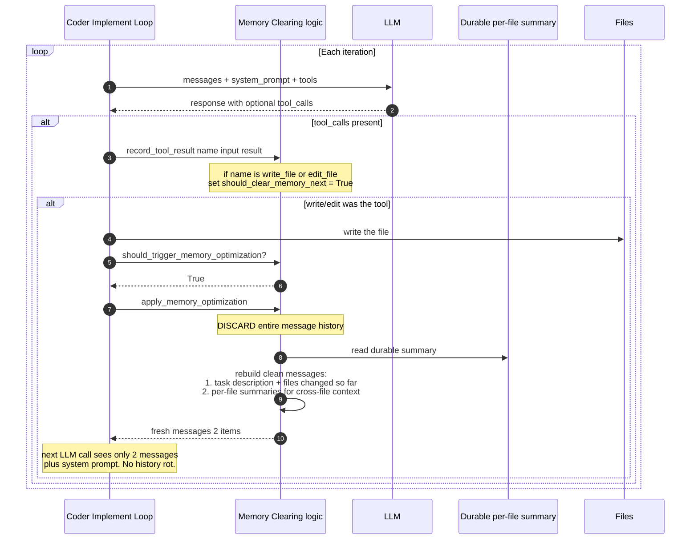
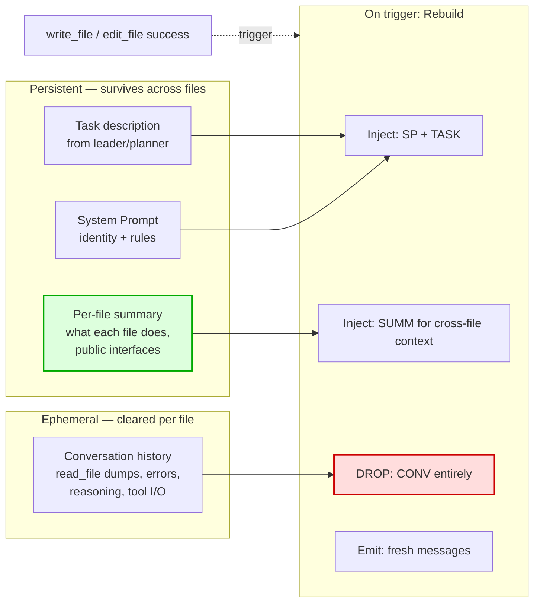
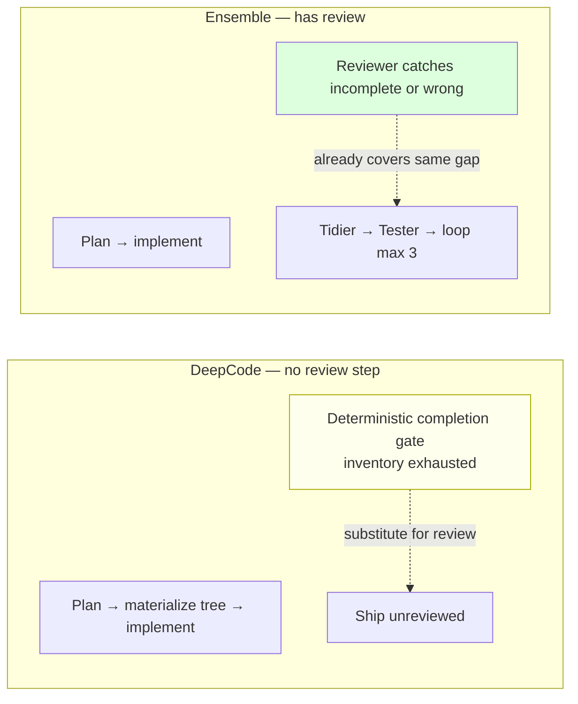
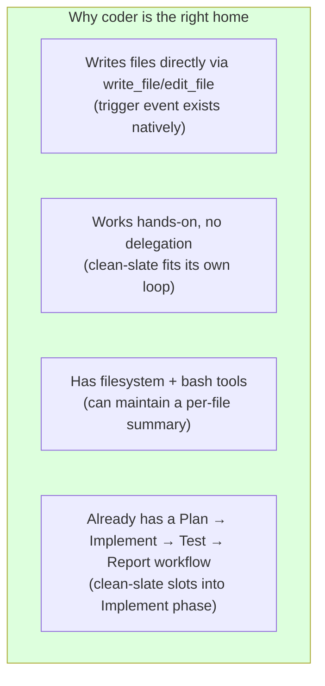
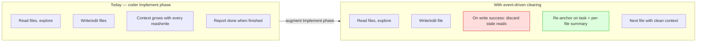

# Coder Agent: Event-Driven Memory Clearing on write_file

**Date**: 2026-07-10
**Status**: Draft
**Impact**: `agents/coder/`, `daemon/compaction.py`
**Source**: Investigation of `.inspiration-projects/DeepCode` (HKUDS/DeepCode, PaperBench SOTA)

---

## Background — What DeepCode Does Differently

DeepCode is a single-pipeline code-reproduction engine (paper → codebase) that scored
**75.9% on PaperBench**, beating human PhDs (72.4%) and commercial agents (Cursor 58.4%,
Claude Code 58.7%). It runs one unattended coding loop of up to **800 iterations / 2 hours**,
writing 20–80 files per run with no human in the loop.

DeepCode uses two coding-specific techniques absent from Ensemble today. This plan
focuses on the one that transfers cleanly: **event-driven memory clearing**.

### DeepCode vs Ensemble — at a glance

| Dimension | DeepCode | Ensemble (coder) |
|-----------|----------|------------------|
| Coding unit | Single LLM loop, MCP `write_file`/`execute_python` | `coder` agent, direct `write_file`/`edit_file` |
| Memory model | Event-driven clean-slate on `write_file` | Token-threshold LLM summarization (`compaction.py`) |
| Completion check | `unimplemented_files == []` (deterministic) | Agent's own judgment + Reviewer catches gaps |
| Review step | **None** — ships unreviewed | Reviewer → Tidier → Tester loop (max 3 cycles) |

Ensemble has the better **orchestration** (dynamic routing, concurrency budgeting,
crash-recovery checkpoints, debug discipline) and **review gating** (Reviewer→Tidier→Tester).
DeepCode has the better **in-session context management**. This plan ports that one technique.

---

## The Idea — Event-Driven Memory Clearing on `write_file`

### What it does

Memory clearing is triggered by a **semantic event** (`write_file` / `edit_file` success),
not by a token threshold. On the trigger, the conversation history is discarded and a
clean context is rebuilt from durable stores.

### The two memory stores — and why this split matters

DeepCode deliberately separates memory into **durable** vs **disposable**:

**The critical design choice:** the LLM **never** needs to remember past conversation —
because the *important* facts (what's been built, what each file does) live in structured,
durable stores. The conversation was only ever scratch space to produce the next file.
So throwing it away loses nothing essential.

### Why it's good

1. **No LLM summarization tax.** Clearing is deterministic string concatenation. Reactive
   summarization (`compaction.py` summarization strategy) pays one LLM call per compaction.
   Over a multi-file implementation, that's multiple paid LLM calls avoided.

2. **No cross-file amnesia.** Conversation is thrown away, but a durable per-file summary
   carries public interfaces and key decisions forward. So the LLM writing file #10 still
   knows the API signatures from files #1–9. Reactive summarization approximates this
   lossily via a chat summary.

3. **Context stays flat, not spiky.** Reactive compaction lets context grow big, then
   chops it — a sawtooth where quality degrades near each tooth's peak. Event-driven
   clearing keeps context at a constant low level: write → clear → write → clear.

### Why DeepCode does this specifically

DeepCode must implement 20–80 files in one unattended 2-hour run targeting a benchmark.
Token cost across hundreds of iterations would be brutal under reactive summarization,
and context rot degrades code quality as the session grows. Event-driven memory clearing
is the only design that makes unattended multi-file coding financially and qualitatively
viable for them.

**Why it transfers to Ensemble:** The event-driven pattern is a *memory strategy inside
one coding instance*, orthogonal to how that instance was spawned. Coder already uses
`write_file`/`edit_file` (the trigger events exist natively). It benefits any
multi-file coding session — keeps context sharp without requiring changes to the leader,
planner, or review workflow.

---

## Considered and Deprioritized — File-Inventory Completion Gate

DeepCode's second technique: the planner emits a file tree, the implementer materializes
all empty files via `mkdir`/`touch`, then fills them one by one. Completion is
`unimplemented_files == []` — a deterministic gate.

**This is low value for Ensemble because DeepCode uses it as a substitute for review.**

DeepCode has **no review step** — it ships unreviewed code. So it *needs* the
inventory-exhausted gate as a substitute: "are all planned files created?" is the only
quality check it has. Ensemble already has Reviewer → Tidier → Tester, which catches
"you missed a file," "structure is wrong," and "tests don't pass." The inventory gate
is belt-and-suspenders on top of a gate that already exists.

Additionally, DeepCode's inventory only models **greenfield creation** (create empty
files → fill them). Coder also fixes bugs and modifies existing code, where the unit of
work is a targeted change to an existing file — not a new file to materialize. The
inventory model doesn't map to those cases without significant generalization (a typed
change manifest), adding complexity for marginal benefit over what review already covers.

**Decision: Do not adopt.** The event-driven memory clearing (above) works standalone
without any inventory or manifest. The reviewer handles completion verification.

---

## Application to Coder

Coder is the natural home because it writes files directly — the trigger events
(`write_file` / `edit_file`) exist natively in its toolset. No partner agents
(leader, planner) need to change.

### What changes in coder

| Change Area | Detail |
|-------------|--------|
| `agents/coder/soul.md` (Implement phase) | Add instruction: after a successful `write_file`/`edit_file`, treat prior read-dumps as stale and re-anchor on the task + a summary of what's been changed so far. Prompt-level nudge. |
| `agents/coder/workflow.md` (new or extended) | Document the clean-slate cycle: on write success, rebuild context from (a) the task/plan, (b) files changed so far + one-line description each. |
| `daemon/compaction.py` (optional, deeper) | Offer an "event-triggered clean rebuild" compaction strategy alongside summarization, keyed on file-write tool calls. Selectable per-instance via config. This is the daemon-level implementation; the soul/workflow changes are the prompt-level prototype. |

### Behavior at each scope

| Scope | Effect |
|-------|--------|
| Tiny (1 file) | Harmless — clears stale read dumps, minor benefit |
| Small (≤3 files) | Keeps context sharp across the few writes |
| Big/Huge (if coder ceiling is later raised) | The main win — context stays flat across many writes, no rot |

### Graceful degradation

No file inventory or manifest is required. The clean-slate rebuild injects:
1. The task description (from the leader's delegation message)
2. A per-file summary of what's been changed so far (durable, maintained by coder)

If the per-file summary is absent or minimal, the clearing still discards stale
conversation — the core benefit (no context rot) is independent of summary quality.

---

## Optional Hardening — LoopDetector

DeepCode's `utils/loop_detector.py` (~150 lines) is a cheap safety net for long
autonomous sessions:

- `max_repeats=5` — abort if same tool called 5× consecutively (stuck loop)
- `timeout_seconds=300` — abort a file taking >5 min
- `stall_threshold=180` — abort if no progress in 3 min
- `max_errors=10` — abort after 10 consecutive errors

Lower priority than the memory clearing but cheap insurance for TrueAuto mode where
no human is watching. Could live as a daemon-level guard on long-running instances.

---

## What NOT to Copy from DeepCode

| DeepCode feature | Why not |
|------------------|---------|
| 10-phase rigid pipeline | Purpose-built for paper reproduction. Ensemble's dynamic workflow selection is more general. |
| 800-iteration single loop | Works because DeepCode controls the entire context lifecycle. Ensemble's checkpointed LangGraph graph is the right model for a long-lived daemon. |
| No review step | DeepCode ships unreviewed code. Ensemble's Reviewer/Tidier/Tester gating is correct. |
| File-inventory completion gate | Substitute for review — Ensemble already has review. Low value. See "Considered and Deprioritized" above. |
| Sequential-only phases | Ensemble's dependency-graph parallelism is more advanced. |

---

## Open Questions

1. **Where does the per-file summary live?** DeepCode uses `implement_code_summary.md`
   in the working dir. Ensemble's coder could use a per-task working file under
   `.agents/shared/working/`, or keep it in-context as a running note that survives
   the clear. Needs a decision.

2. **How does clean-slate interact with LangGraph checkpoints?** DeepCode rebuilds
   a raw `messages[]` list. Ensemble's `compaction.py` operates on LangGraph
   `BaseMessage` objects with `RemoveMessage` semantics. The event-triggered strategy
   must emit compatible replacement messages.

3. **Prompt-level nudge vs daemon-level strategy?** Two implementation depths:
   (a) prompt-only — instruct coder in soul/workflow to self-manage context after
   writes; (b) daemon-level — add an event-triggered compaction strategy in
   `compaction.py` that fires on tool-call detection. Start with (a), promote to (b)
   if the LLM doesn't maintain the discipline reliably.

---

## References

- DeepCode source: `.inspiration-projects/DeepCode/`
  - Orchestration pipeline: `workflows/agent_orchestration_engine.py:1698` (`execute_multi_agent_research_pipeline`)
  - Concise memory agent: `workflows/agents/memory_agent_concise.py` (2,155 lines)
    - Clean-slate rebuild: `:1546` (`create_concise_messages`)
    - Trigger detection: `:1497` (`record_tool_result` — `write_file` sets flag)
    - Optimization entry: `:2058` (`apply_memory_optimization`)
  - Implementation loop: `workflows/code_implementation_workflow.py:298` (`_pure_code_implementation_loop`)
  - Loop detector: `utils/loop_detector.py`
- Ensemble current state:
  - Coder agent: `agents/coder/soul.md` (Implement phase at line 116, ≤3-file ceiling at line 113)
  - Compaction (reactive): `daemon/compaction.py`
  - Leader workflow: `agents/leader/workflow.md`
