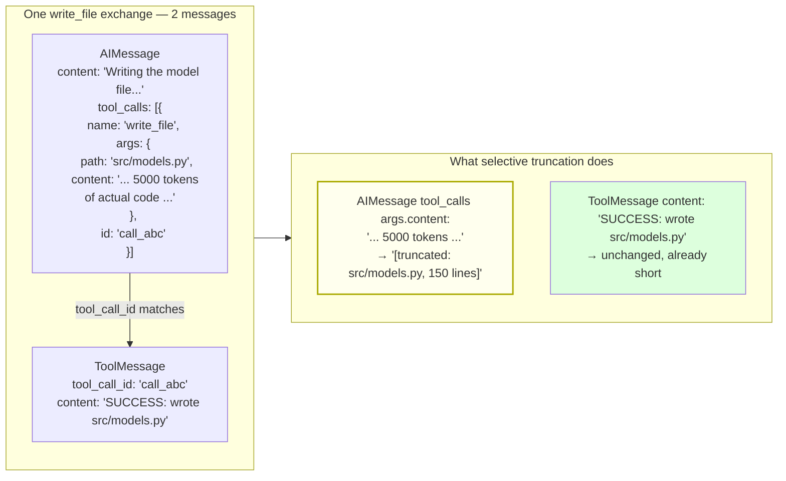
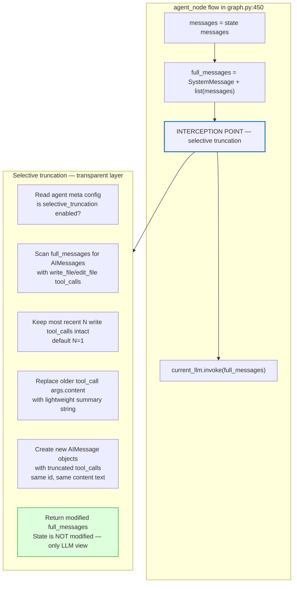
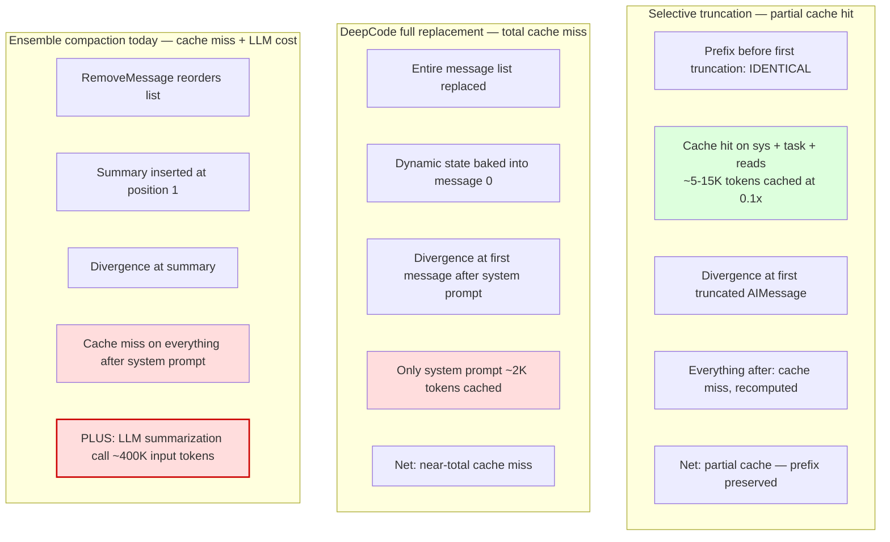
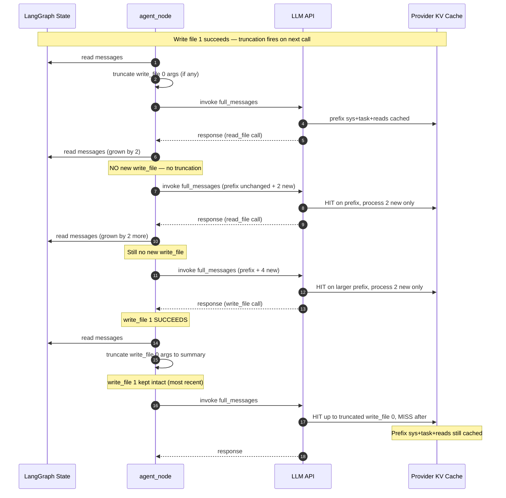
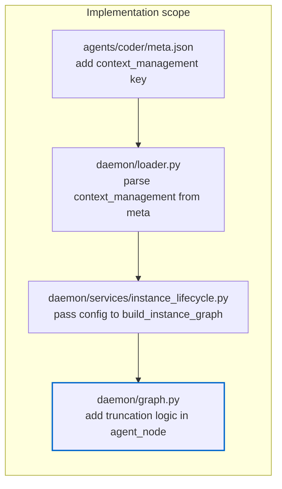
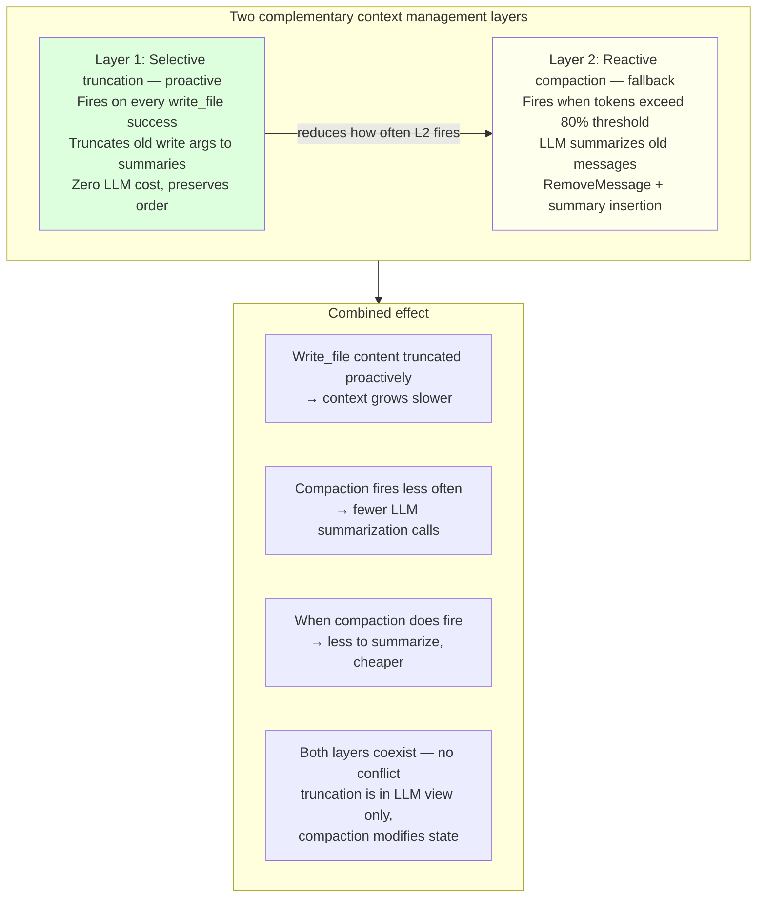
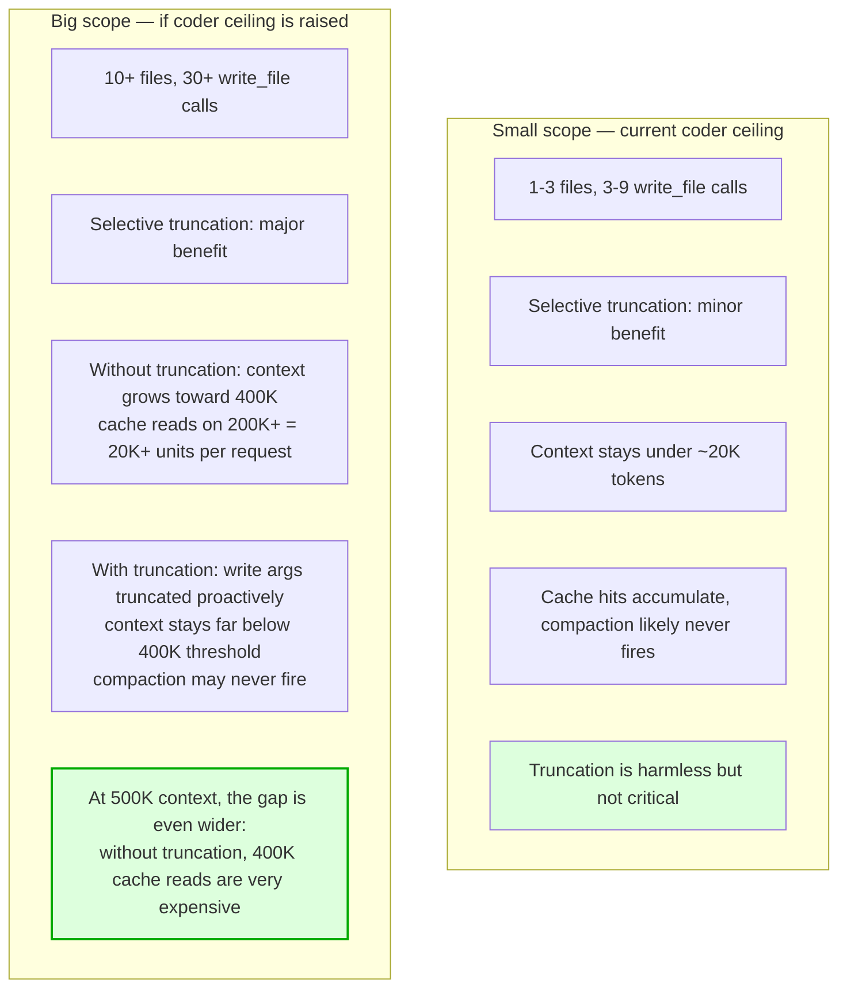

# Selective Context Truncation for Long Coding Sessions

**Date**: 2026-07-10
**Status**: Draft
**Impact**: `agents/coder/meta.json`, `daemon/graph.py`, `daemon/loader.py`, `daemon/services/instance_lifecycle.py`
**Source**: Refined from DeepCode investigation (`.inspiration-projects/DeepCode`)

---

## Problem

When coder writes multiple files in a session, each `write_file` / `edit_file` tool call
embeds the **full file content** in the AIMessage's `tool_calls[].args`. A 500-line file
is ~5K tokens. After 10 files, the conversation carries ~50K tokens of stale file content
the LLM already wrote and doesn't need to re-read.

Current mitigation (`daemon/compaction.py`): reactive token-threshold compaction that
calls an LLM to summarize old messages. This works but:
- Pays an LLM summarization call each time (~400K input tokens — the `agentic` model
  has a 500K context window via `config.yaml` override, so compaction fires at 80% = 400K)
- Uses `RemoveMessage` which **reorders** the message list, breaking prefix cache
- Is reactive — context grows to ~400K tokens before anything happens, making even
  cache-hit reads expensive (~40K token-units per request at 0.1× discount on 400K)

DeepCode's alternative (full message replacement on `write_file`) is too aggressive —
it discards the entire conversation, losing prefix cache entirely.

This plan introduces **selective truncation**: a middle ground that truncates only the
heavy file-write content in old tool calls, preserving message order and prefix cache.

---

## The Technique

### Core idea

On each `write_file` / `edit_file` success, scan the message history for **older**
write/edit tool calls and replace their heavy `args.content` with a lightweight summary.
Keep the most recent write intact. No LLM call, no message removal, no reordering.

```mermaid
flowchart TB
    subgraph BEFORE[Before truncation — after write_file 3]
        B1["sys_prompt"]
        B2["task description"]
        B3["read_file result A"]
        B4["read_file result B"]
        B5["AIMessage: write_file 1<br/>args.content = 5000 tokens of code"]
        B6["ToolMessage: SUCCESS wrote file1"]
        B7["read_file result C"]
        B8["AIMessage: write_file 2<br/>args.content = 3000 tokens of code"]
        B9["ToolMessage: SUCCESS wrote file2"]
        B10["read_file result D"]
        B11["AIMessage: write_file 3 — JUST SUCCEEDED<br/>args.content = 4000 tokens of code"]
        B12["ToolMessage: SUCCESS wrote file3"]
    end

    subgraph AFTER[After selective truncation]
        A1["sys_prompt — unchanged"]
        A2["task description — unchanged"]
        A3["read_file result A — unchanged"]
        A4["read_file result B — unchanged"]
        A5["AIMessage: write_file 1<br/>args.content = truncated summary"]
        A6["ToolMessage: SUCCESS wrote file1 — unchanged"]
        A7["read_file result C — unchanged"]
        A8["AIMessage: write_file 2<br/>args.content = truncated summary"]
        A9["ToolMessage: SUCCESS wrote file2 — unchanged"]
        A10["read_file result D — unchanged"]
        A11["AIMessage: write_file 3 — KEPT INTACT<br/>args.content = 4000 tokens of code"]
        A12["ToolMessage: SUCCESS wrote file3 — unchanged"]
    end

    BEFORE -->|"truncate old write_file args<br/>keep most recent intact<br/>no removal, no reorder"| AFTER

    style A5 fill:#ffe,stroke:#aa0
    style A8 fill:#ffe,stroke:#aa0
    style A11 fill:#dfd,stroke:#0a0
```



### What gets truncated

The heavy content lives in the **AIMessage's tool_call args**, not the ToolMessage:



The ToolMessage result is already short (`"SUCCESS: wrote src/models.py"` — see
`daemon/tools/filesystem.py:439`). The heavy part is the `args.content` in the AIMessage.
That's what we truncate.

### Where the interception happens



**Critical design choice: state is never modified.** The truncation creates new AIMessage
objects in the `full_messages` copy that goes to the LLM. The LangGraph state retains
original, untruncated messages for checkpoint integrity and crash recovery.

---

## Cache Analysis

### Why selective truncation preserves more cache than full replacement



| Approach | Prefix preserved | Cache miss size | LLM cost |
|----------|-----------------|-----------------|----------|
| Selective truncation | Up to first old write_file | From truncation point to end | Zero |
| DeepCode full replacement | System prompt only | All messages | Zero |
| Ensemble compaction | System prompt only | All messages after summary | 1 LLM call (~400K input) |

### Between truncation events, cache accumulates normally



Between writes, the prefix grows and cache hits accumulate. On each write, only old write
content is truncated — the prefix before the oldest write stays cached.

---

## Configuration — meta.json

Opt-in per agent. First agent to enable: `coder`.

```json
{
  "id": "coder",
  "name": "Coder",
  "context_management": {
    "selective_truncation": {
      "enabled": true,
      "truncate_tools": ["write_file", "edit_file"],
      "keep_recent": 1
    }
  }
}
```

| Field | Type | Default | Description |
|-------|------|---------|-------------|
| `enabled` | bool | `false` | Master switch. When false, agent uses standard compaction only. |
| `truncate_tools` | string[] | `["write_file", "edit_file"]` | Tool names whose AIMessage tool_call args get truncated. |
| `keep_recent` | int | `1` | Number of most recent matching tool calls to keep intact. Older ones are truncated. |

Agents without the `context_management` key are unaffected — fully backward compatible.

---

## Implementation Plan

### Files to change



### Step 1 — meta.json (coder)

Add the `context_management` key to `agents/coder/meta.json`:

```json
{
  "id": "coder",
  "name": "Coder",
  "description": "Direct coding agent — reads, writes, and edits code directly without OpenCode. Works hands-on with files, tests, and build systems.",
  "icon": "⌨️",
  "color": "accent-blue",
  "version": "0.1.0",
  "innate_skills": ["todo", "chart"],
  "context_management": {
    "selective_truncation": {
      "enabled": true,
      "truncate_tools": ["write_file", "edit_file"],
      "keep_recent": 1
    }
  },
  "tools": {
    "allow": ["bash", "filesystem", "time", "self", "help", "knowledge", "context"]
  }
}
```

### Step 2 — loader.py: parse the config

Extract `context_management` from the meta dict when loading an agent. Store it alongside
other agent metadata (innate_skills, tools config, etc.) so it's available at graph build
time.

The loader already reads `meta.get("innate_skills")`, `meta.get("no_force_explore")`,
etc. Add `meta.get("context_management")` in the same pattern.

### Step 3 — instance_lifecycle.py: pass config to graph builder

Pass the `context_management` config through to `build_instance_graph`:

```python
graph = build_instance_graph(
    tools=tools,
    checkpointer=self._checkpointer,
    llm_config=llm_config,
    system_prompt=system_prompt,
    retry_config=retry_config,
    compactor=self._compactor,
    graph_config=config,
    context_management=agent_meta.get("context_management"),  # NEW
)
```

### Step 4 — graph.py: the truncation logic

Add a `selective_truncation` parameter to `build_instance_graph` and `create_agent_node`.
In `agent_node`, between building `full_messages` and calling `current_llm.invoke()`:

```python
async def agent_node(state, config=None):
    messages = state['messages']
    full_messages = [SystemMessage(content=system_prompt)] + list(messages)

    # --- NEW: selective truncation ---
    if truncation_config and truncation_config.get("enabled"):
        full_messages = apply_selective_truncation(
            full_messages,
            truncate_tools=truncation_config.get("truncate_tools", ["write_file", "edit_file"]),
            keep_recent=truncation_config.get("keep_recent", 1),
        )
    # --- END NEW ---

    response = await loop.run_in_executor(
        None,
        lambda: current_llm.invoke(full_messages)
    )
```

The `apply_selective_truncation` function:

```python
def apply_selective_truncation(
    messages: list[BaseMessage],
    truncate_tools: list[str],
    keep_recent: int,
) -> list[BaseMessage]:
    """Truncate heavy tool_call args in old AIMessages.

    Scans for AIMessages whose tool_calls include tools in truncate_tools.
    Keeps the most recent `keep_recent` such messages intact.
    Replaces args content in older ones with a lightweight summary.

    Does NOT modify message order, remove messages, or touch ToolMessages.
    Returns a new list — original messages are unchanged.
    """
    # 1. Find indices of AIMessages with matching tool_calls
    write_indices = []
    for i, msg in enumerate(messages):
        if isinstance(msg, AIMessage) and getattr(msg, 'tool_calls', None):
            for tc in msg.tool_calls:
                if tc.get('name') in truncate_tools:
                    write_indices.append(i)
                    break  # one matching tool call is enough

    if len(write_indices) <= keep_recent:
        return messages  # nothing to truncate

    # 2. Indices to truncate (all except the most recent keep_recent)
    to_truncate = set(write_indices[:-keep_recent]) if keep_recent > 0 else set(write_indices)

    # 3. Build new message list with truncated AIMessages
    result = []
    for i, msg in enumerate(messages):
        if i in to_truncate:
            result.append(_truncate_aimessage_tool_calls(msg, truncate_tools))
        else:
            result.append(msg)

    return result


def _truncate_aimessage_tool_calls(msg: AIMessage, truncate_tools: list[str]) -> AIMessage:
    """Create a new AIMessage with heavy tool_call args replaced by summaries."""
    new_tool_calls = []
    for tc in msg.tool_calls:
        if tc.get('name') in truncate_tools:
            args = tc.get('args', {})
            path = args.get('path', args.get('file_path', 'unknown'))
            # Replace heavy content with lightweight summary
            if 'content' in args:
                line_count = args['content'].count('\n') + 1
                args = {**args, 'content': f'[truncated: {path}, ~{line_count} lines]'}
            elif 'old_string' in args or 'new_string' in args:
                args = {k: v if k not in ('old_string', 'new_string')
                        else f'[truncated: {k}]'
                        for k, v in args.items()}
            new_tool_calls.append({**tc, 'args': args})
        else:
            new_tool_calls.append(tc)

    # Create new AIMessage with same metadata, modified tool_calls
    return AIMessage(
        content=msg.content,
        tool_calls=new_tool_calls,
        id=msg.id,
    )
```

---

## Interaction with Existing Compaction



The two layers are complementary, not conflicting:
- **Selective truncation** is transparent (modifies only the LLM view, not state)
- **Compaction** modifies state (RemoveMessage + summary)
- When compaction fires, it operates on the STATE (which has full, untruncated messages).
  The truncation layer then applies on top of the compacted state for the LLM call.
- With truncation active, compaction fires less often because write_file content doesn't
  accumulate.

---

## Scope-Aware Behavior



For the current coder ceiling (≤3 files), truncation is harmless but not critical —
context stays small. The real value appears if/when coder's ceiling is raised to handle
larger features. The meta.json opt-in means it's ready for that without any further
changes.

---

## What This Does NOT Do

| Not included | Why |
|-------------|-----|
| Full message replacement (DeepCode style) | Loses prefix cache entirely. Selective truncation preserves partial cache. |
| LLM-generated per-file summaries | Adds LLM cost. Simple string truncation (`[truncated: path, ~N lines]`) is sufficient — the LLM doesn't need to re-read code it already wrote. |
| File-inventory completion gate (Idea 2) | Low value — Ensemble's Reviewer already catches incomplete work. See `coder-deepcode-memory-and-inventory.md` "Considered and Deprioritized" section. |
| Modifying LangGraph state | State retains full messages for checkpoint integrity. Truncation is transparent — only the LLM's view changes. |

---

## Open Questions

1. **`keep_recent` default.** Is 1 sufficient? The LLM might need to reference the
   previous file's content when implementing a dependent file. Consider 2 as default,
   or make it dynamic based on message count.

2. **Truncation summary richness.** Currently `[truncated: src/models.py, ~150 lines]`.
   Should it include key signatures (class names, function names)? This would require
   parsing the truncated content before discarding it — slightly more work but could
   improve cross-file awareness. Start simple, enhance if the LLM struggles.

3. **Interaction with `edit_file`.** Edit tool calls have `old_string` and `new_string`
   args, both potentially large. The plan truncates both. Is losing the diff context
   acceptable? Likely yes — the LLM knows what it edited from the tool result
   (`"SUCCESS: edited src/models.py"`).

4. **Should truncation also apply to `read_file` results?** Read results can be large
   (full file dumps). But reads are the LLM's primary context for the CURRENT file —
   truncating them defeats the purpose. Leave reads intact. Only truncate writes.

5. **Block-size alignment.** Provider KV caches match in chunks (vLLM: 16 tokens,
   Anthropic: 1024 tokens minimum). The truncation boundary may fall mid-chunk, causing
   a slightly larger cache miss than expected. Not a blocker — just means the effective
   cache hit is slightly smaller than the theoretical prefix.

---

## References

- DeepCode source: `.inspiration-projects/DeepCode/`
  - Full replacement approach (for contrast): `workflows/agents/memory_agent_concise.py:1546` (`create_concise_messages`)
  - Trigger detection: `workflows/agents/memory_agent_concise.py:1497` (`record_tool_result`)
- Ensemble current state:
  - Agent node (interception point): `daemon/graph.py:450` (`agent_node`)
  - LLM call: `daemon/graph.py:488` (`current_llm.invoke(full_messages)`)
  - Compaction (reactive, layer 2): `daemon/compaction.py:560` (`compact_state`)
  - Graph builder: `daemon/graph.py:654` (`build_instance_graph`)
  - Graph build call site: `daemon/services/instance_lifecycle.py:570`
  - Agent meta loading: `daemon/loader.py:588` (meta.json read)
  - write_file tool result format: `daemon/tools/filesystem.py:439` (`"SUCCESS: {action} {file_path}"`)
  - CompactionConfig: `daemon/config.py:243`
  - Coder meta.json: `agents/coder/meta.json`
  - Coder soul.md: `agents/coder/soul.md` (Implement phase at line 116)
- Related plan: `docs/plans/coder-deepcode-memory-and-inventory.md` (investigation notes,
  Idea 2 deprioritization rationale)
