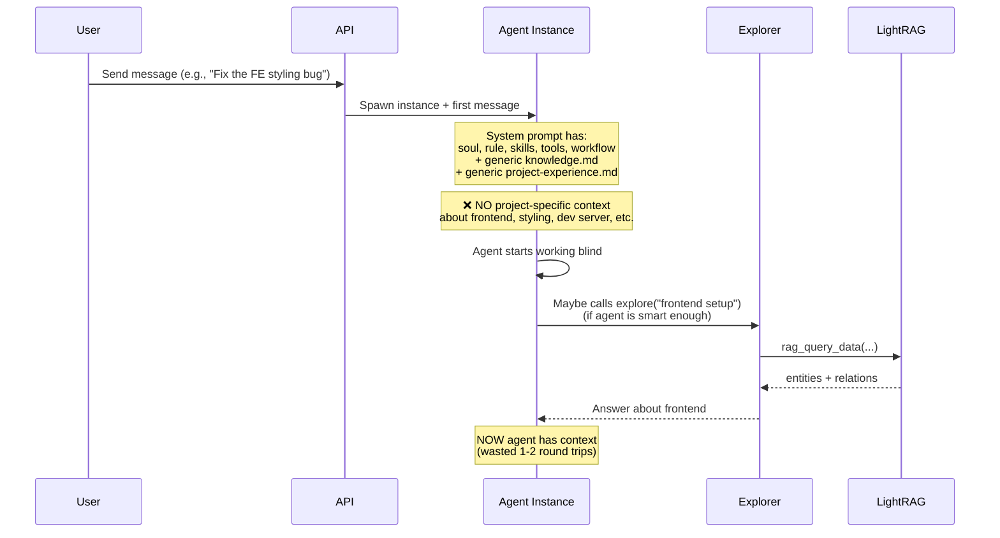
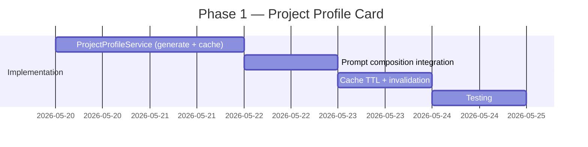

# KB Auto-Load Experience — Problem Statement & Proposal

> **Status:** Draft  
> **Created:** 2026-05-19  
> **Scope:** Smart pre-loading of relevant project experience into agent instances

---

## Problem Statement

### Current State

The KB system has two agents that work as **on-demand tools**:

- **Explorer** — queries the RAG knowledge base (LightRAG) when explicitly called via `explore()`
- **Experiencer** — records new knowledge when explicitly called via `experience()`

Both are tools that agents invoke manually. The system prompt loaded at instance spawn contains:

```
soul → rule → skill(s) → dynamic_tools → tools_note → workflow → memory → recent_memories → knowledge.md → project-experience.md
```

The last two sections — `knowledge.md` and `project-experience.md` — are **generic static files**. They explain *how* to use `explore()` and `experience()`, but they do **not contain any actual project-specific knowledge**.

### The Cold-Start Gap



### Pain Points

1. **Agents start blind** — no project-specific experience is pre-loaded into the system prompt
2. **Relies on agent initiative** — the agent must know to call `explore()` and what to ask
3. **Wasted round-trips** — every instance potentially re-discovers the same basic facts (tech stack, build commands, project structure)
4. **Generic prompts** — `knowledge.md` and `project-experience.md` are identical for every agent and every request, regardless of context
5. **Repeated cost** — if 10 instances spawn for the same project, each one independently calls `explore()` to learn that `npm start` runs the dev server

### Concrete Example

A user sends: *"Fix the frontend CSS layout issue on the dashboard page"*

**What the agent needs to know immediately:**
- Frontend uses Angular 21 with TypeScript
- `cd frontend && npm start` starts the dev server on port 4200
- Angular components live in `frontend/src/app/`
- CSS files use SCSS preprocessor
- The dashboard component is at `frontend/src/app/dashboard/`

**What the agent currently gets:**
- Generic instructions on *how* to use `explore()` and `experience()`
- No actual project knowledge
- Must waste 1-3 round-trips discovering these basic facts

---

## Proposed Solution: Three-Layer Context Enrichment

```mermaid
graph TD
    subgraph "Layer 0: Project Profile Card"
        A[Auto-generated from KB entities] --> B[Cached per project]
        B --> C[Injected into system prompt at spawn]
    end

    subgraph "Layer 1: First-Message Bootstrap"
        D[First user message arrives] --> E[Extract topics via keywords]
        E --> F[Single fast RAG query<br/>mode=local, top_k=5]
        F --> G[Inject as context prefix<br/>before agent sees message]
    end

    subgraph "Layer 2: Agent-Driven explore()"
        H[Agent calls explore() explicitly] --> I[Deep KB queries<br/>existing behavior]
    end

    C --> J[Agent starts with context]
    G --> J
    I --> J
```

---

### Layer 0: Project Profile Card (Always Loaded, Cached)

**What:** A compact, auto-generated summary of essential project facts — the "README for agents". Always present in the system prompt, shared across all instances for that project.

**When:** Loaded at instance spawn time. Cached per project with 30-minute TTL.

**How it works:**

1. A new `ProjectProfileService` generates the card by querying LightRAG
2. Card is cached in memory (per project) and refreshed periodically
3. Injected into system prompt via `compose_system_prompt()` as a new section

**Example output (~300-500 tokens):**

```markdown
## Project Profile: agents-ensemble

### Tech Stack
- **Backend**: Python 3.13+, FastAPI, LangGraph 0.3+, SQLModel, aiosqlite
- **Frontend**: Angular 21 (TypeScript)
- **Package Manager**: uv (Python), npm (Frontend)
- **Knowledge**: LightRAG (knowledge graph)

### Key Commands
- Dev server (backend): `./dev.sh` or `uvicorn daemon.api:app --reload --port 8079`
- Dev server (frontend): `cd frontend && npm start` (port 4200)
- Tests (backend): `pytest tests/ -v`
- Tests (frontend): `cd frontend && npm test`

### Architecture
- Entry point: `daemon/__main__.py`
- API routes: `daemon/api.py`
- LangGraph: `daemon/graph.py`
- Agent loader: `daemon/loader.py`
- Instance management: `daemon/manager.py`

### Important Notes
- Dev port: 8079 (NEVER kill 8088 — production)
- Two SQLite DBs: data/ensemble.db + data/checkpoints.db
- SSE for real-time streaming
```

**Generation approach (two options):**

| Option | Method | Pros | Cons |
|--------|--------|------|------|
| **A: Entity-Based** | Query entities by type (`TECH_STACK`, `COMMAND`, `DIRECTORY`) and format directly | Fast, deterministic, no LLM needed | Requires properly typed entities in KB |
| **B: LLM-Synthesized** | Run `rag_query()` with broad topic queries, use quick model to synthesize into card | Works with existing unstructured KB data | LLM call on cache miss (~200-500ms) |

**Recommendation:** Start with **Option B** (LLM-synthesized) since it works with existing KB data. Evolve to Option A as the experiencer gets better at creating typed entities.

**Cache invalidation:**
- Time-based: 30-minute TTL
- Event-based: Invalidate when `experience()` records categories like `architecture`, `commands`, `setup`

**Implementation changes:**

| File | Change |
|------|--------|
| `daemon/services/project_profile.py` | **New** — `ProjectProfileService` with `generate_card()`, `get_cached_card()` |
| `daemon/loader.py` | Add `load_project_profile(project_id: str \| None) -> str` function |
| `daemon/loader.py` | `compose_system_prompt()` accepts new `project_profile` parameter |
| `daemon/services/instance_lifecycle.py` | Pass `project_id` through to `load_and_cache_prompt()` |
| `daemon/loader.py` | `load_and_cache_prompt()` accepts optional `project_id` for profile lookup |

---

### Layer 1: First-Message Context Bootstrap (On-Demand)

**What:** When the first message arrives at an instance, automatically extract topics and run a **single fast RAG query** to fetch relevant knowledge. Inject the result as a context prefix before the agent processes the message.

**When:** Only on the first message to an instance. Subsequent messages are not enriched.

**How it works:**

1. Instance receives first message
2. Extract 3-5 key topics using keyword matching (no LLM — pure regex for speed)
3. Run a single `rag_query_data()` with `mode="local"`, `top_k=5`, `max_entity_tokens=1000`
4. Prepend the result to the message:

```
## Auto-loaded Project Context
{entities and relations}

---

{original user message}
```

**Topic extraction (fast, no LLM):**

```python
_TOPIC_KEYWORDS = {
    "frontend": [
        "frontend", "fe", "angular", "ui", "component", "css", "html",
        "template", "npm", "typescript", "ts", "style", "layout", "page",
        "form", "button", "karma", "jasmine", "browser", "dom",
    ],
    "backend": [
        "backend", "be", "api", "server", "endpoint", "route", "fastapi",
        "uvicorn", "python", "model", "schema", "database", "orm", "sqlmodel",
    ],
    "testing": [
        "test", "spec", "pytest", "coverage", "unit test", "integration",
        "mock", "fixture", "assert",
    ],
    "devops": [
        "deploy", "docker", "ci", "cd", "pipeline", "build", "env",
        "config", "production", "staging",
    ],
    "architecture": [
        "architect", "design", "pattern", "module", "service", "layer",
        "refactor", "structure", "organize",
    ],
    "database": [
        "database", "db", "sqlite", "migration", "schema", "table",
        "query", "sql",
    ],
}
```

**Implementation changes:**

| File | Change |
|------|--------|
| `daemon/services/context_enricher.py` | **New** — `enrich_first_message(message, project_id)` |
| `daemon/services/message_service.py` | Call enricher on first message to an instance |
| `daemon/rag/client.py` | Possibly add `query_context_only()` for ultra-fast context retrieval |

**Performance:** Single RAG call adds ~100-300ms latency on first message only.

---

### Layer 2: Agent-Driven explore() (Enhanced Existing)

**What:** Keep the existing `explore()` tool but update the prompts so agents understand what's already pre-loaded and when to do deeper queries.

**Enhancements:**
- Update `knowledge.md` to explain the pre-loaded context layers
- Agents should understand: "You already have a Project Profile Card and topic-specific context. Use `explore()` for deeper/niche queries beyond what's pre-loaded."
- Consider passing agent role/task type to Explorer for better prioritization

**Implementation changes:**

| File | Change |
|------|--------|
| `agents/_prompt_system/knowledge.md` | Update instructions for pre-loaded context awareness |
| `agents/explorer/workflow.md` | Optional: receive agent role context for prioritization |

---

## Token Budget Analysis

| Component | Tokens | Loaded When | Cached? |
|-----------|--------|-------------|---------|
| Current system prompt (avg) | ~3,000 | Spawn time | Yes (per agent) |
| **+ Project Profile Card** | **~300-500** | Spawn time | Yes (per project, 30min TTL) |
| **+ First-Message Context** | **~500-1,000** | First message | No (per instance) |
| Agent-driven explore() | ~500-2,000 | On-demand | No |
| **Total worst case** | **~4,000-6,500** | | |

**Impact assessment:**
- ~10-15% increase in system prompt tokens
- Eliminates 1-2 `explore()` round-trips per instance (each round-trip is ~5-10s + tokens)
- **Net positive** for both latency and total token usage

---

## Implementation Phases

### Phase 1: Project Profile Card (Highest Value, Lowest Risk)

**Objective:** Auto-generate and inject a cached project summary into every instance's system prompt.

**Dependency:** Requires RAG to be enabled (same as current `explore()`).

**Estimated effort:** 2-3 days



| # | Task | Details | Key Files |
|---|------|---------|-----------|
| 1 | Create `ProjectProfileService` | `generate_card(project_name)` → queries RAG, synthesizes via quick model; `get_cached_card(project_id)` → returns cached or generates | `daemon/services/project_profile.py` (new) |
| 2 | Add `load_project_profile()` | New loader function, calls `ProjectProfileService` with project_id | `daemon/loader.py` |
| 3 | Update `compose_system_prompt()` | Accept `project_profile` parameter; inject as section between knowledge.md and project-experience.md | `daemon/loader.py` |
| 4 | Thread `project_id` through spawn | `load_and_cache_prompt()` needs project_id to load the right profile | `daemon/loader.py`, `daemon/services/instance_lifecycle.py` |
| 5 | Cache invalidation | TTL-based (30min) + event-based (invalidate on architecture/command experience) | `daemon/services/project_profile.py` |
| 6 | Tests | Unit tests for profile generation, caching, prompt composition | `tests/unit/services/test_project_profile.py` (new) |

**Prompt composition order update:**

```
soul → rule → skill(s) → dynamic_tools → tools_note → workflow → memory → recent_memories
→ knowledge.md → PROJECT_PROFILE_CARD → project-experience.md
                                                   ^^^ NEW
```

---

### Phase 2: First-Message Context Bootstrap

**Objective:** Automatically enrich the first message with topic-relevant KB context.

**Dependency:** Phase 1 (shares RAG infrastructure).

**Estimated effort:** 2-3 days

| # | Task | Details | Key Files |
|---|------|---------|-----------|
| 1 | Create topic keyword map | Domain-specific keyword → topic mapping | `daemon/services/context_enricher.py` (new) |
| 2 | Implement `enrich_first_message()` | Extract topics → build RAG query → inject context | `daemon/services/context_enricher.py` |
| 3 | Hook into message flow | Detect first message per instance, call enricher | `daemon/services/message_service.py` |
| 4 | Tests | Unit tests for topic extraction, enrichment, first-message detection | `tests/unit/services/test_context_enricher.py` (new) |

---

### Phase 3: Enhanced Experience Recording & Prompt Updates

**Objective:** Make the experiencer tag knowledge with categories and update prompts.

**Dependency:** Phase 1 and 2 (categories feed into better profile generation and enrichment).

**Estimated effort:** 2-3 days

| # | Task | Details | Key Files |
|---|------|---------|-----------|
| 1 | Add categorization to experiencer | Auto-tag entities with categories (frontend, backend, testing, etc.) | `agents/experiencer/workflow.md`, `agents/experiencer/soul.md` |
| 2 | Profile invalidation on experience | When category matches profile topics, invalidate cache | `daemon/services/project_profile.py` |
| 3 | Update `knowledge.md` prompts | Explain pre-loaded context layers; guide agents on when to explore deeper | `agents/_prompt_system/knowledge.md` |
| 4 | Tests | Verify category tagging, cache invalidation triggers | `tests/unit/services/test_project_profile.py` |

---

## Alternatives Considered

| Approach | Pros | Cons | Verdict |
|----------|------|------|---------|
| **Agent-role pre-queries** (e.g., coder always gets "build commands") | Simple implementation | Too rigid; misses task-specific context; doesn't adapt to different projects | ❌ Rejected — not flexible enough |
| **LLM-based message analysis** for topic detection | Most accurate topic detection | 200-500ms extra latency per message; adds cost | ⏳ Deferred — consider for future enhancement over keyword matching |
| **Full KB dump into system prompt** | Maximum context | Too many tokens; stale data; impractical for any non-trivial KB | ❌ Rejected — token budget blowout |
| **Middleware intercepting all messages** | Complete coverage | Complex; latency on every message; over-engineered | ❌ Rejected — first-message-only is sufficient |
| **Periodic KB → file sync** (write KB to static files) | Works without RAG at runtime | Stale data; file management overhead; duplicates LightRAG purpose | ❌ Rejected — over-engineered |
| **Background warm-up at spawn** (async explore() during spawn) | No latency impact on user | Race condition: agent may process message before context loads | ⏳ Deferred — tricky synchronization |

---

## Success Criteria

- [ ] Every instance spawned with a `project_id` gets a Project Profile Card in its system prompt
- [ ] Profile card contains tech stack, key commands, and architecture overview
- [ ] Profile card is cached and shared across instances for the same project
- [ ] First message to an instance is automatically enriched with topic-relevant context
- [ ] No more than 500ms added latency on instance spawn or first message
- [ ] Total token increase < 15% of current system prompt
- [ ] Existing `explore()` and `experience()` behavior unchanged
- [ ] Agent prompts updated to reflect pre-loaded context

---

## Open Questions

1. **Profile generation trigger:** Should the profile be generated on first instance spawn for a project, or pre-generated when a project is created/registered?
   - **Lean:** Generate on first spawn, cache for 30min.
   - **Proactive:** Generate on project creation, refresh periodically.

2. **Profile granularity:** Should there be one profile per project, or sub-profiles (e.g., "frontend" and "backend" sections that load based on agent role)?
   - **Recommendation:** Start with one unified profile. Sub-profiles can be layered on later.

3. **Should the Project Profile Card be editable by humans?** If someone writes a `.agents/project-profile.md`, should it override the auto-generated one?
   - **Recommendation:** Yes — hand-written overrides auto-generated. Detect file existence and prefer it.

4. **First-message enrichment scope:** Should child instances (spawned by other agents) also get enrichment, or only top-level instances?
   - **Recommendation:** Only top-level instances (no parent_id). Child instances are typically specialized and inherit context from the parent's explore() calls.

---

## Tracking

- Created: 2026-05-19
- Status: Draft
- Related: `docs/plans/unified-memory-architecture.md`
