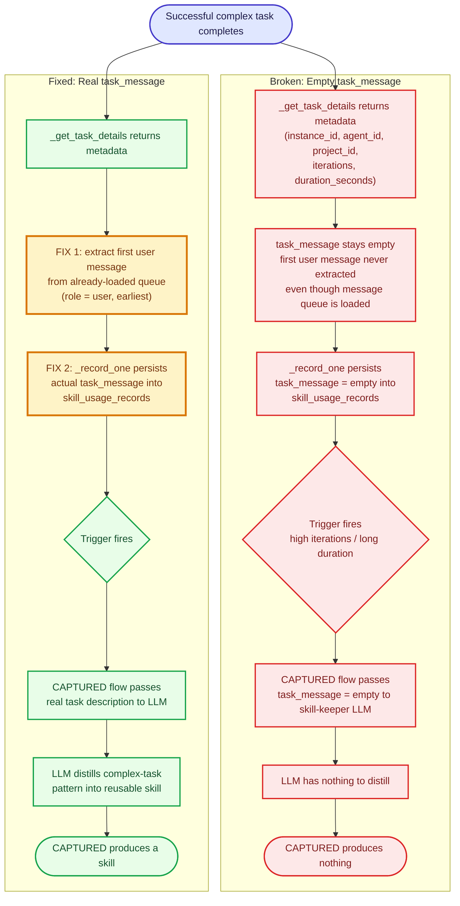
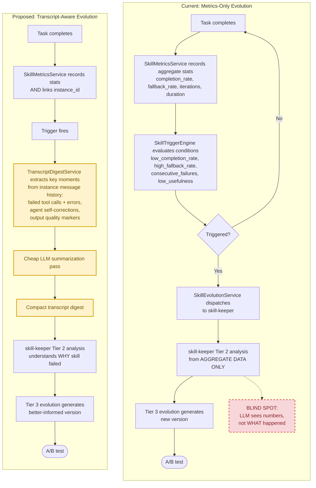

# Skill Evolution Improvements — Roadmap

> **Purpose.** Capture the full improvement landscape for the skill evolution system
> after the `skill_feedback` upgrade (usefulness scoring + improvement notes).
> This is a *planning* document — no code changes here, just analysis, scope, and a
> recommended order of attack.

---

## Status at a Glance

| ID  | Improvement                                    | Tier   | Scope   | Deps            | Status       |
|-----|------------------------------------------------|--------|---------|-----------------|--------------|
| 0.0 | `skill_feedback` upgrade (usefulness + note)  | —      | SMALL   | —               | ✅ **Done**  |
| 0.1 | Agent prompts updated to encourage feedback   | —      | TINY    | 0.0             | ✅ **Done**  |
| 1.1 | Fix automatic CAPTURED flow (`task_message`)  | 1      | SMALL   | —               | 🟡 Planned   |
| 1.2 | A/B winner selection — add usefulness signal  | 1      | SMALL   | 0.0 (Done)      | 🟡 Planned   |
| 1.3 | HTTP API parity for `skill_feedback`          | 1      | TINY    | 0.0 (Done)      | 🟡 Planned   |
| 2.1 | Transcript-aware evolution (game-changer)      | 2      | BIG     | instance_id link| 💡 Conceptual|
| 2.2 | Implement `list_captured_opportunities()`     | 2      | SMALL   | — (1.1 enhances)| 🟡 Planned   |
| 2.3 | Fix `auto_load` skills metrics invisibility   | 2      | TINY    | —               | 🟡 Planned   |
| 3.1 | Prompt-injection hardening (remaining fields) | 3      | TINY    | —               | 🟡 Planned   |
| 3.2 | Naming discrepancy (skill-evolution vs keeper)| 3      | TINY    | —               | ✅ **Verified already fixed** |
| 4.0 | Evolution metrics dashboard (future vision)   | —      | BIG     | many            | 💡 Conceptual|

Legend: ✅ Done/Verified · 🟡 Planned · 💡 Conceptual

---

## Key Design Decisions

Architectural decisions that shape how this roadmap should be implemented. This
section is **extensible** — new decisions get appended here as they're made.

### Decision 1 — `usefulness` transitions from optional → required

**When:** This flip happens as part of implementing **Item 1.2** (A/B Winner
Selection — Add Usefulness Signal).

**Decision:** The `usefulness` parameter of `skill_feedback` is **optional during
initial rollout** and becomes **required** once A/B winner selection depends on it.

**Rationale — intentional two-phase rollout:**
- **Phase 1 (now, ✅ Done):** `usefulness` is optional. Goal is to start collecting
  data and let the feedback pipeline stabilize without breaking existing call sites
  or forcing every agent prompt to change upfront.
- **Phase 2 (at Item 1.2):** `usefulness` becomes required. The moment the evolution
  system *depends on* usefulness to pick A/B winners, sparse/missing scores would
  silently degrade winner selection back to completion_rate-only. Enforcing
  collection at that point guarantees the gate always has data to evaluate.

**Impact at cutover:**
- `skill_feedback` tool signature: `usefulness` moves from `Optional[int]` → `int`
  (required). Note the `applied=False` carve-out discussed in Item 1.2 — when the
  agent didn't apply the skill, usefulness is still optional.
- Agent prompts (`dynamic-skill` innate skill, worker `soul.md`, tester dispatch
  templates) must be updated to describe `usefulness` as required.
- The REST API (Item 1.3) must launch with `usefulness` required to match — don't
  ship 1.3 with it optional only to flip it later.

**Related items:** 0.0 (✅ the optional rollout), 1.2 (the cutover), 1.3 (API
parity must match).

---

## 1. Current State Assessment

The skill evolution system is a 5-phase architecture (foundation tables → search →
injection → metrics/triggers → evolution) that grows skills over time. It is
**metrics-driven**: the skill-keeper LLM reasons about *aggregate* signals, never
raw conversation transcripts.

### What works today

- **Skill-keeper agent** (`agents/skill-keeper/`) is spawned on-demand via
  `system_parallel_queue` (concurrency 5). It runs a **Tier 2** (cheap-model)
  analysis pass, then a **Tier 3** (evolution-model) execution pass. Cost is
  controlled by the tiered model (Tier 0 free recording → Tier 1 free rule check
  → Tier 2 cheap LLM → Tier 3 main LLM).
- **Metric recording.** `SkillMetricsService` records 5 counters per skill
  (`total_selections`, `total_applied`, `total_completions`, `total_fallbacks`,
  `consecutive_failures`) plus per-task rows in `skill_usage_records`.
- **Trigger engine.** `SkillTriggerEngine` evaluates 5 default conditions:
  `low_completion_rate` (<0.3), `high_fallback_rate` (>0.5),
  `consecutive_failures` (≥3), `task_count_scan` (≥20), `periodic_scan` (7 days),
  plus the new `low_usefulness` (avg <4.0 over ≥5 scored records).
- **A/B testing.** Both old+new skill versions are served simultaneously;
  deterministic MD5-hash variant selection; resolution after 10 comparisons with a
  15% minimum-difference threshold.
- **`skill_feedback` upgrade** ✅ **DONE (2026-07-21).** New params
  `feedback_usefulness` (1–10) and `feedback_improvement` (free text), new DB
  columns `feedback_usefulness` / `feedback_improvement`, new `low_usefulness`
  trigger, prompt-injection defense via `_sanitize_note_text()`, and evolution
  prompts updated to surface usefulness and improvement suggestions.
  > ⏩ **Forward-looking note.** `usefulness` is **currently optional** to avoid
  > breaking changes during initial rollout. It will become **REQUIRED** once Item
  > 1.2 (A/B winner selection) is implemented. This is an **intentional two-phase
  > rollout**: (1) collect data with an optional param, (2) enforce collection once
  > the system depends on it. See **Key Design Decisions → Decision 1**.
- **Agent prompts updated** ✅ **DONE.** Agents are now nudged to submit rich,
  scored feedback.

### The key limitation

> **The skill-keeper LLM does NOT read conversation transcripts.** It works from
> aggregate metrics (completion_rate, fallback_rate, iterations, duration) and the
> skill's own content. When a skill fails, the LLM knows *that* it failed, not
> *why*. Closing this gap (item **2.1**) is the biggest qualitative lever in this
> roadmap.

---

## 2. Improvement Roadmap

Items are grouped by tier (impact/priority). Each item follows a consistent
structure: **Problem → Impact → Scope → Dependencies → Status → Approach.**

---

### Tier 1 — High Impact (close the biggest gaps)

#### 1.1 Fix Automatic CAPTURED Flow

- **Problem.** The automatic CAPTURED evolution flow is supposed to distill
  *successful complex tasks* into reusable skills without agent intervention. It is
  currently **silently broken** because the task description never reaches the LLM.

  - `_get_task_details()` at `daemon/services/job_queue_service.py:1915` returns
    only metadata: `instance_id`, `agent_id`, `project_id`, `iterations`,
    `duration_seconds`. It does **not** populate `task_message`.
  - The `task_message` column exists on `skill_usage_records`, but `_record_one()`
    in `daemon/services/skill_metrics_service.py:649` never persists it.
  - Net result: the CAPTURED flow passes `task_message=""` to the skill-keeper LLM,
    so there is **nothing to distill into a skill**.

  Notably, `_get_task_details()` already loads the message queue (at
  `job_queue_service.py:2034`) — but only to **count** AI messages for the
  `iterations` field. The first user message content is right there and unused.

- **Impact.** Automatic skill capture would actually work. Successful complex-task
  patterns get distilled into reusable skills with zero agent effort — the holy
  grail of self-improving skills.

- **Scope.** SMALL.

- **Dependencies.** None.

- **Status.** 🟡 **Planned.**

- **Fix approach.**
  1. In `_get_task_details()`, extract the first `role='user'` message content from
     the already-loaded message queue (don't re-fetch — reuse the loaded list) and
     add it to the returned dict as `task_message`.
  2. In `_record_one()`, persist `task_message` into the `skill_usage_records` row
     on both the INSERT path and the UPDATE path (idempotency guard).
  3. Verify the CAPTURED evolution flow in `SkillEvolutionService` forwards the
     real `task_message` into the Tier 2/3 prompts.

---

#### 1.2 A/B Winner Selection — Add Usefulness Signal

- **Problem.** `check_ab_test_resolution()` decides the A/B winner using **only**
  `completion_rate`. A skill that "completes" tasks but agents rate 2/10 for
  quality would still "win." Fallback rate, iterations, duration, and agent
  feedback are all ignored.

- **Impact.** Evolution selects skills that are *genuinely better*, not just ones
  that don't crash. Aligns winner selection with the just-added usefulness data.

- **Scope.** SMALL.

- **Dependencies.** 0.0 — `skill_feedback` upgrade (✅ Done). The usefulness column
  must exist before it can feed winner selection.

- **Status.** 🟡 **Planned.**

- **Fix approach.** Two viable options:
  - **(a) Multi-factor score.** Weighted combination, e.g.
    `score = 0.5 * completion_rate + 0.3 * (avg_usefulness/10) + 0.2 * (1 - fallback_rate)`.
    Tunable weights, single number to compare.
  - **(b) Two-gate system.** A variant must clear *both* a minimum `completion_rate`
    *and* a minimum `avg_usefulness` to win. Simpler to reason about, rejects
    high-completion-but-low-quality skills outright.
  - Recommendation: start with the **two-gate** system (clearer semantics, easier
    to test) and graduate to weighted scoring once we have enough data to tune
    weights empirically.

- **Design Decision — `usefulness` transitions from optional → required.**
  Implementing this item flips the `usefulness` parameter of `skill_feedback`
  from **optional to REQUIRED**.

  - **Rationale.** A/B winner selection is *meaningless* without usefulness data.
    If evolution decisions depend on usefulness, we must enforce its collection —
    otherwise the winner gate can't evaluate and the whole item degrades to
    completion_rate-only (i.e. no improvement over today).
  - **Consequence for agents.** Agents MUST provide a usefulness score every time
    they call `skill_feedback` after consuming a skill. The agent prompts
    (`dynamic-skill` innate skill, worker `soul.md`, etc.) must be updated to
    present `usefulness` as **required**, not optional.
  - **Edge case — "genuinely can't assess".** Not every call has a meaningful
    score to give. Two acceptable resolutions to discuss at implementation time:
    1. Allow `usefulness=0` as a distinct **"unable to assess"** sentinel with
       different semantics from a real 1–10 score (and exclude `0` from averages /
       trigger math so it doesn't drag down `low_usefulness`).
    2. Allow `applied=False` to **skip** the usefulness requirement entirely — if
       the agent didn't apply the skill, it has nothing to rate. This keeps
       `usefulness` strictly required *only when the skill was actually used*.

    Option (2) is the more conservative choice (no new sentinel value, reuses
    existing `applied` semantics) and is the current lean.

---

#### 1.3 HTTP API Parity for `skill_feedback`

- **Problem.** The in-agent `skill_feedback` tool now accepts `usefulness` and
  `improvement_note`, but the REST endpoint
  `POST /api/skills/{skill_id}/feedback`
  (`daemon/routers/skills.py:1265`, schema `SkillFeedbackRequest` in
  `daemon/routers/skill_schemas.py:100`) still exposes only `applied` + `note`.
  External systems and the UI cannot submit enriched feedback.

- **Impact.** Feedback collection is no longer limited to in-agent tool calls —
  enables UI-driven feedback widgets and external integrations.

- **Scope.** TINY.

- **Dependencies.** 0.0 — `skill_feedback` upgrade (✅ Done).

- **Status.** 🟡 **Planned.**

- **Fix approach.** Add `usefulness: int | None` (1–10, validated) and
  `improvement_note: str | None` to `SkillFeedbackRequest`; thread them through
  `post_feedback` → `SkillMetricsService.record_feedback`, applying the same
  `_sanitize_note_text()` defense already used by the tool path.

---

### Tier 2 — Medium Impact (make evolution smarter)

#### 2.1 Transcript-Aware Evolution *(The Game-Changer)*

- **Problem.** When a skill is flagged for evolution, the skill-keeper LLM guesses
  *why* it failed from aggregate numbers. It cannot see the actual execution —
  which tool calls errored, how the agent self-corrected, where the breakthrough
  happened. It knows the skill failed; it does not know *how*.

- **Impact.** The evolution LLM would understand **why** a skill failed, not just
  **that** it failed. This is the **biggest qualitative leap** available — it turns
  blind statistical evolution into evidence-based improvement.

- **Scope.** BIG.

- **Dependencies.**
  - `instance_id` is already linked on feedback/usage records (✅ Done) — this is
    the join key into message history.
  - Design work for the transcript-digest pipeline (see below).

- **Status.** 💡 **Conceptual.**

- **Design considerations.**
  - **When to extract.** Only when a skill is flagged for evolution (reactive), not
    on every task completion — to control cost. Optionally also for CAPTURED
    candidates (1.1/2.2) to give the distillation LLM real context.
  - **What to extract (signal, not noise).** From the instance's message history:
    failed tool calls + their error messages, agent self-corrections, and final
    output quality markers. Skip routine successful steps.
  - **How to compress.** A cheap-LLM summarization pass produces a compact
    **"transcript digest"** — full transcripts are too expensive to feed into Tier
    2/3 prompts directly.
  - **Token budget.** Target a digest of a few hundred tokens; balance token cost
    vs. signal. Cap number of extracted "moments."
  - **Surface in prompts.** Feed the digest into the Tier 2 analysis and Tier 3
    evolution prompts: *"Here's what happened when this skill was used: [digest]."*
  - **Suggested new component:** a `TranscriptDigestService` that takes
    `instance_id` (+ skill_id) and returns the compact digest.

---

#### 2.2 Implement `list_captured_opportunities()`

- **Problem.** The skill-keeper's `agents/skill-keeper/soul.md:140` lists
  `list_captured_opportunities(...)` as one of its tools, but the function **does
  not exist in code** (`daemon/tools/skill_evolution_tools.py`). The skill-keeper
  therefore cannot proactively query for CAPTURED candidates — it can only react to
  triggered jobs.

- **Impact.** Enables proactive skill creation from complex successful tasks, not
  just reactive evolution of existing skills.

- **Scope.** SMALL.

- **Dependencies.** None strictly. Item 1.1 (real `task_message`) strongly enhances
  it — without 1.1, returned candidates carry empty task descriptions.

- **Status.** 🟡 **Planned.**

- **Fix approach.** Implement in `skill_evolution_tools.py` under the
  `"skill-evolution"` tool category. Query: find recent successful tasks with high
  iteration counts or long durations that have no associated skill. Surface
  `task_message` (post-1.1), `iterations`, `duration_seconds`, `instance_id` so the
  skill-keeper can decide which patterns are worth capturing.

---

#### 2.3 Fix `auto_load` Skills Metrics Invisibility

- **Problem.** Auto-loaded skills (e.g. `test-strategy`) bypass injection tracking:
  `append_auto_load_skills()` does **not** write to the
  `last_injected_skill_ids` instance metadata key. They are therefore invisible to
  all metrics systems, which key off `last_injected_skill_ids`
  (`daemon/services/skill_metrics_service.py:100`).

- **Impact.** Core skills that every agent loads would finally accrue evolution
  data — usage counts, completion, feedback. Today they're a blind spot in the
  metrics.

- **Scope.** TINY.

- **Dependencies.** None.

- **Status.** 🟡 **Planned.**

- **Fix approach.** Have `append_auto_load_skills()` (skill clone/injection path)
  append auto-loaded skill IDs to `last_injected_skill_ids`, mirroring the normal
  injection write. Mind the existing semantics (clear-on-completion, dedup) so
  counters bump exactly once per task.

---

### Tier 3 — Reliability & Polish

#### 3.1 Prompt-Injection Hardening (Remaining Fields)

- **Problem.** We sanitize `improvement_note` via `_sanitize_note_text()`, but
  other fields that flow into LLM prompts are **unsanitized**:
  - `direction` (from Tier 2 analysis output),
  - `skill.name`,
  - `skill.description`,
  - `task_message`.

- **Impact.** Defense in depth against adversarial inputs. A malicious
  `task_message` or skill `description` could currently inject instructions into
  the evolution LLM.

- **Scope.** TINY.

- **Dependencies.** None.

- **Status.** 🟡 **Planned.**

- **Fix approach.** Apply `_sanitize_note_text()` (or a sibling sanitizer tuned per
  field, e.g. tighter length caps for `skill.name`) to every field interpolated
  into Tier 2/3 prompts. Centralize in one helper and call it at every prompt-build
  site.

---

#### 3.2 Naming Discrepancy — `skill-evolution` vs `skill-keeper`

- **Problem (as originally reported).** Trigger-driven evolution jobs were said to
  hardcode `agent_id="skill-evolution"` instead of `"skill-keeper"` in
  `daemon/manager.py`, which would prevent proper dispatch.

- **Status.** ✅ **Verified already fixed.**

  On inspection of the actual dispatch paths, every evolution dispatch uses the
  canonical constant:
  - `daemon/services/skill_job_dispatcher.py:67` — `SKILL_KEEPER_AGENT_ID = "skill-keeper"`
  - `daemon/services/skill_job_dispatcher.py:254` — `agent_id=SKILL_KEEPER_AGENT_ID`
  - `daemon/manager.py:2507` — `agent_id="skill-keeper"`

  A grep for `"skill-evolution"` as an `agent_id` value across `daemon/manager.py`,
  `skill_trigger_engine.py`, and `skill_job_dispatcher.py` returns **no matches**.
  (The string `"skill-evolution"` survives only as a **tool category** /
  `innate_skills` marker — e.g. `daemon/tools/instance.py:58` and
  `skill_evolution_tools.py` `@register_tool_category("skill-evolution")` — which
  is correct and intentional: it's the *tool category* name, distinct from the
  *agent id*.)

  **No action needed.** This item is closed. Recorded here to prevent re-investigating.

---

## 3. Recommended Priority Order

The tiers are *impact* groupings, not necessarily *implementation* order. The
recommended execution sequence optimizes for **clearing known bugs first, then
delivering on promises, then the qualitative leap:**

| Step | Item(s)            | Rationale                                                                                       |
|------|--------------------|-------------------------------------------------------------------------------------------------|
| 1    | 3.1 (injection)    | TINY, removes a real security gap; unblocks trusting any later prompt-enriching work (esp. 2.1).|
| 2    | 2.3 (auto_load)    | TINY, fixes a metrics blind spot with near-zero risk.                                            |
| 3    | 1.3 (API parity)   | TINY, completes the feedback story started by 0.0; quick win.                                    |
| 4    | 1.1 (CAPTURED fix) | SMALL, unblocks the entire automatic-capture promise; prerequisite for 2.2.                    |
| 5    | 1.2 (A/B winner)   | SMALL, leverages the usefulness data from 0.0; high ROI once usefulness data accrues.          |
| 6    | 2.2 (list_captured)| SMALL, now meaningfully useful because 1.1 provides real `task_message`.                        |
| 7    | 2.1 (transcript)   | BIG, the qualitative leap — schedule after the plumbing (1.1, 2.2) is in place.                 |

**Rationale for the order:**
1. **Tier 3 quick wins first** (3.1, 2.3, 1.3) — TINY, remove existing bugs/blind
   spots, low risk, build momentum.
2. **Tier 1 high-impact fixes next** (1.1, 1.2) — SMALL, make the system actually
   deliver on its promises (automatic capture, meaningful A/B selection).
3. **Tier 2 smart evolution last** (2.2 then 2.1) — 2.2 is enhanced by 1.1; 2.1 is
   the big conceptual build and benefits from everything before it being solid.

> **Already-closed:** 3.2 (naming discrepancy) was verified already fixed — no
> work item.

---

## 4. Evolution Metrics Dashboard *(Future Vision)*

Once the core improvements land, surface the evolution data in the UI:

- **Skill lineage trees** — visualize parent → child skill versions with usefulness
  scores and win/loss outcomes at each hop.
- **A/B test visualizations** — multi-factor comparison (completion_rate *and*
  usefulness *and* fallback_rate) per variant, not just a single winner flag.
- **Trigger health monitoring** — how often each trigger fires, false-positive
  rate, time-to-resolution.
- **Feedback feed** — the usefulness scores + improvement notes flowing in, so
  humans can spot patterns the LLM might miss.

This is out of scope for the current roadmap (BIG, depends on many of the above)
but is the natural productization layer once the engine is smarter.

---

## Appendix — Verified File References

All paths and line numbers below were verified against the current
`feature/skill-feedback-upgrade` branch at the time of writing.

| Item | Location                                                                                              |
|------|--------------------------------------------------------------------------------------------------------|
| 1.1  | `daemon/services/job_queue_service.py:1915` (`_get_task_details`); `daemon/services/skill_metrics_service.py:649` (`_record_one`) |
| 1.2  | `check_ab_test_resolution()` in `daemon/services/skill_evolution_service.py` (completion_rate only)    |
| 1.3  | `daemon/routers/skills.py:1265` (`post_feedback`); `daemon/routers/skill_schemas.py:100` (`SkillFeedbackRequest`) |
| 2.1  | n/a (conceptual — new `TranscriptDigestService`)                                                       |
| 2.2  | referenced `agents/skill-keeper/soul.md:140`; missing from `daemon/tools/skill_evolution_tools.py`     |
| 2.3  | `daemon/services/skill_metrics_service.py:100` (`INJECTED_SKILLS_METADATA_KEY`); `append_auto_load_skills` |
| 3.1  | `_sanitize_note_text()` in `daemon/tools/skill_tools.py`                                                |
| 3.2  | ✅ fixed — `daemon/services/skill_job_dispatcher.py:67` (`SKILL_KEEPER_AGENT_ID = "skill-keeper"`)     |
