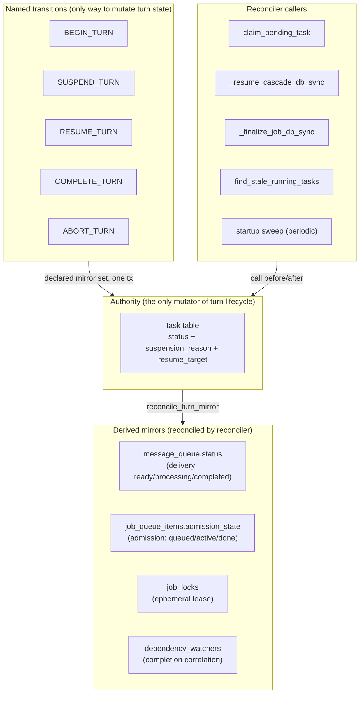

# Plan: Turn Reconciler & Named Transitions — close the orphan-mirror bug class

| Field | Value |
|---|---|
| **Status** | PROPOSAL — derived from the 2026-08-01 production incident (`docs/bugs/pause-during-report-turn-orphans-message-jobitem.md`); not yet reviewed |
| **Goal** | Each lifecycle transition reconciles *every* mirror of a turn in one transaction; a single `reconcile_turn_mirror` routine owns the "mirrors must match the Task terminal state" rule; the cross-system guard carve-out pile is deleted rather than widened. |
| **Scope** | LARGE — spans `daemon/repositories/task/`, `daemon/services/instance_lifecycle.py`, `daemon/services/job_feedback_observer.py`, `daemon/services/child_reports.py`, `daemon/manager.py`, plus a new property-test harness. Phased so each step is independently shippable. |
| **Risk** | Hot paths (claim, resume, finalize). Mitigated by the reconciler being additive at first (runs alongside existing guards), then carving-out removal is a separate reviewed step. |
| **Incident** | 2026-08-01 — `pause-during-report-turn-orphans-message-jobitem.md` (Bug A + Bug B). Same family as 4 prior incidents (see §1 evidence log). |
| **Related** | `docs/plans/unified-dispatcher.md`, `docs/plans/decouple-job-task-message-correlation.md`, `docs/plans/report-lane-decoupling.md`, `docs/plans/virtual-job-management-surface.md`, `docs/architecture/job-as-queue-proxy-invariants.md`, `docs/architecture/completion-authority.md` |

---

## 0. Executive summary

The queue/task/job system is *not* excessively complex because of its feature set. Pause, unpause, the answer-gate, terminate, revive, retry, message injection, child-completion reports — every one is a real operation with real semantics. The team has already done two unification passes (D13 eliminated the `message`-type JobItem mirror; `job-as-front-primitive` converges every entry point onto one `enqueue_message_job` primitive) and the cross-dispatcher checkpoint race (the original disease) is structurally dead.

What survives is a **different** bug factory, and it has a single root cause: **the same logical fact ("this turn is in flight / paused / done") is stored in up to four mirror tables whose updates are hand-written SQL statements that each touch a different subset.** Every new lifecycle event re-selects a subset, leaves the rest orphaned, and the bug is only found in production when the orphan rises to the surface weeks later.

This plan does **not** propose merging the three tables (the team already evaluated and correctly rejected that — `defer-queue-and-job-task-seam-bugs.md` §1). Instead it proposes four structural changes, each independently shippable, that together make "the cascade forgot table X" a structurally impossible class rather than a weekly incident:

1. **A turn reconciler** that owns the mirror⇄Task consistency rule and is the *only* generator of that truth. Called from claim, resume, finalize, timeout. Lets the cross-system guard carve-out pile be **deleted**.
2. **Named transitions** with declared, exhaustive mirror sets, validated by a property test. Replaces "author chose N UPDATEs" with "author called `SUSPEND_TURN`; the transition owns all mirrors."
3. **A turn-level suspension handle** (one column on `task`) so resume targets *that row* instead of inferring root-vs-child from task statuses — removes `find_paused_or_running_by_instance`, the orphan-Task-with-no-JobItem artifact, and the routing gap from `pause-during-report-turn…md`.
4. **Make the PostgreSQL-only invariant visible in tests** (the constraint triggers enforce `active ⇔ JobLock` only on PostgreSQL; SQLite dev/tests are blind to it).

The features stay exactly as they are. What changes is that each feature touches *one authority* instead of "remember to touch five tables slightly wrong."

---

## 1. Evidence — the same bug class, four shapes

Reading the 9 bug docs + migration history, every high-severity queue incident traces to the multi-table seam. Four repeating shapes:

### Shape A — Cross-dispatcher checkpoint corruption *(resolved)*
*2026-05–06, three docs: `child-completion-report-lost-under-concurrent-task-processing.md`, `child-completion-report-lost-cross-dispatcher-jobqueue-vs-workerpool.md`, `unresolved/symmetric-cross-system-race-messagejobhandler-ignores-running-tasks.md`.*

Two dispatchers (`MessageJobHandler` via `job_queue_items`, `ProcessMessageProcessor` via `task`) both called `graph.astream(thread_id)`. Each had a per-instance guard that only inspected *its own* table — the canonical sentence from the bug doc:

> "the task system's per-instance guard and the job system's per-instance guard were developed independently"

**Status:** structurally dead. Killed by deleting `MessageJobHandler`, the DependencyBus consolidation, and the per-instance `asyncio.Lock` (ExecutionGate). Listed for completeness; **this plan does not touch it.**

### Shape B — Cascade touches a subset of mirror rows *(live, this incident)*
*2026-06–08, four docs.*

Transitions are hand-written SQL UPDATEs, each authoring a *different subset* of the mirror set:

| Transition (file:line) | Touches | Forgets |
|---|---|---|
| `_pause_cascade_db_sync` (`instance_lifecycle.py:3030-3190`) | `instances`, `task` | `message_queue` (Bug B), `job_locks`, `dependency_watchers` |
| `_resume_cascade_db_sync` (`instance_lifecycle.py:3293-3527`) | `instances`, `task`, `job_queue_items(message)` | `message_queue`, `dependency_watchers` |
| `_finalize_job_db_sync` (`job_feedback_observer.py:2730-2960`) | `job_queue_items`, `instances`, `job_locks` | `task` (reaches terminal separately) |
| `schedule_retry` (`task/repository.py:1793-1981`) | parent `task`, child `task`, `job_watchers` | (historically) `dependency_watchers` — D6 family bug |
| `_create_completion_report` (pre-June fix) | `message_queue`, `task` | (legacy) no `task` row at all — `parent-stuck-waiting-children-orphan-error-report.md` |

Every new lifecycle event (pause, revive, retry) re-selected a subset and birthed a new orphan class. This is the incident from 2026-08-01 in two simultaneous forms:

- **Bug A** — resume cascade cancelled the `process_report` Task but never transitioned the original `job_queue_items` row (admission_state stayed `active`), so the cross-system guard blocked the answer Task forever.
- **Bug B** — the same cascade never touched `message_queue`; two `completion_report` rows lingered at `status='processing'` while their backing Tasks were `cancelled`, deadlocking the root-completion `pending_count` guard forever.

### Shape C — Premature completion via split counters *(partially resolved)*
*2026-05–06, four docs.*

Completion was spread across a SQL counter (`waiting_for`), a `message_queue` `pending_count` query, an in-memory `CorrelationManager`, and `job_queue_items.status`. Any read that omitted one signal finalized the parent early.

**Status:** DependencyBus is now the sole completion authority for parent→child correlation. **But** the root-instance `pending_count` guard in `child_reports.py:1459-1519` is *still a split counter* — it counts `message_queue` rows whose `status IN ('ready','processing','retrying')` without cross-checking against the backing `task`'s terminal status. That's the exact gap Bug B exploits.

### Shape D — The carve-out pile *(live, actively growing)*
*The cross-system guard in `claim_pending_task` (`task/repository.py:672-765`)*

Original (commit `46cf524`) → `queued`-orphan exclusion (2026-07-26) → proposed `active`-with-terminal-Task carve-out (the current bug doc's Option A). Each new mirror lifecycle adds a `NOT EXISTS`. The team is honest: `claim_pending_task` and `has_pending_tasks_blocked_by_busy_instance` are forced to share one `_admitted_task_carve_out_sql` string (the P1/F11 "MUST agree" invariant). That's good engineering, but it's *papering over* the fact that **the predicate itself keeps growing** — the bug doc's trajectory is "add another carve-out," the structural fix is "delete them all and reconcile."

---

## 2. Why not merge the tables

Forced to forestall the obvious response. `defer-queue-and-job-task-seam-bugs.md` §1 is the canonical statement:

> *"The two-table split is a deliberate decoupling of queue-policy from execution … the merge-into-one-table alternative was evaluated and rejected (it would fold two orthogonal responsibilities into one object, creating a large hard-to-debug logic blob)."*

That judgement is correct. The three tables each carry a distinct concern:

| Table | Responsibility | Lifecycle field |
|---|---|---|
| `message_queue` | payload + delivery audit | `status` (`ready`/`processing`/`completed`) |
| `task` | the dispatch row driving `graph.astream` | `status` (`pending`/`running`/`paused`/`completed`/`cancelled`/`failed`) |
| `job_queue_items` | admission / slot / locking / retry / DLQ | `admission_state` (`queued`/`active`/`done`/`dead`) |

The bug is *not* that there are three lifecycle fields. It's that **the same fact ("this turn is paused") is stored in all three independently, and every transition has to remember to flip all of them.** Merging the tables would fold concerns; the right move is to make one table the *authority* and the other two *details* whose lifecycle is reconciled, not authored by hand.

Replacement principle: one authority, derived mirrors, a reconciler, named transitions.

---

## 3. Target architecture



Four pillars. Each phase below is independently shippable.

---

## 4. Phase 1 — Turn reconciler (highest leverage, additive)

**Goal:** a single `reconcile_turn_mirror(turn_id)` that owns "every mirror row tied to this turn must match the Task's terminal status." Called from claim, resume, finalize, timeout. **Additive** — runs alongside existing guards; no behavior change yet.

### 4.1 The reconciler routine

Lives in the repository layer (`daemon/repositories/task/repository.py`, new method on `TaskRepository`). Single transaction. Idempotent. Pure SQL — no Python-side branching, no reads-then-writes; all transitions are guarded `WHERE` clauses.

Input: `work_id` (the `Task.work_id` that is the authoritative turn handle).

Operations (each guarded by the Task's current status so a concurrent transition wins the row and the reconciler becomes a no-op):

| Mirror | Reconciliation rule | When |
|---|---|---|
| `job_queue_items` (`job_id = work_id`) | If Task ∈ {completed, cancelled, failed} → `admission_state='done'`, `terminal_reason=<discriminator>`, `failed_at` set if failed/cancelled. If Task ∈ {pending, running, paused} → `admission_state='active'` (idempotent). If no Task → leave (orphan JobItem, see §4.3). | always |
| `job_locks` (`job_id = work_id`) | If Task ∈ terminal → `DELETE`. If Task ∈ in-flight → leave (lock held). | always |
| `message_queue` (`message_id = task.message_id`) | If Task ∈ terminal → `status='completed'`, `processing_task_id=NULL`, `completed_at=now`. If Task ∈ in-flight → leave (the processor owns `processing`). | always |
| `dependency_watchers` (`source_task_id = task.id`) | If Task ∈ terminal → `cancel_for_source(task.id)` if any `pending` watcher whose target is also terminal; leave `pending` watchers with in-flight targets (they will fire when target completes). | terminate / finalize only |

**Critical:** the reconciler reads `task.status` once at the start of its transaction and the mirror UPDATEs are `WHERE`-guarded on that snapshot. If a concurrent transition modifies the Task between the read and the UPDATE, the `WHERE task.status = :snapshot_status` guard drops rowcount to 0 and the reconciler logs and returns — same idempotency pattern as `complete_task` / `_finalize_job_db_sync`.

### 4.2 Call sites

| Caller | When | Why |
|---|---|---|
| `claim_pending_task` (after the `RETURNING *`) | before returning the claimed task | catches any orphan from a prior crashed transition |
| `_resume_cascade_db_sync` | after UPDATE 2 (task PAUSED→CANCELLED), per cancelled task | fixes Bug B structurally — drops the orphaned `processing` `message_queue` rows |
| `_pause_cascade_db_sync` | after UPDATE 2 (task RUNNING→PAUSED) | re-arms message_queue rows whose in-flight Task became paused (currently they linger) |
| `_finalize_job_db_sync` | in the same WriteGuardSession, after Step 1 | inverts today's order so the lock release and the mirror reconcile cannot drift apart |
| `find_stale_running_tasks` / force-cancel path | after marking stale Task FAILED | cleanup-on-recovery — same shape as resume |
| startup sweep (`JobRecoveryService`) | every N seconds, for `active` JobItems whose Task is terminal | periodic safety net; lets the carve-outs be deleted in Phase 4 |

### 4.3 Orphan JobItem rule (no matching Task)

A `job_queue_items` row whose `job_id` matches no Task is a *genuinely orphaned mirror* (the Task transaction was rolled back, or the JobItem was created pre-D13 and never linked). The reconciler transitions such rows directly to `done` with `terminal_reason='orphaned_no_task'` and releases the lock. *This is what the `queued`-orphan carve-out already tries to do at claim time; the reconciler does it once and the carve-out becomes redundant* (see Phase 4).

### 4.4 What this fixes

- **Bug B** — the orphaned `processing` `message_queue` rows get reconciled to `completed` when their backing `process_report` Task goes terminal. No more permanent `pending_count` blockage.
- **`06f500af`-class** — retry translation gap: when a retry supersedes a Task, the old Task transitions to `cancelled`, the reconciler cancels the orphaned `dependency_watchers` row.
- Every future "cascade forgot table X" — the reconciler is the single defense; new transitions only have to call it, not enumerate mirrors.

### 4.5 Acceptance — Phase 1

- `reconcile_turn_mirror` unit tests: every mirror set reconciles for each terminal Task status; idempotent on re-run; no-op when mirrors already agree; guarded against concurrent Task mutation (rowcount drops to 0).
- Integration test reproducing Bug B (pause during `process_report`) — after resume, `reconcile_turn_mirror` runs and `message_queue` rows reach `completed`; instance reaches `COMPLETED`.
- Production telemetry: count of reconciler corrections per hour (should be near-zero after rollout; a high count flags a precondition transition still leaking).

---

## 5. Phase 2 — Named transitions (replace hand-written cascades)

**Goal:** each lifecycle event is a *named operation* with a declared, exhaustive mirror set; the cascade SQL ceases to be authored by hand per event.

### 5.1 Transition surface

A new module `daemon/services/turn_transitions.py` (or on `TaskRepository` if the team prefers repository-anchored). Each transition:

1. Takes `work_id` (or `instance_id` for tree-scoped transitions).
2. In one `WriteGuardSession`: mutates the authoritative `task.status`, calls `reconcile_turn_mirror(work_id)` for the affected turn(s), performs cross-turn side effects (e.g. `dependency_watchers` release, instance status update).
3. Returns a `TransitionResult` carrying data for post-commit outbox side effects (wakeup, SSE, watcher notify).

| Transition | Task status change | Other mirrors (via reconciler) | Cross-turn |
|---|---|---|---|
| `BEGIN_TURN` | (none — Task created with `pending`) | — | instance RUNNING |
| `CLAIM_TURN` | pending→running | — | (claim is the entry; reconciler runs after) |
| `SUSPEND_TURN` | running→paused | (mirrors stay; pause is Task-level) | instance PAUSED; graph-task `CancellationToken` |
| `RESUME_TURN` | paused→cancelled | `job_queue_items(message)`→active (RF3 inlined) | instance RUNNING; schedule resume-processing job |
| `COMPLETE_TURN` | running→completed | `message_queue`→completed, `job_queue_items`→done, `job_locks` DELETE | instance COMPLETED (gated by bus + own-queue count) |
| `ABORT_TURN` | running/cancelled→cancelled/failed | mirrors terminal | instance TERMINATED/ERROR; dependency_watchers cancelled |
| `RETRY_TURN` | parent→cancelled + child→pending | parent mirrors terminal; child mirrors armed | `job_watchers` migrated (`schedule_retry` F6) |

Today's `_pause_cascade_db_sync` *becomes* `SUSPEND_TURN` for each in-flight turn in the tree + the instance status UPDATE. `_resume_cascade_db_sync` *becomes* `RESUME_TURN` likewise. The body shrinks because the mirror reconciliation is delegated to `reconcile_turn_mirror`.

### 5.2 The mirror-set declaration

Each transition declares its mirror set as a Python set/frozenset (or, if the team prefers, as a docstring contract test). The property test (§7) asserts the union of every transition's touched mirrors equals the full mirror set — i.e. *no transition can silently drop a mirror from its contract.* This is the static defense against "the author forgot table X."

### 5.3 What this fixes

- Bug A's orphan-Task-with-no-JobItem artifact disappears: `RESUME_TURN` is the only caller that mints the new turn, and it does so on the *authoritative* turn row.
- Future features (terminate, revive, retry variants) call a transition instead of writing SQL; the mirror set cannot drift by accident.

### 5.4 Acceptance — Phase 2

- Existing pause/resume E2E tests pass unchanged (behavior identical).
- New transition-level tests: each transition is atomic (single commit), idempotent on re-run, and fails-closed on a concurrent Task mutation.
- Mirror-set declaration coverage test: every mirror with a parallel lifecycle field appears in *some* transition's declared set (no orphan lifecycle field left unmanaged).

---

## 6. Phase 3 — Turn suspension handle (removes the routing gap)

**Goal:** resume targets *the turn* by id rather than *inferring* root-vs-child from task statuses.

### 6.1 The gap, in the code

`resume_processing_job` (`manager.py:4844-4912`) calls `find_paused_or_running_by_instance` and decides root-vs-child by asking "is there a `process_message` Task with status ∈ {paused, running, cancelled}?" This primitive *exists* because there is no row that says "turn #X is suspended at the answer gate; resume onto this work_id."

The bug: pause fires during a `process_report` turn (the original `process_message` Task already completed). The primitive finds nothing → routes to the child branch → enqueues the answer as a fresh Task with no JobItem → the original turn's JobItem lingers `active` → deadlock.

### 6.2 The handle

Two new columns on `task`:

| Column | Purpose |
|---|---|
| `suspension_reason` (`enum`: `null` / `awaiting_answer` / `awaiting_children` / `paused_external`) | declared at SUSPEND_TURN time; tells resume *why* this turn is suspended |
| `resume_target_turn_id` (`UUID`, nullable, FK-style to `task.work_id`) | for the answer-gate case: the turn-id of the in-flight parent turn that the answer should resume onto |

### 6.3 The new resume flow

When the user answers `ask_questions`:

1. `RESUME_TURN` is called with the `work_id` recorded in `resume_target_turn_id` (the parent's original message turn) — *not* with a fresh Task.
2. `resume_processing_job` takes the root branch iff `find_suspended_turn_for_answer(answer.message_id)` returns a row (i.e. there is a turn explicitly suspended `awaiting_answer`). No more status-inference primitive.
3. The answer's payload is written onto `message_queue` for that turn; the turn's `Task` is RESUMED (drives `graph.astream` from checkpoint with the answer injected).

For pause-during-`process_report`: the parent's original `process_message` Task is long-completed; there's no suspended turn at the answer gate (the pause fired mid-report, not at an answer-gate). The resume correctly routes to the *report* branch (resume the `process_report` Task from checkpoint), and the reconciler cleans the stale `active` JobItem.

### 6.4 What this fixes

- The routing gap (the bug doc's Option B) becomes structurally impossible — resume targets by handle, not by inference.
- `find_paused_or_running_by_instance` is *removed* (its job is split: `find_suspended_turn_for_answer` for the answer-gate path; `find_paused_or_cancellable_turn(instance_id)` for the pause cascade).
- The cascade-resume "Task with no JobItem" artifact (W7, `manager.py:4901-4946`) is removed for the answer-gate case — the resume attaches to an existing turn.

### 6.5 Acceptance — Phase 3

- New E2E `pause_during_report_turn_then_resume` — the missing test the bug doc calls out.
- `find_paused_or_running_by_instance` deletion; all prior tests pass with the new handle-based routing.
- The answer-gate flow (`ask_questions` → answer → resume) reuses an existing turn row, not a fresh Task.

---

## 7. Phase 4 — Delete the carve-out pile (only after Phase 1 lands)

**Goal:** with the reconciler running on every claim/resume/finalize/timeout and a periodic sweep, the cross-system guard's orphan-exclusion carve-outs become redundant. Remove them.

### 7.1 Carve-outs that become redundant

In `claim_pending_task` (`task/repository.py:672-765`):

- **`queued`-orphan exclusion** (`repository.py:757-763`) — the reconciler transitions orphan JobItems to `done`; the `NOT EXISTS` subquery is no longer required.
- **Unified-dispatcher admission carve-out** (`_admitted_task_carve_out_sql`, `repository.py:853-958`) — the "release if there is a matching pending/running Task" becomes "the reconciler has already set `admission_state='active'` because the Task is in-flight." In other words: **the guard becomes "is there a Task that is terminal or absent?" instead of "is there a Task in a specific in-flight status?"**

The guard simplifies to roughly:

```sql
-- Cross-system guard (post Phase 4):
-- Block only if there is an active JobItem whose backing Task is in-flight.
-- Orphan reconciliation is the reconciler's job, not the guard's.
AND (
    task_type != :process_message_type
    OR instance_id NOT IN (
        SELECT j.instance_id FROM job_queue_items j
        WHERE j.admission_state IN {active_admission_states_sql()}
          AND j.deleted_at IS NULL
          AND EXISTS (
              SELECT 1 FROM task t
              WHERE t.work_id = j.job_id
                AND t.status IN (:status_pending, :status_running, :status_paused)
          )
    )
)
```

(Exact final shape is a review decision — possibly the carve-out for `WAITING_CHILDREN` stays, or the reconciler makes it redundant too — see §10.)

### 7.2 What this fixes

- The carve-out pile stops growing. Every future mirror-orphan is handled by the reconciler, not by adding a new `NOT EXISTS` subquery.
- `claim_pending_task` and `has_pending_tasks_blocked_by_busy_instance` continue to share one string — but the string is now ~5 lines instead of 100.

### 7.3 Acceptance — Phase 4

- The existing property tests (§9) continue to pass with the simplified guard.
- The Bug A reproduction scenario (orphaned `active` JobItem with terminal Task) is admitted by the new guard because the reconciler has already transitioned the JobItem to `done`.

---

## 8. Phase 5 — Make the PostgreSQL-only invariant test-visible

**Goal:** the constraint triggers that enforce `admission_state='active' ⇔ JobLock` exist *only* on PostgreSQL. SQLite (the dev/test default) silently allows violations. This is the structural reason the pause-during-report test was never written.

### 8.1 Two options (pick one in review)

- **(a) Mirror the trigger as a Python-side check inside `reconcile_turn_mirror`.** The reconciler already runs the rule; add a `raise` on `active ⇔ no lock` mismatch so the dev stack catches it.
- **(b) Run the cross-table invariant tests against PostgreSQL in CI.** Add a `pytest` marker (`@pytest.mark.postgres_invariant`) and a Postgres service container.

Recommendation: do **(a)** — it's the cheaper of the two and it makes the invariant enforceable *at runtime* in every environment, not just CI. The trigger layer can stay on PostgreSQL as defense-in-depth.

### 8.2 Acceptance — Phase 5

- `active` JobItem with no JobLock row raises `InvalidTransitionError` on dev (SQLite), not just prod.
- The `status-drift warning` at `work_resolver.py:692-709` — already flagged for deletion in `job-as-queue-proxy-invariants.md` §2d.5 as "the codebase's own admission that the mirror desyncs" — is removed; the reconciler is the authority.

---

## 9. Property tests (the test class that was missing)

The bug doc notes: "every pause/resume test pauses during the message turn." That's because tests are *scenario* tests for known sequences. A state machine of this complexity needs **property tests**: "for any reachable state, after any sequence of pause/resume/abort events, claim_pending_task must (a) never admit two running turns, (b) never deadlock a resumable turn, (c) leave zero orphan mirrors."

### 9.1 The state machine (Hypothesis-style)

States: per turn, {`not_created`, `pending`, `running`, `paused`, `completed`, `cancelled`, `failed`}. Each mirror's projection follows the reconciliation rule (§4.1).

Transitions: `BEGIN_TURN`, `CLAIM_TURN`, `SUSPEND_TURN`, `RESUME_TURN`, `COMPLETE_TURN`, `ABORT_TURN`, `RETRY_TURN`. Any sequence is valid; the model re-runs `reconcile_turn_mirror` after each.

### 9.2 Invariants asserted after every transition

1. **No double-admit:** at most one `running` Task per `instance_id`.
2. **No orphan mirrors:** for every `task` row in terminal status, every mirror row tied to its `work_id` / `message_id` is also terminal (or absent).
3. **No permanent deadlock:** for every `pending` Task whose instance is not `paused`/`terminated`, `claim_pending_task` admits it within bounded attempts.
4. **Mirror consistency:** `job_queue_items.admission_state='active'` ⟺ there exists an in-flight Task with matching `work_id` AND a `job_locks` row. (This is the Phase 5 invariant, now tested.)

### 9.3 Fuzz seed for the bug

A directed fuzz: "pause fires during a `process_report` turn → resume → answer arrives." This is the exact sequence the scenario tests never covered. The property test exercises it after every commit.

---

## 10. What this is *not*

- **Not a table merge.** Three tables, three concerns. The team already rejected the merge.
- **Not a removal of features.** Pause, unpause, answer-gate, terminate, revive, retry, message injection, child-completion reports all remain. Each becomes a named transition.
- **Not a rewrite of the cross-dispatcher fix.** Shape A is structurally dead. This plan does not touch ExecutionGate or `MessageJobHandler` deletion.
- **Not a replacement for DependencyBus.** The bus remains the sole completion authority for parent→child correlation. The reconciler only handles the *own-queue mirror reconciliation* the bus was never responsible for (`message_queue`, `job_queue_items`, `job_locks`). The `pending_count` split counter in `child_reports.py` is *hardened* by the reconciler (excludes `processing` rows whose backing Task is terminal — the bug doc's Option E is now trivial, *because* the reconciler already marked them `completed`).

---

## 11. Sequencing & risk

| Phase | Ships | Risk if it lands alone | Depends on |
|---|---|---|---|
| 1 — Reconciler | First; purely additive | Low — runs alongside existing guards; corrections are logged | nothing |
| 4 — Delete carve-outs | Second; only after Phase 1 is stable | Medium — guard simplification; needs property tests in §9 | Phase 1 |
| 2 — Named transitions | Third; refactor of existing cascades | Medium — touches hot paths, but behaviorally equivalent | Phase 1 |
| 3 — Turn handle | Fourth; new column + new resume routing | Medium — mutates the resume routing decision | Phase 2 |
| 5 — Postgres invariant in tests | Any time; independent | Low | nothing (ideally before Phase 4) |
| 9 — Property tests | Alongside Phase 1 | None — pure test infra | nothing |

The recommendation: ship Phase 1 + Phase 5 + Phase 9 first as one increment. That alone converts every existing orphan-mirror bug into a self-healing no-op and gives the test surface to safely cut the carve-outs (Phase 4). Phases 2 and 3 are follow-ups; they remove code rather than add safety.

---

## 12. Files touched (indicative)

### Phase 1 — Reconciler
- `daemon/repositories/task/repository.py` — new `reconcile_turn_mirror(work_id)` method
- `daemon/repositories/job_queue/repository.py` — `transition_to_done_by_work_id` helper (reconciler calls)
- `daemon/repositories/job_queue/lock_repository.py` — `release_by_work_id` (scoped-by-turn variant)
- `daemon/repositories/message_queue/repository.py` — `finalize_by_message_id` (guarded by Task terminal status)
- `daemon/services/instance_lifecycle.py` — call reconciler after `_pause_cascade_db_sync` / `_resume_cascade_db_sync` UPDATE 2
- `daemon/services/job_feedback_observer.py` — call reconciler inside `_finalize_job_db_sync` WriteGuardSession
- `daemon/services/job_recovery_service.py` — periodic sweep calling reconciler on `active` JobItems with terminal Tasks

### Phase 4 — Carve-out removal
- `daemon/repositories/task/repository.py:672-765` (claim cross-system guard)
- `daemon/repositories/task/repository.py:1408-1520` (`has_pending_tasks_blocked_by_busy_instance`)
- `daemon/repositories/task/repository.py:853-958` (`_admitted_task_carve_out_sql`) — deleted

### Phase 2 — Named transitions
- New `daemon/services/turn_transitions.py` (or methods on `TaskRepository`)
- `daemon/services/instance_lifecycle.py` — `_pause_cascade_db_sync` / `_resume_cascade_db_sync` become thin wrappers

### Phase 3 — Turn handle
- `daemon/repositories/task/models.py` — `suspension_reason`, `resume_target_turn_id` columns
- `daemon/repositories/task/repository.py` — `find_suspended_turn_for_answer`; delete `find_paused_or_running_by_instance`
- `daemon/manager.py:4844-4912` — `resume_processing_job` routing rewrite
- `daemon/migrations/` — new column migration

### Phase 5 — Invariant visibility
- `daemon/repositories/task/repository.py` — `reconcile_turn_mirror` raises on `active ⇔ no lock`
- `daemon/services/work_resolver.py:692-709` — delete the drift warning

### Phase 9 — Property tests
- New `tests/property/test_turn_state_machine.py` (Hypothesis-based)
- New `tests/e2e/test_pause_during_report_turn_then_resume.py`

---

## 13. Relationship to existing plans

| Existing plan | Relationship |
|---|---|
| `unified-dispatcher.md` / `decouple-job-task-message-correlation.md` | This plan assumes the Phase 5 decouple migration *landed* (it did). It does not touch dispatcher consolidation. |
| `report-lane-decoupling.md` | Compatible — reports bypass the cross-system guard by `task_type`; the reconciler handles every `task_type` uniformly (it keys on `work_id`, not `task_type`). The `PROCESS_REPORT` carve-out logic remains untouched. |
| `virtual-job-management-surface.md` | Compatible — the `work_id` UUID is already the linkage handle the reconciler keys on. The reconciler strengthens the `work_id`-as-truth contract. |
| `job-as-front-primitive-invariants.md` | Compatible — the trigger invariants (PostgreSQL constraint triggers) *stay*. The reconciler is a Python-side runtime mirror of them, with the SQLite dev stack now actually enforcing them (Phase 5). |
| `defer-queue-idle-gate.md` | Orthogonal — defer/background idle gates are about "is the project busy"; this plan is about "is this turn's mirror consistent." No overlap. |
| `pause-during-report-turn-orphans-message-jobitem.md` | This plan is the structural response to that bug doc's Options A–E. Option A (widen the carve-out) is **not** adopted — Phase 4 deletes the carve-out instead. Option B (routing fix) is adopted as Phase 3. Option D (extend the cascade) is subsumed by Phase 2 (the transition owns the mirror set). Option E (harden the `pending_count` guard) is subsumed by Phase 1 (the reconciler marks the orphaned `processing` rows `completed` before the guard even sees them). |

---

## 14. Open questions for review

1. **`WAITING_CHILDREN` carve-out in the post-Phase-4 guard.** The current cross-system guard exempts instances at `status='waiting_children'` (the FIFO carve-out, `repository.py:721`). Should the simplified guard keep it, or should the reconciler's `admission_state=active` rule subsume it (a `waiting_children` instance whose JobItem is `active` but Task is `completed` would have its JobItem transitioned to `done` by the reconciler, making the carve-out redundant)? Recommend the latter — one fewer special case.

2. **`message_queue` lifecycle vs `task_type`.** Reports and messages share the `message_queue` table but differ in Task type. The reconciler keys on `task.message_id` regardless of type. Is there a case where a `message_queue` row should stay `processing` after its Task is terminal (e.g. a retry is pending)? If so, the reconciler's rule needs a "preserve if retry_scheduled" carve-out — which would re-introduce the carve-out pattern. Recommendation: no — the retry's *new* Task owns the new `message_id`; the old `message_queue` row finalizing is correct.

3. **Histogram/reconciler correction rate as an SLO.** If the reconciler is correcting more than N rows per hour in production, that signals a transition still leaking. Should we add a hard cap that pages on call? Or is the log line sufficient?

4. **Should `schedule_retry` migrate to `RETRY_TURN`?** It already has the atomic parent-UPDATE + child-INSERT + watcher-migration transaction; re-framing it as a named transition is mechanical but touches a hotter path than Phases 1–3. Recommend as a Phase 2 follow-up, not a blocker.

5. **Where does the property-test state machine live?** A model in `tests/property/` mirroring the production state machine needs to be kept in sync. Options (a) hand-written contract (simple, decays), (b) auto-generated from the transition declaration in Phase 2 (couples the test to the implementation). Recommend (a) initially, with a drift-detector that fails if a transition's declared mirror set changes without a test update.
