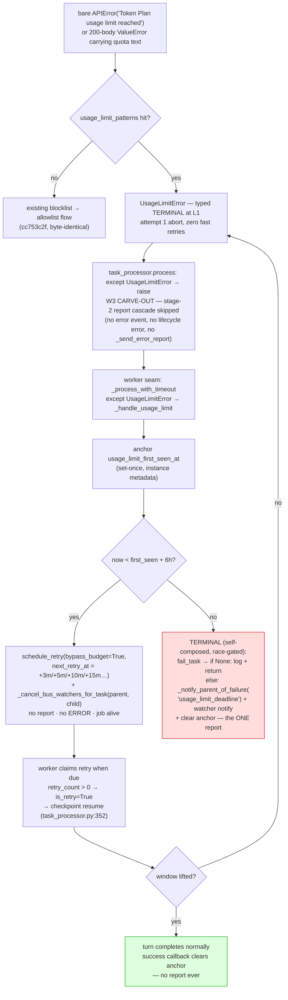

# Plan: Usage-Limit Deferral Path (Approach D — dedicated path, reused machinery)

| Field | Value |
|---|---|
| **Status** | DRAFT — REVISED 2026-08-27 (rev3) per review REV3: stale recovery's POST-RETRY actions fixed (§2.1 misindented startup notify — spurious permanent-failure report on every successful crash-recovery, pre-existing; §2.2 message-fail under a live recovery child), recovery child now wakes on the W5 schedule (§3.1), W5 jitter clamped (§3.2), stages-3-6 invariant named (§3.3), landing order corrected (§3.4), `:428` invariant stated (§3.5). Supersedes rev1/rev2 revisions of the same date. |
| **Goal** | A **dedicated usage-limit path**: quota exhaustion shapes (`Token Plan usage limit reached` / `usage limit`) become a typed `UsageLimitError` that aborts the turn fast at L1, is **kept out of the stage-2 report cascade by an explicit task-processor carve-out** (W3), and is caught **at the worker seam** by a usage-limit-specific handler implementing usage-limit **policy** (anchor, 6 h deadline, fixed schedule **3 min → 5 min → 10 min → 15 min (15 min cap)**, budget-free deferrals) on **reused machinery** (`schedule_retry` / RetryTurn transition, mirror reconciliation, F6 watcher migration, worker claim, `is_retry` checkpoint resume). Per attempt: **no error report, no instance `ERROR`, no message `FAILED`, no hierarchy deletion, job not finalized, no error event**. Exactly ONE error report per episode — a **race-gated, self-reporting terminal composition** at the deadline (`fail_task` must WIN its guard race, then `_notify_parent_of_failure('usage_limit_deadline')` + watcher notify + anchor clear, W4). Success inside the window clears the anchor silently. |
| **Scope** | SMALL-MEDIUM — single coder, ~1-1.5 days (grown ~0.5 day by review: carve-out, bus-watcher release, stale-recovery bypass). **Independent of the parking plan.** Spans `daemon/llm_error_classifier.py` (typed exception + patterns + facade audit), `daemon/services/task_processor.py` (carve-out + anchor clear), `daemon/repositories/task/repository.py` (`schedule_retry` + `force_cancel_and_schedule_retry` keyword params), `daemon/services/worker_pool.py` (dedicated catch + `_handle_usage_limit` + bus-watcher release), `daemon/services/stale_task_recovery.py` (anchor-gated bypass at the two force-cancel callsites ONLY — see W8 coverage scope), `daemon/config.py` + `config.yaml`, targeted tests. |
| **Risk** | `max_retries` bypass must not silently kill the episode at attempt 4 (guard lives in SQL — `repository.py:2946`, and in `force_cancel_and_schedule_retry` at `:3364`); the carve-out must stay ahead of the generic cascade AND the stage-2 boundary must hold (LLM classification stays in work_fn, never stages 3-6); stale recovery's POST-RETRY actions (notify misindent, message-fail) must not report or fail under a live recovery child; bus watchers must be released per deferral (H1) or parents strand in `waiting_children`; `retry_count` grows ~26/episode (consumer audit closed by review rev3); detection false-positives auto-retry a genuine bug for 6 h (bounded by terminal report at deadline). |
| **Evidence** | Corpus event 2056 `Token Plan usage limit reached` ([`docs/bugs/transient-llm-failures-non-retryable-instance-death.md`](../bugs/transient-llm-failures-non-retryable-instance-death.md)); blocklisted terminal-at-L1 since `cc753c2f` (`daemon/llm_error_classifier.py:108-112`). The reused machinery is production-proven for TIMEOUT (`worker_pool.py:484-588`, hardened by the 2026-06-26 timeout-orphan race fix — including the bus-watcher release at `:768-782`) — D's bet is on the machinery, not on TIMEOUT's policy. |
| **Related** | [`usage-limit-deferral-path-review.md`](usage-limit-deferral-path-review.md) (review that drove this revision) · [`usage-limit-window-recovery.md`](usage-limit-window-recovery.md) (parent — approach comparison §1a, D adjudicated 2026-08-27) · [`docs/retry-architecture.md`](../retry-architecture.md) §4/§6/§7 (L1, L3, L4) · [`transient-channel-retry-widening.md`](transient-channel-retry-widening.md) (the blocklist this plan types) · [`rate-limit-episode-parking.md`](rate-limit-episode-parking.md) (unaffected; may later adopt this pattern for its own kind) |

---

## 1. Problem (short — parent §1)

Quota shapes are correctly terminal at L1 (second-scale retries inside a quota window are
futile), but terminal-at-L1 cascades to terminal-forever: instance `ERROR`, misleading
`RECOVERY_GUIDANCE_HINT`, job stranded. Quota windows reset on the provider's schedule —
waiting IS the correct recovery. The parent plan compared four approaches; **D** builds a
**dedicated usage-limit path whose primitives are reused, not rebuilt**: the RetryTurn
machinery (`schedule_retry` + transition + mirrors + watcher migration + claim +
checkpoint resume) is production-proven, but the PATH — when it fires, what it waits for,
how long, and what it reports — is usage-limit's own. This file specifies D to
implementation depth, as revised by review.

**What is NEW (the dedicated path) vs what is REUSED (the machinery):**

| NEW — usage-limit policy | REUSED — production machinery |
|---|---|
| `UsageLimitError` type + patterns (W1) | `schedule_retry` gate UPDATE + RetryTurn transition + mirror reconciliation (`repository.py:2878-3054`) |
| Task-processor carve-out keeping quota errors out of the stage-2 report cascade (W3) | F6 `job_watchers` migration; `_notify_pending_task` |
| `_handle_usage_limit` handler: anchor, deadline check, schedule derivation, **bus-watcher release per deferral** (W4-W5) | `_cancel_bus_watchers_for_task` helper (`worker_pool.py:627-660`) |
| Self-reporting terminal composition at deadline (W4.2) | `_notify_parent_of_failure` routing (`worker_pool.py:590-625`); `_schedule_work_notification` |
| Deadline-bounded budget (bypass param value, not the param itself) + anchor-gated stale-recovery bypass (W2, W8) | worker claim path (`repository.py:1189` — no `retry_count` gate); `is_retry=True` checkpoint resume (`task_processor.py:352`) |
| Anchor lifecycle in instance metadata (W6) | config-plumbing conventions (`QueueConfig` → classifier) |

Policy bugs are this plan's own; machinery bugs are pre-existing and shared. The
acceptance tests (§5) assert BOTH halves: the policy behaves as specified, and the
machinery contract holds for the new caller.

**Design invariants (from the parent adjudication + review):**

1. No in-turn sleeping — the per-task `TimeoutMonitor` (125 min, `daemon/config.py:590`)
   is never extended; attempts fail in ~seconds, patience lives between tasks.
2. Per-attempt observables are ZERO — **by two constructions, not one**: the W3
   carve-out keeps the stage-2 cascade (`handle_message_processing_error` → DB error
   event, lifecycle `status="error"`, `_send_error_report`) from firing, and the W4
   branch returns normally instead of raising into the failure lane. (Review §2.1: the
   carve-out is load-bearing — without it the cascade fires ~26×/episode.)
3. The 6 h window is the **retry horizon** (anchor + deadline), not a timeout value.
4. The reused primitive is **parameterized, never forked** — TIMEOUT-lane behavior stays
   byte-identical under default arguments, and the usage-limit path has exactly one
   call-site into it.
5. **The worker seam owns the episode decision.** `task_processor` re-raises
   `UsageLimitError` untouched (it cannot know the anchor/deadline — worker-seam state;
   review §2.2's rejected alternative documented there).

---

## 2. Design

Work units W1-W8.

### W1 — Typed exception + detection (`daemon/llm_error_classifier.py`)

New exception (NOT in `TRANSIENT_EXCEPTIONS` / `TIMEOUT_EXCEPTIONS` — the blocklist's
fast-abort semantics are preserved byte-identically):

```python
class UsageLimitError(Exception):
    """Provider quota exhaustion (token plan / usage limit windows).
    Terminal at L1 by design — the window resets on the provider's
    schedule, so second-scale retries are futile. The worker seam
    routes it into the dedicated deferral path (deadline-bounded
    re-dispatch); see docs/plans/usage-limit-deferral-path.md."""

    def __init__(self, original: BaseException):
        self.original = original
        super().__init__(f"Usage limit (quota window): {original}")
```

Detection helper `_matches_usage_limit(msg) -> bool` — case-insensitive substring over
the config-driven `usage_limit_patterns` (W7; default `['token plan', 'usage limit']`,
normalized via the existing `_normalize_patterns`). Wrap sites, ordered BEFORE the
existing allowlist/blocklist logic (quota hits are a subset of today's blocklist hits):

- **Bare-`APIError` branch** (`llm_error_classifier.py:850-867`): check
  `_matches_usage_limit(str(e))` first; hit → `raise UsageLimitError(e) from e`; miss →
  existing `classify_transient_apierror_body` flow unchanged.
- **`ValueError` branch** (`:894-905`): same check before
  `_matches_transient_valueerror` (the `cc753c2f` §review guard proves quota text can
  ride 200-body dicts).
- **Facade parity + type-swap audit** (`daemon/services/llm_failover.py`
  `_classify_raw_sdk_exceptions`, `:239`): wire the same helper so a secondary-site
  quota hit surfaces typed. The facade does NOT retry it (graceful fallback, unchanged
  counts). **Review §4.2:** this changes the raised *type* at secondary sites (today a
  blocklist hit re-raises the original `APIError`/`ValueError`) — audit secondary-site
  callers for type-specific `except` clauses that would stop matching, and add a facade
  test asserting the typed surface.

**Disjointness (hard requirement):** `usage_limit_patterns` must stay disjoint from
bad-params shapes — `invalid params` (corpus 2013) remains an untyped terminal re-raise.
A genuine bug must never enter a 6 h auto-retry episode. Assert in `QueueConfig`
validation (W7) that no `usage_limit_pattern` also matches the bad-params shapes.

### W2 — `schedule_retry` parameterization (`daemon/repositories/task/repository.py:2878-3054`)

Add two keyword-only parameters with behavior-preserving defaults:

```python
def schedule_retry(
    self,
    task_id: int,
    max_retries: int,
    backoff_base: int = 60,
    backoff_max: int = 3600,
    *,
    next_retry_at: datetime | None = None,   # explicit schedule override
    bypass_retry_budget: bool = False,       # deadline-bounded caller
) -> Task | None:
```

- **`next_retry_at`** (default `None`): when provided, skip the `2**retry_count`
  backoff derivation (`:2976-2988`) and stamp the caller's timestamp. Format via the
  existing `next_retry_at_str` pattern. **The SAME two parameters (same defaults,
  same semantics) are added to `force_cancel_and_schedule_retry`** (`repository.py`
  ~`:3362-3399`): its own budget term drops identically under bypass, and its
  `2**retry_count` derivation (`:3395-3399`) — which with a bypass-grown
  `retry_count` (~26) would cap at `backoff_max` and burn up to 60 min of the 6 h
  window per recovery event — is overridden by the W5 schedule when W8 passes
  `next_retry_at` (review rev3 §3.1).
- **`bypass_retry_budget`** (default `False`): when True, drop ONLY the
  `retry_count < :max_retries` term from the gate UPDATE's WHERE (`:2946`). The
  `retry_scheduled = false` double-retry guard and the
  `status IN ('running','failed','cancelled')` guard **stay** — concurrency safety is
  not negotiable. `retry_count` still increments monotonically (observability; ~26/episode).
- Comment the WHY inline (deadline-bounded deferrals; parent plan adjudication).

Everything else — gate UPDATE, `RetryTurn` transition, mirror reconciliation, F6 watcher
migration, `_notify_pending_task` — is untouched. The existing TIMEOUT callers
(`worker_pool.py:755` inside `_handle_cancellation`, entry `:662`;
`stale_task_recovery.py:474/:727`) pass no new args → byte-identical.

### W3 — Task-processor carve-out (`daemon/services/task_processor.py:422-453`) — load-bearing, own test

**Review §2.1 (blocker):** a typed `UsageLimitError` from the graph is a stage-2 error;
`process()`'s generic `except Exception` runs the FULL report cascade
(`handle_message_processing_error` → `create_error_event`, lifecycle `status="error"`
event fanned out to JobFeedbackObserver, `_send_error_report` — instance `ERROR`, parent
envelope) and bumps `consecutive_failures` via `_record_metrics_for_task` — on EVERY
in-window deferral, before the worker seam ever sees the exception. Add, BEFORE the
generic `except Exception` at `:422`:

```python
except UsageLimitError:
    # Dedicated deferral path: the worker seam owns the episode decision
    # (anchor/deadline are worker-seam state). No report cascade here —
    # see docs/plans/usage-limit-deferral-path.md W3.
    raise
```

This is the first half of "observables are ZERO" (invariant 2). It also means
`task_processor` is no longer purely report-oriented for this one type — accepted; the
carve-out contains no policy (no anchor read, no window check — unconditional), so the
worker seam remains the single decision owner (invariant 5). Own acceptance test (§5.2).

**Stage-boundary invariant (review rev3 §3.3 — must hold, name it in the carve-out
comment):** the carve-out works because the classifier raises `UsageLimitError` inside
the LLM call — i.e. work_fn / stage 2, OUTSIDE the pipeline's internal post-processing
try (`message_processing_pipeline.py:432-437` vs `:450`) — so it reaches
`process()`'s outer try as an exception. An error raised inside the pipeline's
stages 3-6 rides `result.error` and the cascade fires INSIDE the pipeline
(`:515-526`), where no carve-out can help. Unreachable today; a future stage refactor
must not move LLM classification into stages 3-6 without re-deriving this path.

### W4 — The dedicated path's entry point: worker-seam catch + `_handle_usage_limit` (`daemon/services/worker_pool.py:484-588`)

This branch + handler IS the new path. It lives in `_process_with_timeout`'s except
chain because that is where the worker owns retry decisions. Add AFTER
`except TimeoutError` (:514-521), BEFORE the generic `except Exception` (:578):

```python
except UsageLimitError as e:
    self._handle_usage_limit(task, e)
```

**`_handle_usage_limit(task, err)` — new method, all policy lives here. The handler
must not raise: soft-fail the anchor read/write (log-and-proceed with
`first_seen = now` as the degenerate case) — an exception raised inside this
`except UsageLimitError` block propagates out uncaught by the sibling
`except Exception` at `:578` and surfaces as an unexpected error attributed to the
wrong cause (review rev2 §3.3):**

1. **Anchor (set-once per episode).** Read `usage_limit_first_seen_at` from the
   instance's `instance_metadata` (sync helpers `set_metadata` /
   `daemon/repositories/instance/repository.py:1204`, `delete_metadata` `:1380`); if
   absent, stamp `now` (ISO). Persist before any branching (crash-safe monotonic
   clock). The anchor is per-instance, per-episode — and **an episode ends at success
   (W6) OR at the terminal composition (below), both of which clear it**.
2. **Deadline check.** `now < first_seen + usage_limit_window_seconds` (default 21600)?
   - **In-window (defer):**
     a. Compute `next_retry_at` from the stateless schedule (W5); call
        `task_repo.schedule_retry(task_id=task.id, max_retries=self._max_retries,
        next_retry_at=..., bypass_retry_budget=True)`.
     b. **Bus-watcher release (review §3.1 / H1):** if a retry child was created, call
        `self._cancel_bus_watchers_for_task(task.id, retry_task.id)` — the same
        release the TIMEOUT lane performs at `worker_pool.py:782`; without it the
        bus's PENDING watcher keyed on the original `source_task_id` strands the
        parent in `waiting_children` forever (production incident 2026-06-26). F6
        covers the DB `job_watchers`; this covers the in-memory dependency bus.
     c. Log ONE informational line (instance, attempt k, deadline, next wake) — the
        per-attempt observable is a log line, nothing else.
     d. If `schedule_retry` returns `None` (gate closed), do NOT compose the terminal:
        log one line and return. The gate can lose to a concurrent retry-creating
        actor — e.g. W8's own anchor-gated `force_cancel_and_schedule_retry`
        (`stale_task_recovery.py:368/:658`) inserting a recovery child for this very
        task — in which case **the episode is still alive via that child**, and a
        terminal report here would zombie-kill it (review rev2 §2.1b; the same bug
        class rev1 §2.2 closed, re-entering through this door). It can also lose to a
        genuinely terminal fate (operator cancel) — same correct outcome: someone
        else decided; we stay silent.
   - **Past-deadline (terminal — review rev1 §2.2 re-spec, rev2 §2.1 guard):** the
     episode's ONE report is **self-composed** and **the ENTIRE composition is gated
     on the `fail_task` race outcome** — if `fail_task` returns `None`, log one line
     and return (no parent notify, no watcher notify; the task was concurrently
     terminalized or re-childed, and reporting here would violate exactly-once).
     (`_handle_task_failure` at `worker_pool.py:831-842` has no parent notification
     and no `error_type` parameter — "re-raise into the failure lane" is not a
     mechanism that exists.)

     ```
     failed_task = fail_task(task.id, "usage_limit_deadline: window exceeded ...")
     if failed_task is None: log-and-return        # LOST the race — episode is not ours to report
     _notify_parent_of_failure(instance_id, error,  # ONE parent report, only on race-won
         error_type='usage_limit_deadline', message_id)
     _schedule_work_notification(failed_task, "failed", error=...)   # watcher notify, race-won
     clear anchor (soft-fail)                       # terminal ENDS the episode (W6)
     ```

     The TIMEOUT precedent fires `_notify_parent_of_failure` unconditionally
     (`worker_pool.py:795-800`) — defensible there because that lane just observed
     `schedule_retry` return None with NO other caller able to re-child the task; the
     usage-limit path has W8's recovery child as exactly such a caller, hence the
     stronger gate (review rev2 §2.1a). The report carries the first-sighting
     timestamp and the original provider error. (Rejected alternative — review rev1
     §2.2 — teaching `_classify_error_type` the mapping and making the W3 carve-out
     window-aware: the task processor cannot know the anchor/deadline, which is
     worker-seam state.)

**Why the worker-seam branch never reports in-window:** the W3 carve-out keeps the
stage-2 cascade from firing, and the branch returns normally after scheduling the
retry — `run_task` does not raise, `_handle_task_failure` is not called. Absence by two
constructions (invariant 2).

### W5 — Stateless schedule derivation (shared with parent unit 5)

```
delays = [180, 300, 600, 900]  # 3m, 5m, 10m; 15m cap beyond
cumsum  = 180, 480, 1080, 1980, 2880, …  (+900 each)
next_retry_at = first_seen + smallest cumsum > elapsed(now − first_seen)
deadline      = first_seen + window (default 21600 s)
jitter        = ±10 % per wake (config fraction)
```

~26 wake-ups fit in 6 h. Elapsed-based derivation is crash-safe (no attempt counter
column; restart mid-episode resumes the window, not a fresh one) and monotonic (a
re-park after a long GC pause never schedules BEFORE the next cumsum slot). One shared
pure function `next_usage_limit_retry_at(first_seen, now, delays, jitter_frac)` —
unit-tested standalone.

**Function contract edge (review §4.4):** when `elapsed` exceeds the last listed
cumsum, the schedule extends by the final delay (900 s) indefinitely —
`cumsum[k] = cumsum[last] + 900·(k − last)` for all further k — until the deadline
check (W4.2) terminates the episode. The docstring must state this explicitly.

**Jitter clamp (review rev3 §3.2):** an early-jittered wake still satisfies
`elapsed < cumsum[k]`, so the same slot is re-selected and a re-rolled negative jitter
can land before `now` → immediate re-attempt (~2 wakes per slot; the ~26-wake count and
wall-clock monotonicity both soften). The function must CLAMP:
`next_retry_at = max(first_seen + cumsum[k] + jitter, now + floor)` with a small floor
(e.g. 30 s) — monotonic against `now` under every roll. Test: fuzz jitter across a
full episode; assert no `next_retry_at ≤ now`.

### W6 — Anchor lifecycle: clear on success (`daemon/services/task_processor.py`)

- **Set:** only in `_handle_usage_limit` (W4.1). No graph-level changes — the classifier
  types, the worker anchors. Set-once **per episode**; an episode ends ONLY at success
  or at the race-won terminal composition.
- **Clear (two sites, both soft-fail — clearing must never break a finalize):**
  1. **On success:** the pipeline success callback path —
     `task_processor._build_callbacks` (`:372`) success side (or `on_success`
     equivalent). On a successful turn, remove `usage_limit_first_seen_at` from
     `instance_metadata`.
  2. **At terminal:** the race-won terminal composition clears the anchor as its last
     step (W4.2 pseudocode; review rev2 §3.2). Without this, a deadline-terminal
     episode leaves a stale anchor forever: the next quota hit on a re-used instance
     reads `elapsed > window` and goes instantly terminal (no fresh 6 h window), and
     W8's bypass over-reaches on the stale anchor.
- **Anchor home:** `instance_metadata` (`instances.metadata` JSONB) — survives restart,
  no migration.

### W7 — Config (`daemon/config.py` + `config.yaml`)

Patterns in `QueueConfig` (single home for LLM-retry classification patterns — the
`cc753c2f` convention; pushed to the classifier by `load_config` beside
`configure_transient_channel_patterns`); **episode timing under `services:` beside the
other worker knobs** (review §4.1 — `task_timeout_minutes` and retry knobs live at
`config.yaml:169-191`, read as `svc.*` at `daemon/manager.py:5841-5849`; NOT under
`limits:`):

```yaml
queue:
  # Quota-window shapes typed as UsageLimitError (terminal at L1; the
  # dedicated deferral path owns recovery). MUST stay disjoint from bad-params shapes.
  usage_limit_patterns: ['token plan', 'usage limit']

services:
  # ... existing worker knobs (task_timeout_minutes, retry_*) ...
  usage_limit_window_seconds: 21600                # 6h horizon from first sighting
  usage_limit_retry_delays_seconds: [180, 300, 600, 900]  # 15min cap
  usage_limit_retry_jitter_fraction: 0.1
```

Validation (QueueConfig): an **empty pattern list disables the typed wrapper** entirely
(additive-off switch, mirroring the transient-channel convention); warn loudly if a
pattern is a substring of `invalid params`. Thread the timing values into WorkerPool
construction (`daemon/manager.py:5841-5849` area — beside
`timeout_minutes=svc.task_timeout_minutes`).

### W8 — Stale-recovery anchor-gated bypass (`daemon/services/stale_task_recovery.py`) — review §3.2 decision

**The hole:** a daemon crash while a deferral attempt is RUNNING leaves a stale RUNNING
task with a bypass-grown `retry_count`. Stale recovery's callsites —
`force_cancel_and_schedule_retry` (`stale_task_recovery.py:368/:658`; its SQL keeps its
own `retry_count < :max_retries` guard at `repository.py:3364`) and `schedule_retry`
(`:474/:727`) — pass no bypass flag; the gate returns None and recovery PERMANENTLY
fails the task mid-window. The episode dies at the next stale sweep, with
stale-recovery's generic terminal message instead of `usage_limit_deadline`.

**Decision (option 1 from the review — close the hole):** thread
`bypass_retry_budget` **and `next_retry_at`** through
`force_cancel_and_schedule_retry` ONLY (same keyword-only, default-False/None shape as
W2) and set them **when the instance has a live usage-limit anchor** — the anchor is
exactly the "deadline-bounded caller" proof, and it is instance-scoped so the gate
cannot over-reach (a non-episode stale task is unaffected). `next_retry_at` is derived
via the W5 function (with the anchor already read for the bypass, the derivation is
free — and without it the recovery child wakes on the `2**retry_count` backoff, which
with a bypass-grown count caps at 3600 s and burns up to 60 min of the 6 h window per
recovery event — review rev3 §3.1). Read the anchor inside stale recovery via the same
instance-metadata helpers (W6). This also retires the risk-table row about
`force_cancel_and_schedule_retry` being an unguarded near-duplicate of
`schedule_retry` (both now share the parameter contract).

**Coverage scope (review rev2 §3.1 — deliberately NOT all four callsites):** the two
plain `schedule_retry` recovery callsites (`stale_task_recovery.py:474/:727`) are
**unreachable for episode shapes** — episode parents are CANCELLED with
`retry_scheduled = true` atomically with the child insert (one transaction,
`repository.py:2936-2962`), so the C2 `retry_scheduled` check
(`stale_task_recovery.py:468`) skips them (and `find_orphaned_cancelled_tasks`
excludes `retry_scheduled = true` rows likewise), and only the force-cancel path
(which re-checks under its own guard) can touch a task whose child-creation already
happened or was lost to a crash. An implementer must NOT blanket-thread the bypass
through the plain callsites — that would weaken the "gate cannot over-reach" scoping
argument. **Related invariant (review rev3 §3.5):** the Python-side budget gate at
`stale_task_recovery.py:428` sits in the force-cancel-returned-None else where
`retry_count >= max_retries` is the expected cause — with W8's bypass the recovery
path returns a child, so `:428` stays unreachable for live episodes; do not "fix" it
into a retry path.

**Post-retry action fixes (review rev3 §2.1/§2.2 — REQUIRED; the code that runs AFTER
`force_cancel_and_schedule_retry` returns is load-bearing for the episode):**

- **§2.1 — startup Phase A misindented notify (`stale_task_recovery.py:699-712`).**
  In `recover_on_startup` Phase A, `recovered += 1` and the
  `_on_task_permanently_failed` callback sit at the SIBLING level of
  `if retry_task:` / `else:` — the notify fires for EVERY task, including those whose
  retry child was just created (contrast the grace sweep `:441` and orphan Phase B
  `:757`, which place it inside the else). The callback routes
  `manager._on_stale_task_permanent_failure` (`manager.py:4118-4137`) →
  `_send_error_report(error_type='stale_task_failure')` → child ERROR + hierarchy
  cleanup — on the test-7b scenario (crash → restart → anchor-gated recovery child
  created, episode saved) the parent nonetheless gets a permanent-failure report and
  the child is killed **while the episode continues**: the rev2 §2.1 zombie-kill class
  re-entering through this door (and a pre-existing bug — every successful TIMEOUT
  crash-recovery today emits a spurious report). **Fix:** move the notify into the
  `else` (permanent-fail) branch, gated on `failed_task is not None` (Phase 2 Batch 2
  convention) — an indentation change in code this plan already touches. Test 7b
  asserts NO parent report on the successful-recovery path.
- **§2.2 — grace sweep fails the episode's message on successful recovery
  (`stale_task_recovery.py:531-540`).** `task_acted_upon` is set for the
  force-cancelled-AND-RETRIED branch (`:415`), so the message-fail guard
  `if task_acted_upon and task.message_id: message_repo.fail(...)` marks the message
  FAILED while the recovery child — which INHERITS the same `message_id`
  (`repository.py:3006`) — is pending; the message stays FAILED even after the window
  lifts and the retry succeeds (stage-1.5 claim is best-effort on non-READY, stage-4
  `complete()` requires processing status — `message_processing_pipeline.py:413-424`).
  **Fix:** skip the message-fail when a retry child was created (scope it to terminal
  recoveries only) — arguably the correct shape for TIMEOUT recoveries too, same
  inherited-message structure. Test 7b asserts message status intact after
  anchor-gated recovery.

---

## 3. Flow



---

## 4. What each lane does NOT change

- **L1/L2:** blocklist/allowlist flow byte-identical for non-quota shapes; `invalid
  params`, auth, context-length, all transient channels untouched; `UsageLimitError`
  is never a `TRANSIENT_EXCEPTIONS` member.
- **L3 TIMEOUT retries:** `schedule_retry` / `force_cancel_and_schedule_retry` default
  args reproduce today's behavior exactly; `max_retries` (default 3,
  `worker_pool.py:181`) still binds TIMEOUT and stale-recovery callers **without** a
  live anchor.
- **L4 job queue / observer / RetryScheduler:** untouched — the task is never terminal
  while deferrals run, so no finalize lane fires.
- **Error-report lane / instance state machine:** the dedicated path never enters them
  in-window; every other error cascades exactly as today. (`task_processor` gains the
  one-type W3 carve-out — a re-raise, no policy.)
- **Facade secondary sites:** graceful fallback unchanged; typed exception surfaces for
  logs only (type-swap audited, W1).
- **Pause/resume, compaction, LoopBreaker, in-turn timeout (125 min):** untouched by
  construction. A paused mid-episode instance pauses exactly as any running task does;
  the pending retry task survives in the DB. **Stale recovery gains the anchor-gated
  bypass only** (W8); non-episode behavior is byte-identical.

---

## 5. Acceptance criteria

1. **Typing:** 2056 corpus shape → `UsageLimitError` raised at attempt 1 (no fast
   retries); `invalid params` (2013) stays untyped terminal (regression); all
   `cc753c2f` tests green unmodified; empty `usage_limit_patterns` disables the wrapper.
2. **Lane contract (the core assertion):** in-window sighting → `_send_error_report`
   NOT called; instance status NOT `error`; message NOT `failed`; hierarchy row intact;
   processing job NOT finalized; **no DB error event and no lifecycle `status="error"`
   event** (the W3 carve-out held — the stage-2 cascade did not run;
   `consecutive_failures` NOT bumped); a pending retry task exists with
   `next_retry_at` = next schedule slot (± jitter); `max_retries` NOT consumed (4th
   deferral still schedules).
3. **Resume:** retry claim sets `is_retry=True` (via `retry_count > 0`,
   `task_processor.py:352`) and resumes the LangGraph checkpoint; persistent window
   re-defers at the NEXT cumsum slot (elapsed-derived, not re-stamped).
4. **Watchers (both kinds):** `job_watchers` rows migrate parent→child work_id per
   deferral (F6) AND the dependency-bus watchers are released per deferral
   (`_cancel_bus_watchers_for_task` called with parent+child ids); a watching parent is
   notified exactly once, on the episode's terminal outcome — deferral notifications
   counted in the "exactly once" assertion.
5. **Terminal (race-gated):** `now ≥ deadline` → on a race-WON `fail_task`
   (`failed_task is not None`): **`_notify_parent_of_failure` called exactly once across
   the whole episode** with `error_type='usage_limit_deadline'` (assert the call count,
   not just "one report"); watcher notify fired; anchor cleared; report contains
   first-sighting time + original error. **On a race-LOST `fail_task` (returns None —
   including the W4.2d gate-closed fallthrough with a live episode): NO parent notify,
   NO watcher notify, one log line** — the episode either continues via another actor's
   child or was terminalized elsewhere; reporting here would zombie-kill it. Terminal-
   report parity with the TIMEOUT lane's `max_retries_exceeded` path (the task/worker
   lane does not DLQ — job-queue concept).
6. **Fresh window:** success after an episode clears the anchor; a TERMINAL episode
   also clears the anchor (W6 clear-site 2); a later quota hit starts a new 6 h window
   (fresh anchor — set-once is per-episode, and both episode ends clear it — schedule
   restarts at +3 min). A stale anchor must never cause instant-terminal on reuse.
7. **Crash-safety (both windows):** (a) restart while parked PENDING — anchor and
   pending retry task survive; deadline computed from the persisted anchor; (b) crash
   while a deferral attempt is RUNNING — stale recovery retries the task WITH the
   anchor-gated bypass AND the W5 schedule (recovery child wakes at the next episode
   slot, not the 3600 s backoff cap); episode survives with **observables still zero:
   NO permanent-failure report** (the §2.1 misindent fix held), **message status
   intact** (the §2.2 message-fail skip held), no generic stale terminal.
8. **TIMEOUT regression:** ordinary timeout retries unchanged — `max_retries=3`
   honored, `2^n × 60s` backoff, grace-window logic intact; stale recovery on a
   non-episode task byte-identical (including the §2.1/§2.2 fixes changing only the
   successful-recovery paths, which today emit a spurious report / fail the inherited
   message — assert the fixes' TIMEOUT-side effect: successful TIMEOUT crash-recovery
   no longer reports permanent failure, and its message survives for the inherited
   retry).

---

## 6. Risks

| Risk | Impact | Mitigation |
|---|---|---|
| `retry_count < max_retries` guard (SQL, `repository.py:2946`; `force_cancel…` `:3364`) silently kills the episode at attempt 4 | High | `bypass_retry_budget` drops only that term in both methods; acceptance test 2 drives ≥4 deferrals; W8 closes the stale-recovery variant (test 7b) |
| Terminal report fires on a LIVE episode (W4.2d fallthrough, `fail_task` race lost, OR startup-recovery misindent) — the zombie-kill class | High | Entire terminal composition gated on `fail_task(...) is not None`; gate-closed → log + return; W8 §2.1 fix moves the startup-recovery notify into the permanent-fail else; acceptance tests 5 + 7b |
| Recovery marks the inherited message FAILED under a live recovery child (W8 §2.2) | High | Message-fail scoped to terminal recoveries only (skip when a retry child was created); test 7b asserts message intact — for episodes AND TIMEOUT recoveries |
| Recovery child wakes on 3600 s backoff cap — burns up to 60 min of the window per crash (rev3 §3.1) | Medium | W8 passes `next_retry_at` (W5 derivation) alongside the bypass; test 7b asserts the slot |
| W5 jitter schedules into the past → immediate re-attempt (rev3 §3.2) | Medium | Clamp `next_retry_at ≥ now + floor`; fuzz test |
| Stale anchor after a terminal episode → instant-terminal on reuse + W8 over-reach | Medium | Terminal composition clears the anchor (W6 clear-site 2); acceptance test 6 |
| W3 carve-out ordering OR stage-boundary invariant regresses (future refactor: generic handler above it, or LLM classification into stages 3-6) | Medium | Carve-out has its own test (test 2's no-cascade assertions); inline comments name BOTH invariants (rev3 §3.3) |
| `_handle_usage_limit` raises out of the except block (anchor write fails) — uncaught, wrong-cause error | Medium | Soft-fail anchor read/write, `first_seen = now` degenerate (rev2 §3.3); handler-robustness test |
| Bus watchers strand on deferral (parent stuck in `waiting_children`) | High (if missed) | `_cancel_bus_watchers_for_task` is W4.2b, not optional; acceptance test 4 asserts both watcher kinds; mirrors the TIMEOUT lane's own post-incident fix |
| `retry_count` grows ~26/episode — consumers assuming ≤ `max_retries` | Medium | Consumer audit CLOSED by review rev3 (§1.2): task-lane budget gates only `repository.py:2946`/`:3364` (handled) + `stale_task_recovery.py:428` (unreachable for episodes, invariant stated in W8); claim path gate-free; other `retry_count` columns on separate tables — document this audit in the repo docstring |
| Detection false-positive auto-retries a genuine bug for 6 h | Medium | Narrow defaults; `invalid params` disjointness validated in config; terminal report carries the original error; empty-pattern kill switch |
| Reused primitive drifts from TIMEOUT callers | Medium | Keyword-only, behavior-preserving defaults; golden-path snapshot test (W2) + acceptance test 8; never copy the function |
| Facade type-swap breaks a type-specific `except` at a secondary site | Medium | W1 audit + facade typed-surface test |
| Herd: all quota-hit instances wake on identical slots | Low | ±10 % jitter (W5, clamped) |
| Parent waits unaware (silent by design) during a long episode | Low | Informational log per deferral; optional heads-up notice is parent-plan §8 open question, NOT in v1 |

---

## 7. Test plan (targeted)

- **Classifier** (`tests/unit/test_llm_error_classifier.py`): typing on both channels;
  `invalid params` regression; ordering (usage-limit before blocklist); empty-pattern
  disable; facade typed-surface test (W1 audit).
- **Schedule math** (pure function): slot derivation across 6 h; monotonicity after
  simulated GC pause; jitter bounds; **jitter-past-now clamp fuzz (rev3 §3.2 — no
  `next_retry_at ≤ now` under any roll)**; deadline boundary (exact `==`);
  **beyond-last-slot extension by the 900 s cap** (contract edge).
- **`schedule_retry` / `force_cancel_and_schedule_retry` params** (task-repo tests):
  `next_retry_at` override stamps caller time; `bypass_retry_budget=True` schedules
  past `max_retries` (both methods); default args → golden-path identical to pre-change
  (snapshot the generated SQL/params).
- **W3 carve-out** (task-processor test): `UsageLimitError` from the pipeline →
  re-raised with NO `handle_message_processing_error` call, no error event, no
  `consecutive_failures` bump; every other exception type → cascade unchanged.
- **Worker seam** (mock task_processor/task_repo): in-window → schedule called with
  bypass + derived slot + bus-watcher release, no failure notification; deadline
  race-WON → self-composed terminal (`fail_task` non-None +
  `_notify_parent_of_failure('usage_limit_deadline')` exactly once + watcher notify +
  anchor cleared); deadline race-LOST (`fail_task` → None) → **NO parent notify, NO
  watcher notify, one log line**; gate-closed with a live episode
  (`schedule_retry` → None because W8's recovery child won the gate) → **log and
  return — episode continues via the recovery child, nothing reported**; gate-closed
  with a terminal fate (operator cancel) → same silent outcome.
- **Handler robustness (rev2 §3.3):** anchor metadata write failure inside
  `_handle_usage_limit` → soft-fail (log, proceed with `first_seen = now`); the
  handler never raises out of the except block.
- **Stale recovery (W8)**: mid-episode RUNNING crash with anchor present → retry with
  bypass AND the W5 `next_retry_at` (rev3 §3.1 — not the 3600 s backoff cap); force-
  cancel callsite ONLY — plain callsites verified untouched by the C2
  `retry_scheduled` skip; no anchor → byte-identical to today. **Post-retry fixes
  (rev3 §2.1/§2.2):** startup Phase A success path → NO `_on_task_permanently_failed`
  callback, `recovered` counter correct; grace-sweep force-cancel-AND-retried →
  message NOT failed (guard scoped to terminal recoveries); permanent-fail paths
  still report exactly once, gated on `failed_task is not None` — for episodes AND
  TIMEOUT recoveries (the fixes' TIMEOUT-side behavior change is asserted, not
  incidental).
- **Integration** (mock LLM server, `tests/mock_llm_server.py`): full episode — quota
  error → deferrals (compressed delays via config) → window lifts → success → anchor
  cleared; and the deadline variant → single terminal report; crash-restart variant
  mid-episode.
- **Regression:** existing TIMEOUT/pause/stale-recovery suites green unmodified.

---

## 8. Open questions (non-blocking)

- Provider `Retry-After` / reset-time hint in the 2056 body could shorten the first
  delay (needs payload samples).
- Per-model-group quota discrimination (patterns are the lever; one corpus shape today).
- Optional one-time heads-up notice to parent/queue watchers at first deferral (parent
  plan §8) — deliberately absent in v1.
- Whether the parking plan (provider outages) should adopt this pattern for its own
  kind — its call, after D lands and soaks (parent §7).

---

## 9. Implementation notes

- Branch off `latest`; no parking-plan coordination. Check for stale partial branches
  first (house convention).
- `uv sync` (no `--extra dev`).
- Order of landing (rev3 §3.4 — pattern plumbing lands WITH W1, interim module
  defaults until then): W1 + W7-patterns (classifier + `usage_limit_patterns`
  config plumbing, module defaults as the interim) → W2+W8 (repo params both methods
  + post-retry fixes + tests) → W5 (pure function + tests) → W3 (carve-out + test) →
  W4 (worker seam + handler) → W6 (anchor clear) → W7-timing (remaining config keys)
  → §7 integration.
- Re-verify anchors before starting — they were verified read-only on 2026-08-27
  (three passes: plan, review rev1+rev2, review rev3; `task_timeout_minutes` already
  drifted once between doc passes).
- Single coder; ~1-1.5 days including tests (review delta across rev1-rev3:
  carve-out, bus-watcher release, race-gated terminal, stale-recovery bypass +
  schedule, two post-retry recovery fixes).
