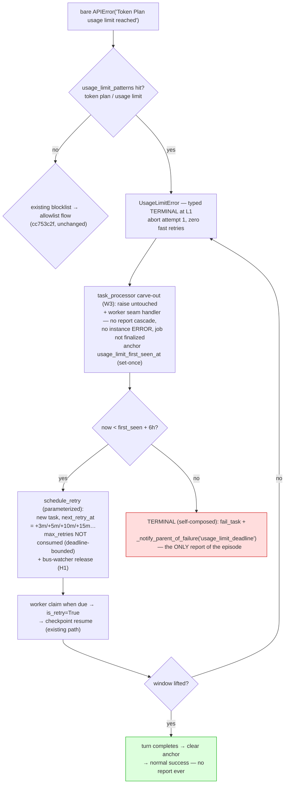

# Plan: Usage-Limit Window Recovery (quota-shape long-horizon retry, 6h)

| Field | Value |
|---|---|
| **Status** | DRAFT — Pending Team Review. Date: 2026-08-27. **Approach D (dedicated deferral path on reused RetryTurn machinery) ADJUDICATED by user 2026-08-27 — specified in [`usage-limit-deferral-path.md`](usage-limit-deferral-path.md).** Alternatives retained in §1a for the record: A=ERROR-but-silent, B=alive-idle, C=dedicated `PARKED` state. |
| **Goal** | Quota exhaustion shapes (`Token Plan usage limit reached` / `usage limit` — currently terminal-at-attempt-1 via the transient-channel blocklist) become a **system-level cancellation-class failure** that rides the production timeout/retry lane (RetryTurn): the turn aborts fast at L1 (no futile second-scale retries), **no error report and no `ERROR` state per attempt — instance + job state intact** — and the task is re-dispatched from checkpoint on a fixed schedule **3 min → 5 min → 10 min → 15 min (15 min cap)** until **first-sighting + configurable window (default 6 h)**. Exactly ONE report per episode: success (normal completion) or terminal `usage_limit_deadline` at the deadline. The 6 h is the **retry horizon** (deadline-bounded, `max_retries`-free) — NOT a per-task `TimeoutMonitor` extension. |
| **Scope** | SMALL-MEDIUM — single coder. **INDEPENDENT of the parking plan** (no job-queue migration, no observer branch, no scheduler scoping — §7). Spans `daemon/llm_error_classifier.py` (typed wrapper, pattern list — shared unit 1), instance-metadata anchor (unit 2), a `UsageLimitError` catch at the task seam routing into `schedule_retry` with a deadline-bounded schedule (`daemon/services/task_processor.py`, `daemon/services/worker_pool.py`, `daemon/services/turn_transitions.py`), `daemon/config.py` + `config.yaml`, targeted tests. |
| **Risk** | `max_retries` bypass semantics (deadline-bounded deferrals — same adjudication as parking decision 1, but on the L3 lane that currently hard-caps at 3); `retry_count` grows ~26/episode (audit consumers); verify the job is NOT finalized and the instance does NOT go `ERROR` while a retry is scheduled (the TIMEOUT lane's contract — must hold for the programmatic path too); detection false-positives auto-retrying a genuine bug for 6 h (bounded: terminal report at deadline carries the original error). |
| **Evidence** | Corpus event 2056 `Token Plan usage limit reached` (1 instance death, [`docs/bugs/transient-llm-failures-non-retryable-instance-death.md`](../bugs/transient-llm-failures-non-retryable-instance-death.md)); today classified terminal by the blocklist installed in commit `cc753c2f`. Quota windows are per-account and reset on the provider's schedule — waiting IS the correct recovery, unlike bad-params. |
| **Related** | [`rate-limit-episode-parking.md`](rate-limit-episode-parking.md) (provider-outage episodes — machinery donor, §7) · [`transient-channel-retry-widening.md`](transient-channel-retry-widening.md) (IMPLEMENTED — the blocklist this plan types) · [`docs/retry-architecture.md`](../retry-architecture.md) §6/§7/§9 (L3/L4, episode comparison) |

---

## 1. Problem

The transient-channel widening (`cc753c2f`) keeps quota shapes terminal at L1 — correctly:
retrying a usage limit inside the 10-attempt second-scale budget is futile, and that guard
must stay. But **terminal at L1** today cascades to **terminal forever**: instance dies
`ERROR`, parent gets `RECOVERY_GUIDANCE_HINT` ("waiting never works… spawn a replacement") —
precisely wrong for a quota window that resets on its own. The harness engine is designed to
run for days; the correct behavior is **bounded patience**: abort the turn fast, retry the
SAME work from checkpoint every few minutes, recover when the provider resets the window,
and only die (distinctly) after 6 h without recovery.

**Adjudicated design (user, 2026-08-27): Approach D — dedicated deferral path, reused
machinery.** A fourth,
simpler approach was raised in review: quota exhaustion is a *system-level* condition, so
handle it like the system already handles "work that cannot proceed right now but should
resume" — the TIMEOUT lane. That lane is production-proven (`TimeoutMonitor` →
`OperationCancelledError(TIMEOUT)` → `_handle_cancellation` → `schedule_retry` at
`worker_pool.py:484-499,662`; bus-watcher rebinding at `:627-660` hardened by the
2026-06-26 production incident) and — uniquely among the lanes — it retries a task
**without** error-reporting the parent or ERROR-ing the instance. §1a compares all four;
§2 specifies D. Units 1-2 (classifier, anchor) and 5 (schedule) are shared verbatim from
the earlier drafts; D deletes the parking machinery (job columns, observer branch,
scheduler scoping, envelope suppression, new instance state) entirely.

### 1a. Approaches under consideration

| | **D. Dedicated deferral path** (reused machinery — ADJUDICATED) | **A. ERROR-but-silent** | **B. Alive-idle** | **C. Dedicated state** (`InstanceStatus.PARKED`) |
|---|---|---|---|---|
| Instance during episode | normal RUNNING↔idle cycling per attempt (RetryTurn contract) | `ERROR` (unchanged cascade) | settles alive (idle), error-report lane skipped | new state `parked` — alive-but-not-schedulable |
| Parent sees | nothing per attempt (cancellation is silent — no suppression code needed) | nothing per attempt; PARKED notice (job_id) | same | same, plus an honest status |
| Re-dispatch | existing retry-task claim path (`next_retry_at` → worker claim; `is_retry=True` checkpoint resume) | ERROR→RUNNING revive via scoped RetryScheduler | new "dispatch to live instance" path | `PARKED`→`RUNNING` (revive set extension) |
| Retry seam | `UsageLimitError` catch at the task seam → `schedule_retry` (deadline-bounded) | observer lane (shared w/ parking unit 5) | message-error seam (early branch) | message-error seam (observer doesn't fire — instance not dead) |
| New machinery | typed exception + one catch branch + schedule/deadline parameterization + `max_retries` bypass | envelope suppression + parking machinery | suppression + alive-settle path + parking machinery | enum value + transition sites + membership decisions at every status enumeration + parking machinery |
| Blast radius | tiny: classifier + one seam + config | small + parking machinery | medium + parking machinery | **large**: ~169 status-literal sites daemon-wide + frontend + parking machinery |
| Parking-plan dependency | **none** | hard (§7) | hard (§7) | hard (§7) |
| Falsifiable risk | L3 `max_retries=3` contract must not silently re-kill at attempt 4; job must not finalize mid-episode | something reaps `ERROR` mid-window | "turn failed, instance stays alive" has no precedent settle path | membership drift across the 169 sites; frontend/API enum churn |
| Est. effort | **~0.5-1 day** | ~1+ day (with parking) | ~1-2 days (with parking) | ~2-3 days (audit-heavy, with parking) |

**D — dedicated deferral path on reused machinery (adjudicated; fully specified in
[`usage-limit-deferral-path.md`](usage-limit-deferral-path.md)).** The insight: everything the
earlier approaches built by hand — silent parent, intact instance, checkpoint resume,
scheduled re-dispatch — already exists as production RetryTurn (L3) MACHINERY. D does not
"join the timeout lane"; it builds a **new usage-limit path** (typed error → dedicated
worker-seam handler → anchor/deadline/schedule policy) whose every primitive —
`schedule_retry`'s gate+transition+mirrors, F6 watcher migration, claim, `is_retry`
checkpoint resume — is reused code, parameterized not forked. Policy is new; machinery is
proven. The "6 h" is realized as the **retry horizon**: per-attempt `TimeoutMonitor`
stays at 125 min and is never approached (attempts fail in ~seconds); the window lives in
the anchor + deadline check. What D explicitly does NOT do: extend the per-task timeout
and sleep in-turn — see the rejection below. Tradeoffs accepted: `retry_count` grows
~26/episode (budget-free by adjudication, but any consumer assuming ≤ `max_retries` must
be audited); the reused primitive gains a second caller with different budget semantics
(parameterized, never copied).

**A — ERROR-but-silent (specified in §2).** Instance fails `ERROR` as today; parent
envelope suppressed in-window; one report per episode (success or 6 h terminal). Smallest
diff; rides the parking plan's shared observer seam. Accepted oddity: the instance LOOKS
dead for up to 6 h.

**B — Alive-idle.** Branch in `handle_message_processing_error` BEFORE
`_send_error_report`: no ERROR, no FAILED message, no hierarchy deletion; instance
settles to its alive idle state; job parks at that seam. Cleanest observable state
without touching the enum — but "turn failed, instance stays alive" has no precedent
settle path (must be built and verified against the watchdog, stale-recovery, and
`WAITING`-semantics), and it forks the park seam away from the parking plan.

**C — Dedicated state.** Add `InstanceStatus.PARKED` (`daemon/repositories/instance/models.py:20-31`;
string column — no DB migration, `is_valid` picks it up). Entry: `RUNNING→PARKED` at the
message-error seam (same as B; the observer's terminal set at `job_feedback_observer.py:99-103`
rightly excludes it, so the job parks at the transition site). Exits: `PARKED→RUNNING`
via `send_message` (add `parked` to the revivable set at `instance_messaging.py:1523-1532`),
`PARKED→ERROR`/`FAILED` at the deadline. The audit surface (membership decisions, from
grep 2026-08-27): revive sets `manager.py:1370,3915,6448`; ALIVE/DEAD sets
`job_recovery_service.py:45-55` (parked = neither — needs its own class); child-report
parent-status checks `child_reports.py:1066-68,1891-905`; stale-recovery + watchdog
(`last_activity_at` — refresh per wake or exempt `parked`); frontend status rendering +
API enums. Semantically the honest one — and the only approach whose failure mode is a
**compile-time-visible missing case** in exhaustive sets, vs A/B's silent drift. Cost:
the audit is the work.

What must NOT happen (rejected up front): **in-turn sleeping** — extending the 125-min
`TimeoutMonitor` to 6 h and sleeping 3-15 min between in-graph retries. It would hold a
bounded-pool worker per sleeping task for hours ("workers are single-threaded per pool"
— `worker_pool.py:703-705`); quota outages are account-wide, so N quota-hit instances
would sleep-exhaust the pool and starve ALL other task processing. Checkpoints also
wouldn't progress and the turn would show no activity. The per-attempt timeout stays
125 min — D's patience lives between tasks (the retry schedule), never inside one.
(In-agent retry loops stay rejected too — LoopDetector threshold-3 forbids them.)

## 2. Design

Same three phases as the parking plan — **A** detect & anchor, **B** classify & park,
**C** re-dispatch — with a second episode kind parameterizing the shared machinery.

### Phase A — Detect & anchor

**1. Typed terminal wrapper: `UsageLimitError`.** New exception in
`daemon/llm_error_classifier.py`:

```python
class UsageLimitError(Exception):
    """Provider quota exhaustion (token plan / usage limit windows).
    Terminal at L1 by design — the window resets on the provider's
    schedule, so second-scale retries are futile. The task seam routes
    it into the RetryTurn lane (deadline-bounded re-dispatch); see
    docs/plans/usage-limit-window-recovery.md."""
```

NOT a member of `TRANSIENT_EXCEPTIONS` / `TIMEOUT_EXCEPTIONS` — the fast-abort semantics
of today's blocklist are preserved byte-identically. New pattern list
`usage_limit_patterns` (config, §4), default `['token plan', 'usage limit']` —
**disjoint from `invalid params`** (2013), which stays an untyped terminal re-raise: a
genuine bad-params bug must never enter a 6 h episode. Detection helper
`_matches_usage_limit(msg)` checked in the bare-`APIError` branch BEFORE the transient
allowlist/blocklist logic (quota hits are a subset of today's blocklist hits; ordering:
usage-limit → blocklist → allowlist), and on the `ValueError` channel for parity (quota
text embedded in 200-body dicts — the §review guard from `cc753c2f` already proves the
channel can carry it). Facade parity via one shared helper, same as
`classify_transient_apierror_body`.

**2. First-sighting anchor (instance-scoped).** Persist `usage_limit_first_seen_at`
(ISO) into INSTANCE metadata on first sighting; set only if absent (monotonic per
episode); **clear on successful LLM response**. The 6 h clock is per-instance
("from the first time the instance gets the usage limit"). Mirrors parking unit 2
(`rate_limit_first_seen_at`) — one mechanism, two keys.

### Phase B (Approach D — adjudicated) — dedicated path at the worker seam

**Authoritative spec: [`usage-limit-deferral-path.md`](usage-limit-deferral-path.md) W1-W8
(revised 2026-08-27 per its review).** The summary below is synced to that revision; on
any divergence, the detail plan wins.

**3. Two-part catch keeps the error out of every report path.** (a) A carve-out in
`task_processor.process` BEFORE the generic `except Exception` (`:422`): `except
UsageLimitError: raise` — without it the stage-2 cascade (`handle_message_processing_error`
→ error event, lifecycle `status="error"`, `_send_error_report`) fires on EVERY deferral
before the worker seam sees the exception (review blocker §2.1). (b) The dedicated entry
point in `_process_with_timeout` (`worker_pool.py:484-588`): `except UsageLimitError` →
`_handle_usage_limit` — the worker seam owns the episode decision (anchor/deadline are
worker-seam state). Net per-attempt observables: none — no `_send_error_report`, no
instance `ERROR`, no message `FAILED`, no hierarchy deletion, no error event. By two
constructions, not one.

**4. Deadline check + `schedule_retry` with a usage-limit schedule.** In that handler:
- Read/stamp the anchor (unit 2). `now < first_seen + window` → call the existing
  `schedule_retry` machinery (`daemon/repositories/task/repository.py:2878-3054`) with
  the unit-5 schedule via keyword-only params (`next_retry_at`, `bypass_retry_budget`)
  — parameterized, never forked; the retry task is claimed by the NORMAL worker claim
  path (no RetryScheduler scoping, no revive — `is_retry=True` gives checkpoint resume,
  `task_processor.py:352`). **Then release the dependency-bus watchers**
  (`_cancel_bus_watchers_for_task`, as the TIMEOUT lane does at `worker_pool.py:782`) —
  F6 migrates the DB `job_watchers`, but the in-memory bus watchers strand the parent in
  `waiting_children` without this call (review H1). The job is not finalized (task not
  terminal) and the instance returns to its normal between-tasks state — the RetryTurn
  contract, already production-proven for TIMEOUT.
- `now ≥ deadline` → **TERMINAL, self-composed and RACE-GATED** (review rev2 §2.1:
  `_handle_task_failure` has no parent notification / `error_type` param — that
  mechanism does not exist; and the fallthrough must never report on a live episode):
  `fail_task` first — if it returns `None` (lost the guard race to a concurrent
  terminalization OR a concurrent retry-child creator, e.g. W8's recovery child),
  log-and-return with NO report; on race-won: `_notify_parent_of_failure(
  error_type='usage_limit_deadline')` + watcher notify + clear anchor — the composition
  the `max_retries_exceeded` path uses (`worker_pool.py:795-800`), with a stronger gate
  than its precedent (the usage-limit path has another re-childing actor). The ONLY
  error report of the episode.
- **Budget bypass:** usage-limit deferrals do NOT consume L3 `max_retries` (default 3)
  — deadline-bounded instead (identical adjudication to parking decision 1, moved to
  the L3 lane); the bypass drops only the `retry_count < max_retries` SQL term
  (`repository.py:2946`), concurrency guards stay. `retry_count` still increments
  monotonically (~26/episode) for observability, and BOTH episode ends (success
  finalize and race-won terminal) clear the anchor (unit 2) — a later quota hit starts
  a fresh window. **Stale recovery** gets the same
  bypass anchor-gated (a mid-attempt crash must not let stale sweeps permanently fail
  the episode — detail plan W8, review M1; force-cancel callsites only, see W8
  coverage scope).

**4'. What D deletes from the earlier drafts:** unit 4a/4b (envelope suppression,
observer park branch), unit 6 (job-queue migration — the anchor lives in instance
metadata), unit 7 (scheduler scoping), the revive path (unit 8's ERROR→RUNNING), and all
of Approach C's state machinery. One seam, one schedule, one deadline.

**5. Schedule (unit 5, unchanged):** delays `[180, 300, 600, 900]` (15 min cap beyond),
cumsum-derived `next_retry_at = first_seen + smallest cumsum > elapsed`, ±10 % jitter,
deadline `first_seen + 21600 s`. Crash-safe from the anchor alone.

### Phase B (Approach A alternative — superseded by D, retained for the record)

**3. Error-type mapping.** `_classify_error_type`:
`UsageLimitError` → `error_type='usage_limit'` (a first-sighting type, not an exhaustion
type — there are no L1 retries to exhaust). Thread `error_type` into the lifecycle event
payload as in parking unit 3.

**4a. Envelope suppression in the error-report lane.** In
`_send_error_report` (`daemon/services/error_reporting.py:399-779`), keyed on
`error_type=='usage_limit'` AND an in-window episode anchor: replace the parent
envelope (incl. `RECOVERY_GUIDANCE_HINT`, `:739`) with NOTHING — no per-attempt parent
report. Instance → `ERROR` (`:192`), message → `FAILED`, hierarchy-row deletion
(`:201-203`) proceed as today (revive does not need the row). Out-of-window or
non-usage-limit errors: byte-identical reporting.

**4b. Observer branch (shared with parking unit 5, keyed by episode kind).** In
`_finalize_job_db_sync` — which DOES fire in this design, because the instance died:
- `now < first_seen + window` → **PARK**: guarded requeue with
  `next_retry_at` derived from the schedule (unit 5); `retry_count` preserved
  (deferrals are budget-free — approved decision 1 in the parking plan, same rationale);
  episode columns stamped if unset; **PARKED notice** (informational: job_id + deadline +
  original error, "do NOT spawn replacements") — it must carry `job_id` because the
  hierarchy row is deleted.
- `now ≥ deadline` → **TERMINAL**: `terminal_reason='usage_limit_deadline'` (new enum;
  MIRROR_SET verification required — parking §9 risk applies verbatim), critical
  envelope — the ONLY error report of the episode.

**5. Stateless schedule derivation (no attempt counter column).** The fixed schedule is
derived from elapsed time, making park state crash-safe with only the anchor:

```
delays = [180, 300, 600, 900]  # 3m, 5m, 10m, 15m; 15m cap beyond
cumsum(T) = 180, 480, 1080, 1980, 2880, …  (+900 each)
next_retry_at = first_seen + cumsum[k]   where k = attempts so far
             = smallest cumsum > elapsed(now − first_seen)
deadline      = first_seen + window (default 21600 s)
```

~26 wake-ups fit in 6 h (3+5+10, then 15-min steps). Attempts fail fast (~seconds) when
the window persists, so cumulative-vs-per-attempt-backoff are equivalent; elapsed-based
derivation survives daemon restarts with no extra column. Add ±10 % jitter on each wake
(herd protection, parking unit 7 rationale).

**6. Migration — N/A under D** (no job-queue columns; the anchor lives in instance
metadata). The text below applied to A/B/C only: Episode columns on `job_queue_items`
generalized to parking's shape plus a kind discriminator:
`episode_kind TEXT NULL` (`'provider_outage' | 'usage_limit'`),
`episode_first_seen_at TEXT NULL`, `episode_deadline_at TEXT NULL`. If the parking plan
lands first with its `first_rate_limit_at`/`rate_limit_deadline_at` columns, migrate to
the generalized triple in THIS plan (one migration, both kinds). `atomic_retry` must not
clear them; success finalize, DLQ replay, and manual retry DO (fresh episode — decision 5).

### Phase C — Re-dispatch (D: existing claim path; A: units below)

**7. D — nothing to build.** The retry task created by unit 4 carries `next_retry_at`;
the normal worker claim path picks it up when due (the same machinery that dispatches
TIMEOUT retries today). No RetryScheduler scoping, no revive, no wake code.

**7-A/8-A (Approach A alternative — superseded by D).** Scoped RetryScheduler wake;
`send_message` revive (ERROR→RUNNING, `instance_messaging.py:1486-1510`) → `is_retry=True`
→ checkpoint resume (`task_processor.py:352`). Window still closed → L1 aborts on
attempt 1 with `UsageLimitError` → instance back to `ERROR`, report suppressed again,
re-park at the next schedule slot. Window lifted → turn completes → clear anchor +
episode columns atomically in success finalize (parking unit 8).



## 3. What each lane does NOT change

- **L1/L2 for everything else: byte-identical.** Quota shapes were already terminal at
  attempt 1 (blocklist); they still are — now typed. `invalid params`, auth, context-length,
  all transient channels: untouched.
- **Error-report lane / instance state machine: untouched, period.** D never enters them
  for usage-limit (W3 carve-out + W4 handler); every other error cascades exactly as
  today (instance `ERROR`, report, hint).
- **L3 TIMEOUT retries: byte-identical.** `schedule_retry` and
  `force_cancel_and_schedule_retry` gain keyword parameters (schedule, budget bypass)
  with defaults preserving today's behavior; ordinary timeout retries still honor
  `max_retries` and the `2^n` backoff.
- **L4 job queue / observer / scheduler: untouched.**
- **Facade secondary sites:** they receive the typed `UsageLimitError` and keep their
  existing graceful-fallback behavior — no 6 h episodes for keyword/title/embedding calls
  (type-swap audited, detail plan W1).
- **Pause/resume, compaction, LoopBreaker: untouched by construction.** Stale recovery
  gains ONLY the anchor-gated bypass (detail plan W8) — non-episode behavior
  byte-identical.

## 4. Config

Patterns in `QueueConfig` (single home for LLM-retry classification patterns — the
`cc753c2f` convention); episode timing under `services:` beside the worker knobs
(`task_timeout_minutes` et al.) — **authoritative form in the detail plan W7**:

```yaml
queue:
  # Quota-window shapes typed as UsageLimitError (terminal at L1; the
  # dedicated deferral path owns recovery). MUST stay disjoint from bad-params shapes.
  usage_limit_patterns: ['token plan', 'usage limit']

services:
  usage_limit_window_seconds: 21600      # 6h horizon from first sighting
  usage_limit_retry_delays_seconds: [180, 300, 600, 900]  # 15min cap
  usage_limit_retry_jitter_fraction: 0.1
```

## 5. Acceptance criteria

**Authoritative list: detail plan §5.** Summary, synced to the review revision:

1. 2056 corpus shape → `UsageLimitError` at attempt 1 (no fast retries); `invalid params`
   (2013) stays untyped terminal (regression); all `cc753c2f` tests green unmodified.
2. In-window sighting → **no `_send_error_report` call, no DB error event, no lifecycle
   `status="error"` event** (W3 carve-out held — stage-2 cascade did not run;
   `consecutive_failures` not bumped), instance NOT `ERROR`, message NOT `FAILED`,
   hierarchy row intact, job NOT finalized; a retry task exists with `next_retry_at` =
   next schedule slot; `max_retries` not consumed (4th deferral still schedules).
3. Retry task claimed when due → `is_retry=True` → checkpoint resume; persistent window
   re-schedules at the NEXT slot (schedule advances by elapsed time, not re-stamping).
4. **Both watcher kinds:** DB `job_watchers` migrate parent→child (F6) AND
   dependency-bus watchers release per deferral; a watching parent is notified exactly
   once, on the episode's terminal outcome.
5. Success after episode clears the anchor; a later quota hit starts a fresh 6 h window.
6. `now ≥ deadline` → **`_notify_parent_of_failure` called exactly once across the whole
   episode** with `error_type='usage_limit_deadline'` (self-composed terminal: fail_task
   + notify + watcher notify); no per-attempt reports ever sent.
7. Crash-safety, both windows: restart while parked (anchor + pending retry survive,
   deadline from persisted anchor) AND crash mid-attempt (stale recovery retries WITH
   the anchor-gated bypass — episode survives, no generic permanent-fail).
8. Config parsing: list forms; empty `usage_limit_patterns` disables the typed wrapper
   (additive-off switch).
9. TIMEOUT-lane regression: ordinary timeout retries (`max_retries`, backoff), stale
   recovery on non-episode tasks, and the pause/cancel lanes byte-identical.

## 6. Risks

| Risk | Impact | Mitigation |
|---|---|---|
| (D) `retry_count < max_retries` guard (SQL, `repository.py:2946` and `force_cancel…` `:3364`) silently re-kills the episode at attempt 4 | High | `bypass_retry_budget` drops only that term in BOTH methods; acceptance test drives ≥4 deferrals in-window; W8 closes the stale-recovery variant |
| (D) W3 carve-out ordering regresses under future refactor | Medium | Carve-out has its own test (no-cascade assertions); inline comment names the invariant |
| (D) Bus watchers strand on deferral → parent stuck in `waiting_children` | High if missed | `_cancel_bus_watchers_for_task` per deferral (as TIMEOUT lane, `worker_pool.py:782`); acceptance test 4 asserts both watcher kinds |
| (D) `retry_count` grows ~26/episode — consumers assuming ≤ `max_retries` | Medium | Grep-audit `retry_count` readers (claim path verified gate-free, `repository.py:1189`); document monotonic-with-bypass |
| (D) detection false-positive auto-retries a genuine bug for 6 h | Medium | Narrow default patterns; `invalid params` explicitly excluded; terminal report carries the original error; empty pattern list = additive-off |
| (D) facade type-swap breaks type-specific `except` at secondary sites | Medium | W1 audit + facade typed-surface test |
| `schedule_retry` parameterization drifts from the TIMEOUT caller | Medium | Keyword-only, behavior-preserving defaults; golden-path snapshot test; never copy the implementation |
| Herd: all instances wake on the same slots | Low | ±10 % jitter per wake (unit 5) |
| Parking plan later lands with observer-lane parking for provider outages | Low | D and parking coexist (different lanes, different triggers); parking may adopt D's pattern later — its §7 call, not this plan's |

## 7. Sequencing — RESOLVED by D

D has **no dependency on the parking plan**: it touches the classifier, one task-seam
branch, `schedule_retry` parameterization, and config. Land it independently on
`latest`. The parking plan (provider-outage episodes) remains free to proceed on its
observer-lane design — or, preferably, to adopt D's task-seam + RetryTurn pattern for
its own kind, in which case its job-queue machinery shrinks the same way this plan's
did. That convergence is a future decision for the parking plan, not a blocker here.

## 8. Open questions (non-blocking)

- Provider `Retry-After` / reset-time hint in the 2056 body (if the proxy relays one,
  it could shorten the first delay — needs payload samples).
- Per-model-group quota discrimination (corpus has one shape; patterns are the lever).
- Whether a usage-limit hit on a job-less turn (no processing job attached) should also
  defer — D's seam is the task lane, which exists for job-less messages too; likely
  yes for free, but verify the job-absent finalize path stays quiet during deferrals.
- Observability: an optional informational notice (queue watchers / parent) at first
  park — D sends nothing per attempt by design; decide whether one heads-up is wanted.
- (A/B/C, if ever re-adjudicated) naming for C: `PARKED` vs `WAITING_QUOTA` vs reusing
  `WAITING` — `WAITING` is overloaded (user-input waiting); a distinct value keeps
  episode accounting greppable.

## 9. Implementation notes

- Branch off `latest` — no coordination with `feature/rate-limit-episode-parking`
  needed (§7); still check for stale partial branches first (house convention).
- **Authoritative implementation spec: [`usage-limit-deferral-path.md`](usage-limit-deferral-path.md)**
  (W1-W8, revised 2026-08-27 per its review; landing order there §9).
- Single coder; **~1-1.5 days** (D, review delta included: task-processor carve-out,
  bus-watcher release, stale-recovery bypass). A/B/C effort figures in §1a assumed the
  parking machinery as a prerequisite — retained for the record only.
