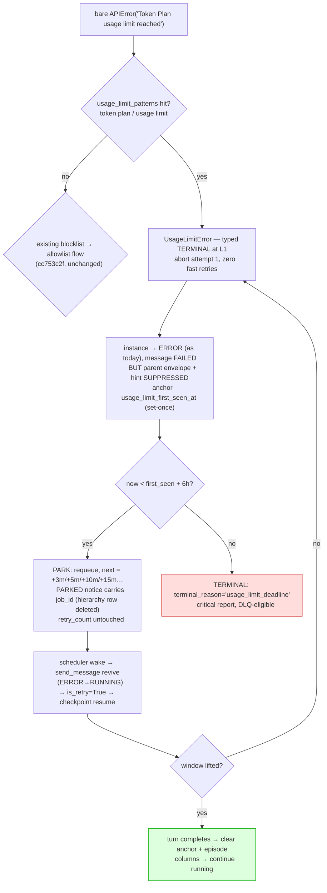

# Plan: Usage-Limit Window Recovery (quota-shape long-horizon retry, 6h)

| Field | Value |
|---|---|
| **Status** | DRAFT — Pending Team Review. Date: 2026-08-27. Approach decision REOPENED (§1a: A=ERROR-but-silent [specified], B=alive-idle, C=dedicated `PARKED` state). |
| **Goal** | Quota exhaustion shapes (`Token Plan usage limit reached` / `usage limit` — currently terminal-at-attempt-1 via the transient-channel blocklist) become a distinct **usage_limit episode**: the turn aborts fast at L1 (no futile second-scale retries), the instance fails to `ERROR` as today but **the parent error report is suppressed** (no `RECOVERY_GUIDANCE_HINT`), the job is parked and re-dispatched on the proven ERROR→RUNNING revive path on a fixed schedule **3 min → 5 min → 10 min → 15 min (15 min cap)** until **first-sighting + configurable window (default 6 h)**. Exactly ONE report per episode: success (normal completion) or terminal `usage_limit_deadline` at the 6 h deadline (user-adjudicated 2026-08-27: "ERROR-but-silent"). |
| **Scope** | MEDIUM-LARGE — single coder. Depends on the episode machinery of [`rate-limit-episode-parking.md`](rate-limit-episode-parking.md) (DRAFT, not yet implemented — see §7 sequencing). Spans `daemon/llm_error_classifier.py` (typed wrapper, pattern list), `daemon/services/message_processing_errors.py` (error-type), `daemon/services/error_reporting.py` (envelope suppression for in-window episodes), the parking plan's Phase B/C seams (observer branch, episode columns, scheduler scoping, revive), `daemon/config.py` + `config.yaml`, targeted tests. |
| **Risk** | Shared-machinery drift with the parking plan (two episode kinds, one seam); `terminal_reason` enum addition vs `_derive_legacy_status` / `reconcile_turn_mirror` MIRROR_SET (same as parking §9); detection false-positives parking genuine bugs for 6 h; instance sits `ERROR` for up to 6 h — must verify no reaper/stale-recovery touches it. |
| **Evidence** | Corpus event 2056 `Token Plan usage limit reached` (1 instance death, [`docs/bugs/transient-llm-failures-non-retryable-instance-death.md`](../bugs/transient-llm-failures-non-retryable-instance-death.md)); today classified terminal by the blocklist installed in commit `cc753c2f`. Quota windows are per-account and reset on the provider's schedule — waiting IS the correct recovery, unlike bad-params. |
| **Related** | [`rate-limit-episode-parking.md`](rate-limit-episode-parking.md) (provider-outage episodes — machinery donor, §7) · [`transient-channel-retry-widening.md`](transient-channel-retry-widening.md) (IMPLEMENTED — the blocklist this plan types) · [`docs/retry-architecture.md`](../retry-architecture.md) §6/§7/§9 (L3/L4, episode comparison) |

---

## 1. Problem

The transient-channel widening (`cc753c2f`) keeps quota shapes terminal at L1 — correctly:
retrying a usage limit inside the 10-attempt second-scale budget is futile, and that guard
must stay. But **terminal at L1** today cascades to **terminal forever**: instance dies
`ERROR`, parent gets `RECOVERY_GUIDANCE_HINT` ("waiting never works… spawn a replacement") —
precisely wrong for a quota window that resets on its own. The harness engine is designed to
run for days; the correct behavior is **bounded patience**: abort the turn fast, retry the
SAME work from checkpoint every few minutes, recover when the provider resets the window,
and only die (distinctly) after 6 h without recovery.

**Adjudicated design (user, 2026-08-27): ERROR-but-silent — Approach A below.** Decision
REOPENED for multi-approach planning the same day: §1a compares three approaches for the
instance's state during the episode; §2 onward specifies **A** (the current default).
Phase A (classifier + anchor), the schedule (unit 5), the migration (unit 6), and the
scheduler wake (unit 7) are IDENTICAL across all three — the approaches differ only in
Phase B (state + reporting + park seam) and the wake dispatch path.

### 1a. Approaches under consideration

| | **A. ERROR-but-silent** (current default) | **B. Alive-idle** (early branch) | **C. Dedicated state** (`InstanceStatus.PARKED`) |
|---|---|---|---|
| Instance during episode | `ERROR` (unchanged cascade) | settles alive (idle), error-report lane skipped | new state `parked` — alive-but-not-schedulable |
| Parent sees | nothing per attempt; PARKED notice (job_id) | same | same, plus an honest status |
| Wake dispatch | proven ERROR→RUNNING revive | new "dispatch to live instance" path | `PARKED`→`RUNNING` (revive set extension) |
| Park seam | observer lane (shared w/ parking unit 5) | message-error seam (early branch) | message-error seam (observer doesn't fire — instance not dead) |
| New machinery | envelope suppression only | suppression + alive-settle path | enum value + transition sites + membership decision at every status enumeration |
| Blast radius | small | medium | **large**: ~169 status-literal sites daemon-wide + frontend; each needs a "dead or alive?" decision; a forgotten site is a subtle bug (reaper kills parked instance, list filters hide it, watchdog times it out) |
| Falsifiable risk | something reaps `ERROR` mid-window | "turn failed, instance stays alive" has no precedent settle path | membership drift across the 169 sites; frontend/API enum churn |
| Est. effort on top of shared units | ~0.5 day | ~1 day | ~2–3 days (audit-heavy) |

**A — ERROR-but-silent (specified in §2).** Instance fails `ERROR` as today; parent
envelope suppressed in-window; one report per episode (success or 6 h terminal). Smallest
diff; rides the parking plan's shared observer seam. Accepted oddity: the instance LOOKS
dead for up to 6 h.

**B — Alive-idle.** Branch in `handle_message_processing_error` BEFORE
`_send_error_report`: no ERROR, no FAILED message, no hierarchy deletion; instance
settles to its alive idle state; job parks at that seam. Cleanest observable state
without touching the enum — but "turn failed, instance stays alive" has no precedent
settle path (must be built and verified against the watchdog, stale-recovery, and
`WAITING`-semantics), and it forks the park seam away from the parking plan.

**C — Dedicated state.** Add `InstanceStatus.PARKED` (`daemon/repositories/instance/models.py:20-31`;
string column — no DB migration, `is_valid` picks it up). Entry: `RUNNING→PARKED` at the
message-error seam (same as B; the observer's terminal set at `job_feedback_observer.py:99-103`
rightly excludes it, so the job parks at the transition site). Exits: `PARKED→RUNNING`
via `send_message` (add `parked` to the revivable set at `instance_messaging.py:1523-1532`),
`PARKED→ERROR`/`FAILED` at the deadline. The audit surface (membership decisions, from
grep 2026-08-27): revive sets `manager.py:1370,3915,6448`; ALIVE/DEAD sets
`job_recovery_service.py:45-55` (parked = neither — needs its own class); child-report
parent-status checks `child_reports.py:1066-68,1891-905`; stale-recovery + watchdog
(`last_activity_at` — refresh per wake or exempt `parked`); frontend status rendering +
API enums. Semantically the honest one — and the only approach whose failure mode is a
**compile-time-visible missing case** in exhaustive sets, vs A/B's silent drift. Cost:
the audit is the work.

What must NOT happen (rejected up front): in-turn patience. Waits of 3–15 min × up to 6 h
inside one tenacity cycle would hold the worker and the graph turn for hours —
`task_timeout_minutes=125` (`daemon/config.py:467`) forbids it, checkpoints would not
progress, and the turn would produce no observable state. Patience lives at the
**episode/job lane** (parking-plan architecture), not L1.

## 2. Design

Same three phases as the parking plan — **A** detect & anchor, **B** classify & park,
**C** re-dispatch — with a second episode kind parameterizing the shared machinery.

### Phase A — Detect & anchor

**1. Typed terminal wrapper: `UsageLimitError`.** New exception in
`daemon/llm_error_classifier.py`:

```python
class UsageLimitError(Exception):
    """Provider quota exhaustion (token plan / usage limit windows).
    Terminal at L1 by design — the window resets on the provider's
    schedule, so second-scale retries are futile. The episode lane
    (job parking) owns recovery; see docs/plans/usage-limit-window-recovery.md."""
```

NOT a member of `TRANSIENT_EXCEPTIONS` / `TIMEOUT_EXCEPTIONS` — the fast-abort semantics
of today's blocklist are preserved byte-identically. New pattern list
`usage_limit_patterns` (config, unit 6), default `['token plan', 'usage limit']` —
**disjoint from `invalid params`** (2013), which stays an untyped terminal re-raise: a
genuine bad-params bug must never enter a 6 h episode. Detection helper
`_matches_usage_limit(msg)` checked in the bare-`APIError` branch BEFORE the transient
allowlist/blocklist logic (quota hits are a subset of today's blocklist hits; ordering:
usage-limit → blocklist → allowlist), and on the `ValueError` channel for parity (quota
text embedded in 200-body dicts — the §review guard from `cc753c2f` already proves the
channel can carry it). Facade parity via one shared helper, same as
`classify_transient_apierror_body`.

**2. First-sighting anchor (instance-scoped).** Persist `usage_limit_first_seen_at`
(ISO) into INSTANCE metadata on first sighting; set only if absent (monotonic per
episode); **clear on successful LLM response**. The 6 h clock is per-instance
("from the first time the instance gets the usage limit"). Mirrors parking unit 2
(`rate_limit_first_seen_at`) — one mechanism, two keys.

### Phase B — Classify & park (observer seam, report suppressed)

**3. Error-type mapping.** `_classify_error_type`:
`UsageLimitError` → `error_type='usage_limit'` (a first-sighting type, not an exhaustion
type — there are no L1 retries to exhaust). Thread `error_type` into the lifecycle event
payload as in parking unit 3.

**4a. Envelope suppression in the error-report lane.** In
`_send_error_report` (`daemon/services/error_reporting.py:399-779`), keyed on
`error_type=='usage_limit'` AND an in-window episode anchor: replace the parent
envelope (incl. `RECOVERY_GUIDANCE_HINT`, `:739`) with NOTHING — no per-attempt parent
report. Instance → `ERROR` (`:192`), message → `FAILED`, hierarchy-row deletion
(`:201-203`) proceed as today (revive does not need the row). Out-of-window or
non-usage-limit errors: byte-identical reporting.

**4b. Observer branch (shared with parking unit 5, keyed by episode kind).** In
`_finalize_job_db_sync` — which DOES fire in this design, because the instance died:
- `now < first_seen + window` → **PARK**: guarded requeue with
  `next_retry_at` derived from the schedule (unit 5); `retry_count` preserved
  (deferrals are budget-free — approved decision 1 in the parking plan, same rationale);
  episode columns stamped if unset; **PARKED notice** (informational: job_id + deadline +
  original error, "do NOT spawn replacements") — it must carry `job_id` because the
  hierarchy row is deleted.
- `now ≥ deadline` → **TERMINAL**: `terminal_reason='usage_limit_deadline'` (new enum;
  MIRROR_SET verification required — parking §9 risk applies verbatim), critical
  envelope — the ONLY error report of the episode.

**5. Stateless schedule derivation (no attempt counter column).** The fixed schedule is
derived from elapsed time, making park state crash-safe with only the anchor:

```
delays = [180, 300, 600, 900]  # 3m, 5m, 10m, 15m; 15m cap beyond
cumsum(T) = 180, 480, 1080, 1980, 2880, …  (+900 each)
next_retry_at = first_seen + cumsum[k]   where k = attempts so far
             = smallest cumsum > elapsed(now − first_seen)
deadline      = first_seen + window (default 21600 s)
```

~26 wake-ups fit in 6 h (3+5+10, then 15-min steps). Attempts fail fast (~seconds) when
the window persists, so cumulative-vs-per-attempt-backoff are equivalent; elapsed-based
derivation survives daemon restarts with no extra column. Add ±10 % jitter on each wake
(herd protection, parking unit 7 rationale).

**6. Migration (if parking plan not yet landed).** Episode columns on `job_queue_items`
generalized to parking's shape plus a kind discriminator:
`episode_kind TEXT NULL` (`'provider_outage' | 'usage_limit'`),
`episode_first_seen_at TEXT NULL`, `episode_deadline_at TEXT NULL`. If the parking plan
lands first with its `first_rate_limit_at`/`rate_limit_deadline_at` columns, migrate to
the generalized triple in THIS plan (one migration, both kinds). `atomic_retry` must not
clear them; success finalize, DLQ replay, and manual retry DO (fresh episode — decision 5).

### Phase C — Re-dispatch on existing machinery

**7. Scoped scheduler wake.** RetryScheduler wakes usage-limit-parked jobs under the
same scoped auto-enable as parking unit 7 (global default-off semantics unchanged for
ordinary retries).

**8. Revive rides the checkpoint-resume path.** Wake → job dispatch → `send_message`
revive (ERROR→RUNNING, `instance_messaging.py:1486-1510`) → `is_retry=True` → checkpoint
resume (`task_processor.py:352`). Window still closed → L1 aborts on attempt 1 with
`UsageLimitError` → instance back to `ERROR`, report suppressed again, re-park at the
next schedule slot. Window lifted → turn completes → clear anchor + episode columns
atomically in success finalize (parking unit 8).



## 3. What each lane does NOT change

- **L1/L2 for everything else: byte-identical.** Quota shapes were already terminal at
  attempt 1 (blocklist); they still are — now typed. `invalid params`, auth, context-length,
  all transient channels: untouched.
- **Error-report lane / instance state machine: untouched for everything else.** The
  early branch fires only on `error_type=='usage_limit'`; every other error cascades
  exactly as today (instance `ERROR`, report, hint).
- **`max_retries` (L3/L4): untouched** — episode deferrals are deadline-bounded and
  budget-free.
- **Facade secondary sites:** they receive the typed `UsageLimitError` and keep their
  existing graceful-fallback behavior — no 6 h episodes for keyword/title/embedding calls.
- **Pause/resume, stale-recovery, compaction, LoopBreaker: untouched by construction.**

## 4. Config

Patterns in `QueueConfig` (single home for LLM-retry classification patterns — the
`cc753c2f` convention), episode timing in `JobSystemConfig` (parking-plan home):

```yaml
queue:
  # Quota-window shapes typed as UsageLimitError (terminal at L1; the
  # episode lane owns recovery). MUST stay disjoint from bad-params shapes.
  usage_limit_patterns: ['token plan', 'usage limit']

job_system:
  usage_limit_window_seconds: 21600      # 6h max patience from first sighting
  usage_limit_retry_delays_seconds: [180, 300, 600, 900]  # 15min cap
  usage_limit_retry_jitter_fraction: 0.1
```

## 5. Acceptance criteria

1. 2056 corpus shape → `UsageLimitError` at attempt 1 (no fast retries); `invalid params`
   (2013) stays untyped terminal (regression); all `cc753c2f` tests green unmodified.
2. First sighting inside window → job parked (queued + `next_retry_at` = next schedule
   slot), parked notice sent, standard error report suppressed, `retry_count` unchanged,
   **instance NOT `ERROR` (stays alive), message NOT `FAILED`, hierarchy row intact, no
   parent error envelope**.
3. Wake → revive → checkpoint resume; persistent window re-parks at the NEXT slot
   (schedule advances by elapsed time, not by re-stamping).
4. Success after episode clears anchor + episode columns; a later quota hit starts a
   fresh 6 h window.
5. `now ≥ deadline` → `terminal_reason='usage_limit_deadline'`, critical envelope,
   `_derive_legacy_status` + MIRROR_SET verified.
6. Anchor survives daemon restart; schedule derivation is stateless from
   `episode_first_seen_at` (crash-safety test).
7. Config parsing: list forms; empty `usage_limit_patterns` disables the typed wrapper
   (additive-off switch).

## 6. Risks

| Risk | Impact | Mitigation |
|---|---|---|
| Approach decision (§1a) — A/B/C diverge on state semantics and park seam | High | Decide BEFORE implementation; the chosen approach's Phase B + wake path replaces §2 units 4/8 verbatim; shared units (1-3, 5-7) are approach-invariant |
| (A) something reaps `ERROR` instances mid-window (stale-recovery, janitors) | Medium | Audit reapers for `ERROR` handling before landing A; parked job + episode columns make re-park idempotent |
| (C) membership drift across ~169 status-literal sites + frontend | Medium | Grep-audit checklist in §1a; exhaustive-match tests on ALIVE/DEAD/revive sets; frontend enum update in the same PR |
| Two episode kinds drift on shared seams (park + provider-outage) | Medium | One observer branch keyed by `episode_kind`; schedule/window parameterized per kind; shared tests |
| Detection false-positive parks a genuine bug for 6 h | Medium | Narrow default patterns; `invalid params` explicitly excluded; parked notice carries the original error; DLQ/manual retry = fresh episode |
| `terminal_reason` enum vs canonical map / MIRROR_SET | High | Same verification as parking §9; additive-only; legacy-derivation test |
| Elapsed-based schedule re-parks too eagerly after long GC/pause | Low | Fail-fast attempts make re-park cheap; next slot is monotonic (never before `cumsum[k]`) |
| Parking plan not landed → this plan carries the machinery | Medium | §7 sequencing decision made up front |

## 7. Sequencing decision (needs review)

The parking plan is DRAFT/LARGE and not implemented. Two options:

- **(a) Land parking first, this plan second (recommended).** Parking delivers the
  episode machinery (columns, park branch, scheduler scoping, dispatch) battle-tested;
  this plan then adds a second kind: small diff, one migration already generalized.
  Approach-dependent caveat: **A** shares parking's observer seam verbatim (no fork);
  **B/C** park at the message-error seam (instance not dead → observer never fires) —
  if B or C is chosen, the parking plan should adopt the same early branch (it also
  removes its observer-lane stranding for episode jobs), or the two kinds fork on this
  axis explicitly, keyed by `episode_kind`. Never fork silently.
- **(b) This plan first, generalized from the start.** Buys quota recovery sooner but
  couples it to unproven machinery and forces the parking plan to retrofit onto
  `episode_kind`.

Recommend (a). If quota recovery is more urgent than provider-outage recovery, swap the
ORDER but keep the shared machinery — never fork it.

## 8. Open questions (non-blocking)

- Provider `Retry-After` / reset-time hint in the 2056 body (if the proxy relays one,
  it could shorten the first delay — needs payload samples).
- Per-model-group quota discrimination (corpus has one shape; patterns are the lever).
- Whether a usage-limit hit on a job-less turn (no processing job attached) should also
  park — under A this is the observer lane's `job_id=none` asymmetry (parking plan §2);
  under B/C the handler's own lane. Revisit with the parking plan's Lane-B fix.
- (C only) naming: `PARKED` vs `WAITING_QUOTA` vs reusing the existing `WAITING`
  semantics ("active but no in-flight work") — `WAITING` is tempting but overloaded
  (user-input waiting); a distinct value keeps episode accounting greppable.

## 9. Implementation notes

- Branch off `latest` after (or coordinating with) `feature/rate-limit-episode-parking`;
  check for stale partial branches first (house convention).
- `uv sync`; targeted tests: classifier typing + regressions, the chosen approach's
  Phase B branch (A: observer park/terminal + envelope suppression; B: early-branch
  skip + alive settle; C: `PARKED` transitions + ALIVE/DEAD/revive membership),
  stateless schedule derivation, config forms, revive-clears-state.
- Single coder; on top of landed parking machinery: A ~1 day, B ~1-2 days, C ~2-3 days
  (audit-heavy); LARGE if carrying the parking machinery (§7b).
