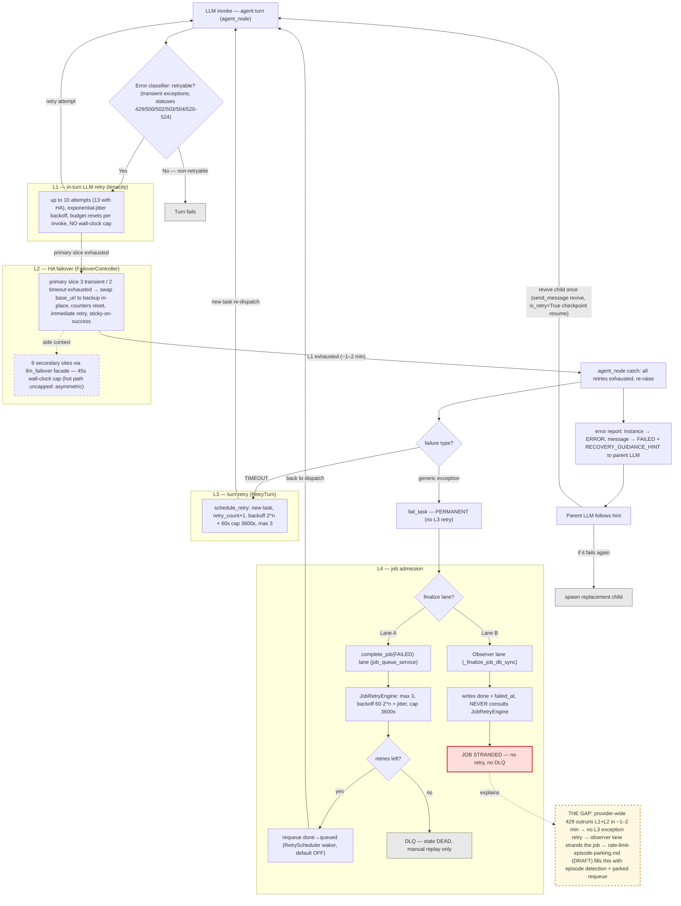

# Retry & Error-Resilience Architecture

| Field | Value |
|---|---|
| **Date** | 2026-08-26 |
| **Status** | Snapshot of current behavior. The companion plan doc is cross-referenced but **not yet implemented**. |
| **Evidence** | All `file:line` anchors verified read-only by investigation on 2026-08-26. Code may drift — re-verify anchors before relying on them. |
| **Related** | [`docs/plans/rate-limit-episode-parking.md`](plans/rate-limit-episode-parking.md) (DRAFT, 2026-08-26 — fills the structural gap described here) · [`docs/retry-architecture-review.md`](retry-architecture-review.md) (historical review, 2026-03-15) · [`docs/bugs/transient-llm-failures-non-retryable-instance-death.md`](bugs/transient-llm-failures-non-retryable-instance-death.md) (2026-08-26 fatality corpus: 47 instance-ERROR events over 7 days, 94% transient-with-zero-retries, proxy ultimate-model escalation) |

---

## 1. Overview — four layers that do not compose

The system has **four retry layers**:

- **L1 — In-turn LLM call retry** (tenacity, wrapped around the hot-path LLM invoke)
- **L2 — Provider HA failover** (`FailoverController` on the hot path + `llm_failover` facade on secondary sites)
- **L3 — Turn/task retry** (`RetryTurn` named transition)
- **L4 — Job admission retry** (`JobRetryEngine` + DLQ)

They do **not** compose into an escalation chain. Each layer was built for a different failure shape, and nothing hands a failure from a fast, cheap layer to a slow, patient one. The canonical case that exposes this: a **provider-wide 429 outage** walks through all four layers in ~1–2 minutes and strands the job — L1+L2 exhaust quickly, L3 has no exception-triggered retry, and the job's finalization lands on the L4 observer lane, which never consults the retry engine. The instance dies `ERROR`, the parent receives misleading recovery advice, and the job strands.

This is the structural hole that [`docs/plans/rate-limit-episode-parking.md`](plans/rate-limit-episode-parking.md) (DRAFT, 2026-08-26; five decision points approved, not implemented) is designed to fill. That plan is cross-referenced throughout §9 — it is **not** current behavior.

---

## 2. End-to-end flow

---

## 3. Layered quick reference

| Layer | Component | Where (`file:line`) | Trigger | Limits & backoff | Terminal outcome |
|---|---|---|---|---|---|
| **L1** | tenacity `Retrying` on the hot-path invoke (`_wire_retry_and_failover`) | `daemon/graph.py:3497-3518`; ceiling `daemon/llm_error_classifier.py:168-182` | Retryable exception or retryable HTTP status (429, 500, 502, 503, 504, 520–524) | ≤10 attempts (13 with HA); `wait_exponential_jitter()`; budget resets per invoke; **no wall-clock cap** | Re-raise (`reraise=True`) → `agent_node` catch → L3 cascade |
| **L2** (hot path) | `FailoverController` primary→backup swap | `daemon/llm_error_classifier.py:298-351, 489-516` | ≥3 transient or ≥2 timeout attempts on the primary slice | Primary cap clamped to the L1 operator budget; counters reset on swap; sticky-on-success | Backup slice drains into the same L1 ceiling → L3 cascade |
| **L2** (facade) | `llm_failover` wrapper on 9 secondary sites | `daemon/services/llm_failover.py:481,520,575,658,806` | Transient failure on a secondary-context LLM call | Facade default 3 attempts / 6 with backup (`:573-574`); **45s wall-clock cap** | Caller-specific degradation (title/keywords/compaction fall back) |
| **L3** | `RetryTurn` named transition (`schedule_retry`) | `daemon/services/turn_transitions.py:556-700`; `daemon/repositories/task/repository.py:2878-3050` | `CancellationReason.TIMEOUT` or StaleTaskRecovery — **only** | `max_retries` default 3; backoff `2^retry_count × 60s` cap 3600s | Generic exceptions: `fail_task` — permanent, no retry |
| **L4** | `JobRetryEngine` → `atomic_retry` | `daemon/services/job_retry_engine.py:145-476`; `daemon/repositories/job_queue/repository.py:1364-1510` | `complete_job(FAILED)` lane **only** (Lane A) | `max_retries` fallback job→queue→config→3 (cap 100); backoff `60·2^retry_count + U(0,30)` cap 3600s | No retries left → DLQ (`DEAD`, manual replay only); observer lane (Lane B): **stranded** |

---

## 4. L1 — In-turn LLM call retry (tenacity)

### Wiring

`_wire_retry_and_failover` at `daemon/graph.py:3497-3518` wires tenacity around the agent-chat LLM invoke:

`Retrying(stop=stop_after_attempt(ceiling), wait=wait_exponential_jitter(), retry=predicate, reraise=True)`

There is **no wall-clock cap** on this hot path (see the L2 asymmetry note below).

### Attempt budget

- Operator defaults: `llm_retry_transient_attempts=10` / `llm_retry_timeout_attempts=3` (`daemon/config.py:388,390`), threaded through `daemon/services/instance_lifecycle.py:1247-1248`.
- **Drift trap:** `daemon/graph.py:3590-3591` carries a divergent hard-coded fallback (8/3), used only if the dict key is missing; the effective production value is **10/3**.
- Ceiling: `derive_ha_attempt_ceiling` (`daemon/llm_error_classifier.py:168-182`) = `max(transient, timeout)` → **10 without HA, 13 with HA**.
- **Correction (drift corrected 2026-08-26):** the "3 primary / 6 with backup" figure is the `llm_failover` **facade** default (`daemon/services/llm_failover.py:573-574`), applying to the 9 secondary sites only — **not** the hot path.

### Retryable classification

- Retryable statuses — `RETRYABLE_STATUS_CODES` (`daemon/llm_error_classifier.py:20`): `{429, 500, 502, 503, 504, 520, 521, 522, 523, 524}`.
- `TRANSIENT_EXCEPTIONS` (`daemon/llm_error_classifier.py:108-138`): `TransientAPIError`, `ConnectionResetError`, `BrokenPipeError`, `ConnectionAbortedError`, `openai.APIConnectionError`, `LLMResponseValidationError`, `MalformedLLMResponseError`, `openai.APIResponseValidationError`; plus `IndexError` **only** when HA is configured (`:459-461`).
- Non-retryable by design: `BadRequestError` (its context-length variant is diverted to reactive compaction at `daemon/graph.py:3219-3260`) and generic `AttributeError`.
- `MalformedLLMResponseError` is raised by the `ThinkingChatOpenAI` type-guard at `daemon/graph.py:2001-2002` (class at `:1927`); it joins the post-compaction exhaustion catch at `daemon/graph.py:3340-3341`.

---

## 5. L2 — Provider HA failover

### FailoverController (hot path)

- Swaps primary→backup by **in-place mutation** of `root_client.base_url` AND `root_async_client.base_url` via public setter (`daemon/llm_error_classifier.py:298-351`); the swap is idempotent.
- Primary slice caps: **≥3 transient or ≥2 timeout attempts → swap** (`:164-165`, `:489-516`); counters reset on swap (W4, `:505-512`); "immediate retry on backup" (`:516`). The primary cap is clamped to the operator budget (W2, `:493-499`).
- **Sticky-on-success:** after a success on backup the controller stays there; return-to-primary happens at the next invoke's FIRST attempt — `reset_to_primary()` at `attempt_number == 1` (`:426-432`), i.e. after one probe request. During a primary outage, invocations alternate backup-full / primary-probe.

### The 9 secondary sites (`llm_failover` facade)

Nine secondary LLM call sites are wrapped via the `daemon/services/llm_failover.py` facade (`wrap_langchain_failover`, `invoke_raw_with_failover`), all with a **45s wall-clock cap** (`llm_failover.py:481,575,658`; enforced `:520,:806`):

| Site | Anchor |
|---|---|
| title generation | `daemon/services/title_generation.py:106` |
| keyword extraction | `daemon/services/keyword_extraction.py:379` |
| compaction (proactive) | `daemon/services/compaction.py:1002` |
| child reports | `daemon/services/child_reports.py:768`, `:1401` |
| skill embedding | `daemon/services/skill_embedding_service.py:325`, `:422` |
| skill evolution | `daemon/services/skill_evolution_service.py:1532` |
| skill search | `daemon/services/skill_search_service.py:776` |

### Wall-clock asymmetry

The asymmetry vs the uncapped hot path is **intentional** (retry-storm protection on side contexts) — but it means a hot-path turn can burn unbounded wall-clock during an outage, bounded only by `task_timeout_minutes=125` (`daemon/config.py:467`).

---

## 6. L3 — Turn/task retry

### Exhaustion cascade (L1+L2 give up)

1. `agent_node` catch at `daemon/graph.py:3340-3346` logs "All retries exhausted" and **re-raises**.
2. → `daemon/services/task_processor.py:422-438` generic except.
3. → `handle_message_processing_error` (`daemon/services/message_processing_errors.py:151-326`).
4. → `_send_error_report` (`daemon/services/error_reporting.py:399-779`): instance → `ERROR` (`:192`), message → `FAILED` (`:201-203`), hierarchy row deleted; the parent envelope gets `RECOVERY_GUIDANCE_HINT` appended (`:739`; hint text `:41-48`).

### No automatic turn retry for generic exceptions

`daemon/services/worker_pool.py:831-836` `_handle_task_failure` → `fail_task`, with the in-code comment: *"For now: fail permanently. Retry-on-error is a separate feature."* There is **no automatic turn retry** for generic exceptions.

### The only automatic task retry: `RetryTurn`

- `schedule_retry` → named transition **RetryTurn** (`daemon/services/turn_transitions.py:556-700`, registered in the canonical `TRANSITIONS` `:717`; implementation `daemon/repositories/task/repository.py:2878-3050`).
- Mechanics: parent task `CANCELLED` with `retry_scheduled=True`; new child task with `retry_count+1`; `next_retry_at = 2^retry_count × 60s`, capped 3600s (`:2882-2883`); `max_retries` default 3 (`daemon/services/worker_pool.py:181`); atomic guarded UPDATE (`:2936-2962`); both work_ids reconciled via `reconcile_turn_mirror`.
- Fired **only** for `CancellationReason.TIMEOUT` (`daemon/services/worker_pool.py:666,754-808`) and StaleTaskRecovery (`daemon/services/stale_task_recovery.py:368,474,727`).

### `is_retry=True` is a checkpoint RESUME, not a retry

- Set when `task.retry_count > 0` or resume_mode metadata (`daemon/services/task_processor.py:332-352`), or cascade-resume (`daemon/manager.py:8839-8895`).
- Reloads the LangGraph checkpoint under the **same** work_id (`daemon/services/instance_messaging.py:3355-3394`).

### Tool errors and the revive path

- Tool errors mid-turn do **not** fail the turn: `ToolNode(tools, handle_tool_errors=True)` at `daemon/graph.py:5546`.
- Revive path: `send_message` to a `COMPLETED`/`TERMINATED`/`ERROR`/`FAILED` instance auto-transitions it to `RUNNING`, reusing the checkpoint (`daemon/services/instance_messaging.py:1505-1541`); `PAUSED` instances are exempt (`:1513-1517`).

---

## 7. L4 — Job admission retry

### Admission state machine

- States: `QUEUED` / `ACTIVE` / `DONE` / `DEAD` (`daemon/repositories/job_queue/models.py:21-48`).
- 8 valid transitions (`daemon/services/job_state_machine.py:53-62`), including `ACTIVE→QUEUED` (retry), `ACTIVE→DEAD` (DLQ), `DEAD→QUEUED` (replay), and `DONE→ACTIVE` (post-commit re-arm, `daemon/services/job_feedback_observer.py:1338-1407`).

### Retry eligibility and the atomic requeue

- `should_retry` requires `admission_state='done'` **AND** `failed_at IS NOT NULL` (`daemon/services/job_retry_engine.py:145-188`).
- `failed_at` live writers: the `reconcile_turn_mirror` CASE (`daemon/repositories/task/repository.py:822-834`) + the observer paused-race amendment (`daemon/services/job_feedback_observer.py:3287-3302`). `fail_job` (`daemon/repositories/job_queue/repository.py:2375`) is **dead code** — zero production callers.
- `maybe_retry` (`daemon/services/job_retry_engine.py:190-476`) → `atomic_retry` (`daemon/repositories/job_queue/repository.py:1364-1510`): guarded done→queued UPDATE, `retry_count+1` in SQL, clears `failed_at`, stamps `next_retry_at = min(60·2^retry_count + U(0,30), 3600)` s (`daemon/services/job_retry_engine.py:73-102`); ineligible → `move_to_dlq` (`:436-442`). `max_retries` falls back job→queue→config→3, capped at 100 (`:104-143`).

### The two-lane asymmetry (headline gap)

- **Lane A — `complete_job(FAILED)`** (`daemon/services/job_queue_service.py:3326-3357` → `:3599`): the **only** lane that consults `JobRetryEngine`.
- **Lane B — observer lane** (`_finalize_job_db_sync`, `daemon/services/job_feedback_observer.py:3249-3302`): finalizes the jobs of instances that die on their own — writes `done` + `failed_at` with **zero** retry-engine references. Such jobs are never auto-retried and never DLQ'd → **stranded**.

### RetryScheduler (the waker)

Opt-in, **default-off** (`daemon/config.py:695` → `daemon/api.py:428-443`). It runs a 60s poll of `find_retryable_jobs` (`daemon/repositories/job_queue/repository.py:2889-2925`) and only **wakes already-requeued jobs** (`admission_state='queued' AND next_retry_at ≤ now`); it never moves done→queued. Single-host `flock`.

### DLQ

- `move_to_dlq` is the only writer of `DEAD`; `replay_from_dlq` is the only `DEAD→QUEUED` path (resets `retry_count=0`, `failed_at=None`, `instance_id=None`).
- 3 manual entry-point surfaces: the DLQ router (`daemon/routers/dlq.py:440`, `:489`), `daemon/routers/jobs_management.py:494`, and the agent-facing tool `daemon/tools/job_queue.py:1128`. **No automatic replay.**
- F9 (deferred): PG-only post-commit re-arm trigger violation.

---

## 8. Terminology: "quick retry"

The phrase **"quick retry" appears nowhere in code, docs, tests, or git history.** It refers to the **"fast retry budget"** coined in [`docs/plans/rate-limit-episode-parking.md:20`](plans/rate-limit-episode-parking.md) — i.e. **L1 + L2 combined**, which exhausts in ~1–2 minutes during a provider-wide outage.

Related phrasing that *does* exist in code: **"immediate retry on backup"** (`daemon/llm_error_classifier.py:516`) — L2's swap-then-retry semantics.

---

## 9. 429 / rate-limit: today vs the parking plan

### Today

429 ∈ `RETRYABLE_STATUS_CODES`, wrapped as `TransientAPIError` (`daemon/llm_error_classifier.py:558-561`) preserving `.status_code` / `.original`. Treatment is **identical to 5xx** — same exponential-jitter wait, **no `Retry-After` honoring**, no body inspection, no 429-specific backoff.

The `'rate_limit'` error-type branch (`daemon/services/message_processing_errors.py:105-106`) is **unreachable in production**: the classifier wraps raw `APIStatusError` before tenacity runs, so the `TransientAPIError` branch (`:136-137`) fires instead — parents see `transient_error` / `warning`, with no distinct signal.

Post-exhaustion cascade: instance `ERROR` → misleading `RECOVERY_GUIDANCE_HINT` during a provider-wide outage (the advice "waiting never works, revive once, spawn replacement" is precisely wrong then; it historically caused replacement storms) → the job strands on the observer lane.

> 📋 **Measured reality (2026-08-26):** the fatality corpus in [`docs/bugs/transient-llm-failures-non-retryable-instance-death.md`](bugs/transient-llm-failures-non-retryable-instance-death.md) shows the dominant fatal shapes **never reach the 429 branch at all** — the proxy delivers rate-limit exhaustion via bare `openai.APIError` (no status code), 200-body `ultimate_model_retry_exhausted` `ValueError`, empty SSE streams (`No generations found in stream.`), and mid-stream `RemoteProtocolError` — all classified non-retryable by the classifier's generic branch (`llm_error_classifier.py:606`), 44/47 instance deaths with zero retries. Additionally the proxy's ultimate-model escalation (3rd identical request by message hash — reached in ~2 s by the openai SDK's default sub-second retries inside one tenacity attempt) collapses the effective L1 budget from 10 attempts to ~1. The parking plan's detection (status-code body matching only) must be widened to these channels; see the bug doc's fix proposal.

### Comparison

| Aspect | Today | Parking plan ([DRAFT 2026-08-26](plans/rate-limit-episode-parking.md), 5 decision points approved, **not implemented**) |
|---|---|---|
| Error class | `TransientAPIError` wrapping 429 (`llm_error_classifier.py:558-561`); body never inspected | New `ProviderRateLimitError(TransientAPIError)` with configurable body patterns (default `['all models rate limited']`) |
| Treatment vs 5xx | Identical — same jitter backoff; no `Retry-After`; no 429-specific backoff | Distinct episode path; L1/L2 stay byte-identical for all non-rate-limit errors (additive-only constraint) |
| Episode clock | None | `rate_limit_first_seen_at` in instance metadata; survives restart |
| Parent signal | `'rate_limit'` branch unreachable (`message_processing_errors.py:105-106`); parent sees `transient_error`/`warning` | Per-attempt reports suppressed during episode + one PARKED notice with deadline |
| Job outcome | Instance `ERROR` → misleading `RECOVERY_GUIDANCE_HINT` → job strands on observer lane | Observer branch requeues parked jobs (`next_retry_at = now + 900s ± 90s`; deferrals don't consume `max_retries`) |
| Terminal outcome | `ERROR` + `transient_error` report | Past deadline → `terminal_reason='rate_limit_deadline'` (new enum; `MIRROR_SET` drift is the top risk) |
| Re-dispatch | None automatic (RetryScheduler default-off; manual `send_message` revive) | Scoped RetryScheduler auto-enable + `send_message` revive → `is_retry=True` resume |
| Fresh start | n/a | Clears episode state |
| Explicitly deferred | — | `Retry-After` honoring; multi-replica anchor; in-process `RateLimitRegistry` |

> ⚠️ The plan (§11) warns future implementers to check for a partial `feature/rate-limit-episode-parking` branch before starting.

---

## 10. Adjacent resilience mechanisms

**LoopDetector / LoopRepairer.** `daemon/graph.py:939-1147` and `:1186-1700`: threshold 3 consecutive identical tool calls, max 3 repairs (`daemon/config.py:920-939`); pipeline stage 6, **before** the LLM call. Note: its threshold-3 forbids agents from implementing their own in-context retry loops — which is why rate-limit patience **can't be solved in-agent**.

**RECOVERY_GUIDANCE_HINT child-revive flow.** Single convergence site `daemon/services/error_reporting.py:739`; all callers funnel through one envelope builder. The "revive once" bound is LLM-instruction-enforced, **not mechanical**. Known issue: it fires on ALL error types including transient/rate-limit — actively harmful during provider outages (gap #7).

**Compaction catch.** Reactive compaction on `ContextLengthExceededError` (`daemon/graph.py:3219-3260`) with a single LLM-call retry (`:3336-3339`); proactive compaction is HA-wrapped (`daemon/services/compaction.py:1002`).

---

## 11. Known gaps & inconsistencies

1. **Layers don't compose into an escalation chain** — the structural hole the parking plan fills.
2. **Observer-lane vs `complete_job`-lane asymmetry** — only one lane consults `JobRetryEngine`.
3. **Hot-path ceiling is 10/13** — the 3/6 figure is the facade default (drift corrected 2026-08-26).
4. **Transient-attempt default ambiguity** — `daemon/config.py:388` = 10 vs the `daemon/graph.py:3590` fallback = 8 (drift trap).
5. **Wall-clock asymmetry** — facade 45s cap; hot path uncapped (bounded only by the 125-min task timeout).
6. **Dead `'rate_limit'` error-type branch** + no `Retry-After` honoring + no 429-specific backoff.
7. **`RECOVERY_GUIDANCE_HINT` fires on all error types** — wrong advice during provider-wide outages (confirmed replacement storm: 15 instances in 4 min, Aug 26 06:51–06:54 — see [`bugs/transient-llm-failures-non-retryable-instance-death.md`](bugs/transient-llm-failures-non-retryable-instance-death.md)).
8. **RetryScheduler default-off** — even Lane A needs the operator to enable the waker.
9. **Stale-anchor warning for future readers** — the type-guard is now `daemon/graph.py:2001-2002` (not `:1826`); the exhaustion catch is `:3340-3341` (not `:3045`).
10. **Non-status transient channels all non-retryable** — bare `openai.APIError`, 200-body `ultimate_model_retry_exhausted`, empty SSE stream, `RemoteProtocolError`/`ReadTimeout` die in the classifier generic branch with zero L1 retries (bug doc above, RC1); proxy ultimate-model escalation collapses the effective L1 budget to ~1 attempt (RC2).

---

## Related documents

- [`docs/bugs/transient-llm-failures-non-retryable-instance-death.md`](bugs/transient-llm-failures-non-retryable-instance-death.md) — fatality corpus (47 events, 2026-08-19→26): why instances actually become ERROR, root causes RC1–RC3, fix proposal.
- [`docs/plans/rate-limit-episode-parking.md`](plans/rate-limit-episode-parking.md) — DRAFT plan that fills the structural gap (§1, §9). Do not treat as implemented.
- [`docs/plans/transient-channel-retry-widening.md`](plans/transient-channel-retry-widening.md) — DRAFT plan fixing gap #10 at L1: makes the four non-status transient channels (bare `APIError`, 200-body `ValueError`, `RemoteProtocolError`, stream-empty) retryable via pattern-matched classification.
- [`docs/retry-architecture-review.md`](retry-architecture-review.md) — historical two-layer review (2026-03-15); predates the current four-layer layout.
- [`docs/retry-proposal.md`](retry-proposal.md), [`docs/task-timeout-retry-design.md`](task-timeout-retry-design.md) — earlier design notes in the same area.
- [`docs/job-queue.md`](job-queue.md) — job-queue surface reference.
