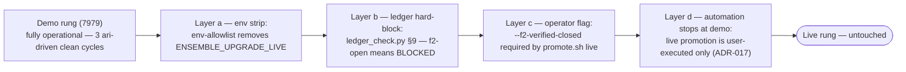
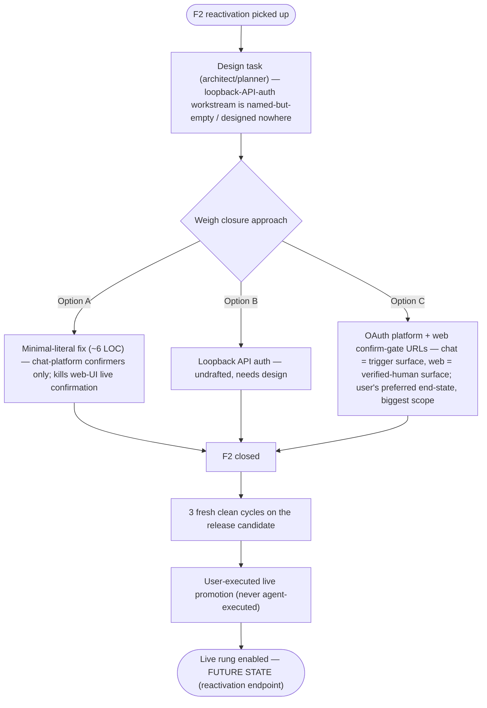

# Self-Upgrade Live Rung — PARKED Decision Record (F2)

- **Date:** 2026-08-24
- **Status:** 🟡 PARKED — deliberate resting state. This is a decision record, not a defect report.
- **Branch context:** authored on `docs/f2-parked-decision` (based on `latest` @ `35fca8fc`).
- **Companion docs:** `docs/runbooks/upgrade-drills.md` §8–§9 · `.agents/shared/planning/self-restart-upgrade-phase2/decisions.md` · `risk-register.md` (R-SR07)

---

## 1. Decision & Date

**F2 closure + live-rung enablement is PARKED as-is (2026-08-24).**

Phase 2 self-restart/self-upgrade is **feature complete** at merge `35fca8fc` (P2.3 promotion ladder + drills, merged and pushed). The demo rung is fully operational — 3 consecutive ari-driven clean cycles banked on the ledger (§7 of the runbook; count axis satisfied, `ELIGIBLE`-pending-F2 proven on the real ledger via both `--f2-state` runs).

The live rung is blocked by **four independent layers**, all intact and all intentional:

1. **Env strip** — the env-allowlist strips `ENSEMBLE_UPGRADE_LIVE`, so the live guard variable cannot reach the daemon via the pipeline.
2. **Ledger §9 hard-block** — `scripts/upgrade/ledger_check.py` emits `BLOCKED` while `f2-open`, regardless of cycle count.
3. **`--f2-verified-closed` flag requirement** — `promote.sh live` refuses without the explicit operator flag (journal token `f2-not-verified`, exit 78); the guard alone is insufficient.
4. **Automation stops at demo** — live promotion is USER-EXECUTED only, permanently (ADR-017; runbook §8).

**State the important part plainly: the resting state is SAFE and INTENTIONAL.** This is not an abandoned or broken state. It is a deliberate parking with four independent blocking layers intact — defense-in-depth, not a single fence waiting to rot.

---

## 2. User's Stated Future Direction (recorded intent — the vision)

The user's view: the real long-term solution is a **bigger scope, not an incremental F2 patch** — a proper **OAuth platform with a human-confirmation gate/UI delivered via web URL**.

- **Flow:** confirmation links are delivered **into chat sources** (Discord / Telegram / Slack / etc. — confirmation is triggerable even from chat); the user clicks the link, authenticates via OAuth, and confirms on the web page.
- **Division of surfaces:** **chat = trigger surface; web = verified-human surface.**
- **Why it resolves F2's core collision:** the web-UI `"api"` origin cannot be distinguished from a localhost forger under the current single-host trust model. OAuth + web confirm-gate makes web confirmation **authenticated by construction** instead of **trust-by-origin**.

This is the **user's preferred end-state** — see reactivation Option C (§5).

---

## 3. Research Findings to Preserve (F2 read-only research, job 58447fe1)

- **No drafted F2 solution exists.** F2 is *named* in 3 places in the codebase but *designed* nowhere.
- The two runbook §9 directions — **forge-lane closure OR loopback auth** — are **both undrafted**.
- The **5-step end-to-end forgery recipe was independently confirmed**: the unauthenticated loopback API can forge user-origin via `POST /jobs` `body.source` (verbatim trust — `daemon/routers/jobs_crud.py:275-278`) and `POST /messages` (stamps `source="api"` — `daemon/routers/messages.py:391`).
- **10 human-origin entry paths mapped:**
  - 4 external in-process adapters are safe / need no carve-out.
  - The web-UI `"api"` origin is **the collision**.
  - `/jobs` source trust + the FE origin selector = **desired breakage**: fixing F2 breaks the web-UI live confirmation flow — this is the known trade-off.
  - 3 fail-closed lanes, including a PAUSED-path gap.
  - The RAM injection lane needs a design decision.
- **Size call:** this is multi-component work (~10 seams). A minimal-literal fix is ~6 LOC but **kills web-UI live confirmation**.
- **In-repo hardening template exists:** `daemon/tools/job_queue.py:527-533` — server-side derivation pattern (caller-supplied `source` never trusted verbatim on that path).

---

## 4. Pointers (cross-references)

| Artifact | Where |
|---|---|
| Critical note `e5a83653` | F2 P2.3 gate risk note (critical-notes system; cited by runbook §9) |
| P2.2 OBS residual | `.agents/shared/planning/self-restart-upgrade-phase2/decisions.md:255` — single-host trust model; whitelist cannot distinguish genuine web-UI human from localhost forger; closes only with an auth boundary on the local API |
| Risk register entry R-SR07 | `.agents/shared/planning/self-restart-upgrade-phase2/risk-register.md:25` (detail §82) — confirmation-gate circumvention |
| Pre-live gate | `docs/runbooks/upgrade-drills.md` §8–§9 |
| Fenced workstream | **U4** (live-read fence) — runbook §8 U-marker map; `promotion-ladder.md` §5 |
| ADR-032 | `.agents/shared/planning/self-restart-upgrade-phase2/decisions.md:205` — `USER_ORIGIN_SOURCES` whitelist |

**ADR-032 scope disclaimer (read before citing it as an F2 fix):** the whitelist makes the gate's anti-forgery *structural at the stamp site*, but the **single-host trust model is otherwise unchanged** (D-FA3.4). It does NOT close the loopback forge lane — that is precisely the F2 residual.

**⚠ Known doc defect (fix-forward note):** wherever the F2 gate is cited as `upgrade_journal.py:714-748`, that citation is **WRONG**. The correct citation is:

- `daemon/tools/upgrade_journal.py:1038-1092` — the `USER_ORIGIN_SOURCES` whitelist (enumeration + rationale; file header block starts exactly at :1038), and
- `daemon/tools/upgrade_tools.py:1910-1935` — the 3-factor gate enforcement (factor 2: server-side user-origin marker).

The `714-748` range is a **different, 2-line fix** slated for a future batch — it is not the gate and not the whitelist.

---

## 5. Reactivation Preconditions (when someone picks this up)

Three options must be weighed:

- **Option A — minimal-literal.** ~6 LOC. Chat-platform confirmers only; **kills web-UI live confirmation** (the known trade-off).
- **Option B — loopback auth.** Undrafted; needs design.
- **Option C — OAuth + web confirm-gate URLs.** The **user's preferred end-state** (§2). Biggest scope: OAuth platform + confirmation UI. Chat = trigger surface, web = verified-human surface.

**Any option first needs the design task (architect/planner)** for the named-but-empty **loopback-API-auth** workstream — F2 is named in 3 places and designed nowhere (§3).

Then the sequence **per the runbook**: F2 closure → fresh 3 clean cycles on the release candidate (staleness rule: qualifying cycles must run on the mechanism being certified, §8.4) → **user-executed** live promotion, never agent-executed. **Live stays untouched until then.**
