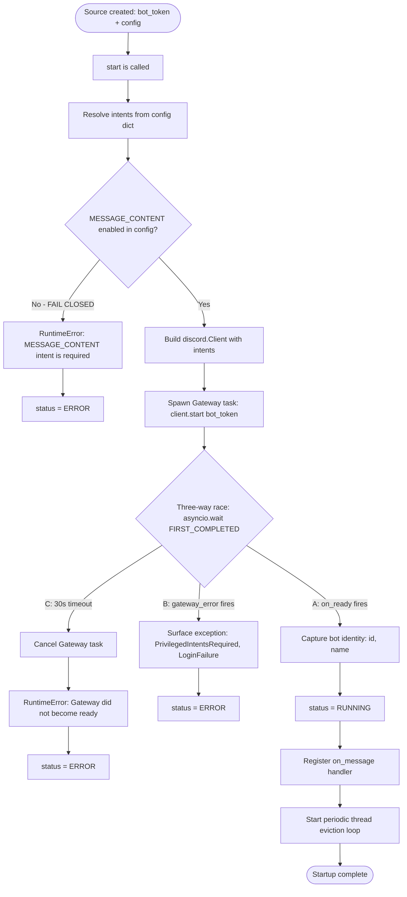

# Discord Setup Guide

This guide walks you through setting up Discord as a message source in Ensemble using a Discord bot with the Gateway (WebSocket) transport.

## Prerequisites

- A Discord account with permission to manage a server
- The ability to create a Discord application in the [Developer Portal](https://discord.com/developers/applications)

## Step 1: Create a Discord Application

1. Go to the [Discord Developer Portal](https://discord.com/developers/applications) and click **New Application**
2. Enter a name for your application (e.g., `Ensemble Bot`) and click **Create**
3. Navigate to the **Bot** tab in the left sidebar
4. This is where you'll configure your bot's token, intents, and permissions in the following steps

## Step 2: Configure Bot Intents and Permissions

Discord uses **Privileged Gateway Intents** to control what event data your bot can access. The Ensemble adapter **requires** the Message Content Intent to read message text — without it, the adapter fails closed and refuses to start.

> ⚠️ **Critical:** The adapter enforces a two-layer gate on the Message Content Intent. It must be enabled **both** in the Discord Developer Portal **and** in your source config. If enabled in config but not the portal, the Discord Gateway rejects the connection with a `PrivilegedIntentsRequired` error at startup.

### Enable Privileged Intents

1. Go to the **Bot** tab in your application settings
2. Scroll down to the **Privileged Gateway Intents** section
3. Enable the intents you need:

| Intent | Required? | Purpose |
|--------|-----------|---------|
| **MESSAGE CONTENT INTENT** | **Yes — Required** | Read message text content. The adapter fails closed without this. |
| SERVER MEMBERS INTENT | Optional | Member lookup and caching features |
| PRESENCE INTENT | Optional | Track member online/offline status |

4. Click **Save Changes**

### Adapter Startup Behavior

The diagram below shows how the adapter validates intents and connects to the Discord Gateway:



### Generate the Bot Invite URL

1. Go to the **OAuth2** tab in your application settings
2. Under **OAuth2 URL Generator**, select the `bot` and `applications.commands` scopes
3. Set the following **Bot Permissions**:

| Permission | Purpose |
|------------|---------|
| Send Messages | Send responses back to channels and DMs |
| Read Message History | Read recent messages in channels |
| View Channels | See channels the bot can access |
| Use Slash Commands | Allow users to use the bot's slash commands (e.g., `/new`) |

4. Copy the generated URL at the bottom — you'll use it in Step 4

> 💡 **Slash Commands:** The `applications.commands` scope is **required** for the bot to register slash commands. If the bot was invited without it, slash commands will never appear — re-invite with the updated URL. After re-inviting, global slash commands may take **up to 1 hour** to propagate. For instant testing, configure `allowed_guild_ids` in the source — the adapter syncs commands to specific guilds immediately on startup.

## Step 3: Get the Bot Token

The bot token authenticates your adapter against the Discord API. Treat it as a secret — it grants full control over your bot.

1. Go to the **Bot** tab in your application settings
2. Under the **Token** section, click **Reset Token** (or **Copy** if one already exists)
3. Copy the token — this is your `bot_token` credential

> ⚠️ **Store the token securely.** Discord only displays the full token once. If you lose it, you must reset it, which invalidates any previous token.

A valid Discord bot token consists of three dot-separated segments, for example: `MTIzNDU2Nzg5.GAbCdE.xxxxxxxx`

## Step 4: Invite the Bot to Your Server

1. Paste the **OAuth2 URL** you copied in Step 2 into your browser
2. Select the server you want to add the bot to from the dropdown
3. Click **Authorize**
4. Complete the CAPTCHA to confirm you're human

The bot should now appear in your server's member list (it may appear offline until you create and start the source in Ensemble).

## Step 5: Create the Source in Ensemble

Create a new Discord source configuration using the API:

```bash
curl -X POST http://localhost:8079/api/v1/sources \
  -H "Content-Type: application/json" \
  -d '{
    "source_id": "discord-main",
    "source_type": "discord",
    "name": "My Discord Bot",
    "enabled": true,
    "credentials": {
      "bot_token": "YOUR_BOT_TOKEN_HERE"
    },
    "config": {
      "agent": "ari",
      "allowed_guild_ids": [],
      "allowed_channels": [],
      "require_mention": true,
      "channel_mention_config": {},
      "ignore_bot_messages": true,
      "allowed_bot_ids": [],
      "strip_llm_artifact_tags": true,
      "intents": {}
    }
  }'
```

Or using the Ensemble CLI:

```bash
ensemble sources create discord \
  --source-id discord-main \
  --bot-token YOUR_BOT_TOKEN_HERE \
  --agent ari \
  --require-mention
```

### Configuration Reference

| Field | Default | Description |
|-------|---------|-------------|
| `agent` | `ari` | The agent that processes incoming Discord messages |
| `allowed_guild_ids` | `[]` (all) | Restrict the bot to specific server IDs. Empty = all servers |
| `allowed_channels` | `[]` (all) | Restrict the bot to specific channel IDs. Empty = all channels |
| `require_mention` | `true` | Whether the bot requires an `@mention` to respond in guild channels (DMs always respond) |
| `channel_mention_config` | `{}` | Per-channel override of the mention requirement (`always_active`, `require_mention`, or `disabled`) |
| `ignore_bot_messages` | `true` | Ignore messages from other bots (except those in `allowed_bot_ids`) |
| `allowed_bot_ids` | `[]` | Bot user IDs allowed to trigger the agent even when `ignore_bot_messages` is true |
| `strip_llm_artifact_tags` | `true` | Strip LLM thinking tags (e.g., `<think>`, `<reasoning>`) before sending responses |
| `intents` | `{}` | Override the default intents (see below). Empty = sensible defaults |

### Default Intents

If `intents` is left empty (`{}`), the adapter uses these defaults:

```json
{
  "guilds": true,
  "guild_messages": true,
  "message_content": true,
  "dm_messages": true
}
```

> **Note:** Even if you specify custom intents, `message_content` must be `true` for the adapter to start. The Message Content Intent must also be enabled in the Discord Developer Portal (Step 2).

## Step 6: Verify Connection

Test that Ensemble can connect to Discord using the bot token:

```bash
curl -X POST http://localhost:8079/api/v1/sources/discord-main/test \
  -H "Content-Type: application/json"
```

You should receive a response like:
```json
{
  "success": true,
  "message": "Connected as Ensemble Bot (id=1234567890123456789)"
}
```

Check the adapter status:

```bash
curl http://localhost:8079/api/v1/sources
```

The Discord adapter should show `status: "running"`.

## Troubleshooting

### "Invalid bot token" error
- Verify your bot token has three dot-separated segments (e.g., `ABC123.DEF456.GHI789`)
- Check that the token hasn't been reset in the Discord Developer Portal
- Ensure you're using a **Bot Token**, not a Client Secret

### "MESSAGE_CONTENT intent is required" error
- This is the adapter's fail-closed guard — it refuses to start without the Message Content Intent
- Enable **MESSAGE CONTENT INTENT** in the Bot tab of the [Developer Portal](https://discord.com/developers/applications)
- If using a custom `intents` config, ensure `"message_content": true` is set

### "PrivilegedIntentsRequired" / Gateway fails to connect
- The Message Content Intent is enabled in config but **not granted in the Developer Portal**
- Go to the **Bot** tab → **Privileged Gateway Intents** → enable **MESSAGE CONTENT INTENT**
- After enabling, restart the source in Ensemble

### Bot not responding to messages
- If `require_mention` is `true` (the default), the bot only responds when explicitly `@mentioned` in guild channels — try mentioning the bot directly
- DMs always respond regardless of `require_mention`
- Check that the bot is in the server and has **View Channels** permission
- Verify the server or channel ID isn't excluded by `allowed_guild_ids` or `allowed_channels`

### Slash commands not appearing (e.g., `/new`)
- Ensure the bot was invited with the `applications.commands` scope — re-invite with the updated OAuth2 URL if it was invited without it
- Global slash command propagation can take up to 1 hour; restart the source or set `allowed_guild_ids` in config for instant guild-specific sync
- Check the adapter logs on startup for a `Synced N slash commands ...` line — if absent or showing a warning, the sync request failed (often due to missing scope or network issues)
- The text-based `/new` (typing `/new` as a regular message) is independent of slash command registration and continues to work as a fallback

### Gateway disconnects / connection refused
- Check your network can reach `discord.com` on the WebSocket (Gateway) port
- The adapter waits up to 30 seconds for the Gateway `on_ready` event — if it times out, the source enters an error state
- Discord may rate-limit or temporarily block connections after repeated failed attempts — wait a few minutes and retry
- Review the Ensemble logs for the specific Gateway error message

## Security Considerations

- Store your bot token securely (environment variables or a secrets manager)
- Never commit your bot token to version control
- Rotate the token periodically by resetting it in the Discord Developer Portal
- Use the principle of least privilege — only enable intents you actually need (MESSAGE CONTENT is required; SERVER MEMBERS and PRESENCE are optional)
- Restrict the bot to specific servers using `allowed_guild_ids` to prevent it from operating in unintended servers
- Use `allowed_channels` to limit which channels the bot can read and respond in
