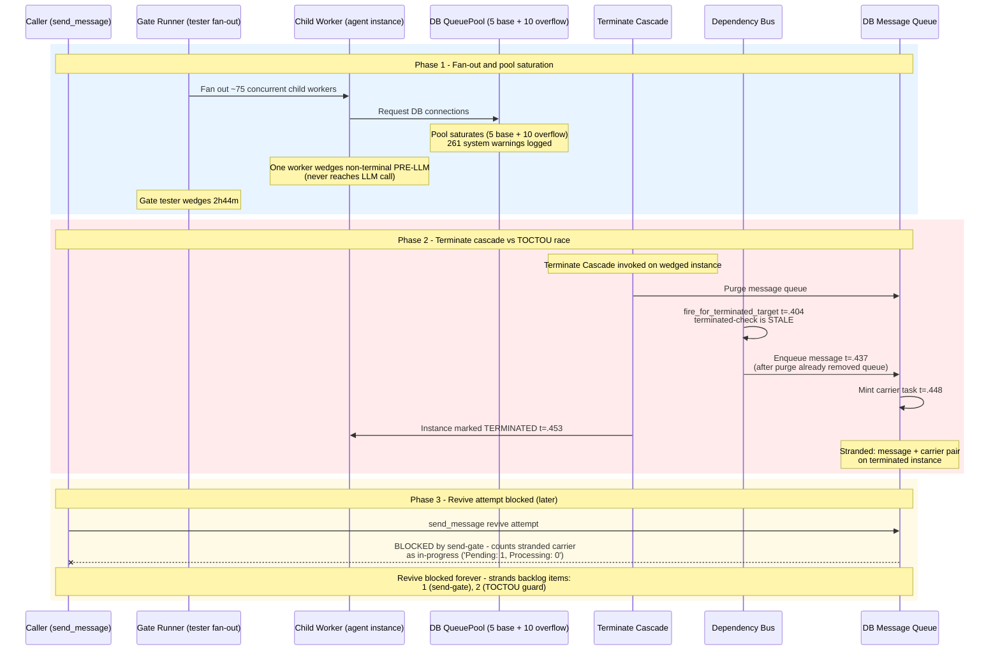
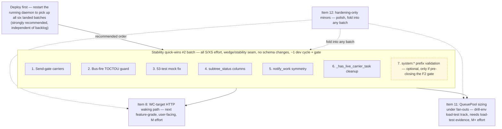

# Instance-Tools Stability Backlog (post 2026-08-29 session)

Snapshot of the stability backlog captured on `latest` @ `4e10980b` (2026-08-29), immediately after six instance-tools batches landed this session (all gates PASS). Self-contained: causes, fix directions, effort/impact, and merge-commit traceability only — no implementation code.

**The running daemon predates all six batches — deploy strongly recommended** (see [Deployment note](#deployment-note)).

---

## Context

> **Status update (2026-08-29, post quick-wins #2):** Items 1–6 have **LANDED** — merge `23bcf1df` (send-gate terminal unblock, bus-fire TOCTOU re-purge, buffer mocks family RESOLVED, subtree_status queued/running columns, notify symmetry complete, hasattr probe). Remaining shelf: items 7–12, with item 7 (`system:*` boundary validation) now the recommended next pick, item 8 the next feature-grade item, item 11 still drill-env. Newly backlogged this batch: `messages.py:601-605` dict-attr 500 (pre-existing, masked by mocks); IN-list preservation test; grouped-SELECT query-plan check.

### Landed this session — six batches, all gates PASS

| # | Batch | Merge commit | Contents |
|---|-------|--------------|----------|
| 1 | agent-instance-tools | `5e98b06a` | `send_message` running-injection + terminal-revive; `subtree_messages` tool |
| 2 | instance-quick-wins | `ad1018e9` | `set_injection` source provenance; revive-once guard; planner/tester opt-in |
| 3 | waiting-children-watchdog | `22d03844` | hourly hang detection + wake notices |
| 4 | W1 serialization | `31981df5` | `injected_message`/`context_kind`/`source` through `serialize_message`; structured D12 |
| 5 | subtree_status | `2ba78315` | token-cheap subtree overview + orphan-guarded pending counts |
| 6 | reconciler wedge-fix | `4e10980b` | Pattern (d) per-work linkage; alive-guard; sub-shape (c) carrier revival; watchdog wedge backstop |

Reference: gate records in `.agents/tester/RESULTS/`, decisions in `.agents/shared/planning/agent-instance-tools/decisions.md` (full list under [References](#references)).

### Incident 2026-08-29 — why this backlog exists

During this session's gate, the **gate tester wedged for 2h44m**:

- **Incident root:** a child worker got stuck non-terminal **PRE-LLM** on DB QueuePool exhaustion — pool 5+10 saturated by a 75-worker fan-out, with 261 system warnings logged. This is backlog item 11.
- **Complication:** the subsequent terminate cascade hit a **bus-fire TOCTOU**, leaving a **stranded carrier** on the terminated instance. This stranded pair is the source of backlog items 1 and 2 below.

---

## Backlog — ranked by ease × impact

Reading guide: Effort scale `XS < S < M < M+`; Impact ⭐⭐⭐ = highest. Priorities 1–3 carry medals as the session's top-ranked picks.

| Priority | Item | Cause | Fix direction | Effort | Impact |
|----------|------|-------|---------------|--------|--------|
| 1 🥇 | Send-gate: ignore carriers on terminal instances | Stranded pending carrier on a terminated instance blocks `send_message` (revive path) forever — reports `Pending: 1, Processing: 0`; never self-heals | Send-gate counts only carriers on non-terminal instances as in-progress | S | ⭐⭐⭐ protects revive capability after cascades |
| 2 🥈 | Bus-fire terminate-cascade TOCTOU guard | Dependency-bus fire enqueues after cascade purge removed the queue → stranded message+carrier rows (fire .404 → enqueue .437 → carrier .448 → terminated .453) | Re-check target-terminated inside `fire_for_terminated_target` (skip enqueue) or re-purge post-fire | S | ⭐⭐⭐ kills stranded-pair class at source |
| 3 🥉 | 53-test `buffer_response_header` mock fix | Base commit `85ae6e72` (X-LLM-Buffer-Response header) added production config reads without updating 5 test files' mocks → 53 quarantined failures, noise in every gate | Add attribute to the 5 mocks or `getattr`-harden prod reads (mechanical; ownership: CF-125s lineage) | XS | ⭐⭐ green-tree hygiene |
| 4 | subtree_status queued/running columns (Finding-3) | Pending column shows queued-only → busy RUNNING child renders 0, parents misread idle | Rename to `queued` + add `running` count (same batched query) | S | ⭐⭐ prevents wrong coordination decisions |
| 5 | Sub-shape (b) `notify_work` symmetry | `task_only_create` mints carrier without notify → delivery waits for next poll (delay not wedge; backstop compensates) | `notify_work` after commit, mirroring the c_revival pattern | S | ⭐⭐ faster wakeups |
| 6 | Mock-aware branches in `_has_live_carrier_task` | `except AttributeError → True` fallbacks shaped for test mocks → breadth in a wedge predicate | `hasattr` probe or proper fixture seam | S | ⭐⭐ cleanliness in correctness-critical predicate |
| 7 | `system:*` boundary validation (F2 family) | No prefix validation at HTTP boundary → forged `source='system:*'` gets internal-branch behavior; inert today (loopback) but blocks the live rung | Reject `system:*` / `internal_*` prefixes on external input | S | ⭐⭐⭐ when going live |
| 8 | WC-target HTTP waking path | User messages to WC-parked instances land in RAM FIFO, never wake parent (hourly watchdog only backstop) | Route WC-target HTTP sends through `enqueue_message` wake primitive | M | ⭐⭐⭐ best user-facing item |
| 9 | SSE-echo provenance | Live SSE bubbles construct `HumanMessage` without kwargs → no source/context flags while persisted view has them | Thread `entry_source` into echo `additional_kwargs` | S | ⭐⭐ UI parity |
| 10 | Structural paired-Task sync-cancel | Cancel writes JobItem terminal but leaves paired Task pending ≤5min (reconciler heals; read-side guard papers over) | `reconcile_terminal_task` synchronously in terminal-write paths | M | ⭐⭐ data hygiene |
| 11 | QueuePool sizing under fan-outs | Pool 5+10 saturated at ~75 concurrent workers → children wedge pre-LLM (the incident root) | Pool sizing + acquire-timeout + fan-out caps — needs load-test evidence to tune | M+ | ⭐⭐⭐ prevents incident class at scale (drill-env task) |
| 12 | Hardening-only minors | Pattern (a) per-instance symmetry (verified non-wedging); PAUSED-revival symmetry (verified benign); docstring nits | Symmetry cleanup + docstring fixes — polish only, both shapes verified non-wedging/benign | XS–S | ⭐ polish |

---

## Recommended next batch

- **"Stability quick-wins #2" = items 1–6** (+ item 7 if pre-closing the F2 gate is wanted): all S/XS, all in the wedge/stability seam proven by this session, no schema changes, ~1 dev cycle + gate.
- **Item 8** — next feature-grade item (user-facing).
- **Item 11** — drill-env load-test task, not a quick win.

---

## Dropped — record, do not resurrect without user request

Numbering below refers to the session's proposal list, **not** the backlog priorities above.

| Proposal (session list) | Dropped because |
|--------------------------|-----------------|
| #6 broadcast send | user-dropped |
| #2 `resume_instance` tool | authority decision: operator-only |
| #9 mid-run progress taps | `subtree_messages` partially covers |

---

## Deployment note

The running daemon predates all six batches. Restart picks up:

- both watchdogs (hang + wedge)
- carrier revival — wedged parents self-heal ≤5min
- revive-once guard
- `subtree_status` / `subtree_messages`
- structured D12
- provenance
- paused-race fix `f5e4b79a`
- CF streaming fix

Optional 2-row cleanup if reviving wedged tester `77ab8ab2` is ever needed: task `25725` + `message_queue` row `f6ff733b` (daemon paused).

---

## References

- Gate records (`.agents/tester/RESULTS/`):
  - `2026-08-26-agent-instance-tools-phase1-gate.md`, `2026-08-27-agent-instance-tools-phase2-gate.md` — batch 1, agent-instance-tools (`5e98b06a`)
  - `2026-08-27-instance-quick-wins-gate.md` — batch 2, instance-quick-wins (`ad1018e9`)
  - `2026-08-27-waiting-children-watchdog-gate.md` — batch 3, waiting-children-watchdog (`22d03844`)
  - `2026-08-28-injection-marker-serialization-gate.md` — batch 4, W1 serialization (`31981df5`)
  - `2026-08-28-subtree-status-tool-gate.md` — batch 5, subtree_status (`2ba78315`)
  - `2026-08-29-reconciler-wedge-fix-gate.md` — batch 6, reconciler wedge-fix (`4e10980b`)
- Decisions: `.agents/shared/planning/agent-instance-tools/decisions.md`
